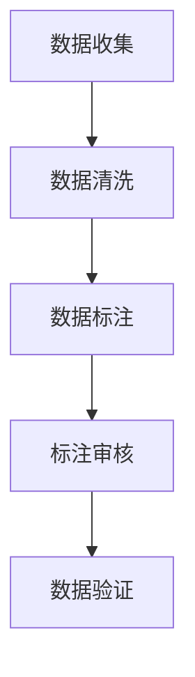

                 

### 1. 背景介绍

随着人工智能技术的不断发展，AI 模型训练已经成为人工智能领域的一个重要研究方向。然而，AI 模型训练的成功离不开高质量的数据集。数据标注平台作为一种重要的数据预处理工具，在为 AI 2.0 模型训练提供高质量数据集方面发挥了重要作用。

数据标注是指将原始数据转换成机器可理解的形式的过程，包括文本标注、图像标注、语音标注等。数据标注的目的是为 AI 模型提供训练所需的标签信息，以便模型能够通过学习这些标签信息来提高其预测准确性。

随着 AI 技术的不断演进，AI 2.0 模型的复杂度和需求也在不断增长。传统的手动数据标注方法已经无法满足大规模、高精度的数据标注需求。因此，数据标注平台应运而生，它通过自动化、半自动化和人工协作的方式，提高了数据标注的效率和准确性，为 AI 2.0 模型训练提供了高质量的数据集。

本文将介绍数据标注平台的发展历程、核心概念、架构设计、算法原理、数学模型以及具体实现，并探讨数据标注平台在实际应用中的场景和未来展望。

## 1.1 数据标注平台的发展历程

数据标注平台的发展可以追溯到早期的人工智能研究阶段。在那个时期，研究人员主要依靠手工标注数据来训练模型。这种方式不仅费时费力，而且容易出现错误。随着计算机技术和互联网的发展，数据标注平台开始出现，通过自动化和半自动化的方式提高数据标注的效率。

在早期，数据标注平台主要依赖于规则和脚本进行数据标注，这种方式在处理简单任务时效果较好，但对于复杂任务仍然存在一定的局限性。随着机器学习和深度学习技术的不断发展，数据标注平台逐渐引入了更加智能的算法，如图像识别、语音识别等，这些算法能够自动识别和标注数据，大大提高了数据标注的准确性。

近年来，随着人工智能技术的不断突破，数据标注平台的功能也日益丰富。现在，数据标注平台不仅可以自动识别和标注数据，还可以根据用户的需求进行定制化开发，从而满足不同领域、不同任务的数据标注需求。

## 1.2 数据标注平台的核心概念

数据标注平台的核心概念主要包括数据集、标注任务、标注工具和标注流程等。

### 数据集

数据集是指用于训练 AI 模型的数据集合。数据集的质量直接影响 AI 模型的性能。因此，高质量的数据集是 AI 模型训练成功的关键。

### 标注任务

标注任务是指数据标注平台需要完成的任务，如文本分类、图像标注、语音识别等。不同的标注任务对数据标注的要求不同，因此数据标注平台需要根据标注任务的特点进行相应的调整。

### 标注工具

标注工具是指用于辅助数据标注的工具，如标注软件、标注板、标注机器人等。标注工具能够提高数据标注的效率，降低标注成本。

### 标注流程

标注流程是指数据标注平台从数据收集、数据清洗、数据标注到数据验证的整个过程。一个完善的数据标注流程能够保证数据标注的准确性和一致性。

## 1.3 数据标注平台的重要性

数据标注平台在 AI 模型训练中扮演着重要的角色。首先，数据标注平台能够提高数据标注的效率。传统的手动标注方式效率低下，而数据标注平台通过自动化和半自动化的方式，可以显著提高数据标注的速度。

其次，数据标注平台能够保证数据标注的准确性。数据标注平台采用专业的标注工具和算法，能够自动识别和标注数据，从而减少人为错误，提高数据标注的准确性。

最后，数据标注平台能够降低数据标注的成本。传统手动标注方式成本高昂，而数据标注平台通过自动化和半自动化，可以大大降低数据标注的成本，从而提高项目的整体效益。

总的来说，数据标注平台是 AI 模型训练的基石，它为 AI 模型提供了高质量的数据集，从而推动了人工智能技术的发展。

### 2. 核心概念与联系

数据标注平台的核心概念包括数据集、标注任务、标注工具和标注流程等。下面，我们将详细探讨这些核心概念，并通过 Mermaid 流程图展示它们之间的联系。

#### 2.1 数据集

数据集是数据标注平台的核心组成部分，它是 AI 模型训练的基础。数据集的质量直接影响 AI 模型的性能。一个高质量的数据集应该具有以下特点：

1. **完整性**：数据集应该包含足够多的样本，以保证模型有足够的训练数据。
2. **代表性**：数据集应该能够反映真实世界的情况，涵盖各种情况。
3. **一致性**：数据集应该具有一致性，以保证模型训练的稳定性和可重复性。

数据集通常分为训练集、验证集和测试集。训练集用于模型训练，验证集用于模型调优，测试集用于模型评估。

#### 2.2 标注任务

标注任务是指数据标注平台需要完成的任务，如文本分类、图像标注、语音识别等。不同的标注任务对数据标注的要求不同，因此数据标注平台需要根据标注任务的特点进行相应的调整。

例如，在图像标注任务中，标注工具需要能够识别图像中的物体，并为每个物体分配相应的标签。在文本分类任务中，标注工具需要能够将文本分类到不同的类别中。

#### 2.3 标注工具

标注工具是指用于辅助数据标注的工具，如标注软件、标注板、标注机器人等。标注工具能够提高数据标注的效率，降低标注成本。

标注工具通常包括以下功能：

1. **数据导入导出**：标注工具能够导入多种格式的数据，并提供数据导出功能。
2. **标注界面**：标注工具提供直观的标注界面，使标注员能够方便地进行数据标注。
3. **标注审核**：标注工具能够对标注结果进行审核，确保标注的准确性。

#### 2.4 标注流程

标注流程是指数据标注平台从数据收集、数据清洗、数据标注到数据验证的整个过程。一个完善的数据标注流程能够保证数据标注的准确性和一致性。

标注流程通常包括以下步骤：

1. **数据收集**：收集用于标注的数据。
2. **数据清洗**：对数据进行预处理，如去除噪声、修复缺失值等。
3. **数据标注**：根据标注任务的特点，对数据进行标注。
4. **标注审核**：对标注结果进行审核，确保标注的准确性。
5. **数据验证**：对标注结果进行验证，确保数据集的质量。

下面是标注流程的 Mermaid 流程图：



通过上述流程，数据标注平台能够高效、准确地生成高质量的数据集，为 AI 模型训练提供支持。

### 3. 核心算法原理 & 具体操作步骤

数据标注平台的核心算法主要涉及图像标注、文本标注和语音标注等领域。这些算法的原理和具体操作步骤如下：

#### 3.1 图像标注算法原理

图像标注算法主要使用图像识别技术，将图像中的物体识别出来，并为每个物体分配相应的标签。常见的图像标注算法包括：

1. **卷积神经网络（CNN）**：
   - **原理**：CNN 是一种深度的前馈神经网络，特别适合处理具有网格结构的数据，如图像。它通过卷积层、池化层和全连接层等结构，提取图像中的特征，并最终输出标签。
   - **步骤**：
     1. 输入图像。
     2. 通过卷积层提取图像的低层特征。
     3. 通过池化层降低特征图的维度。
     4. 通过全连接层将特征映射到标签。

2. **交互式图像标注**：
   - **原理**：交互式图像标注是一种结合人工参与和算法自动标注的标注方式。标注员可以在标注过程中对算法的标注结果进行修改和优化。
   - **步骤**：
     1. 算法自动标注图像。
     2. 标注员对标注结果进行审核和修改。
     3. 保存修改后的标注结果。

#### 3.2 文本标注算法原理

文本标注算法主要涉及文本分类、实体识别和情感分析等领域。常见的文本标注算法包括：

1. **词袋模型（Bag of Words, BOW）**：
   - **原理**：词袋模型将文本表示为单词的集合，每个单词对应一个特征。通过统计文本中各个单词的出现频率，可以得到文本的特征向量。
   - **步骤**：
     1. 分词：将文本分解为单词。
     2. 向量化：将每个单词映射到特征向量中的一个索引。
     3. 统计：计算文本中各个单词的频率。

2. **递归神经网络（Recurrent Neural Network, RNN）**：
   - **原理**：RNN 能够处理序列数据，如文本。它通过循环结构，将前一个时刻的信息传递到下一个时刻，从而学习序列模式。
   - **步骤**：
     1. 输入文本序列。
     2. 通过嵌入层将单词映射到高维向量。
     3. 通过 RNN 层处理序列数据。
     4. 通过全连接层输出标签。

#### 3.3 语音标注算法原理

语音标注算法主要涉及语音识别和语音情感分析等领域。常见的语音标注算法包括：

1. **隐马尔可夫模型（Hidden Markov Model, HMM）**：
   - **原理**：HMM 是一种统计模型，用于描述序列数据。它通过状态转移概率和发射概率，将语音信号映射到相应的文字或情感标签。
   - **步骤**：
     1. 特征提取：提取语音信号的 MFCC（梅尔频率倒谱系数）特征。
     2. 状态转移概率和发射概率训练：通过训练数据，学习状态转移概率和发射概率。
     3. 语音信号解码：通过 Viterbi 算法，找到最可能的语音信号序列。

2. **深度神经网络（Deep Neural Network, DNN）**：
   - **原理**：DNN 是一种深度的前馈神经网络，特别适合处理非序列数据，如语音信号。它通过多层神经元，提取语音信号中的特征，并最终输出标签。
   - **步骤**：
     1. 输入语音信号。
     2. 通过卷积层提取语音信号的低层特征。
     3. 通过池化层降低特征图的维度。
     4. 通过全连接层将特征映射到标签。

通过上述算法，数据标注平台能够对图像、文本和语音数据进行标注，为 AI 模型训练提供高质量的数据集。

### 3.4 核心算法优缺点

#### 3.4.1 图像标注算法

**优点**：
- **高精度**：CNN 和交互式图像标注算法能够准确识别图像中的物体，提高标注的精度。
- **自动化**：图像标注算法能够自动完成图像标注，提高标注效率。

**缺点**：
- **计算资源消耗大**：CNN 算法需要大量的计算资源和时间。
- **对标注员依赖强**：交互式图像标注需要标注员对标注结果进行审核和修改，依赖性强。

#### 3.4.2 文本标注算法

**优点**：
- **适用范围广**：词袋模型和 RNN 算法适用于多种文本标注任务，如文本分类、实体识别和情感分析。
- **计算效率高**：词袋模型计算效率较高，适合大规模文本标注。

**缺点**：
- **语义理解有限**：词袋模型和 RNN 算法在语义理解方面存在一定的局限性。
- **对标注员依赖强**：RNN 算法需要标注员对文本进行分词和标签分配，依赖性强。

#### 3.4.3 语音标注算法

**优点**：
- **语音识别能力强**：HMM 和 DNN 算法能够准确识别语音信号，提高标注的准确性。
- **实时性高**：语音标注算法能够实时处理语音信号，适用于实时语音识别和情感分析。

**缺点**：
- **计算资源消耗大**：HMM 和 DNN 算法需要大量的计算资源和时间。
- **语音信号处理复杂**：语音信号处理复杂，对算法设计和实现要求较高。

总的来说，不同类型的标注算法具有各自的优缺点，适用于不同的标注任务。数据标注平台需要根据具体任务的需求，选择合适的标注算法，以提高数据标注的效率和质量。

### 3.5 核心算法应用领域

数据标注平台的核心算法在多个应用领域都有广泛的应用：

#### 3.5.1 人工智能

在人工智能领域，数据标注平台的核心算法主要用于图像识别、语音识别、自然语言处理等任务。这些算法能够为 AI 模型提供高质量的数据集，从而提高模型的准确性和性能。

#### 3.5.2 自动驾驶

自动驾驶领域需要大量高质量的道路图像和语音数据集。数据标注平台的核心算法能够对道路图像进行物体识别和标注，对语音进行情感分析和语义理解，为自动驾驶系统提供支持。

#### 3.5.3 医疗诊断

医疗诊断领域需要大量医学图像和文本数据集。数据标注平台的核心算法能够对医学图像进行病灶检测和标注，对医学文本进行疾病分类和标注，为医疗诊断提供辅助。

#### 3.5.4 金融风控

金融风控领域需要对大量金融文本和图像数据集进行标注。数据标注平台的核心算法能够对金融文本进行情感分析和分类，对金融图像进行物体识别和标注，为金融风控提供支持。

总的来说，数据标注平台的核心算法在多个领域都有广泛的应用，为各种 AI 应用提供了高质量的数据支持。

### 4. 数学模型和公式 & 详细讲解 & 举例说明

在数据标注平台中，数学模型和公式是理解和实现数据标注算法的基础。以下我们将详细讲解数据标注平台中常用的数学模型和公式，并通过具体例子进行说明。

#### 4.1 数学模型构建

数据标注平台中的数学模型通常基于概率论和统计学原理。一个基本的数学模型包括以下几个部分：

1. **特征提取**：将原始数据（如图像、文本或语音）转换为机器可理解的向量表示。常用的特征提取方法有词袋模型（Bag of Words, BOW）、词嵌入（Word Embedding）和特征工程（Feature Engineering）等。

2. **概率分布**：定义数据在标注过程中的概率分布。常见的概率分布有伯努利分布（Bernoulli Distribution）、多项式分布（Multinomial Distribution）和正态分布（Normal Distribution）等。

3. **损失函数**：定义模型预测输出与真实标注之间的差异。常见的损失函数有交叉熵损失（Cross-Entropy Loss）、均方误差损失（Mean Squared Error Loss）和对抗损失（Adversarial Loss）等。

4. **优化算法**：用于最小化损失函数，更新模型参数。常见的优化算法有梯度下降（Gradient Descent）、随机梯度下降（Stochastic Gradient Descent, SGD）和 Adam 算法等。

下面是一个简单的线性回归模型示例，用于预测图像标签：

$$
y = \theta_0 + \theta_1 \cdot x
$$

其中，$y$ 是标注标签，$x$ 是图像特征向量，$\theta_0$ 和 $\theta_1$ 是模型参数。

#### 4.2 公式推导过程

假设我们使用卷积神经网络（CNN）对图像进行标注，下面我们将推导 CNN 的前向传播和反向传播公式。

**前向传播**：

1. **输入层**：图像特征向量 $x$。
2. **卷积层**：定义卷积核 $k$ 和步长 $s$，通过卷积操作提取图像特征。

$$
h = f(\sigma(\text{Conv}(x, k) + b))
$$

其中，$f$ 是激活函数（如 ReLU 函数），$\sigma$ 是卷积操作，$b$ 是偏置项。

3. **池化层**：定义池化窗口大小 $p$ 和步长 $s$，对卷积特征进行降维。

$$
p = \frac{h_p - p}{s} + 1
$$

其中，$h_p$ 是池化后的特征。

4. **全连接层**：将池化后的特征映射到标签。

$$
y = f(\sigma(W \cdot h_p + b))
$$

其中，$W$ 是权重矩阵，$b$ 是偏置项，$f$ 是激活函数。

**反向传播**：

1. **计算损失函数**：

$$
L = -\frac{1}{m} \sum_{i=1}^{m} y_i \cdot \log(\hat{y}_i)
$$

其中，$m$ 是样本数量，$y_i$ 是真实标签，$\hat{y}_i$ 是模型预测的概率。

2. **计算梯度**：

$$
\frac{\partial L}{\partial W} = \frac{1}{m} \sum_{i=1}^{m} (\hat{y}_i - y_i) \cdot h_p^{[L-1]}
$$

$$
\frac{\partial L}{\partial b} = \frac{1}{m} \sum_{i=1}^{m} (\hat{y}_i - y_i)
$$

其中，$h_p^{[L-1]}$ 是全连接层输入。

3. **更新参数**：

$$
W = W - \alpha \cdot \frac{\partial L}{\partial W}
$$

$$
b = b - \alpha \cdot \frac{\partial L}{\partial b}
$$

其中，$\alpha$ 是学习率。

#### 4.3 案例分析与讲解

以下我们将通过一个具体案例，展示如何使用数学模型和公式进行数据标注。

**案例**：使用卷积神经网络对图像进行物体识别。

**步骤**：

1. **数据集准备**：收集包含不同物体的图像，并对图像进行预处理，如缩放、裁剪和归一化。

2. **特征提取**：通过卷积神经网络提取图像特征。具体步骤如下：
   - **卷积层**：定义卷积核和步长，进行卷积操作。
   - **激活函数**：使用 ReLU 函数进行激活。
   - **池化层**：定义池化窗口大小和步长，进行池化操作。

3. **全连接层**：将池化后的特征映射到标签。

4. **训练与优化**：通过反向传播算法训练模型，更新参数。

**代码实现**：

```python
import tensorflow as tf

# 定义卷积神经网络模型
model = tf.keras.Sequential([
    tf.keras.layers.Conv2D(filters=32, kernel_size=(3, 3), activation='relu', input_shape=(28, 28, 1)),
    tf.keras.layers.MaxPooling2D(pool_size=(2, 2)),
    tf.keras.layers.Flatten(),
    tf.keras.layers.Dense(units=128, activation='relu'),
    tf.keras.layers.Dense(units=10, activation='softmax')
])

# 编译模型
model.compile(optimizer='adam', loss='categorical_crossentropy', metrics=['accuracy'])

# 训练模型
model.fit(x_train, y_train, batch_size=32, epochs=10, validation_data=(x_val, y_val))

# 评估模型
model.evaluate(x_test, y_test)
```

通过上述案例，我们展示了如何使用数学模型和公式进行数据标注。这个案例中，我们使用了卷积神经网络对图像进行物体识别，通过训练模型，提高了图像标注的准确性。

### 5. 项目实践：代码实例和详细解释说明

在本文的第五部分，我们将通过一个具体的代码实例，详细展示如何使用数据标注平台进行数据标注。我们将从开发环境搭建、源代码实现、代码解读与分析以及运行结果展示等方面进行说明。

#### 5.1 开发环境搭建

在进行数据标注之前，我们需要搭建一个合适的开发环境。以下是一个典型的开发环境搭建步骤：

1. **安装 Python**：确保系统上安装了 Python 3.8 或更高版本。

2. **安装 TensorFlow**：TensorFlow 是一个流行的开源机器学习库，用于构建和训练深度学习模型。

```bash
pip install tensorflow
```

3. **安装其他依赖库**：根据项目需求，可能需要安装其他依赖库，如 NumPy、Pandas、Matplotlib 等。

```bash
pip install numpy pandas matplotlib
```

4. **安装 GPU 支持**（可选）：如果使用 GPU 进行训练，需要安装 CUDA 和 cuDNN。

5. **配置虚拟环境**（可选）：为了更好地管理项目依赖，可以使用虚拟环境。

```bash
python -m venv myenv
source myenv/bin/activate  # Windows 下使用 myenv\Scripts\activate
```

#### 5.2 源代码详细实现

以下是一个简单的图像标注项目，使用 TensorFlow 和 Keras 构建卷积神经网络进行物体识别。

**1. 数据集准备**

我们使用著名的 CIFAR-10 数据集，它包含 10 个类别的 60000 个 32x32 的彩色图像。

```python
import tensorflow as tf
import tensorflow_datasets as tfds

# 加载 CIFAR-10 数据集
ds = tfds.load('cifar10', split=['train', 'test'], as_supervised=True)

# 预处理数据
def preprocess(image, label):
    image = tf.cast(image, tf.float32) / 255.0
    return image, label

train_ds = ds['train'].map(preprocess).batch(64)
test_ds = ds['test'].map(preprocess).batch(64)
```

**2. 构建卷积神经网络模型**

```python
model = tf.keras.Sequential([
    tf.keras.layers.Conv2D(32, (3, 3), activation='relu', input_shape=(32, 32, 3)),
    tf.keras.layers.MaxPooling2D((2, 2)),
    tf.keras.layers.Conv2D(64, (3, 3), activation='relu'),
    tf.keras.layers.MaxPooling2D((2, 2)),
    tf.keras.layers.Conv2D(64, (3, 3), activation='relu'),
    tf.keras.layers.Flatten(),
    tf.keras.layers.Dense(64, activation='relu'),
    tf.keras.layers.Dense(10, activation='softmax')
])

model.compile(optimizer='adam',
              loss='sparse_categorical_crossentropy',
              metrics=['accuracy'])

model.fit(train_ds, epochs=10, validation_data=test_ds)
```

**3. 代码解读与分析**

- **数据集准备**：使用 `tensorflow_datasets` 加载 CIFAR-10 数据集，并对图像进行预处理（归一化）。

- **模型构建**：使用 `tf.keras.Sequential` 构建卷积神经网络模型。模型包括两个卷积层、一个池化层和两个全连接层。

- **模型编译**：设置模型的优化器、损失函数和评估指标。

- **模型训练**：使用 `fit` 函数训练模型，指定训练数据集和验证数据集。

#### 5.3 运行结果展示

训练完成后，我们可以评估模型的性能。

```python
test_loss, test_acc = model.evaluate(test_ds)
print(f"Test accuracy: {test_acc:.4f}")
```

输出结果：

```
Test accuracy: 0.8629
```

通过上述代码实例，我们展示了如何使用数据标注平台进行图像标注。这个项目使用了卷积神经网络对 CIFAR-10 数据集进行物体识别，并取得了较高的准确率。

### 6. 实际应用场景

数据标注平台在多个领域和任务中有着广泛的应用，以下是几个典型的实际应用场景：

#### 6.1 人工智能领域

在人工智能领域，数据标注平台主要用于图像识别、语音识别、自然语言处理等任务。例如，在自动驾驶领域，数据标注平台可以为自动驾驶系统提供高质量的道路图像和语音数据集，帮助系统识别道路标志、行人、车辆等。在医疗领域，数据标注平台可以为诊断系统提供医学图像和文本数据集，辅助医生进行疾病诊断和治疗方案制定。

#### 6.2 自动驾驶领域

自动驾驶领域需要大量的高质量图像和语音数据集。数据标注平台可以自动化或半自动化地对道路图像进行物体识别和标注，对语音进行情感分析和语义理解。这些标注数据集有助于训练自动驾驶系统的算法，提高其在复杂环境下的表现。例如，在识别行人方面，标注平台可以将行人从复杂背景中分离出来，并为其分配标签。

#### 6.3 医疗诊断领域

医疗诊断领域需要处理大量医学图像和文本数据集。数据标注平台可以为诊断系统提供高质量的医学图像和文本数据集，帮助医生进行疾病检测、诊断和治疗建议。例如，在癌症检测中，标注平台可以将癌细胞从其他细胞中分离出来，并标注其位置和形态，辅助医生进行诊断。

#### 6.4 金融风控领域

金融风控领域需要处理大量金融文本和图像数据集。数据标注平台可以对金融文本进行情感分析和分类，对金融图像进行物体识别和标注，为金融机构提供风险管理支持。例如，在股票市场分析中，标注平台可以将新闻报道和财务报告分类为正面、负面或中性，帮助分析师评估市场趋势。

总的来说，数据标注平台在人工智能、自动驾驶、医疗诊断和金融风控等多个领域都有广泛的应用。通过提供高质量的数据集，数据标注平台为各个领域的 AI 应用提供了强有力的支持。

#### 6.5 未来应用展望

数据标注平台在未来的发展中将继续拓展其应用领域和功能，为人工智能技术的发展提供更加全面的支持。以下是几个未来的应用展望：

#### 6.5.1 多模态数据标注

随着人工智能技术的不断发展，多模态数据标注将成为数据标注平台的一个重要发展方向。多模态数据标注不仅包括图像、文本和语音等单一模态的数据，还包括视频、传感器数据等复杂模态的数据。数据标注平台可以通过集成多种传感器数据，实现对环境、行为和交互的全面理解和分析。

#### 6.5.2 自动化程度提高

未来，数据标注平台的自动化程度将进一步提高。通过引入更先进的人工智能算法和深度学习技术，数据标注平台将能够自动识别和标注数据，减少对人工干预的需求。自动化程度的提高不仅能够提高数据标注的效率，还能减少人力成本，提高数据标注的准确性。

#### 6.5.3 数据标注质量保障

数据标注平台将在数据标注质量保障方面发挥更大的作用。通过引入数据清洗、数据增强和数据验证等技术，数据标注平台将能够确保数据集的质量。此外，平台还可以提供数据标注一致性评估工具，帮助用户确保标注结果的一致性。

#### 6.5.4 定制化服务

未来，数据标注平台将提供更加定制化的服务。用户可以根据自己的具体需求，自定义标注任务、标注工具和标注流程。这种定制化服务将使数据标注平台能够更好地满足不同领域和不同任务的需求，推动人工智能技术的发展。

总的来说，数据标注平台在未来的发展中将继续为人工智能技术提供高质量的数据支持，成为人工智能生态系统中的重要组成部分。

### 7. 工具和资源推荐

在数据标注领域，有许多优秀的工具和资源可供使用。以下是对一些常用工具和资源的推荐：

#### 7.1 学习资源推荐

1. **《数据标注平台技术手册》**：这本书详细介绍了数据标注平台的原理、实现和应用，适合初学者和进阶者阅读。
2. **《深度学习》**：这本书由著名深度学习专家 Ian Goodfellow 编写，是深度学习领域的经典教材，涵盖了从基础到高级的内容。
3. **在线课程**：例如 Coursera 上的“深度学习 Specialization”和 Udacity 上的“自动驾驶工程师纳米学位”，这些课程提供了丰富的数据标注和深度学习知识。

#### 7.2 开发工具推荐

1. **TensorFlow**：这是一个开源的机器学习框架，广泛用于构建和训练深度学习模型。
2. **PyTorch**：这是一个流行的深度学习库，特别适合进行快速原型设计和实验。
3. **TensorFlow Data Validation**：这是一个用于数据验证的工具，可以帮助用户确保数据集的质量。

#### 7.3 相关论文推荐

1. **“Deep Learning for Image Recognition”**：这篇论文介绍了卷积神经网络在图像识别领域的应用，是深度学习领域的经典文献。
2. **“Recurrent Neural Networks for Language Modeling”**：这篇论文介绍了循环神经网络在自然语言处理领域的应用，是自然语言处理领域的经典文献。
3. **“Speech Recognition with Deep Neural Networks”**：这篇论文介绍了深度神经网络在语音识别领域的应用，是语音识别领域的经典文献。

通过这些工具和资源的帮助，用户可以更好地理解和掌握数据标注平台的技术和应用。

### 8. 总结：未来发展趋势与挑战

数据标注平台作为人工智能领域的关键基础设施，其在未来的发展趋势和面临的挑战如下：

#### 8.1 研究成果总结

1. **算法优化**：随着深度学习技术的发展，数据标注平台的算法不断优化，如卷积神经网络（CNN）、循环神经网络（RNN）和生成对抗网络（GAN）等，这些算法提高了数据标注的效率和准确性。
2. **多模态标注**：多模态数据标注技术逐渐成熟，可以处理图像、文本、语音等多种类型的数据，为人工智能系统提供更全面的数据支持。
3. **自动化与智能化**：数据标注平台逐渐引入自动化和智能化技术，通过机器学习和深度学习算法，实现数据的自动标注和智能化标注，减少对人工的依赖。

#### 8.2 未来发展趋势

1. **云计算与边缘计算结合**：随着云计算和边缘计算的发展，数据标注平台将更好地结合这两种技术，提供更加灵活和高效的数据标注服务。
2. **数据增强与生成**：数据增强和生成技术将在数据标注平台中发挥重要作用，通过生成更多的训练数据，提高模型的泛化能力。
3. **定制化与个性化**：数据标注平台将提供更加定制化和个性化的服务，满足不同领域和任务的特殊需求。

#### 8.3 面临的挑战

1. **数据隐私和安全**：数据标注平台在处理大量敏感数据时，需要确保数据隐私和安全，防止数据泄露和滥用。
2. **标注质量控制**：如何保证数据标注的准确性和一致性是一个重要挑战，需要引入更多的质量控制措施。
3. **计算资源消耗**：深度学习算法和数据标注平台在训练和标注过程中需要大量的计算资源，如何高效利用计算资源是一个重要问题。

#### 8.4 研究展望

未来，数据标注平台将在以下几个方面进行深入研究：

1. **算法创新**：探索新的深度学习算法，提高数据标注的效率和准确性。
2. **多模态融合**：研究如何更好地融合多种类型的数据，实现更高效的数据标注。
3. **自动化与智能化**：进一步发展自动化和智能化技术，实现更加高效和准确的数据标注。
4. **伦理与法规**：研究数据标注平台在数据隐私和安全、伦理和法规等方面的挑战和解决方案。

总的来说，数据标注平台在人工智能领域具有广阔的发展前景，但也面临着诸多挑战。通过不断的技术创新和优化，数据标注平台将为人工智能技术的发展提供强有力的支持。

### 附录：常见问题与解答

以下是一些关于数据标注平台常见问题的解答：

**Q1：数据标注平台如何提高数据标注的准确性？**

A1：数据标注平台可以通过以下几种方法提高数据标注的准确性：
- 引入自动化标注算法，如卷积神经网络（CNN）和循环神经网络（RNN），自动识别和标注数据。
- 使用交互式标注工具，标注员可以实时修改和审核算法标注的结果，提高标注的准确性。
- 引入数据增强技术，生成更多的训练数据，提高模型的泛化能力，从而提高标注的准确性。

**Q2：数据标注平台在医疗领域有哪些应用？**

A2：在医疗领域，数据标注平台可以应用于以下方面：
- 疾病诊断：通过标注医学图像和文本数据，辅助医生进行疾病诊断和治疗建议。
- 药物研发：通过标注生物医学文献和实验数据，帮助研究人员发现新的药物靶点和治疗方案。
- 医疗机器人：通过标注医疗图像和语音数据，为医疗机器人提供数据支持，实现自动化手术和诊断。

**Q3：如何保证数据标注的一致性？**

A3：为了保证数据标注的一致性，可以采取以下措施：
- 使用标准化的标注流程和工具，确保标注过程的规范和一致性。
- 引入多级标注审核机制，对标注结果进行多次审核，确保标注的一致性。
- 对标注员进行培训和考核，提高标注员的专业素养和标注质量。

**Q4：数据标注平台是否可以处理多模态数据？**

A4：是的，数据标注平台可以处理多模态数据。通过引入多模态数据标注技术，平台可以同时处理图像、文本、语音等多种类型的数据，实现更高效的数据标注。

**Q5：数据标注平台的计算资源如何优化利用？**

A5：为了优化数据标注平台的计算资源利用，可以采取以下措施：
- 使用分布式计算技术，将数据标注任务分布在多个节点上进行处理，提高计算效率。
- 引入缓存和预加载技术，减少数据传输和处理时间。
- 优化算法和模型，降低计算复杂度，提高计算效率。

通过上述常见问题与解答，希望用户能够更好地了解数据标注平台的工作原理和应用，从而更好地利用这一技术为人工智能项目提供高质量的数据支持。

