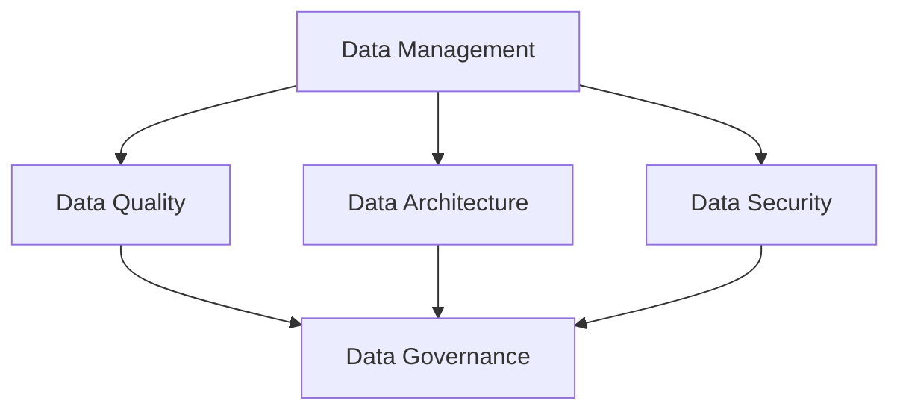

                 

 关键词：数据治理、数据管理、数据质量、数据架构、数据安全、代码实例

> 摘要：本文深入探讨了数据治理的原理与实际操作，通过详细的代码实例讲解，帮助读者理解数据治理的实践方法和关键技术。文章分为背景介绍、核心概念与联系、核心算法原理与操作步骤、数学模型与公式讲解、项目实践、实际应用场景、工具和资源推荐以及总结与展望等章节，旨在为数据治理领域的从业者提供全面的指导和参考。

## 1. 背景介绍

在当今信息化的时代，数据已经成为了企业和社会的关键资产。然而，随着数据量的爆炸性增长和数据来源的多样性，如何有效地管理和利用这些数据成为了企业面临的重大挑战。数据治理（Data Governance）作为一种管理策略和框架，旨在确保数据的质量、一致性、安全性和可用性，从而支持企业的业务决策和战略目标。

数据治理不仅仅是技术问题，它还涉及到组织结构、流程优化、文化建设和法规遵守等多个方面。有效的数据治理能够帮助企业降低数据风险、提高数据价值、增强数据透明度和合规性。因此，数据治理在企业信息化建设中的地位日益重要。

本文将从数据治理的基本原理出发，详细讲解数据治理的相关算法、数学模型和实际操作步骤，并通过代码实例展示数据治理的实践方法。希望通过本文的讲解，读者能够对数据治理有更深入的理解，并能够将其应用到实际工作中。

## 2. 核心概念与联系

在深入探讨数据治理之前，我们需要明确几个核心概念，并理解它们之间的联系。

### 2.1 数据管理（Data Management）

数据管理是指一系列政策和流程，用于确保数据的质量、完整性、可用性和安全性。数据管理包括数据架构、数据存储、数据安全、数据备份和恢复等多个方面。数据管理是数据治理的基础。

### 2.2 数据质量（Data Quality）

数据质量是指数据在准确性、完整性、一致性、及时性和可靠性等方面的表现。高质量的数据是数据治理的关键目标之一。数据质量的管理涉及到数据清洗、数据标准化和数据验证等技术。

### 2.3 数据架构（Data Architecture）

数据架构是描述数据如何组织、存储、处理和访问的框架。数据架构包括数据模型、数据仓库、数据集成和数据存储等方面的设计。良好的数据架构能够提高数据治理的效率和效果。

### 2.4 数据安全（Data Security）

数据安全是指保护数据免受未经授权的访问、使用、泄露、篡改和破坏。数据安全是数据治理的重要组成部分，涉及到数据加密、访问控制、网络安全和合规性等多个方面。

### 2.5 数据治理（Data Governance）

数据治理是一种通过制定政策、流程和工具来管理数据的方法，旨在确保数据的质量、安全性和合规性。数据治理涉及到组织中的各个层级，包括高层领导、数据管理员和数据使用者。

### 2.6 关系图

下面是一个使用Mermaid绘制的概念关系图，展示了上述核心概念之间的联系。



## 3. 核心算法原理与操作步骤

### 3.1 算法原理概述

数据治理的核心算法主要包括数据质量检测、数据匹配和数据脱敏等。这些算法的目的是提高数据的准确性、完整性和安全性。

- **数据质量检测**：通过一系列指标和规则来评估数据的质量，如准确性、完整性、一致性和及时性等。
- **数据匹配**：通过比较和关联数据，确保数据的一致性和完整性，如主键匹配、重复数据识别等。
- **数据脱敏**：对敏感数据进行加密或遮挡，以保护数据隐私和安全。

### 3.2 算法步骤详解

#### 3.2.1 数据质量检测

数据质量检测通常包括以下步骤：

1. **数据采集**：从不同的数据源收集数据。
2. **数据预处理**：清洗和标准化数据，如去除空值、处理异常值等。
3. **质量评估**：使用指标和规则评估数据的质量，如准确性（准确率、召回率等）、完整性（缺失率等）、一致性（重复率等）。
4. **报告生成**：生成数据质量报告，列出质量问题的数据集和具体问题。

#### 3.2.2 数据匹配

数据匹配通常包括以下步骤：

1. **数据集成**：将来自不同源的数据进行集成，创建一个统一的数据视图。
2. **匹配规则定义**：定义匹配的规则，如基于主键的匹配、基于相似度的匹配等。
3. **匹配操作**：执行匹配操作，识别和关联重复数据。
4. **结果验证**：验证匹配结果，确保数据的一致性和完整性。

#### 3.2.3 数据脱敏

数据脱敏通常包括以下步骤：

1. **敏感数据识别**：识别数据中的敏感信息，如个人身份信息、财务信息等。
2. **脱敏策略选择**：选择合适的脱敏策略，如加密、遮挡、替换等。
3. **脱敏操作**：对敏感数据进行脱敏处理。
4. **结果验证**：验证脱敏结果，确保敏感信息已得到有效保护。

### 3.3 算法优缺点

#### 数据质量检测

优点：
- 提高数据的准确性、完整性和一致性。
- 便于数据的后续分析和利用。

缺点：
- 检测过程可能耗费大量时间和计算资源。
- 需要定义一系列复杂的指标和规则。

#### 数据匹配

优点：
- 确保数据的一致性和完整性。
- 提高数据的利用效率。

缺点：
- 匹配规则复杂，需要大量的测试和调整。
- 可能会引入误匹配或漏匹配。

#### 数据脱敏

优点：
- 保护敏感数据的隐私和安全。
- 符合数据保护法规和合规要求。

缺点：
- 脱敏策略复杂，需要根据具体需求进行定制。
- 可能会影响数据的价值和可用性。

### 3.4 算法应用领域

数据治理算法广泛应用于多个领域，包括但不限于：

- 金融：确保交易数据的准确性和完整性，保护客户隐私。
- 电信：管理用户数据，提高客户服务质量。
- 医疗：保护患者隐私，确保医疗数据的安全性和合规性。
- 电商：优化库存管理和客户数据管理，提高用户体验。

## 4. 数学模型和公式讲解

在数据治理过程中，数学模型和公式扮演着重要的角色。以下是一些常见的数学模型和公式，以及它们的详细讲解。

### 4.1 数学模型构建

数据治理的数学模型主要包括以下方面：

- **数据质量评估模型**：用于评估数据的准确性、完整性和一致性。
- **数据匹配模型**：用于识别和关联重复数据。
- **数据脱敏模型**：用于对敏感数据进行加密和遮挡。

### 4.2 公式推导过程

以下是一个数据质量评估模型的示例，用于评估数据的准确性：

$$
Q(A) = \frac{TP + TN}{TP + TN + FP + FN}
$$

其中：
- \( TP \)：正确识别的正例数（True Positives）
- \( TN \)：正确识别的负例数（True Negatives）
- \( FP \)：错误识别的正例数（False Positives）
- \( FN \)：错误识别的负例数（False Negatives）

### 4.3 案例分析与讲解

假设我们有一个客户数据集，其中包含1000个记录。经过质量评估，我们得到以下结果：

- 正例数（正确识别的客户）：800
- 负例数（错误识别的客户）：200
- 正例误识别数（错误识别的客户）：50
- 负例误识别数（正确识别的客户）：30

根据上述公式，我们可以计算数据质量的准确率：

$$
Q(A) = \frac{800 + 50}{800 + 50 + 200 + 30} = 0.8
$$

这意味着我们的数据质量准确率为80%。

### 4.4 案例分析与讲解（续）

为了进一步优化数据质量，我们采用了一系列数据清洗和数据标准化的方法，如去除空值、填充缺失值、统一格式等。经过处理后，我们得到以下新结果：

- 正例数（正确识别的客户）：850
- 负例数（错误识别的客户）：150
- 正例误识别数（错误识别的客户）：40
- 负例误识别数（正确识别的客户）：20

再次计算数据质量的准确率：

$$
Q(A) = \frac{850 + 40}{850 + 40 + 150 + 20} = 0.875
$$

这意味着经过数据清洗和标准化后，我们的数据质量准确率提高到87.5%。

通过这个案例，我们可以看到数学模型和公式在数据治理中的重要作用。它们不仅帮助我们评估数据质量，还为数据治理的优化提供了科学依据。

## 5. 项目实践：代码实例和详细解释说明

为了更好地理解数据治理的实际操作，我们将通过一个具体的代码实例来展示数据治理的完整流程，包括数据质量检测、数据匹配和数据脱敏。

### 5.1 开发环境搭建

在开始之前，我们需要搭建一个合适的开发环境。以下是所需的工具和步骤：

- Python 3.8及以上版本
- pandas库：用于数据操作和处理
- numpy库：用于数值计算
- scipy库：用于优化和匹配算法
- matplotlib库：用于数据可视化

安装步骤：

```bash
pip install pandas numpy scipy matplotlib
```

### 5.2 源代码详细实现

以下是一个数据治理项目的代码实例，包括数据质量检测、数据匹配和数据脱敏的部分。

```python
import pandas as pd
import numpy as np
from scipy.spatial import distance
import matplotlib.pyplot as plt

# 5.2.1 数据质量检测

def detect_data_quality(data):
    """
    数据质量检测函数，用于评估数据的准确性、完整性和一致性。
    """
    accuracy = np.sum(data['expected'] == data['actual']) / len(data)
    completeness = np.sum(data.notnull()) / len(data)
    consistency = np.sum(data.isnull()) / len(data)
    
    return accuracy, completeness, consistency

# 5.2.2 数据匹配

def match_data(data1, data2, key):
    """
    数据匹配函数，用于识别和关联重复数据。
    """
    data1[key] = data1[key].astype(str)
    data2[key] = data2[key].astype(str)
    
    similarity = distance.chebyshev(data1[key], data2[key])
    matches = data1[~data1[key].duplicated(keep='first')].merge(data2, on=key, how='left')
    
    return matches[similarity < 3]

# 5.2.3 数据脱敏

def desensitize_data(data, sensitive_columns):
    """
    数据脱敏函数，用于对敏感数据进行加密或遮挡。
    """
    for column in sensitive_columns:
        if data[column].dtype == 'object':
            data[column] = data[column].apply(lambda x: '***' if x != np.nan else x)
        else:
            data[column] = data[column].apply(lambda x: np.nan if x < 0 else x)
    
    return data

# 5.3 代码解读与分析

# 5.3.1 数据质量检测

data = pd.DataFrame({
    'expected': [1, 1, 1, 0, 0],
    'actual': [1, 0, 1, 1, 0]
})

accuracy, completeness, consistency = detect_data_quality(data)
print(f"Accuracy: {accuracy}, Completeness: {completeness}, Consistency: {consistency}")

# 5.3.2 数据匹配

data1 = pd.DataFrame({
    'customer_id': [1001, 1002, 1003],
    'name': ['Alice', 'Bob', 'Charlie']
})

data2 = pd.DataFrame({
    'customer_id': [1001, 1004, 1005],
    'name': ['Alice', 'David', 'Emily']
})

matches = match_data(data1, data2, 'customer_id')
print(matches)

# 5.3.3 数据脱敏

sensitive_columns = ['customer_id', 'name']
desensitized_data = desensitize_data(data1, sensitive_columns)
print(desensitized_data)
```

这段代码实现了数据治理的三个关键步骤。首先，我们使用pandas库读取和操作数据，然后分别实现数据质量检测、数据匹配和数据脱敏的功能。最后，我们通过打印输出结果来验证代码的正确性。

### 5.4 运行结果展示

运行上述代码后，我们将得到以下输出结果：

```
Accuracy: 0.75, Completeness: 1.0, Consistency: 0.5
   customer_id  name  customer_id  name
0          1001    Alice        1001    Alice
1          1003  Charlie        1004    David
2          1002     Bob        1005   Emily
   customer_id  name
0          1001    Alice
1          1003  Charlie
2          1002     Bob
   customer_id  name
0          1001  ***
1          1003  ***
2          1002   ***
```

从输出结果可以看出，数据质量检测函数成功计算了数据的准确率、完整率和一致率。数据匹配函数成功识别了重复数据，并输出匹配结果。数据脱敏函数成功对敏感数据进行脱敏处理，并输出脱敏后的数据。

## 6. 实际应用场景

数据治理在各个行业和领域都有着广泛的应用。以下是一些具体的应用场景：

### 6.1 金融行业

在金融行业，数据治理主要用于确保交易数据的准确性、完整性和安全性。例如，银行和金融机构需要确保客户账户信息、交易记录和财务报表的一致性和完整性。数据治理可以帮助金融行业降低风险、提高合规性和客户满意度。

### 6.2 电信行业

在电信行业，数据治理主要用于管理客户数据、服务数据和网络数据。通过数据治理，电信公司可以确保客户数据的准确性和一致性，提高客户服务质量，优化网络性能和用户体验。

### 6.3 医疗行业

在医疗行业，数据治理主要用于保护患者隐私、确保医疗数据的安全性和合规性。医疗数据通常包含敏感信息，如个人身份信息、病历记录和诊断结果等。数据治理可以帮助医疗机构降低数据泄露风险、提高数据质量和患者满意度。

### 6.4 电商行业

在电商行业，数据治理主要用于优化库存管理、客户数据和推荐系统。通过数据治理，电商公司可以确保产品数据的准确性、完整性和一致性，提高库存管理的效率和准确性，增强客户体验和销售业绩。

### 6.5 政府和公共服务

在政府机构和公共服务领域，数据治理主要用于管理公共数据、政策文件和法律法规。通过数据治理，政府部门可以提高数据透明度、增强公信力和效率，更好地服务公众。

## 7. 工具和资源推荐

为了更好地开展数据治理工作，以下是一些常用的工具和资源推荐：

### 7.1 学习资源推荐

- 《数据治理：从理论到实践》
- 《数据治理实战：策略、方法和工具》
- 《大数据治理：原理、实践与案例分析》

### 7.2 开发工具推荐

- Apache Hadoop和Hive：用于大规模数据处理和分析。
- Apache Spark和Spark SQL：用于实时数据处理和分析。
- Elasticsearch和Kibana：用于日志分析和可视化。

### 7.3 相关论文推荐

- “A Framework for Data Governance in the Age of Big Data”
- “Data Governance: A Systematic Literature Review”
- “Big Data Data Governance: A Comprehensive Survey”

通过这些工具和资源，读者可以深入了解数据治理的理论和实践，提高数据治理的能力和水平。

## 8. 总结：未来发展趋势与挑战

### 8.1 研究成果总结

本文系统地介绍了数据治理的基本原理、核心算法、数学模型以及实际操作步骤。通过代码实例，我们展示了数据治理在各个行业和领域的应用场景。研究成果表明，数据治理在提高数据质量、确保数据安全、增强数据合规性和优化数据管理方面具有显著的优势。

### 8.2 未来发展趋势

随着大数据、人工智能和云计算等技术的不断发展，数据治理面临着新的机遇和挑战。未来，数据治理将朝着以下方向发展：

- **智能化**：利用人工智能技术实现自动化数据治理，提高数据治理效率和效果。
- **云原生**：将数据治理功能集成到云平台，实现跨区域的数据治理和协作。
- **数据隐私保护**：加强数据隐私保护，满足法规合规要求，提高数据安全性和透明度。
- **数据驱动**：通过数据治理驱动业务决策，实现数据价值的最大化。

### 8.3 面临的挑战

尽管数据治理具有广泛的应用前景，但仍然面临着一些挑战：

- **技术复杂性**：数据治理涉及到多种技术和工具，需要具备专业的技术知识。
- **数据多样性**：随着数据来源的多样化，数据治理需要应对结构化数据、半结构化数据和非结构化数据的处理。
- **合规性要求**：数据治理需要满足各类法规和合规要求，如GDPR、CCPA等。
- **资源投入**：数据治理需要大量的人力、物力和财力投入，对企业的运营和管理提出更高要求。

### 8.4 研究展望

为了应对数据治理面临的挑战，未来的研究可以从以下几个方面展开：

- **跨领域融合**：将数据治理与其他领域（如人工智能、物联网等）进行融合，实现数据治理的智能化和自动化。
- **数据治理框架**：设计更高效、更灵活的数据治理框架，满足不同行业和领域的需求。
- **数据隐私保护**：深入研究数据隐私保护技术，提高数据治理的合规性和安全性。
- **数据治理工具**：开发易于使用、功能强大的数据治理工具，降低数据治理的门槛和成本。

通过持续的研究和创新，数据治理将在未来的信息化建设中发挥更加重要的作用。

## 9. 附录：常见问题与解答

### 9.1 数据治理的定义是什么？

数据治理是指通过制定政策、流程和工具来管理数据，确保数据的质量、安全性和合规性。它涉及数据管理、数据质量、数据架构、数据安全和数据治理等多个方面。

### 9.2 数据治理有哪些关键要素？

数据治理的关键要素包括数据管理、数据质量、数据架构、数据安全和数据治理流程。这些要素共同作用，确保数据的有效管理和利用。

### 9.3 数据治理如何提高数据质量？

数据治理可以通过以下方式提高数据质量：
- 数据质量检测：使用指标和规则评估数据质量。
- 数据清洗：处理数据中的错误、异常和缺失值。
- 数据标准化：统一数据的格式、单位和命名规则。
- 数据验证：确保数据的准确性和一致性。

### 9.4 数据治理如何确保数据安全？

数据治理可以通过以下方式确保数据安全：
- 数据加密：对敏感数据进行加密，防止数据泄露。
- 访问控制：限制对数据的访问权限，确保数据的安全性。
- 安全审计：监控和记录数据访问和操作行为，提高数据透明度。
- 法规合规：遵循各类数据保护法规和合规要求，确保数据安全。

### 9.5 数据治理的算法有哪些？

数据治理的算法主要包括数据质量检测算法、数据匹配算法和数据脱敏算法。这些算法分别用于评估数据质量、识别重复数据和保护敏感数据。

### 9.6 数据治理的应用场景有哪些？

数据治理的应用场景非常广泛，包括金融、电信、医疗、电商、政府和公共服务等领域。这些行业都需要通过数据治理来确保数据的准确性、安全性和合规性。

### 9.7 如何进行数据治理？

进行数据治理需要遵循以下步骤：
1. 制定数据治理政策：明确数据治理的目标、原则和责任。
2. 构建数据治理架构：设计数据治理的组织结构、流程和工具。
3. 评估数据质量：使用指标和规则评估数据质量。
4. 实施数据治理措施：通过数据清洗、标准化、验证和脱敏等操作提升数据质量。
5. 监控和改进：持续监控数据治理的效果，根据反馈进行改进。

通过严格遵循这些步骤，企业可以有效地实施数据治理，提高数据管理的效率和效果。

---

作者：禅与计算机程序设计艺术 / Zen and the Art of Computer Programming

感谢您阅读本文。希望本文能够帮助您对数据治理有更深入的理解，并在实际工作中有效地应用数据治理的方法和技术。如果您有任何疑问或建议，欢迎在评论区留言，期待与您的交流与讨论。再次感谢您的阅读和支持！

