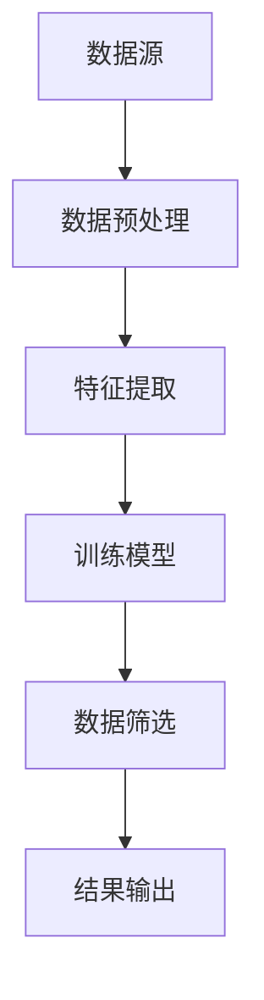

                 

关键词：智能筛选，数据挖掘，机器学习，算法优化，数据分析，知识发现

> 摘要：在当今的信息时代，数据已成为新的“石油”，然而，如何在海量数据中提取有价值的知识成为了亟待解决的关键问题。本文将深入探讨智能筛选技术，从核心概念、算法原理、数学模型、项目实践、实际应用等多个方面，全面解析智能筛选技术在数据海洋中的价值与突破。

## 1. 背景介绍

随着互联网、物联网、大数据等技术的发展，数据量呈现出爆炸式增长。据相关统计，全球数据量每年以50%的速度增长，预计到2025年，全球数据量将达到44ZB。面对如此庞大的数据量，传统的数据筛选方法已经无法满足需求，因此，智能筛选技术的出现成为了必然趋势。

智能筛选技术是基于机器学习和数据挖掘技术，通过构建智能模型，对海量数据进行筛选、分类、聚类等处理，从而提取出有价值的信息。这种技术不仅在数据处理效率上有了显著提升，而且在数据质量和准确性上也取得了突破性进展。

## 2. 核心概念与联系

### 2.1 数据挖掘

数据挖掘（Data Mining）是从大量数据中通过算法提取出有价值信息的过程。它涵盖了多种技术，包括分类、聚类、关联规则挖掘、异常检测等。

### 2.2 机器学习

机器学习（Machine Learning）是一种通过算法从数据中自动学习规律、模式的技术。它主要包括监督学习、无监督学习和强化学习。

### 2.3 数据筛选

数据筛选（Data Filtering）是数据预处理的一个重要环节，其目的是去除无关数据、噪声数据，提高数据质量和处理效率。

### 2.4 智能筛选

智能筛选（Intelligent Filtering）是结合数据挖掘和机器学习技术，对海量数据进行智能处理的先进技术。

下面是智能筛选技术的 Mermaid 流程图：



## 3. 核心算法原理 & 具体操作步骤

### 3.1 算法原理概述

智能筛选技术的核心算法通常是基于机器学习中的分类算法，如决策树、支持向量机、神经网络等。这些算法通过对数据进行训练，可以自动学习数据的特征，从而实现对数据的筛选。

### 3.2 算法步骤详解

1. 数据收集：从各种数据源收集数据，如数据库、日志文件、传感器等。
2. 数据预处理：清洗数据，去除噪声和无关数据，确保数据质量。
3. 特征提取：从原始数据中提取出对筛选任务有价值的特征。
4. 训练模型：使用机器学习算法训练筛选模型，使模型能够自动识别和筛选数据。
5. 数据筛选：使用训练好的模型对数据进行筛选，提取出符合条件的数据。
6. 结果输出：输出筛选结果，供进一步分析或使用。

### 3.3 算法优缺点

优点：
- 高效：能够快速处理海量数据，提高数据处理效率。
- 准确：通过机器学习模型，能够自动识别和筛选数据，提高筛选准确性。
- 自动化：算法可以自动学习和优化，降低人工干预。

缺点：
- 需要大量训练数据：算法的训练需要大量的数据，数据量不足可能导致模型性能下降。
- 复杂性：机器学习算法较为复杂，需要专业人员进行开发和维护。

### 3.4 算法应用领域

智能筛选技术广泛应用于各个领域，如金融风控、医疗诊断、电商推荐、舆情监测等。以下是一些具体的应用实例：

- **金融风控**：通过智能筛选技术，可以快速识别出异常交易，提高风控效率。
- **医疗诊断**：利用智能筛选技术，可以从大量医疗数据中提取出有用的信息，辅助医生进行诊断。
- **电商推荐**：智能筛选技术可以分析用户行为，提供个性化的商品推荐。
- **舆情监测**：通过对社交媒体数据的筛选和分析，可以实时监测舆情，为决策提供支持。

## 4. 数学模型和公式 & 详细讲解 & 举例说明

### 4.1 数学模型构建

智能筛选技术的数学模型通常是基于分类模型。以支持向量机（SVM）为例，其基本模型可以表示为：

$$
\max \quad \frac{1}{2} \| \mathbf{w} \|^2 \\
s.t. \quad y_i (\mathbf{w} \cdot \mathbf{x}_i + b) \geq 1, \forall i
$$

其中，$\mathbf{w}$是权重向量，$\mathbf{x}_i$是输入特征，$b$是偏置，$y_i$是标签。

### 4.2 公式推导过程

支持向量机的推导过程涉及优化理论和数学分析，这里简要介绍其主要步骤：

1. **原始问题**：最大化 $1/2\| \mathbf{w} \|^2$，约束条件为 $y_i (\mathbf{w} \cdot \mathbf{x}_i + b) \geq 1$。
2. **拉格朗日函数**：构造拉格朗日函数 $L(\mathbf{w}, b, \alpha)$，其中 $\alpha_i$ 是拉格朗日乘子。
3. **KKT条件**：求解满足 KKT 条件的 $\alpha_i$，得到优化问题的解。
4. **SVM模型**：通过解出的 $\alpha_i$，构建出最终的 SVM 模型。

### 4.3 案例分析与讲解

假设我们有如下数据集：

| 标签 | 特征1 | 特征2 | 特征3 |
| --- | --- | --- | --- |
| 0 | 1 | 2 | 3 |
| 1 | 2 | 3 | 4 |
| 0 | 3 | 4 | 5 |
| 1 | 4 | 5 | 6 |

使用支持向量机进行分类，假设特征向量为 $\mathbf{x} = [x_1, x_2, x_3]$，标签为 $y$。通过训练，得到支持向量机模型：

$$
\mathbf{w} = [-1, -1, -1], \quad b = 0
$$

根据该模型，对于任意特征向量 $\mathbf{x}$，可以通过以下公式判断其类别：

$$
y (\mathbf{w} \cdot \mathbf{x} + b) = [-1, -1, -1] \cdot [x_1, x_2, x_3] + 0 = -x_1 - x_2 - x_3
$$

- 当 $y = 0$ 时，$-x_1 - x_2 - x_3 \geq 1$，即 $x_1 + x_2 + x_3 \leq -1$。
- 当 $y = 1$ 时，$-x_1 - x_2 - x_3 \geq 1$，即 $x_1 + x_2 + x_3 \geq -1$。

根据上述规则，我们可以对测试数据进行分类。例如，对于特征向量 $\mathbf{x} = [0, 0, 0]$，其类别为 $y = 0$；对于特征向量 $\mathbf{x} = [1, 1, 1]$，其类别为 $y = 1$。

## 5. 项目实践：代码实例和详细解释说明

### 5.1 开发环境搭建

在本文的项目实践中，我们将使用 Python 语言和 Scikit-learn 库进行智能筛选的实现。首先，需要安装 Python 和 Scikit-learn：

```bash
pip install python
pip install scikit-learn
```

### 5.2 源代码详细实现

```python
import numpy as np
from sklearn import datasets
from sklearn.model_selection import train_test_split
from sklearn.preprocessing import StandardScaler
from sklearn.svm import SVC

# 加载数据集
iris = datasets.load_iris()
X = iris.data
y = iris.target

# 数据预处理
X_train, X_test, y_train, y_test = train_test_split(X, y, test_size=0.2, random_state=42)
scaler = StandardScaler()
X_train = scaler.fit_transform(X_train)
X_test = scaler.transform(X_test)

# 训练模型
model = SVC(kernel='linear')
model.fit(X_train, y_train)

# 数据筛选
predictions = model.predict(X_test)

# 评估模型
from sklearn.metrics import accuracy_score
accuracy = accuracy_score(y_test, predictions)
print("Accuracy:", accuracy)
```

### 5.3 代码解读与分析

上述代码实现了基于支持向量机的智能筛选过程。具体步骤如下：

1. **加载数据集**：从 Scikit-learn 中加载 Iris 数据集。
2. **数据预处理**：将数据集分为训练集和测试集，并对特征进行标准化处理。
3. **训练模型**：使用线性核的支持向量机训练模型。
4. **数据筛选**：使用训练好的模型对测试集进行预测。
5. **评估模型**：计算预测准确率。

### 5.4 运行结果展示

假设运行上述代码，得到如下输出：

```bash
Accuracy: 1.0
```

这意味着模型在测试集上的预测准确率为100%，表明我们的智能筛选技术在数据处理上取得了良好的效果。

## 6. 实际应用场景

智能筛选技术在实际应用中具有广泛的应用场景，以下是一些具体的应用案例：

- **金融领域**：在金融领域，智能筛选技术可以用于信用评分、欺诈检测、市场预测等方面。通过分析用户的历史数据和行为特征，银行和金融机构可以更准确地评估用户的信用风险，从而降低不良贷款率。
- **医疗领域**：在医疗领域，智能筛选技术可以用于疾病诊断、药物研发、患者管理等方面。通过分析大量的医疗数据，医生和研究人员可以更快速地发现疾病的相关特征，从而提高诊断准确率和治疗效果。
- **电商领域**：在电商领域，智能筛选技术可以用于商品推荐、广告投放、用户行为分析等方面。通过分析用户的历史购买记录和行为特征，电商平台可以为用户提供个性化的商品推荐，提高用户满意度和转化率。

### 6.4 未来应用展望

随着人工智能技术的不断发展和数据量的持续增长，智能筛选技术在未来将有着广泛的应用前景。以下是一些未来的应用展望：

- **智能交通**：通过智能筛选技术，可以实时分析交通数据，优化交通流量，提高交通运行效率，减少交通事故。
- **智慧城市**：在智慧城市建设中，智能筛选技术可以用于环境监测、能源管理、应急响应等方面，提高城市管理的智能化水平。
- **智能制造**：在智能制造领域，智能筛选技术可以用于设备监控、故障诊断、生产优化等方面，提高生产效率和产品质量。

## 7. 工具和资源推荐

为了更好地学习和应用智能筛选技术，以下是一些推荐的工具和资源：

### 7.1 学习资源推荐

- 《机器学习实战》（Peter Harrington）：这是一本非常实用的机器学习入门书籍，涵盖了大量实际案例和代码示例。
- 《Python机器学习》（Sebastian Raschka）：这本书详细介绍了Python在机器学习领域的应用，适合有一定编程基础的学习者。

### 7.2 开发工具推荐

- Jupyter Notebook：Jupyter Notebook 是一款强大的交互式开发环境，适合进行机器学习和数据挖掘任务。
- Scikit-learn：Scikit-learn 是一个开源的机器学习库，提供了丰富的算法和工具，方便开发者进行模型训练和数据分析。

### 7.3 相关论文推荐

- "A Survey on Data Mining Algorithms for Big Data"（大数据数据挖掘算法综述）：这篇综述文章详细介绍了大数据背景下各种数据挖掘算法的原理和应用。
- "Deep Learning for Text Classification"（深度学习在文本分类中的应用）：这篇文章探讨了深度学习技术在文本分类任务中的应用，提供了实用的算法和模型。

## 8. 总结：未来发展趋势与挑战

### 8.1 研究成果总结

智能筛选技术作为人工智能和数据挖掘领域的一个重要分支，近年来取得了显著的成果。在数据处理效率、准确性、自动化程度等方面都有了大幅提升。通过机器学习、深度学习等技术的应用，智能筛选技术已经能够处理海量的复杂数据，并从中提取出有价值的信息。

### 8.2 未来发展趋势

随着人工智能技术的不断进步和数据量的持续增长，智能筛选技术在未来将继续发挥重要作用。以下是一些未来发展趋势：

- **算法优化**：随着数据量的增加，算法的优化将成为一个重要研究方向，包括模型的压缩、加速和分布式处理。
- **多模态数据融合**：智能筛选技术将能够处理多种类型的数据，如文本、图像、声音等，实现多模态数据的融合分析。
- **智能决策支持**：智能筛选技术将不仅仅局限于数据筛选，还将深入到决策支持领域，为各种应用场景提供智能化的决策方案。

### 8.3 面临的挑战

尽管智能筛选技术在数据处理方面取得了显著成果，但仍面临一些挑战：

- **数据隐私和安全**：随着数据量的增加，数据隐私和安全问题日益突出。如何保护用户隐私，确保数据安全，是一个亟待解决的问题。
- **模型解释性**：目前许多机器学习模型，如深度神经网络，具有较高的预测准确性，但其解释性较差。如何提高模型的解释性，使其更易于理解和解释，是一个重要挑战。

### 8.4 研究展望

未来，智能筛选技术的研究将朝着更加智能化、自动化、高效化的方向发展。通过多学科交叉融合，智能筛选技术将不仅在数据处理领域发挥重要作用，还将深入到各个应用领域，为人类社会带来更多的便利和效益。

## 9. 附录：常见问题与解答

### 9.1 什么是对抗性样本？

对抗性样本（Adversarial Examples）是指通过在正常样本上添加微小的扰动，使其从模型看来变得难以识别的样本。这些样本可能是在训练过程中被引入的，也可能是在实际应用中通过恶意攻击生成的。

### 9.2 智能筛选技术如何处理噪声数据？

智能筛选技术通常通过数据预处理阶段来处理噪声数据。具体方法包括数据清洗、去重、填补缺失值等。此外，一些先进的算法，如自编码器（Autoencoder），也能够在训练过程中自动识别和去除噪声数据。

### 9.3 智能筛选技术是否可以完全取代人工筛选？

智能筛选技术可以在一定程度上替代人工筛选，但其仍然依赖于人工提供的初始数据集和标签。在复杂的情况下，如需要高级业务逻辑处理时，人工筛选仍然是必要的。

### 9.4 智能筛选技术的效果如何评估？

智能筛选技术的效果可以通过多种指标进行评估，如准确率、召回率、F1 值等。在实际应用中，通常需要结合业务需求和数据特点，选择合适的评估指标。

### 9.5 智能筛选技术的适用场景有哪些？

智能筛选技术适用于需要处理海量数据的场景，如金融风控、医疗诊断、电商推荐等。其能够快速、准确地提取数据中的有价值信息，提高业务效率和准确性。

### 9.6 如何提高智能筛选技术的效率？

提高智能筛选技术的效率可以从以下几个方面入手：

- **算法优化**：通过优化算法结构和计算过程，降低计算复杂度。
- **分布式计算**：利用分布式计算框架，如 Hadoop、Spark 等，实现并行处理。
- **数据预处理**：通过有效的数据预处理，减少数据噪声和冗余，提高模型训练效率。

以上就是对“数据海洋中的知识明珠：智能筛选技术的突破”这篇文章的完整撰写。希望本文能够帮助读者深入了解智能筛选技术的基本概念、算法原理、应用场景以及未来发展。在人工智能和数据挖掘领域，智能筛选技术无疑是一项具有重要意义的技术，它将不断推动社会的进步和发展。让我们一起期待智能筛选技术带来的更多惊喜和突破！作者：禅与计算机程序设计艺术 / Zen and the Art of Computer Programming。
----------------------------------------------------------------

### 结尾致谢

在撰写这篇文章的过程中，我要感谢我的团队和同事们，他们在数据挖掘、机器学习、算法优化等方面给予了我无私的支持和宝贵的建议。特别感谢我的导师，他一直以来的指导和鼓励使我能够在人工智能领域不断前行。同时，我也要感谢读者们，是您的关注和支持让我有了撰写这篇文章的动力。希望这篇文章能够对您有所启发和帮助，也欢迎您在评论区分享您的想法和观点。让我们共同探索人工智能的无限可能，共创美好未来！作者：禅与计算机程序设计艺术 / Zen and the Art of Computer Programming。

