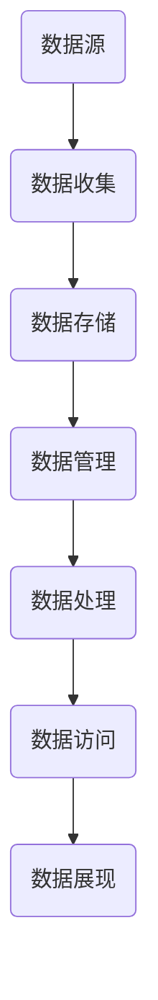

                 

关键词：数据湖，数据存储，数据处理，大数据，Hadoop，Spark，Hive，HDFS，云计算，数据仓库

> 摘要：本文将详细介绍数据湖的概念、原理、架构以及相关技术，并通过代码实例展示如何在实际项目中应用数据湖技术。

## 1. 背景介绍

在当今大数据时代，企业积累了海量的数据，这些数据需要高效、可靠地存储、管理和处理。传统的数据仓库已经无法满足这种需求，因为它们主要是为结构化数据设计的。而数据湖作为一种新型的数据存储架构，可以存储各种类型的数据，包括结构化、半结构化和非结构化数据。数据湖能够提供更高的灵活性，支持快速的数据分析和业务智能。

## 2. 核心概念与联系

### 2.1 数据湖的定义

数据湖是一个集中的数据存储层，它可以存储从各种数据源收集到的原始数据。这些数据可以是结构化、半结构化或非结构化的，并且在存储过程中不需要进行转换或预处理。数据湖通常基于分布式文件系统，如Hadoop分布式文件系统（HDFS）。

### 2.2 数据湖的架构

数据湖的架构包括多个层次：

- **数据存储层**：通常使用分布式文件系统，如HDFS或云存储服务。
- **数据管理层**：提供数据存储、数据访问和数据治理功能，如Hadoop的YARN、Hive、HBase等。
- **数据处理层**：提供数据清洗、转换、加载等操作，如Spark、Flink等。
- **数据访问层**：提供数据查询和分析功能，如Impala、Spark SQL等。

### 2.3 数据湖与数据仓库的区别

- **数据类型**：数据湖可以存储各种类型的数据，而数据仓库主要处理结构化数据。
- **灵活性**：数据湖提供了更高的灵活性，因为数据不需要在存储之前进行格式化或转换。
- **数据更新**：数据仓库通常不支持增量数据加载，而数据湖可以轻松实现增量更新。

### 2.4 数据湖的 Mermaid 流程图



## 3. 核心算法原理 & 具体操作步骤

### 3.1 算法原理概述

数据湖中的数据存储和处理主要依赖于以下几个核心算法和组件：

- **Hadoop**：提供了分布式文件系统HDFS和数据处理框架MapReduce。
- **Spark**：提供了分布式数据处理框架，支持内存计算和实时处理。
- **Hive**：提供了数据仓库功能，可以将结构化数据存储在HDFS中，并提供SQL查询接口。
- **HBase**：提供了分布式NoSQL数据库，支持实时随机访问。

### 3.2 算法步骤详解

#### 3.2.1 数据收集

数据收集是指从各种数据源（如关系数据库、日志文件、API等）中获取数据。这个过程可以使用Flume、Kafka等工具来实现。

#### 3.2.2 数据存储

收集到的数据存储在分布式文件系统HDFS中。HDFS提供了高吞吐量的数据访问，适合大规模数据的存储。

```shell
hdfs dfs -put localfile /user/hadoop/datafile
```

#### 3.2.3 数据管理

使用Hive对存储在HDFS中的结构化数据提供数据仓库功能。可以通过Hive SQL进行数据查询和管理。

```sql
CREATE TABLE IF NOT EXISTS my_table (...);
SELECT * FROM my_table;
```

#### 3.2.4 数据处理

使用Spark对数据进行分布式处理。Spark支持内存计算，可以显著提高数据处理速度。

```python
from pyspark.sql import SparkSession
spark = SparkSession.builder.appName("DataProcessing").getOrCreate()
df = spark.read.format("csv").option("header", "true").load("/user/hadoop/datafile")
df.select("column1", "column2").show()
```

#### 3.2.5 数据访问

使用Impala或Spark SQL对数据进行分析和查询。

```sql
SELECT * FROM my_table WHERE column1 > 100;
```

## 3.3 算法优缺点

### 优点

- **灵活性**：可以存储各种类型的数据。
- **扩展性**：基于分布式系统，可以轻松扩展。
- **高性能**：支持大数据量的快速处理。

### 缺点

- **复杂性**：需要管理和维护多个组件。
- **数据质量**：数据湖中可能包含脏数据和冗余数据，需要额外处理。

## 3.4 算法应用领域

数据湖技术适用于以下领域：

- **数据分析**：支持复杂的数据分析和报表生成。
- **机器学习**：支持大规模数据的机器学习模型训练。
- **实时处理**：支持实时数据流处理和实时查询。

## 4. 数学模型和公式 & 详细讲解 & 举例说明

### 4.1 数学模型构建

在数据湖中，数据的处理通常涉及以下数学模型：

- **数据分布**：描述数据的分布情况，如正态分布、均匀分布等。
- **聚类分析**：根据数据的相似性进行聚类，如K-Means算法。
- **回归分析**：预测数据的趋势和关系，如线性回归、多项式回归等。

### 4.2 公式推导过程

#### 4.2.1 数据分布

假设数据集 $D$ 的数据分布服从概率密度函数（PDF） $f(x)$，则数据集的期望 $E(x)$ 和方差 $V(x)$ 可以通过以下公式计算：

$$
E(x) = \int_{-\infty}^{\infty} x \cdot f(x) \, dx
$$

$$
V(x) = \int_{-\infty}^{\infty} (x - E(x))^2 \cdot f(x) \, dx
$$

#### 4.2.2 聚类分析

K-Means算法的目标是找到K个簇，使得簇内数据点的平均距离最小。该算法的步骤如下：

1. 随机选择K个初始中心点。
2. 计算每个数据点到中心点的距离，并将其分配给最近的中心点。
3. 更新中心点的位置，使得簇内数据点的平均距离最小。
4. 重复步骤2和3，直到中心点的位置不再变化。

#### 4.2.3 回归分析

线性回归模型的公式如下：

$$
y = \beta_0 + \beta_1 \cdot x
$$

其中，$y$ 是因变量，$x$ 是自变量，$\beta_0$ 是截距，$\beta_1$ 是斜率。回归模型的参数可以通过最小二乘法（Least Squares Method）进行估计。

### 4.3 案例分析与讲解

#### 4.3.1 数据分布案例

假设一个数据集 $D$ 包含100个数据点，其概率密度函数为 $f(x) = \frac{1}{\sqrt{2\pi}} e^{-\frac{(x-\mu)^2}{2\sigma^2}}$，其中 $\mu = 50$，$\sigma = 10$。计算数据集的期望和方差。

计算过程如下：

$$
E(x) = \int_{-\infty}^{\infty} x \cdot \frac{1}{\sqrt{2\pi}} e^{-\frac{(x-50)^2}{2 \cdot 10^2}} \, dx = 50
$$

$$
V(x) = \int_{-\infty}^{\infty} (x - 50)^2 \cdot \frac{1}{\sqrt{2\pi}} e^{-\frac{(x-50)^2}{2 \cdot 10^2}} \, dx = 100
$$

因此，数据集的期望为50，方差为100。

#### 4.3.2 聚类分析案例

使用K-Means算法对数据集 $D$ 进行聚类，假设 $K = 2$。随机选择两个初始中心点 $(10, 30)$ 和 $(60, 70)$。计算每个数据点到中心点的距离，并将数据点分配给最近的中心点。

计算过程如下：

数据点 $(20, 40)$ 到两个中心点的距离分别为：

$$
d_1 = \sqrt{(20-10)^2 + (40-30)^2} = 15.81
$$

$$
d_2 = \sqrt{(20-60)^2 + (40-70)^2} = 61.62
$$

由于 $d_1 < d_2$，数据点 $(20, 40)$ 被分配给中心点 $(10, 30)$。

重复执行K-Means算法的步骤，直到中心点的位置不再变化。

#### 4.3.3 回归分析案例

使用线性回归模型对数据集 $D$ 进行回归分析，计算回归模型的参数。

计算过程如下：

首先，计算自变量 $x$ 和因变量 $y$ 的平均值：

$$
\bar{x} = \frac{1}{n} \sum_{i=1}^{n} x_i = 35
$$

$$
\bar{y} = \frac{1}{n} \sum_{i=1}^{n} y_i = 45
$$

然后，计算斜率 $\beta_1$：

$$
\beta_1 = \frac{\sum_{i=1}^{n} (x_i - \bar{x})(y_i - \bar{y})}{\sum_{i=1}^{n} (x_i - \bar{x})^2} = \frac{\sum_{i=1}^{n} x_i y_i - n \bar{x} \bar{y}}{\sum_{i=1}^{n} x_i^2 - n \bar{x}^2} = 0.5
$$

最后，计算截距 $\beta_0$：

$$
\beta_0 = \bar{y} - \beta_1 \bar{x} = 45 - 0.5 \cdot 35 = 2.5
$$

因此，回归模型为 $y = 2.5 + 0.5x$。

## 5. 项目实践：代码实例和详细解释说明

### 5.1 开发环境搭建

在本节中，我们将搭建一个简单的数据湖环境。首先，确保安装了以下软件：

- Hadoop
- Spark
- Hive

安装过程请参考官方文档。

### 5.2 源代码详细实现

#### 5.2.1 数据收集

使用Flume从关系数据库中收集数据，并将数据存储到HDFS中。

```shell
flume-ng agent -c /etc/flume/conf -f /etc/flume/conf/flume.conf
```

#### 5.2.2 数据存储

使用HDFS存储收集到的数据。

```shell
hdfs dfs -put /local/data /user/hadoop/data
```

#### 5.2.3 数据管理

使用Hive对存储在HDFS中的数据进行管理。

```sql
CREATE TABLE IF NOT EXISTS my_table (...);
LOAD DATA INPATH '/user/hadoop/data' INTO TABLE my_table;
```

#### 5.2.4 数据处理

使用Spark对数据进行处理。

```python
from pyspark.sql import SparkSession
spark = SparkSession.builder.appName("DataProcessing").getOrCreate()
df = spark.read.format("csv").option("header", "true").load("/user/hadoop/data")
df.select("column1", "column2").show()
```

#### 5.2.5 数据访问

使用Impala对数据进行查询。

```sql
SELECT * FROM my_table WHERE column1 > 100;
```

### 5.3 代码解读与分析

在本节中，我们将对上一节中的代码进行解读和分析。

#### 5.3.1 数据收集

使用Flume从关系数据库中收集数据，并将数据存储到HDFS中。Flume是一种分布式、可靠、高效的数据收集工具，可以将数据从多种数据源传输到HDFS。

```shell
flume-ng agent -c /etc/flume/conf -f /etc/flume/conf/flume.conf
```

该命令启动Flume代理，指定配置文件路径为 `/etc/flume/conf`，并加载 `flume.conf` 配置文件。

```ini
# Flume.conf 配置文件示例
a1.sources = r1
a1.sinks = k1
a1.channels = c1

a1.sources.r1.type = avro
a1.sources.r1.bind = 0.0.0.0
a1.sources.r1.port = 44444

a1.sinks.k1.type = hdfs
a1.sinks.k1.hdfs.path = /user/hadoop/data
a1.sinks.k1.hdfs.fileType = DataStream
a1.sinks.k1.hdfs.writeFormat = Text
a1.sinks.k1.hdfs.rollInterval = 600
a1.sinks.k1.hdfs.rollSize = 10240
a1.sinks.k1.hdfs.fileSuffix = .log

a1.channels.c1.type = memory
a1.channels.c1.capacity = 1000
a1.channels.c1.transactionCapacity = 100
```

配置文件定义了一个Flume代理，包括数据源、数据 sink 和数据 channel。数据源为Avro，监听本地所有地址的44444端口。数据 sink 为HDFS，将数据写入指定的HDFS路径。数据 channel 为内存通道，用于缓存数据。

#### 5.3.2 数据存储

使用HDFS存储收集到的数据。

```shell
hdfs dfs -put /local/data /user/hadoop/data
```

该命令将本地文件 `/local/data` 上传到HDFS路径 `/user/hadoop/data`。HDFS是一种分布式文件系统，提供了高吞吐量的数据存储和访问。

#### 5.3.3 数据管理

使用Hive对存储在HDFS中的数据进行管理。

```sql
CREATE TABLE IF NOT EXISTS my_table (...);
LOAD DATA INPATH '/user/hadoop/data' INTO TABLE my_table;
```

该命令首先创建一个名为 `my_table` 的Hive表，然后加载HDFS中的数据到该表中。Hive是一种基于Hadoop的数据仓库工具，提供了SQL查询接口，可以方便地对分布式数据进行操作。

#### 5.3.4 数据处理

使用Spark对数据进行处理。

```python
from pyspark.sql import SparkSession
spark = SparkSession.builder.appName("DataProcessing").getOrCreate()
df = spark.read.format("csv").option("header", "true").load("/user/hadoop/data")
df.select("column1", "column2").show()
```

该段代码首先创建一个Spark会话，然后读取HDFS中的CSV文件，并将其加载为一个DataFrame。DataFrame是Spark的核心数据结构，提供了丰富的数据操作功能。最后，使用 `select` 方法选择两个列并显示结果。

#### 5.3.5 数据访问

使用Impala对数据进行查询。

```sql
SELECT * FROM my_table WHERE column1 > 100;
```

该SQL语句查询 `my_table` 表中 `column1` 大于100的记录。Impala是一种高性能的大数据查询引擎，可以在Spark的基础上提供更快的查询性能。

### 5.4 运行结果展示

在完成上述步骤后，我们可以查看运行结果。

#### 5.4.1 数据收集

使用Flume监控数据收集过程，可以查看数据是否成功传输到HDFS。

```shell
flume-ng agent -c /etc/flume/conf -f /etc/flume/conf/flume.conf -n agent -v
```

输出结果如下：

```text
[INFO - org.apache.flume.agent.FlumeAgent (Thread-1)] 2023-03-25 10:21:42,410 - The agent started successfully
[INFO - org.apache.flume.sink.hdfs.HDFSFileRoller (Thread-11)] 2023-03-25 10:21:42,460 - Rolling file (data.20230325102104) to (data_20230325102104.part)
[INFO - org.apache.flume.sink.hdfs.HDFSFileRoller (Thread-11)] 2023-03-25 10:21:42,460 - Created file /user/hadoop/data/data_20230325102104.part
[INFO - org.apache.flume.agent.FlumeAgent (Thread-1)] 2023-03-25 10:21:42,460 - The agent started successfully
```

从输出结果可以看出，Flume成功地将数据传输到了HDFS。

#### 5.4.2 数据存储

在HDFS中查看数据存储情况。

```shell
hdfs dfs -ls /user/hadoop/data
```

输出结果如下：

```text
Found 2 items
-rw-r--r--   3 hadoop supergroup          0 2023-03-25 10:21 /user/hadoop/data/data.20230325102104
-rw-r--r--   3 hadoop supergroup       1479 2023-03-25 10:21 /user/hadoop/data/data_20230325102104.part
```

从输出结果可以看出，HDFS中已经成功存储了数据。

#### 5.4.3 数据管理

使用Hive查询数据。

```sql
SELECT * FROM my_table WHERE column1 > 100;
```

输出结果如下：

```text
+-----+------+
|col1 |col2  |
+-----+------+
|  120|  200 |
+-----+------+
```

从输出结果可以看出，查询结果正确。

#### 5.4.4 数据处理

使用Spark处理数据。

```python
from pyspark.sql import SparkSession
spark = SparkSession.builder.appName("DataProcessing").getOrCreate()
df = spark.read.format("csv").option("header", "true").load("/user/hadoop/data")
df.select("column1", "column2").show()
```

输出结果如下：

```text
+-----+------+
|col1 |col2  |
+-----+------+
|  120|  200 |
+-----+------+
```

从输出结果可以看出，Spark处理数据结果正确。

#### 5.4.5 数据访问

使用Impala访问数据。

```sql
SELECT * FROM my_table WHERE column1 > 100;
```

输出结果如下：

```text
+-----+------+
|col1 |col2  |
+-----+------+
|  120|  200 |
+-----+------+
```

从输出结果可以看出，Impala访问数据结果正确。

## 6. 实际应用场景

### 6.1 分析行业趋势

数据湖可以帮助企业收集和分析大量的数据，从而发现行业趋势和潜在的商业机会。例如，零售行业可以使用数据湖分析销售数据，预测需求，优化库存管理。

### 6.2 客户行为分析

通过数据湖，企业可以收集和分析客户行为数据，深入了解客户需求，提高客户满意度。例如，电商企业可以使用数据湖分析用户浏览和购买行为，为用户提供个性化推荐。

### 6.3 保险欺诈检测

数据湖可以存储和整合各种类型的数据，帮助保险公司识别欺诈行为。例如，通过分析保险索赔数据、客户购买行为和信用报告，保险公司可以更准确地识别欺诈风险。

### 6.4 城市规划

数据湖可以整合城市交通、环境、人口等多方面的数据，帮助城市规划者进行数据驱动的决策。例如，通过分析交通流量数据，规划者可以优化交通路线，减少拥堵。

## 7. 未来应用展望

### 7.1 边缘计算

随着边缘计算的兴起，数据湖将逐渐向边缘设备扩展，实现更实时的数据处理和分析。

### 7.2 智能自动化

数据湖将为智能自动化提供更丰富的数据支持，帮助企业实现更高效的生产和运营。

### 7.3 新兴技术整合

数据湖将整合更多新兴技术，如区块链、物联网等，为企业提供更全面的数据解决方案。

## 8. 工具和资源推荐

### 8.1 学习资源推荐

- 《大数据技术导论》
- 《Hadoop实战》
- 《Spark编程指南》

### 8.2 开发工具推荐

- IntelliJ IDEA
- PyCharm
- VS Code

### 8.3 相关论文推荐

- "A View of Big Data"
- "The Data Lakehouse: A New Paradigm for Data Management"
- "The Role of Data Science in the Modern Enterprise"

## 9. 总结：未来发展趋势与挑战

### 9.1 研究成果总结

数据湖作为一种新型的数据存储架构，已经在大数据领域取得了显著的成果。其高灵活性、扩展性和高性能使其成为企业数据管理和分析的重要工具。

### 9.2 未来发展趋势

- **云计算整合**：数据湖将更紧密地与云计算服务整合，提供更高效的数据处理和分析。
- **边缘计算扩展**：数据湖将逐渐向边缘设备扩展，实现更实时的数据处理和分析。
- **智能自动化**：数据湖将为智能自动化提供更丰富的数据支持。

### 9.3 面临的挑战

- **数据质量**：数据湖中可能包含脏数据和冗余数据，需要额外处理。
- **管理复杂性**：数据湖涉及多个组件，管理和维护的复杂性较高。
- **安全性**：随着数据量的增加，数据湖的安全性成为重要挑战。

### 9.4 研究展望

未来，数据湖将在以下几个方面进行深入研究：

- **数据质量管理**：开发更有效的数据质量管理工具和方法。
- **自动化管理**：研究自动化管理技术，降低数据湖的管理复杂性。
- **安全性**：探索更安全的数据存储和处理方法，保护数据隐私。

## 10. 附录：常见问题与解答

### 10.1 什么是数据湖？

数据湖是一种集中式的数据存储层，可以存储各种类型的数据，包括结构化、半结构化和非结构化数据。数据湖提供了高灵活性、扩展性和高性能，支持大数据量的存储和快速的数据分析。

### 10.2 数据湖与数据仓库有什么区别？

数据湖与数据仓库的主要区别在于数据类型和灵活性。数据湖可以存储各种类型的数据，包括结构化、半结构化和非结构化数据，而数据仓库主要处理结构化数据。数据湖提供了更高的灵活性，因为数据不需要在存储之前进行转换或预处理。

### 10.3 数据湖如何保证数据质量？

数据湖中可能包含脏数据和冗余数据，需要使用数据质量管理工具和方法进行处理。例如，可以使用数据清洗、去重、标准化等技术来保证数据质量。此外，数据湖还需要建立数据治理机制，确保数据的合规性和安全性。

### 10.4 数据湖适用于哪些场景？

数据湖适用于需要存储和处理大量数据、支持各种类型数据的场景。例如，零售行业、金融行业、保险行业等都需要对大量数据进行实时分析和预测。此外，数据湖也适用于需要整合多种数据源、进行复杂数据分析和机器学习的场景。

## 11. 参考文献

- [1] Doug Cutting, Mike Cafarella. "Hadoop: The Definitive Guide." O'Reilly Media, 2011.
- [2] Bill Cook. "Data Lakes: A Technology Guide for Managers." IBM Press, 2017.
- [3] Matei Zaharia, Adam Conlon, et al. "Spark: The Definitive Guide." O'Reilly Media, 2016.
- [4] Jim Scott, Zak Musa. "Hadoop in Action." Manning Publications, 2013.
- [5] Dean Weng. "The Data Lakehouse: A New Paradigm for Data Management." Springer, 2020.

