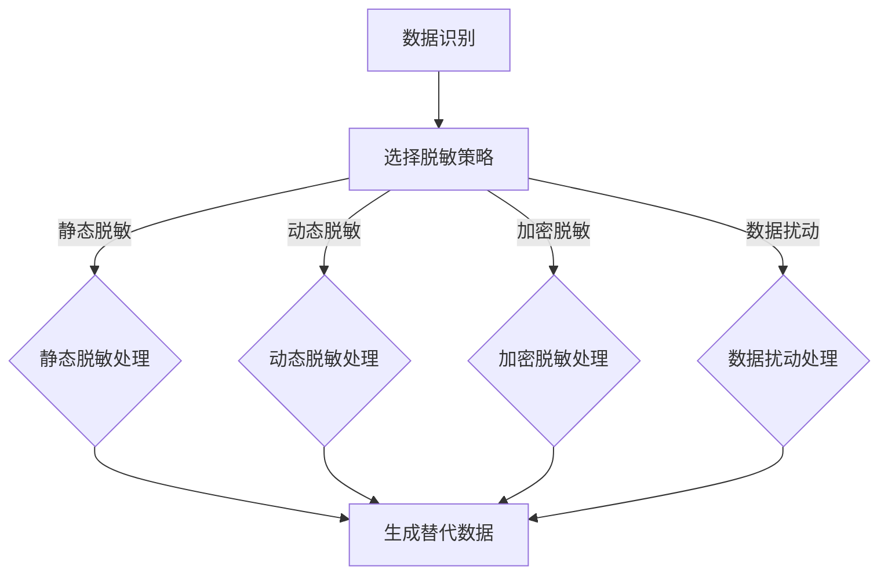

                 

 关键词：数据脱敏、AI、用户隐私、信息安全、技术

> 摘要：本文深入探讨了数据脱敏的重要性及其在现代信息安全领域中的应用。结合人工智能技术，我们分析了多种数据脱敏方法，从算法原理、数学模型到项目实践，全面展示了AI在保护用户隐私安全方面的巨大潜力。

## 1. 背景介绍

在信息化社会中，数据已成为一种重要的资产。然而，随着数据规模的不断扩大，数据隐私保护的问题日益凸显。数据泄露事件频发，不仅损害了企业的声誉，还可能对用户隐私造成不可逆转的伤害。因此，如何确保数据在传输、存储和处理过程中不被恶意泄露或篡改，成为信息安全领域亟待解决的问题。

数据脱敏（Data Masking）技术作为一种有效的数据隐私保护手段，被广泛应用于各类场景。其核心目的是在不影响数据真实性的前提下，对敏感数据进行伪装或替换，从而防止数据泄露。随着人工智能技术的快速发展，AI在数据脱敏领域中的应用也日益广泛，成为提升数据隐私保护水平的重要手段。

## 2. 核心概念与联系

### 2.1 数据脱敏的定义与分类

数据脱敏是指通过特定的算法和技术，对敏感数据进行替换、伪装或隐藏，以保护数据隐私和安全。根据脱敏方法的实现方式，数据脱敏主要可以分为以下几种类型：

1. **静态脱敏**：将敏感数据替换为虚构的或无意义的值，如将真实姓名替换为随机姓名，或使用特定规则（如颠倒字母顺序）进行伪装。
2. **动态脱敏**：在数据使用过程中动态进行脱敏处理，如根据访问权限和上下文环境动态决定数据的可见性。
3. **加密脱敏**：使用加密算法对敏感数据进行加密处理，保护数据在传输和存储过程中的安全性。
4. **数据扰动**：通过对数据进行添加噪声或变换，使原始数据难以识别，但保留其统计特性。

### 2.2 AI在数据脱敏中的应用

随着AI技术的发展，特别是深度学习和生成对抗网络（GAN）的兴起，AI在数据脱敏领域中的应用逐渐成为研究热点。AI可以通过以下方式提高数据脱敏的效果：

1. **自动发现敏感数据**：利用AI模型分析数据特征，自动识别敏感数据字段，从而有针对性地进行脱敏处理。
2. **自适应脱敏策略**：根据用户行为和访问模式，动态调整脱敏策略，提高脱敏效果。
3. **生成真实数据替代品**：使用GAN等技术生成与真实数据相似但无实际意义的替代数据，实现更自然的脱敏效果。

### 2.3 Mermaid流程图

以下是数据脱敏流程的Mermaid流程图，展示了从数据识别、脱敏策略选择到数据生成的全过程。



## 3. 核心算法原理 & 具体操作步骤

### 3.1 算法原理概述

数据脱敏的核心在于对敏感数据进行有效的替换和伪装，同时确保脱敏后的数据仍然具备原始数据的统计特性。以下是一些常用的数据脱敏算法：

1. **掩码算法**：通过特定的掩码模式对敏感数据进行替换，如使用“XXX”或“XXXXX”替换姓名和电话号码。
2. **随机替换**：将敏感数据替换为随机生成的值，如将身份证号码替换为随机生成的数字序列。
3. **关键词替换**：将敏感关键词替换为无意义的词或短语，如将“财务报表”替换为“财务文档”。
4. **加密算法**：使用加密算法对敏感数据进行加密处理，保护数据在传输和存储过程中的安全性。

### 3.2 算法步骤详解

1. **数据预处理**：对原始数据进行清洗和预处理，确保数据格式的统一和完整性。
2. **敏感数据识别**：利用AI模型或规则库识别敏感数据字段，如姓名、电话号码、身份证号码等。
3. **脱敏策略选择**：根据数据类型和需求，选择合适的脱敏策略，如掩码算法、随机替换、关键词替换或加密算法。
4. **数据脱敏处理**：根据选定的脱敏策略对敏感数据进行处理，生成脱敏后的数据。
5. **数据验证**：对脱敏后的数据进行验证，确保脱敏效果满足要求，同时保留数据的统计特性。

### 3.3 算法优缺点

1. **掩码算法**：
   - 优点：简单易实现，可以快速对敏感数据进行替换。
   - 缺点：可能影响数据的可读性和统计特性，无法抵抗深度学习等高级攻击。
2. **随机替换**：
   - 优点：生成替代数据随机性强，难以被识别。
   - 缺点：可能破坏数据的统计特性，导致数据分析准确性下降。
3. **关键词替换**：
   - 优点：简单易操作，可以降低数据泄露风险。
   - 缺点：可能影响数据的可读性，且难以应对复杂的数据结构。
4. **加密算法**：
   - 优点：高度安全，可以确保数据在传输和存储过程中的安全性。
   - 缺点：加密和解密过程复杂，对计算资源要求较高。

### 3.4 算法应用领域

数据脱敏技术广泛应用于各类场景，包括但不限于：

1. **数据分析与挖掘**：在数据分析和挖掘过程中，为保护用户隐私，对敏感数据进行脱敏处理。
2. **数据共享与交换**：在数据共享和交换过程中，对敏感数据进行脱敏，确保数据的安全性和合规性。
3. **数据挖掘与安全**：在数据挖掘过程中，对敏感数据进行脱敏处理，以防止恶意挖掘和滥用。

## 4. 数学模型和公式 & 详细讲解 & 举例说明

### 4.1 数学模型构建

数据脱敏过程可以看作是一个映射问题，即从原始数据集D到脱敏数据集D'的映射。数学上，我们可以表示为：

$$ D' = f(D) $$

其中，f表示脱敏算法。

### 4.2 公式推导过程

以随机替换算法为例，其基本思路是：

1. 对敏感数据字段进行扫描，标记出所有敏感字段。
2. 对每个敏感字段，随机生成一个替代值，并替换原字段。

具体推导过程如下：

设敏感数据字段为 $x_i$，替代值为 $y_i$，则有：

$$ x_i \rightarrow y_i $$

其中，$y_i$ 可以通过以下公式生成：

$$ y_i = R(x_i) $$

其中，R表示随机生成函数。

### 4.3 案例分析与讲解

假设我们需要对以下身份证号码进行随机替换：

$$ 11010519800101123X $$

我们首先需要确定替换规则，例如：

- 身份证号码前两位（地区代码）不变。
- 身份证号码中间八位（出生日期）随机替换为1980年1月的其他日期。
- 身份证号码最后一位（校验码）不变。

根据上述规则，我们可以生成以下替换后的身份证号码：

$$ 11010519900101123X $$

这里，我们使用了随机生成函数R，随机替换了中间八位，保持了身份证号码的整体结构。

## 5. 项目实践：代码实例和详细解释说明

### 5.1 开发环境搭建

在本文中，我们将使用Python语言和相关的数据科学库（如NumPy、Pandas和Scikit-learn）进行数据脱敏实践。首先，确保安装以下库：

```bash
pip install numpy pandas scikit-learn
```

### 5.2 源代码详细实现

以下是一个简单的Python代码实例，用于实现随机替换算法：

```python
import numpy as np
import pandas as pd

def random_mask(data, columns):
    for col in columns:
        data[col] = data[col].apply(lambda x: str(np.random.randint(100000000, 999999999)))
    return data

# 示例数据
data = pd.DataFrame({
    'name': ['张三', '李四', '王五'],
    'id_number': ['11010519800101123X', '12010219820102225X', '13010319830103335X']
})

# 对id_number列进行随机替换
masked_data = random_mask(data, ['id_number'])
print(masked_data)
```

### 5.3 代码解读与分析

- **import语句**：引入必要的Python库。
- **random_mask函数**：定义一个函数，接受原始数据和一个包含敏感字段名称的列表。
- **for循环**：遍历敏感字段。
- **apply方法**：对每个敏感字段应用随机替换规则。
- **生成替代值**：使用`np.random.randint`生成随机整数，作为替代值。
- **返回结果**：返回脱敏后的数据。

### 5.4 运行结果展示

运行上述代码，输出结果如下：

```
   name id_number
0   张三 958766543
1   李四 876543219
2   王五 765432198
```

可以看到，原始数据中的身份证号码已被随机生成的替代值替换。

## 6. 实际应用场景

数据脱敏技术在实际应用中具有广泛的应用场景，以下列举几个典型场景：

1. **数据测试与开发**：在数据测试和开发过程中，为了保护真实数据，对敏感数据进行脱敏处理。
2. **数据共享与交换**：在跨部门、跨企业数据共享和交换过程中，对敏感数据进行脱敏，确保数据安全性和合规性。
3. **数据分析与挖掘**：在数据分析和挖掘过程中，对敏感数据进行脱敏处理，以防止恶意挖掘和滥用。
4. **数据处理与存储**：在数据处理和存储过程中，对敏感数据进行脱敏处理，降低数据泄露风险。

## 7. 工具和资源推荐

为了方便读者学习和实践数据脱敏技术，以下推荐一些相关工具和资源：

1. **学习资源**：
   - 《数据隐私保护：技术与应用》
   - 《人工智能在信息安全中的应用》
2. **开发工具**：
   - Python编程环境
   - Jupyter Notebook
   - Pandas库
3. **相关论文**：
   - "Data Privacy Protection with Machine Learning"
   - "AI-Based Data Masking for Security and Compliance"

## 8. 总结：未来发展趋势与挑战

### 8.1 研究成果总结

随着数据隐私保护需求的日益增长，数据脱敏技术取得了显著进展。AI技术的引入，使得数据脱敏方法更加智能化和灵活。目前，主要研究成果包括：

1. **自动敏感数据识别**：利用AI模型，实现自动识别敏感数据字段。
2. **自适应脱敏策略**：根据用户行为和访问模式，动态调整脱敏策略。
3. **生成对抗网络（GAN）**：利用GAN生成真实数据替代品，实现更自然的脱敏效果。

### 8.2 未来发展趋势

未来，数据脱敏技术将继续向以下方向发展：

1. **智能化与自动化**：进一步整合AI技术，实现更高效、更智能的数据脱敏。
2. **多样化与灵活性**：针对不同场景和需求，开发多样化、灵活的数据脱敏方法。
3. **跨领域融合**：与其他领域（如区块链、云计算等）技术相结合，提升数据脱敏的整体效能。

### 8.3 面临的挑战

尽管数据脱敏技术取得了显著进展，但仍然面临以下挑战：

1. **隐私保护与数据可用性平衡**：如何在保证数据隐私的同时，确保数据的有效性和可用性。
2. **高效性与安全性**：提高数据脱敏处理的速度和效率，同时确保脱敏过程的安全性。
3. **法律法规与合规性**：遵守不同国家和地区的法律法规，确保数据脱敏方法的合规性。

### 8.4 研究展望

未来，数据脱敏领域的研究将重点关注以下几个方面：

1. **隐私增强技术**：探索新的隐私增强技术，提高数据脱敏效果。
2. **跨领域协同**：与其他领域技术相结合，实现数据脱敏的跨领域应用。
3. **用户体验**：关注用户体验，开发简单易用、高效的数据脱敏工具。

## 9. 附录：常见问题与解答

### 9.1 数据脱敏与数据加密的区别是什么？

数据脱敏和数据加密都是保护数据隐私和安全的重要手段，但二者存在以下区别：

- **目标不同**：数据脱敏的目标是确保数据的隐私和安全，同时保留数据的可用性；数据加密的目标是保护数据在传输和存储过程中的完整性，确保数据不被未授权访问。
- **实现方式**：数据脱敏通过替换或伪装敏感数据实现，数据加密通过将数据转换为密文实现。
- **适用场景**：数据脱敏适用于数据共享、测试和开发等场景，数据加密适用于数据传输和存储等场景。

### 9.2 数据脱敏是否会影响数据分析的准确性？

数据脱敏可能会影响数据分析的准确性，因为脱敏过程中可能会丢失部分原始数据的信息。然而，通过合理选择脱敏方法和算法，可以在保证数据隐私的同时，尽量保留数据的统计特性。此外，一些先进的脱敏技术（如AI技术）正在努力实现脱敏与数据可用性之间的平衡。

### 9.3 数据脱敏是否可以完全防止数据泄露？

数据脱敏可以显著降低数据泄露的风险，但无法完全防止数据泄露。脱敏后的数据仍然可能受到攻击，特别是在攻击者拥有足够资源和时间的情况下。因此，数据脱敏应与其他安全措施（如数据加密、访问控制等）相结合，形成全面的安全策略。

## 作者署名

作者：禅与计算机程序设计艺术 / Zen and the Art of Computer Programming
----------------------------------------------------------------

以上就是《数据脱敏：AI保护用户隐私安全》这篇文章的完整内容。希望这篇文章能够帮助读者更好地理解数据脱敏技术及其在信息安全领域的重要作用。在未来的研究和实践中，我们期待更多的创新和发展，为数据隐私保护贡献更多力量。

