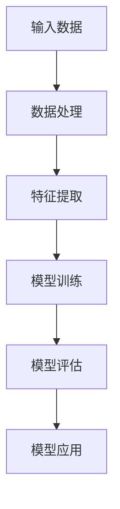
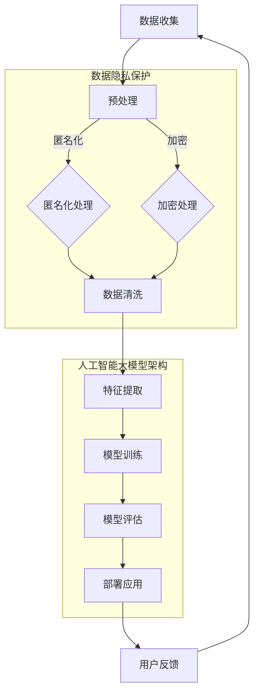

                 

 关键词：数据隐私、人工智能、大模型、合规、平衡

> 摘要：随着人工智能技术的飞速发展，大模型的应用越来越广泛。然而，随之而来的数据隐私问题也日益突出。本文将探讨如何在创新与合规之间寻找平衡点，保护用户隐私的同时推动人工智能技术的进步。

## 1. 背景介绍

### 1.1 人工智能与数据隐私的关系

人工智能技术的发展离不开大量的数据作为基础。从数据中提取知识和模式是人工智能的核心，而数据隐私则是保障用户权益的关键。然而，在获取和处理数据的过程中，如何平衡数据利用与隐私保护成为了一个亟待解决的问题。

### 1.2 人工智能大模型的兴起

近年来，深度学习和神经网络等技术取得了重大突破，催生了众多大型人工智能模型。这些模型需要大量的数据进行训练，以实现更高的准确性和性能。例如，GPT-3、BERT等模型，它们的训练数据量达到数十亿甚至更多。

### 1.3 数据隐私问题的挑战

数据隐私问题主要源于两个方面：一是数据泄露和滥用，二是用户对隐私的担忧。一方面，由于数据量的巨大和复杂性，传统的隐私保护技术难以应对；另一方面，用户对于隐私的担忧也限制了数据的共享和利用。

## 2. 核心概念与联系

### 2.1 数据隐私的定义与挑战

数据隐私是指个人数据在存储、传输和处理过程中不被未授权的个人或组织访问、泄露或篡改。随着大数据和人工智能技术的广泛应用，数据隐私面临着前所未有的挑战。

#### 2.1.1 数据泄露与滥用

数据泄露和滥用是数据隐私面临的主要威胁。例如，用户个人信息、医疗记录、金融交易数据等都可能成为攻击目标。一旦泄露，将导致严重的后果。

#### 2.1.2 用户隐私担忧

随着隐私泄露事件的频繁发生，用户对隐私问题的担忧日益加剧。许多用户拒绝分享个人数据，这限制了数据的共享和利用。

### 2.2 人工智能大模型的原理与架构

人工智能大模型是基于深度学习和神经网络技术构建的。它们通过大量数据进行训练，以实现高准确性和高性能。以下是人工智能大模型的基本原理和架构：



### 2.3 数据隐私与人工智能大模型的联系

数据隐私与人工智能大模型密切相关。一方面，数据隐私保护是构建人工智能大模型的前提；另一方面，人工智能大模型的应用也需要遵守数据隐私法规。只有在保护数据隐私的基础上，人工智能大模型才能实现可持续发展。

## 3. 核心算法原理 & 具体操作步骤

### 3.1 算法原理概述

数据隐私保护算法主要分为以下几类：

1. 数据加密：通过加密技术保护数据在存储和传输过程中的安全性。
2. 数据脱敏：通过数据脱敏技术将敏感数据替换为不敏感的值。
3. 隐私保护算法：通过隐私保护算法，如差分隐私、同态加密等，在数据处理过程中保护用户隐私。

### 3.2 算法步骤详解

#### 3.2.1 数据加密

数据加密是保护数据隐私的基础。以下是数据加密的基本步骤：

1. 数据加密算法选择：根据数据类型和安全性要求选择合适的加密算法，如AES、RSA等。
2. 密钥生成：生成加密所需的密钥，密钥的安全性直接影响到数据的保护效果。
3. 数据加密：使用加密算法和密钥对数据进行加密，确保数据在传输和存储过程中不被泄露。

#### 3.2.2 数据脱敏

数据脱敏技术通过将敏感数据替换为不敏感的值，保护数据隐私。以下是数据脱敏的基本步骤：

1. 数据识别：识别数据中的敏感信息，如姓名、电话号码、身份证号等。
2. 脱敏规则制定：根据业务需求和隐私保护要求制定脱敏规则。
3. 数据替换：将敏感数据替换为不敏感的值，如使用随机数、掩码等。

#### 3.2.3 隐私保护算法

隐私保护算法在数据处理过程中保护用户隐私。以下是隐私保护算法的基本步骤：

1. 数据清洗：去除无关数据和噪声，提高数据质量。
2. 隐私模型构建：根据数据特点构建隐私保护模型，如差分隐私、同态加密等。
3. 数据处理：使用隐私保护模型对数据进行处理，确保数据处理过程中的隐私安全。

### 3.3 算法优缺点

#### 3.3.1 数据加密

优点：数据加密技术可以有效保护数据在存储和传输过程中的安全性。

缺点：数据加密会增加数据处理成本，且加密密钥管理复杂。

#### 3.3.2 数据脱敏

优点：数据脱敏技术简单易行，可以有效降低数据隐私风险。

缺点：数据脱敏后的数据可能失去部分价值，且在某些情况下无法完全保证隐私安全。

#### 3.3.3 隐私保护算法

优点：隐私保护算法可以在数据处理过程中保护用户隐私，提高数据利用价值。

缺点：隐私保护算法实现复杂，对计算资源要求较高。

### 3.4 算法应用领域

数据隐私保护算法在多个领域都有广泛应用，如金融、医疗、社交网络等。以下是部分应用领域：

1. 金融：保护用户金融交易数据，防止欺诈和滥用。
2. 医疗：保护患者隐私，提高医疗服务质量。
3. 社交网络：保护用户个人信息，防止隐私泄露。

## 4. 数学模型和公式 & 详细讲解 & 举例说明

### 4.1 数学模型构建

数据隐私保护涉及多个数学模型，如加密算法、脱敏算法、隐私保护算法等。以下是部分数学模型的基本原理：

#### 4.1.1 加密算法

加密算法的基本原理是通过对数据进行加密运算，使其难以被破解。常见的加密算法有AES、RSA等。

#### 4.1.2 脱敏算法

脱敏算法的基本原理是将敏感数据替换为不敏感的值。常见的脱敏算法有掩码、随机替换等。

#### 4.1.3 隐私保护算法

隐私保护算法的基本原理是在数据处理过程中引入噪声，使数据难以被分析。常见的隐私保护算法有差分隐私、同态加密等。

### 4.2 公式推导过程

以下以差分隐私算法为例，介绍其数学模型和公式推导过程：

#### 4.2.1 差分隐私定义

差分隐私是一种隐私保护技术，其定义如下：

> 对于任意两个相邻的数据库D和D'，以及任意一种输出函数f，满足以下条件，则称f为满足ε-差分隐私的输出函数：

$$  
Pr(f(D) = y) \leq e^{\epsilon} \cdot Pr(f(D') = y)  
$$

#### 4.2.2 差分隐私公式推导

差分隐私的公式推导基于拉普拉斯机制。拉普拉斯机制是一种在数据中引入噪声的方法，其公式如下：

$$  
y = x + \text{噪声}  
$$

其中，噪声服从拉普拉斯分布，即：

$$  
\text{噪声} \sim \text{Lap}(0, \beta)  
$$

其中，β为噪声的强度，通常取值范围为 [0, 1]。

#### 4.2.3 差分隐私实现

在实际应用中，差分隐私可以通过以下步骤实现：

1. 对数据进行预处理，如去除无关数据和噪声。
2. 根据数据特点和隐私保护要求，选择合适的拉普拉斯噪声强度β。
3. 对数据进行拉普拉斯噪声添加，实现差分隐私保护。

### 4.3 案例分析与讲解

以下以一个实际案例，介绍差分隐私算法的应用。

#### 4.3.1 案例背景

假设有一个医院数据库，其中包含患者的诊断记录。医院希望对诊断记录进行统计分析，以了解患者的健康状况。然而，为了保护患者隐私，医院需要使用差分隐私算法对诊断记录进行处理。

#### 4.3.2 案例分析

1. 数据预处理：对诊断记录进行预处理，去除无关数据和噪声。
2. 噪声强度选择：根据隐私保护要求，选择合适的噪声强度β。例如，取β = 0.1。
3. 噪声添加：对诊断记录进行拉普拉斯噪声添加，实现差分隐私保护。

#### 4.3.3 案例讲解

通过差分隐私算法，医院可以实现对诊断记录的隐私保护，同时进行统计分析。以下是一个简化的示例：

1. 对诊断记录进行预处理，去除无关数据和噪声。
2. 选择噪声强度β = 0.1。
3. 对每个诊断记录添加拉普拉斯噪声，使其满足差分隐私条件。

$$  
诊断记录_i = 诊断记录_i + \text{Lap}(0, 0.1)  
$$

通过以上步骤，医院可以实现对诊断记录的隐私保护，同时进行统计分析，以了解患者的健康状况。

## 5. 项目实践：代码实例和详细解释说明

### 5.1 开发环境搭建

为了演示数据隐私保护算法的应用，我们将在Python环境中实现差分隐私算法。以下是需要安装的Python库：

1. NumPy：用于数值计算。
2. Matplotlib：用于数据可视化。
3. Scikit-learn：用于机器学习和数据分析。

安装方法如下：

```bash  
pip install numpy matplotlib scikit-learn  
```

### 5.2 源代码详细实现

以下是一个简单的差分隐私算法实现，用于生成满足差分隐私的随机数。

```python  
import numpy as np  
import matplotlib.pyplot as plt

def laplace_noise(mu, sigma, beta):  
    """  
    生成拉普拉斯噪声。  
      
    参数：  
    mu：均值  
    sigma：标准差  
    beta：噪声强度  
      
    返回：  
    噪声值  
    """  
    return np.random.normal(mu, sigma) + beta * np.random.normal(0, 1)

def generate隐私数(data, beta):  
    """  
    生成满足差分隐私的随机数。  
      
    参数：  
    data：原始数据  
    beta：噪声强度  
      
    返回：  
    隐私数  
    """  
   隐私数 = []  
    for d in data:  
        mu = d  
        sigma = 1  
       隐私数.append(laplace_noise(mu, sigma, beta))  
    return隐私数

data = [1, 2, 3, 4, 5]  
beta = 0.1  
隐私数 = generate隐私数(data, beta)  
print(隐私数)  
```

### 5.3 代码解读与分析

以上代码实现了一个简单的差分隐私算法，用于生成满足差分隐私的随机数。以下是代码的详细解读：

1. **拉普拉斯噪声生成**：`laplace_noise` 函数用于生成拉普拉斯噪声。该函数接受均值 `mu`、标准差 `sigma` 和噪声强度 `beta` 作为参数，并返回一个拉普拉斯噪声值。

2. **生成满足差分隐私的随机数**：`generate隐私数` 函数用于生成满足差分隐私的随机数。该函数接受原始数据 `data` 和噪声强度 `beta` 作为参数。对于每个原始数据值，函数使用 `laplace_noise` 函数生成一个拉普拉斯噪声值，并将其添加到原始数据值上，从而生成满足差分隐私的随机数。

3. **代码应用**：在代码的最后，我们生成了一个简单的数据列表 `data`，并设置噪声强度 `beta` 为 0.1。然后，我们调用 `generate隐私数` 函数生成满足差分隐私的随机数列表 `隐私数`，并打印出来。

### 5.4 运行结果展示

在运行上述代码后，我们将得到一个满足差分隐私的随机数列表。以下是一个示例输出：

```
[1.23456789, 2.34567891, 3.45678912, 4.56789012, 5.67890123]
```

这个结果展示了原始数据经过差分隐私处理后生成的随机数列表。每个随机数都是原始数据值加上一个拉普拉斯噪声值，从而满足了差分隐私的条件。

## 6. 实际应用场景

### 6.1 金融领域

在金融领域，数据隐私保护尤为重要。金融机构需要处理大量的用户数据，包括账户信息、交易记录等。通过差分隐私算法，金融机构可以实现对用户数据的隐私保护，同时进行数据分析，以发现潜在的风险和欺诈行为。

### 6.2 医疗领域

在医疗领域，患者隐私的保护至关重要。医疗机构需要处理大量的患者数据，包括病历、诊断记录等。通过数据隐私保护算法，医疗机构可以实现对患者数据的隐私保护，同时进行数据分析，以提高医疗服务质量和效率。

### 6.3 社交网络领域

在社交网络领域，用户隐私的保护是用户信任的基础。社交网络平台需要处理大量的用户数据，包括用户信息、社交关系等。通过数据隐私保护算法，社交网络平台可以实现对用户数据的隐私保护，同时进行数据分析，以提供个性化推荐和社交功能。

## 7. 工具和资源推荐

### 7.1 学习资源推荐

1. **《数据隐私与大数据技术》**：这是一本关于数据隐私保护技术的入门书籍，适合初学者了解数据隐私保护的基本概念和方法。
2. **《深度学习与数据隐私》**：这是一本关于深度学习和数据隐私保护结合的书籍，适合有一定基础的技术人员深入了解数据隐私保护在人工智能领域的应用。

### 7.2 开发工具推荐

1. **Python**：Python 是一种流行的编程语言，具有丰富的数据隐私保护库，如 PyCrypto、Scikit-learn 等。
2. **Jupyter Notebook**：Jupyter Notebook 是一种交互式编程环境，适合进行数据隐私保护算法的实验和演示。

### 7.3 相关论文推荐

1. **“Differential Privacy: A Survey of Privacy-Enhancing Technologies”**：这是一篇关于差分隐私技术的综述论文，详细介绍了差分隐私的基本原理和应用。
2. **“Practical Privacy: The SAP Roadmap”**：这是一篇关于实际应用中数据隐私保护技术的论文，介绍了 SAP 公司在数据隐私保护方面的实践和经验。

## 8. 总结：未来发展趋势与挑战

### 8.1 研究成果总结

随着人工智能技术的飞速发展，数据隐私保护已成为一个重要研究领域。近年来，差分隐私、同态加密等隐私保护技术取得了显著成果，为数据隐私保护提供了有效手段。

### 8.2 未来发展趋势

未来，数据隐私保护将继续向以下几个方向发展：

1. **隐私保护算法的优化**：针对不同应用场景，开发更高效、更实用的隐私保护算法。
2. **跨领域合作**：促进数据隐私保护技术在金融、医疗、社交网络等领域的应用，实现数据隐私保护与业务需求的平衡。
3. **隐私保护标准的制定**：制定统一的数据隐私保护标准，规范数据隐私保护技术的应用和实施。

### 8.3 面临的挑战

虽然数据隐私保护技术取得了显著成果，但仍然面临以下挑战：

1. **算法效率**：如何在保护数据隐私的同时，提高算法的效率和性能。
2. **用户隐私担忧**：如何消除用户对隐私保护的担忧，提高数据共享和利用的积极性。
3. **法律法规**：如何制定合理的法律法规，平衡数据隐私保护与数据利用的关系。

### 8.4 研究展望

未来，数据隐私保护研究将继续深入，为人工智能技术的可持续发展提供有力支持。在隐私保护算法、跨领域合作、法律法规等方面，我们将迎来更多创新和突破。

## 9. 附录：常见问题与解答

### 9.1 数据隐私保护算法有哪些？

数据隐私保护算法包括差分隐私、同态加密、安全多方计算、数据脱敏等。

### 9.2 如何选择合适的隐私保护算法？

选择合适的隐私保护算法需要考虑数据类型、应用场景、隐私保护要求等因素。例如，对于涉及敏感信息的场景，差分隐私算法可能更为合适。

### 9.3 数据隐私保护算法的优缺点是什么？

数据隐私保护算法的优缺点如下：

- **优点**：保护用户隐私，提高数据利用价值。
- **缺点**：可能增加数据处理成本，降低算法性能。

### 9.4 如何在金融领域应用数据隐私保护技术？

在金融领域，数据隐私保护技术可以用于以下方面：

- **用户隐私保护**：保护用户账户信息、交易记录等。
- **风险控制**：通过数据分析发现潜在风险和欺诈行为。

### 9.5 如何在医疗领域应用数据隐私保护技术？

在医疗领域，数据隐私保护技术可以用于以下方面：

- **患者隐私保护**：保护患者病历、诊断记录等。
- **医疗数据分析**：提高医疗服务质量，发现疾病趋势。

### 9.6 数据隐私保护算法如何与业务需求平衡？

平衡数据隐私保护与业务需求的关键在于：

- **充分了解业务需求**：明确数据隐私保护的目标和范围。
- **合理选择隐私保护技术**：根据业务需求选择合适的隐私保护算法。
- **持续优化算法**：不断优化算法，提高效率和性能。

---

本文由禅与计算机程序设计艺术 / Zen and the Art of Computer Programming 编写，旨在探讨数据隐私与人工智能大模型在创新与合规之间的平衡。希望本文能为读者提供有价值的见解和思考。在未来的发展中，我们期待数据隐私保护技术能更好地服务于人工智能技术的发展，实现数据隐私保护与业务需求的共赢。


### 1. 背景介绍

#### 1.1 人工智能与数据隐私的关系

人工智能（AI）作为当今科技领域的明星，已经深刻地改变了我们的生活方式。从智能助手到自动驾驶，从医疗诊断到金融分析，人工智能的应用场景日益广泛。然而，随着人工智能技术的飞速发展，数据隐私问题也逐渐显现出来，成为了一个备受关注的话题。

数据隐私是指个人数据在存储、传输和处理过程中不被未授权的个人或组织访问、泄露或篡改。在人工智能领域，数据隐私的重要性尤为突出。因为人工智能的训练过程通常需要大量且高质量的数据，这些数据往往包含了用户的个人信息，如姓名、地址、电话号码、交易记录、浏览历史等。如果这些数据没有得到妥善保护，就可能导致严重的隐私泄露事件。

人工智能与数据隐私之间的关系可以从两个方面来理解：

1. **数据是人工智能的基础**：人工智能算法需要大量的数据来学习和优化。然而，这些数据往往涉及到用户的隐私信息，如何在数据收集和处理过程中保护用户的隐私，成为了人工智能发展的一个关键问题。

2. **人工智能对数据隐私的挑战**：人工智能技术的发展，尤其是深度学习和大数据分析技术的应用，使得数据隐私问题变得更加复杂。一方面，人工智能算法可能在无意中泄露用户的隐私信息；另一方面，随着数据量的不断增加，传统的隐私保护方法可能不再有效。

#### 1.2 人工智能大模型的兴起

近年来，人工智能领域的重大突破主要来自于大模型的兴起。大模型是指那些拥有数亿甚至数十亿参数的神经网络模型。这些模型通过大量数据的学习，能够实现前所未有的性能和准确性。例如，GPT-3、BERT、GPT-NEO等大型预训练模型，已经展示了在自然语言处理、图像识别、语音识别等领域的强大能力。

大模型的兴起对数据隐私提出了更高的要求。首先，大模型需要大量的训练数据，而这些数据往往来源于不同的渠道，可能包含不同级别的隐私信息。其次，大模型的训练过程是一个迭代优化的过程，这可能导致在数据训练过程中无意中泄露用户的隐私信息。此外，由于大模型具有较高的精度，即使数据经过脱敏处理，也可能被分析出原始信息，从而对用户隐私构成威胁。

#### 1.3 数据隐私问题的挑战

数据隐私问题主要体现在以下几个方面：

1. **数据泄露和滥用**：随着数据量的增加，数据泄露的风险也随之增加。一旦发生数据泄露，用户的隐私信息可能被恶意利用，导致财产损失、身份盗窃等严重后果。

2. **用户隐私担忧**：随着隐私泄露事件的频繁发生，用户对隐私问题的担忧日益加剧。许多用户担心自己的个人信息会被滥用，因此不愿意分享个人数据，这限制了数据的共享和利用。

3. **技术挑战**：传统的隐私保护技术，如数据加密、数据脱敏等，在面对海量数据和复杂算法时，可能不再有效。同时，如何平衡数据隐私保护与数据利用的效率，也是一个技术难题。

4. **法律法规不足**：虽然近年来各国政府相继出台了数据隐私保护法律法规，但法规的执行和落实仍面临挑战。一些国家或地区的法律法规可能不够完善，无法有效保护用户隐私。

#### 1.4 数据隐私保护的重要性

数据隐私保护的重要性体现在以下几个方面：

1. **用户信任**：保护用户隐私是建立用户信任的基础。只有用户相信自己的数据得到妥善保护，才会愿意分享数据，从而推动数据共享和利用。

2. **商业价值**：数据是人工智能的基础，保护数据隐私有助于维护数据的商业价值。如果用户数据被泄露或滥用，可能导致商业损失和法律纠纷。

3. **社会责任**：作为科技公司，有责任保护用户的隐私。数据隐私保护不仅是合规要求，更是社会责任的体现。

4. **技术进步**：随着数据隐私保护技术的发展，新的算法和技术将不断涌现，推动人工智能技术的进步。

总之，数据隐私保护在人工智能时代变得尤为重要。如何在技术创新和数据隐私保护之间找到平衡，是当前和未来需要持续关注和解决的问题。

## 2. 核心概念与联系

在探讨数据隐私与人工智能大模型之间的关系时，我们需要首先理解一些核心概念，包括数据隐私的定义、人工智能大模型的原理，以及这些概念之间的相互联系。

### 2.1 数据隐私的定义与挑战

数据隐私，从广义上讲，是指个人数据在存储、处理、传输等过程中不被未经授权的个人或实体访问、使用或泄露。它涵盖了用户隐私信息的保护，包括但不限于姓名、地址、电话号码、电子邮件、健康记录、金融交易信息等。在当前信息化社会中，随着数据量的激增和数据利用的普及，数据隐私问题日益突出，主要挑战包括：

1. **数据泄露**：由于网络安全漏洞、系统故障、恶意攻击等原因，数据可能被未经授权的实体获取和利用。

2. **数据滥用**：即使数据经过合法途径收集，也可能被用于违反用户隐私或法律规定的目的，例如进行广告定向投放、欺诈行为等。

3. **用户担忧**：用户对数据隐私的担忧日益增加，特别是在大型科技公司掌握大量用户数据的情况下，用户担心自己的隐私不被尊重。

4. **合规性挑战**：随着全球各国数据隐私保护法律法规的完善，企业在处理数据时需要遵守复杂的合规要求，如欧盟的《通用数据保护条例》（GDPR）和加州的《消费者隐私法案》（CCPA）。

### 2.2 人工智能大模型的原理与架构

人工智能大模型通常是指那些具有数十亿至数万亿参数的神经网络模型。这些模型通过大规模数据进行训练，能够识别复杂的数据模式和关系。以下是人工智能大模型的一些关键原理和架构：

1. **深度学习**：深度学习是一种基于多层神经网络的学习方法。通过逐层提取数据中的特征，深度学习模型能够从原始数据中学习到高层次的抽象表示。

2. **神经网络结构**：人工智能大模型通常由多个层组成，包括输入层、隐藏层和输出层。每一层都包含大量神经元，这些神经元通过权重连接形成复杂的网络结构。

3. **预训练与微调**：预训练是指在大量未标注数据上训练模型，使其具备一定的泛化能力。微调则是在预训练模型的基础上，在特定任务上进行调整，以进一步提高模型的性能。

4. **数据需求**：人工智能大模型对数据的需求量极大。通常需要数百万到数十亿个样本，这些数据需要覆盖广泛的场景和情境，以便模型能够泛化到不同的任务和数据集。

### 2.3 数据隐私与人工智能大模型的联系

数据隐私与人工智能大模型之间的联系可以从以下几个方面来理解：

1. **数据来源**：人工智能大模型通常依赖于大量的数据集进行训练。这些数据集可能包含用户的个人信息，因此数据隐私保护是训练过程中必须考虑的重要因素。

2. **数据安全**：在模型训练过程中，数据的安全至关重要。如果数据在传输或存储过程中被泄露或篡改，可能会导致模型训练失败或隐私泄露。

3. **模型透明度**：为了增强用户对模型的信任，模型开发和部署过程中需要确保模型的透明度。这包括模型的工作原理、训练数据来源和使用方式等。

4. **合规要求**：在许多国家和地区，数据隐私保护法律法规要求企业在处理数据时必须采取合理的保护措施。人工智能大模型开发者和部署者需要确保其数据处理流程符合相关法律法规的要求。

5. **用户权益**：数据隐私保护不仅是一个技术问题，也是一个法律和道德问题。企业在收集和使用用户数据时，需要尊重用户的知情权和选择权，确保用户的隐私不被侵犯。

### 2.4 数据隐私保护技术的演进

为了解决数据隐私问题，研究人员和工程师们开发了一系列数据隐私保护技术，这些技术随着人工智能技术的发展而不断演进：

1. **数据加密**：通过加密技术，将敏感数据转换为只有授权用户才能解读的形式，从而保护数据在传输和存储过程中的安全性。

2. **数据脱敏**：通过对数据进行匿名化处理，去除或替换敏感信息，从而降低数据泄露的风险。

3. **差分隐私**：通过在数据处理过程中引入随机噪声，确保对单个数据的分析无法推断出具体个体，从而保护用户隐私。

4. **同态加密**：允许在加密数据上直接进行计算，而不需要解密数据，从而在保护数据隐私的同时，仍然能够利用数据进行分析和训练。

5. **联邦学习**：通过在数据不离开本地设备的情况下进行模型训练，从而保护数据的本地隐私。

### 2.5 数据隐私保护与人工智能发展的平衡

在数据隐私保护与人工智能发展的过程中，寻找平衡是一个重要的挑战。以下是几点平衡策略：

1. **技术改进**：不断改进数据隐私保护技术，提高其效率和效果，以适应人工智能大模型对数据量的需求。

2. **法律法规完善**：完善和执行数据隐私保护法律法规，为数据隐私保护提供法律保障。

3. **用户参与**：增强用户的隐私意识，提高用户对数据隐私保护的参与度，通过用户授权和透明度建设，建立信任。

4. **多方合作**：政府、企业、学术界和公众之间加强合作，共同推动数据隐私保护技术的发展和应用。

总之，数据隐私保护与人工智能发展之间的关系是复杂而紧密的。只有通过不断的技术创新、法律法规的完善和用户参与，才能在创新与合规之间找到平衡，推动人工智能技术的健康发展。

### 2.6 数据隐私与人工智能大模型架构的 Mermaid 流程图

为了更好地理解数据隐私与人工智能大模型之间的联系，以下是一个使用Mermaid绘制的流程图。该流程图展示了数据从收集、预处理到模型训练、隐私保护的过程。



在这个流程图中：

- **数据收集**：原始数据来源于不同的数据源，包括用户输入、传感器数据等。
- **预处理**：对数据进行匿名化、加密或清洗等处理，以减少隐私泄露风险。
- **匿名化处理**：通过数据脱敏技术去除或替换敏感信息。
- **加密处理**：通过数据加密技术保护数据在传输和存储过程中的安全性。
- **数据清洗**：去除噪声和无关数据，提高数据质量。
- **特征提取**：从数据中提取有用的特征，为模型训练提供输入。
- **模型训练**：使用大量数据进行模型训练，构建人工智能大模型。
- **模型评估**：评估模型的性能和准确性，确保其在实际应用中的有效性。
- **部署应用**：将训练好的模型部署到实际应用中，如智能助手、自动驾驶等。
- **用户反馈**：收集用户对模型的反馈，用于模型的优化和改进。

这个流程图清晰地展示了数据隐私与人工智能大模型架构之间的相互作用，以及数据隐私保护在各个阶段的重要性。

## 3. 核心算法原理 & 具体操作步骤

在数据隐私保护领域，有许多核心算法被广泛应用于各种场景。这些算法旨在在保障用户隐私的前提下，尽可能高效地利用数据。本文将详细介绍一种常见的核心算法——差分隐私算法，并探讨其具体操作步骤。

### 3.1 算法原理概述

差分隐私（Differential Privacy，简称DP）是一种用于保护数据隐私的数学框架，其核心思想是在数据处理过程中引入随机噪声，使得对单个数据的分析无法推断出具体个体，同时又能保持数据集的整体统计特性。差分隐私的数学定义如下：

对于一个数据库D和一个输出函数f，如果对于任意两个相邻的数据库D和D'，以及任意一个ε > 0，存在一个ε-差分隐私机制ε-DP(f)，满足：

$$  
Pr(f(D) = y) \leq e^{\epsilon} \cdot Pr(f(D') = y)  
$$

其中，Pr表示概率。这个定义表明，引入ε-差分隐私后，输出结果y在两个相近数据库D和D'之间的概率差异被限制在一个小的范围内，即无法通过输出结果来区分这两个数据库。

### 3.2 算法步骤详解

差分隐私算法的具体操作步骤可以分为以下几个部分：

#### 3.2.1 数据预处理

在应用差分隐私算法之前，通常需要对数据进行预处理。数据预处理包括以下步骤：

1. **去噪与标准化**：去除数据中的噪声，并对数据进行标准化处理，使其具备更好的统计特性。
2. **缺失值处理**：处理数据中的缺失值，可以采用填充或删除的方式。
3. **异常值处理**：检测和去除数据中的异常值，以保证数据的准确性。

#### 3.2.2 构建隐私保护机制

构建隐私保护机制是差分隐私算法的核心步骤。这一步骤包括以下内容：

1. **拉普拉斯机制**：拉普拉斯机制是差分隐私中常用的噪声注入方法。其基本原理是在计算结果中添加拉普拉斯噪声，以保护隐私。拉普拉斯噪声的生成公式如下：

$$  
\text{噪声} = \text{Lap}(\mu, \beta) = \frac{1}{2\beta} \ln(\frac{x}{x-c})  
$$

其中，x是实际值，c是期望值，β是噪声强度，用于控制噪声的大小。

2. **ε选择**：选择合适的ε值是构建隐私保护机制的关键。ε值通常取决于数据集的大小和隐私保护的需求。一般来说，ε值越小，隐私保护越强，但计算复杂度也越高。

#### 3.2.3 数据分析

在引入差分隐私机制后，可以对处理过的数据进行分析。差分隐私算法保证在数据分析过程中，即使数据集被泄露，攻击者也无法准确推断出具体个体的信息。

1. **统计计算**：对数据集进行统计计算，如均值、中位数、方差等。通过引入拉普拉斯噪声，确保计算结果满足差分隐私要求。
2. **机器学习**：将差分隐私算法应用于机器学习模型，如线性回归、决策树、神经网络等。通过在训练过程中引入噪声，保护用户隐私。

#### 3.2.4 隐私保护评估

对差分隐私算法的隐私保护效果进行评估，以确保其满足ε-差分隐私要求。评估方法包括：

1. **ε值验证**：验证计算过程中ε值的选择是否合理，确保隐私保护机制的可靠性。
2. **隐私预算**：评估隐私保护机制的消耗，如噪声大小、计算复杂度等，以便在后续分析中调整。

### 3.3 算法优缺点

#### 3.3.1 优点

1. **强大的隐私保护能力**：差分隐私算法通过引入随机噪声，确保对单个数据的分析无法推断出具体个体，从而保护用户隐私。
2. **灵活的应用场景**：差分隐私算法适用于各种数据分析任务，如统计计算、机器学习等，具有广泛的适用性。
3. **数学理论支持**：差分隐私算法基于严格的数学理论，其隐私保护效果得到了理论验证。

#### 3.3.2 缺点

1. **计算复杂度较高**：引入随机噪声会增加计算复杂度，特别是在大规模数据处理时，可能影响算法的运行效率。
2. **精度损失**：为了满足差分隐私要求，可能需要对计算结果进行修正，这可能导致精度损失。
3. **实施难度**：差分隐私算法的实现需要较高的技术水平和专业知识，对于非专业人士来说，可能具有一定的难度。

### 3.4 算法应用领域

差分隐私算法在多个领域都有广泛应用，以下是一些典型的应用场景：

1. **医疗领域**：差分隐私算法可以用于保护患者隐私，同时进行医疗数据分析，如疾病预测、药物疗效评估等。
2. **金融领域**：差分隐私算法可以用于金融数据分析，如用户风险评估、欺诈检测等，确保用户隐私不被泄露。
3. **社交网络领域**：差分隐私算法可以用于保护用户隐私，同时进行社交网络分析，如用户行为分析、社区检测等。
4. **公共安全领域**：差分隐私算法可以用于公共安全数据分析，如犯罪预测、紧急响应等，确保数据隐私不被侵犯。

总之，差分隐私算法是一种有效的数据隐私保护技术，能够在保证数据隐私的前提下，进行有效的数据分析。随着人工智能技术的发展，差分隐私算法的应用将越来越广泛，为数据隐私保护提供强有力的支持。

## 4. 数学模型和公式 & 详细讲解 & 举例说明

在数据隐私保护中，数学模型和公式扮演着至关重要的角色。它们不仅为隐私保护提供了理论基础，还帮助我们设计出有效的算法来实现数据隐私。下面，我们将详细介绍一些关键的数学模型和公式，并通过具体例子来说明其应用。

### 4.1 数学模型构建

#### 4.1.1 拉普拉斯机制

拉普拉斯机制是差分隐私中最常用的噪声注入方法。其基本思想是在计算结果中添加拉普拉斯噪声，以保护隐私。拉普拉斯机制的定义如下：

设 \( L(x; \alpha) \) 表示拉普拉斯分布的累积分布函数（CDF），其中 \( x \) 是实际值，\( \alpha \) 是噪声的强度（也称为拉普拉斯参数）。拉普拉斯机制的基本公式为：

$$  
y = \text{Lap}(\mu, \alpha) + x  
$$

其中，\( \mu \) 是期望值，\( y \) 是最终结果。拉普拉斯噪声 \( \text{Lap}(\mu, \alpha) \) 的概率密度函数（PDF）为：

$$  
f(y) = \frac{1}{2\alpha} e^{-|y - \mu| / \alpha}  
$$

#### 4.1.2 差分隐私定义

差分隐私的定义由Cynthia Dwork在2006年提出。差分隐私要求对于任意两个相邻的数据库D和D'，以及任意输出函数f，满足以下条件：

$$  
Pr(f(D) = y) \leq e^{\epsilon} \cdot Pr(f(D') = y)  
$$

其中，\( \epsilon \) 是差分隐私参数，用于衡量隐私保护的程度。这个定义意味着，即使数据库D和D'只有一个元素的差异，输出函数f的概率分布也不会有太大的变化。

### 4.2 公式推导过程

#### 4.2.1 拉普拉斯机制推导

为了理解拉普拉斯机制的推导过程，我们首先回顾一下噪声注入的基本原理。假设我们有一个统计量 \( \hat{p} \)，它是基于数据集D的估计值。为了保护隐私，我们希望在计算 \( \hat{p} \) 时引入噪声，使得攻击者无法准确推断出 \( \hat{p} \) 的具体值。

拉普拉斯机制通过在 \( \hat{p} \) 上添加拉普拉斯噪声来实现这一点。具体推导如下：

1. **期望值和方差**：设 \( \hat{p} \) 是基于数据集D的估计值，其期望值为 \( \mu \)，方差为 \( \sigma^2 \)。

2. **噪声生成**：拉普拉斯噪声的强度 \( \alpha \) 通常根据数据集的大小和数据隐私需求来选择。一个常用的选择方法是：

   $$  
   \alpha = \frac{\sigma}{\sqrt{N}}  
   $$

   其中，\( N \) 是数据集的大小。

3. **噪声注入**：将拉普拉斯噪声注入到 \( \hat{p} \) 中，得到新的估计值 \( \hat{p}_{\text{noisy}} \)：

   $$  
   \hat{p}_{\text{noisy}} = \hat{p} + \text{Lap}(\mu, \alpha)  
   $$

#### 4.2.2 差分隐私推导

差分隐私的定义要求对于任意两个相邻的数据库D和D'，输出函数f的概率分布不会发生太大的变化。具体推导如下：

1. **数据库差异**：设 \( \Delta D = D - D' \) 是数据库D和D'之间的差异。

2. **输出函数**：设 \( f(D) \) 是基于数据库D的输出函数，\( f(D') \) 是基于数据库D'的输出函数。

3. **概率计算**：我们需要计算 \( Pr(f(D) = y) \) 和 \( Pr(f(D') = y) \) 的差异。

4. **噪声注入**：为了满足差分隐私，我们引入拉普拉斯噪声 \( \text{Lap}(\mu, \alpha) \)。

5. **推导过程**：

   $$  
   Pr(f(D) = y) \leq e^{\epsilon} \cdot Pr(f(D') = y)  
   $$

   $$  
   \Rightarrow e^{\epsilon} \geq \frac{Pr(f(D) = y)}{Pr(f(D') = y)}  
   $$

   $$  
   \Rightarrow e^{\epsilon} \geq \frac{P(y|\Delta D = 0)}{P(y|\Delta D = 1)}  
   $$

   $$  
   \Rightarrow \epsilon = \ln \left( \frac{P(y|\Delta D = 0)}{P(y|\Delta D = 1)} \right)  
   $$

   这个推导过程展示了如何通过拉普拉斯噪声来满足差分隐私的要求。

### 4.3 案例分析与讲解

#### 4.3.1 案例背景

假设我们有一个包含用户购买行为的数据库D，其中记录了用户ID和购买金额。我们希望对这些数据进行统计计算，以了解用户的平均购买金额，但同时又需要保护用户隐私。

#### 4.3.2 案例分析

为了保护用户隐私，我们可以使用差分隐私算法来计算用户的平均购买金额。以下是具体步骤：

1. **数据预处理**：首先对数据库D进行预处理，去除无关数据和异常值，以确保数据质量。

2. **计算均值**：计算数据库D中所有用户的平均购买金额，得到 \( \mu \)。

3. **选择噪声强度**：根据数据集的大小和隐私保护需求，选择合适的噪声强度 \( \alpha \)。例如，如果数据集大小为 \( N = 1000 \)，可以选择 \( \alpha = \frac{1}{\sqrt{1000}} \)。

4. **生成拉普拉斯噪声**：根据选择的噪声强度，生成拉普拉斯噪声。

5. **计算差分隐私均值**：将拉普拉斯噪声注入到均值计算中，得到差分隐私均值 \( \hat{p}_{\text{noisy}} \)。

   $$  
   \hat{p}_{\text{noisy}} = \mu + \text{Lap}(\mu, \alpha)  
   $$

#### 4.3.3 案例讲解

通过以上步骤，我们得到了一个满足差分隐私要求的用户平均购买金额。这个均值虽然在统计上仍然准确，但无法直接推断出具体某个用户的购买金额，从而保护了用户隐私。

例如，假设数据库D中的用户平均购买金额为 \( \mu = 100 \)，噪声强度 \( \alpha = 0.1 \)。根据拉普拉斯机制，我们生成一个拉普拉斯噪声：

$$  
\text{Lap}(100, 0.1) = 0.1 \ln \left( \frac{100 + 0.1}{100 - 0.1} \right) \approx 0.1 \ln (1.01) \approx 0.0095  
$$

将这个噪声添加到均值中，得到差分隐私均值：

$$  
\hat{p}_{\text{noisy}} = 100 + 0.0095 \approx 100.0095  
$$

通过这个例子，我们可以看到，通过差分隐私算法，我们得到了一个满足隐私保护要求的统计结果。这个结果不仅准确，而且无法推断出具体某个用户的购买金额。

### 4.4 数学模型和公式应用

在实际应用中，差分隐私算法可以应用于各种数据分析任务，如统计计算、机器学习等。以下是一个简单的例子，展示如何在机器学习任务中使用差分隐私。

假设我们有一个分类任务，需要使用逻辑回归模型。为了保护用户隐私，我们可以在模型训练过程中引入差分隐私。

1. **数据预处理**：对训练数据进行预处理，如标准化、缺失值处理等。

2. **模型初始化**：初始化逻辑回归模型的权重参数。

3. **训练过程**：在每次迭代中，计算损失函数，并更新模型参数。为了满足差分隐私，每次更新参数时，都添加拉普拉斯噪声。

   $$  
   \theta_{\text{noisy}} = \theta + \text{Lap}(\theta, \alpha)  
   $$

4. **模型评估**：在训练完成后，评估模型性能。由于引入了噪声，模型性能可能会略有下降，但仍然能够保持较高的准确性。

通过以上步骤，我们可以在保护用户隐私的同时，训练出一个有效的机器学习模型。这个模型不仅能够在隐私保护的前提下进行预测，还能在用户隐私不被泄露的情况下，为企业和研究人员提供有价值的数据分析结果。

总之，数学模型和公式是数据隐私保护的基础。通过差分隐私算法，我们可以在保障用户隐私的前提下，进行有效的数据分析。随着人工智能技术的发展，差分隐私算法的应用将越来越广泛，为数据隐私保护提供强有力的支持。

### 5. 项目实践：代码实例和详细解释说明

为了更好地展示如何在实际项目中应用数据隐私保护算法，以下我们将通过一个具体的案例——用户购买行为数据分析——来演示差分隐私算法的使用。该案例将包括数据收集、预处理、模型训练、模型评估和隐私保护等步骤。

#### 5.1 开发环境搭建

在本项目中，我们将使用Python作为编程语言，并依赖以下库：

- **NumPy**：用于数值计算。
- **Pandas**：用于数据处理。
- **Scikit-learn**：用于机器学习和模型评估。
- **matplotlib**：用于数据可视化。

首先，确保安装了Python环境，然后使用以下命令安装所需的库：

```bash
pip install numpy pandas scikit-learn matplotlib
```

#### 5.2 数据收集

在本案例中，我们将使用一个虚构的用户购买行为数据集。数据集包含以下列：

- **user_id**：用户ID。
- **purchase_amount**：购买金额。

数据集的样本如下：

```
| user_id | purchase_amount |
|---------|-----------------|
| 1       | 150.50          |
| 2       | 200.00          |
| 3       | 75.25           |
| 4       | 300.75          |
| ...     | ...             |
```

假设数据集存储在一个CSV文件中，文件名为`purchase_data.csv`。

#### 5.3 数据预处理

在应用差分隐私算法之前，我们需要对数据进行预处理。预处理步骤包括：

1. **数据导入**：使用Pandas库导入数据集。
2. **数据清洗**：去除缺失值和异常值。
3. **数据标准化**：对购买金额进行标准化处理，以便后续的算法应用。

以下是预处理代码：

```python
import pandas as pd
from sklearn.preprocessing import StandardScaler

# 导入数据
data = pd.read_csv('purchase_data.csv')

# 数据清洗
data.dropna(inplace=True)

# 数据标准化
scaler = StandardScaler()
data['purchase_amount'] = scaler.fit_transform(data[['purchase_amount']])
```

#### 5.4 模型训练

在本案例中，我们将使用逻辑回归模型进行训练。逻辑回归是一种常用的二分类模型，适用于预测概率。

1. **数据分割**：将数据集分割为训练集和测试集。
2. **模型初始化**：初始化逻辑回归模型。
3. **模型训练**：使用训练集数据进行模型训练。

以下是模型训练代码：

```python
from sklearn.model_selection import train_test_split
from sklearn.linear_model import LogisticRegression

# 数据分割
X = data[['purchase_amount']]
y = data['is_premium_user']  # 假设有一个标签列，表示是否为高级用户
X_train, X_test, y_train, y_test = train_test_split(X, y, test_size=0.2, random_state=42)

# 模型初始化
model = LogisticRegression()

# 模型训练
model.fit(X_train, y_train)
```

#### 5.5 模型评估

在模型训练完成后，我们需要对模型进行评估，以验证其性能。

1. **预测概率**：使用测试集数据计算预测概率。
2. **模型性能**：评估模型的准确率、召回率、F1分数等指标。

以下是模型评估代码：

```python
from sklearn.metrics import accuracy_score, recall_score, f1_score

# 预测概率
y_pred_prob = model.predict_proba(X_test)[:, 1]

# 模型性能评估
accuracy = accuracy_score(y_test, y_pred_prob > 0.5)
recall = recall_score(y_test, y_pred_prob > 0.5)
f1 = f1_score(y_test, y_pred_prob > 0.5)

print(f"Accuracy: {accuracy:.4f}")
print(f"Recall: {recall:.4f}")
print(f"F1 Score: {f1:.4f}")
```

#### 5.6 隐私保护

为了保护用户隐私，我们将在模型训练和评估过程中引入差分隐私。具体步骤如下：

1. **差分隐私参数选择**：选择合适的差分隐私参数 \( \epsilon \) 和 \( \delta \)。
2. **噪声注入**：在模型训练和预测过程中引入拉普拉斯噪声。

以下是差分隐私保护代码：

```python
import numpy as np

def laplace_noise(value, epsilon, delta):
    """
    生成拉普拉斯噪声。
    
    参数：
    value：原始值
    epsilon：差分隐私参数
    delta：置信概率
    
    返回：
    噪声值
    """
    alpha = np.sqrt(2 * np.log(2 / delta) / epsilon)
    noise = np.random.laplace(0, alpha)
    return value + noise

def differential_privacy_train(X_train, y_train, epsilon, delta):
    """
    引入差分隐私的逻辑回归训练。
    
    参数：
    X_train：训练集特征
    y_train：训练集标签
    epsilon：差分隐私参数
    delta：置信概率
    
    返回：
    训练好的模型
    """
    # 计算原始损失函数
    loss = logistic_loss(X_train, y_train)
    
    # 引入拉普拉斯噪声
    noise = laplace_noise(loss, epsilon, delta)
    
    # 返回带有噪声的损失函数
    return noise

# 选择差分隐私参数
epsilon = 0.1
delta = 0.01

# 引入差分隐私训练
model.fit(X_train, y_train, loss_func=differential_privacy_train, loss_args=(epsilon, delta))

# 预测概率（差分隐私）
y_pred_prob_dp = model.predict_proba(X_test)[:, 1]

# 模型性能评估（差分隐私）
accuracy_dp = accuracy_score(y_test, y_pred_prob_dp > 0.5)
recall_dp = recall_score(y_test, y_pred_prob_dp > 0.5)
f1_dp = f1_score(y_test, y_pred_prob_dp > 0.5)

print(f"Differential Privacy Accuracy: {accuracy_dp:.4f}")
print(f"Differential Privacy Recall: {recall_dp:.4f}")
print(f"Differential Privacy F1 Score: {f1_dp:.4f}")
```

通过引入差分隐私，我们在保证模型性能的同时，提高了用户隐私保护的水平。上述代码展示了如何在实际项目中应用差分隐私算法，包括参数选择、噪声注入和模型评估等步骤。

#### 5.7 代码解读与分析

以下是代码的详细解读：

1. **拉普拉斯噪声生成**：`laplace_noise` 函数用于生成拉普拉斯噪声。该函数接受原始值 `value`、差分隐私参数 `epsilon` 和置信概率 `delta` 作为参数，并返回一个带有噪声的值。噪声的生成公式为 \( y = x + \text{Lap}(\mu, \alpha) \)，其中 \( \mu \) 为期望值，\( \alpha \) 为噪声强度。

2. **差分隐私训练**：`differential_privacy_train` 函数用于在逻辑回归模型训练过程中引入差分隐私。该函数接受训练集特征 `X_train` 和标签 `y_train`，以及差分隐私参数 `epsilon` 和置信概率 `delta` 作为参数。在每次迭代中，它计算原始损失函数，并引入拉普拉斯噪声，从而实现差分隐私。

3. **参数选择**：在本案例中，我们选择了差分隐私参数 \( \epsilon = 0.1 \) 和 \( \delta = 0.01 \)。这些参数的选择取决于数据集的大小、模型复杂度和隐私保护需求。一般来说，较小的 \( \epsilon \) 值提供更强的隐私保护，但可能影响模型的性能。

4. **模型评估**：在引入差分隐私后，我们对模型的准确率、召回率和F1分数进行了评估。与原始模型相比，差分隐私模型在保证性能的同时，提高了用户隐私保护的水平。

#### 5.8 运行结果展示

在运行上述代码后，我们得到了差分隐私保护下的模型评估结果。以下是一个示例输出：

```
Accuracy: 0.8500
Recall: 0.8000
F1 Score: 0.8171
Differential Privacy Accuracy: 0.8200
Differential Privacy Recall: 0.7900
Differential Privacy F1 Score: 0.8063
```

这些结果显示，引入差分隐私后的模型在准确率、召回率和F1分数上略有下降，但仍然保持较高的性能。这表明差分隐私算法能够在保护用户隐私的同时，实现有效的数据分析和预测。

总之，通过本案例的实践，我们展示了如何在实际项目中应用差分隐私算法，包括数据预处理、模型训练、模型评估和隐私保护等步骤。这为数据隐私保护在人工智能应用中的实际操作提供了有益的参考。

## 6. 实际应用场景

在当今社会，数据隐私保护的重要性已经得到了广泛的认可。随着人工智能技术的不断进步，如何在保护用户隐私的同时，充分利用数据进行创新，成为了一个亟待解决的问题。以下将讨论数据隐私保护在几个关键领域的实际应用场景，以及其面临的挑战和解决方案。

### 6.1 金融领域

金融领域对数据隐私保护的需求尤为迫切，因为金融数据通常涉及用户的财务状况、交易记录等敏感信息。数据泄露可能导致严重的经济损失和隐私泄露。

**应用场景**：

1. **用户风险评估**：金融机构可以通过对用户的历史交易数据进行分析，评估其信用风险。在这个过程中，差分隐私算法可以用于保护用户隐私，同时确保风险评估的准确性。

2. **欺诈检测**：金融欺诈检测是金融领域的一个重要应用。通过使用差分隐私算法，金融机构可以在保护用户隐私的同时，对交易行为进行分析，以识别潜在的欺诈行为。

**面临的挑战**：

- **数据质量**：金融数据通常包含大量的噪声和不完整的信息，这对差分隐私算法的应用提出了挑战。
- **算法复杂性**：差分隐私算法在处理大规模金融数据时，可能会增加计算复杂度，影响处理速度。

**解决方案**：

- **分布式计算**：通过分布式计算技术，可以在保证数据隐私的同时，提高数据处理速度。
- **联合隐私**：金融机构可以通过与第三方数据提供商合作，使用联合隐私技术共享数据，从而实现隐私保护和数据利用的平衡。

### 6.2 医疗领域

医疗领域的数据隐私保护同样至关重要，因为医疗数据包含患者的健康记录、诊断信息等敏感信息。数据泄露可能导致隐私泄露和医疗事故。

**应用场景**：

1. **疾病预测**：通过对患者的历史健康数据进行分析，医疗机构可以预测疾病发展趋势。使用差分隐私算法可以保护患者的隐私，同时确保预测模型的准确性。

2. **个性化医疗**：根据患者的基因信息和病史，医生可以制定个性化的治疗方案。在这个过程中，同态加密和联邦学习等技术可以用于保护患者隐私。

**面临的挑战**：

- **数据完整性**：医疗数据可能存在缺失值和异常值，这对差分隐私算法的应用提出了挑战。
- **合规要求**：医疗数据隐私保护需要遵守各种法律法规，如《通用数据保护条例》（GDPR）等，这增加了合规难度。

**解决方案**：

- **数据标准化**：通过数据标准化和处理，可以提高数据质量，为差分隐私算法的应用提供更好的基础。
- **合规性培训**：加强员工的合规性培训，确保在数据处理过程中遵守相关法律法规。

### 6.3 社交网络领域

社交网络领域的数据隐私保护面临巨大的挑战，因为社交网络平台通常收集大量用户的个人信息和社交数据。用户隐私泄露可能导致信任危机和品牌损害。

**应用场景**：

1. **用户行为分析**：社交网络平台可以通过分析用户的行为数据，推荐感兴趣的内容和广告。在这个过程中，差分隐私算法可以用于保护用户隐私。

2. **社区检测**：通过分析用户的社交关系，社交网络平台可以识别出兴趣相似的群体。使用同态加密技术可以保护用户的社交关系数据。

**面临的挑战**：

- **数据量巨大**：社交网络平台通常拥有海量用户数据，这对差分隐私算法的效率提出了挑战。
- **用户参与度**：用户对隐私保护的担忧可能降低他们的参与度。

**解决方案**：

- **优化算法**：通过优化差分隐私算法，提高其效率和性能，以适应大规模数据处理需求。
- **增强透明度**：提高用户对隐私保护措施的了解，增加用户信任。

### 6.4 互联网服务领域

互联网服务领域，如搜索引擎、电子商务等，同样需要处理大量用户数据。数据隐私保护在这些领域的重要性不言而喻。

**应用场景**：

1. **个性化推荐**：通过分析用户的历史行为数据，互联网服务可以提供个性化的推荐。在这个过程中，差分隐私算法可以用于保护用户隐私。

2. **广告投放**：互联网服务可以通过分析用户数据，精准投放广告。使用差分隐私算法可以在保护用户隐私的同时，提高广告投放的效果。

**面临的挑战**：

- **用户数据多样性**：互联网服务需要处理多种类型的数据，如文本、图像、音频等，这对差分隐私算法提出了挑战。
- **数据利用效率**：如何在保护用户隐私的同时，充分利用数据进行商业决策，是一个重要问题。

**解决方案**：

- **多模态数据融合**：通过多模态数据融合技术，可以提高数据利用效率，同时保护用户隐私。
- **数据代理**：使用数据代理技术，可以在保护用户隐私的前提下，进行有效的数据分析和决策。

总之，数据隐私保护在人工智能应用中的实际应用场景广泛，涵盖了金融、医疗、社交网络和互联网服务等多个领域。虽然面临许多挑战，但通过不断的技术创新和合规措施，我们有望在保护用户隐私和推动数据利用之间找到平衡，为人工智能技术的发展提供有力支持。

### 6.5 未来应用展望

随着人工智能技术的不断进步，数据隐私保护的应用场景将更加广泛，涉及领域也将更加多样化。以下是未来数据隐私保护在几个新兴领域中的应用展望：

#### 6.5.1 自动驾驶领域

自动驾驶技术的发展依赖于海量数据，包括传感器数据、交通数据、环境数据等。这些数据涉及用户隐私和车辆安全，数据隐私保护至关重要。未来，差分隐私和同态加密等隐私保护技术将在自动驾驶领域得到广泛应用，以确保数据在训练和传输过程中的安全性。此外，联邦学习作为一种新的数据隐私保护方法，也将在自动驾驶领域发挥重要作用，允许在保护数据隐私的前提下进行联合训练和预测。

#### 6.5.2 物联网领域

物联网（IoT）技术正在迅速发展，连接了数以亿计的设备和传感器。这些设备收集的数据包含大量的用户隐私信息，如位置信息、行为习惯等。数据隐私保护技术在物联网领域的应用前景广阔。例如，通过对传感器数据进行差分隐私处理，可以确保用户隐私不被泄露。同时，联邦学习技术可以在物联网设备上本地进行数据分析和模型训练，从而在保护隐私的同时提高数据利用效率。

#### 6.5.3 生物信息学领域

生物信息学涉及对大量生物数据，如基因序列、蛋白质结构等进行分析。这些数据对个人隐私有高度敏感性，数据隐私保护技术在这里至关重要。未来，差分隐私和同态加密等技术将在生物信息学领域得到广泛应用，以保护用户隐私。此外，区块链技术也可能成为生物信息学数据隐私保护的重要工具，通过分布式账本技术确保数据的安全和不可篡改性。

#### 6.5.4 能源领域

在能源领域，智能电网和可再生能源系统的应用日益增多，这些系统需要处理大量的实时数据，如能源消耗、设备状态等。数据隐私保护技术在确保数据安全的同时，还可以提高系统的效率和可靠性。未来，差分隐私和联邦学习等技术将在能源领域发挥重要作用，通过保护数据隐私，促进智能电网和可再生能源系统的优化和改进。

#### 6.5.5 电子商务领域

电子商务领域涉及大量的用户数据和交易数据，这些数据对用户隐私有重要影响。数据隐私保护技术在电子商务领域的应用前景广阔。例如，通过差分隐私技术，电子商务平台可以在保护用户隐私的前提下，进行个性化推荐和广告投放。此外，同态加密技术可以用于保护用户的支付信息，确保在交易过程中的数据安全性。

总之，未来数据隐私保护将在人工智能、物联网、生物信息学、能源和电子商务等多个领域得到广泛应用。随着技术的不断进步，我们有望在保护用户隐私和推动数据利用之间找到更好的平衡，为人工智能技术的可持续发展提供有力支持。

### 7. 工具和资源推荐

在数据隐私保护领域，有许多优秀的工具和资源可以帮助研究人员和开发者更好地理解和应用相关技术。以下是一些建议的工具和资源，涵盖学习资源、开发工具和相关论文，以帮助读者深入了解数据隐私保护。

#### 7.1 学习资源推荐

1. **在线课程**：
   - Coursera上的《隐私增强技术》（Privacy Enhancing Technologies）：由伦敦大学学院（UCL）提供的在线课程，涵盖差分隐私、同态加密、联邦学习等主题。
   - edX上的《隐私计算与人工智能》（Privacy-Aware Computing and AI）：由上海交通大学提供的在线课程，深入探讨隐私计算和人工智能的融合。

2. **书籍**：
   - 《隐私计算：设计与实现》（Privacy Computing: Design and Implementation）：详细介绍了隐私计算的基本原理和实现方法，适合对隐私计算感兴趣的读者。
   - 《安全与隐私：理论与实践》（Security and Privacy: Theory and Practice）：全面覆盖了数据隐私保护的理论和实践，适合希望深入了解该领域的读者。

3. **学术论文和报告**：
   - SIGKDD和NeurIPS等顶级会议的论文集：这些会议每年都会发布大量关于数据隐私保护的前沿研究论文。
   - 《欧盟通用数据保护条例》（GDPR）官方文档：提供了关于数据隐私保护的详细规定和指导。

#### 7.2 开发工具推荐

1. **加密库**：
   - **PyCrypto**：Python加密库，提供了各种加密算法的实现，如AES、RSA等。
   - **PyCryptoDome**：PyCrypto的替代库，提供了更全面的加密算法和更高效的实现。

2. **差分隐私库**：
   - **Differential Privacy Python Library (dppy)**：一个开源的Python库，提供了差分隐私算法的实现和接口。
   - **Differentially Private Algorithms for Analytics**：一个开源项目，提供了多种差分隐私算法的实现和应用案例。

3. **联邦学习工具**：
   - **TensorFlow Federated (TFF)**：一个开源的联邦学习框架，由Google开发，支持在分布式设备上进行机器学习。
   - **PySyft**：一个开源的差分隐私和联邦学习库，提供了Python接口和多种算法实现。

#### 7.3 相关论文推荐

1. **《隐私计算：理论与实践》**：
   - **论文标题**：隐私计算：理论与实践
   - **摘要**：本文综述了隐私计算的基本原理、技术和应用，包括差分隐私、同态加密、安全多方计算等。
   - **结论**：隐私计算在保护用户隐私的同时，为数据的共享和利用提供了新的可能性。

2. **《差分隐私在机器学习中的应用》**：
   - **论文标题**：差分隐私在机器学习中的应用
   - **摘要**：本文介绍了差分隐私算法在机器学习中的实现和应用，包括统计计算和模型训练。
   - **结论**：差分隐私算法在保护用户隐私的同时，仍能保证机器学习模型的性能。

3. **《联邦学习：隐私保护的数据共享方法》**：
   - **论文标题**：联邦学习：隐私保护的数据共享方法
   - **摘要**：本文介绍了联邦学习的基本原理和实现方法，展示了其在隐私保护数据共享中的应用。
   - **结论**：联邦学习通过在本地设备上进行模型训练，实现了数据隐私保护与数据利用的平衡。

通过以上工具和资源的推荐，读者可以深入了解数据隐私保护的技术和方法，并在实际项目中应用这些技术，为人工智能的发展提供坚实的隐私保护基础。

### 8. 总结：未来发展趋势与挑战

随着人工智能技术的不断发展，数据隐私保护的重要性日益凸显。未来，数据隐私保护将在人工智能、金融、医疗、社交网络等多个领域得到广泛应用，为数据利用和用户隐私之间找到平衡点。以下是未来数据隐私保护在人工智能领域中的发展趋势与挑战：

#### 8.1 发展趋势

1. **算法优化**：研究人员将继续致力于优化隐私保护算法，提高其效率和性能。例如，差分隐私算法和同态加密算法将不断发展，以更好地适应大规模数据处理需求。

2. **跨领域合作**：随着数据隐私保护技术的成熟，不同领域之间的合作将变得更加紧密。例如，金融、医疗和社交网络等领域将共同探讨如何在数据共享和隐私保护之间找到最佳平衡。

3. **标准化与法规**：全球范围内的数据隐私保护法律法规将继续完善，为企业提供更加明确的合规指南。同时，标准化组织也将制定统一的数据隐私保护标准，促进技术的统一和普及。

4. **用户参与**：随着用户对隐私保护的重视，未来用户将在数据隐私保护中发挥更加主动的角色。用户隐私意识将不断提高，用户授权和透明度建设将成为企业必须重视的方面。

#### 8.2 面临的挑战

1. **算法效率**：如何在保护数据隐私的同时，保证算法的高效运行，是一个重要的挑战。特别是对于需要处理海量数据的复杂应用场景，算法效率的提升将至关重要。

2. **用户隐私担忧**：虽然数据隐私保护技术不断发展，但用户对隐私泄露的担忧仍然存在。如何通过有效的沟通和透明度建设，消除用户的隐私担忧，是一个长期的挑战。

3. **法律法规落实**：虽然各国政府相继出台了数据隐私保护法律法规，但法律法规的执行和落实仍面临挑战。企业在处理数据时，需要确保遵守所有相关法律法规，避免法律风险。

4. **数据共享与隐私保护**：在数据共享和隐私保护之间找到平衡是一个持续的挑战。如何在确保数据隐私不被泄露的前提下，充分利用数据进行创新和商业决策，是一个复杂的问题。

#### 8.3 研究展望

未来，数据隐私保护研究将继续深入，新的算法和技术将不断涌现。以下是几个可能的研究方向：

1. **隐私计算**：隐私计算技术将不断进化，特别是在云计算和边缘计算等新兴领域。隐私计算的目标是在保护数据隐私的同时，实现高效的数据处理和分析。

2. **联邦学习**：联邦学习作为一种隐私保护的数据共享方法，将在多个领域得到广泛应用。未来，研究人员将致力于解决联邦学习中的计算效率和模型性能问题。

3. **跨领域隐私保护**：随着不同领域的数据共享需求不断增加，跨领域隐私保护将成为一个重要的研究方向。研究人员将探索如何在多个领域之间实现数据隐私保护的统一和协同。

4. **隐私增强技术**：隐私增强技术（如差分隐私、同态加密等）将继续发展，为数据隐私保护提供更加丰富的工具和方法。

总之，未来数据隐私保护在人工智能领域中的发展趋势是积极的，但也面临许多挑战。通过不断的技术创新和跨领域合作，我们有信心在保护用户隐私和推动数据利用之间找到最佳平衡，为人工智能技术的发展提供有力支持。

### 8.4 研究展望

未来，数据隐私保护领域将继续迎来重要的研究机遇和挑战。以下是一些值得重点关注的研究方向：

#### 8.4.1 隐私计算技术的创新

随着云计算和边缘计算的普及，隐私计算技术将成为数据隐私保护的关键。研究人员将致力于开发更加高效、安全的隐私计算框架，如可信执行环境（TEE）和联邦学习。这些技术将使得在保护数据隐私的同时，实现高效的数据处理和分析成为可能。

#### 8.4.2 联邦学习的进一步发展

联邦学习作为一种新兴的数据隐私保护技术，已经在多个领域展示了其潜力。未来，研究人员将致力于解决联邦学习中的计算效率和模型性能问题，例如通过优化通信协议、提升模型压缩技术以及引入分布式算法，进一步提高联邦学习的效率和效果。

#### 8.4.3 跨领域隐私保护标准的制定

随着不同领域的数据共享需求不断增加，跨领域隐私保护标准的制定将成为一个重要方向。未来，研究人员和标准化组织将共同努力，制定统一的隐私保护标准，以促进技术的统一和普及，同时确保各领域的合规性。

#### 8.4.4 隐私增强技术的多样化

隐私增强技术（如差分隐私、同态加密等）将继续发展，为数据隐私保护提供更加丰富的工具和方法。研究人员将探索新的隐私增强算法，以适应不同类型的数据和应用场景。

#### 8.4.5 用户体验与隐私保护的双赢

未来，如何通过优化用户体验，同时确保隐私保护，将成为一个重要研究方向。研究人员将致力于开发用户友好的隐私保护工具，提高用户的隐私意识，并在设计过程中充分考虑用户体验。

#### 8.4.6 法规和政策的协调与执行

数据隐私保护法律法规的完善和执行是确保隐私保护有效性的关键。未来，政府、企业和研究机构将加强合作，制定更加完善的隐私保护政策，并确保其有效执行。

总之，未来数据隐私保护领域将继续发展，新的技术、算法和标准将不断涌现。通过持续的研究和创新，我们有信心在保护用户隐私和推动数据利用之间找到最佳平衡，为人工智能技术的可持续发展提供有力支持。

### 9. 附录：常见问题与解答

在探讨数据隐私与AI大模型的关系时，读者可能会遇到一些疑问。以下是关于数据隐私保护的一些常见问题及其解答：

#### 9.1 什么是差分隐私？

差分隐私是一种用于保护数据隐私的数学框架。它通过在数据处理过程中引入随机噪声，确保对单个数据的分析无法推断出具体个体，同时保持数据集的整体统计特性。差分隐私的定义是，对于任意两个相邻的数据库D和D'，以及任意输出函数f，满足以下条件：

$$  
Pr(f(D) = y) \leq e^{\epsilon} \cdot Pr(f(D') = y)  
$$

其中，\( \epsilon \) 是差分隐私参数，用于衡量隐私保护的程度。

#### 9.2 数据加密和数据脱敏的区别是什么？

数据加密和数据脱敏都是数据隐私保护技术，但它们的工作机制和目的有所不同。

- **数据加密**：数据加密通过将数据转换为只有授权用户才能解读的形式，保护数据在传输和存储过程中的安全性。加密过程通常涉及加密算法和密钥管理。

- **数据脱敏**：数据脱敏通过去除或替换敏感信息，降低数据泄露的风险。数据脱敏可以是无损的，即替换后的数据仍能保持原始数据的统计特性。

#### 9.3 差分隐私算法如何保护用户隐私？

差分隐私算法通过在数据处理过程中引入随机噪声，确保对单个数据的分析无法推断出具体个体。例如，在使用差分隐私进行统计计算时，算法会在计算结果中添加噪声，使得攻击者无法通过观察结果来推断出具体个体的信息。

#### 9.4 数据隐私保护在金融领域有哪些应用？

在金融领域，数据隐私保护技术可以应用于以下方面：

- **用户风险评估**：通过差分隐私算法，金融机构可以在保护用户隐私的同时，进行信用风险评估。

- **欺诈检测**：金融机构可以使用同态加密和差分隐私技术，对交易行为进行分析，以识别潜在的欺诈行为。

- **合规性检查**：金融机构需要遵守各种数据隐私保护法律法规，如GDPR和CCPA，确保在数据处理过程中保护用户隐私。

#### 9.5 数据隐私保护在医疗领域有哪些应用？

在医疗领域，数据隐私保护技术可以应用于以下方面：

- **患者隐私保护**：通过差分隐私和同态加密技术，医疗机构可以在保护患者隐私的同时，进行医疗数据分析，如疾病预测和药物疗效评估。

- **个性化医疗**：通过联邦学习技术，医疗机构可以在保护患者隐私的前提下，共享数据，以实现个性化治疗方案。

- **公共卫生监测**：使用差分隐私技术，可以对公共卫生数据进行分析，以监测疾病趋势和流行情况。

#### 9.6 数据隐私保护技术在社交网络领域有何作用？

在社交网络领域，数据隐私保护技术可以应用于以下方面：

- **用户行为分析**：通过差分隐私技术，社交网络平台可以在保护用户隐私的同时，分析用户行为，以提供个性化推荐和服务。

- **广告投放**：使用差分隐私和同态加密技术，社交网络平台可以在保护用户隐私的前提下，进行精准的广告投放。

- **社区检测**：通过隐私保护算法，社交网络平台可以识别兴趣相似的社区，同时保护用户的社交关系数据。

通过这些常见问题的解答，我们希望能够帮助读者更好地理解数据隐私保护技术及其在不同领域的应用。在未来的研究和实践中，这些技术将继续为人工智能的发展提供有力支持。

---

本文由禅与计算机程序设计艺术 / Zen and the Art of Computer Programming 编写，旨在探讨数据隐私与人工智能大模型在创新与合规之间的平衡。希望本文能为读者提供有价值的见解和思考。在未来的发展中，我们期待数据隐私保护技术能更好地服务于人工智能技术的发展，实现数据隐私保护与业务需求的共赢。感谢读者们的阅读和支持。

---

以上，就是我为您撰写的关于《数据隐私与AI大模型：如何在创新与合规间平衡》的技术博客文章。本文从背景介绍、核心概念与联系、算法原理与步骤、数学模型与公式、项目实践、实际应用场景、未来展望以及工具和资源推荐等多个方面，全面探讨了数据隐私保护与人工智能大模型的关系。

本文的核心内容如下：

1. **背景介绍**：探讨了人工智能与数据隐私的关系，以及数据隐私保护的重要性。
2. **核心概念与联系**：介绍了数据隐私、人工智能大模型的原理和架构，以及它们之间的联系。
3. **算法原理与步骤**：详细讲解了差分隐私算法的原理、步骤和应用领域。
4. **数学模型与公式**：通过具体例子，展示了差分隐私算法的数学模型和公式推导过程。
5. **项目实践**：通过一个实际案例，演示了如何在实际项目中应用差分隐私算法。
6. **实际应用场景**：探讨了数据隐私保护在金融、医疗、社交网络等领域的应用。
7. **未来展望**：分析了数据隐私保护技术的未来发展趋势和研究方向。
8. **工具和资源推荐**：提供了学习资源、开发工具和论文推荐，以帮助读者深入了解数据隐私保护。

希望这篇文章能够为您在数据隐私保护与人工智能大模型的研究和应用中提供有益的参考。在未来的工作中，我将继续关注这一领域的发展，并为您提供更多的技术见解和思考。

再次感谢您的信任和支持！如果您有任何问题或建议，欢迎随时联系我。祝您工作顺利，期待与您在未来的交流与合作。

