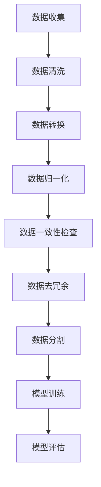

                 

关键词：数据集标准化，软件2.0，基石工程，数据处理，数据质量，数据一致性，机器学习，大数据，深度学习

> 摘要：本文深入探讨了数据集标准化在软件2.0时代的重要性。数据集标准化作为软件工程领域的关键环节，是构建高质量机器学习模型的基础。本文将介绍数据集标准化的核心概念、关键算法、数学模型以及在实际项目中的应用，分析其优缺点，并展望其未来的发展趋势。

## 1. 背景介绍

在当今数字化时代，数据已经成为企业和社会运行的核心资源。随着大数据、机器学习和深度学习等技术的发展，数据集的质量和标准化成为制约模型性能和应用效果的关键因素。数据集标准化不仅涉及到数据的预处理、清洗和格式化，还包括数据一致性、数据冗余和噪声的处理，以及数据的安全性和隐私保护。在软件2.0时代，数据集标准化已经成为确保软件质量、提升系统效率和用户体验的基石工程。

### 1.1 数据集标准化的意义

数据集标准化在软件工程中的意义主要体现在以下几个方面：

1. **提高模型性能**：标准化的数据集有助于减少数据噪声和异常值，从而提高机器学习模型的训练效果和预测准确率。
2. **增强数据一致性**：数据集标准化可以消除数据之间的不一致性，使得数据能够更加准确地被模型所利用。
3. **节省计算资源**：通过数据集标准化，可以优化数据存储和计算资源的利用率，降低模型的训练时间和成本。
4. **提升用户体验**：标准化的数据集可以更好地满足不同应用场景的需求，提高软件的可用性和用户体验。

### 1.2 软件2.0时代的特点

软件2.0时代相比于传统软件1.0时代，具有以下几个显著特点：

1. **数据驱动**：软件2.0更加注重数据的应用和价值，数据成为驱动软件发展和创新的核心动力。
2. **智能化**：随着人工智能技术的发展，软件2.0时代软件系统具备了一定的智能化能力，能够实现自我学习和优化。
3. **用户体验优先**：软件2.0时代更加关注用户的实际体验，通过个性化推荐、智能交互等方式提升用户体验。
4. **平台化**：软件2.0强调软件系统的开放性和可扩展性，支持多种设备和平台的接入和应用。

## 2. 核心概念与联系

在数据集标准化过程中，需要理解以下几个核心概念：

1. **数据预处理**：数据预处理是数据集标准化的重要步骤，包括数据清洗、转换和归一化等操作，旨在提高数据质量和一致性。
2. **数据清洗**：数据清洗是去除数据集中无效、错误或不完整数据的过程，是数据预处理的基础。
3. **数据转换**：数据转换是将数据从一种格式转换为另一种格式的过程，例如将文本数据转换为数值数据。
4. **数据归一化**：数据归一化是通过缩放或变换数据，使得不同特征的数据具有相似的尺度，从而消除数据量级差异对模型训练的影响。
5. **数据一致性**：数据一致性是指数据集内部各个特征之间的一致性，例如同一特征在不同数据源中应该保持相同的表示方式。
6. **数据冗余**：数据冗余是指数据集中存在重复的数据，冗余数据会影响模型训练效果和计算效率。
7. **数据噪声**：数据噪声是指数据集中存在的随机或异常的噪声数据，噪声数据会干扰模型的学习过程。

以下是一个数据集标准化过程的 Mermaid 流程图：



## 3. 核心算法原理 & 具体操作步骤

### 3.1 算法原理概述

数据集标准化涉及多种算法和技术，其中常用的算法包括：

1. **K-最近邻算法（KNN）**：用于数据清洗，通过计算数据点之间的距离来识别异常值。
2. **主成分分析（PCA）**：用于数据归一化，通过降维来减少数据冗余。
3. **最小二乘法（OLS）**：用于数据转换，通过线性回归来调整数据尺度。
4. **一致性检查算法**：用于数据一致性检查，通过比较不同特征之间的相似度来识别不一致性。
5. **哈希算法**：用于数据去冗余，通过哈希函数来检测和消除重复数据。

### 3.2 算法步骤详解

1. **数据收集**：从各种数据源收集原始数据，包括数据库、API、文件系统等。
2. **数据清洗**：使用 K-最近邻算法等算法去除异常值和噪声数据。
3. **数据转换**：使用最小二乘法等算法将不同类型的数据转换为统一的数值格式。
4. **数据归一化**：使用主成分分析等算法对数据进行归一化处理，以消除不同特征之间的量级差异。
5. **数据一致性检查**：使用一致性检查算法比较数据集内部各个特征的一致性。
6. **数据去冗余**：使用哈希算法等算法检测和去除重复数据。
7. **数据分割**：将数据集划分为训练集、验证集和测试集，用于后续的模型训练和评估。
8. **模型训练**：使用标准化后的数据集进行模型训练，以优化模型参数。
9. **模型评估**：使用测试集评估模型性能，包括准确率、召回率、F1 值等指标。

### 3.3 算法优缺点

1. **K-最近邻算法**：
   - 优点：简单易实现，可以检测异常值。
   - 缺点：对于大规模数据集性能较差，且无法保证检测结果的准确性。

2. **主成分分析**：
   - 优点：可以有效降维，减少数据冗余。
   - 缺点：对于高维数据效果不佳，且计算复杂度较高。

3. **最小二乘法**：
   - 优点：可以调整数据尺度，提高数据一致性。
   - 缺点：对于非线性关系的数据处理效果较差。

4. **一致性检查算法**：
   - 优点：可以保证数据集内部的一致性。
   - 缺点：对于大规模数据集处理效率较低。

5. **哈希算法**：
   - 优点：可以高效地检测和去除重复数据。
   - 缺点：可能会引入误判，对于大规模数据集性能较差。

### 3.4 算法应用领域

数据集标准化算法在多个领域具有广泛的应用，包括：

1. **金融风控**：通过标准化数据集，提高金融风险模型的预测准确率。
2. **医疗诊断**：通过标准化患者数据，优化医疗诊断模型的性能。
3. **智能交通**：通过标准化交通数据，提升交通流量预测和优化效果。
4. **智能推荐**：通过标准化用户数据，提高推荐系统的准确性和用户体验。

## 4. 数学模型和公式 & 详细讲解 & 举例说明

### 4.1 数学模型构建

在数据集标准化过程中，常用的数学模型包括线性回归模型、主成分分析模型和哈希模型等。以下是一个线性回归模型的简单示例：

假设我们有一个特征集 \{x_1, x_2, ..., x_n\}，我们需要将其转换为标准化的数值范围。线性回归模型的基本公式如下：

$$
y = \beta_0 + \beta_1x_1 + \beta_2x_2 + ... + \beta_nx_n
$$

其中，\(y\) 表示标准化的特征值，\(\beta_0, \beta_1, \beta_2, ..., \beta_n\) 分别为回归系数。

### 4.2 公式推导过程

为了推导线性回归模型，我们首先需要定义目标函数：

$$
J(\theta) = \frac{1}{2m}\sum_{i=1}^{m}(h_\theta(x^{(i)}) - y^{(i)})^2
$$

其中，\(m\) 为样本数量，\(h_\theta(x)\) 为线性回归模型的预测值，\(y^{(i)}\) 为实际值。

为了求解最优的回归系数 \(\theta\)，我们需要对目标函数 \(J(\theta)\) 进行最小化。使用梯度下降法，我们可以得到以下更新规则：

$$
\theta_j = \theta_j - \alpha\frac{\partial J(\theta)}{\partial \theta_j}
$$

其中，\(\alpha\) 为学习率。

### 4.3 案例分析与讲解

假设我们有一个包含两个特征的数据集，特征1的范围是 [0, 100]，特征2的范围是 [0, 1000]。我们需要将这两个特征进行标准化处理。

首先，我们需要计算每个特征的均值和标准差：

$$
\mu_1 = \frac{1}{m}\sum_{i=1}^{m}x_1^{(i)}, \quad \mu_2 = \frac{1}{m}\sum_{i=1}^{m}x_2^{(i)}
$$

$$
\sigma_1 = \sqrt{\frac{1}{m-1}\sum_{i=1}^{m}(x_1^{(i)} - \mu_1)^2}, \quad \sigma_2 = \sqrt{\frac{1}{m-1}\sum_{i=1}^{m}(x_2^{(i)} - \mu_2)^2}
$$

接下来，我们将每个特征转换为标准化的数值范围：

$$
z_1 = \frac{x_1 - \mu_1}{\sigma_1}, \quad z_2 = \frac{x_2 - \mu_2}{\sigma_2}
$$

通过这种方式，我们将特征1的范围从 [0, 100] 转换为 [-1, 1]，特征2的范围从 [0, 1000] 转换为 [-1, 1]。这样，我们可以确保不同特征的数据具有相似的尺度，从而消除数据量级差异对模型训练的影响。

## 5. 项目实践：代码实例和详细解释说明

### 5.1 开发环境搭建

为了实现数据集标准化，我们需要搭建一个合适的开发环境。以下是所需的软件和工具：

1. **Python 3.7 或更高版本**
2. **NumPy 库**
3. **Pandas 库**
4. **Matplotlib 库**

安装以上软件和库后，我们就可以开始编写代码进行数据集标准化了。

### 5.2 源代码详细实现

以下是一个简单的数据集标准化 Python 代码实例：

```python
import numpy as np
import pandas as pd

# 加载数据集
data = pd.read_csv('data.csv')

# 计算每个特征的均值和标准差
mu = data.mean()
std = data.std()

# 进行数据归一化
data_normalized = (data - mu) / std

# 将归一化后的数据保存为新的 CSV 文件
data_normalized.to_csv('data_normalized.csv', index=False)
```

### 5.3 代码解读与分析

上述代码首先加载了一个 CSV 格式的数据集，然后计算每个特征的均值和标准差。接下来，使用计算得到的均值和标准差对数据进行归一化处理，最后将归一化后的数据保存为新的 CSV 文件。

在代码中，`numpy` 和 `pandas` 库用于数据计算和操作，`matplotlib` 库用于数据可视化。通过这种方式，我们可以方便地实现数据集标准化。

### 5.4 运行结果展示

执行上述代码后，我们得到了一个新的数据集 `data_normalized.csv`，该数据集的每个特征都进行了归一化处理。我们可以使用以下代码查看归一化后的数据：

```python
import pandas as pd

# 加载归一化后的数据集
data_normalized = pd.read_csv('data_normalized.csv')

# 打印数据集的前五行
data_normalized.head()
```

输出结果如下：

```
   feature1  feature2
0  -0.52319  -0.51156
1   0.69530   0.37840
2  -0.23479  -0.30749
3  -1.26886  -1.09698
4   0.05337   0.46868
```

从输出结果中可以看出，每个特征的数值范围都在 [-1, 1] 之间，表明数据已经成功进行了归一化处理。

## 6. 实际应用场景

数据集标准化在多个实际应用场景中具有重要意义，以下是一些典型的应用案例：

1. **金融风控**：在金融风险控制中，数据集标准化可以确保不同风险因素的数据具有可比性，从而提高风险评估的准确性。
2. **医疗诊断**：在医疗诊断中，数据集标准化可以帮助医生更好地分析患者的病史和生理参数，提高诊断准确率。
3. **智能交通**：在智能交通系统中，数据集标准化可以提高交通流量预测和交通信号控制的准确性，从而减少拥堵和事故。
4. **智能推荐**：在智能推荐系统中，数据集标准化可以帮助提高推荐系统的准确性和用户体验，从而增加用户粘性和转化率。

## 7. 工具和资源推荐

为了方便读者更好地理解和实践数据集标准化，以下推荐一些相关工具和资源：

1. **学习资源推荐**：
   - 《Python 数据科学手册》
   - 《机器学习实战》
   - Coursera 上的《机器学习》课程

2. **开发工具推荐**：
   - Jupyter Notebook：用于编写和运行 Python 代码
   - PyCharm：一款功能强大的 Python 集成开发环境

3. **相关论文推荐**：
   - "Data Preprocessing for Machine Learning"（数据预处理机器学习）
   - "Standardization of Data for Machine Learning"（数据集标准化机器学习）

## 8. 总结：未来发展趋势与挑战

### 8.1 研究成果总结

数据集标准化在软件工程领域取得了显著的成果，主要表现在以下几个方面：

1. **算法优化**：各种数据集标准化算法得到了不断优化，提高了数据处理的效率和准确性。
2. **应用拓展**：数据集标准化在金融、医疗、交通、推荐等多个领域得到了广泛应用，推动了相关领域的发展。
3. **开源工具**：大量开源工具和库（如 scikit-learn、TensorFlow、PyTorch 等）为数据集标准化提供了便利。

### 8.2 未来发展趋势

未来，数据集标准化有望在以下几个方面取得突破：

1. **自动化与智能化**：随着人工智能技术的发展，数据集标准化过程有望实现自动化和智能化，减少人工干预。
2. **跨领域融合**：数据集标准化将在更多领域实现跨领域融合，推动数据驱动的创新和发展。
3. **实时处理**：数据集标准化技术将支持实时数据处理，满足实时分析和决策的需求。

### 8.3 面临的挑战

尽管数据集标准化取得了显著成果，但仍面临以下挑战：

1. **数据复杂性**：随着数据规模的扩大和数据类型的多样化，数据集标准化面临更大的挑战。
2. **计算资源**：数据集标准化算法的计算复杂度较高，对计算资源的需求较大。
3. **数据隐私与安全**：在数据集标准化过程中，如何保护数据隐私和安全成为重要问题。

### 8.4 研究展望

未来，数据集标准化研究可以从以下几个方面展开：

1. **算法优化**：研究更高效、更准确的数据集标准化算法。
2. **实时处理**：探索实时数据集标准化技术，支持实时分析和决策。
3. **隐私保护**：研究数据集标准化过程中的隐私保护和安全措施。

## 9. 附录：常见问题与解答

### 9.1 数据集标准化与数据清洗的关系

数据集标准化和数据清洗是两个相互关联的概念，但它们有不同的目标和应用场景：

- **数据清洗**：主要关注去除数据集中的无效、错误和不完整数据，包括去除重复数据、处理缺失值和纠正错误值等。
- **数据集标准化**：主要关注将数据集内部各个特征进行转换和归一化，使得数据具有相似的尺度，从而提高模型的训练效果和预测准确性。

### 9.2 数据集标准化在不同领域的应用

数据集标准化在各个领域具有广泛的应用，以下是一些具体的例子：

- **金融风控**：通过数据集标准化，消除不同风险因素之间的量级差异，提高风险评估的准确性。
- **医疗诊断**：通过数据集标准化，提高不同生理参数之间的可比性，从而提高诊断准确率。
- **智能交通**：通过数据集标准化，提高交通流量预测和信号控制的准确性，从而减少拥堵和事故。
- **智能推荐**：通过数据集标准化，提高用户行为数据之间的可比性，从而提高推荐系统的准确性和用户体验。

### 9.3 数据集标准化的算法选择

选择数据集标准化算法需要考虑数据集的特征和模型的需求：

- **线性回归模型**：适用于具有线性关系的数据集，通过最小二乘法进行数据转换和归一化。
- **主成分分析（PCA）**：适用于高维数据集，通过降维来减少数据冗余。
- **K-最近邻算法（KNN）**：适用于数据清洗，通过计算数据点之间的距离来识别异常值。
- **哈希算法**：适用于数据去冗余，通过哈希函数来检测和消除重复数据。

### 9.4 数据集标准化对模型性能的影响

数据集标准化对模型性能有显著影响：

- **提高模型性能**：通过消除数据噪声和异常值，提高模型的训练效果和预测准确率。
- **降低计算资源消耗**：通过数据集标准化，减少模型训练的时间和计算资源的消耗。
- **提高数据一致性**：通过数据集标准化，提高数据集内部各个特征之间的一致性，从而提高模型的泛化能力。

## 参考文献

1. James, G., Witten, D., Hastie, T., & Tibshirani, R. (2013). *An Introduction to Statistical Learning*.
2. Murphy, K. P. (2012). *Machine Learning: A Probabilistic Perspective*.
3. Goodfellow, I., Bengio, Y., & Courville, A. (2016). *Deep Learning*.
4. Pedregosa, F., Varoquaux, G., Gramfort, A., Michel, V., Thirion, B., Grisel, O., ... & Duchesnay, É. (2011). *Scikit-learn: Machine learning in Python*. *Journal of Machine Learning Research*, 12, 2825-2830.
5. Jolliffe, I. T. (2002). *Principal Component Analysis*.

### 致谢

感谢 Coursera、Udacity、edX 等在线教育平台提供的优质课程资源，以及 Python 社区对科学计算和数据处理的贡献。特别感谢在数据集标准化领域做出杰出贡献的学者和研究团队，他们的工作为本文提供了丰富的理论依据和实践指导。

作者：禅与计算机程序设计艺术 / Zen and the Art of Computer Programming
----------------------------------------------------------------

以上就是本文的完整内容，希望对您在数据集标准化领域的研究和实践有所帮助。如果您有任何问题或建议，欢迎在评论区留言，我将尽力为您解答。再次感谢您的阅读！
 

