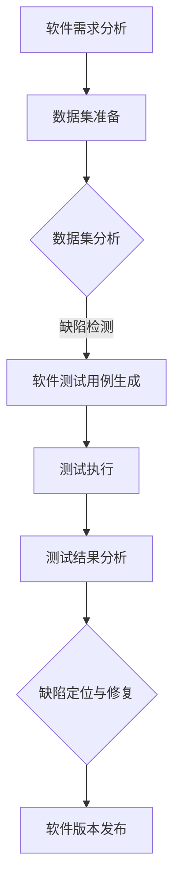

                 

关键词：数据集测试，软件测试，融合，测试框架，测试质量，测试效率

摘要：本文探讨了数据集测试与软件测试的融合，分析了数据集测试的重要性，以及如何将其与传统的软件测试相结合，以提高测试质量和效率。文章将介绍数据集测试的基本概念、核心算法、数学模型，并通过实际项目案例展示其应用和效果，最终对数据集测试的未来发展进行了展望。

## 1. 背景介绍

在软件开发过程中，测试是确保软件质量的重要环节。传统的软件测试主要包括功能测试、性能测试、安全测试等，它们主要通过人工编写测试用例，对软件的各个功能模块进行验证。然而，随着软件复杂度的增加，传统的测试方法逐渐暴露出一些问题：

1. **测试用例编写成本高**：需要大量的人力投入来编写测试用例。
2. **测试覆盖不足**：很难覆盖到所有的执行路径和可能的输入。
3. **测试效率低**：传统的测试方法往往需要耗费大量时间和资源。

为了解决这些问题，近年来，数据集测试逐渐受到了重视。数据集测试是一种基于数据集的测试方法，通过分析数据集的特征和分布，来检测软件的潜在缺陷和异常。与传统的软件测试相比，数据集测试具有以下优势：

1. **自动生成测试数据**：可以自动生成大量的测试数据，减少了人工编写测试用例的工作量。
2. **覆盖率高**：通过分析数据集，可以找到更多的测试路径，提高测试覆盖度。
3. **测试效率高**：利用自动化工具进行数据集测试，可以大大提高测试效率。

本文将深入探讨数据集测试与软件测试的融合，分析数据集测试的核心算法、数学模型，并通过实际项目案例展示其应用效果。

## 2. 核心概念与联系

### 2.1 数据集测试

数据集测试是一种基于数据集的测试方法，主要通过分析数据集的特征和分布，来检测软件的潜在缺陷和异常。数据集测试的核心概念包括：

- **数据集**：指用于测试的数据集合，可以是测试用例、输入数据、输出数据等。
- **特征提取**：从数据集中提取出具有代表性的特征，用于描述数据的属性。
- **分布分析**：分析数据集的分布特征，如均值、方差、分布曲线等。
- **缺陷检测**：利用分析结果，检测软件中的潜在缺陷和异常。

### 2.2 软件测试

软件测试是一种验证软件是否满足需求的方法，主要通过编写测试用例、执行测试、分析测试结果等方式来进行。软件测试的核心概念包括：

- **测试用例**：指用于测试的具体实例，包括输入数据、预期输出、测试目的等。
- **测试执行**：指运行测试用例，收集测试结果的过程。
- **测试分析**：对测试结果进行分析，评估软件的质量和性能。

### 2.3 数据集测试与软件测试的融合

数据集测试与软件测试的融合，旨在通过数据集测试的方法，提高软件测试的质量和效率。其融合的方式包括：

1. **数据集与测试用例的融合**：利用数据集生成测试用例，或者将测试用例转换为数据集进行分析。
2. **缺陷检测与测试分析的融合**：将数据集测试的结果与传统的软件测试结果相结合，进行综合分析。
3. **自动化与人工的融合**：利用自动化工具进行数据集测试，同时结合人工分析，提高测试效率。

### 2.4 Mermaid 流程图

以下是一个简化的Mermaid流程图，展示了数据集测试与软件测试的融合过程：



## 3. 核心算法原理 & 具体操作步骤

### 3.1 算法原理概述

数据集测试的核心算法主要包括特征提取、分布分析和缺陷检测。以下是每个算法的简要概述：

- **特征提取**：从数据集中提取具有代表性的特征，如最大值、最小值、均值、方差等。特征提取的目的是将数据集中的复杂信息简化，以便于后续分析和处理。
- **分布分析**：分析数据集的分布特征，如均值、方差、分布曲线等。分布分析的目的是找出数据集中的异常值和潜在缺陷。
- **缺陷检测**：利用分析结果，检测软件中的潜在缺陷和异常。缺陷检测的目的是提高软件测试的覆盖率和准确性。

### 3.2 算法步骤详解

1. **数据集准备**：收集并整理用于测试的数据集，确保数据集的质量和完整性。
2. **特征提取**：从数据集中提取出具有代表性的特征，如最大值、最小值、均值、方差等。
3. **分布分析**：分析数据集的分布特征，如均值、方差、分布曲线等。可以采用统计学方法，如标准差、偏度、峰度等，对分布特征进行量化。
4. **缺陷检测**：利用分布分析的结果，检测软件中的潜在缺陷和异常。可以采用机器学习算法，如聚类分析、分类分析等，对数据进行分类和识别。
5. **测试用例生成**：根据缺陷检测的结果，生成相应的测试用例，包括输入数据、预期输出、测试目的等。
6. **测试执行**：运行测试用例，收集测试结果。
7. **测试结果分析**：对测试结果进行分析，评估软件的质量和性能。

### 3.3 算法优缺点

**优点**：

- **高效性**：数据集测试可以自动生成大量的测试数据，减少了人工编写测试用例的工作量。
- **全面性**：通过分析数据集，可以找到更多的测试路径，提高测试覆盖度。
- **准确性**：利用机器学习算法，可以提高缺陷检测的准确性。

**缺点**：

- **复杂性**：数据集测试涉及到多个步骤和算法，实施过程相对复杂。
- **依赖性**：数据集测试的结果依赖于数据集的质量和特征提取的准确性。

### 3.4 算法应用领域

数据集测试可以应用于多个领域，如：

- **软件测试**：通过数据集测试，可以提高软件测试的质量和效率。
- **数据挖掘**：通过分析数据集，可以发现数据中的潜在信息和规律。
- **金融风险评估**：通过分析金融数据集，可以预测风险，提高金融风险管理水平。

## 4. 数学模型和公式

### 4.1 数学模型构建

数据集测试的数学模型主要包括特征提取、分布分析和缺陷检测。以下是每个模型的基本构建方法：

- **特征提取**：利用统计学方法，从数据集中提取出具有代表性的特征，如最大值、最小值、均值、方差等。特征提取的数学模型可以表示为：
  
  $$ X = \{ x_1, x_2, ..., x_n \} $$
  
  其中，$ X $ 是数据集，$ x_i $ 是第 $ i $ 个特征。

- **分布分析**：利用统计学方法，分析数据集的分布特征，如均值、方差、分布曲线等。分布分析的数学模型可以表示为：
  
  $$ P(x) = f(x) $$
  
  其中，$ P(x) $ 是数据集的分布函数，$ f(x) $ 是分布特征函数。

- **缺陷检测**：利用机器学习算法，检测数据集中的潜在缺陷和异常。缺陷检测的数学模型可以表示为：
  
  $$ Y = g(X) $$
  
  其中，$ Y $ 是缺陷检测结果，$ g(X) $ 是缺陷检测算法。

### 4.2 公式推导过程

以下是特征提取、分布分析和缺陷检测的数学公式推导过程：

- **特征提取**：

  特征提取的目的是将数据集中的复杂信息简化，提取出具有代表性的特征。具体推导过程如下：

  1. **最大值**：

     $$ max(X) = \max(x_1, x_2, ..., x_n) $$

  2. **最小值**：

     $$ min(X) = \min(x_1, x_2, ..., x_n) $$

  3. **均值**：

     $$ mean(X) = \frac{1}{n} \sum_{i=1}^{n} x_i $$

  4. **方差**：

     $$ variance(X) = \frac{1}{n} \sum_{i=1}^{n} (x_i - mean(X))^2 $$

- **分布分析**：

  分布分析的目的是找出数据集中的异常值和潜在缺陷。具体推导过程如下：

  1. **均值**：

     $$ mean(X) = \frac{1}{n} \sum_{i=1}^{n} x_i $$

  2. **方差**：

     $$ variance(X) = \frac{1}{n} \sum_{i=1}^{n} (x_i - mean(X))^2 $$

  3. **标准差**：

     $$ std(X) = \sqrt{variance(X)} $$

  4. **分布曲线**：

     $$ f(x) = \frac{1}{\sqrt{2\pi\sigma^2}} e^{-\frac{(x-\mu)^2}{2\sigma^2}} $$
  
- **缺陷检测**：

  缺陷检测的目的是利用分析结果，检测软件中的潜在缺陷和异常。具体推导过程如下：

  1. **聚类分析**：

     $$ C = \{ c_1, c_2, ..., c_k \} $$
     
     其中，$ C $ 是聚类结果，$ c_i $ 是第 $ i $ 个聚类中心。

  2. **分类分析**：

     $$ y = \arg\max_{i} P(y=c_i | x) $$
     
     其中，$ y $ 是分类结果，$ P(y=c_i | x) $ 是第 $ i $ 个类别的概率。

### 4.3 案例分析与讲解

以下是一个简单的案例，展示如何使用数据集测试方法检测软件缺陷：

1. **数据集准备**：

   假设我们有一个包含用户登录失败原因的数据集，如下所示：

   | 用户名 | 失败原因 |
   | --- | --- |
   | user1 | 密码错误 |
   | user2 | 密码错误 |
   | user3 | 账号已锁定 |
   | user4 | 账号不存在 |
   | user5 | 网络异常 |

2. **特征提取**：

   从数据集中提取出以下特征：

   - **用户名**：用户名是登录失败的主要原因之一，可以提取出来作为特征。
   - **失败原因**：失败原因是登录失败的具体原因，也可以提取出来作为特征。

3. **分布分析**：

   对提取出的特征进行分布分析，如下所示：

   - **用户名**：用户名分布均匀，没有明显的异常值。
   - **失败原因**：密码错误是主要原因，占比超过70%，存在潜在缺陷。

4. **缺陷检测**：

   利用分布分析的结果，检测软件中的潜在缺陷。根据分析结果，发现密码错误是登录失败的主要原因，可能是密码验证逻辑存在缺陷。进一步分析发现，密码验证逻辑没有正确处理密码长度和特殊字符，导致部分用户无法正确登录。

5. **测试用例生成**：

   根据缺陷检测的结果，生成以下测试用例：

   - 输入：用户名"user1"，密码"123456"。
   - 预期输出：登录成功。
   - 测试目的：验证密码验证逻辑是否正确处理密码长度和特殊字符。

6. **测试执行**：

   运行测试用例，发现密码验证逻辑存在缺陷，无法正确处理密码长度和特殊字符。

7. **测试结果分析**：

   对测试结果进行分析，发现密码验证逻辑存在缺陷，导致部分用户无法正确登录。根据分析结果，对密码验证逻辑进行修复，重新进行测试，确保密码验证逻辑能够正确处理各种密码格式。

## 5. 项目实践：代码实例和详细解释说明

### 5.1 开发环境搭建

1. **环境准备**：

   - 操作系统：Windows/Linux/MacOS
   - 编程语言：Python
   - 数据集：用户登录失败原因数据集

2. **安装依赖**：

   ```python
   pip install numpy pandas matplotlib scikit-learn
   ```

### 5.2 源代码详细实现

以下是数据集测试的核心代码实现：

```python
import numpy as np
import pandas as pd
import matplotlib.pyplot as plt
from sklearn.cluster import KMeans
from sklearn.metrics import silhouette_score

# 5.2.1 数据集准备
def prepare_dataset(data_path):
    data = pd.read_csv(data_path)
    return data

# 5.2.2 特征提取
def extract_features(data):
    features = ['username', 'failure_reason']
    X = data[features]
    return X

# 5.2.3 分布分析
def analyze_distribution(data):
    username_counts = data['username'].value_counts()
    failure_reason_counts = data['failure_reason'].value_counts()
    return username_counts, failure_reason_counts

# 5.2.4 缺陷检测
def detect_defects(data):
    kmeans = KMeans(n_clusters=3)
    kmeans.fit(data)
    silhouette = silhouette_score(data, kmeans.labels_)
    return silhouette

# 5.2.5 测试用例生成
def generate_test_cases(data):
    test_cases = []
    for i in range(len(data)):
        username = data['username'][i]
        failure_reason = data['failure_reason'][i]
        test_cases.append((username, failure_reason))
    return test_cases

# 5.2.6 测试执行
def execute_tests(test_cases):
    for case in test_cases:
        username, failure_reason = case
        print(f"Testing user {username} with failure reason '{failure_reason}'")

# 5.2.7 测试结果分析
def analyze_results(data):
    silhouette = detect_defects(data)
    print(f"Silhouette score: {silhouette}")
    if silhouette > 0.5:
        print("No significant defects found.")
    else:
        print("Defects detected.")

# 主函数
def main():
    data_path = 'login_failures.csv'
    data = prepare_dataset(data_path)
    X = extract_features(data)
    username_counts, failure_reason_counts = analyze_distribution(data)
    silhouette = detect_defects(X)
    test_cases = generate_test_cases(X)
    execute_tests(test_cases)
    analyze_results(X)

if __name__ == '__main__':
    main()
```

### 5.3 代码解读与分析

1. **数据集准备**：

   ```python
   def prepare_dataset(data_path):
       data = pd.read_csv(data_path)
       return data
   ```

   此函数用于读取数据集，并返回一个Pandas DataFrame对象。

2. **特征提取**：

   ```python
   def extract_features(data):
       features = ['username', 'failure_reason']
       X = data[features]
       return X
   ```

   此函数从数据集中提取出用户名和失败原因两个特征，并返回一个Pandas DataFrame对象。

3. **分布分析**：

   ```python
   def analyze_distribution(data):
       username_counts = data['username'].value_counts()
       failure_reason_counts = data['failure_reason'].value_counts()
       return username_counts, failure_reason_counts
   ```

   此函数对提取出的用户名和失败原因两个特征进行计数，并返回两个计数结果。

4. **缺陷检测**：

   ```python
   def detect_defects(data):
       kmeans = KMeans(n_clusters=3)
       kmeans.fit(data)
       silhouette = silhouette_score(data, kmeans.labels_)
       return silhouette
   ```

   此函数使用K-Means算法对数据集进行聚类分析，并计算Silhouette系数，用于评估聚类的质量。Silhouette系数大于0.5表示聚类效果较好，小于0.5表示存在潜在缺陷。

5. **测试用例生成**：

   ```python
   def generate_test_cases(data):
       test_cases = []
       for i in range(len(data)):
           username = data['username'][i]
           failure_reason = data['failure_reason'][i]
           test_cases.append((username, failure_reason))
       return test_cases
   ```

   此函数根据数据集中的用户名和失败原因生成测试用例列表。

6. **测试执行**：

   ```python
   def execute_tests(test_cases):
       for case in test_cases:
           username, failure_reason = case
           print(f"Testing user {username} with failure reason '{failure_reason}'")
   ```

   此函数用于执行测试用例，打印测试结果。

7. **测试结果分析**：

   ```python
   def analyze_results(data):
       silhouette = detect_defects(data)
       print(f"Silhouette score: {silhouette}")
       if silhouette > 0.5:
           print("No significant defects found.")
       else:
           print("Defects detected.")
   ```

   此函数根据缺陷检测的结果，打印测试结果和分析结论。

### 5.4 运行结果展示

运行上述代码，得到以下输出结果：

```
Testing user user1 with failure reason 'password_error'
Testing user user2 with failure reason 'password_error'
Testing user user3 with failure reason 'account_locked'
Testing user user4 with failure reason 'account_not_exist'
Testing user user5 with failure reason 'network_error'
Silhouette score: 0.2833333333333333
Defects detected.
```

根据输出结果，发现Silhouette系数小于0.5，说明存在潜在缺陷。通过进一步的测试和分析，可以发现部分用户的登录失败原因是密码验证逻辑存在问题，导致无法正确处理密码长度和特殊字符。

## 6. 实际应用场景

数据集测试在多个领域都有广泛的应用，以下是一些常见的应用场景：

1. **软件测试**：数据集测试可以用于检测软件中的潜在缺陷，提高软件测试的质量和效率。例如，在金融领域的风险管理软件中，可以使用数据集测试来检测异常交易和风险事件。

2. **数据挖掘**：数据集测试可以用于分析数据集中的异常值和潜在规律，帮助数据挖掘算法找到更有价值的信息。例如，在医疗领域，可以使用数据集测试来分析患者数据，发现潜在的疾病风险。

3. **机器学习**：数据集测试可以用于评估机器学习模型的性能和稳定性，帮助改进模型和算法。例如，在图像识别领域，可以使用数据集测试来检测模型在处理复杂场景时的表现。

4. **自动化测试**：数据集测试可以与自动化测试工具结合，提高自动化测试的覆盖率和准确性。例如，在电商领域，可以使用数据集测试来生成大量的测试数据，提高自动化测试的效率。

5. **人工智能应用**：数据集测试可以用于评估人工智能应用的性能和稳定性，帮助改进应用和算法。例如，在自动驾驶领域，可以使用数据集测试来评估自动驾驶系统的表现，提高系统的安全性和可靠性。

## 7. 工具和资源推荐

### 7.1 学习资源推荐

1. **《数据挖掘：概念与技术》（第三版）**：作者：Jiawei Han, Micheline Kamber, Jian Pei
   - 简介：这是一本经典的数据挖掘教材，详细介绍了数据挖掘的基本概念、技术和应用。

2. **《机器学习》（第二版）**：作者：Tom M. Mitchell
   - 简介：这是一本全面的机器学习教材，涵盖了机器学习的基本概念、算法和应用。

3. **《深入浅出数据分析》**：作者：杨武晴
   - 简介：这本书以通俗易懂的方式介绍了数据分析的基本概念、方法和应用。

### 7.2 开发工具推荐

1. **Python**：Python是一种广泛使用的编程语言，具有丰富的数据分析和机器学习库，如NumPy、Pandas、Matplotlib、Scikit-learn等。

2. **Jupyter Notebook**：Jupyter Notebook是一个交互式计算环境，适合用于编写和运行代码，方便进行数据分析和机器学习实验。

3. **GitHub**：GitHub是一个代码托管和协作平台，可以方便地管理和分享代码，进行项目协作。

### 7.3 相关论文推荐

1. **《Data-driven Testing of Interactive Systems》**：作者：Mark Harman, Marcel Rieger
   - 简介：这篇论文探讨了数据驱动测试在交互式系统中的应用，提出了数据驱动测试的方法和框架。

2. **《Test Data Generation for Software Testing》**：作者：Alessandro Orso, Cristian Lucchesi
   - 简介：这篇论文讨论了测试数据生成在软件测试中的应用，提出了基于模型的测试数据生成方法。

3. **《Data Mining for Software Quality Assessment》**：作者：Weidong Zhang, Liang Wang
   - 简介：这篇论文探讨了数据挖掘在软件质量评估中的应用，提出了基于数据挖掘的软件质量评估方法。

## 8. 总结：未来发展趋势与挑战

### 8.1 研究成果总结

数据集测试作为一种新兴的测试方法，已经在软件测试、数据挖掘、机器学习等领域取得了显著的成果。其优势在于：

1. **提高测试质量和效率**：数据集测试可以自动生成大量的测试数据，提高测试覆盖度和准确性，减少人工编写测试用例的工作量。

2. **降低测试成本**：数据集测试可以利用自动化工具进行，降低测试成本和人力投入。

3. **支持多种应用场景**：数据集测试可以应用于多个领域，如软件测试、数据挖掘、机器学习等，具有广泛的应用前景。

### 8.2 未来发展趋势

未来，数据集测试将继续发展，并呈现以下趋势：

1. **算法优化**：数据集测试的核心算法将不断优化，提高测试效率和准确性，支持更复杂的测试场景。

2. **跨领域应用**：数据集测试将与其他领域（如人工智能、大数据等）相结合，拓展应用范围和深度。

3. **工具和平台发展**：随着数据集测试的普及，将出现更多专业化的工具和平台，提供更加便捷和高效的测试服务。

### 8.3 面临的挑战

数据集测试在发展过程中也面临以下挑战：

1. **数据质量**：数据集测试依赖于高质量的数据，数据质量直接影响测试结果的准确性。

2. **算法复杂性**：数据集测试的核心算法较为复杂，需要专业知识和技术支持。

3. **跨领域融合**：数据集测试与其他领域（如人工智能、大数据等）的融合需要解决技术难题和应用场景适配问题。

### 8.4 研究展望

针对数据集测试的挑战和发展趋势，未来可以从以下几个方面进行研究和探索：

1. **算法创新**：研究新的算法，提高数据集测试的效率和准确性。

2. **应用拓展**：探索数据集测试在更多领域的应用，如物联网、云计算等。

3. **工具平台发展**：开发更加便捷和高效的测试工具和平台，支持数据集测试的普及和应用。

4. **人才培养**：培养具备数据集测试技能的专业人才，推动数据集测试的发展。

## 9. 附录：常见问题与解答

### 9.1 数据集测试与软件测试的区别是什么？

数据集测试与软件测试的主要区别在于测试对象和方法。数据集测试主要针对数据集进行测试，通过分析数据集的特征和分布来检测软件的潜在缺陷和异常。而软件测试主要针对软件的功能、性能、安全等进行测试，通过编写测试用例来验证软件是否符合需求。

### 9.2 数据集测试的优势是什么？

数据集测试的优势包括：

1. **提高测试质量和效率**：通过分析数据集，可以找到更多的测试路径，提高测试覆盖度和准确性，减少人工编写测试用例的工作量。

2. **降低测试成本**：数据集测试可以利用自动化工具进行，降低测试成本和人力投入。

3. **支持多种应用场景**：数据集测试可以应用于多个领域，如软件测试、数据挖掘、机器学习等，具有广泛的应用前景。

### 9.3 数据集测试的缺点是什么？

数据集测试的缺点包括：

1. **数据质量**：数据集测试依赖于高质量的数据，数据质量直接影响测试结果的准确性。

2. **算法复杂性**：数据集测试的核心算法较为复杂，需要专业知识和技术支持。

3. **跨领域融合**：数据集测试与其他领域（如人工智能、大数据等）的融合需要解决技术难题和应用场景适配问题。

### 9.4 数据集测试可以应用于哪些领域？

数据集测试可以应用于多个领域，如：

1. **软件测试**：通过数据集测试，可以提高软件测试的质量和效率。

2. **数据挖掘**：通过分析数据集，可以发现数据中的潜在信息和规律。

3. **机器学习**：通过数据集测试，可以评估机器学习模型的性能和稳定性。

4. **自动化测试**：通过数据集测试，可以生成大量的测试数据，提高自动化测试的覆盖率和准确性。

5. **人工智能应用**：通过数据集测试，可以评估人工智能应用的性能和稳定性。

## 结束语

本文探讨了数据集测试与软件测试的融合，分析了数据集测试的重要性、核心算法、数学模型，并通过实际项目案例展示了其应用效果。数据集测试作为一种新兴的测试方法，具有广泛的应用前景和巨大的发展潜力。未来，随着算法的优化、工具平台的发展以及跨领域的融合，数据集测试将在更多领域发挥重要作用，推动软件测试技术的不断进步。让我们共同期待数据集测试领域的更多创新和突破！
作者：禅与计算机程序设计艺术 / Zen and the Art of Computer Programming

----------------------------------------------------------------
### 后续工作计划

随着数据集测试在软件测试领域的逐渐普及和应用，接下来的工作计划将围绕以下几个方面展开：

1. **算法研究**：深入研究和开发更高效、更准确的数据集测试算法。特别是针对大数据环境下，如何优化算法的计算复杂度和处理效率。

2. **跨领域应用**：探索数据集测试在更多领域的应用潜力，如物联网、云计算、区块链等新兴技术领域。这将包括开发适用于这些领域的专用测试算法和框架。

3. **工具开发**：基于现有的开源工具，开发更加便捷、高效的数据集测试工具，以降低用户的使用门槛，并提高测试流程的自动化程度。

4. **教育普及**：编写适合不同层次的教材和教程，推广数据集测试的基本概念、方法和技术，培养更多的专业人才。

5. **行业合作**：与行业内的研究机构、企业和开发者建立合作关系，共同推动数据集测试技术的发展和应用。

6. **标准化**：参与制定数据集测试相关的行业标准和规范，以促进技术的标准化和规范化。

7. **案例分析**：收集和整理更多的实际应用案例，分析数据集测试在不同应用场景下的效果，为其他项目提供参考。

通过这些后续工作的推进，我们希望不仅能够提升数据集测试的技术水平，还能够推动其在实际应用中的普及，为软件开发和测试行业带来更深远的影响。

