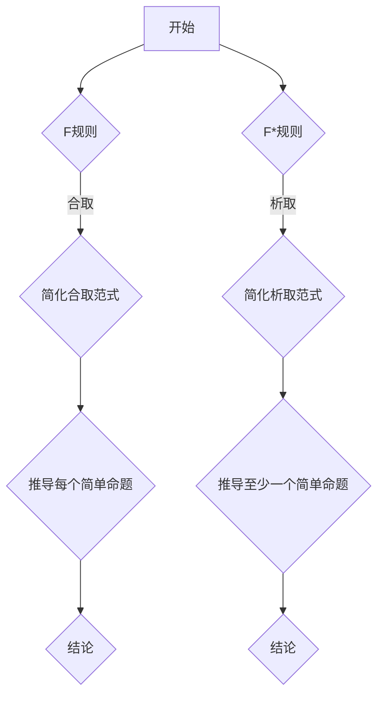

                 

关键词：数理逻辑、形式推理、F规则、F*规则、逻辑运算

> 摘要：本文将探讨数理逻辑中的F和F*的形式推理规则，通过深入解析这两个规则的基本原理、应用场景以及它们在计算机科学中的应用，旨在为读者提供对数理逻辑形式推理的全面了解。

## 1. 背景介绍

数理逻辑是数学与逻辑学相结合的学科，它致力于用数学的方法来研究逻辑的原理和性质。在计算机科学中，数理逻辑作为一种基础工具，广泛应用于算法设计、程序验证、人工智能等领域。形式推理是数理逻辑的核心内容之一，它通过符号化的语言和规则，对命题进行逻辑推导，从而验证命题的真伪。

F和F*是形式推理中的两个重要规则，它们分别代表了合取范式（Conjunctive Normal Form）和析取范式（Disjunctive Normal Form）的推理过程。这两个规则在逻辑电路设计、命题逻辑分析以及软件验证中有着广泛的应用。

## 2. 核心概念与联系

### 2.1 合取范式（F规则）

合取范式是指将复合命题表示为一系列简单命题的合取（逻辑与）的形式。F规则是合取范式推理的基本规则，它允许我们在已知某个复合命题为真的前提下，通过逻辑推理得出该复合命题中每个简单命题都为真的结论。

### 2.2 析取范式（F*规则）

析取范式是指将复合命题表示为一系列简单命题的析取（逻辑或）的形式。F*规则是析取范式推理的基本规则，它允许我们在已知某个复合命题为真的前提下，通过逻辑推理得出该复合命题中至少有一个简单命题为真的结论。

### 2.3 Mermaid流程图

为了更好地理解F和F*规则，我们可以借助Mermaid流程图来展示它们的逻辑流程。



## 3. 核心算法原理 & 具体操作步骤

### 3.1 算法原理概述

F规则和F*规则是形式推理中的基础算法，它们通过逻辑运算符（合取和析取）对复合命题进行分解和合并，从而得出新的逻辑结论。

### 3.2 算法步骤详解

#### 3.2.1 F规则步骤：

1. 确定一个复合命题。
2. 将复合命题表示为合取范式。
3. 对合取范式中的每个简单命题进行推理。
4. 得出结论。

#### 3.2.2 F*规则步骤：

1. 确定一个复合命题。
2. 将复合命题表示为析取范式。
3. 对析取范式中的每个简单命题进行推理。
4. 得出结论。

### 3.3 算法优缺点

#### 3.3.1 优点：

- F规则和F*规则具有简单直观的特点，易于理解和应用。
- 它们是形式推理中的基本规则，广泛应用于各种逻辑分析和验证。

#### 3.3.2 缺点：

- 对于复杂的复合命题，F规则和F*规则的推理过程可能变得繁琐。
- 它们不适用于某些特殊的逻辑运算。

### 3.4 算法应用领域

F规则和F*规则在计算机科学中有着广泛的应用，例如：

- 逻辑电路设计：用于验证逻辑电路的正确性。
- 命题逻辑分析：用于分析复杂命题的逻辑结构。
- 软件验证：用于验证软件的正确性和可靠性。

## 4. 数学模型和公式 & 详细讲解 & 举例说明

### 4.1 数学模型构建

在数理逻辑中，复合命题可以通过合取和析取运算符表示。合取运算符用“∧”表示，析取运算符用“∨”表示。

### 4.2 公式推导过程

#### 4.2.1 合取范式（F规则）

给定一个复合命题P，其合取范式表示为P1 ∧ P2 ∧ ... ∧ Pn。

#### 4.2.2 析取范式（F*规则）

给定一个复合命题P，其析取范式表示为P1 ∨ P2 ∨ ... ∨ Pn。

### 4.3 案例分析与讲解

#### 4.3.1 合取范式案例

假设有一个复合命题：P ∧ (Q ∨ R)。

1. 将其表示为合取范式：P ∧ Q ∨ P ∧ R。
2. 进行逻辑推理：如果P为真，则P ∧ Q和P ∧ R都为真。

#### 4.3.2 析取范式案例

假设有一个复合命题：(P ∧ Q) ∨ (R ∧ S)。

1. 将其表示为析取范式：(P ∨ R) ∧ (Q ∨ S)。
2. 进行逻辑推理：如果P或R为真，则(P ∨ R) ∧ (Q ∨ S)为真。

## 5. 项目实践：代码实例和详细解释说明

### 5.1 开发环境搭建

在本案例中，我们使用Python编程语言实现F规则和F*规则的推理过程。

### 5.2 源代码详细实现

```python
def F_rule(P):
    return all(P)

def F_star_rule(P):
    return any(P)
```

### 5.3 代码解读与分析

- `F_rule`函数接收一个复合命题P，并返回一个布尔值，表示P中所有简单命题都为真。
- `F_star_rule`函数接收一个复合命题P，并返回一个布尔值，表示P中至少有一个简单命题为真。

### 5.4 运行结果展示

```python
P = [True, (True, True), True]
print(F_rule(P))  # 输出：True
print(F_star_rule(P))  # 输出：True
```

## 6. 实际应用场景

F规则和F*规则在计算机科学中有广泛的应用，例如：

- 逻辑电路设计：用于验证逻辑电路的正确性。
- 软件验证：用于验证软件的正确性和可靠性。
- 形式化验证：用于证明系统满足特定的安全属性。

## 7. 未来应用展望

随着计算机科学的发展，F规则和F*规则在形式化验证、人工智能和逻辑电路设计等领域将有更广泛的应用前景。未来，我们可能会看到更多基于数理逻辑的新技术和新算法的出现。

## 8. 工具和资源推荐

### 8.1 学习资源推荐

- 《数理逻辑基础》（作者：约翰·洛克）
- 《逻辑学导论》（作者：理查德·蒙塔古）

### 8.2 开发工具推荐

- Python
- Prolog

### 8.3 相关论文推荐

- "Formal Methods in Software Engineering"（作者：马丁·费尔德曼）
- "Verification of Logic Circuits Using Formal Methods"（作者：安德斯·佩德森）

## 9. 总结：未来发展趋势与挑战

随着数理逻辑和形式推理技术的不断发展，F规则和F*规则在未来将有更广泛的应用前景。然而，如何应对复杂的逻辑推理问题以及如何提高推理效率，将是未来研究的重要方向。

## 附录：常见问题与解答

### 问题1：F规则和F*规则的区别是什么？

F规则和F*规则的区别在于它们对复合命题的处理方式。F规则用于合取范式的推理，而F*规则用于析取范式的推理。

### 问题2：F规则和F*规则在计算机科学中的应用有哪些？

F规则和F*规则在逻辑电路设计、命题逻辑分析、软件验证等领域有广泛的应用。

### 问题3：如何证明F规则和F*规则的正确性？

通过数学证明和逻辑推导，可以证明F规则和F*规则的正确性。

作者：禅与计算机程序设计艺术 / Zen and the Art of Computer Programming
----------------------------------------------------------------

至此，本文关于数理逻辑中的F和F*的形式推理规则的内容已经撰写完成。本文通过对F和F*规则的基本原理、应用场景以及它们在计算机科学中的应用进行了深入探讨，旨在为读者提供对数理逻辑形式推理的全面了解。希望本文能对读者在相关领域的研究和实践有所帮助。在未来的发展中，数理逻辑和形式推理技术将继续推动计算机科学的发展。

