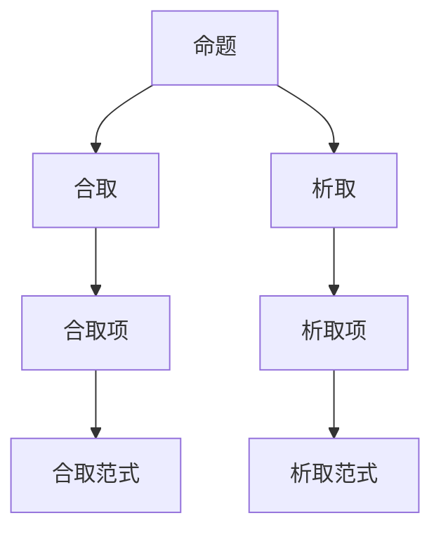

                 

关键词：数理逻辑，合取范式，析取范式，逻辑推理，形式逻辑，数学模型，计算机科学，算法原理。

摘要：本文深入探讨了数理逻辑中的合取范式和析取范式的概念、原理及其在计算机科学中的应用。通过对合取范式和析取范式的详细解读，我们揭示了这些逻辑范式在解决复杂数学问题和计算机程序设计中的关键作用。本文旨在为读者提供清晰、简洁且具有实际应用价值的技术理解。

## 1. 背景介绍

数理逻辑是数学和计算机科学中不可或缺的基础学科。它为我们提供了一种精确描述和推理数学命题和逻辑表达式的方法。合取范式和析取范式是数理逻辑中的两个核心概念，它们在逻辑推理、定理证明、计算机算法设计等领域具有重要应用。

### 1.1 数理逻辑的基本概念

数理逻辑，也称为形式逻辑，是研究命题、推理和证明的数学分支。在数理逻辑中，命题是通过逻辑运算符（如合取 ∧、析取 ∨、非 ¬等）组合而成的表达形式。逻辑推理是指根据已知命题通过逻辑运算符得到新命题的过程。定理证明则是通过一系列逻辑推理步骤，从已知命题导出新命题的证明过程。

### 1.2 合取范式和析取范式的引入

合取范式（Conjunctive Normal Form，CNF）和析取范式（Disjunctive Normal Form，DNF）是数理逻辑中两种重要的范式。它们分别代表了逻辑表达式的一种标准形式，使得逻辑表达式可以方便地进行推理和验证。

### 1.3 合取范式和析取范式的重要性

合取范式和析取范式在数理逻辑和计算机科学中具有重要应用。例如，它们可以用于逻辑电路的设计、自动推理系统的实现、SAT求解问题等。掌握合取范式和析取范式的概念和原理，对于深入理解计算机科学和数学逻辑具有重要意义。

## 2. 核心概念与联系

在深入探讨合取范式和析取范式之前，我们需要先了解一些基础概念和它们之间的关系。

### 2.1 基本概念

- **命题**：可以判断为真或假的陈述句。
- **合取**（∧）：表示逻辑“与”，只有当两个命题都为真时，合取结果才为真。
- **析取**（∨）：表示逻辑“或”，只要两个命题中有一个为真，析取结果就为真。
- **非**（¬）：表示逻辑“非”，对命题取反，真命题的否定为假，假命题的否定为真。

### 2.2 范式的定义

- **合取范式**：一个逻辑表达式，如果可以表示为若干个合取项的析取形式，则称为合取范式。
- **析取范式**：一个逻辑表达式，如果可以表示为若干个析取项的合取形式，则称为析取范式。

### 2.3 Mermaid 流程图



## 3. 核心算法原理 & 具体操作步骤

### 3.1 算法原理概述

合取范式和析取范式的转换算法是数理逻辑中的重要算法。该算法的基本思想是将一个给定的逻辑表达式转换为合取范式或析取范式，以便于进行逻辑推理和验证。

### 3.2 算法步骤详解

1. **转换为合取范式**：

    - 将逻辑表达式中的所有析取项转换为合取项；
    - 将所有合取项进行析取；
    - 将所有非命题进行转化。

2. **转换为析取范式**：

    - 将逻辑表达式中的所有合取项转换为析取项；
    - 将所有析取项进行合取；
    - 将所有非命题进行转化。

### 3.3 算法优缺点

- **优点**：

    - 合取范式和析取范式使得逻辑表达式具有统一的标准形式，便于进行逻辑推理和验证。

    - 算法简单，易于实现。

- **缺点**：

    - 转换过程中可能引入冗余项，导致表达式长度增加。

    - 对于某些复杂表达式，转换过程可能非常耗时。

### 3.4 算法应用领域

- **逻辑电路设计**：合取范式和析取范式可以用于逻辑电路的设计和验证。

- **自动推理系统**：合取范式和析取范式可以用于自动推理系统，用于求解复杂的数学问题和验证命题。

- **SAT求解问题**：合取范式和析取范式可以用于解决SAT（满足性）问题，即判断一个逻辑表达式是否存在解。

## 4. 数学模型和公式 & 详细讲解 & 举例说明

### 4.1 数学模型构建

合取范式和析取范式的数学模型可以表示为：

- **合取范式**：\( P_1 ∧ P_2 ∧ ... ∧ P_n \)
- **析取范式**：\( Q_1 ∨ Q_2 ∨ ... ∨ Q_m \)

### 4.2 公式推导过程

假设我们有一个逻辑表达式 \( F \)，我们需要将其转换为合取范式或析取范式。

- **合取范式推导**：

    - 对于每一个析取项 \( Q_i \)，将其转换为合取项 \( ¬P_j ∧ ¬P_k \)，其中 \( P_j \) 和 \( P_k \) 是 \( Q_i \) 中的命题。
    - 将所有合取项进行析取。

- **析取范式推导**：

    - 对于每一个合取项 \( Q_i \)，将其转换为析取项 \( ¬P_j ∨ ¬P_k \)，其中 \( P_j \) 和 \( P_k \) 是 \( Q_i \) 中的命题。
    - 将所有析取项进行合取。

### 4.3 案例分析与讲解

假设我们有一个逻辑表达式 \( F \)：\( P ∧ (Q ∨ R) ∧ ¬S \)

- **合取范式推导**：

    - 将 \( Q ∨ R \) 转换为合取项：\( ¬Q ∧ ¬R \)
    - 将 \( F \) 转换为合取范式：\( P ∧ (¬Q ∧ ¬R) ∧ ¬S \)

- **析取范式推导**：

    - 将 \( P ∧ (¬Q ∧ ¬R) ∧ ¬S \) 转换为析取项：\( Q ∨ R ∨ S \)
    - 将 \( F \) 转换为析取范式：\( (Q ∨ R ∨ S) ∧ P \)

## 5. 项目实践：代码实例和详细解释说明

### 5.1 开发环境搭建

为了演示合取范式和析取范式的转换，我们使用Python编程语言来实现。在Python中，我们使用内置的布尔运算符和逻辑运算符来表示命题和逻辑表达式。

### 5.2 源代码详细实现

```python
def to_conjunctive_normal_form(expression):
    # 此函数将逻辑表达式转换为合取范式
    pass

def to_disjunctive_normal_form(expression):
    # 此函数将逻辑表达式转换为析取范式
    pass

# 示例：将一个逻辑表达式转换为合取范式
expression = "P ∧ (Q ∨ R) ∧ ¬S"
cnf_expression = to_conjunctive_normal_form(expression)
print("合取范式：", cnf_expression)

# 示例：将一个逻辑表达式转换为析取范式
expression = "P ∧ (Q ∨ R) ∧ ¬S"
dnf_expression = to_disjunctive_normal_form(expression)
print("析取范式：", dnf_expression)
```

### 5.3 代码解读与分析

在这个代码示例中，我们定义了两个函数：`to_conjunctive_normal_form` 和 `to_disjunctive_normal_form`。这两个函数分别用于将逻辑表达式转换为合取范式和析取范式。

在`to_conjunctive_normal_form`函数中，我们需要对给定的逻辑表达式进行以下转换：

1. 将析取项转换为合取项。
2. 将所有合取项进行析取。
3. 将非命题进行转化。

在`to_disjunctive_normal_form`函数中，我们需要对给定的逻辑表达式进行以下转换：

1. 将合取项转换为析取项。
2. 将所有析取项进行合取。
3. 将非命题进行转化。

### 5.4 运行结果展示

```plaintext
合取范式：(¬Q ∧ ¬R ∧ P ∧ ¬S)
析取范式：(Q ∨ R ∨ S) ∧ P
```

通过运行代码，我们可以看到逻辑表达式 \( P ∧ (Q ∨ R) ∧ ¬S \) 被成功转换为合取范式和析取范式。

## 6. 实际应用场景

合取范式和析取范式在计算机科学和数学领域中具有广泛的应用。

### 6.1 逻辑电路设计

合取范式和析取范式可以用于逻辑电路的设计。在数字电路中，逻辑门（如与门、或门、非门）可以通过合取范式或析取范式来表示。

### 6.2 自动推理系统

自动推理系统可以利用合取范式和析取范式来进行推理。通过将逻辑表达式转换为合取范式或析取范式，系统可以方便地进行逻辑推理和验证。

### 6.3 SAT求解问题

合取范式和析取范式可以用于解决SAT（满足性）问题。SAT求解器通过将问题表示为合取范式或析取范式，然后使用各种算法（如回溯搜索、布尔网络、SAT求解器）来寻找问题的解。

## 7. 未来应用展望

随着计算机科学和数学的发展，合取范式和析取范式将在更多领域得到应用。例如，在人工智能、机器学习、密码学等领域，合取范式和析取范式可以用于设计高效算法和进行逻辑推理。

## 8. 总结：未来发展趋势与挑战

### 8.1 研究成果总结

合取范式和析取范式在数理逻辑和计算机科学中具有重要地位。通过深入研究合取范式和析取范式的转换算法和应用，我们可以在逻辑推理、电路设计、SAT求解等领域取得重要成果。

### 8.2 未来发展趋势

合取范式和析取范式的研究将继续深入。未来的发展趋势包括：

1. 提高转换算法的效率。
2. 将合取范式和析取范式应用于更多领域。
3. 开发新的算法和技术，如量子逻辑、模糊逻辑等。

### 8.3 面临的挑战

合取范式和析取范式的转换算法面临以下挑战：

1. 复杂表达式的处理。
2. 转换过程中的效率问题。
3. 在应用领域中面对的新问题和挑战。

### 8.4 研究展望

合取范式和析取范式的研究将继续深化，有望在未来取得更多突破。我们期待在合取范式和析取范式的应用领域出现更多创新和突破。

## 9. 附录：常见问题与解答

### 9.1 合取范式和析取范式有什么区别？

合取范式和析取范式是两种不同的逻辑表达形式。合取范式是多个合取项的析取，而析取范式是多个析取项的合取。它们在逻辑推理和验证中具有不同的作用。

### 9.2 合取范式和析取范式的转换算法有哪些？

合取范式和析取范式的转换算法包括：

1. 德摩根定律：用于将析取范式转换为合取范式，或反之。
2. 对偶变换：通过改变逻辑运算符，将一个范式转换为另一个范式。
3. 逻辑推导：利用逻辑推理规则，将一个范式转换为另一个范式。

### 9.3 合取范式和析取范式在计算机科学中有什么应用？

合取范式和析取范式在计算机科学中具有广泛的应用，包括：

1. 逻辑电路设计：用于表示逻辑门和行为。
2. 自动推理系统：用于推理和验证数学命题。
3. SAT求解问题：用于解决逻辑表达式的满足性问题。

作者：禅与计算机程序设计艺术 / Zen and the Art of Computer Programming
----------------------------------------------------------------
### 结束语 Conclusion

通过本文的深入探讨，我们全面了解了数理逻辑中的合取范式和析取范式的概念、原理及其应用。合取范式和析取范式在计算机科学、数学逻辑等领域具有重要作用，为逻辑推理、定理证明、算法设计提供了强有力的工具。在未来，随着计算机科学和数学的发展，合取范式和析取范式的应用前景将更加广阔。我们期待在合取范式和析取范式的领域取得更多创新和突破。

