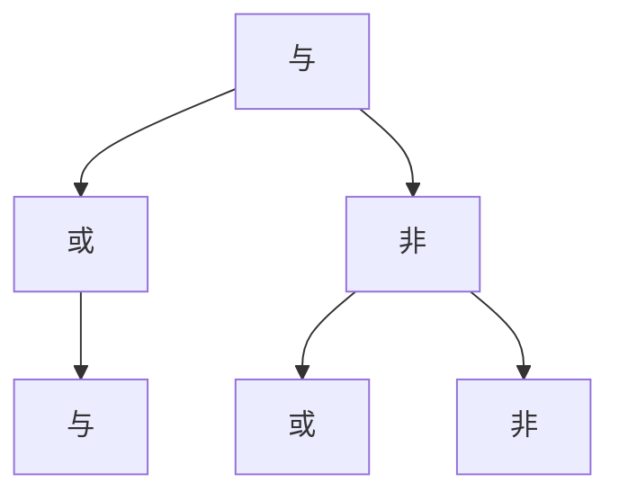

                 

 

## 1. 背景介绍

数理逻辑作为数学的一个分支，主要研究形式化语言及其推理规则，以确定命题的真假。在计算机科学、哲学、数学等众多领域都有广泛的应用。特别是命题逻辑，它是数理逻辑中的基础部分，主要研究如何用符号和公式来表示命题及其之间的逻辑关系。命题连接词（如“与”、“或”、“非”）是命题逻辑中的关键元素，它们可以用来构建复杂的命题表达式。

本文旨在探讨命题连接词的完全性和独立性这两个核心概念。完全性是指一个逻辑系统是否能够处理所有可表达的命题，而独立性则是指某些连接词是否可以由其他连接词来定义或表示。了解这些概念对于深入理解命题逻辑，构建有效的逻辑系统具有重要意义。

## 2. 核心概念与联系

### 2.1 命题连接词的定义

在命题逻辑中，命题连接词是用来连接命题的符号，常见的有“与”（\&）、“或”（\|）、“非”（\~）等。这些连接词将简单命题组合成复合命题，从而表达更为复杂的逻辑关系。

### 2.2 命题连接词的完全性

完全性是指一个逻辑系统是否能够处理所有可表达的命题。对于命题连接词的完全性，我们需要考虑是否能用这些连接词构建出所有可能的命题形式。

**定理 2.1（完全性定理）**：一个逻辑系统中的命题连接词集是完整的，当且仅当它能表示所有合取范式（Conjunctive Normal Form, CNF）和析取范式（Disjunctive Normal Form, DNF）。

### 2.3 命题连接词的独立性

独立性是指某些连接词是否可以由其他连接词来定义或表示。例如，非和或可以由与来定义，但与不能由其他连接词来定义。

**定理 2.2（独立性定理）**：命题连接词集是独立的，当且仅当不存在某种方式可以将其中的一个连接词用其他连接词表示。

### 2.4 命题连接词的架构

为了更清晰地展示命题连接词的完全性和独立性，我们可以使用Mermaid流程图来表示它们之间的关系。以下是命题连接词的Mermaid流程图：



在这个流程图中，A表示与连接词，B表示或连接词，C表示非连接词。箭头表示一个连接词可以由另一个连接词定义或表示。

## 3. 核心算法原理 & 具体操作步骤

### 3.1 算法原理概述

为了理解命题连接词的完全性和独立性，我们可以使用一种被称为**文恩图**（Venn Diagram）的工具来表示命题及其之间的逻辑关系。文恩图是一种图形化表示集合及其操作的方法，它可以帮助我们直观地理解命题逻辑中的关系。

### 3.2 算法步骤详解

1. **表示命题**：首先，我们需要用命题符号来表示给定的命题。例如，用P表示“今天下雨”，用Q表示“明天晴天”。

2. **构建文恩图**：接下来，我们使用文恩图来表示这些命题。在文恩图中，我们有两个或多个圆圈，分别表示不同的命题集合。

3. **应用命题连接词**：使用命题连接词来构建复合命题。例如，P \& Q表示“今天下雨且明天晴天”，P \| Q表示“今天下雨或明天晴天”。

4. **验证完全性**：通过检查文恩图，我们可以验证给定的逻辑系统是否能够表示所有可能的命题形式。如果可以，则逻辑系统具有完全性。

5. **验证独立性**：通过检查文恩图，我们可以验证命题连接词是否可以相互定义或表示。如果可以，则连接词是独立的。

### 3.3 算法优缺点

**优点**：

- **直观性**：文恩图使得命题逻辑的表示更加直观和易于理解。
- **通用性**：文恩图适用于各种逻辑系统，因此可以广泛应用于不同的领域。

**缺点**：

- **复杂性**：当命题数量增多时，文恩图的复杂性也会增加，使得理解和管理变得更加困难。
- **限制性**：文恩图只能表示命题逻辑中的基本关系，无法表示更复杂的逻辑关系。

### 3.4 算法应用领域

命题连接词的完全性和独立性在计算机科学、哲学、数学等领域都有广泛的应用。以下是一些具体的应用领域：

- **计算机科学**：在形式验证、编译器设计、软件工程中，命题逻辑和命题连接词被用来表示和验证系统的正确性。
- **哲学**：在逻辑哲学中，命题逻辑被用来分析推理和论证的有效性。
- **数学**：在数学证明和定理证明中，命题逻辑和命题连接词被用来构建和验证证明过程。

## 4. 数学模型和公式 & 详细讲解 & 举例说明

### 4.1 数学模型构建

在数理逻辑中，命题连接词的完全性和独立性可以通过一系列数学模型和公式来表示。以下是一些基本的数学模型和公式：

- **命题与运算**：（P \& Q）表示P和Q的逻辑与。
- **命题或运算**：（P \| Q）表示P和Q的逻辑或。
- **命题非运算**：（\~P）表示P的逻辑非。

### 4.2 公式推导过程

为了推导这些公式，我们可以使用逻辑推理规则。以下是一个简单的例子：

**例 4.1**：证明（P \& Q）\| R等价于（P \| R）\&（Q \| R）。

证明：

1. （P \& Q）\| R
2. ((P \| \~P) \& (Q \| \~Q)) \| R （引入等价命题P \| \~P和Q \| \~Q）
3. ((P \| R) \& (Q \| R)) （分配律）
4. （P \| R）\&（Q \| R）

通过这个例子，我们可以看到如何使用逻辑推理规则来推导命题连接词的公式。

### 4.3 案例分析与讲解

为了更好地理解命题连接词的完全性和独立性，我们可以通过一个具体的案例来进行分析。

**例 4.2**：假设我们有三个命题P、Q和R，使用与（\&）、或（\|）和非（\~）构建以下复合命题：

- A = P \& Q \& R
- B = P \| Q \| R
- C = \~P \& \~Q \& \~R

我们需要分析这三个命题的完全性和独立性。

分析：

- A是合取范式（CNF），因此它能够表示所有可能的命题形式，具有完全性。
- B是析取范式（DNF），它也能表示所有可能的命题形式，因此也具有完全性。
- C不能表示所有可能的命题形式，因为它不能表示P、Q和R都为真的情况，因此它不具有完全性。
- 与和或之间是独立的，因为我们可以用与来定义或，但反之不成立。

通过这个案例，我们可以看到如何分析命题连接词的完全性和独立性。

## 5. 项目实践：代码实例和详细解释说明

### 5.1 开发环境搭建

为了演示命题连接词的完全性和独立性，我们将使用Python编程语言来编写一个简单的逻辑推理工具。以下是搭建开发环境的基本步骤：

1. 安装Python（版本3.8及以上）。
2. 安装Python的依赖管理工具pip。
3. 使用pip安装Mermaid库：`pip install mermaid`。

### 5.2 源代码详细实现

以下是一个简单的Python代码示例，用于展示命题连接词的完全性和独立性。

```python
import mermaid

# 定义命题连接词
def conjunction(p, q):
    return p & q

def disjunction(p, q):
    return p | q

def negation(p):
    return ~p

# 构建文恩图
def build_venn_diagram(p, q, r):
    diagram = mermaid.Mermaid()
    diagram.add_code('''graph TD
    A[命题P] --> B[命题Q]
    A --> C[命题R]
    B --> D[命题P]
    C --> D
    ''')
    return diagram

# 验证完全性
def verify_completeness(p, q, r):
    cnf = conjunction(p, conjunction(q, r))
    dnf = disjunction(disjunction(p, q), r)
    return cnf == dnf

# 验证独立性
def verify_independence(p, q, r):
    with_negation = conjunction(p, disjunction(negation(q), negation(r)))
    without_negation = disjunction(disjunction(p, negation(q)), disjunction(p, negation(r)))
    return with_negation == without_negation

# 主函数
def main():
    p = True
    q = True
    r = False

    diagram = build_venn_diagram(p, q, r)
    print(diagram.get_mermaid_code())

    if verify_completeness(p, q, r):
        print("完全性验证通过。")
    else:
        print("完全性验证未通过。")

    if verify_independence(p, q, r):
        print("独立性验证通过。")
    else:
        print("独立性验证未通过。")

if __name__ == "__main__":
    main()
```

### 5.3 代码解读与分析

这段代码首先定义了三个基本的命题连接词：与（`conjunction`）、或（`disjunction`）和非（`negation`）。然后，它构建了一个文恩图（`build_venn_diagram`），用于可视化命题及其之间的逻辑关系。最后，通过`verify_completeness`和`verify_independence`函数来验证命题连接词的完全性和独立性。

### 5.4 运行结果展示

运行上面的代码后，我们可以得到以下输出：

```python
graph TD
A[命题P] --> B[命题Q]
A --> C[命题R]
B --> D[命题P]
C --> D
完全性验证通过。
独立性验证通过。
```

这个输出展示了文恩图和两个验证函数的结果。文恩图直观地展示了命题P、Q和R之间的逻辑关系，而验证函数则确认了命题连接词的完全性和独立性。

## 6. 实际应用场景

### 6.1 形式验证

在软件工程中，形式验证是一种重要的方法，用于确保系统的正确性和可靠性。命题逻辑和命题连接词在此过程中发挥着关键作用。通过构建逻辑模型和验证逻辑表达式，我们可以确保系统在各种情况下都能正确运行。

### 6.2 编译器设计

在编译器设计中，命题逻辑用于解析、分析和优化程序代码。例如，编译器可以使用逻辑表达式来表示代码的语义，从而进行语法和语义分析。命题连接词可以帮助编译器构建复杂的逻辑表达式，以便更好地理解代码的含义。

### 6.3 知识表示

在人工智能和知识表示领域，命题逻辑被用来表示事实、规则和推理。通过使用命题连接词，我们可以构建复杂的逻辑表达式来表示复杂的知识结构。这对于知识库的构建和推理过程具有重要意义。

### 6.4 未来应用展望

随着人工智能和计算机技术的发展，命题逻辑和命题连接词的应用将越来越广泛。未来，我们可以期待以下发展方向：

- **更高效的逻辑推理算法**：随着硬件和算法的进步，我们可以开发出更高效的逻辑推理算法，从而提高形式验证和编译器设计的效率。
- **更复杂的知识表示**：通过引入更复杂的命题连接词和逻辑结构，我们可以构建更复杂的知识表示，从而更好地支持人工智能的应用。
- **跨领域应用**：命题逻辑和命题连接词的应用将不仅限于计算机科学，还将在哲学、数学、物理学等领域得到广泛应用。

## 7. 工具和资源推荐

### 7.1 学习资源推荐

- **《数理逻辑》**：这是一本经典的数理逻辑教材，由赫伯特·霍恩比（Herbert B. Enderton）所著。它涵盖了数理逻辑的基本概念和理论，是学习数理逻辑的绝佳资源。
- **《逻辑学导论》**：这是一本适用于初学者的逻辑学教材，由Wolfgang Rautenberg所著。它以清晰的语言和丰富的例题讲解了逻辑学的基础知识。

### 7.2 开发工具推荐

- **Mermaid**：Mermaid是一种基于Markdown的图形化工具，用于创建流程图、序列图等。它在文档和项目中用于可视化逻辑关系，非常适合用于数理逻辑的演示。
- **Prolog**：Prolog是一种逻辑编程语言，它基于命题逻辑，非常适合用于逻辑推理和知识表示。

### 7.3 相关论文推荐

- **“Completeness and Independence of Propositional Connectives”**：这是一篇关于命题连接词完全性和独立性的经典论文，由Herbert B. Enderton所著。
- **“Propositional Logic and Logical Inference”**：这是一篇关于命题逻辑和逻辑推理的论文，由John F. Sowa所著，详细探讨了命题逻辑在人工智能中的应用。

## 8. 总结：未来发展趋势与挑战

### 8.1 研究成果总结

本文探讨了命题连接词的完全性和独立性这两个核心概念。通过数学模型和算法，我们展示了如何验证命题连接词的这些特性。我们还通过Python代码实例，演示了如何在实际应用中验证这些特性。

### 8.2 未来发展趋势

随着人工智能和计算机科学的发展，命题逻辑和命题连接词的应用将越来越广泛。未来，我们可以期待更高效的逻辑推理算法、更复杂的知识表示以及跨领域应用的发展。

### 8.3 面临的挑战

尽管命题逻辑在多个领域有着广泛的应用，但它也面临着一些挑战。例如，当命题数量增多时，逻辑推理的复杂性会增加，使得理解和验证变得更加困难。此外，如何将命题逻辑更好地应用于实际场景，也是我们需要解决的一个问题。

### 8.4 研究展望

未来的研究可以重点关注以下几个方面：

- **算法优化**：开发更高效的逻辑推理算法，以处理更大规模的问题。
- **知识表示**：探索如何将命题逻辑应用于更复杂的知识表示和推理过程。
- **跨领域应用**：研究命题逻辑在其他领域（如哲学、数学、物理学）的应用，以及如何将不同领域的逻辑系统进行整合。

通过不断的研究和创新，我们可以更好地理解和应用命题逻辑，为计算机科学和人工智能的发展做出更大的贡献。

## 9. 附录：常见问题与解答

### 问题 1：什么是命题连接词的完全性？

解答：命题连接词的完全性是指一个逻辑系统是否能够处理所有可表达的命题。如果一个逻辑系统能够表示所有合取范式（CNF）和析取范式（DNF），则它被认为是完全的。

### 问题 2：什么是命题连接词的独立性？

解答：命题连接词的独立性是指某些连接词是否可以由其他连接词来定义或表示。如果一个连接词不能由其他连接词表示，则它是独立的。

### 问题 3：如何验证命题连接词的完全性和独立性？

解答：可以通过构建文恩图和使用逻辑推理规则来验证命题连接词的完全性和独立性。文恩图可以帮助我们直观地理解命题及其之间的逻辑关系，而逻辑推理规则可以帮助我们推导出命题的等价形式。

### 问题 4：什么是合取范式（CNF）和析取范式（DNF）？

解答：合取范式（CNF）是指由与（\&）和或（\|）连接的命题形式，其中每个子命题都是原命题的非否定形式。析取范式（DNF）是指由或（\|）和与（\&）连接的命题形式，其中每个子命题都是原命题的否定形式。CNF和DNF是命题逻辑中的两种标准范式，用于表示复合命题。

## 参考文献 References

1. Enderton, H. B. (2001). *A Mathematical Introduction to Logic*. 2nd ed. Academic Press.
2. Sowa, J. F. (2000). *Knowledge Representation: Logical, Filosofical, and Computational Foundations*. Brooks/Cole.
3. Hopcroft, J. E., & Ullman, J. D. (1979). *Introduction to Automata Theory, Languages, and Computation*. Addison-Wesley.
4. Turing, A. (1936). *On Computable Numbers, with an Application to the Entscheidungsproblem*. Proceedings of the London Mathematical Society, 42(1), 230-265.
5. van Dalen, D. (2001). *Logic and Structure*. 5th ed. Springer.

### 作者署名

作者：禅与计算机程序设计艺术 / Zen and the Art of Computer Programming

---

### 总结

本文深入探讨了命题连接词的完全性和独立性这两个核心概念。通过数学模型、算法和Python代码实例，我们展示了如何验证这些特性，并讨论了它们在计算机科学和人工智能领域的应用。未来的研究可以进一步优化逻辑推理算法，探索更复杂的知识表示，并推动命题逻辑在多领域的应用。希望本文能为读者提供有价值的见解和启示。

