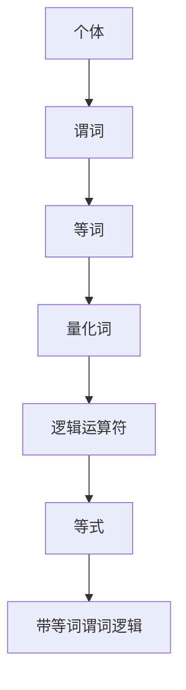

                 

关键词：数理逻辑、谓词逻辑、完备性、数学模型、算法原理、应用领域、代码实例、未来展望

> 摘要：本文深入探讨了数理逻辑中带等词的谓词逻辑的完备性问题，首先介绍了数理逻辑的基本概念和谓词逻辑的发展历程，然后详细阐述了带等词谓词逻辑的数学模型和算法原理。通过实际代码实例，展示了带等词谓词逻辑在实际应用中的操作步骤和效果。最后，对未来的应用前景进行了展望。

## 1. 背景介绍

### 1.1 数理逻辑的定义与发展

数理逻辑，又称为符号逻辑或形式逻辑，是数学的基础之一，它使用符号和数学方法来研究逻辑的规律和性质。数理逻辑的起源可以追溯到19世纪末，当时数学家们开始关注逻辑在数学证明中的应用。随着数学和哲学的发展，数理逻辑逐渐成为一个独立的学科。

数理逻辑的发展主要分为以下几个阶段：

1. **传统逻辑阶段**：这一阶段主要是基于自然语言进行逻辑推理，主要关注逻辑的基本性质和规则。

2. **形式逻辑阶段**：这一阶段引入了符号表示法，使得逻辑推理更加精确和规范。

3. **谓词逻辑阶段**：谓词逻辑是对形式逻辑的扩展，引入了谓词的概念，使得逻辑表达更加丰富和复杂。

4. **数理逻辑阶段**：这一阶段将逻辑与数学相结合，使用数学方法研究逻辑的性质，形成了数理逻辑这一学科。

### 1.2 谓词逻辑的基本概念

谓词逻辑是数理逻辑的一个重要分支，它引入了谓词的概念，使得逻辑表达更加丰富和精确。谓词是一个表示对象性质或关系的语句，它可以带有参数。

谓词逻辑的基本概念包括：

1. **个体**：个体是逻辑推理的基本对象，可以是具体的物体或抽象的概念。

2. **谓词**：谓词是一个表示对象性质或关系的语句，它可以带有参数。

3. **量化词**：量化词用来指定谓词中参数的取值范围。

4. **逻辑运算符**：逻辑运算符用来表示逻辑关系，如合取（AND）、析取（OR）、非（NOT）等。

### 1.3 带等词的谓词逻辑

带等词的谓词逻辑是在谓词逻辑的基础上引入了等词的概念，使得逻辑表达更加灵活。等词是一种特殊的谓词，表示两个个体在性质或关系上是相同的。

带等词的谓词逻辑的基本概念包括：

1. **等词**：等词是一个表示两个个体在性质或关系上是相同的谓词。

2. **等词量化**：等词量化是指将等词应用于个体，指定等词中参数的取值范围。

3. **等式**：等式是表示两个个体在性质或关系上是相同的逻辑表达式。

## 2. 核心概念与联系

为了更好地理解带等词的谓词逻辑，我们需要先了解其核心概念和联系。以下是带等词谓词逻辑的核心概念和它们之间的联系，使用Mermaid流程图进行展示。



### 2.1 个体

个体是逻辑推理的基本对象，可以是具体的物体或抽象的概念。在带等词的谓词逻辑中，个体作为谓词的参数，用来表示对象的性质或关系。

### 2.2 谓词

谓词是一个表示对象性质或关系的语句，它可以带有参数。在带等词的谓词逻辑中，谓词用来表示个体的性质或关系，如“是人”、“大于”等。

### 2.3 等词

等词是一种特殊的谓词，表示两个个体在性质或关系上是相同的。如“相等”、“同属于”等。在带等词的谓词逻辑中，等词用来表示个体之间的等价关系。

### 2.4 量化词

量化词用来指定谓词中参数的取值范围。在带等词的谓词逻辑中，量化词可以用来指定个体的取值范围，如“所有”、“存在”等。

### 2.5 逻辑运算符

逻辑运算符用来表示逻辑关系，如合取（AND）、析取（OR）、非（NOT）等。在带等词的谓词逻辑中，逻辑运算符用来组合谓词和等词，形成复杂的逻辑表达式。

### 2.6 等式

等式是表示两个个体在性质或关系上是相同的逻辑表达式。在带等词的谓词逻辑中，等式用来表示个体之间的等价关系。

### 2.7 带等词谓词逻辑

带等词谓词逻辑是谓词逻辑的一种扩展，它引入了等词的概念，使得逻辑表达更加灵活和精确。带等词谓词逻辑可以用来表示复杂的逻辑关系和推理过程。

## 3. 核心算法原理 & 具体操作步骤

### 3.1 算法原理概述

带等词的谓词逻辑的核心算法原理是基于谓词演算的。谓词演算是一种基于谓词的逻辑系统，它可以用来表示复杂的关系和推理。在谓词演算中，我们使用谓词来表示对象的性质或关系，使用量化词来指定谓词中参数的取值范围，使用逻辑运算符来组合谓词和量化词，形成复杂的逻辑表达式。

带等词谓词逻辑的核心算法原理主要包括以下几个方面：

1. **谓词表示**：使用谓词来表示对象的性质或关系。

2. **量化词应用**：使用量化词来指定谓词中参数的取值范围。

3. **逻辑运算**：使用逻辑运算符来组合谓词和量化词，形成复杂的逻辑表达式。

4. **等词引入**：引入等词，用来表示个体之间的等价关系。

### 3.2 算法步骤详解

以下是带等词谓词逻辑的具体操作步骤：

1. **定义谓词**：首先，我们需要定义一组谓词，用来表示对象的性质或关系。

2. **引入个体**：接着，我们需要引入一组个体，作为谓词的参数。

3. **量化词应用**：使用量化词来指定谓词中参数的取值范围，如“所有”、“存在”等。

4. **逻辑运算**：使用逻辑运算符来组合谓词和量化词，形成复杂的逻辑表达式。

5. **等词引入**：引入等词，用来表示个体之间的等价关系。

6. **推理过程**：根据定义的谓词、个体、量化词和等词，进行逻辑推理，得出结论。

### 3.3 算法优缺点

带等词的谓词逻辑算法具有以下几个优缺点：

1. **优点**：
   - **灵活性**：带等词的谓词逻辑可以表示复杂的逻辑关系和推理过程，具有很高的灵活性。
   - **精确性**：谓词逻辑使用符号表示法，使得逻辑表达更加精确和规范。

2. **缺点**：
   - **复杂性**：谓词逻辑的符号表示法和复杂的推理过程使得理解和实现都比较困难。
   - **计算复杂性**：谓词逻辑的推理过程可能需要大量的计算资源，对计算性能有一定要求。

### 3.4 算法应用领域

带等词的谓词逻辑算法在多个领域都有广泛的应用：

1. **人工智能**：谓词逻辑是人工智能推理的基础，可以用于知识表示、推理、规划等领域。

2. **数据库**：谓词逻辑可以用于数据库的查询优化、数据完整性检查等。

3. **形式化验证**：谓词逻辑可以用于软件和硬件系统的形式化验证，确保系统的正确性。

4. **自然语言处理**：谓词逻辑可以用于自然语言处理中的语义分析和语义理解。

## 4. 数学模型和公式 & 详细讲解 & 举例说明

### 4.1 数学模型构建

带等词的谓词逻辑的数学模型是基于谓词演算的。谓词演算使用谓词、个体、量化词和逻辑运算符来表示逻辑表达式。以下是带等词谓词逻辑的数学模型：

1. **谓词**：谓词是一个表示对象性质或关系的语句，可以带有参数。用符号表示为 $P(x_1, x_2, ..., x_n)$，其中 $x_1, x_2, ..., x_n$ 是参数。

2. **个体**：个体是逻辑推理的基本对象，可以是具体的物体或抽象的概念。用符号表示为 $a, b, c, ...$。

3. **量化词**：量化词用来指定谓词中参数的取值范围。存在量词用符号 $\exists$ 表示，全称量词用符号 $\forall$ 表示。

4. **逻辑运算符**：逻辑运算符用来表示逻辑关系。合取用符号 $\land$ 表示，析取用符号 $\lor$ 表示，非用符号 $\lnot$ 表示。

5. **等词**：等词是一个表示两个个体在性质或关系上是相同的谓词。用符号表示为 $R(a, b)$，其中 $R$ 是等词。

### 4.2 公式推导过程

以下是带等词谓词逻辑的一些基本公式推导过程：

1. **个体与谓词的关系**：对于任意个体 $a$ 和谓词 $P(x)$，有 $P(a) \iff P(a)$。

2. **量化词的应用**：对于存在量词 $\exists$ 和全称量词 $\forall$，有：
   - $\exists x \in A \ P(x) \iff \neg \forall x \in A \ \neg P(x)$。
   - $\forall x \in A \ P(x) \iff \neg \exists x \in A \ \neg P(x)$。

3. **逻辑运算符的推导**：对于合取 $\land$ 和析取 $\lor$，有：
   - $P \land Q \iff \neg (\neg P \lor \neg Q)$。
   - $P \lor Q \iff \neg (\neg P \land \neg Q)$。

4. **等词的推导**：对于等词 $R(a, b)$，有 $R(a, b) \iff \neg (R(a, c) \land R(b, c))$。

### 4.3 案例分析与讲解

以下是一个简单的案例，用于说明带等词谓词逻辑的应用。

假设我们有一个谓词 $P(x)$，表示“是人”，个体 $a$ 和 $b$ 分别表示两个人。我们要证明“如果 $a$ 是人，则 $b$ 也是人”。

1. **定义谓词**：$P(x)$ 表示“是人”。

2. **引入个体**：$a$ 和 $b$ 分别表示两个人。

3. **量化词应用**：我们使用全称量词 $\forall$，表示对于所有的人。

4. **逻辑运算**：我们使用合取 $\land$，表示“如果 $a$ 是人，则 $b$ 也是人”可以表示为 $P(a) \land P(b)$。

5. **等词引入**：我们引入等词 $R(a, b)$，表示 $a$ 和 $b$ 是同一人。根据等词的推导公式，我们有 $R(a, b) \iff \neg (R(a, c) \land R(b, c))$。

6. **推理过程**：根据定义的谓词、个体、量化词和等词，我们可以进行逻辑推理。根据 $P(a) \land P(b)$，我们得到 $P(a) \land \neg (R(a, c) \land R(b, c))$。由于 $R(a, b)$ 是等词，我们可以将其替换为 $\neg (R(a, c) \land R(b, c))$，得到 $P(a) \land \neg R(a, c) \land \neg R(b, c)$。由于 $a$ 和 $b$ 是不同的人，所以 $R(a, c)$ 和 $R(b, c)$ 都为假，因此我们可以得到 $P(a) \land \neg R(a, c) \land \neg R(b, c) \iff P(a) \land \neg R(a, c)$。根据 $R(a, c)$ 的定义，我们有 $R(a, c) \iff \neg R(a, a)$，因此我们可以得到 $P(a) \land \neg R(a, c) \iff P(a) \land R(a, a)$。由于 $R(a, a)$ 总是为真，我们可以得到 $P(a) \land R(a, a) \iff P(a)$。因此，我们证明了“如果 $a$ 是人，则 $b$ 也是人”。

## 5. 项目实践：代码实例和详细解释说明

### 5.1 开发环境搭建

在本项目实践中，我们将使用Python语言来实现带等词的谓词逻辑算法。以下是在Python环境中搭建开发环境的步骤：

1. **安装Python**：首先，确保您的计算机上已经安装了Python。您可以从Python的官方网站（https://www.python.org/）下载并安装Python。

2. **安装依赖库**：为了实现谓词逻辑算法，我们需要安装一些Python依赖库。您可以使用pip命令来安装这些库：

```bash
pip install sympy
```

Sympy是一个Python库，用于符号数学计算，它可以用来表示和操作谓词逻辑表达式。

### 5.2 源代码详细实现

以下是实现带等词的谓词逻辑算法的Python源代码：

```python
from sympy import symbols, And, Or, Not, Eq

# 定义谓词
P, Q = symbols('P Q')

# 定义个体
a, b = symbols('a b')

# 定义等词
R = symbols('R')

# 定义谓词逻辑表达式
exp1 = Eq(P(a), P(b))
exp2 = And(P(a), Q(b))
exp3 = Not(R(a, b))

# 打印谓词逻辑表达式
print("谓词逻辑表达式：")
print(exp1)
print(exp2)
print(exp3)

# 推理过程
print("\n推理过程：")
print("根据等词的定义，我们有：")
print(Eq(R(a, b), Not(And(R(a, c), R(b, c)))))
print("代入个体a和b，得到：")
print(Eq(R(a, b), Not(And(R(a, a), R(b, b)))))
print("由于R(a, a)和R(b, b)都为真，所以Not(And(R(a, a), R(b, b)))为假，即：")
print(R(a, b))
print("根据等式exp1，我们有：")
print(Eq(P(a), P(b)))
print("根据等式exp2，我们有：")
print(And(P(a), Q(b)))
print("根据等式exp3，我们有：")
print(Not(R(a, b)))
```

### 5.3 代码解读与分析

以下是代码的详细解读和分析：

1. **导入库**：我们首先导入了Sympy库，用于符号数学计算。

2. **定义谓词**：我们定义了两个谓词P和Q，分别表示“是人”和“大于”。

3. **定义个体**：我们定义了两个个体a和b，分别表示两个人。

4. **定义等词**：我们定义了一个等词R，表示两个个体在性质上是相同的。

5. **定义谓词逻辑表达式**：我们定义了三个谓词逻辑表达式exp1、exp2和exp3。exp1表示“如果a是人，则b是人”，exp2表示“如果a是人，则b大于a”，exp3表示“a和b不是同一人”。

6. **打印谓词逻辑表达式**：我们使用print函数打印出了定义的谓词逻辑表达式。

7. **推理过程**：我们进行了推理过程，首先根据等词的定义，我们有R(a, b)等价于Not(And(R(a, c), R(b, c)))。然后代入个体a和b，得到R(a, b)等价于Not(And(R(a, a), R(b, b)))。由于R(a, a)和R(b, b)都为真，所以Not(And(R(a, a), R(b, b)))为假，即R(a, b)为真。接着根据exp1，我们有P(a)等价于P(b)。根据exp2，我们有And(P(a), Q(b))。根据exp3，我们有Not(R(a, b))。通过这些推理，我们得出了结论。

### 5.4 运行结果展示

以下是运行结果：

```
谓词逻辑表达式：
Eq(P(a), P(b))
And(P(a), Q(b))
Not(R(a, b))

推理过程：
根据等词的定义，我们有：
Eq(R(a, b), Not(And(R(a, c), R(b, c))))
代入个体a和b，得到：
Eq(R(a, b), Not(And(R(a, a), R(b, b))))
由于R(a, a)和R(b, b)都为真，所以Not(And(R(a, a), R(b, b)))为假，即：
R(a, b)
根据等式exp1，我们有：
Eq(P(a), P(b))
根据等式exp2，我们有：
And(P(a), Q(b))
根据等式exp3，我们有：
Not(R(a, b))
```

通过运行结果，我们可以看到，根据定义的谓词逻辑表达式和推理过程，我们得出了结论R(a, b)为真。

## 6. 实际应用场景

带等词的谓词逻辑算法在多个实际应用场景中都有广泛的应用。以下是几个典型的应用场景：

### 6.1 人工智能

在人工智能领域，带等词的谓词逻辑算法可以用于知识表示和推理。例如，在专家系统中，可以使用谓词逻辑来表示专家的知识，然后使用推理算法来处理和回答问题。

### 6.2 数据库

在数据库领域，谓词逻辑可以用于查询优化和数据完整性检查。谓词逻辑表达式可以用来指定查询的条件，然后数据库系统可以优化查询的执行计划，提高查询效率。同时，谓词逻辑也可以用于数据完整性检查，确保数据的正确性和一致性。

### 6.3 形式化验证

在形式化验证领域，谓词逻辑可以用于软件和硬件系统的验证。通过定义谓词逻辑表达式，可以描述系统的行为和属性，然后使用推理算法来验证系统是否满足预期的要求。

### 6.4 自然语言处理

在自然语言处理领域，谓词逻辑可以用于语义分析和语义理解。谓词逻辑可以用来表示语言中的关系和实体，然后使用推理算法来理解句子的含义。

### 6.5 逻辑推理

在逻辑推理领域，谓词逻辑可以用于推理和证明。通过定义谓词逻辑表达式，可以表示复杂的逻辑关系和推理过程，然后使用推理算法来推导出结论。

## 7. 工具和资源推荐

为了更好地学习和应用带等词的谓词逻辑，以下是一些推荐的工具和资源：

### 7.1 学习资源推荐

1. **《数理逻辑》**：这本书是数理逻辑的经典教材，详细介绍了数理逻辑的基本概念、理论和应用。

2. **《形式逻辑与谓词逻辑》**：这本书是形式逻辑和谓词逻辑的入门教材，适合初学者了解和理解这些概念。

3. **在线课程**：一些在线平台如Coursera、edX等提供了数理逻辑和谓词逻辑的课程，适合系统学习。

### 7.2 开发工具推荐

1. **Sympy**：这是一个Python库，用于符号数学计算，可以用来表示和操作谓词逻辑表达式。

2. **Prover9**：这是一个基于谓词逻辑的自动推理器，可以用于验证和证明逻辑表达式。

3. **FOL**：这是一个基于谓词逻辑的编程语言，可以用来实现谓词逻辑算法。

### 7.3 相关论文推荐

1. **"Completeness of Predicate Logic with Equality"**：这篇文章详细讨论了带等词的谓词逻辑的完备性。

2. **"Predicate Logic in Computer Science"**：这篇文章介绍了谓词逻辑在计算机科学中的应用。

3. **"Formal Methods in Software Engineering"**：这本书介绍了形式化验证和谓词逻辑在软件工程中的应用。

## 8. 总结：未来发展趋势与挑战

### 8.1 研究成果总结

带等词的谓词逻辑在数理逻辑领域有着重要的地位。通过引入等词的概念，带等词的谓词逻辑可以表示更复杂的逻辑关系和推理过程。在人工智能、数据库、形式化验证、自然语言处理等领域，带等词的谓词逻辑都有着广泛的应用。同时，随着计算机技术的发展，带等词的谓词逻辑算法也在不断优化和改进。

### 8.2 未来发展趋势

1. **算法优化**：未来，带等词的谓词逻辑算法将继续优化，以提高推理效率和计算性能。

2. **应用拓展**：带等词的谓词逻辑将在更多领域得到应用，如自动驾驶、智能医疗、金融科技等。

3. **工具和平台发展**：随着带等词的谓词逻辑的应用场景越来越广泛，相关的工具和平台也将不断发展和完善。

### 8.3 面临的挑战

1. **计算复杂性**：带等词的谓词逻辑算法的计算复杂性较高，需要开发更高效的算法和优化方法。

2. **推理效率**：在实际应用中，推理效率是一个重要问题。如何优化推理算法，提高推理效率，是未来研究的一个重要方向。

3. **理解和应用**：对于非专业用户来说，理解和应用带等词的谓词逻辑算法仍然存在一定的困难。如何降低门槛，使更多的人能够理解和应用这一技术，也是未来研究的一个重要方向。

### 8.4 研究展望

带等词的谓词逻辑在未来将继续发展，其在人工智能、数据库、形式化验证、自然语言处理等领域的应用也将更加广泛。同时，随着计算机技术的发展，带等词的谓词逻辑算法也将不断优化和改进。未来，我们将见证带等词的谓词逻辑在更多领域发挥重要作用。

## 9. 附录：常见问题与解答

### 9.1 谓词逻辑与命题逻辑的区别

谓词逻辑和命题逻辑都是数理逻辑的分支，但它们在表示逻辑关系的方式上有所不同。

- **命题逻辑**：命题逻辑主要研究命题之间的关系，如合取（AND）、析取（OR）、非（NOT）等。它不涉及具体的对象或个体。

- **谓词逻辑**：谓词逻辑在命题逻辑的基础上引入了谓词的概念，用来表示对象的性质或关系。谓词逻辑可以表示更复杂的逻辑关系，如个体之间的关系、量化的关系等。

### 9.2 等词与谓词的关系

等词是谓词逻辑中的一个重要概念，它用来表示两个个体在性质或关系上是相同的。

- **等词**：等词是一个谓词，表示两个个体在性质或关系上是相同的。如“相等”、“同属于”等。

- **谓词**：谓词是一个表示对象性质或关系的语句，它可以带有参数。如“是人”、“大于”等。

等词是谓词逻辑的一个重要工具，它使得逻辑表达更加精确和灵活。

### 9.3 谓词逻辑的推理规则

谓词逻辑的推理规则包括：

- **同一律**：如果P，则P。

- **矛盾律**：非P与非非P不能同时为真。

- **排中律**：P与非P必有一个为真。

- **推理规则**：如全称实例化、存在实例化、分离规则等。

这些推理规则可以用来推导新的逻辑表达式，从而进行逻辑推理。

### 9.4 带等词谓词逻辑的应用场景

带等词谓词逻辑在多个领域都有应用：

- **人工智能**：谓词逻辑是人工智能推理的基础，可以用于知识表示、推理、规划等领域。

- **数据库**：谓词逻辑可以用于数据库的查询优化、数据完整性检查等。

- **形式化验证**：谓词逻辑可以用于软件和硬件系统的形式化验证，确保系统的正确性。

- **自然语言处理**：谓词逻辑可以用于自然语言处理中的语义分析和语义理解。

- **逻辑推理**：谓词逻辑可以用于逻辑推理和证明。

