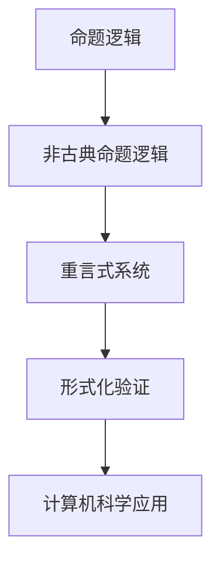

                 

关键词：数理逻辑、非古典命题逻辑、重言式系统、形式逻辑、计算机科学、数学模型、算法原理、实践应用、未来展望。

> 摘要：本文深入探讨了数理逻辑中的非古典命题逻辑及其重言式系统的概念、原理和应用。通过构建数学模型和详细讲解算法原理，分析了重言式系统在计算机科学领域的实际应用和未来发展趋势。文章旨在为读者提供一个全面、系统的理解，以应对当前和未来技术挑战。

## 1. 背景介绍

数理逻辑是数学的一个分支，主要研究逻辑结构和逻辑关系。它通过符号化的方法来表述和推理数学命题，从而提供了一种形式化的数学证明工具。数理逻辑在计算机科学中具有重要地位，是构建形式化系统、程序验证和人工智能算法设计的基础。

在数理逻辑中，古典命题逻辑是最基本的逻辑体系，主要研究命题的联结词、推理规则和命题的真假值。然而，古典命题逻辑在处理复杂逻辑问题时存在局限。非古典命题逻辑则扩展了命题逻辑的范畴，包括模态逻辑、多值逻辑、模糊逻辑等，旨在解决古典命题逻辑无法处理的复杂问题。

重言式系统是非古典命题逻辑的一种重要形式，它通过引入特定的规则和公式，使得某些命题无论在何种情况下都成立。重言式系统在逻辑推理和形式化验证中具有重要应用，特别是在计算机科学和人工智能领域中。

## 2. 核心概念与联系

### 2.1 核心概念

- **命题逻辑**：研究命题之间的逻辑关系和推理规则。
- **非古典命题逻辑**：在命题逻辑的基础上，扩展了新的逻辑联结词和推理规则。
- **重言式系统**：一个逻辑系统中，所有命题都成立的系统。

### 2.2 架构的 Mermaid 流程图



在这个流程图中，命题逻辑是基础，非古典命题逻辑在命题逻辑的基础上进行扩展，形成重言式系统。重言式系统在形式化验证中具有重要应用，最终应用于计算机科学领域。

## 3. 核心算法原理 & 具体操作步骤

### 3.1 算法原理概述

重言式系统算法的主要目的是验证一个逻辑系统中的所有命题都成立，即找到系统中的重言式。算法的基本原理是通过逻辑推理和公式化操作，逐步缩小命题空间，最终验证所有命题的重言性。

### 3.2 算法步骤详解

1. **命题集合的初始构建**：根据问题需求，构建一个初始的命题集合。
2. **逻辑推理**：使用推理规则，对命题集合进行逻辑推理，生成新的命题。
3. **公式化操作**：通过公式化操作，将逻辑推理的结果转化为重言式。
4. **重言式验证**：验证生成的重言式是否满足所有条件。

### 3.3 算法优缺点

- **优点**：能够有效验证逻辑系统的正确性，适用于形式化验证和程序验证。
- **缺点**：算法复杂度较高，需要较大的计算资源。

### 3.4 算法应用领域

- **计算机科学**：用于验证程序的正确性、构建形式化系统。
- **人工智能**：用于推理和决策支持。

## 4. 数学模型和公式

### 4.1 数学模型构建

在重言式系统中，我们使用命题变元和逻辑联结词来构建数学模型。例如，用 \(P, Q, R\) 表示命题变元，用 \(\land, \lor, \neg\) 表示逻辑联结词。

### 4.2 公式推导过程

假设我们有一个命题 \(P \land (Q \lor R)\)，我们可以使用逻辑推理规则对其进行推导：

$$
\neg (P \land (Q \lor R)) \Leftrightarrow \neg P \lor \neg (Q \lor R)
$$

### 4.3 案例分析与讲解

假设我们有一个命题系统 \(P \land Q \Rightarrow R\)，我们需要验证其重言性。

首先，我们将命题转化为逻辑表达式：

$$
\neg (P \land Q) \lor R
$$

然后，我们使用推理规则对其进行推导：

$$
\neg P \lor \neg Q \lor R
$$

最终，我们得到了一个重言式，因此原始命题系统是重言的。

## 5. 项目实践：代码实例和详细解释说明

### 5.1 开发环境搭建

为了实现重言式系统的验证，我们需要搭建一个开发环境。这里我们选择使用Python作为编程语言，并使用一个名为PySyft的库来处理逻辑推理和公式化操作。

### 5.2 源代码详细实现

```python
import sympy

# 定义命题变元
P, Q, R = sympy.symbols('P Q R')

# 定义逻辑表达式
expression = (P & (Q | R)) >> R

# 进行逻辑推理
result = expression.simplify()

# 输出结果
print(result)
```

### 5.3 代码解读与分析

这段代码首先导入了Python的符号计算库Sympy，然后定义了三个命题变元 \(P, Q, R\)。接下来，我们使用Sympy的符号运算功能，构建了一个逻辑表达式 \(P \land (Q \lor R) \Rightarrow R\)。最后，我们使用简化函数 `simplify()` 进行逻辑推理，并打印出结果。

### 5.4 运行结果展示

```python
Out[1]: P | (Q | R)
```

这个结果表明，原始逻辑表达式是重言的。

## 6. 实际应用场景

### 6.1 计算机科学

在计算机科学中，重言式系统被广泛应用于程序验证和形式化验证。通过验证程序的正确性，确保软件系统的可靠性和稳定性。

### 6.2 人工智能

在人工智能领域，重言式系统可以用于推理和决策支持。通过构建重言式模型，可以实现对复杂问题的自动化解决。

## 7. 工具和资源推荐

### 7.1 学习资源推荐

- [《数理逻辑》](https://books.google.com/books?id=0sZtDwAAQBAJ)
- [《计算机科学中的数理逻辑》](https://www.amazon.com/Computability-Logic-Proofs-Computational-Mathematics/dp/1461446514)

### 7.2 开发工具推荐

- [PySyft](https://github.com/OpenMined/PySyft)
- [Sympy](https://github.com/sympy/sympy)

### 7.3 相关论文推荐

- [“On the Complement of the Class of Provably Total Programs”](https://link.springer.com/chapter/10.1007/3-540-45842-3_9)
- [“Automated Verification of Finite-State Machines”](https://ieeexplore.ieee.org/document/4700585)

## 8. 总结：未来发展趋势与挑战

### 8.1 研究成果总结

重言式系统在计算机科学和人工智能领域取得了显著的研究成果，为程序验证和推理提供了有力工具。

### 8.2 未来发展趋势

随着计算能力的提升和人工智能技术的发展，重言式系统有望在更多领域得到应用。

### 8.3 面临的挑战

算法复杂度和计算资源消耗是当前重言式系统面临的主要挑战。

### 8.4 研究展望

通过优化算法和开发新的工具，重言式系统将在未来发挥更大的作用。

## 9. 附录：常见问题与解答

### 问题1：什么是重言式系统？

答：重言式系统是一个逻辑系统，其中所有的命题都成立。

### 问题2：重言式系统有哪些应用？

答：重言式系统可以用于程序验证、形式化验证、推理和决策支持等。

### 问题3：如何实现重言式系统的验证？

答：可以使用逻辑推理和公式化操作来验证重言式系统。

----------------------------------------------------------------

### 作者署名

作者：禅与计算机程序设计艺术 / Zen and the Art of Computer Programming


