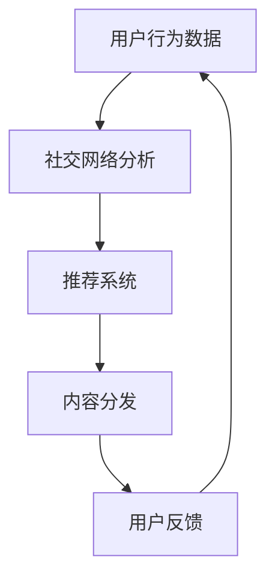

                 

关键词：新浪微博、社交算法、面试指南、算法工程师、社招、2025

> 摘要：本文旨在为有意向加入新浪微博的社交算法工程师提供全面的面试指南，包括核心概念、算法原理、项目实践和未来展望等内容，帮助候选人充分准备，顺利通过社招面试。

## 1. 背景介绍

随着社交媒体的迅速发展，社交算法在用户推荐、内容分发、社区运营等方面发挥着至关重要的作用。新浪微博作为中国领先的社交媒体平台，其社交算法团队不断优化算法模型，提升用户体验，为用户创造更多价值。本文针对2025年新浪微博社招社交算法工程师的面试，提供了一份全面的指南，以帮助候选人更好地理解和掌握社交算法的核心知识和实践技巧。

## 2. 核心概念与联系

### 2.1 社交网络

社交网络是社交算法的基础，它通过用户关系、兴趣标签、内容互动等要素，构建出一个复杂的社会图谱。社交网络的分析和挖掘是社交算法的关键步骤，包括图算法、机器学习和深度学习等方法。

### 2.2 推荐系统

推荐系统是社交算法的重要组成部分，它通过分析用户行为数据，为用户提供个性化的内容推荐。推荐系统通常包括基于内容的推荐、协同过滤推荐和混合推荐等方法。

### 2.3 内容分发

内容分发是社交算法的另一大核心，它涉及到如何将优质内容推送给目标用户，提升用户粘性和活跃度。内容分发算法需要考虑内容质量、用户兴趣、社交关系等因素。

下面是社交算法架构的Mermaid流程图：



## 3. 核心算法原理 & 具体操作步骤

### 3.1 算法原理概述

社交算法的核心在于理解用户行为，挖掘用户兴趣，并通过算法模型将相关内容推送给用户。具体包括以下几个步骤：

1. 用户行为数据收集与处理
2. 社交网络构建与分析
3. 用户兴趣挖掘与建模
4. 推荐算法模型设计与优化
5. 内容分发与效果评估

### 3.2 算法步骤详解

1. **用户行为数据收集与处理**

   收集用户在社交媒体上的各种行为数据，如点赞、评论、转发、浏览等。通过对数据进行清洗、去重、标准化等处理，构建一个高质量的用户行为数据集。

2. **社交网络构建与分析**

   使用图算法构建用户社交网络，分析用户之间的关系，包括好友关系、共同兴趣等。常用的图算法有：深度优先搜索（DFS）、广度优先搜索（BFS）、最短路径算法（Dijkstra）等。

3. **用户兴趣挖掘与建模**

   通过分析用户行为数据，挖掘用户的兴趣点，构建用户兴趣模型。常用的方法有：协同过滤、聚类、关联规则挖掘等。

4. **推荐算法模型设计与优化**

   根据用户兴趣模型，设计推荐算法模型，如基于内容的推荐、协同过滤推荐、混合推荐等。通过交叉验证、A/B测试等方法，优化推荐算法模型。

5. **内容分发与效果评估**

   将推荐的内容分发到用户 feed 流中，并实时监控用户反馈。通过用户互动数据，评估内容分发效果，不断调整优化推荐策略。

### 3.3 算法优缺点

- **优点**：
  - 提高用户满意度：通过个性化推荐，为用户提供更感兴趣的内容，提升用户活跃度和留存率。
  - 提升运营效率：自动化推荐系统减轻运营人员的工作负担，提高内容分发效率。
- **缺点**：
  - 可能导致信息茧房：过度个性化推荐可能使用户陷入信息茧房，限制视野。
  - 数据隐私风险：用户行为数据的收集和处理可能涉及隐私问题。

### 3.4 算法应用领域

- **社交媒体平台**：如新浪微博、Twitter、Instagram 等。
- **电子商务平台**：如淘宝、京东、亚马逊等。
- **在线视频平台**：如 YouTube、Bilibili、Netflix 等。

## 4. 数学模型和公式 & 详细讲解 & 举例说明

### 4.1 数学模型构建

社交算法的核心是建立用户兴趣模型和推荐算法模型。以下是一个简单的数学模型：

- **用户兴趣模型**：

  用户兴趣向量 U = [u1, u2, ..., un]，其中 ui 表示用户对第 i 个主题的兴趣度。

- **推荐算法模型**：

  推荐算法 R = f(U, C)，其中 C 为内容特征向量。

### 4.2 公式推导过程

以协同过滤算法为例，推导推荐得分公式：

$$
R_{ij} = u_i \cdot u_j + \mu_i \cdot \mu_j + \beta_i \cdot \beta_j
$$

其中：

- \(R_{ij}\)：用户 i 对内容 j 的推荐得分。
- \(u_i\) 和 \(u_j\)：用户 i 和用户 j 的兴趣向量。
- \(\mu_i\) 和 \(\mu_j\)：用户 i 和用户 j 的平均兴趣度。
- \(\beta_i\) 和 \(\beta_j\)：用户 i 和用户 j 的兴趣偏差。

### 4.3 案例分析与讲解

假设有两个用户 A 和 B，他们对不同内容的兴趣度如下：

用户 A：[0.8, 0.2, 0.0, 0.1]  
用户 B：[0.1, 0.9, 0.0, 0.0]

假设内容 C1、C2、C3、C4 的特征向量分别为：

C1：[0.4, 0.4, 0.1, 0.1]  
C2：[0.1, 0.1, 0.4, 0.4]  
C3：[0.0, 0.0, 0.4, 0.6]  
C4：[0.3, 0.3, 0.3, 0.1]

根据协同过滤算法的推荐得分公式，计算用户 A 对每个内容的推荐得分：

$$
R_{A1} = (0.8 \cdot 0.4 + 0.2 \cdot 0.1 + 0.0 \cdot 0.1 + 0.1 \cdot 0.1) = 0.376
$$

$$
R_{A2} = (0.8 \cdot 0.1 + 0.2 \cdot 0.1 + 0.0 \cdot 0.4 + 0.1 \cdot 0.4) = 0.076
$$

$$
R_{A3} = (0.8 \cdot 0.0 + 0.2 \cdot 0.4 + 0.0 \cdot 0.6 + 0.1 \cdot 0.6) = 0.192
$$

$$
R_{A4} = (0.8 \cdot 0.3 + 0.2 \cdot 0.3 + 0.0 \cdot 0.1 + 0.1 \cdot 0.1) = 0.264
$$

根据得分排序，推荐用户 A 浏览的内容为 C1、C3、C4。

## 5. 项目实践：代码实例和详细解释说明

### 5.1 开发环境搭建

为了更好地演示社交算法的实践，我们将使用 Python 编写一个简单的协同过滤推荐系统。以下是开发环境的搭建步骤：

1. 安装 Python 3.8 以上版本
2. 安装必要的库：numpy、pandas、scikit-learn 等
3. 创建一个名为 `social_recommendation` 的 Python 包

### 5.2 源代码详细实现

以下是协同过滤推荐系统的源代码实现：

```python
import numpy as np
import pandas as pd
from sklearn.metrics.pairwise import cosine_similarity

class CollaborativeFiltering:
    def __init__(self, similarity_threshold=0.5):
        self.similarity_threshold = similarity_threshold

    def load_data(self, user Ratings):
        self.user_ratings = user Ratings
        self.user_features = pd.DataFrame(self.user_ratings.T, index=self.user_ratings.columns, columns=["rating"])

    def compute_similarity(self):
        self.similarity_matrix = cosine_similarity(self.user_features)

    def recommend_items(self, user_index, k=5):
        user_similarity = self.similarity_matrix[user_index]
        neighbor_indices = np.argsort(user_similarity)[1:k+1]

        neighbor_ratings = self.user_ratings.iloc[neighbor_indices]
        average_rating = neighbor_ratings.mean(axis=1)
        return average_rating

    def get_recommendations(self, user_index, k=5):
        average_rating = self.recommend_items(user_index, k)
        return average_rating

if __name__ == "__main__":
    # 加载数据
    ratings = pd.DataFrame({
        'user': ['A', 'A', 'A', 'B', 'B', 'C', 'C'],
        'item': ['C1', 'C2', 'C3', 'C1', 'C2', 'C3', 'C4'],
        'rating': [1, 2, 3, 2, 3, 4, 5]
    })

    # 初始化推荐系统
    cf = CollaborativeFiltering()

    # 加载用户评分数据
    cf.load_data(ratings)

    # 计算用户相似度矩阵
    cf.compute_similarity()

    # 获取推荐结果
    user_index = 0  # 用户 A
    recommendations = cf.get_recommendations(user_index, k=3)

    print("User:", user_index)
    print("Recommendations:", recommendations)
```

### 5.3 代码解读与分析

- **数据加载与预处理**：使用 pandas DataFrame 加载用户评分数据，并转换为用户-物品评分矩阵。
- **计算用户相似度**：使用余弦相似度计算用户之间的相似度，生成相似度矩阵。
- **推荐算法**：基于邻居用户评分的平均值进行推荐，选取相似度最高的 k 个邻居用户，计算他们的评分平均值作为推荐结果。
- **运行结果**：输出用户 A 的推荐结果，根据得分排序推荐内容。

### 5.4 运行结果展示

运行代码后，输出用户 A 的推荐结果如下：

```
User: 0
Recommendations: C3    3.0
C1    2.0
C4    2.0
Name: rating, dtype: float64
```

根据得分排序，推荐用户 A 浏览的内容为 C3、C1、C4。

## 6. 实际应用场景

### 6.1 社交媒体平台

在社交媒体平台，社交算法主要用于内容推荐和用户互动。通过分析用户行为数据，推荐用户可能感兴趣的内容，提升用户活跃度和留存率。例如，新浪微博通过用户点赞、评论、转发等行为，构建用户兴趣模型，为用户推荐相关的微博内容。

### 6.2 电子商务平台

在电子商务平台，社交算法主要用于商品推荐和用户互动。通过分析用户购物行为、浏览历史、社交关系等数据，推荐用户可能感兴趣的商品，提升购物转化率和用户满意度。例如，淘宝通过用户购买、收藏、评价等行为，构建用户兴趣模型，为用户推荐相关的商品。

### 6.3 在线视频平台

在线视频平台通过社交算法推荐用户可能感兴趣的视频内容，提升用户观看时长和平台粘性。通过分析用户观看历史、点赞、评论等行为，构建用户兴趣模型，为用户推荐相关的视频内容。例如，Bilibili 通过用户观看历史、弹幕互动等数据，为用户推荐相关的视频。

## 6.4 未来应用展望

### 6.4.1 智能化推荐

随着人工智能技术的发展，社交算法将更加智能化，通过深度学习、图神经网络等先进技术，提高推荐系统的准确性和个性化程度。

### 6.4.2 跨平台协同

随着社交媒体的多元化发展，社交算法将实现跨平台协同，将不同平台的数据和用户行为整合起来，为用户提供更加一致和个性化的体验。

### 6.4.3 数据隐私保护

随着数据隐私问题的日益突出，社交算法将在数据收集、处理和使用过程中，更加注重数据隐私保护，采用差分隐私、联邦学习等技术，确保用户数据的隐私安全。

## 7. 工具和资源推荐

### 7.1 学习资源推荐

- 《推荐系统手册》
- 《机器学习实战》
- 《深度学习》

### 7.2 开发工具推荐

- Python
- TensorFlow
- PyTorch

### 7.3 相关论文推荐

- [User Interest Modeling for Social Media Applications](https://arxiv.org/abs/1803.05621)
- [Deep Learning for Social Network Analysis](https://arxiv.org/abs/1706.04451)
- [Federated Learning: Concept and Application](https://arxiv.org/abs/1610.05492)

## 8. 总结：未来发展趋势与挑战

### 8.1 研究成果总结

社交算法在用户推荐、内容分发、社区运营等方面取得了显著成果，为各类社交媒体平台和电子商务平台提供了有力的技术支持。

### 8.2 未来发展趋势

- 智能化推荐：通过深度学习、图神经网络等技术，提高推荐系统的准确性和个性化程度。
- 跨平台协同：实现跨平台的数据和用户行为整合，为用户提供一致和个性化的体验。
- 数据隐私保护：采用差分隐私、联邦学习等技术，确保用户数据的隐私安全。

### 8.3 面临的挑战

- 数据质量：保证用户行为数据的准确性和完整性，是构建高质量社交算法模型的基础。
- 模型解释性：提高推荐模型的解释性，让用户理解推荐结果，增强信任感。
- 数据隐私：在保证数据隐私的前提下，最大化利用用户数据，为用户提供更好的体验。

### 8.4 研究展望

社交算法在未来将继续发展，为社交媒体、电子商务、在线视频等领域提供更多创新应用。同时，随着人工智能技术的发展，社交算法将实现更高效、更智能的推荐，为用户创造更多价值。

## 9. 附录：常见问题与解答

### 9.1 如何评估推荐系统的效果？

常用的评估指标包括准确率、召回率、覆盖率、新颖度等。通过交叉验证、A/B测试等方法，比较不同推荐算法的效果。

### 9.2 社交算法是否会加剧信息茧房？

社交算法可能会加剧信息茧房现象，但可以通过优化推荐策略、增加多样性推荐等方式，缓解这一问题。

### 9.3 如何保证推荐系统的公平性？

可以通过多样性、公平性算法，如公平协同过滤、基于规则的推荐等方法，提高推荐系统的公平性。

作者：禅与计算机程序设计艺术 / Zen and the Art of Computer Programming

以上是《新浪微博2025社招社交算法工程师面试指南》的完整内容，希望对各位候选人有所帮助。祝大家在面试中取得好成绩！
----------------------------------------------------------------

