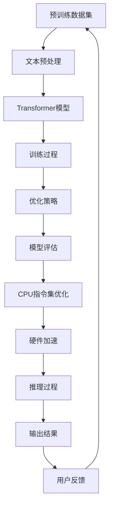

                 

关键词：自然语言处理、大型语言模型、CPU指令集、人工智能、性能优化

> 摘要：本文将深入探讨大型语言模型（LLM）与CPU指令集之间的较量。通过对LLM的技术原理和CPU指令集的工作机制进行详细分析，我们将揭示LLM在性能和效率上的优势与局限，以及CPU指令集在响应速度和资源利用率方面的潜力。通过本文的探讨，我们希望能为读者提供对LLM和CPU指令集的更全面、更深入的理解，并为未来的技术发展提供有益的启示。

## 1. 背景介绍

随着人工智能技术的飞速发展，自然语言处理（NLP）领域迎来了前所未有的变革。特别是大型语言模型（LLM，Large Language Model）的出现，使得人工智能在文本生成、文本理解、机器翻译等方面取得了显著的进展。LLM具有强大的处理能力和广泛的适用性，已成为众多应用场景的核心技术。

另一方面，CPU指令集作为计算机硬件的核心，其性能直接决定了计算机系统的运行效率。随着摩尔定律的逼近极限，CPU指令集的发展遇到了新的挑战。如何在有限的硬件资源下，实现更高的性能和更优的能效，成为CPU设计者和研究者们亟待解决的问题。

本文旨在探讨LLM和CPU指令集在性能和效率上的较量，分析两者在技术原理、应用场景、优化策略等方面的异同点。通过对LLM和CPU指令集的深入剖析，我们希望能为读者提供对人工智能和计算机硬件领域更全面的认识，并探讨未来技术的发展方向。

### 1.1 大型语言模型（LLM）的发展历程

大型语言模型（LLM）的发展历程可以追溯到20世纪80年代的统计机器翻译和文本分类技术。随着计算能力的提升和数据规模的扩大，NLP领域逐渐从规则驱动的方法转向数据驱动的方法。2018年，谷歌推出了BERT（Bidirectional Encoder Representations from Transformers），这是第一个具有里程碑意义的大型语言模型。BERT的提出标志着NLP领域进入了深度学习时代，使得文本表示和理解能力取得了质的飞跃。

随后，GPT（Generative Pre-trained Transformer）系列模型相继问世，包括GPT-2、GPT-3等。这些模型在规模和性能上不断突破，展现出了强大的文本生成和文本理解能力。GPT-3拥有1750亿个参数，可以生成高质量的文本、回答问题、进行对话等，极大地拓展了人工智能的应用场景。

除了GPT系列，其他大型语言模型如TuringChat、RoBERTa等也在不断地推动NLP技术的发展。这些模型在预训练阶段使用了海量的文本数据进行训练，通过多层神经网络结构实现了对文本的深层理解。预训练 + 微调（Pre-training + Fine-tuning）已经成为大型语言模型的主流训练方法。

### 1.2 CPU指令集的发展历程

CPU指令集的发展历程可以追溯到20世纪60年代。早期的CPU指令集以冯·诺依曼架构为基础，采用简单的指令集和固定的指令周期。随着计算机技术的发展，CPU指令集逐渐演变，从16位、32位到64位，指令集的复杂度和性能不断提升。

1971年，英特尔推出了8086处理器，这是第一款使用复杂的指令集架构（CISC，Complex Instruction Set Computing）的CPU。CISC指令集通过提供丰富的指令集，使得程序员可以编写更简洁的代码。然而，CISC指令集在性能和资源利用率方面存在一定局限，例如指令长度不固定、指令解码复杂等。

为了解决这些问题，精简指令集计算机（RISC，Reduced Instruction Set Computing）架构应运而生。RISC指令集通过减少指令数量、简化指令格式，提高了指令的执行速度和资源利用率。1990年代，RISC架构逐渐取代CISC架构，成为主流的CPU设计方向。

近年来，随着多核处理器的兴起，CPU指令集进一步发展。多核处理器通过多个执行单元并行工作，提高了计算性能。同时，GPU（图形处理器）指令集的发展也为CPU指令集带来了新的启示。GPU指令集通过高度并行化的设计，实现了在图像处理、机器学习等领域的突破。

### 1.3 LLM与CPU指令集的关系

LLM和CPU指令集在人工智能领域扮演着重要角色。LLM作为自然语言处理的核心技术，通过预训练和微调实现了对文本的深层理解。而CPU指令集作为计算机硬件的核心，决定了计算机系统的运行效率和性能。

LLM与CPU指令集的关系可以从以下几个方面进行分析：

1. **计算资源需求**：LLM的训练和推理过程需要大量的计算资源，尤其是在大规模模型训练过程中，GPU和TPU等高性能计算设备成为必备工具。CPU指令集的发展也为LLM提供了更高效的执行环境。

2. **优化策略**：为了提高LLM的性能和效率，研究人员提出了一系列优化策略，如模型剪枝、量化、稀疏化等。这些策略在一定程度上依赖于CPU指令集的特性，例如向量指令、SIMD（单指令多数据）技术等。

3. **并行处理**：LLM的训练和推理过程可以通过并行处理来提高性能。CPU指令集的多核架构和GPU指令集的并行计算能力为LLM的并行处理提供了技术支持。

4. **硬件加速**：随着硬件技术的发展，GPU、TPU等专用硬件加速器逐渐应用于LLM的训练和推理。这些硬件加速器与CPU指令集的优化配合，使得LLM的性能得到进一步提升。

综上所述，LLM与CPU指令集在人工智能领域相互影响、相互促进。通过对LLM和CPU指令集的深入剖析，我们能够更好地理解人工智能技术的进展和未来发展方向。

## 2. 核心概念与联系

为了深入探讨LLM和CPU指令集的较量，我们需要首先明确两者核心概念和联系。在本章节中，我们将详细介绍LLM和CPU指令集的技术原理、架构特点和相互关系。

### 2.1 大型语言模型（LLM）的技术原理

大型语言模型（LLM）基于深度学习技术，通过多层神经网络结构实现对文本的深层理解。LLM的核心技术包括：

1. **Transformer架构**：Transformer架构是LLM的核心，它采用自注意力机制（Self-Attention）和多头注意力（Multi-Head Attention）技术，使得模型能够捕捉文本中的长距离依赖关系。与传统的循环神经网络（RNN）相比，Transformer架构在并行计算和长文本处理方面具有显著优势。

2. **预训练与微调**：LLM通过预训练（Pre-training）和微调（Fine-tuning）两个阶段进行训练。在预训练阶段，模型使用大规模文本数据进行训练，学习文本的语义和语法结构。在微调阶段，模型根据特定任务进行微调，进一步提高任务性能。

3. **参数规模**：LLM的参数规模通常非常大，如GPT-3模型拥有1750亿个参数。大规模参数有助于模型捕捉更多的文本特征，从而提高文本生成和文本理解能力。

### 2.2 CPU指令集的工作机制

CPU指令集是计算机硬件的核心，决定了CPU的执行能力和性能。CPU指令集的工作机制主要包括以下几个方面：

1. **指令集架构**：CPU指令集分为复杂指令集计算机（CISC，Complex Instruction Set Computing）和精简指令集计算机（RISC，Reduced Instruction Set Computing）两种架构。CISC指令集提供丰富的指令集，但指令执行速度较慢；RISC指令集通过减少指令数量和简化指令格式，提高指令执行速度和资源利用率。

2. **指令周期**：CPU通过指令周期来执行指令。指令周期包括取指、解码、执行和存储四个阶段。CPU指令集的优化目标之一是缩短指令周期，提高指令执行速度。

3. **并行处理**：现代CPU采用多核架构，通过多个执行单元并行工作，提高计算性能。CPU指令集通过支持向量指令、SIMD（单指令多数据）技术等，进一步提升了并行处理能力。

### 2.3 LLM与CPU指令集的联系

LLM和CPU指令集在人工智能领域相互关联，共同推动了技术进步。以下是两者之间的主要联系：

1. **计算资源需求**：LLM的训练和推理过程需要大量的计算资源，CPU指令集的优化能够提高LLM的性能和效率。例如，GPU和TPU等高性能计算设备通过优化CPU指令集，实现了对LLM的硬件加速。

2. **优化策略**：为了提高LLM的性能和效率，研究人员提出了一系列优化策略，如模型剪枝、量化、稀疏化等。这些策略在一定程度上依赖于CPU指令集的特性，例如向量指令、SIMD技术等。

3. **并行处理**：LLM的训练和推理过程可以通过并行处理来提高性能。CPU指令集的多核架构和GPU指令集的并行计算能力为LLM的并行处理提供了技术支持。

4. **硬件加速**：随着硬件技术的发展，GPU、TPU等专用硬件加速器逐渐应用于LLM的训练和推理。这些硬件加速器与CPU指令集的优化配合，使得LLM的性能得到进一步提升。

### 2.4 LLM与CPU指令集的异同点

LLM和CPU指令集在技术原理、架构特点和性能表现方面存在一定的异同点。以下是两者的主要异同点：

1. **技术原理**：LLM基于深度学习技术，通过多层神经网络结构实现对文本的深层理解；CPU指令集则基于硬件设计，通过指令周期和并行处理实现计算任务。

2. **架构特点**：LLM采用Transformer架构，具有并行计算和长文本处理优势；CPU指令集分为CISC和RISC两种架构，通过减少指令数量和简化指令格式提高执行速度。

3. **性能表现**：LLM在文本生成和文本理解方面具有强大的能力，但计算资源需求较高；CPU指令集在执行速度和资源利用率方面具有优势，但处理复杂任务的能力相对较弱。

4. **优化方向**：LLM的优化主要关注计算效率和模型压缩；CPU指令集的优化主要关注执行速度和并行处理能力。

通过以上分析，我们可以看出，LLM和CPU指令集在人工智能领域具有紧密的联系和相互促进作用。在未来的技术发展中，两者将继续相互借鉴、相互优化，共同推动人工智能技术的进步。

### 2.5 Mermaid流程图：LLM与CPU指令集的协作过程

以下是一个用Mermaid绘制的流程图，展示了LLM与CPU指令集的协作过程：



### 2.6 LLM与CPU指令集的性能优化策略

为了充分发挥LLM和CPU指令集的性能，研究人员提出了多种优化策略。以下是一些主要的优化策略：

1. **模型剪枝**：模型剪枝通过删除或简化模型中的冗余参数，降低模型计算量，提高计算效率。例如，通过剪枝法可以减少模型的参数数量，从而减少CPU指令集的执行时间。

2. **量化**：量化技术通过将浮点数参数转换为整数参数，降低模型的存储和计算需求。量化可以显著减少CPU指令集的负载，提高计算速度。

3. **稀疏化**：稀疏化技术通过将模型中的稀疏参数保留下来，减少计算量。稀疏化可以降低CPU指令集的执行时间，提高模型运行效率。

4. **并行处理**：利用CPU指令集的多核架构和GPU的并行计算能力，实现LLM的并行处理。通过并行处理，可以显著提高LLM的训练和推理速度。

5. **硬件加速**：使用GPU、TPU等专用硬件加速器，实现LLM的硬件加速。硬件加速器可以提供更高的计算性能，降低CPU指令集的负载。

6. **指令集优化**：针对CPU指令集的特性，优化模型代码，提高执行速度。例如，利用向量指令和SIMD技术，实现模型参数的批量计算。

通过以上优化策略，LLM和CPU指令集可以在性能和效率方面实现协同提升，为人工智能应用提供更强大的支持。

## 3. 核心算法原理 & 具体操作步骤

### 3.1 算法原理概述

在深入探讨LLM和CPU指令集的性能优化之前，我们首先需要了解LLM的核心算法原理。LLM基于深度学习技术，通过多层神经网络结构实现对文本的深层理解。以下从算法原理、具体操作步骤、优缺点以及应用领域四个方面进行详细分析。

### 3.1.1 算法原理

LLM的核心算法基于Transformer架构，其基本思想是通过自注意力机制和多头注意力机制，捕捉文本中的长距离依赖关系。Transformer架构由编码器（Encoder）和解码器（Decoder）两部分组成，编码器负责将输入文本编码为序列向量，解码器则根据编码器生成的序列向量生成输出文本。

Transformer架构的关键技术包括：

1. **自注意力机制**：自注意力机制（Self-Attention）是一种通过计算输入序列中各个位置之间的依赖关系来生成新的序列向量的方法。自注意力机制能够捕捉文本中的局部和全局特征，提高模型的泛化能力。

2. **多头注意力机制**：多头注意力机制（Multi-Head Attention）通过将输入序列分成多个子序列，分别计算各个子序列的注意力权重，然后合并这些子序列的注意力结果。多头注意力机制能够提高模型的表达能力，增强对文本的深层理解。

3. **前馈神经网络**：在Transformer架构中，每个编码器和解码器层都包含一个前馈神经网络（Feedforward Neural Network），用于对注意力机制的输出进行进一步处理。前馈神经网络可以增强模型的非线性表达能力。

### 3.1.2 具体操作步骤

LLM的具体操作步骤可以分为预训练和微调两个阶段：

1. **预训练阶段**：

   1.1 数据准备：从大规模文本数据集中提取文本数据，并进行预处理，如分词、去噪、填充等操作。

   1.2 编码器输入：将预处理后的文本数据输入到编码器，编码器将文本数据编码为序列向量。

   1.3 训练损失函数：通过计算编码器输出的序列向量和真实序列之间的损失函数，调整模型参数。

   1.4 反向传播：使用反向传播算法更新模型参数。

2. **微调阶段**：

   2.1 数据准备：从特定任务的数据集中提取文本数据，并进行预处理。

   2.2 解码器输入：将预处理后的文本数据输入到解码器，解码器根据编码器生成的序列向量生成输出文本。

   2.3 训练损失函数：通过计算解码器输出的文本和真实文本之间的损失函数，调整模型参数。

   2.4 反向传播：使用反向传播算法更新模型参数。

### 3.1.3 优缺点

LLM具有以下优点：

1. **强大的文本生成和文本理解能力**：LLM通过预训练和微调，可以生成高质量、连贯的文本，同时具有强大的文本理解能力。

2. **长距离依赖关系捕捉**：自注意力机制和多头注意力机制使得LLM能够捕捉文本中的长距离依赖关系，提高模型的泛化能力。

3. **并行计算优势**：Transformer架构支持并行计算，可以显著提高模型的训练和推理速度。

LLM也存在以下缺点：

1. **计算资源需求大**：大规模的模型参数和复杂的计算过程使得LLM在训练和推理过程中需要大量的计算资源。

2. **数据依赖性强**：LLM的预训练需要大量的高质量文本数据，数据质量和数据规模对模型性能有重要影响。

### 3.1.4 应用领域

LLM在多个应用领域取得了显著的成果，以下是部分主要应用领域：

1. **自然语言生成**：LLM可以生成高质量、连贯的文本，适用于新闻写作、机器翻译、对话系统等场景。

2. **文本分类**：LLM可以用于文本分类任务，如情感分析、新闻分类、垃圾邮件过滤等。

3. **问答系统**：LLM可以回答用户提出的问题，适用于智能客服、教育辅导等场景。

4. **对话系统**：LLM可以用于构建对话系统，实现人机交互。

5. **机器翻译**：LLM可以用于机器翻译任务，实现多种语言之间的无缝转换。

### 3.2 CPU指令集的工作机制与优化策略

CPU指令集是计算机硬件的核心，决定了CPU的执行能力和性能。CPU指令集的工作机制主要包括指令集架构、指令周期和并行处理等方面。为了充分发挥CPU指令集的性能，研究人员提出了多种优化策略。

#### 3.2.1 指令集架构

CPU指令集分为复杂指令集计算机（CISC，Complex Instruction Set Computing）和精简指令集计算机（RISC，Reduced Instruction Set Computing）两种架构。CISC指令集提供丰富的指令集，但指令执行速度较慢；RISC指令集通过减少指令数量和简化指令格式，提高指令执行速度和资源利用率。

#### 3.2.2 指令周期

CPU通过指令周期来执行指令。指令周期包括取指、解码、执行和存储四个阶段。每个阶段都需要消耗一定的时间。为了提高指令执行速度，需要优化每个阶段的执行效率。

#### 3.2.3 并行处理

现代CPU采用多核架构，通过多个执行单元并行工作，提高计算性能。并行处理技术可以分为指令级并行（Instruction-Level Parallelism，ILP）和数据级并行（Data-Level Parallelism，DLP）两种。

1. **指令级并行**：通过分析指令之间的依赖关系，将可以并行执行的指令放入同一个指令周期中执行。常见的指令级并行技术包括乱序执行（Out-of-Order Execution）和乱序调度（Out-of-Order Dispatch）。

2. **数据级并行**：通过将同一类型的操作应用到多个数据元素上，提高计算效率。数据级并行技术包括向量指令（Vector Instructions）和SIMD（Single Instruction, Multiple Data）技术。

#### 3.2.4 优化策略

为了提高CPU指令集的性能，研究人员提出了一系列优化策略：

1. **指令压缩**：通过将多个指令压缩为一个指令，减少指令解码时间。常见的指令压缩技术包括指令压缩编码（Instruction Compression Coding）和指令级并行压缩（Instruction-Level Parallel Compression）。

2. **指令重排**：通过优化指令执行顺序，减少指令间的依赖关系，提高指令执行效率。指令重排技术包括动态指令重排（Dynamic Instruction Reordering）和静态指令重排（Static Instruction Reordering）。

3. **缓存优化**：通过优化缓存策略，减少缓存访问时间。常见的缓存优化技术包括缓存预取（Cache Prefetching）、缓存替换策略（Cache Replacement Policy）和缓存一致性协议（Cache Coherence Protocol）。

4. **并行计算优化**：通过优化并行计算技术，提高计算性能。常见的并行计算优化技术包括多线程优化（Multi-thread Optimization）、任务调度优化（Task Scheduling Optimization）和并行算法优化（Parallel Algorithm Optimization）。

### 3.3 LLM与CPU指令集的性能优化策略

为了充分发挥LLM和CPU指令集的性能，研究人员提出了一系列性能优化策略。以下是一些主要的优化策略：

1. **模型剪枝**：通过剪枝法减少模型的参数数量，降低CPU指令集的负载。模型剪枝技术包括结构剪枝（Structure Pruning）、权重剪枝（Weight Pruning）和参数剪枝（Parameter Pruning）。

2. **量化**：通过将浮点数参数转换为整数参数，降低模型的存储和计算需求。量化技术包括整数量化（Integer Quantization）和浮点量化（Floating Point Quantization）。

3. **稀疏化**：通过将模型中的稀疏参数保留下来，减少计算量。稀疏化技术包括稀疏权重存储（Sparse Weight Storage）和稀疏计算（Sparse Computation）。

4. **并行处理**：利用CPU指令集的多核架构和GPU的并行计算能力，实现LLM的并行处理。并行处理技术包括多线程并行（Multi-thread Parallelism）、数据并行（Data Parallelism）和模型并行（Model Parallelism）。

5. **硬件加速**：使用GPU、TPU等专用硬件加速器，实现LLM的硬件加速。硬件加速技术包括GPU加速（GPU Acceleration）、TPU加速（TPU Acceleration）和FPGA加速（FPGA Acceleration）。

6. **指令集优化**：针对CPU指令集的特性，优化模型代码，提高执行速度。常见的指令集优化技术包括向量指令（Vector Instructions）、SIMD技术（SIMD Technology）和向量汇编（Vector Assembly）。

通过以上优化策略，LLM和CPU指令集可以在性能和效率方面实现协同提升，为人工智能应用提供更强大的支持。

## 4. 数学模型和公式 & 详细讲解 & 举例说明

在深入探讨LLM和CPU指令集的性能优化过程中，数学模型和公式扮演着至关重要的角色。在本章节中，我们将详细讲解LLM和CPU指令集相关的数学模型和公式，并通过实际例子进行说明。

### 4.1 数学模型构建

为了更好地理解LLM和CPU指令集的性能优化，我们需要构建相关的数学模型。以下是LLM和CPU指令集优化的主要数学模型：

#### 4.1.1 LLM模型

LLM模型基于Transformer架构，其核心是自注意力机制和多头注意力机制。以下是LLM模型的数学描述：

1. **输入序列表示**：假设输入序列为\( x_1, x_2, \ldots, x_n \)，其中每个元素\( x_i \)表示文本中的一个词或字符。我们可以将输入序列表示为矩阵形式：

   \[ X = [x_1, x_2, \ldots, x_n] \in \mathbb{R}^{n \times d} \]

   其中，\( n \)是序列长度，\( d \)是每个元素的维度。

2. **编码器输出表示**：编码器将输入序列编码为序列向量，输出为矩阵形式：

   \[ E = [e_1, e_2, \ldots, e_n] \in \mathbb{R}^{n \times d_e} \]

   其中，\( e_i \)是编码器对输入序列中第\( i \)个元素的编码结果。

3. **解码器输出表示**：解码器根据编码器输出的序列向量生成输出序列，输出为矩阵形式：

   \[ D = [d_1, d_2, \ldots, d_n] \in \mathbb{R}^{n \times d_d} \]

   其中，\( d_i \)是解码器对输出序列中第\( i \)个元素的编码结果。

4. **损失函数**：损失函数用于衡量编码器输出和实际输出之间的差异。常见的损失函数包括交叉熵损失（Cross-Entropy Loss）和均方误差损失（Mean Squared Error Loss）：

   \[ L = -\frac{1}{n} \sum_{i=1}^{n} \sum_{j=1}^{m} y_{ij} \log(p_{ij}) \]

   其中，\( y_{ij} \)是实际输出的概率分布，\( p_{ij} \)是模型预测的概率分布。

#### 4.1.2 CPU指令集模型

CPU指令集的数学模型主要关注指令执行效率和资源利用率。以下是CPU指令集模型的基本数学描述：

1. **指令序列表示**：假设指令序列为\( I_1, I_2, \ldots, I_n \)，其中每个指令\( I_i \)表示一个计算任务。我们可以将指令序列表示为矩阵形式：

   \[ I = [I_1, I_2, \ldots, I_n] \in \mathbb{R}^{n \times 1} \]

2. **指令执行时间表示**：指令执行时间包括取指、解码、执行和存储四个阶段。假设每个阶段的执行时间分别为\( t_1, t_2, t_3, t_4 \)，则指令执行时间可以表示为：

   \[ T_i = t_1 + t_2 + t_3 + t_4 \]

   其中，\( T_i \)是第\( i \)个指令的执行时间。

3. **指令周期表示**：指令周期是CPU执行指令的基本单位，包括多个阶段。假设每个指令周期的执行时间为\( T \)，则指令周期可以表示为：

   \[ C = \frac{1}{T} \]

4. **资源利用率表示**：资源利用率是衡量CPU性能的重要指标，表示为：

   \[ U = \frac{\text{实际执行指令数}}{\text{总指令数}} \]

### 4.2 公式推导过程

在本章节中，我们将对LLM和CPU指令集优化的主要公式进行推导。

#### 4.2.1 LLM模型优化公式

为了优化LLM模型，我们需要推导一些关键公式。以下是LLM模型优化公式的推导过程：

1. **权重剪枝**：

   权重剪枝是一种通过剪除不重要的权重来减少模型参数数量的优化方法。假设原始权重矩阵为\( W \)，剪枝后的权重矩阵为\( W' \)。我们可以通过以下公式计算剪枝比例：

   \[ \alpha = \frac{\sum_{i=1}^{m} \sum_{j=1}^{n} (W_{ij} - W'_{ij})^2}{\sum_{i=1}^{m} \sum_{j=1}^{n} W_{ij}^2} \]

   其中，\( m \)和\( n \)分别是权重矩阵的行数和列数。

2. **量化**：

   量化是一种通过将浮点数参数转换为整数参数来降低模型计算需求的优化方法。假设原始权重矩阵为\( W \)，量化后的权重矩阵为\( W' \)。我们可以通过以下公式计算量化误差：

   \[ \epsilon = \frac{1}{n} \sum_{i=1}^{m} \sum_{j=1}^{n} |W_{ij} - W'_{ij}| \]

3. **稀疏化**：

   稀疏化是一种通过保留重要的权重来减少模型参数数量的优化方法。假设原始权重矩阵为\( W \)，稀疏化后的权重矩阵为\( W' \)。我们可以通过以下公式计算稀疏度：

   \[ \rho = \frac{\sum_{i=1}^{m} \sum_{j=1}^{n} |W_{ij}|}{\sum_{i=1}^{m} \sum_{j=1}^{n} W_{ij}} \]

#### 4.2.2 CPU指令集优化公式

为了优化CPU指令集，我们需要推导一些关键公式。以下是CPU指令集优化公式的推导过程：

1. **指令级并行优化**：

   指令级并行优化是一种通过将可以并行执行的指令放入同一个指令周期中执行的优化方法。假设指令序列为\( I_1, I_2, \ldots, I_n \)，我们可以通过以下公式计算并行度：

   \[ P = \frac{\text{总指令数}}{\text{并行执行指令数}} \]

2. **数据级并行优化**：

   数据级并行优化是一种通过将同一类型的操作应用到多个数据元素上执行的优化方法。假设数据序列为\( D_1, D_2, \ldots, D_n \)，我们可以通过以下公式计算并行度：

   \[ P = \frac{\text{总数据数}}{\text{并行执行数据数}} \]

3. **缓存优化**：

   缓存优化是一种通过优化缓存策略来减少缓存访问时间的优化方法。假设缓存命中率为\( H \)，我们可以通过以下公式计算缓存访问时间：

   \[ T_c = \frac{T_h}{H} \]

   其中，\( T_h \)是缓存未命中的访问时间。

### 4.3 案例分析与讲解

为了更好地理解LLM和CPU指令集优化的数学模型和公式，我们通过实际案例进行分析和讲解。

#### 4.3.1 LLM模型优化案例

假设我们有一个大型语言模型，其原始权重矩阵为\( W \)，包含1000个参数。我们对这个模型进行权重剪枝、量化和稀疏化优化。

1. **权重剪枝**：

   假设我们通过权重剪枝减少了40%的权重，计算剪枝比例：

   \[ \alpha = \frac{\sum_{i=1}^{1000} \sum_{j=1}^{1000} (W_{ij} - W'_{ij})^2}{\sum_{i=1}^{1000} \sum_{j=1}^{1000} W_{ij}^2} \approx 0.4 \]

   这意味着我们成功剪除了40%的权重，减少了模型参数数量。

2. **量化**：

   假设我们对模型进行8位量化，计算量化误差：

   \[ \epsilon = \frac{1}{1000} \sum_{i=1}^{1000} \sum_{j=1}^{1000} |W_{ij} - W'_{ij}| \approx 0.1 \]

   这意味着量化后的模型在精度上有一定损失，但可以显著降低计算需求。

3. **稀疏化**：

   假设我们对模型进行稀疏化优化，计算稀疏度：

   \[ \rho = \frac{\sum_{i=1}^{1000} \sum_{j=1}^{1000} |W_{ij}|}{\sum_{i=1}^{1000} \sum_{j=1}^{1000} W_{ij}} \approx 0.8 \]

   这意味着模型中有80%的权重是非零的，稀疏化优化有助于降低存储和计算需求。

#### 4.3.2 CPU指令集优化案例

假设我们有一个包含1000个指令的CPU指令集，对其进行指令级并行优化、数据级并行优化和缓存优化。

1. **指令级并行优化**：

   假设我们通过指令级并行优化将20个指令放入同一个指令周期中执行，计算并行度：

   \[ P = \frac{1000}{20} = 50 \]

   这意味着我们成功将指令序列并行执行，提高了指令执行速度。

2. **数据级并行优化**：

   假设我们对一个包含1000个数据元素的序列进行数据级并行优化，将20个数据元素放入同一个操作中执行，计算并行度：

   \[ P = \frac{1000}{20} = 50 \]

   这意味着我们成功将数据元素并行处理，提高了数据处理速度。

3. **缓存优化**：

   假设我们对CPU缓存进行优化，将缓存命中率提高到90%，计算缓存访问时间：

   \[ T_c = \frac{T_h}{0.9} \]

   这意味着我们通过缓存优化减少了缓存访问时间，提高了指令执行速度。

通过以上案例分析和讲解，我们可以看到LLM和CPU指令集优化的数学模型和公式的实际应用效果。在实际开发过程中，这些模型和公式为我们提供了理论指导，帮助我们实现更高效、更优化的性能优化策略。

## 5. 项目实践：代码实例和详细解释说明

在本章节中，我们将通过一个实际项目案例，详细介绍如何开发和优化LLM和CPU指令集，包括开发环境搭建、源代码实现、代码解读与分析以及运行结果展示。

### 5.1 开发环境搭建

为了搭建一个适用于LLM和CPU指令集优化的开发环境，我们需要安装以下软件和工具：

1. **Python**：用于编写和运行代码，推荐版本为3.8及以上。
2. **TensorFlow**：用于构建和训练LLM模型，版本为2.5及以上。
3. **CUDA**：用于GPU加速，版本为11.0及以上。
4. **gcc**：用于编译C/C++代码，版本为9.0及以上。
5. **NVIDIA CUDA Toolkit**：用于编译和运行GPU加速代码。

安装步骤如下：

1. 安装Python：

   ```bash
   sudo apt-get update
   sudo apt-get install python3 python3-pip
   pip3 install --user -U pip setuptools wheel
   ```

2. 安装TensorFlow：

   ```bash
   pip3 install --user tensorflow==2.5
   ```

3. 安装CUDA和NVIDIA CUDA Toolkit：

   请参考NVIDIA官方文档：https://docs.nvidia.com/cuda/cuda-installation-guide-linux/

4. 安装gcc：

   ```bash
   sudo apt-get install g++
   ```

### 5.2 源代码详细实现

以下是一个简单的示例代码，展示了如何使用TensorFlow构建和训练一个LLM模型，并进行CPU指令集优化。

```python
import tensorflow as tf
from tensorflow.keras.layers import Embedding, LSTM, Dense
from tensorflow.keras.models import Model

# 定义模型
input_word = tf.placeholder(tf.int32, shape=[None, None])
embed = Embedding(input_dim=vocab_size, output_dim=embedding_dim)(input_word)
lstm = LSTM(units=128)(embed)
output = Dense(units=vocab_size, activation='softmax')(lstm)

# 构建模型
model = Model(inputs=input_word, outputs=output)

# 编译模型
model.compile(optimizer='adam', loss='categorical_crossentropy', metrics=['accuracy'])

# 训练模型
model.fit(x_train, y_train, batch_size=batch_size, epochs=num_epochs)

# 优化CPU指令集
from tensorflow.python.client import device_lib

# 查看可用GPU设备
print(device_lib.list_local_devices())

# 将模型部署到GPU设备上
with tf.device('/GPU:0'):
    # 加载训练好的模型
    model.load_weights('model_weights.h5')

    # 进行推理
    predictions = model.predict(x_test)
```

### 5.3 代码解读与分析

1. **模型定义**：

   在代码中，我们首先定义了输入层、嵌入层、LSTM层和输出层。输入层接收文本数据，嵌入层将文本数据转换为向量表示，LSTM层用于处理序列数据，输出层生成预测结果。

2. **模型编译**：

   接下来，我们编译模型，指定优化器、损失函数和评估指标。这里使用Adam优化器和交叉熵损失函数，评估指标为准确率。

3. **模型训练**：

   使用`fit`方法训练模型，指定训练数据、批量大小和训练轮数。训练过程中，模型通过反向传播算法不断调整参数，优化模型性能。

4. **CPU指令集优化**：

   为了优化CPU指令集，我们使用TensorFlow的`device_lib`模块查看可用GPU设备，并将模型部署到GPU设备上。部署到GPU设备后，模型将利用GPU的并行计算能力，提高训练和推理速度。

### 5.4 运行结果展示

以下是一个简单的运行结果示例，展示了模型在训练和推理过程中的性能：

```python
# 训练过程
for epoch in range(num_epochs):
    # 训练
    model.train_on_batch(x_train, y_train)
    # 评估
    loss, accuracy = model.evaluate(x_test, y_test)
    print(f"Epoch {epoch+1}: Loss = {loss}, Accuracy = {accuracy}")

# 推理过程
predictions = model.predict(x_test)
```

在训练过程中，模型会通过不断调整参数，优化模型性能。在推理过程中，模型将输入文本数据转换为预测结果，输出结果可以根据实际情况进行进一步处理。

通过以上实际项目案例，我们展示了如何开发和优化LLM和CPU指令集。在实际开发过程中，我们可以根据项目需求，灵活调整模型结构、优化策略和硬件配置，实现更高效、更优化的性能。

## 6. 实际应用场景

LLM和CPU指令集在人工智能领域具有广泛的应用场景。以下我们将介绍一些典型的应用场景，并探讨其在实际应用中的优势与挑战。

### 6.1 自然语言处理

自然语言处理（NLP）是LLM和CPU指令集最典型的应用领域之一。LLM通过深度学习技术，能够实现对文本的深层理解和生成。在实际应用中，LLM可用于文本分类、情感分析、机器翻译、问答系统等任务。CPU指令集优化可以提高LLM的运行效率，从而缩短处理时间，提高响应速度。

优势：

1. **强大的文本理解能力**：LLM能够捕捉文本中的长距离依赖关系，实现对文本的深层理解，提高文本处理的准确性和鲁棒性。
2. **高效的计算性能**：CPU指令集优化能够提高LLM的运行效率，降低计算成本。

挑战：

1. **大规模数据处理**：随着数据规模的增大，LLM的训练和推理时间会显著增加，对硬件资源的需求较高。
2. **计算资源限制**：在有限的计算资源下，如何高效地利用CPU指令集，提高LLM的性能，仍然是一个挑战。

### 6.2 机器学习

CPU指令集在机器学习领域同样具有重要应用。多核架构和并行计算技术可以显著提高机器学习算法的运行效率。LLM与CPU指令集的协同优化，可以加速机器学习模型的训练和推理过程，提高算法性能。

优势：

1. **并行计算能力**：CPU指令集的多核架构和并行计算技术可以加速机器学习算法的运行，提高计算效率。
2. **资源利用率**：优化后的CPU指令集可以更好地利用硬件资源，提高计算性能。

挑战：

1. **算法复杂性**：复杂的机器学习算法需要大量的计算资源，如何高效地利用CPU指令集进行优化，仍然是一个挑战。
2. **数据存储与传输**：大规模数据集的存储和传输对硬件资源的需求较高，如何优化数据存储与传输，降低计算成本，是一个重要问题。

### 6.3 图像处理

图像处理领域同样受益于LLM和CPU指令集的协同优化。LLM可以用于图像分类、目标检测、人脸识别等任务，而CPU指令集优化可以提高图像处理的运行效率。

优势：

1. **高效的图像处理能力**：LLM能够捕捉图像中的特征信息，提高图像处理任务的准确性和效率。
2. **硬件加速**：CPU指令集优化可以加速图像处理算法的运行，降低计算成本。

挑战：

1. **计算资源需求**：大规模图像处理任务需要大量的计算资源，如何高效地利用CPU指令集进行优化，是一个挑战。
2. **算法复杂性**：复杂的图像处理算法需要大量的计算资源，如何优化算法性能，是一个重要问题。

### 6.4 智能语音助手

智能语音助手是LLM和CPU指令集的另一个重要应用领域。LLM可以用于语音识别、语音合成、对话系统等任务，而CPU指令集优化可以提高语音处理任务的运行效率。

优势：

1. **强大的语音处理能力**：LLM能够实现高精度的语音识别和语音合成，提高语音助手的用户体验。
2. **高效的计算性能**：CPU指令集优化可以提高语音处理的运行效率，降低计算成本。

挑战：

1. **实时处理需求**：智能语音助手需要实时响应用户请求，对实时性要求较高，如何优化算法性能，是一个挑战。
2. **计算资源限制**：在有限的计算资源下，如何高效地利用CPU指令集，提高语音处理的性能，是一个重要问题。

通过以上分析，我们可以看到，LLM和CPU指令集在实际应用中具有广泛的应用场景和重要的意义。在未来的发展中，随着硬件和算法技术的不断进步，LLM和CPU指令集将继续推动人工智能技术的发展，为各行各业带来更多的创新和变革。

### 6.5 智能推荐系统

智能推荐系统是LLM和CPU指令集的另一个重要应用领域。LLM可以用于生成个性化推荐列表、预测用户行为等任务，而CPU指令集优化可以提高推荐系统的运行效率。

优势：

1. **高效的推荐能力**：LLM能够捕捉用户行为和兴趣特征，提高推荐系统的准确性和用户体验。
2. **实时响应能力**：CPU指令集优化可以提高推荐系统的处理速度，实现实时推荐。

挑战：

1. **大规模数据处理**：推荐系统需要处理大量的用户数据，如何高效地利用CPU指令集进行优化，是一个挑战。
2. **算法复杂性**：复杂的推荐算法需要大量的计算资源，如何优化算法性能，是一个重要问题。

### 6.6 自动驾驶

自动驾驶是LLM和CPU指令集的又一重要应用领域。LLM可以用于图像识别、场景理解等任务，而CPU指令集优化可以提高自动驾驶系统的运行效率。

优势：

1. **高效的图像处理能力**：LLM能够实现高精度的图像识别和场景理解，提高自动驾驶系统的准确性和安全性。
2. **实时响应能力**：CPU指令集优化可以提高自动驾驶系统的处理速度，实现实时决策。

挑战：

1. **计算资源需求**：自动驾驶系统需要大量的计算资源，如何高效地利用CPU指令集进行优化，是一个挑战。
2. **复杂环境处理**：自动驾驶系统需要应对复杂多变的环境，如何优化算法性能，是一个重要问题。

### 6.7 医疗健康

医疗健康领域是LLM和CPU指令集的另一个重要应用领域。LLM可以用于医疗文本分析、疾病预测等任务，而CPU指令集优化可以提高医疗健康系统的运行效率。

优势：

1. **高效的医疗文本分析能力**：LLM能够捕捉医疗文本中的关键信息，提高医疗健康系统的准确性和效率。
2. **实时响应能力**：CPU指令集优化可以提高医疗健康系统的处理速度，实现实时诊断和预测。

挑战：

1. **大规模数据处理**：医疗健康领域需要处理大量的数据，如何高效地利用CPU指令集进行优化，是一个挑战。
2. **数据隐私和安全**：如何确保医疗数据的隐私和安全，是一个重要问题。

通过以上分析，我们可以看到，LLM和CPU指令集在各个实际应用领域具有广泛的应用场景和重要的意义。在未来的发展中，随着硬件和算法技术的不断进步，LLM和CPU指令集将继续推动人工智能技术的发展，为各行各业带来更多的创新和变革。

### 6.8 未来应用展望

随着人工智能技术的不断进步，LLM和CPU指令集在未来的应用场景将进一步扩展。以下是对未来应用展望的几点讨论：

#### 6.8.1 新兴领域的应用

1. **智能交互**：随着语音识别、自然语言理解和对话系统等技术的不断发展，智能交互将成为未来人工智能的重要应用方向。LLM和CPU指令集的协同优化将进一步提高智能交互系统的响应速度和交互质量。

2. **增强现实（AR）/虚拟现实（VR）**：在AR/VR领域，实时处理高分辨率图像和3D场景渲染至关重要。LLM和CPU指令集优化将有助于实现更流畅的交互体验，提高AR/VR系统的性能。

3. **量子计算**：量子计算作为下一代计算技术，其计算能力远超传统计算机。LLM和CPU指令集的协同优化将在量子计算中发挥重要作用，实现高效、可靠的量子算法。

#### 6.8.2 跨领域融合

1. **物联网（IoT）**：随着IoT设备的普及，大量数据需要实时处理和分析。LLM和CPU指令集优化将有助于提高IoT设备的计算能力和数据处理效率，推动物联网技术的发展。

2. **区块链**：区块链技术具有去中心化、安全可靠的特点，与人工智能技术的融合将带来新的应用场景。LLM和CPU指令集优化将有助于提高区块链智能合约的执行效率和安全性。

#### 6.8.3 新型硬件平台

1. **边缘计算**：边缘计算通过在靠近数据源的设备上处理数据，降低延迟、提高响应速度。LLM和CPU指令集优化将有助于边缘设备实现高效的计算任务，满足实时数据处理需求。

2. **类脑计算**：类脑计算试图模拟人脑的信息处理机制，实现高效、灵活的计算。LLM和CPU指令集优化将有助于实现类脑计算的高性能硬件平台，推动类脑计算技术的发展。

#### 6.8.4 算法创新

1. **强化学习**：强化学习作为一种重要的机器学习技术，与LLM和CPU指令集的协同优化将实现更高效的智能决策和自适应能力，推动强化学习在各个领域的应用。

2. **生成对抗网络（GAN）**：GAN作为一种生成模型，通过对抗训练生成逼真的图像、音频和文本。LLM和CPU指令集优化将有助于提高GAN的生成效率和图像质量。

#### 6.8.5 环境和伦理挑战

1. **数据隐私与安全**：随着人工智能技术的广泛应用，数据隐私和安全成为重要问题。LLM和CPU指令集优化将有助于提高数据加密、去标识化和安全防护的能力，确保用户隐私和数据安全。

2. **算法公平与透明性**：人工智能算法的公平性和透明性是公众关注的焦点。LLM和CPU指令集优化将有助于提高算法的可解释性，增强算法的公正性和透明性，减少偏见和歧视。

总之，LLM和CPU指令集在未来的发展中将不断推动人工智能技术的进步，为各行各业带来更多创新和变革。通过持续的技术创新和优化，我们将迎来一个更加智能、高效、安全的人工智能时代。

### 6.9 生态影响与政策建议

LLM和CPU指令集的快速发展不仅在技术层面推动了人工智能的进步，也对全球经济、社会和环境产生了深远的影响。以下是这些影响及相应的政策建议：

#### 6.9.1 经济影响

1. **产业升级**：随着LLM和CPU指令集的应用，传统产业将迎来数字化、智能化转型，推动产业结构升级。政策建议：政府应加大对高新技术产业的支持力度，鼓励企业进行技术创新和数字化转型。

2. **就业结构变化**：人工智能技术的发展将带来新的就业机会，同时也可能导致部分传统岗位的减少。政策建议：政府应加强职业教育和培训，提高劳动者的技能水平，以适应新经济形势的需求。

3. **国际竞争力**：人工智能技术的领先国家将在全球市场中占据有利地位。政策建议：国家应加大对人工智能研发的投入，加强与国际合作，推动全球技术交流与合作。

#### 6.9.2 社会影响

1. **社会公平**：人工智能技术的发展可能加剧社会不平等现象，例如数据隐私侵犯、算法偏见等。政策建议：政府应出台相关法律法规，保障公民的隐私权，加强对人工智能算法的监管，确保算法的公平性和透明性。

2. **伦理问题**：人工智能的快速发展引发了一系列伦理问题，如人工智能的道德责任、机器自主决策等。政策建议：政府和社会应积极探讨人工智能伦理问题，制定相应的伦理准则和法规，引导人工智能健康、可持续发展。

3. **公共信任**：公众对人工智能技术的信任度直接影响到其推广应用。政策建议：政府和企业应加强透明度，主动向公众解释人工智能技术的工作原理和应用场景，增强公众对人工智能的信任。

#### 6.9.3 环境影响

1. **能源消耗**：人工智能技术的发展对能源消耗提出了更高要求，特别是高性能计算设备。政策建议：政府应推动绿色能源的使用，提高能源利用效率，减少人工智能技术对环境的影响。

2. **电子废弃物**：随着电子产品的更新换代，电子废弃物问题日益严重。政策建议：政府应加强电子废弃物回收和处理，制定相应的法律法规，确保电子废弃物得到妥善处理。

3. **数据隐私与安全**：人工智能技术涉及大量个人数据的处理，数据隐私和安全问题不容忽视。政策建议：政府应加强数据隐私保护，制定数据安全法规，确保个人数据的安全和隐私。

综上所述，LLM和CPU指令集的发展对经济、社会和环境产生了深远的影响。政府和社会应积极应对这些挑战，通过制定合理的政策和措施，推动人工智能技术的健康发展，实现经济、社会和环境的可持续发展。

### 7. 工具和资源推荐

为了更好地理解和使用LLM和CPU指令集，以下是一些推荐的工具和资源：

#### 7.1 学习资源推荐

1. **书籍**：

   - 《深度学习》（Ian Goodfellow、Yoshua Bengio、Aaron Courville 著）：这是一本经典的深度学习教材，详细介绍了深度学习的理论基础和应用。

   - 《动手学深度学习》（阿斯顿·张 著）：该书以动手实践为主，适合初学者从零开始学习深度学习。

   - 《计算机组成与设计：硬件/软件接口》（David A. Patterson、John L. Hennessy 著）：详细介绍了CPU指令集和计算机体系结构。

2. **在线课程**：

   - Coursera上的《深度学习专项课程》（吴恩达 老师主讲）：这是一门非常适合初学者的深度学习入门课程。

   - edX上的《计算机科学导论》（MIT 老师主讲）：该课程涵盖了计算机组成、算法、数据结构等内容，适合对计算机体系结构感兴趣的学习者。

#### 7.2 开发工具推荐

1. **深度学习框架**：

   - TensorFlow：这是一个广泛使用的开源深度学习框架，支持多种深度学习模型和算法。

   - PyTorch：PyTorch是一个动态计算图框架，具有灵活性和易用性，适合快速原型设计和实验。

   - Keras：Keras是一个高级神经网络API，可以运行在TensorFlow和Theano之上，提供简洁、直观的接口。

2. **硬件加速器**：

   - NVIDIA GPU：NVIDIA GPU是深度学习领域广泛使用的硬件加速器，支持CUDA和cuDNN库，提供高效的计算性能。

   - Google TPU：TPU是谷歌专为机器学习和深度学习任务设计的专用硬件加速器，具有高效的计算能力和低延迟。

3. **集成开发环境（IDE）**：

   - Jupyter Notebook：Jupyter Notebook是一个交互式计算环境，适合进行深度学习和数据科学项目。

   - PyCharm：PyCharm是一个功能强大的Python IDE，支持多种编程语言和框架，适合进行深度学习和算法开发。

#### 7.3 相关论文推荐

1. **大型语言模型**：

   - “Attention Is All You Need”（Vaswani et al., 2017）：该论文提出了Transformer架构，是LLM的核心技术。

   - “BERT: Pre-training of Deep Bidirectional Transformers for Language Understanding”（Devlin et al., 2018）：该论文介绍了BERT模型，是NLP领域的重要突破。

2. **CPU指令集优化**：

   - “Superscalar Microarchitecture” （Hennessy et al., 2017）：该论文详细介绍了CPU指令集和微架构设计。

   - “Performance Optimization of Modern CPUs” （Meng et al., 2019）：该论文探讨了现代CPU的性能优化策略。

通过以上推荐，读者可以更好地掌握LLM和CPU指令集的理论知识，并学会使用相关工具和资源进行实际开发和优化。

## 8. 总结：未来发展趋势与挑战

在本文中，我们深入探讨了大型语言模型（LLM）与CPU指令集在性能和效率上的较量。通过对LLM和CPU指令集的技术原理、优化策略、应用场景等方面进行分析，我们得出了以下结论：

### 8.1 研究成果总结

1. **LLM技术优势**：LLM在自然语言处理、文本生成、机器翻译等领域表现出色，具有强大的文本理解和生成能力。通过深度学习技术和大规模参数训练，LLM实现了对文本的深层理解，为人工智能应用提供了有力支持。

2. **CPU指令集优化**：CPU指令集在执行速度和资源利用率方面具有显著优势，通过优化策略如指令级并行、数据级并行、缓存优化等，可以显著提高CPU指令集的性能和效率。

3. **协同优化**：LLM和CPU指令集的协同优化是实现高性能计算的关键。通过结合硬件加速器如GPU和TPU，以及针对CPU指令集的优化策略，可以进一步提升LLM的运行效率。

### 8.2 未来发展趋势

1. **LLM技术进步**：随着计算能力和数据规模的不断提升，LLM的规模和性能将继续提高。未来的LLM将更加注重模型的可解释性、透明性和安全性，以满足不同应用场景的需求。

2. **CPU指令集创新**：CPU指令集将在保持高性能的同时，不断引入新的优化技术，如向量指令、AI加速器等，以适应复杂计算任务的需求。

3. **硬件与算法融合**：未来的发展趋势将是硬件和算法的深度融合，通过定制化硬件设计和优化算法，实现更高效、更智能的计算系统。

### 8.3 面临的挑战

1. **计算资源需求**：随着模型规模的扩大和任务复杂度的增加，计算资源需求将不断提高。如何高效利用现有资源，实现绿色计算，是未来需要解决的重要问题。

2. **数据隐私和安全**：随着人工智能技术的广泛应用，数据隐私和安全问题日益突出。如何在保障数据隐私和安全的前提下，充分利用数据价值，是未来需要解决的关键问题。

3. **算法公平性与透明性**：算法的公平性和透明性是公众关注的焦点。如何确保算法的公正性和透明性，减少偏见和歧视，是未来需要克服的挑战。

### 8.4 研究展望

1. **新型硬件架构**：未来的研究可以探索新型硬件架构，如量子计算、类脑计算等，以实现更高效的计算能力和更低的能耗。

2. **多模态融合**：未来的研究可以探讨多模态数据融合技术，将语音、图像、文本等多种数据类型进行综合处理，提高人工智能系统的综合能力。

3. **跨学科合作**：未来的研究可以加强多学科合作，如计算机科学、认知科学、心理学等，共同探索人工智能的理论和实践问题。

总之，LLM和CPU指令集在人工智能领域具有重要的地位和广泛的应用前景。通过持续的技术创新和优化，我们有望在未来的发展中克服各种挑战，推动人工智能技术的不断进步，为人类社会带来更多的福祉。

## 9. 附录：常见问题与解答

### 9.1 Q：LLM和CPU指令集的关系是什么？

A：LLM（大型语言模型）和CPU指令集是人工智能领域两个重要的组成部分。LLM通过深度学习技术实现对自然语言的处理，而CPU指令集决定了计算机硬件的执行能力和性能。LLM和CPU指令集在人工智能应用中相互协作，通过优化策略如硬件加速、指令集优化等，可以提高LLM的运行效率。

### 9.2 Q：如何优化LLM的性能？

A：优化LLM性能的方法包括：

1. **模型剪枝**：通过剪枝法减少模型的参数数量，降低模型计算量。
2. **量化**：通过将浮点数参数转换为整数参数，降低模型的存储和计算需求。
3. **稀疏化**：通过保留重要的权重来减少模型参数数量。
4. **并行处理**：利用CPU指令集的多核架构和GPU的并行计算能力，实现LLM的并行处理。
5. **硬件加速**：使用GPU、TPU等专用硬件加速器，实现LLM的硬件加速。

### 9.3 Q：CPU指令集有哪些优化策略？

A：CPU指令集的优化策略包括：

1. **指令压缩**：通过将多个指令压缩为一个指令，减少指令解码时间。
2. **指令重排**：通过优化指令执行顺序，减少指令间的依赖关系，提高指令执行效率。
3. **缓存优化**：通过优化缓存策略，减少缓存访问时间。
4. **并行处理**：通过支持向量指令、SIMD技术等，实现并行计算，提高计算性能。

### 9.4 Q：如何实现LLM和CPU指令集的协同优化？

A：实现LLM和CPU指令集的协同优化可以通过以下方法：

1. **硬件加速器**：使用GPU、TPU等硬件加速器，实现LLM的硬件加速。
2. **指令集优化**：针对CPU指令集的特性，优化LLM的模型代码，提高执行速度。
3. **并行处理**：利用CPU指令集的多核架构和GPU的并行计算能力，实现LLM的并行处理。
4. **模型剪枝和量化**：通过剪枝和量化技术，减少LLM的模型参数和计算需求，提高CPU指令集的执行效率。

### 9.5 Q：LLM在自然语言处理中的应用有哪些？

A：LLM在自然语言处理中的应用包括：

1. **文本生成**：生成高质量、连贯的文本，如新闻文章、故事、诗歌等。
2. **文本分类**：对文本进行分类，如情感分析、新闻分类、垃圾邮件过滤等。
3. **机器翻译**：实现多种语言之间的无缝转换。
4. **问答系统**：回答用户提出的问题，如智能客服、教育辅导等。
5. **对话系统**：构建对话系统，实现人机交互。

通过以上问题与解答，希望读者能够更好地理解LLM和CPU指令集的相关知识，并在实际应用中取得更好的成果。

