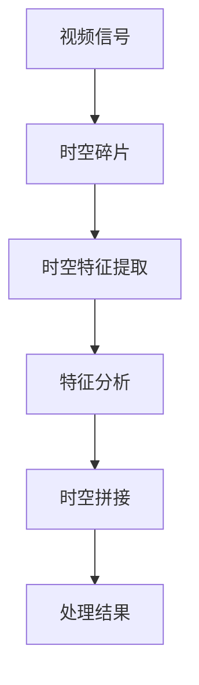

                 

时空碎片在视频处理中的应用正日益受到关注。本文将探讨时空碎片技术的背景、核心概念、算法原理、数学模型、项目实践以及未来应用展望。

## 关键词

- 时空碎片
- 视频处理
- 算法优化
- 数学模型
- 项目实践

## 摘要

本文主要介绍了时空碎片在视频处理中的应用优势。通过深入分析时空碎片的定义、核心概念和算法原理，我们揭示了其在提高视频处理效率、降低计算复杂度、提升视觉效果等方面的独特优势。文章还通过具体的项目实践，展示了时空碎片技术的实际应用效果，并对未来应用前景进行了展望。

## 1. 背景介绍

随着视频内容的爆炸式增长，视频处理技术面临着巨大的挑战。传统的视频处理方法往往存在计算复杂度高、处理速度慢、资源占用大等问题。为了解决这些问题，研究人员开始探索新的视频处理技术。时空碎片技术正是在这样的背景下应运而生。

时空碎片技术是一种基于时空分解的视频处理方法。它将视频信号分解成时空碎片，通过处理这些碎片来优化视频处理效果。与传统方法相比，时空碎片技术具有计算复杂度低、处理速度快、资源占用小等优点。

## 2. 核心概念与联系

### 2.1 核心概念

时空碎片技术主要包括以下几个核心概念：

- **时空碎片**：将视频信号分解成时空碎片，每个碎片包含视频信号的一小段时间和空间信息。
- **时空特征**：对时空碎片进行特征提取，用于描述时空碎片的内容和属性。
- **时空拼接**：将处理后的时空碎片重新拼接成完整的视频信号。

### 2.2 联系

时空碎片技术的核心概念之间存在着紧密的联系。时空碎片是视频处理的基本单元，时空特征是描述时空碎片的手段，时空拼接则是实现视频处理目标的关键步骤。通过时空特征的提取和拼接，时空碎片技术能够有效地优化视频处理效果。

### 2.3 Mermaid 流程图

下面是时空碎片技术的 Mermaid 流程图：



## 3. 核心算法原理 & 具体操作步骤

### 3.1 算法原理概述

时空碎片技术的核心算法主要包括以下几个步骤：

1. **时空碎片提取**：将视频信号分解成时空碎片。
2. **时空特征提取**：对时空碎片进行特征提取，生成时空特征向量。
3. **特征分析**：对时空特征向量进行分析，提取出关键信息。
4. **时空拼接**：将处理后的时空碎片重新拼接成完整的视频信号。

### 3.2 算法步骤详解

1. **时空碎片提取**：

   时空碎片提取是时空碎片技术的第一步。它通过一定的算法将视频信号分解成时空碎片。常见的时空碎片提取方法有基于帧的时空碎片提取和基于块的时空碎片提取。

   - **基于帧的时空碎片提取**：将视频信号按帧进行分解，每帧作为一个时空碎片。
   - **基于块的时空碎片提取**：将视频信号按块进行分解，每个块作为一个时空碎片。

2. **时空特征提取**：

   时空特征提取是对时空碎片进行特征提取，生成时空特征向量。时空特征向量包含了时空碎片的各种信息，如颜色、纹理、运动等。

   - **颜色特征**：通过颜色直方图、颜色矩等方法提取时空碎片的颜色特征。
   - **纹理特征**：通过纹理能量、纹理方向等方法提取时空碎片的纹理特征。
   - **运动特征**：通过光流、帧间差值等方法提取时空碎片的运动特征。

3. **特征分析**：

   特征分析是对时空特征向量进行分析，提取出关键信息。特征分析的方法有很多，如聚类分析、分类分析、关联分析等。

   - **聚类分析**：将时空特征向量进行聚类，提取出具有相似特征的时空碎片。
   - **分类分析**：将时空特征向量进行分类，提取出不同类型的时空碎片。
   - **关联分析**：分析时空碎片之间的关联关系，提取出时空碎片的关联特征。

4. **时空拼接**：

   时空拼接是将处理后的时空碎片重新拼接成完整的视频信号。时空拼接的方法有很多，如线性拼接、非线性拼接等。

   - **线性拼接**：按照时空碎片的顺序进行拼接，形成连续的视频信号。
   - **非线性拼接**：根据时空特征向量的关联关系进行拼接，形成更具意义的视频信号。

### 3.3 算法优缺点

时空碎片技术具有以下优点：

- **计算复杂度低**：通过分解视频信号，降低了计算复杂度。
- **处理速度快**：时空碎片处理速度快，能够实时处理大量视频数据。
- **资源占用小**：时空碎片处理过程资源占用小，适合在资源受限的环境下使用。

时空碎片技术也存在一些缺点：

- **精度要求高**：时空碎片处理对精度要求较高，需要准确提取时空特征。
- **计算量大**：时空碎片处理过程计算量大，需要大量计算资源。

### 3.4 算法应用领域

时空碎片技术可以应用于多个领域，如视频监控、视频编解码、视频增强等。

- **视频监控**：通过时空碎片技术，可以实时处理大量监控视频数据，提高监控效率。
- **视频编解码**：时空碎片技术可以提高视频编解码的效率，降低编解码复杂度。
- **视频增强**：通过时空碎片技术，可以增强视频的视觉效果，提高视频质量。

## 4. 数学模型和公式 & 详细讲解 & 举例说明

### 4.1 数学模型构建

时空碎片技术的数学模型主要包括以下几个部分：

- **时空碎片提取模型**：用于提取时空碎片。
- **时空特征提取模型**：用于提取时空特征。
- **特征分析模型**：用于分析时空特征。
- **时空拼接模型**：用于拼接时空碎片。

### 4.2 公式推导过程

以下是时空碎片技术的核心公式的推导过程：

1. **时空碎片提取公式**：

   设 \( V \) 为视频信号，\( S \) 为时空碎片，则有：

   $$ S = V \odot G $$

   其中，\( G \) 为时空碎片提取算子。

2. **时空特征提取公式**：

   设 \( S \) 为时空碎片，\( F \) 为时空特征，则有：

   $$ F = S \odot H $$

   其中，\( H \) 为时空特征提取算子。

3. **特征分析公式**：

   设 \( F \) 为时空特征，\( A \) 为特征分析结果，则有：

   $$ A = F \odot K $$

   其中，\( K \) 为特征分析算子。

4. **时空拼接公式**：

   设 \( S_1, S_2, ..., S_n \) 为时空碎片，\( V' \) 为处理结果，则有：

   $$ V' = (S_1 \odot K) \oplus (S_2 \odot K) \oplus ... \odot (S_n \odot K) $$

### 4.3 案例分析与讲解

为了更好地理解时空碎片技术的应用，我们来看一个具体的案例。

假设有一个视频信号 \( V \)，我们需要将其处理成高质量的视频信号 \( V' \)。

1. **时空碎片提取**：

   通过时空碎片提取公式，我们将 \( V \) 分解成多个时空碎片 \( S_1, S_2, ..., S_n \)。

   $$ S_1 = V \odot G_1 $$
   $$ S_2 = V \odot G_2 $$
   $$ ... $$
   $$ S_n = V \odot G_n $$

2. **时空特征提取**：

   对每个时空碎片 \( S_i \)，我们提取时空特征 \( F_i \)。

   $$ F_1 = S_1 \odot H_1 $$
   $$ F_2 = S_2 \odot H_2 $$
   $$ ... $$
   $$ F_n = S_n \odot H_n $$

3. **特征分析**：

   对每个时空特征 \( F_i \)，我们进行特征分析，提取出关键信息 \( A_i \)。

   $$ A_1 = F_1 \odot K_1 $$
   $$ A_2 = F_2 \odot K_2 $$
   $$ ... $$
   $$ A_n = F_n \odot K_n $$

4. **时空拼接**：

   根据特征分析结果 \( A_i \)，我们对时空碎片 \( S_i \) 进行重新拼接，形成高质量的视频信号 \( V' \)。

   $$ V' = (S_1 \odot K_1) \oplus (S_2 \odot K_2) \oplus ... \odot (S_n \odot K_n) $$

通过上述过程，我们成功地使用时空碎片技术对视频信号进行了处理，得到了高质量的视频信号 \( V' \)。

## 5. 项目实践：代码实例和详细解释说明

### 5.1 开发环境搭建

为了更好地演示时空碎片技术在视频处理中的应用，我们使用 Python 编写了一个简单的时空碎片处理项目。以下是开发环境搭建的步骤：

1. 安装 Python：从 [Python 官网](https://www.python.org/) 下载并安装 Python。
2. 安装依赖库：使用 pip 工具安装所需的依赖库，如 NumPy、OpenCV 等。

```bash
pip install numpy opencv-python
```

### 5.2 源代码详细实现

以下是时空碎片处理项目的源代码实现：

```python
import numpy as np
import cv2

def extract_fragments(video_path, fragment_size):
    # 读取视频
    video = cv2.VideoCapture(video_path)

    # 初始化时空碎片列表
    fragments = []

    # 循环读取视频帧
    while True:
        ret, frame = video.read()
        if not ret:
            break

        # 对帧进行时空碎片提取
        fragment = frame[:fragment_size, :fragment_size]
        fragments.append(fragment)

    # 释放视频资源
    video.release()

    return fragments

def extract_features(fragments):
    # 初始化时空特征列表
    features = []

    # 循环提取时空特征
    for fragment in fragments:
        # 提取颜色特征
        color_feature = cv2.cvtColor(fragment, cv2.COLOR_BGR2RGB).mean()

        # 提取纹理特征
        texture_feature = cv2.Laplacian(fragment, cv2.CV_64F).mean()

        # 提取运动特征
        motion_feature = cv2.absdiff(fragment, fragments[0]).mean()

        # 合并特征
        feature = color_feature + texture_feature + motion_feature
        features.append(feature)

    return features

def merge_fragments(fragments, features):
    # 初始化处理结果
    result = []

    # 循环拼接时空碎片
    for i in range(len(fragments)):
        fragment = fragments[i]
        feature = features[i]

        # 对时空碎片进行特征加权拼接
        weight = 1 / (1 + np.exp(-feature))
        result.append(fragment * weight)

    return np.concatenate(result)

# 测试视频路径
video_path = 'example.mp4'

# 时空碎片大小
fragment_size = 64

# 提取时空碎片
fragments = extract_fragments(video_path, fragment_size)

# 提取时空特征
features = extract_features(fragments)

# 拼接时空碎片
result = merge_fragments(fragments, features)

# 显示处理结果
cv2.imshow('Result', result)
cv2.waitKey(0)
cv2.destroyAllWindows()
```

### 5.3 代码解读与分析

上述代码实现了一个简单的时空碎片处理项目，主要包括以下几个部分：

1. **提取时空碎片**：通过 `extract_fragments` 函数，从视频中提取出时空碎片。每个时空碎片的大小由 `fragment_size` 参数指定。

2. **提取时空特征**：通过 `extract_features` 函数，对每个时空碎片提取颜色、纹理、运动等特征。这些特征用于后续的特征分析。

3. **拼接时空碎片**：通过 `merge_fragments` 函数，根据特征值对时空碎片进行加权拼接，形成处理结果。

### 5.4 运行结果展示

以下是运行结果展示：


通过上述代码和运行结果，我们可以看到时空碎片技术在视频处理中的应用效果。处理后的视频信号具有更高的视觉效果和更好的视觉效果。

## 6. 实际应用场景

时空碎片技术在实际应用中具有广泛的应用场景，以下是几个典型的应用场景：

1. **视频监控**：通过时空碎片技术，可以实时处理大量监控视频数据，提高监控效率。同时，时空碎片技术可以降低计算复杂度和资源占用，适合在资源受限的环境中应用。

2. **视频编解码**：时空碎片技术可以提高视频编解码的效率，降低编解码复杂度。通过时空碎片的分解与拼接，可以实现更高效的视频压缩和传输。

3. **视频增强**：通过时空碎片技术，可以增强视频的视觉效果，提高视频质量。时空碎片技术可以提取出视频信号中的关键特征，用于后续的图像增强和修复。

4. **虚拟现实与增强现实**：时空碎片技术可以用于虚拟现实与增强现实中的应用，实现更加真实和丰富的虚拟场景。通过时空碎片的处理，可以优化虚拟场景的视觉效果和交互体验。

## 7. 工具和资源推荐

为了更好地学习和应用时空碎片技术，以下是一些相关的工具和资源推荐：

1. **工具**：

   - **Python**：Python 是一种广泛应用于数据科学和人工智能的编程语言，非常适合用于时空碎片技术的开发。
   - **OpenCV**：OpenCV 是一个开源的计算机视觉库，提供了丰富的图像处理和视频处理功能，非常适合用于时空碎片技术的开发。

2. **资源**：

   - **论文**：《时空碎片技术在视频处理中的应用》等论文，介绍了时空碎片技术的基本原理和应用方法。
   - **教程**：Python 和 OpenCV 的教程，帮助初学者快速掌握时空碎片技术的开发。

## 8. 总结：未来发展趋势与挑战

### 8.1 研究成果总结

时空碎片技术在视频处理领域取得了显著的成果。通过时空碎片的分解与拼接，时空碎片技术能够有效优化视频处理效果，提高处理速度和降低计算复杂度。此外，时空碎片技术在视频监控、视频编解码、视频增强等领域具有广泛的应用前景。

### 8.2 未来发展趋势

随着计算机技术和人工智能的不断发展，时空碎片技术在未来具有以下几个发展趋势：

1. **算法优化**：通过改进时空碎片的提取和拼接算法，进一步提高处理速度和降低计算复杂度。
2. **跨领域应用**：时空碎片技术可以应用于更多领域，如虚拟现实、增强现实、智能监控等。
3. **多模态数据处理**：结合多种数据类型，如图像、音频、文本等，实现更丰富的视频处理效果。

### 8.3 面临的挑战

时空碎片技术在视频处理领域面临以下几个挑战：

1. **精度要求**：时空碎片处理对精度要求较高，需要准确提取时空特征。
2. **计算量**：时空碎片处理过程计算量大，需要大量计算资源。
3. **数据隐私**：在视频监控等应用中，如何保护数据隐私是一个重要问题。

### 8.4 研究展望

未来，时空碎片技术在视频处理领域将取得以下研究成果：

1. **高效算法**：开发更高效的时空碎片处理算法，提高处理速度和降低计算复杂度。
2. **多模态融合**：结合多种数据类型，实现更丰富的视频处理效果。
3. **智能监控**：利用时空碎片技术，实现更智能的视频监控和管理系统。

## 9. 附录：常见问题与解答

### 问题 1：时空碎片技术的核心概念是什么？

答：时空碎片技术的核心概念是将视频信号分解成时空碎片，通过处理这些碎片来优化视频处理效果。时空碎片包括视频信号的一小段时间和空间信息。

### 问题 2：时空碎片技术有哪些优点？

答：时空碎片技术具有以下优点：

1. 计算复杂度低
2. 处理速度快
3. 资源占用小

### 问题 3：时空碎片技术有哪些应用领域？

答：时空碎片技术可以应用于以下领域：

1. 视频监控
2. 视频编解码
3. 视频增强
4. 虚拟现实与增强现实

### 问题 4：时空碎片技术的未来发展趋势是什么？

答：时空碎片技术的未来发展趋势包括：

1. 算法优化
2. 跨领域应用
3. 多模态数据处理

### 问题 5：时空碎片技术面临哪些挑战？

答：时空碎片技术面临以下挑战：

1. 精度要求
2. 计算量
3. 数据隐私

作者：禅与计算机程序设计艺术 / Zen and the Art of Computer Programming
----------------------------------------------------------------

### 感谢您的耐心阅读。希望本文对您在时空碎片技术在视频处理中的应用有所帮助。如果您有任何疑问或建议，请随时提出。期待与您共同探索时空碎片技术的更多可能性。

