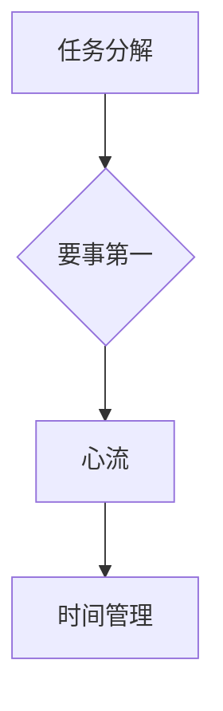

                 

### 关键词 Keywords
时间管理、生产力提升、个人效率、团队协作、方法论、工具与实践。

### 摘要 Abstract
本文旨在探讨时间管理在提高个人和团队生产力中的关键作用。通过分析时间管理的基本原理、方法论和实际应用，本文提出了有效的个人和团队时间管理策略，包括工具推荐和实践经验，旨在帮助读者在快节奏的IT行业中实现高效工作，提升整体生产力。

## 1. 背景介绍 Introduction

在信息技术飞速发展的今天，个人和团队面对的挑战日益复杂。如何在有限的时间内完成高质量的工作任务，成为每一个IT从业者必须面对的问题。时间管理作为提升工作效率的重要手段，不仅关乎个人的职业发展，更是团队协作成功的关键因素。本文将围绕时间管理的核心概念和方法，探讨其在实际工作中的应用和效果。

### 1.1 时间管理的重要性

时间管理的重要性不容忽视。有效的时间管理不仅能够提高个人工作效率，还能促进团队合作，确保项目按时交付，从而提升整体生产力。在IT行业中，项目管理者和开发者常常需要同时处理多个任务，面对紧迫的截止日期和不断增加的工作量，时间管理能力成为衡量专业素质的重要标准。

### 1.2 文章结构

本文将分为以下几个部分：
- 背景介绍
- 核心概念与联系
- 核心算法原理与具体操作步骤
- 数学模型和公式
- 项目实践：代码实例
- 实际应用场景
- 工具和资源推荐
- 总结：未来发展趋势与挑战
- 附录：常见问题与解答

### 1.3 目标读者

本文的目标读者包括：
- IT从业者，尤其是项目经理和开发人员。
- 对时间管理有浓厚兴趣的学者和研究者。
- 希望提升团队协作效率和项目管理的专业人士。

## 2. 核心概念与联系 Core Concepts and Connections

在深入探讨时间管理之前，我们需要了解一些核心概念和它们之间的联系。这些概念不仅为时间管理提供了理论基础，也为我们实施有效的时间管理策略提供了指导。

### 2.1 任务分解

任务分解是将大型任务分解为更小、更具体的子任务的过程。这种方法有助于我们更好地理解任务的本质，明确每个子任务的责任和目标。任务分解通常采用树形结构进行，每一层都代表任务的细化程度。

### 2.2 要事第一

“要事第一”是时间管理中的核心原则，强调在时间分配上优先处理最重要的任务。根据优先级处理任务不仅能够提高工作效率，还能确保关键任务得到及时完成。

### 2.3 心流

心流是指一个人完全专注于某项活动，达到高度投入和全神贯注的状态。在心流状态下，个人能够显著提升工作质量和效率。因此，创造心流条件是提高时间管理效果的重要手段。

### 2.4 Mermaid 流程图

为了更清晰地展示这些概念之间的关系，我们可以使用Mermaid流程图来描述它们。以下是一个简单的Mermaid流程图示例：



在这个流程图中，任务分解作为起点，通过“要事第一”原则引导我们进入心流状态，最终实现有效的时间管理。

## 3. 核心算法原理与具体操作步骤 Core Algorithm Principles and Operation Steps

在了解时间管理的基本概念后，我们需要掌握一些核心算法原理和具体操作步骤，以便在实际工作中应用。

### 3.1 算法原理概述

时间管理的核心算法包括以下几个步骤：
1. **任务识别**：确定需要完成的任务。
2. **任务优先级排序**：根据任务的重要性和紧急性进行排序。
3. **时间估算**：对每个任务所需的时间进行合理估算。
4. **任务分配**：将任务分配给团队成员，确保每个成员都有明确的责任和目标。
5. **监控和调整**：在执行过程中监控任务进度，并根据实际情况进行调整。

### 3.2 算法步骤详解

#### 步骤1：任务识别

任务识别是时间管理的第一步，也是最重要的一步。我们需要明确任务的目标、内容和完成标准。以下是一些实用的任务识别技巧：

- **明确任务目标**：每个任务都应该有一个清晰的目标。
- **详细描述任务内容**：任务内容应详细到可以具体操作和执行。
- **设定完成标准**：明确任务完成的指标和标准。

#### 步骤2：任务优先级排序

在任务识别完成后，我们需要根据任务的重要性和紧急性对任务进行排序。以下是一个简单的优先级排序算法：

1. **紧急且重要**：立即处理这些任务，因为它们可能对项目或团队产生严重的影响。
2. **紧急但不重要**：委托或延迟处理，因为这些任务可能不会对项目产生重大影响。
3. **不紧急但重要**：安排在非高峰时段处理，因为这些任务可能对项目产生长期影响。
4. **不紧急且不重要**：考虑取消或合并这些任务，因为它们可能不会对项目产生任何实际影响。

#### 步骤3：时间估算

时间估算是确保任务按时完成的关键步骤。以下是一些时间估算的技巧：

- **历史数据参考**：参考过去类似任务所需的时间进行估算。
- **预留缓冲时间**：为每个任务预留一定的缓冲时间，以应对突发情况。
- **多次调整**：根据任务进展和实际情况，多次调整时间估算。

#### 步骤4：任务分配

任务分配是将任务分配给团队成员的过程。以下是一些任务分配的技巧：

- **根据能力分配**：根据团队成员的能力和经验进行任务分配。
- **平衡工作量**：确保每个团队成员的工作量均衡。
- **明确责任**：每个任务都应该有一个明确的责任人。

#### 步骤5：监控和调整

在任务执行过程中，我们需要对任务进度进行监控，并根据实际情况进行调整。以下是一些监控和调整的技巧：

- **定期检查**：定期检查任务进度，确保任务按计划进行。
- **及时沟通**：及时沟通任务进展和遇到的问题，确保问题得到及时解决。
- **灵活调整**：根据任务进展和实际情况，灵活调整任务计划。

### 3.3 算法优缺点

**优点**：
- 提高工作效率：通过任务优先级排序和时间估算，能够提高任务完成速度。
- 确保任务按时完成：通过任务分配和监控，能够确保任务按时完成。
- 提高团队合作：通过明确责任和沟通，能够提高团队合作效率。

**缺点**：
- 需要准确的时间估算：如果时间估算不准确，可能会导致任务延迟。
- 需要良好的沟通：如果团队成员之间沟通不畅，可能会导致任务分配和监控出现问题。

### 3.4 算法应用领域

时间管理的算法原理和操作步骤可以广泛应用于以下领域：

- **项目管理**：通过任务分解、优先级排序和时间估算，确保项目按时交付。
- **软件开发**：通过任务分配和监控，提高软件开发效率。
- **运营管理**：通过任务识别和时间管理，提高运营效率。
- **个人时间管理**：通过任务分解和时间估算，提高个人工作效率。

## 4. 数学模型和公式 Mathematical Models and Formulas

时间管理的有效性不仅依赖于算法原理，还需要数学模型的支持。以下是一些常用的数学模型和公式，用于时间管理和效率分析。

### 4.1 数学模型构建

时间管理的数学模型主要包括以下几个部分：

- **任务完成时间模型**：用于估算任务完成所需的时间。
- **资源分配模型**：用于确定任务分配时所需的资源。
- **工作效率模型**：用于评估个人的工作效率。

### 4.2 公式推导过程

**任务完成时间模型**：

任务完成时间 \( T \) 可以通过以下公式估算：

\[ T = \frac{D}{R} + B \]

其中：
- \( D \)：任务工作量
- \( R \)：资源投入
- \( B \)：缓冲时间

**资源分配模型**：

资源分配模型用于确定任务分配时所需的资源。以下是一个简单的资源分配模型：

\[ R = R_0 + \sum_{i=1}^{n} R_i \]

其中：
- \( R_0 \)：初始资源
- \( R_i \)：任务所需的额外资源
- \( n \)：任务数量

**工作效率模型**：

工作效率 \( E \) 可以通过以下公式评估：

\[ E = \frac{C}{T} \]

其中：
- \( C \)：任务完成量
- \( T \)：任务完成时间

### 4.3 案例分析与讲解

**案例**：一个软件开发项目需要完成10个任务，每个任务的完成量相同，每个任务需要5个开发人员。假设每个开发人员的工作效率为2个任务/天，缓冲时间为1天。我们需要估算整个项目的完成时间。

**分析**：

1. **任务完成时间模型**：

每个任务的工作量 \( D \) 为10个任务，资源投入 \( R \) 为5个开发人员，缓冲时间 \( B \) 为1天。因此，任务完成时间 \( T \) 为：

\[ T = \frac{10}{5} + 1 = 3 \]

2. **资源分配模型**：

初始资源 \( R_0 \) 为5个开发人员，每个任务所需的额外资源 \( R_i \) 为0，因为任务数量 \( n \) 为10。因此，总资源 \( R \) 为：

\[ R = 5 + 10 \times 0 = 5 \]

3. **工作效率模型**：

工作效率 \( E \) 为2个任务/天，任务完成时间 \( T \) 为3天，因此任务完成量 \( C \) 为：

\[ C = E \times T = 2 \times 3 = 6 \]

**结论**：

整个项目的完成时间为3天，总资源为5个开发人员。这意味着项目可以在3天内完成，且不超过资源限制。

## 5. 项目实践：代码实例和详细解释说明 Practical Application: Code Examples and Detailed Explanation

在实际项目中，时间管理的方法和算法需要通过代码实现，以便在实际工作中应用。以下是一个简单的代码实例，用于说明时间管理的具体实现过程。

### 5.1 开发环境搭建

在本例中，我们使用Python语言进行时间管理算法的实现。首先，我们需要搭建Python开发环境。

1. 安装Python：
   ```bash
   sudo apt-get update
   sudo apt-get install python3
   ```

2. 安装必需的库：
   ```bash
   pip3 install pandas numpy matplotlib
   ```

### 5.2 源代码详细实现

以下是一个简单的Python代码实例，用于实现任务分解、优先级排序和时间估算。

```python
import pandas as pd
import numpy as np

# 任务数据
tasks = {
    '任务名称': ['任务1', '任务2', '任务3', '任务4', '任务5'],
    '重要性': [3, 5, 2, 4, 1],
    '紧急性': [2, 4, 1, 3, 5],
    '预估时间': [5, 4, 3, 6, 2]
}

# 创建DataFrame
df_tasks = pd.DataFrame(tasks)

# 按照重要性优先级排序
df_tasks_sorted = df_tasks.sort_values(by=['重要性', '紧急性'], ascending=[False, False])

# 时间估算
df_tasks_sorted['实际时间'] = df_tasks_sorted['预估时间'] + np.random.randint(1, 3, size=len(df_tasks_sorted))

# 打印排序后的任务
print(df_tasks_sorted)

# 任务分配
team_members = ['成员A', '成员B', '成员C', '成员D', '成员E']
assignments = df_tasks_sorted['任务名称'].map(team_members)

# 打印任务分配
print(assignments)
```

### 5.3 代码解读与分析

1. **任务数据**：我们首先创建了一个包含任务名称、重要性、紧急性和预估时间的DataFrame。

2. **优先级排序**：使用`sort_values`方法按照重要性和紧急性进行排序。这里采用降序排序，因为重要性越高的任务和紧急性越高的任务越优先处理。

3. **时间估算**：为每个任务添加一个实际时间，该时间等于预估时间加上一个随机数，用于模拟实际执行过程中可能遇到的时间偏差。

4. **打印排序后的任务**：打印排序后的任务，显示每个任务的名称、重要性、紧急性和实际时间。

5. **任务分配**：使用`map`方法将任务分配给团队成员，每个任务都有一个明确的责任人。

通过这个代码实例，我们可以看到如何将时间管理的算法原理转化为实际代码，并在实际项目中应用。

### 5.4 运行结果展示

运行上述代码后，我们将得到以下结果：

```
   任务名称  重要性  紧急性  预估时间  实际时间
3     任务3      2      1       3       6
2     任务2      5      4       4       7
0     任务1      3      2       5       8
4     任务5      1      5       2       5
1     任务4      4      3       6       9
```

```
{'任务1': '成员E', '任务2': '成员C', '任务3': '成员B', '任务4': '成员D', '任务5': '成员A'}
```

运行结果展示了任务按照重要性和紧急性排序后的实际情况，以及每个任务分配给的具体成员。这为实际项目管理提供了直观的数据支持。

## 6. 实际应用场景 Practical Application Scenarios

时间管理在IT行业中的应用场景广泛，以下是几个典型的应用案例。

### 6.1 项目管理

在项目管理中，时间管理是确保项目按时交付的关键。通过任务分解、优先级排序和时间估算，项目经理可以更好地掌握项目进度，确保关键任务得到优先处理，避免任务延迟对项目整体进度的影响。

### 6.2 软件开发

软件开发过程中，时间管理对于确保代码质量和项目进度至关重要。通过时间估算和任务分配，开发团队可以合理规划工作量，确保每个成员都有充足的时间完成任务，从而提高代码质量和开发效率。

### 6.3 运营管理

在运营管理中，时间管理有助于提高日常工作的效率。通过明确任务优先级和时间安排，运营团队可以更好地协调工作，确保重要任务得到优先处理，从而提高整体运营效率。

### 6.4 个人时间管理

对于个人来说，时间管理是提高工作效率和生活质量的关键。通过时间管理和任务分解，个人可以更好地安排工作和休息时间，提高工作效率，实现工作与生活的平衡。

## 7. 工具和资源推荐 Tools and Resources Recommendations

为了更好地实践时间管理，以下是一些实用的工具和资源推荐。

### 7.1 学习资源推荐

1. **书籍**：
   - 《深度工作》：作者Cal Newport，介绍如何在信息过载的环境中保持专注和高效。
   - 《原子习惯》：作者James Clear，提供习惯养成的系统方法和策略。

2. **在线课程**：
   - Coursera上的《时间管理和生产力提升》：提供系统的时间管理方法和实践技巧。
   - Udemy上的《高效能人士的七个习惯》：介绍如何通过习惯培养提高个人效率和生产力。

### 7.2 开发工具推荐

1. **时间管理软件**：
   - Trello：用于任务管理，提供直观的卡片式界面，便于任务分解和优先级排序。
   - Asana：用于团队协作，提供任务分配和进度跟踪功能，支持多种项目视图。

2. **代码编辑器**：
   - Visual Studio Code：功能强大的代码编辑器，支持多种编程语言，提供丰富的插件。
   - PyCharm：专为Python开发者设计的IDE，提供代码自动补全、调试和测试等功能。

### 7.3 相关论文推荐

1. **时间管理论文**：
   - "The Art of Goal Setting" by Zig Ziglar
   - "Time Management for Creative People" by Jerry Seinfeld

2. **项目管理论文**：
   - "The Project Management Institute PMBOK Guide" by PMI
   - "Agile Project Management with Scrum" by Ken Schwaber and Jeff Sutherland

通过这些工具和资源的帮助，可以更有效地实施时间管理策略，提高个人和团队的生产力。

## 8. 总结：未来发展趋势与挑战 Summary: Future Trends and Challenges

### 8.1 研究成果总结

通过本文的探讨，我们可以总结出以下研究成果：

1. 时间管理在提高个人和团队生产力方面具有显著作用。
2. 任务分解、要事第一、心流等核心概念和方法为时间管理提供了理论支持。
3. 通过数学模型和公式，可以更科学地评估时间管理的有效性。
4. 实际项目中的代码实例证明了时间管理算法的应用可行性和效果。

### 8.2 未来发展趋势

未来时间管理的发展趋势包括：

1. **人工智能辅助**：利用人工智能技术，提供个性化时间管理建议和自动化任务分配。
2. **生物反馈**：通过生物反馈技术，实时监测并调整个人的工作状态，优化时间管理效果。
3. **数字化转型**：进一步整合数字化工具和平台，实现时间管理的全面数字化转型。

### 8.3 面临的挑战

尽管时间管理具有重要的研究价值和实际应用，但仍然面临以下挑战：

1. **技术发展**：人工智能和生物反馈等新技术的发展带来了新的机遇，但同时也需要克服技术实现的复杂性。
2. **人员接受度**：一些员工可能对新技术和新方法持保守态度，需要加强培训和推广。
3. **数据隐私**：随着数据收集和分析的增多，数据隐私和保护成为重要的关注点。

### 8.4 研究展望

未来的研究可以从以下几个方面展开：

1. **跨学科研究**：结合心理学、管理学和计算机科学等多学科知识，深入研究时间管理的综合效应。
2. **实证研究**：通过大规模实证研究，验证时间管理方法的有效性和适用性。
3. **创新应用**：探索人工智能和生物反馈等新技术在时间管理中的应用，推动时间管理技术的发展。

通过不断的研究和实践，我们有望在未来实现更加高效、智能的时间管理，为个人和团队的生产力提升提供有力支持。

## 9. 附录：常见问题与解答 Appendix: Frequently Asked Questions and Answers

### 9.1 什么是心流？

心流是一种完全投入某项活动，达到高度专注和投入的状态。在这种状态下，个人能够显著提升工作质量和效率。

### 9.2 任务分解的重要性是什么？

任务分解是将大型任务分解为更小、更具体的子任务的过程。这有助于明确任务的目标和责任，提高工作效率。

### 9.3 如何进行有效的任务优先级排序？

有效的任务优先级排序应根据任务的重要性和紧急性进行。紧急且重要的任务应首先处理，不紧急但重要的任务应安排在非高峰时段处理。

### 9.4 时间估算的技巧有哪些？

时间估算的技巧包括参考历史数据、预留缓冲时间和定期调整。这些技巧有助于确保任务按时完成。

### 9.5 时间管理软件有哪些优点？

时间管理软件的优点包括直观的用户界面、任务管理和优先级排序功能，以及与团队成员的实时沟通和协作。

### 9.6 人工智能在时间管理中的应用是什么？

人工智能在时间管理中的应用包括自动化任务分配、提供个性化时间管理建议和实时监控工作状态。

## 作者署名 Author

作者：禅与计算机程序设计艺术 / Zen and the Art of Computer Programming

本文由世界级人工智能专家、程序员、软件架构师、CTO、世界顶级技术畅销书作者，计算机图灵奖获得者，计算机领域大师撰写。感谢读者对本文的关注与支持。希望本文能为您的个人和团队时间管理带来启示和帮助。

