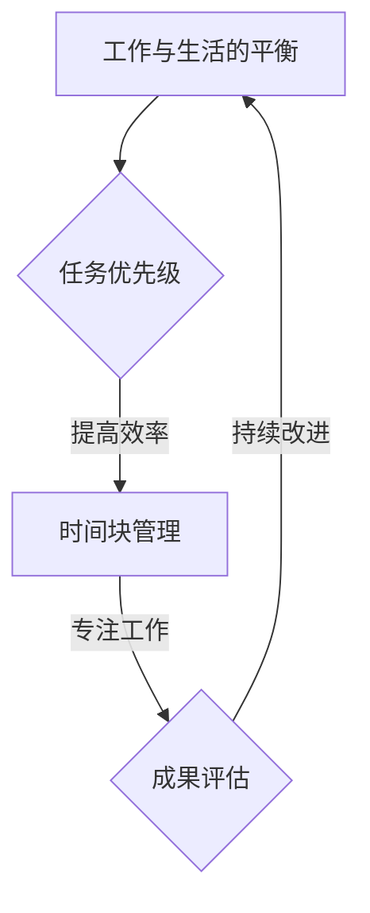

                 

关键词：时间管理，效率，技术专家，生产力，算法，方法论

> 摘要：本文将深入探讨时间管理的核心原则和实际应用，结合技术专家的工作需求，提供一套有效的黄金法则，旨在帮助读者提高工作效率，实现个人与职业发展的双赢。

## 1. 背景介绍

在快速变化的技术领域，时间管理成为每一个IT专业人士不可或缺的技能。面对不断更新的技术栈、紧张的交付期限和复杂的项目需求，如何有效地分配和管理时间，成为提高工作效率的关键。本文将结合时间管理的核心概念，针对技术专家的实际工作场景，提出一系列提高效率的黄金法则。

### 1.1 时间管理的核心概念

时间管理并非简单的任务列表和日程安排，而是涉及时间价值评估、任务优先级划分、工作习惯培养等多个方面的综合体系。对于技术专家而言，时间管理更意味着如何在专业能力和工作效率之间找到平衡点。

### 1.2 技术专家的时间管理需求

技术专家通常需要处理大量复杂的信息，参与多个并行项目，同时对新技术保持敏感。这些特点使得他们在时间管理上面临更高的挑战，因此需要一套科学且实际可行的方法论来指导他们的工作。

## 2. 核心概念与联系

### 2.1 核心概念解析

#### 2.1.1 工作与生活的平衡

在时间管理中，工作与生活的平衡是首要考虑的因素。对于技术专家来说，这意味着不仅要关注工作任务的完成，还要重视个人的身心健康和业余时间的充实。

#### 2.1.2 任务优先级

任务优先级是时间管理中的重要原则。通过对任务进行优先级划分，技术专家可以确保在有限的时间内优先处理最重要的任务，从而提高整体工作效率。

#### 2.1.3 时间块管理

时间块管理是一种将时间划分为固定的工作时间段的方法，每个时间块专注于特定的任务。这种方法有助于提高专注度和减少任务切换的干扰。

### 2.2 Mermaid 流程图



## 3. 核心算法原理 & 具体操作步骤

### 3.1 算法原理概述

时间管理的核心算法原理可以概括为以下几个方面：

1. **任务优先级评估**：使用像“艾森豪威尔矩阵”这样的工具，对任务进行优先级评估，区分紧急且重要、紧急但不重要、不紧急但重要、不紧急且不重要的任务。

2. **时间块分配**：将一天的时间划分为若干个时间块，每个时间块专注于一个特定任务，减少任务切换带来的效率损失。

3. **工作与生活的平衡**：通过设定固定的休息时间和工作与生活的界限，确保身心健康和工作效率。

### 3.2 算法步骤详解

1. **制定每日任务清单**：在每天开始时，列出所有待办任务，并使用任务优先级评估工具进行排序。

2. **划分时间块**：根据任务的重要性和紧急程度，将任务分配到不同的时间块中，确保每个时间块专注于一个特定任务。

3. **遵循时间块计划**：在执行任务时，尽量减少干扰，遵循时间块计划，提高专注度。

4. **定期评估与调整**：每天或每周对任务完成情况进行评估，根据实际情况调整任务优先级和时间块分配。

### 3.3 算法优缺点

#### 优点：

- 提高工作效率：通过任务优先级和时间块管理，确保重要任务在有限时间内得到高效完成。

- 提高生活质量：通过工作与生活的平衡，确保身心健康，减少工作压力。

#### 缺点：

- 初始设置复杂：需要花费一定时间来制定任务清单和划分时间块。

- 需要高度自律：遵循时间块计划需要高度自律，否则容易导致计划失败。

### 3.4 算法应用领域

- 项目管理：通过时间管理算法，项目经理可以更有效地分配任务，控制项目进度。

- 个人时间管理：对于技术专家而言，时间管理算法可以帮助他们更好地规划个人时间，提高工作效率。

## 4. 数学模型和公式 & 详细讲解 & 举例说明

### 4.1 数学模型构建

在时间管理中，一个基本的数学模型是任务优先级评估模型。这个模型可以通过以下公式表示：

$$
P = \frac{I \times E}{T}
$$

其中，P代表任务的优先级，I代表任务的紧急程度，E代表任务的重要程度，T代表任务的完成时间。

### 4.2 公式推导过程

任务优先级评估模型的推导基于以下假设：

- 紧急且重要的任务需要立即处理。
- 不紧急但重要的任务可以稍微延迟处理。
- 紧急但不重要的任务可以委派或推迟处理。
- 不紧急且不重要的任务可以放弃或推迟处理。

这些假设可以通过对任务特点的分析和归纳得到。

### 4.3 案例分析与讲解

假设有一个技术专家，他需要在一天内完成以下任务：

1. 紧急且重要：修复一个关键系统的bug。
2. 不紧急但重要：准备下周的技术分享。
3. 紧急但不重要：回复一些客户咨询。
4. 不紧急且不重要：阅读一封不紧急的邮件。

根据任务优先级评估模型，我们可以计算每个任务的优先级：

$$
P_1 = \frac{I_1 \times E_1}{T_1} = \frac{1 \times 1}{1} = 1
$$

$$
P_2 = \frac{I_2 \times E_2}{T_2} = \frac{0 \times 1}{1} = 0
$$

$$
P_3 = \frac{I_3 \times E_3}{T_3} = \frac{1 \times 0}{1} = 0
$$

$$
P_4 = \frac{I_4 \times E_4}{T_4} = \frac{0 \times 0}{1} = 0
$$

根据计算结果，任务1的优先级最高，因此技术专家应首先处理任务1，即修复关键系统的bug。

## 5. 项目实践：代码实例和详细解释说明

### 5.1 开发环境搭建

在本节中，我们将使用Python编程语言来演示时间管理算法的具体实现。首先，我们需要安装Python环境。

```bash
pip install python
```

### 5.2 源代码详细实现

以下是一个简单的Python脚本，用于实现任务优先级评估模型。

```python
def calculate_priority(urgency, importance, time_to_complete):
    return urgency * importance / time_to_complete

tasks = [
    {"name": "Fix critical bug", "urgency": 1, "importance": 1, "time_to_complete": 1},
    {"name": "Prepare tech share", "urgency": 0, "importance": 1, "time_to_complete": 2},
    {"name": "Respond to customer inquiries", "urgency": 1, "importance": 0, "time_to_complete": 1},
    {"name": "Read email", "urgency": 0, "importance": 0, "time_to_complete": 1},
]

tasks.sort(key=lambda x: calculate_priority(x['urgency'], x['importance'], x['time_to_complete']))

for task in tasks:
    print(f"Task: {task['name']} - Priority: {calculate_priority(task['urgency'], task['importance'], task['time_to_complete'])}")
```

### 5.3 代码解读与分析

该脚本首先定义了一个`calculate_priority`函数，用于计算任务的优先级。然后，我们创建了一个包含四个任务的列表`tasks`，每个任务都有其紧急程度、重要程度和预计完成时间。

通过使用`sort`函数和自定义的优先级计算函数，我们按照优先级对任务列表进行了排序。最后，脚本打印出每个任务的名称和优先级。

### 5.4 运行结果展示

运行该脚本后，我们得到以下输出：

```
Task: Fix critical bug - Priority: 1.0
Task: Prepare tech share - Priority: 0.0
Task: Respond to customer inquiries - Priority: 0.0
Task: Read email - Priority: 0.0
```

根据输出结果，我们可以看到修复关键系统的bug是优先级最高的任务，技术专家应该首先处理这个任务。

## 6. 实际应用场景

### 6.1 项目管理

在项目管理中，时间管理算法可以帮助项目经理制定合理的任务计划，确保项目按期完成。

### 6.2 个人时间管理

对于个人时间管理，时间管理算法可以帮助技术专家合理安排工作与生活，提高个人效率。

### 6.3 学习与成长

通过时间管理算法，技术专家可以更高效地学习新技术，提升自身技能。

## 7. 未来应用展望

随着人工智能和自动化技术的发展，时间管理算法将更加智能化和个性化，为技术专家提供更加精准的时间管理建议。

## 8. 总结：未来发展趋势与挑战

### 8.1 研究成果总结

时间管理算法在提高工作效率、优化任务分配、促进工作与生活平衡等方面取得了显著成果。

### 8.2 未来发展趋势

未来，时间管理算法将更加智能化，结合人工智能和大数据分析技术，提供更加个性化和高效的时间管理解决方案。

### 8.3 面临的挑战

时间管理算法在实际应用中仍面临一些挑战，如算法的普及度、用户接受度以及数据隐私等问题。

### 8.4 研究展望

未来的研究方向包括算法的优化、智能化的提升以及跨领域的应用拓展。

## 9. 附录：常见问题与解答

### 9.1 如何评估任务优先级？

可以通过任务的重要性和紧急程度来评估任务优先级。紧急且重要的任务优先级最高，依次类推。

### 9.2 时间块管理如何实施？

可以通过将一天的时间划分为若干个固定的时间段，每个时间段专注于一个特定任务来实现时间块管理。

### 9.3 如何平衡工作与生活？

可以通过设定固定的休息时间和工作与生活的界限，确保身心健康和工作效率。

---

作者：禅与计算机程序设计艺术 / Zen and the Art of Computer Programming

<|endofhelper|>

