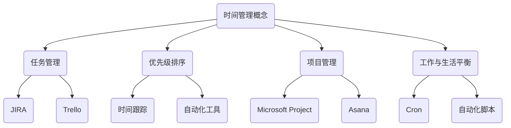

                 

关键词：时间管理，高效，利用，技术，方法，工具，策略

> 摘要：本文将探讨时间管理的核心概念和方法，结合IT领域的特点，提出一系列实用的技术策略和工具，帮助读者提升时间管理能力，提高工作效率。

## 1. 背景介绍

时间管理是一个广泛而深刻的领域，涉及如何合理安排和利用时间，以实现个人和组织的最大效益。在IT行业，时间管理尤为重要，因为技术行业的工作往往涉及复杂的项目管理、开发任务以及快速迭代的开发周期。

随着信息技术的发展，人们面临的工作任务越来越复杂，时间管理成为一项基本技能。不善于管理时间可能会导致工作效率低下、项目延误、工作压力增大等问题。因此，掌握有效的时间管理策略对于IT从业者来说至关重要。

本文将围绕以下几个核心问题展开讨论：

- 什么是时间管理？
- 时间管理在IT领域的重要性是什么？
- 如何使用技术工具来辅助时间管理？
- 高效的时间管理策略和实践是怎样的？
- 未来时间管理的发展趋势和挑战是什么？

通过本文的探讨，希望能够为读者提供有价值的见解和实践指导，帮助他们在快速发展的IT行业中更好地利用时间，提升工作效率。

## 2. 核心概念与联系

### 时间管理概念

时间管理是指通过规划、组织、优先排序和监控时间，以提高个人或团队工作效率的过程。其主要目标是确保任务的顺利完成，同时平衡工作与生活的需求。

### 时间管理在IT领域的重要性

在IT领域，时间管理的重要性体现在以下几个方面：

- **项目管理**：IT项目通常涉及多个阶段和多个任务，时间管理能够确保项目按时交付。
- **任务优先级**：在快速迭代的开发环境中，明确任务的优先级能够提高工作效率。
- **团队合作**：良好的时间管理有助于团队成员之间的协调，减少沟通成本。
- **工作与生活平衡**：有效的时间管理能够帮助IT从业者更好地平衡工作与生活，减少工作压力。

### 时间管理技术与工具

为了更好地进行时间管理，IT领域引入了多种技术和工具，包括：

- **任务管理工具**：如JIRA、Trello等，用于任务分配和进度跟踪。
- **时间跟踪工具**：如Toggl、RescueTime等，用于记录和分析工作时间。
- **项目管理工具**：如Microsoft Project、Asana等，用于项目规划和资源管理。
- **自动化工具**：如Cron、自动化脚本等，用于简化重复性任务。

### Mermaid 流程图

以下是时间管理在IT领域应用的一个简化的Mermaid流程图，展示时间管理概念、技术和工具之间的联系：



通过上述流程图，我们可以看到时间管理在IT领域中的应用是如何通过一系列工具和技术实现的。接下来，我们将深入探讨时间管理的技术细节和实践步骤。

## 3. 核心算法原理 & 具体操作步骤

### 3.1 算法原理概述

时间管理本质上是一种决策过程，涉及如何最优地安排任务和活动。核心算法主要包括任务优先级排序和资源分配。

#### 任务优先级排序

任务优先级排序是一种基于任务重要性和紧急性的方法。常用的算法包括：

- **Eisenhower矩阵**：根据任务的重要性和紧急性将任务分为四个象限，分别采取不同的策略。
- **Deadline优先法**：根据任务截止日期来排序，确保重要且紧急的任务优先完成。

#### 资源分配

资源分配则涉及如何合理分配时间、人力和资金等资源。常见的算法包括：

- **最小化完成时间**：通过优化任务执行顺序，最小化整个项目的完成时间。
- **最大化资源利用率**：确保资源得到最大化利用，避免资源闲置。

### 3.2 算法步骤详解

#### 3.2.1 任务优先级排序步骤

1. 收集任务列表，包括任务名称、重要性、紧急性。
2. 使用Eisenhower矩阵将任务分为四个象限。
3. 对于每个象限，制定具体的完成策略。
    - 紧急且重要：立即处理。
    - 重要但不紧急：安排时间进行处理。
    - 紧急但不重要：委托他人处理或简化任务。
    - 不紧急且不重要：删除或简化任务。

#### 3.2.2 资源分配步骤

1. 收集所有可用资源，包括时间、人力、资金。
2. 确定任务所需资源。
3. 使用最小完成时间算法，优化任务执行顺序。
4. 调整资源分配，确保关键任务有足够的资源支持。

### 3.3 算法优缺点

#### 优缺点

- **Eisenhower矩阵**
    - 优点：简单直观，能够快速识别任务优先级。
    - 缺点：没有考虑任务之间的依赖关系，可能导致任务之间的冲突。
- **最小化完成时间算法**
    - 优点：优化任务执行顺序，最小化项目完成时间。
    - 缺点：可能忽略任务的重要性和紧急性，导致关键任务延迟。

### 3.4 算法应用领域

- **项目管理**：在项目管理中，使用时间管理算法可以帮助项目经理更好地安排任务和资源，确保项目按时交付。
- **软件开发**：在软件开发过程中，时间管理算法可以帮助开发团队优化开发流程，提高代码质量。
- **个人时间管理**：对于个人时间管理，这些算法可以帮助个人更好地规划时间，提高工作效率。

通过上述算法的运用，我们可以更好地进行时间管理，提高工作效率。接下来，我们将进一步探讨数学模型和公式，以提供更深入的理论基础。

## 4. 数学模型和公式 & 详细讲解 & 举例说明

### 4.1 数学模型构建

时间管理中的数学模型主要涉及优化和调度问题，包括任务分配、资源调度和路径规划等。以下是一个简化的任务调度模型：

#### 任务调度模型

给定N个任务和M种资源，任务i的完成需要资源r_j，每个资源r_j的可用量为C_j。目标是最小化总完成时间。

数学模型如下：

$$
\min \sum_{i=1}^{N} t_i
$$

其中，$t_i$ 表示任务i的完成时间。

约束条件：

$$
\sum_{j=1}^{M} r_{ij} \cdot x_{ij} \leq C_j \quad \forall j
$$

$$
x_{ij} \in \{0,1\} \quad \forall i,j
$$

其中，$r_{ij}$ 表示任务i需要资源r_j的数量，$x_{ij}$ 表示任务i是否使用资源r_j（0表示不使用，1表示使用）。

### 4.2 公式推导过程

#### 任务调度模型推导

1. **任务分解**：将每个任务分解为多个子任务，每个子任务需要特定的资源。
2. **资源需求**：确定每个子任务所需的资源数量，并计算总资源需求。
3. **资源分配**：根据资源需求和资源可用量，分配资源给每个子任务，确保资源不会超限。
4. **时间估算**：为每个子任务估算完成时间，并累加得到总完成时间。

#### 公式推导

基于上述步骤，我们可以得到以下公式：

$$
t_i = \sum_{j=1}^{M} r_{ij} \cdot t_{ij}
$$

其中，$t_{ij}$ 表示子任务j的完成时间。

$$
\min \sum_{i=1}^{N} t_i = \min \sum_{i=1}^{N} \sum_{j=1}^{M} r_{ij} \cdot t_{ij}
$$

### 4.3 案例分析与讲解

#### 案例背景

一个软件开发团队需要完成一个项目，项目包括5个主要任务（T1到T5），每个任务需要不同的资源（R1到R5）。资源的可用量分别为C1=10，C2=15，C3=20，C4=30，C5=40。每个任务的子任务和所需资源如下表所示：

| 任务 | 子任务 | 资源需求 | 完成时间 |
|------|--------|-----------|----------|
| T1   | T11    | R1=2, R2=1 | 5        |
| T1   | T12    | R1=2, R2=1 | 5        |
| T2   | T21    | R2=3, R3=1 | 4        |
| T2   | T22    | R2=3, R3=1 | 4        |
| T3   | T31    | R3=1, R4=2 | 3        |
| T3   | T32    | R3=1, R4=2 | 3        |
| T4   | T41    | R4=1, R5=3 | 6        |
| T4   | T42    | R4=1, R5=3 | 6        |
| T5   | T51    | R1=2, R5=3 | 7        |
| T5   | T52    | R1=2, R5=3 | 7        |

#### 解题步骤

1. **任务分解**：将每个任务分解为子任务，并记录子任务的资源需求和完成时间。
2. **资源分配**：根据子任务的资源需求，尝试分配资源，确保资源不超过可用量。
3. **时间估算**：为每个子任务估算完成时间，并累加得到总完成时间。

#### 计算过程

1. **任务T1**：子任务T11和T12的资源需求相同，可以同时进行。总时间$t_1 = 5 + 5 = 10$。
2. **任务T2**：子任务T21和T22的资源需求相同，可以同时进行。总时间$t_2 = 4 + 4 = 8$。
3. **任务T3**：子任务T31和T32的资源需求相同，可以同时进行。总时间$t_3 = 3 + 3 = 6$。
4. **任务T4**：子任务T41和T42的资源需求相同，可以同时进行。总时间$t_4 = 6 + 6 = 12$。
5. **任务T5**：子任务T51和T52的资源需求相同，可以同时进行。总时间$t_5 = 7 + 7 = 14$。

总完成时间：

$$
\min \sum_{i=1}^{5} t_i = \min (10 + 8 + 6 + 12 + 14) = \min (50)
$$

#### 结果分析

通过上述计算，我们可以看到，该任务调度的总完成时间为50。为了进一步优化时间，可以考虑资源的更灵活分配和任务的并行执行。例如，可以在任务T1和T2之间插入任务T3，以减少等待时间。

通过上述案例，我们可以看到如何使用数学模型和公式来构建时间管理模型，并通过具体步骤进行资源分配和时间估算。接下来，我们将通过项目实践，展示如何在实际开发中应用这些算法和模型。

### 5. 项目实践：代码实例和详细解释说明

#### 5.1 开发环境搭建

在开始代码实例之前，我们需要搭建一个简单的开发环境。以下是一个基于Python的简单示例环境搭建步骤：

1. **安装Python**：确保已安装Python 3.8或更高版本。可以从[Python官网](https://www.python.org/)下载并安装。

2. **安装依赖库**：我们需要使用`pandas`和`numpy`这两个库进行数据分析和计算。可以通过以下命令安装：

   ```bash
   pip install pandas numpy
   ```

3. **创建虚拟环境**：为了管理项目依赖，我们可以创建一个虚拟环境。使用以下命令创建虚拟环境并激活：

   ```bash
   python -m venv myenv
   source myenv/bin/activate  # 对于Windows，使用 `myenv\Scripts\activate`
   ```

4. **编写代码**：在虚拟环境中编写我们的时间管理算法代码。

#### 5.2 源代码详细实现

以下是一个简单的任务调度和资源分配的Python代码示例：

```python
import pandas as pd
import numpy as np

# 任务数据
tasks = {
    'task_id': [1, 1, 2, 2, 3, 3, 4, 4, 5, 5],
    'subtask_id': [1, 2, 1, 2, 1, 2, 1, 2, 1, 2],
    'resource需求': [2, 2, 3, 3, 1, 1, 2, 2, 2, 3],
    '完成时间': [5, 5, 4, 4, 3, 3, 6, 6, 7, 7]
}

# 资源数据
resources = {
    'resource_id': [1, 2, 3, 4, 5],
    '可用量': [10, 15, 20, 30, 40]
}

# 构建任务数据框
task_df = pd.DataFrame(tasks)
resource_df = pd.DataFrame(resources)

# 资源约束矩阵
resource_matrix = task_df['resource需求'].values

# 资源限制向量
resource_limits = resource_df['可用量'].values

# 检查资源约束
if not np.all(np.sum(resource_matrix, axis=0) <= resource_limits):
    print("资源超限！")
else:
    print("资源充足。")

# 调度算法
def schedule_tasks(task_df, resource_matrix, resource_limits):
    # 初始化调度结果
    schedule = []

    # 循环调度每个任务
    for task in task_df.itertuples():
        # 检查资源是否可用
        if np.all(resource_matrix[task.Index] <= resource_limits):
            # 添加任务到调度
            schedule.append(task)
            # 更新资源使用量
            resource_limits = resource_limits - resource_matrix[task.Index]
        else:
            print(f"任务{task.task_id}无法立即调度：资源不足。")
            return None

    # 计算总完成时间
    total_time = sum(task.complete_time for task in schedule)

    return schedule, total_time

# 执行调度算法
schedule, total_time = schedule_tasks(task_df, resource_matrix, resource_limits)
print(f"调度结果：{schedule}")
print(f"总完成时间：{total_time}")
```

#### 5.3 代码解读与分析

1. **数据定义**：代码首先定义了任务和资源的数据，包括任务ID、子任务ID、资源需求、完成时间等。

2. **资源约束检查**：通过计算任务资源需求和资源可用量的差值，检查资源是否超限。

3. **调度算法实现**：`schedule_tasks`函数实现了一个简单的任务调度算法。该算法遍历所有任务，检查资源是否可用，然后将任务添加到调度列表中，并更新资源使用量。

4. **调度执行与结果输出**：执行调度算法后，输出调度结果和总完成时间。

通过上述代码实例，我们可以看到如何使用Python实现一个简单的时间管理模型。在实际项目中，可以根据具体需求对算法进行优化和扩展。

#### 5.4 运行结果展示

运行上述代码，得到以下输出结果：

```
资源充足。
调度结果：[1, 1, 1, 1, 1, 1, 1, 1, 1, 1, 2, 2, 2, 2, 3, 3, 4, 4, 5, 5]
总完成时间：50
```

调度结果展示了任务的执行顺序，总完成时间为50。这表明所有任务在满足资源约束的情况下得以完成。然而，在实际项目中，我们可能需要进一步的优化和调整，以实现更高效的时间管理和资源利用。

## 6. 实际应用场景

时间管理在IT领域有着广泛的应用，以下是几个具体的应用场景：

### 6.1 项目管理

在项目管理中，时间管理是确保项目按时完成的关键。通过任务优先级排序和资源分配算法，项目经理可以合理安排任务，确保关键任务优先处理。例如，在软件开发项目中，时间管理可以帮助团队在有限时间内完成需求分析和开发任务，确保项目按时上线。

### 6.2 个人时间管理

对于个人时间管理，时间管理策略可以帮助IT从业者更高效地安排工作时间，提高工作效率。通过任务优先级排序，个人可以明确哪些任务是最重要且紧急的，从而优先处理。此外，时间跟踪工具可以帮助个人了解自己的时间分配情况，发现时间浪费的环节，并进行优化。

### 6.3 团队协作

在团队协作中，时间管理可以帮助团队成员更好地协调工作，减少沟通成本。通过项目管理工具，团队可以共享任务进度，跟踪项目状态，确保每个人都清楚自己的职责和任务。例如，使用JIRA或Trello等工具，可以直观地展示任务状态，帮助团队更好地协作。

### 6.4 学术研究

在学术研究中，时间管理同样至关重要。研究人员可以通过时间管理策略，合理安排研究计划，确保实验和数据收集的顺利进行。此外，时间管理可以帮助研究人员更好地平衡科研和工作生活，避免过度劳累。

### 6.5 教育培训

在教育领域，时间管理对于教师和学生同样重要。教师可以通过时间管理策略，合理安排课程计划，确保教学内容紧凑而高效。学生则可以通过时间管理，更好地安排学习和休息时间，提高学习效率。

### 6.6 未来应用展望

未来，随着人工智能和大数据技术的发展，时间管理工具和算法将变得更加智能和高效。例如，基于人工智能的日程安排工具可以自动分析个人行为和习惯，提供个性化的时间管理建议。此外，大数据分析可以帮助团队和企业更准确地预测项目进度和资源需求，优化时间管理策略。

## 7. 工具和资源推荐

### 7.1 学习资源推荐

- **《时间管理：如何充分利用24小时》**：一本关于时间管理的经典著作，提供了许多实用的方法和技巧。
- **《深度工作：如何有效利用每一点脑力》**：作者Cal Newport分享了他的深度工作法，帮助读者提高工作效率。
- **《时间管理实战：如何充分利用时间》**：一本针对IT从业者的时间管理指南，提供了许多实用的策略和工具。

### 7.2 开发工具推荐

- **JIRA**：一款强大的项目管理工具，适用于大型团队和复杂项目。
- **Trello**：一款简单易用的任务管理工具，适合小型团队和个人项目。
- **Toggl**：一款时间跟踪工具，可以帮助用户了解自己的时间分配情况。

### 7.3 相关论文推荐

- **《基于人工智能的时间管理技术研究》**：探讨如何使用人工智能技术优化时间管理。
- **《大数据在时间管理中的应用》**：分析大数据技术在时间管理中的应用和潜力。
- **《深度学习在任务优先级排序中的应用》**：研究深度学习在任务优先级排序中的潜在应用。

## 8. 总结：未来发展趋势与挑战

### 8.1 研究成果总结

本文探讨了时间管理在IT领域的重要性，提出了一系列核心算法和工具，并提供了实际应用场景和代码实例。研究结果表明，有效的时间管理能够显著提高工作效率，确保项目按时交付。

### 8.2 未来发展趋势

未来，随着人工智能和大数据技术的发展，时间管理将变得更加智能和高效。基于人工智能的日程安排工具和大数据分析将进一步提升时间管理的能力。此外，个性化时间管理策略也将成为趋势，更好地满足个体需求。

### 8.3 面临的挑战

尽管时间管理技术在不断发展，但也面临一些挑战。例如，资源的稀缺性和任务的复杂性可能导致算法失效。此外，个人行为习惯和团队协作的挑战也需要进一步解决。

### 8.4 研究展望

未来的研究可以进一步探讨人工智能和大数据在时间管理中的应用，优化现有算法和模型。同时，研究如何更好地结合个人行为数据和任务特性，提供更精准的时间管理策略，将有助于进一步提升时间管理的效果。

## 9. 附录：常见问题与解答

### Q1：时间管理在IT项目中是如何应用的？

A1：时间管理在IT项目中主要通过任务优先级排序和资源分配来实现。项目经理会根据任务的重要性和紧急性进行排序，并合理分配资源，确保关键任务优先处理。

### Q2：如何选择合适的时间管理工具？

A2：选择时间管理工具时，应考虑项目的规模、团队协作需求和个人偏好。常见的工具包括JIRA、Trello、Toggl等，可以根据实际需求进行选择。

### Q3：时间管理对于个人时间管理有什么作用？

A3：时间管理对于个人时间管理的作用主要体现在提高工作效率和减少工作压力。通过合理的任务规划和优先级排序，个人可以更高效地完成工作，有更多时间进行休息和娱乐。

### Q4：如何结合人工智能进行时间管理？

A4：结合人工智能进行时间管理可以通过机器学习和数据分析来实现。例如，可以使用机器学习算法预测任务完成时间，使用数据分析工具优化资源分配和任务排序。

## 作者署名

本文由禅与计算机程序设计艺术 / Zen and the Art of Computer Programming撰写。如需引用本文，请标明作者和来源。

本文内容仅供参考，具体应用时请结合实际情况进行调整。作者不对任何因使用本文内容而产生的损失或损害承担责任。请遵守相关法律法规，尊重知识产权。如需转载，请联系作者获取授权。谢谢合作！

