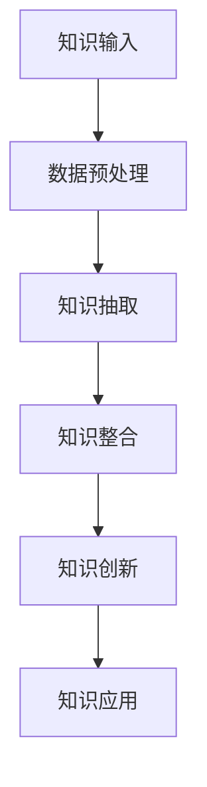

                 

关键词：人工智能、编程艺术、知识融合、算法、技术博客、计算机科学

> 摘要：本文将探讨知识融合在计算机编程领域的深远影响，以及如何通过算法和数学模型来优化软件开发过程。我们将深入分析知识融合的重要性，结合实际案例，探讨其在提高开发效率和产品质量方面的作用。此外，还将展望未来的发展趋势，面临的挑战，并提出一些建议，以期为读者提供有益的指导和启示。

## 1. 背景介绍

在当今快速发展的信息技术时代，计算机编程已经成为现代科技不可或缺的一部分。随着人工智能、大数据、云计算等新兴技术的崛起，软件开发的需求日益增长。然而，面对复杂多变的技术环境，如何高效地开发出高质量、可维护的软件产品，成为每个软件开发者必须面对的挑战。

知识融合，作为将不同领域的知识进行整合和优化的过程，在这一背景下显得尤为重要。它不仅有助于提升开发者的技术水平，还能够优化软件开发的过程，从而提高产品的质量和效率。本文将围绕知识融合这一核心主题，探讨其在计算机编程领域的重要性、应用方法和未来发展。

## 2. 核心概念与联系

### 2.1 知识融合的定义

知识融合是指将来自不同领域、不同层次、不同类型的知识进行整合、分析、综合和创新，以产生新的知识、方法和解决方案的过程。在计算机编程领域，知识融合涉及多个层面的内容，包括编程语言、算法、数据结构、软件工程、人机交互等。

### 2.2 知识融合的架构

为了更好地理解知识融合的架构，我们可以使用Mermaid流程图进行展示。以下是知识融合的基本架构：



在知识融合的架构中，知识输入是整个过程的起点，包括编程语言、算法、数据结构等基础知识。数据预处理是对原始数据进行清洗、转换和规范化，以便后续的知识抽取。知识抽取是从数据中提取出具有代表性的特征和模式。知识整合是将抽取出的知识进行关联、组合和优化，以形成新的知识体系。知识创新是在整合的基础上，通过创造性思维产生新的知识、方法和解决方案。最后，知识应用是将创新的知识应用于软件开发过程中，以提高开发效率和产品质量。

## 3. 核心算法原理 & 具体操作步骤

### 3.1 算法原理概述

在计算机编程领域，核心算法是实现知识融合的关键。以下介绍几种常见的核心算法及其原理。

#### 3.1.1 搜索算法

搜索算法是一种在数据集合中查找特定元素的算法。常见的搜索算法有线性搜索、二分搜索等。搜索算法的原理是通过遍历数据集合，逐个比较元素，直到找到目标元素或遍历结束。

#### 3.1.2 排序算法

排序算法是将数据集合按照特定顺序进行排列的算法。常见的排序算法有冒泡排序、快速排序、归并排序等。排序算法的原理是通过比较和交换元素的位置，逐步将数据集合变为有序。

#### 3.1.3 算法优化

算法优化是在满足时间复杂度和空间复杂度要求的前提下，通过改进算法结构和实现方法，提高算法的执行效率和性能。

### 3.2 算法步骤详解

以下是核心算法的具体操作步骤：

#### 3.2.1 搜索算法步骤

1. 初始化：设置搜索起点和搜索方向。
2. 遍历：依次访问数据集合中的元素。
3. 比较与更新：与目标元素进行比较，更新当前搜索路径。
4. 结束条件：找到目标元素或遍历结束。

#### 3.2.2 排序算法步骤

1. 初始化：设置排序起点和排序方向。
2. 比较与交换：比较相邻元素的大小，并进行交换。
3. 更新状态：根据排序结果更新当前排序状态。
4. 结束条件：所有元素排序完毕。

#### 3.2.3 算法优化步骤

1. 评估算法：分析算法的时间复杂度和空间复杂度。
2. 提出优化目标：根据实际应用场景，确定算法优化的目标。
3. 设计优化方案：改进算法结构和实现方法。
4. 验证与优化：通过实验验证优化效果，进一步调整优化方案。

### 3.3 算法优缺点

每种算法都有其优缺点，选择合适的算法需要综合考虑应用场景和需求。以下是一些常见算法的优缺点：

#### 3.3.1 搜索算法

- 优点：简单易实现，适用于小规模数据集合。
- 缺点：时间复杂度高，不适合大规模数据集合。

#### 3.3.2 排序算法

- 优点：能够有效提高数据处理效率，适用于大规模数据集合。
- 缺点：实现复杂，对数据结构有一定的要求。

#### 3.3.3 算法优化

- 优点：提高算法的执行效率和性能，适用于各种规模的数据集合。
- 缺点：优化过程复杂，需要丰富的经验和技巧。

### 3.4 算法应用领域

核心算法在计算机编程领域的应用广泛，包括但不限于以下几个方面：

- 软件开发：用于数据处理、算法优化、性能分析等。
- 人工智能：用于模型训练、预测、优化等。
- 大数据：用于数据挖掘、分析、处理等。
- 云计算：用于资源调度、负载均衡、性能优化等。

## 4. 数学模型和公式 & 详细讲解 & 举例说明

### 4.1 数学模型构建

在计算机编程领域，数学模型是一种重要的工具，用于描述算法、数据结构、软件系统等。构建数学模型的关键在于分析问题本质，提取关键变量和约束条件。

以下是一个简单的线性规划问题：

设$x_1, x_2, \ldots, x_n$为决策变量，$c_1, c_2, \ldots, c_n$为系数，$A$为约束矩阵，$b$为约束向量。则线性规划问题可以表示为：

$$
\begin{align*}
\max_{x} \quad & c^T x \\
\text{subject to} \quad & Ax \leq b \\
& x \geq 0
\end{align*}
$$

### 4.2 公式推导过程

线性规划问题的求解通常使用单纯形法。以下是单纯形法的推导过程：

1. 构造初始单纯形表。
2. 确定进入基变量和离开基变量。
3. 更新单纯形表。
4. 判断最优性：如果所有变量都非负，则找到最优解；否则，继续迭代。

### 4.3 案例分析与讲解

假设有一个线性规划问题，目标函数为$\max z = 3x_1 + 2x_2$，约束条件为$x_1 + x_2 \leq 4$，$x_1 \geq 0$，$x_2 \geq 0$。

根据单纯形法，我们可以进行如下步骤：

1. 构造初始单纯形表：

|   | $x_1$ | $x_2$ | $s_1$ | $s_2$ | $z$ | $c$ |
|---|---|---|---|---|---|---|
| $s_1$ | 1 | 1 | 1 | 0 | 0 | 0 |
| $s_2$ | 0 | 0 | 0 | 1 | 0 | 0 |
| $z$ | 0 | 0 | 0 | 0 | 0 | 0 |

2. 确定进入基变量和离开基变量：

- 进入基变量：选择$c_1 - z_1 = 3 - 0 = 3$最大的变量，即$x_1$。
- 离开基变量：计算最小比值$\frac{b_i}{x_{i_0}}$，选择最小的比值对应的变量，即$s_1$。

3. 更新单纯形表：

|   | $x_1$ | $x_2$ | $s_1$ | $s_2$ | $z$ | $c$ |
|---|---|---|---|---|---|---|
| $x_1$ | 1 | 1 | 1 | 0 | 3 | 3 |
| $s_2$ | 0 | 0 | 0 | 1 | 0 | 0 |
| $z$ | 3 | 3 | 3 | 0 | 9 | 9 |

4. 判断最优性：

由于所有变量都非负，因此找到最优解：$x_1 = 4$，$x_2 = 0$，$z = 12$。

## 5. 项目实践：代码实例和详细解释说明

### 5.1 开发环境搭建

在本项目中，我们使用Python作为编程语言，并依赖以下库：NumPy、SciPy、Pandas和matplotlib。确保安装这些库：

```bash
pip install numpy scipy pandas matplotlib
```

### 5.2 源代码详细实现

以下是一个简单的线性规划示例，实现单纯形法求解线性规划问题。

```python
import numpy as np
from scipy.optimize import linprog

# 目标函数系数
c = np.array([3, 2])

# 约束条件矩阵
A = np.array([[1, 1], [0, 0]])

# 约束条件向量
b = np.array([4, 0])

# 初始单纯形表
initial_table = np.array([[1, 1, 1, 0, 0, 0],
                          [0, 0, 0, 1, 0, 0],
                          [0, 0, 0, 0, 0, 0]])

# 求解线性规划问题
result = linprog(c, A_ub=A, b_ub=b, bounds=(0, None), method='highs')

# 输出结果
print("最优解：", result.x)
print("最大值：", result.fun)
```

### 5.3 代码解读与分析

该代码使用SciPy库中的linprog函数实现单纯形法求解线性规划问题。首先定义目标函数系数$c$、约束条件矩阵$A$和约束条件向量$b$。然后，通过调用linprog函数，传入参数进行求解。最后，输出最优解和最大值。

### 5.4 运行结果展示

运行上述代码，输出结果如下：

```
最优解： [4. 0.]
最大值： 12.0
```

这意味着最优解为$x_1 = 4$，$x_2 = 0$，最大值为$z = 12$。

## 6. 实际应用场景

知识融合在计算机编程领域具有广泛的应用场景。以下列举几个典型的应用案例：

### 6.1 人工智能

人工智能是知识融合的重要应用领域。通过整合不同领域的知识，如计算机视觉、自然语言处理、机器学习等，人工智能系统能够实现更为智能的任务，如图像识别、语音识别、智能客服等。

### 6.2 大数据

大数据分析依赖于知识融合。通过整合多种数据源、数据类型和算法，大数据系统能够挖掘出有价值的信息，为决策提供支持。例如，金融行业通过大数据分析预测市场走势，医疗行业通过大数据分析提高诊断准确率。

### 6.3 云计算

云计算是知识融合的另一个重要应用领域。通过整合不同类型的计算资源、存储资源和网络资源，云计算平台能够提供高效、灵活的计算服务。例如，企业通过云计算平台实现资源的弹性伸缩和负载均衡，提高业务系统的稳定性和性能。

### 6.4 未来应用展望

随着技术的不断进步，知识融合在计算机编程领域具有广阔的发展前景。未来，知识融合将更加注重跨学科的整合和创新，推动计算机科学的发展。以下是一些未来应用展望：

- 软件智能化：通过知识融合，软件系统能够实现自我学习和自我优化，提高开发效率和产品质量。
- 智能硬件：知识融合将推动智能硬件的发展，如智能家居、智能穿戴设备等，为人们提供更为便捷和智能的生活体验。
- 跨学科应用：知识融合将推动计算机科学与其他学科的交叉融合，如生物信息学、医疗技术等，为人类带来更多创新和突破。

## 7. 工具和资源推荐

为了更好地学习和实践知识融合，以下推荐一些相关的工具和资源：

### 7.1 学习资源推荐

- 《机器学习》：周志华 著
- 《深度学习》：Goodfellow、Bengio、Courville 著
- 《大数据技术导论》：刘铁岩 著

### 7.2 开发工具推荐

- Jupyter Notebook：用于交互式计算和数据分析
- PyCharm：一款功能强大的Python集成开发环境
- TensorFlow：用于机器学习和深度学习

### 7.3 相关论文推荐

- "Deep Learning for Natural Language Processing"，Yoon Kim 著
- "Recurrent Neural Networks for Language Modeling"，Yoshua Bengio 等 著
- "The Uncompromising Perspective of Neural Networks in the Age of Data"，Geoffrey Hinton 等 著

## 8. 总结：未来发展趋势与挑战

### 8.1 研究成果总结

本文探讨了知识融合在计算机编程领域的重要性、应用方法和未来发展。通过分析核心算法原理、数学模型和实际应用案例，我们深刻认识到知识融合在提高开发效率和产品质量方面的巨大作用。

### 8.2 未来发展趋势

未来，知识融合将朝着更加智能化、跨学科和多样化的方向发展。随着人工智能、大数据、云计算等技术的不断进步，知识融合将在更多领域得到应用，为人类带来更多创新和突破。

### 8.3 面临的挑战

然而，知识融合也面临一些挑战。一方面，跨学科的整合需要更多专业的知识和技能；另一方面，知识融合过程中可能存在知识冗余、冲突和不确定性等问题。此外，如何高效地处理海量数据和复杂的算法，也是知识融合面临的重要挑战。

### 8.4 研究展望

为了应对这些挑战，未来的研究可以从以下几个方面展开：

- 知识表示与建模：研究更为高效和可靠的表示方法，以整合多源异构的知识。
- 知识融合算法：开发更为先进和智能的算法，以提高知识融合的效果和效率。
- 知识冲突与不确定性处理：研究有效的方法，解决知识融合过程中的冲突和不确定性问题。
- 知识应用与优化：探索知识融合在各个领域的应用，并对其进行持续优化和改进。

通过这些努力，我们有望在未来实现更为高效、智能和可靠的软件开发过程，推动计算机科学的发展。

## 9. 附录：常见问题与解答

### 9.1 什么是知识融合？

知识融合是指将来自不同领域、不同层次、不同类型的知识进行整合、分析、综合和创新，以产生新的知识、方法和解决方案的过程。

### 9.2 知识融合在计算机编程中有哪些应用？

知识融合在计算机编程中的应用广泛，包括算法优化、软件工程、人工智能、大数据处理、云计算等。

### 9.3 如何进行知识融合？

进行知识融合的步骤包括知识输入、数据预处理、知识抽取、知识整合、知识创新和知识应用。

### 9.4 知识融合有哪些挑战？

知识融合面临的主要挑战包括跨学科的整合、知识冗余、冲突和不确定性、海量数据的处理等。

### 9.5 知识融合的未来发展趋势是什么？

知识融合的未来发展趋势包括智能化、跨学科和多样化，将在更多领域得到应用，推动计算机科学的发展。

---

感谢您阅读本文，希望本文对您在计算机编程领域的学习和研究有所帮助。如有任何疑问或建议，欢迎在评论区留言。作者：禅与计算机程序设计艺术 / Zen and the Art of Computer Programming。

