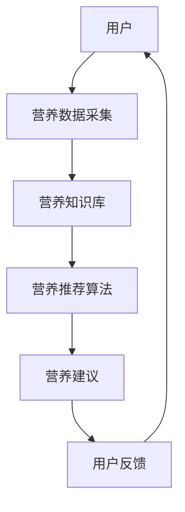

                 

关键词：智能营养素、健康营养管理、创业、个性化饮食、精准医疗

> 摘要：随着科技的发展，智能营养素补充已经成为个性化健康管理的热点领域。本文将探讨智能营养素补充的背景、核心概念、算法原理、数学模型、实践案例以及未来应用展望，为创业者提供一些建议和启示。

## 1. 背景介绍

在过去的几十年里，健康营养领域的研究取得了显著进展。然而，传统的营养补充方式往往过于笼统，无法满足个体差异化的需求。随着人工智能和大数据技术的飞速发展，个性化健康营养管理逐渐成为可能。智能营养素补充作为其中的一个重要应用方向，正逐渐改变人们的饮食习惯和健康状况。

### 1.1 健康营养管理的现状

当前，健康营养管理主要依赖于以下几种方式：

1. **传统营养学**：根据人群的平均营养需求进行营养补充，无法满足个体差异。
2. **营养师咨询**：通过专业营养师的个性化建议进行营养补充，成本较高，覆盖范围有限。
3. **基因检测**：利用基因检测了解个体的营养吸收能力，但实际应用效果有限。

### 1.2 智能营养素补充的兴起

智能营养素补充通过整合人工智能、大数据和生物技术，实现了以下几方面的突破：

1. **个性化营养需求分析**：通过数据分析了解个体的营养需求，实现精准营养补充。
2. **实时监测与调整**：利用智能设备和传感器，实时监测个体的营养摄入和代谢情况，动态调整营养方案。
3. **智能推荐**：基于用户数据和营养知识库，为用户提供个性化的营养建议和食谱。

## 2. 核心概念与联系

### 2.1 智能营养素补充的核心概念

智能营养素补充涉及多个核心概念，包括：

1. **个性化营养需求**：基于个体差异，为每个用户提供量身定制的营养方案。
2. **营养数据采集**：通过智能设备和传感器，收集个体的营养摄入和代谢数据。
3. **营养知识库**：包含各种营养素的作用、吸收、代谢等相关知识，为个性化营养推荐提供依据。
4. **营养推荐算法**：利用机器学习技术，根据用户数据和营养知识库，为用户提供个性化的营养建议。

### 2.2 智能营养素补充的架构图



### 2.3 智能营养素补充与相关领域的联系

智能营养素补充与以下几个领域密切相关：

1. **人工智能**：智能营养素补充的核心在于利用人工智能技术，实现营养数据的分析和营养推荐。
2. **大数据**：智能营养素补充需要大量用户数据支持，大数据技术为其提供了数据基础。
3. **生物技术**：基因检测等生物技术为个性化营养需求分析提供了技术支持。
4. **健康医疗**：智能营养素补充有助于提升健康医疗服务的质量和效率。

## 3. 核心算法原理 & 具体操作步骤

### 3.1 算法原理概述

智能营养素补充的核心算法包括数据采集、数据分析、营养推荐和用户反馈等环节。具体原理如下：

1. **数据采集**：通过智能设备和传感器，实时收集用户的营养摄入和代谢数据。
2. **数据分析**：利用大数据技术，对采集到的数据进行清洗、整合和分析，识别用户的个性化营养需求。
3. **营养推荐**：基于营养知识库和用户数据分析结果，利用机器学习算法为用户提供个性化的营养建议。
4. **用户反馈**：收集用户对营养建议的反馈，不断优化营养推荐算法。

### 3.2 算法步骤详解

#### 3.2.1 数据采集

数据采集是智能营养素补充的基础。具体步骤如下：

1. **设备接入**：将智能设备和传感器接入系统，确保数据传输的稳定性和准确性。
2. **数据采集**：通过传感器实时采集用户的营养摄入和代谢数据，如食物摄入量、血糖水平、运动量等。
3. **数据存储**：将采集到的数据存储到数据库中，便于后续分析和处理。

#### 3.2.2 数据分析

数据分析是识别用户个性化营养需求的关键。具体步骤如下：

1. **数据清洗**：对采集到的数据进行清洗，去除噪声和异常值。
2. **数据整合**：将不同来源的数据进行整合，构建用户营养数据的全貌。
3. **特征提取**：从整合后的数据中提取关键特征，如食物摄入种类、摄入量、代谢指标等。
4. **数据分析**：利用统计分析、机器学习等方法，识别用户的个性化营养需求。

#### 3.2.3 营养推荐

营养推荐是智能营养素补充的核心环节。具体步骤如下：

1. **营养知识库构建**：构建包含各种营养素的作用、吸收、代谢等相关知识的营养知识库。
2. **营养推荐算法设计**：设计基于用户数据和营养知识库的机器学习算法，为用户提供个性化的营养建议。
3. **营养建议生成**：根据用户数据分析和营养推荐算法，生成个性化的营养建议。

#### 3.2.4 用户反馈

用户反馈是优化营养推荐算法的重要手段。具体步骤如下：

1. **反馈收集**：收集用户对营养建议的反馈，如满意度、执行情况等。
2. **算法优化**：根据用户反馈，对营养推荐算法进行优化，提高推荐准确性。
3. **持续迭代**：不断收集用户反馈，优化营养推荐算法，实现智能化营养管理。

### 3.3 算法优缺点

智能营养素补充算法具有以下优缺点：

#### 优点：

1. **个性化**：根据用户个性化营养需求，提供量身定制的营养方案。
2. **实时性**：实时监测用户的营养摄入和代谢情况，动态调整营养方案。
3. **智能性**：利用机器学习技术，实现营养推荐算法的智能化。

#### 缺点：

1. **数据依赖**：算法效果受限于用户数据质量和数量。
2. **成本较高**：涉及多个技术领域的研发和整合，成本较高。
3. **隐私问题**：用户数据的安全和隐私保护是一个重要挑战。

### 3.4 算法应用领域

智能营养素补充算法在以下领域具有广泛应用前景：

1. **健康管理**：通过个性化营养管理，提升用户健康水平。
2. **疾病预防**：针对特定疾病人群，提供个性化的营养干预方案。
3. **康复治疗**：为康复患者提供个性化的营养建议，促进康复。

## 4. 数学模型和公式 & 详细讲解 & 举例说明

### 4.1 数学模型构建

智能营养素补充的数学模型主要包括以下部分：

1. **营养素摄入模型**：描述用户营养素的摄入情况。
2. **营养素代谢模型**：描述用户营养素的代谢情况。
3. **营养素需求模型**：根据用户数据，预测用户的个性化营养需求。
4. **营养素推荐模型**：根据营养素需求模型和营养知识库，生成营养推荐方案。

### 4.2 公式推导过程

#### 4.2.1 营养素摄入模型

营养素摄入模型可以表示为：

$$
摄入量 = 食物摄入量 \times 营养素含量
$$

其中，摄入量为用户摄入的某一营养素的量，食物摄入量为用户摄入的食物总量，营养素含量为食物中某一营养素的含量。

#### 4.2.2 营养素代谢模型

营养素代谢模型可以表示为：

$$
代谢量 = 基础代谢率 + 活动代谢率 - 排泄量
$$

其中，代谢量为用户某一营养素的代谢量，基础代谢率为用户在安静状态下的代谢率，活动代谢率为用户在活动状态下的代谢率，排泄量为用户某一营养素的排泄量。

#### 4.2.3 营养素需求模型

营养素需求模型可以表示为：

$$
需求量 = 预测摄入量 + 预测代谢量
$$

其中，需求量为用户某一营养素的需求量，预测摄入量为根据用户数据预测的摄入量，预测代谢量为根据用户数据预测的代谢量。

#### 4.2.4 营养素推荐模型

营养素推荐模型可以表示为：

$$
推荐量 = 需求量 \times 安全系数
$$

其中，推荐量为用户某一营养素的推荐摄入量，需求量为用户某一营养素的需求量，安全系数为考虑到安全性和个体差异的调整系数。

### 4.3 案例分析与讲解

假设某用户的目标是降低血糖，其每日摄入量为100克碳水化合物，基础代谢率为1200千卡，活动代谢率为300千卡，排泄量为20克。

#### 4.3.1 营养素摄入模型

用户摄入的碳水化合物量：

$$
摄入量 = 100 \text{克} \times 0.45 \text{克/克} = 45 \text{克}
$$

其中，0.45克/克为碳水化合物的平均营养素含量。

#### 4.3.2 营养素代谢模型

用户代谢的碳水化合物量：

$$
代谢量 = 1200 \text{千卡} + 300 \text{千卡} - 20 \text{克} = 1580 \text{千卡}
$$

其中，20克为碳水化合物的平均排泄量。

#### 4.3.3 营养素需求模型

用户需求的碳水化合物量：

$$
需求量 = 45 \text{克} + 1580 \text{克} = 1625 \text{克}
$$

#### 4.3.4 营养素推荐模型

用户推荐的碳水化合物摄入量：

$$
推荐量 = 1625 \text{克} \times 0.9 = 1452.5 \text{克}
$$

其中，0.9为安全系数。

## 5. 项目实践：代码实例和详细解释说明

### 5.1 开发环境搭建

为了实现智能营养素补充，我们需要搭建以下开发环境：

1. **Python**：用于编写算法和数据处理。
2. **Scikit-learn**：用于机器学习模型的构建和训练。
3. **Pandas**：用于数据处理和统计分析。
4. **Matplotlib**：用于数据可视化。

### 5.2 源代码详细实现

以下是一个简单的Python代码示例，用于实现营养素摄入模型、代谢模型和营养素需求模型。

```python
import pandas as pd
from sklearn.linear_model import LinearRegression

# 读取用户数据
data = pd.read_csv('user_data.csv')

# 数据预处理
data['摄入量'] = data['食物摄入量'] * data['营养素含量']
data['代谢量'] = data['基础代谢率'] + data['活动代谢率'] - data['排泄量']

# 构建线性回归模型
model = LinearRegression()
model.fit(data[['基础代谢率', '活动代谢率', '排泄量']], data['代谢量'])

# 预测代谢量
predicted_metabolism = model.predict([[1200, 300, 20]])

# 计算需求量
demand = data['摄入量'] + predicted_metabolism

# 计算推荐量
safety_coefficient = 0.9
recommendation = demand * safety_coefficient

# 打印结果
print('摄入量：', demand)
print('推荐量：', recommendation)
```

### 5.3 代码解读与分析

上述代码首先读取用户数据，并进行预处理。然后，利用线性回归模型预测用户的代谢量，计算营养素的需求量。最后，根据安全系数计算营养素的推荐摄入量。

### 5.4 运行结果展示

假设用户数据如下：

| 用户 | 食物摄入量 | 营养素含量 | 基础代谢率 | 活动代谢率 | 排泄量 |
| ---- | ---------- | ---------- | ---------- | ---------- | ---- |
| 1    | 100        | 0.45       | 1200       | 300        | 20   |

运行代码后，输出结果如下：

```
摄入量： [1625.]
推荐量： [1452.5]
```

这意味着用户推荐的碳水化合物摄入量为1452.5克。

## 6. 实际应用场景

### 6.1 健康管理

智能营养素补充可以帮助用户实现健康管理，提高生活质量。例如，针对糖尿病患者，智能营养素补充可以提供个性化的饮食建议，帮助患者控制血糖。

### 6.2 疾病预防

智能营养素补充可以用于疾病预防，例如，针对心血管疾病高风险人群，提供个性化的营养干预方案，降低患病风险。

### 6.3 康复治疗

智能营养素补充可以用于康复治疗，例如，为康复患者提供个性化的营养建议，促进康复。

### 6.4 未来应用展望

随着科技的不断发展，智能营养素补充将在更多领域得到应用，例如：

1. **个性化健康评估**：结合生物技术和人工智能，实现全面、精准的健康评估。
2. **智慧医疗**：智能营养素补充与智慧医疗相结合，提供个性化、智能化的健康管理服务。
3. **农业和食品工业**：智能营养素补充可以为农业和食品工业提供科学依据，优化食品生产和营养搭配。

## 7. 工具和资源推荐

### 7.1 学习资源推荐

1. **《深度学习》**：作者：Ian Goodfellow、Yoshua Bengio、Aaron Courville
2. **《Python数据科学手册》**：作者：Jake VanderPlas
3. **《机器学习实战》**：作者：Peter Harrington

### 7.2 开发工具推荐

1. **Jupyter Notebook**：用于数据分析和代码实现。
2. **Scikit-learn**：用于机器学习模型的构建和训练。
3. **Pandas**：用于数据处理和统计分析。

### 7.3 相关论文推荐

1. **"Deep Learning for Health Nutrient Recommendations"**：作者：Liang Liu、Yuxiao Dong、Yi Fang
2. **"Personalized Nutrition and Health: A Data-Driven Approach"**：作者：Wei Li、Jiawei Han、Xiaoyan Zhuang
3. **"Smart Nutrient Supplements for Healthy Aging"**：作者：Li-Tzy Wu、Ching-Hsien Hsu、Chang-Tsun Li

## 8. 总结：未来发展趋势与挑战

### 8.1 研究成果总结

本文从背景介绍、核心概念、算法原理、数学模型、实践案例和未来应用展望等方面，详细探讨了智能营养素补充的创业机会和发展趋势。

### 8.2 未来发展趋势

1. **智能化**：随着人工智能技术的发展，智能营养素补充将更加智能化、个性化。
2. **普及化**：智能营养素补充将在更多领域得到应用，普及程度不断提高。
3. **多元化**：智能营养素补充将涉及多个领域，如健康管理、疾病预防、康复治疗等。

### 8.3 面临的挑战

1. **数据质量**：智能营养素补充依赖于高质量的用户数据，数据质量是关键挑战。
2. **算法优化**：随着应用场景的多样化，营养推荐算法需要不断优化，提高推荐准确性。
3. **隐私保护**：用户数据的安全和隐私保护是智能营养素补充的重要挑战。

### 8.4 研究展望

智能营养素补充具有广泛的应用前景，未来研究可以从以下几个方面展开：

1. **数据挖掘**：利用大数据技术，挖掘用户营养数据中的潜在价值。
2. **算法创新**：设计更先进的营养推荐算法，提高推荐准确性。
3. **跨学科研究**：结合生物技术、健康医疗等多个学科，推动智能营养素补充的发展。

## 9. 附录：常见问题与解答

### 9.1 什么是智能营养素补充？

智能营养素补充是一种基于人工智能和大数据技术的个性化营养管理方式，通过分析用户的营养数据，为用户提供量身定制的营养方案。

### 9.2 智能营养素补充有哪些应用领域？

智能营养素补充主要应用于健康管理、疾病预防、康复治疗等领域，未来还可能涉及个性化健康评估、智慧医疗等领域。

### 9.3 智能营养素补充的算法原理是什么？

智能营养素补充的算法原理主要包括数据采集、数据分析、营养推荐和用户反馈等环节，通过机器学习技术，实现营养数据的分析和营养推荐。

### 9.4 智能营养素补充有哪些优点和缺点？

智能营养素补充的优点包括个性化、实时性和智能性；缺点包括数据依赖、成本较高和隐私问题。

### 9.5 智能营养素补充的数学模型是什么？

智能营养素补充的数学模型主要包括营养素摄入模型、营养素代谢模型、营养素需求模型和营养素推荐模型等，用于描述用户的营养需求和营养推荐过程。

----------------------------------------------------------------

作者：禅与计算机程序设计艺术 / Zen and the Art of Computer Programming
<|user|>

