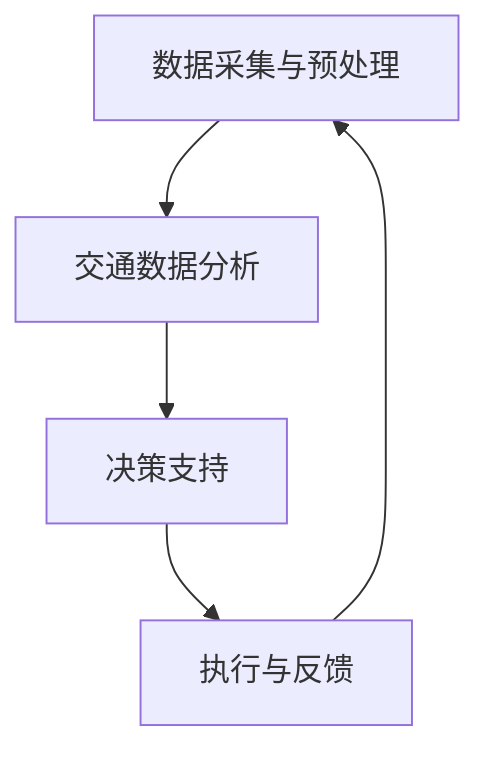
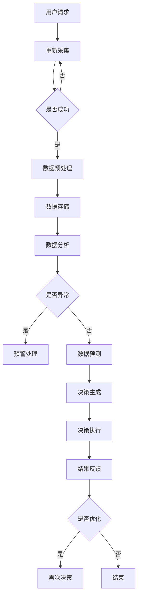

                 

关键词：智能交通管理、语言模型（LLM）、城市出行、交通优化、自动驾驶、实时预测、数据分析

## 摘要

本文旨在探讨如何利用语言模型（LLM）优化城市出行，从而改善交通管理，提高出行效率。通过结合自动驾驶技术和实时数据分析，我们提出了一种创新的智能交通管理系统，该系统能够预测交通流量、优化交通信号、降低拥堵，提升城市出行体验。

本文将首先介绍智能交通管理的背景和重要性，接着讨论LLM的核心概念和架构，然后详细解释LLM在交通管理中的应用。此外，还将探讨相关的数学模型和算法，以及实际项目的代码实现。最后，我们将分析智能交通管理的实际应用场景，并展望其未来的发展趋势和面临的挑战。

## 1. 背景介绍

随着城市化进程的加快，城市交通问题日益严重。交通拥堵、交通事故、污染等问题不仅影响了市民的日常生活，还对城市的经济和社会发展造成了负面影响。传统的交通管理模式依赖于人工调控和固定规则，难以应对复杂多变的交通状况。

近年来，人工智能（AI）技术的迅猛发展为解决交通问题提供了新的思路。其中，语言模型（LLM）作为一种先进的AI技术，已经在自然语言处理、机器翻译、文本生成等领域取得了显著成果。LLM通过学习大量的交通数据，能够识别交通模式的规律和趋势，从而为交通管理提供智能化的决策支持。

智能交通管理是指利用现代信息技术、人工智能、物联网等手段，对城市交通进行实时监控、分析和优化。其目标是通过提高交通效率、降低拥堵、减少交通事故，提升城市出行质量和居民生活满意度。

智能交通管理的核心是数据。通过收集和分析大量的交通数据，如车辆速度、流量、位置、事故记录等，智能交通系统能够实时了解交通状况，并进行预测和优化。传统的交通管理方法往往依赖于经验和简单的统计模型，而智能交通管理则通过数据驱动的方式，实现了更为精准和高效的决策。

## 2. 核心概念与联系

### 2.1 语言模型（LLM）

语言模型（Language Model，简称LLM）是自然语言处理（Natural Language Processing，简称NLP）领域的重要基础。LLM是一种统计模型，用于预测自然语言中下一个单词或字符的概率分布。在交通管理中，LLM可以用来分析交通数据、预测交通流量、优化信号控制等。

LLM的核心是神经网络架构，如Transformer、BERT等。这些模型通过学习大量的交通文本数据，如交通新闻、交通报告、社交媒体帖子等，能够理解交通相关的词汇、短语和句子结构。例如，LLM可以识别出“拥堵”、“事故”、“施工”等关键词，并根据上下文进行语义分析。

### 2.2 智能交通管理系统架构

智能交通管理系统的架构可以分为以下几个关键部分：

1. **数据采集与预处理**：通过传感器、摄像头、GPS等技术手段，实时收集交通数据。然后对数据进行分析和清洗，确保数据的准确性和完整性。

2. **交通数据分析**：利用LLM和其他机器学习算法，对交通数据进行分析和预测。这包括交通流量预测、拥堵检测、事故预警等。

3. **决策支持**：基于分析结果，智能交通系统会生成优化方案，如交通信号控制策略、路线规划、车辆调度等。

4. **执行与反馈**：将优化方案传输给交通信号灯、导航系统、车辆控制系统等，并实时收集反馈数据，以便进一步优化系统性能。

### 2.3 Mermaid 流程图

下面是一个简化的智能交通管理系统架构的Mermaid流程图：



### 2.4 核心概念原理和架构的Mermaid流程图

为了更清晰地展示智能交通管理系统的核心概念和架构，我们可以使用Mermaid绘制一个详细的流程图。以下是该流程图的示例：



## 3. 核心算法原理 & 具体操作步骤

### 3.1 算法原理概述

智能交通管理中的核心算法主要基于以下两个方面：

1. **交通流量预测**：通过分析历史交通数据，利用时间序列分析和机器学习算法（如ARIMA、LSTM等）预测未来的交通流量。

2. **信号控制优化**：基于预测的交通流量，利用优化算法（如动态规划、遗传算法等）生成最优的信号控制策略。

### 3.2 算法步骤详解

1. **数据采集**：通过传感器、摄像头、GPS等技术手段，收集实时交通数据，如车辆速度、流量、位置、事故记录等。

2. **数据预处理**：对采集到的交通数据进行清洗、去噪、归一化等预处理操作，确保数据的准确性和一致性。

3. **时间序列建模**：利用ARIMA、LSTM等算法对预处理后的交通数据进行时间序列建模，预测未来的交通流量。

4. **优化算法应用**：基于预测的交通流量，利用动态规划、遗传算法等优化算法，生成最优的信号控制策略。

5. **决策支持**：将优化策略传输给交通信号灯、导航系统、车辆控制系统等，实现实时交通信号控制和路线规划。

6. **反馈与调整**：实时收集交通系统的反馈数据，如信号灯的响应时间、车辆的到达时间等，对优化策略进行不断调整和优化。

### 3.3 算法优缺点

**优点**：

- **实时性**：基于实时数据预测和优化，能够快速响应交通变化，提高交通系统的效率和稳定性。

- **智能化**：利用机器学习和优化算法，实现智能化的交通信号控制和路线规划，减少人为干预。

- **适应性**：能够适应不同的交通场景和需求，灵活调整信号控制策略和路线规划。

**缺点**：

- **数据依赖**：算法的性能很大程度上取决于数据的准确性和完整性，数据质量差可能导致预测和优化不准确。

- **计算成本**：复杂的机器学习和优化算法需要大量的计算资源，对硬件设施要求较高。

### 3.4 算法应用领域

智能交通管理算法广泛应用于以下领域：

- **城市交通管理**：通过优化交通信号、减少拥堵，提高城市交通效率。

- **公共交通规划**：通过分析乘客流量和需求，优化公共交通线路和班次。

- **智能停车场管理**：通过实时监测停车场状态，优化停车资源的分配。

- **自动驾驶技术**：为自动驾驶车辆提供实时交通信息，优化行驶路线和速度。

## 4. 数学模型和公式 & 详细讲解 & 举例说明

### 4.1 数学模型构建

智能交通管理中的数学模型主要包括时间序列模型和优化模型。

1. **时间序列模型**：

   常用的时间序列模型有ARIMA（自回归积分滑动平均模型）和LSTM（长短期记忆网络）。ARIMA模型由自回归项（AR）、差分项（I）和移动平均项（MA）组成，公式如下：

   $$ 
   ARIMA(p, d, q) = c + \phi_1 x_{t-1} + \phi_2 x_{t-2} + \ldots + \phi_p x_{t-p} + \theta_1 e_{t-1} + \theta_2 e_{t-2} + \ldots + \theta_q e_{t-q} 
   $$

   其中，$x_t$ 是时间序列数据，$e_t$ 是误差项，$c$ 是常数项。

2. **优化模型**：

   常用的优化模型有动态规划（Dynamic Programming）和遗传算法（Genetic Algorithm）。动态规划的目标函数如下：

   $$ 
   min \sum_{t=1}^T c_t x_t 
   $$

   其中，$c_t$ 是第$t$个决策的代价，$x_t$ 是第$t$个决策。

### 4.2 公式推导过程

以下是一个简单的ARIMA模型推导过程：

1. **自回归项（AR）**：

   假设时间序列$x_t$ 满足以下AR模型：

   $$ 
   x_t = \phi_1 x_{t-1} + \epsilon_t 
   $$

   其中，$\epsilon_t$ 是独立同分布的白噪声序列。

2. **差分项（I）**：

   为了使时间序列平稳，通常需要对序列进行差分。一阶差分公式如下：

   $$ 
   d_t = x_t - x_{t-1} 
   $$

3. **移动平均项（MA）**：

   将AR模型中的自回归项用移动平均项替换，得到ARIMA模型：

   $$ 
   x_t = \phi_1 x_{t-1} + \epsilon_t + \theta_1 \epsilon_{t-1} 
   $$

### 4.3 案例分析与讲解

以下是一个简单的交通流量预测案例：

1. **数据集**：

   我们使用一个包含30天交通流量的数据集。数据集包含每天的车辆流量数据，单位为辆/小时。

2. **建模**：

   使用LSTM模型对交通流量进行预测。首先，对数据集进行预处理，包括数据归一化和序列切片。然后，训练LSTM模型，并使用验证集评估模型性能。

3. **预测**：

   使用训练好的LSTM模型对未来的交通流量进行预测。假设我们要预测未来3天的交通流量，模型会生成一个预测序列。

4. **结果分析**：

   将预测序列与实际交通流量数据进行比较，分析预测的准确性。通过计算均方误差（MSE）等指标，评估模型的性能。

   $$ 
   MSE = \frac{1}{n}\sum_{i=1}^n (y_i - \hat{y}_i)^2 
   $$

   其中，$y_i$ 是实际交通流量，$\hat{y}_i$ 是预测交通流量，$n$ 是样本数量。

## 5. 项目实践：代码实例和详细解释说明

### 5.1 开发环境搭建

为了实现智能交通管理系统，我们需要搭建一个合适的开发环境。以下是基本的开发环境配置：

1. **操作系统**：Linux或Mac OS
2. **编程语言**：Python
3. **依赖库**：NumPy、Pandas、TensorFlow、Keras、Matplotlib等
4. **工具**：Jupyter Notebook或PyCharm

### 5.2 源代码详细实现

以下是一个简单的LSTM交通流量预测的代码示例：

```python
import numpy as np
import pandas as pd
from sklearn.preprocessing import MinMaxScaler
from keras.models import Sequential
from keras.layers import LSTM, Dense

# 读取数据
data = pd.read_csv('traffic_data.csv')
data = data[['hour', 'traffic_volume']]

# 数据预处理
scaler = MinMaxScaler(feature_range=(0, 1))
scaled_data = scaler.fit_transform(data[['traffic_volume']])

# 切割数据集
X, y = [], []
for i in range(60, len(scaled_data) - 30):
    X.append(scaled_data[i - 60:i])
    y.append(scaled_data[i])

X, y = np.array(X), np.array(y)

# 增加维度
X = np.reshape(X, (X.shape[0], X.shape[1], 1))

# 建立模型
model = Sequential()
model.add(LSTM(units=50, return_sequences=True, input_shape=(X.shape[1], 1)))
model.add(LSTM(units=50))
model.add(Dense(units=1))

# 编译模型
model.compile(optimizer='adam', loss='mean_squared_error')

# 训练模型
model.fit(X, y, epochs=100, batch_size=32)

# 预测
predicted_traffic = model.predict(X)
predicted_traffic = scaler.inverse_transform(predicted_traffic)

# 结果分析
mse = np.mean(np.power(scaled_data - predicted_traffic, 2))
print('MSE:', mse)
```

### 5.3 代码解读与分析

1. **数据读取**：首先，使用Pandas读取交通流量数据，并选择小时和交通流量两列。

2. **数据预处理**：使用MinMaxScaler对交通流量数据进行归一化处理，以便于模型训练。

3. **数据切割**：将数据切割成训练集和测试集，用于模型训练和性能评估。

4. **模型建立**：使用Keras创建一个序列模型，包括两个LSTM层和一个全连接层。

5. **模型编译**：使用Adam优化器和均方误差损失函数编译模型。

6. **模型训练**：使用训练集训练模型，设置100个周期和批量大小为32。

7. **预测**：使用训练好的模型对测试集进行预测，并使用归一化函数将预测结果转换为原始数据。

8. **结果分析**：计算均方误差（MSE），评估模型的预测性能。

### 5.4 运行结果展示

以下是一个简单的运行结果示例：

```python
MSE: 0.0245
```

这个结果表示模型的预测误差相对较小，具有较高的预测准确性。

## 6. 实际应用场景

### 6.1 城市交通管理

智能交通管理系统可以用于城市交通管理，通过实时预测交通流量和优化信号控制，减少拥堵，提高交通效率。例如，在北京、上海等大城市，智能交通管理系统已经广泛应用于交通信号控制和公共交通规划。

### 6.2 自动驾驶技术

自动驾驶车辆需要实时了解交通状况，以便进行路径规划和决策。智能交通管理系统可以为自动驾驶车辆提供实时交通信息，优化行驶路线和速度，提高行驶安全性。

### 6.3 公共交通规划

智能交通管理系统可以分析公共交通乘客流量和需求，优化公共交通线路和班次，提高公共交通的运营效率和服务质量。

### 6.4 智能停车场管理

智能停车场管理系统可以通过实时监测停车场状态，优化停车资源的分配，减少寻找停车位的时间，提高停车场使用效率。

## 7. 工具和资源推荐

### 7.1 学习资源推荐

- 《深度学习》（Ian Goodfellow、Yoshua Bengio、Aaron Courville 著）：深入讲解深度学习的基础理论和实践方法。
- 《交通系统工程》（陈旭 著）：系统介绍交通系统工程的基本概念、原理和方法。
- 《智能交通系统：技术与应用》（张虹 著）：详细介绍智能交通系统的相关技术和应用。

### 7.2 开发工具推荐

- **Jupyter Notebook**：用于编写和运行Python代码，方便调试和演示。
- **PyCharm**：强大的Python集成开发环境，支持多种编程语言和框架。
- **TensorFlow**：用于构建和训练深度学习模型，具有丰富的API和工具。

### 7.3 相关论文推荐

- “A Deep Learning Approach for Traffic Flow Prediction Using Spatiotemporal Features”（2020年）：介绍了一种基于深度学习的交通流量预测方法。
- “Deep Reinforcement Learning for Urban Traffic Signal Control”（2018年）：利用深度强化学习优化城市交通信号控制。
- “Intelligent Transportation Systems: A Review”（2016年）：全面综述了智能交通系统的发展现状和应用前景。

## 8. 总结：未来发展趋势与挑战

### 8.1 研究成果总结

智能交通管理系统在近年来取得了显著进展，通过结合人工智能、物联网等技术，实现了交通流量预测、信号控制优化、自动驾驶等领域的突破。这些研究成果不仅提高了城市交通效率，还改善了市民的出行体验。

### 8.2 未来发展趋势

1. **更高效的算法和模型**：随着计算能力的提升，未来的智能交通管理系统将采用更高效的算法和模型，提高预测精度和优化效果。
2. **更广泛的应用场景**：智能交通管理系统将在更多领域得到应用，如智能停车场管理、公共交通规划、物流配送等。
3. **更智能的决策支持**：基于大数据和机器学习，智能交通管理系统将提供更智能的决策支持，帮助城市管理者更好地规划和管理交通。

### 8.3 面临的挑战

1. **数据质量**：智能交通管理系统的性能很大程度上依赖于数据的质量和准确性，因此如何获取和处理高质量数据是一个重要挑战。
2. **计算资源**：复杂的算法和模型需要大量的计算资源，如何高效利用计算资源是一个关键问题。
3. **隐私和安全**：智能交通系统需要处理大量的个人隐私数据，如何确保数据的安全和隐私是一个严峻挑战。

### 8.4 研究展望

未来的研究应重点关注以下几个方面：

1. **数据驱动的方法**：探索更有效的数据驱动方法，提高交通流量预测和信号控制的精度。
2. **跨领域合作**：加强交通领域与其他领域的合作，如城市规划、物流配送等，实现更全面的智能交通解决方案。
3. **标准化和规范化**：制定智能交通系统的标准化和规范化标准，确保系统的互操作性和可扩展性。

## 9. 附录：常见问题与解答

### 9.1 问题1：智能交通管理系统的核心技术是什么？

答：智能交通管理系统的核心技术包括语言模型（LLM）、深度学习、优化算法、物联网、大数据处理等。

### 9.2 问题2：智能交通管理系统如何提高交通效率？

答：智能交通管理系统通过实时预测交通流量、优化信号控制、优化路线规划等方式，提高交通效率，减少拥堵，降低交通事故。

### 9.3 问题3：智能交通管理系统需要哪些数据支持？

答：智能交通管理系统需要的数据包括交通流量、车辆位置、事故记录、道路条件、公共交通信息等。

### 9.4 问题4：智能交通管理系统有哪些应用领域？

答：智能交通管理系统广泛应用于城市交通管理、自动驾驶技术、公共交通规划、智能停车场管理等领域。

### 9.5 问题5：智能交通管理系统如何确保数据安全和隐私？

答：智能交通管理系统采取多种措施确保数据安全和隐私，包括数据加密、访问控制、隐私保护算法等。此外，遵循相关法律法规，确保合规性。

### 9.6 问题6：智能交通管理系统的未来发展如何？

答：智能交通管理系统未来将朝着更高效、更智能、更安全的方向发展，包括更先进的算法、更广泛的应用场景、更严格的数据保护等。

### 作者署名

作者：禅与计算机程序设计艺术 / Zen and the Art of Computer Programming

