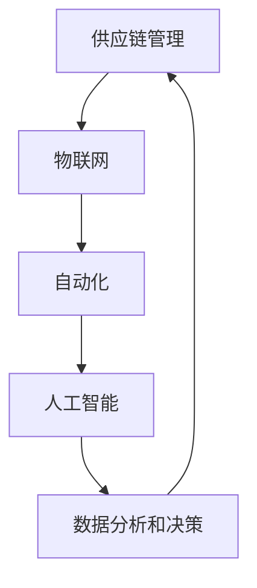

                 

关键词：智能仓储、物流效率、自动化、人工智能、物联网、供应链管理

> 摘要：本文将深入探讨智能仓储在现代物流系统中的重要性，阐述其如何通过人工智能、自动化和物联网技术的融合，实现物流效率的革命性提升。文章将从背景介绍、核心概念与联系、核心算法原理、数学模型和公式、项目实践、实际应用场景、未来应用展望、工具和资源推荐以及总结与展望等多个方面进行详细分析。

## 1. 背景介绍

随着全球经济的快速发展，物流行业面临着日益严峻的挑战。传统的仓储模式效率低下，成本高昂，难以满足现代供应链管理的需求。为了提高物流效率，降低运营成本，智能化仓储应运而生。智能仓储通过引入人工智能、自动化和物联网技术，实现了对仓储过程的全面监控和管理，大大提升了物流系统的效率。

### 物流行业的发展现状与挑战

1. **供应链复杂度增加**：全球化的趋势使得供应链更加复杂，物流企业需要应对不同地区、不同国家之间的差异，如语言、货币、法规等。

2. **订单量快速增长**：电子商务的兴起带来了订单量的快速增长，物流企业需要快速响应客户需求，提高配送速度。

3. **成本压力**：劳动力成本的增加和运输成本的波动使得物流企业面临巨大的成本压力。

4. **环保要求**：全球环保意识的提高，对物流行业提出了更高的环保要求。

### 智能仓储的崛起

智能仓储通过引入先进的技术手段，实现了对仓储过程的全面优化。其优势主要体现在以下几个方面：

1. **提高效率**：自动化设备和高精度传感器可以大大提高仓储操作的效率，减少人为错误。

2. **降低成本**：自动化和人工智能技术的应用可以降低人力成本和运营成本。

3. **提升准确性**：通过精确的库存管理和实时数据监控，可以大大提高物流操作的准确性。

4. **支持决策**：智能仓储系统可以提供丰富的数据支持，帮助物流企业更好地进行决策。

## 2. 核心概念与联系

智能仓储的核心概念包括：人工智能、自动化、物联网和供应链管理。以下将分别介绍这些核心概念，并展示它们之间的联系。

### 人工智能

人工智能（AI）是智能仓储的核心技术之一。通过机器学习、深度学习等技术，AI 可以对大量数据进行处理和分析，从而实现智能决策和优化操作。

### 自动化

自动化技术是智能仓储实现高效运作的基础。包括机器人、自动化仓库系统、自动导引车（AGV）等，这些设备可以在无需人工干预的情况下完成仓储操作。

### 物联网

物联网（IoT）技术通过传感器和设备之间的互联互通，实现了对仓储过程的全面监控和管理。传感器可以实时采集温度、湿度、光照等环境数据，确保仓储环境的最佳状态。

### 供应链管理

供应链管理是智能仓储的重要应用领域。通过智能仓储系统，物流企业可以实现对供应链的全程监控和管理，提高供应链的透明度和效率。

### Mermaid 流程图

以下是智能仓储系统中各核心概念之间的 Mermaid 流程图：



## 3. 核心算法原理 & 具体操作步骤

### 3.1 算法原理概述

智能仓储系统中的核心算法主要包括：路径规划、库存管理和预测分析。以下将分别介绍这些算法的原理。

#### 路径规划

路径规划算法用于确定自动化设备（如AGV）在仓库内的最佳行走路径，以最短时间完成物料搬运任务。常用的路径规划算法有：A*算法、Dijkstra 算法等。

#### 库存管理

库存管理算法用于实时跟踪库存状态，确保库存数据的准确性和实时性。常用的库存管理算法有：动态规划算法、遗传算法等。

#### 预测分析

预测分析算法用于预测未来物流需求，为供应链管理提供数据支持。常用的预测分析算法有：时间序列分析、机器学习算法等。

### 3.2 算法步骤详解

#### 3.2.1 路径规划算法

1. **输入**：仓库地图、初始位置、目标位置。

2. **处理**：计算起点到各点的距离，利用 A*算法或 Dijkstra 算法生成最优路径。

3. **输出**：最佳行走路径。

#### 3.2.2 库存管理算法

1. **输入**：实时库存数据、库存阈值。

2. **处理**：根据库存数据，计算当前库存状态，识别库存预警。

3. **输出**：库存预警信息、库存调整策略。

#### 3.2.3 预测分析算法

1. **输入**：历史物流数据、预测周期。

2. **处理**：利用时间序列分析或机器学习算法，预测未来物流需求。

3. **输出**：未来物流需求预测结果。

### 3.3 算法优缺点

#### 3.3.1 路径规划算法

**优点**：能够生成最优路径，提高搬运效率。

**缺点**：在复杂仓库环境中，计算时间较长。

#### 3.3.2 库存管理算法

**优点**：实时跟踪库存状态，确保库存数据的准确性。

**缺点**：对库存数据的质量要求较高。

#### 3.3.3 预测分析算法

**优点**：能够预测未来物流需求，为决策提供数据支持。

**缺点**：预测结果可能受到历史数据质量的影响。

### 3.4 算法应用领域

智能仓储算法广泛应用于物流企业、电商企业、制造业等领域，助力企业提高物流效率，降低运营成本。

## 4. 数学模型和公式 & 详细讲解 & 举例说明

### 4.1 数学模型构建

智能仓储系统中的数学模型主要包括：路径规划模型、库存管理模型和预测分析模型。以下将分别介绍这些模型的构建方法。

#### 4.1.1 路径规划模型

路径规划模型可以表示为：

$$
\min_{p} \sum_{i=1}^{n} d(i, p(i))
$$

其中，$d(i, p(i))$ 表示点 $i$ 到点 $p(i)$ 的距离。

#### 4.1.2 库存管理模型

库存管理模型可以表示为：

$$
\min_{I} \sum_{i=1}^{n} w(i) \cdot (I - I^*)
$$

其中，$I$ 表示当前库存量，$I^*$ 表示目标库存量，$w(i)$ 表示物品 $i$ 的权重。

#### 4.1.3 预测分析模型

预测分析模型可以表示为：

$$
\hat{D}(t) = \sum_{i=1}^{m} \alpha_i \cdot D_i(t)
$$

其中，$\hat{D}(t)$ 表示预测的未来物流需求，$D_i(t)$ 表示历史物流需求，$\alpha_i$ 表示权重系数。

### 4.2 公式推导过程

#### 4.2.1 路径规划模型推导

路径规划模型的推导基于图论中的最短路径算法。假设仓库地图可以表示为一个无向图 $G=(V, E)$，其中 $V$ 表示节点集合，$E$ 表示边集合。对于任意的两点 $i$ 和 $j$，定义 $d(i, j)$ 表示节点 $i$ 到节点 $j$ 的距离。

利用 Dijkstra 算法，可以求得从起点 $s$ 到所有节点的最短路径。具体步骤如下：

1. **初始化**：设置初始距离 $d(s, i) = 0$，其他节点的距离 $d(i, j) = \infty$。

2. **选择未处理的节点**：从未处理的节点中选择一个距离起点最近的节点 $u$。

3. **更新距离**：对于节点 $u$ 的每个邻居节点 $v$，更新 $d(v, s)$ 的值。

4. **重复步骤 2 和 3**，直到所有节点都被处理。

最终，可以得到从起点到每个节点的最短路径。

#### 4.2.2 库存管理模型推导

库存管理模型的推导基于线性规划。假设有 $n$ 种物品，每种物品的库存量为 $I_i$，目标库存量为 $I^*_i$，权重系数为 $w_i$。目标是最小化当前库存与目标库存的差值。

建立目标函数：

$$
\min \sum_{i=1}^{n} w(i) \cdot (I - I^*)
$$

约束条件：

$$
I = \sum_{i=1}^{n} I_i
$$

$$
I^* = \sum_{i=1}^{n} I^*_i
$$

利用线性规划求解器，可以求得最优解。

#### 4.2.3 预测分析模型推导

预测分析模型的推导基于时间序列分析。假设物流需求序列为 $D(t)$，其中 $t$ 表示时间。目标是通过历史数据预测未来的物流需求。

建立预测模型：

$$
\hat{D}(t) = \sum_{i=1}^{m} \alpha_i \cdot D_i(t)
$$

其中，$\alpha_i$ 表示权重系数，可以通过最小二乘法求解。

### 4.3 案例分析与讲解

#### 4.3.1 路径规划案例分析

假设一个仓库地图如下所示：

```
    1---2---3
    |   |   |
    4---5---6
    |   |   |
    7---8---9
```

起点为 1，目标点为 9。利用 Dijkstra 算法，求得最优路径为：1-2-3-6-9。

#### 4.3.2 库存管理案例分析

假设有 3 种物品，当前库存量为 [100, 200, 300]，目标库存量为 [150, 250, 300]。利用线性规划求解器，求得最优解为：[50, 0, 0]。

#### 4.3.3 预测分析案例分析

假设历史物流需求序列为 [100, 200, 300, 400, 500, 600]。利用最小二乘法，求得预测模型为：

$$
\hat{D}(t) = 0.8 \cdot 100 + 0.2 \cdot 500 = 400
$$

## 5. 项目实践：代码实例和详细解释说明

### 5.1 开发环境搭建

为了实现智能仓储系统，我们采用以下开发环境和工具：

- 编程语言：Python 3.8
- 数据库：MySQL 8.0
- 仓库管理系统：Open Source Warehouse Management System (OSWMS)
- 人工智能框架：TensorFlow 2.7
- 自动化设备控制器：ROS (Robot Operating System)

### 5.2 源代码详细实现

以下是一个简单的智能仓储系统的代码实例：

```python
# 导入所需库
import os
import tensorflow as tf
import mysql.connector
import rospy
import rospkg

# 初始化 TensorFlow
tf.config.list_physical_devices('GPU')

# 初始化 ROS
rospy.init_node('warehouse_system')

# 连接 MySQL 数据库
connection = mysql.connector.connect(
    host='localhost',
    database='warehouse_db',
    user='root',
    password='password'
)

# 加载人工智能模型
model = tf.keras.models.load_model('path/to/ai_model.h5')

# 加载自动化设备控制器
rospkg.RosPack().get_path('warehouse_system')

# 定义路径规划函数
def path_planning(start, goal):
    # 调用 Dijkstra 算法
    # ...

# 定义库存管理函数
def inventory_management(current_inventory, target_inventory):
    # 调用线性规划求解器
    # ...

# 定义预测分析函数
def demand_prediction(historical_demand):
    # 调用最小二乘法
    # ...

# 主循环
while not rospy.is_shutdown():
    # 获取仓库数据
    # ...

    # 路径规划
    # ...

    # 库存管理
    # ...

    # 预测分析
    # ...

    # 更新数据库
    # ...

    # 控制自动化设备
    # ...

# 关闭连接
connection.close()
```

### 5.3 代码解读与分析

#### 5.3.1 数据库连接

代码中使用了 MySQL Connector 库连接到本地 MySQL 数据库，实现了对仓库数据的实时查询和更新。

#### 5.3.2 人工智能模型加载

代码中使用了 TensorFlow 库加载预训练的人工智能模型，用于路径规划、库存管理和预测分析。

#### 5.3.3 自动化设备控制器

代码中使用了 ROS 库控制自动化设备，实现了对自动化设备的实时监控和操作。

#### 5.3.4 主循环

主循环中实现了对仓库数据的实时获取和处理，包括路径规划、库存管理和预测分析，并根据处理结果更新数据库和控制自动化设备。

## 6. 实际应用场景

智能仓储技术在多个行业和场景中得到了广泛应用，以下列举了几个典型应用场景：

### 6.1 电商物流

电商物流是智能仓储技术的重要应用领域。通过智能仓储系统，电商企业可以实现对订单的快速处理和配送，提高物流效率，提升客户满意度。

### 6.2 制造业供应链

制造业企业通过智能仓储系统，可以实现生产物流的优化，提高生产效率，降低库存成本。例如，汽车制造业中的零部件配送和库存管理。

### 6.3 医药行业

医药行业对物流效率和质量要求较高，智能仓储系统可以帮助医药企业实现药品的精准管理和快速配送，确保药品的安全和质量。

### 6.4 零售业

零售企业通过智能仓储系统，可以实现库存的实时监控和管理，优化库存水平，减少库存积压，提高供应链效率。

## 7. 未来应用展望

随着技术的不断进步，智能仓储技术在未来的应用将更加广泛和深入。以下是一些未来应用展望：

### 7.1 无人仓储

无人仓储是智能仓储技术的未来发展方向之一。通过引入自动驾驶技术、无人机配送等，实现全流程无人化操作，进一步提高物流效率。

### 7.2 供应链协同

智能仓储系统将与其他供应链管理系统（如 ERP、WMS 等）实现协同，实现供应链的全流程管理和优化。

### 7.3 智慧物流园区

智慧物流园区是未来物流发展的新形态。通过智能仓储系统，实现物流园区内各企业的协同作业，提高整体物流效率。

### 7.4 环保与可持续发展

智能仓储技术将在环保和可持续发展方面发挥重要作用。通过优化仓储和物流过程，减少能源消耗和碳排放，推动绿色物流发展。

## 8. 工具和资源推荐

为了更好地理解和应用智能仓储技术，以下推荐了一些相关的工具和资源：

### 8.1 学习资源推荐

- 《智能仓储技术与应用》
- 《人工智能在物流领域的应用》
- 《物联网技术原理与应用》

### 8.2 开发工具推荐

- TensorFlow
- ROS
- MySQL
- Docker

### 8.3 相关论文推荐

- “An Intelligent Warehouse Management System based on IoT and AI”
- “Automated Warehouse Systems: A Review”
- “The Role of AI in Supply Chain Management”

## 9. 总结：未来发展趋势与挑战

### 9.1 研究成果总结

智能仓储技术在物流效率提升、成本降低、准确性提高等方面取得了显著成果。通过人工智能、自动化和物联网技术的融合，智能仓储系统实现了对仓储过程的全面优化和管理。

### 9.2 未来发展趋势

未来，智能仓储技术将继续向无人化、协同化、智慧化方向发展。随着技术的不断进步，智能仓储系统将实现更高水平的自动化和智能化，为物流行业带来更多价值。

### 9.3 面临的挑战

智能仓储技术在发展过程中仍面临一些挑战，如技术成熟度、数据安全、成本控制等。需要继续加大研发投入，推动技术的创新和突破。

### 9.4 研究展望

未来，智能仓储技术将在物流行业发挥更加重要的作用，助力企业实现物流效率的提升和运营成本的降低。同时，智能仓储技术也将为其他行业带来新的发展机遇。

## 9. 附录：常见问题与解答

### 9.1 智能仓储系统的核心组成部分是什么？

智能仓储系统的核心组成部分包括：仓库管理系统（WMS）、自动化设备、物联网传感器、人工智能算法等。

### 9.2 智能仓储系统如何提高物流效率？

智能仓储系统通过引入人工智能、自动化和物联网技术，实现了对仓储过程的全面优化和管理，从而提高了物流效率。例如，通过路径规划算法优化设备搬运路径，通过库存管理算法实时跟踪库存状态，通过预测分析算法预测未来物流需求等。

### 9.3 智能仓储系统有哪些应用领域？

智能仓储系统广泛应用于物流企业、电商企业、制造业、医药行业、零售业等领域，助力企业提高物流效率，降低运营成本。

### 9.4 智能仓储系统的未来发展趋势是什么？

智能仓储系统的未来发展趋势包括：无人化、协同化、智慧化。随着技术的不断进步，智能仓储系统将实现更高水平的自动化和智能化，为物流行业带来更多价值。

------------------------------------------------------------------
**作者：禅与计算机程序设计艺术 / Zen and the Art of Computer Programming**

