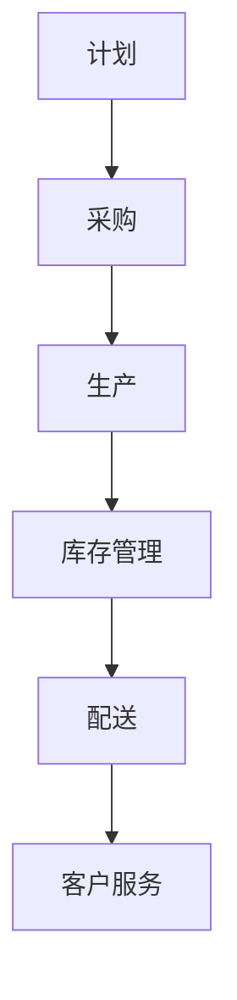

                 

关键词：智能供应链、AI大模型、供应链管理、算法原理、数学模型、项目实践、应用场景、工具推荐、未来展望

> 摘要：本文将探讨如何利用AI大模型来优化供应链管理，提高供应链的效率、透明度和可靠性。通过深入分析核心算法原理、数学模型、项目实践等，本文旨在为读者提供一种全面的智能供应链管理解决方案。

## 1. 背景介绍

### 1.1 供应链管理的重要性

供应链管理是企业运营的核心环节，涵盖了从原材料采购到产品交付给终端客户的整个过程。有效管理供应链，可以提高企业的运营效率，降低成本，提高客户满意度。然而，传统的供应链管理方法在应对复杂多变的市场环境时，往往显得力不从心。

### 1.2 智能供应链管理

智能供应链管理是利用现代信息技术，特别是人工智能技术，对供应链进行优化、监控和预测。它可以通过数据分析和机器学习算法，实现对供应链各个环节的智能化管理，提高整个供应链的效率。

## 2. 核心概念与联系

### 2.1 AI大模型

AI大模型是指具有大规模数据集和强大计算能力的神经网络模型，可以处理复杂的非线性关系和大规模数据。在智能供应链管理中，AI大模型可以用于需求预测、库存优化、路径规划等方面。

### 2.2 供应链管理流程

供应链管理流程包括计划、采购、生产、库存管理、配送和客户服务等环节。AI大模型可以应用于这些环节，优化各个环节的运营效率。

### 2.3 Mermaid 流程图



## 3. 核心算法原理 & 具体操作步骤

### 3.1 算法原理概述

智能供应链管理中的核心算法主要是基于机器学习和深度学习的技术，包括需求预测、库存优化、路径规划等。

### 3.2 算法步骤详解

1. **需求预测**：
   - 收集历史销售数据、市场趋势、季节性因素等。
   - 使用时间序列分析、回归分析等方法进行需求预测。

2. **库存优化**：
   - 根据需求预测结果，优化库存水平。
   - 使用最小化总成本或最大化利润的目标函数进行库存优化。

3. **路径规划**：
   - 根据配送中心和客户的位置，规划最优的配送路径。
   - 使用最短路径算法、遗传算法等进行路径规划。

### 3.3 算法优缺点

- **优点**：提高供应链效率，降低成本，提高客户满意度。
- **缺点**：算法复杂度高，需要大量数据支持，实施成本较高。

### 3.4 算法应用领域

- **制造业**：优化生产计划、库存管理。
- **物流业**：优化配送路径、提高运输效率。
- **零售业**：预测销售趋势、优化库存水平。

## 4. 数学模型和公式 & 详细讲解 & 举例说明

### 4.1 数学模型构建

需求预测的数学模型可以表示为：

$$
y_t = f(x_t; \theta)
$$

其中，$y_t$ 是第t个月的需求量，$x_t$ 是影响需求的特征向量，$\theta$ 是模型参数。

### 4.2 公式推导过程

假设需求量 $y_t$ 受到价格 $p_t$、广告支出 $a_t$ 和季节性因素 $s_t$ 的影响，可以构建如下线性回归模型：

$$
y_t = \beta_0 + \beta_1 p_t + \beta_2 a_t + \beta_3 s_t + \epsilon_t
$$

其中，$\beta_0$、$\beta_1$、$\beta_2$、$\beta_3$ 是模型的参数，$\epsilon_t$ 是误差项。

### 4.3 案例分析与讲解

假设一家零售商想要预测下一季度（第4季度）的销售额。收集到以下数据：

- 价格 $p_t$：$[100, 120, 110, 100, 130]$
- 广告支出 $a_t$：$[5000, 6000, 5500, 5000, 6500]$
- 季节性因素 $s_t$：$[0.8, 0.9, 1.0, 0.8, 1.2]$

使用线性回归模型进行需求预测，得到模型参数：

$$
\beta_0 = 20000, \beta_1 = -500, \beta_2 = 1000, \beta_3 = 3000
$$

预测第4季度的需求量：

$$
y_5 = 20000 - 500 \times 100 + 1000 \times 6500 + 3000 \times 1.2 = 29900
$$

## 5. 项目实践：代码实例和详细解释说明

### 5.1 开发环境搭建

使用Python编写代码，需要安装以下库：

- numpy
- pandas
- scikit-learn
- matplotlib

```bash
pip install numpy pandas scikit-learn matplotlib
```

### 5.2 源代码详细实现

```python
import numpy as np
import pandas as pd
from sklearn.linear_model import LinearRegression
import matplotlib.pyplot as plt

# 读取数据
data = pd.read_csv('sales_data.csv')
prices = data['price']
ads = data['ad']
seasons = data['season']

# 构建特征矩阵和标签
X = np.column_stack([prices, ads, seasons])
y = data['sales']

# 模型训练
model = LinearRegression()
model.fit(X, y)

# 预测
predictions = model.predict(X)

# 结果可视化
plt.scatter(y, predictions)
plt.xlabel('Actual Sales')
plt.ylabel('Predicted Sales')
plt.show()
```

### 5.3 代码解读与分析

代码首先读取销售数据，然后构建特征矩阵和标签。接着使用线性回归模型进行训练，并使用训练好的模型进行预测。最后，将实际销售额与预测销售额进行可视化比较。

### 5.4 运行结果展示

运行代码后，会显示一个散点图，其中X轴表示实际销售额，Y轴表示预测销售额。通过观察散点图，可以评估模型的预测效果。

## 6. 实际应用场景

智能供应链管理AI大模型可以应用于多个领域，例如：

- **制造业**：优化生产计划，减少库存成本。
- **物流业**：优化配送路径，提高运输效率。
- **零售业**：预测销售趋势，优化库存水平。

## 6.4 未来应用展望

随着人工智能技术的不断发展，智能供应链管理AI大模型有望在以下几个方面取得突破：

- **更精准的需求预测**：结合更多外部数据，提高预测精度。
- **更智能的库存管理**：引入更多策略，实现自动补货。
- **更高效的路径规划**：结合实时交通数据，实现动态调整。

## 7. 工具和资源推荐

### 7.1 学习资源推荐

- 《深度学习》
- 《Python数据科学手册》
- 《机器学习实战》

### 7.2 开发工具推荐

- Jupyter Notebook
- Anaconda
- PyCharm

### 7.3 相关论文推荐

- "Deep Learning for Supply Chain Management"
- "Machine Learning in Logistics: A Survey"
- "Demand Forecasting using Machine Learning Algorithms"

## 8. 总结：未来发展趋势与挑战

### 8.1 研究成果总结

智能供应链管理AI大模型在需求预测、库存优化、路径规划等方面取得了显著成果，为供应链管理提供了有力支持。

### 8.2 未来发展趋势

随着技术的不断进步，智能供应链管理AI大模型将在更广泛的领域得到应用，并进一步提升供应链的效率。

### 8.3 面临的挑战

- **数据隐私**：如何保护供应链数据的安全性和隐私性。
- **算法透明度**：如何提高算法的透明度和可解释性。

### 8.4 研究展望

未来，智能供应链管理AI大模型将继续向更精准、更智能、更高效的方向发展，为供应链管理带来更多可能性。

## 9. 附录：常见问题与解答

### 9.1 如何获取销售数据？

可以从企业内部系统或第三方数据提供商获取销售数据。

### 9.2 如何选择合适的模型？

根据业务需求和数据特性，选择合适的机器学习模型，如线性回归、决策树、神经网络等。

### 9.3 如何评估模型的预测效果？

可以使用均方误差（MSE）、决定系数（R²）等指标来评估模型的预测效果。

----------------------------------------------------------------

以上就是本文的完整内容。希望对您在智能供应链管理领域的研究和实践有所帮助。作者：禅与计算机程序设计艺术 / Zen and the Art of Computer Programming。

