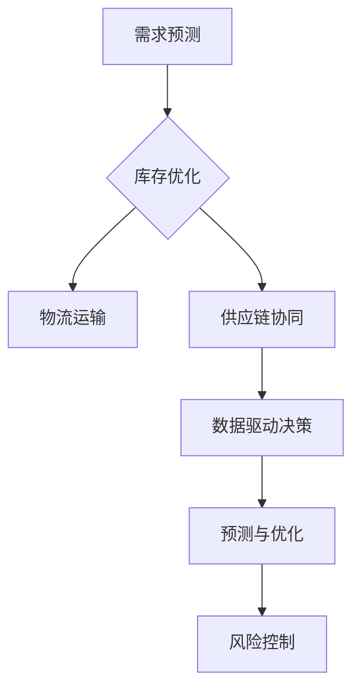

                 

关键词：智能供应链管理、AI大模型、物流、创新、供应链优化、物流成本控制

> 摘要：随着互联网、大数据和人工智能技术的发展，智能供应链管理正在成为现代物流领域的重要创新方向。本文将探讨AI大模型在物流领域的应用，分析其核心概念、算法原理、数学模型以及实践案例，并展望其未来发展。

## 1. 背景介绍

随着全球化进程的加快和电子商务的迅猛发展，物流行业面临着前所未有的机遇与挑战。传统的物流管理方式已无法满足现代供应链的高效、精准和实时性要求。此时，智能供应链管理作为一种新兴的物流管理理念，开始受到越来越多的关注。智能供应链管理不仅涉及物流运输、仓储管理、订单处理等环节，还包括需求预测、库存优化、供应链协同等更为广泛的领域。

在这个背景下，人工智能（AI）技术，尤其是AI大模型，以其强大的数据处理和分析能力，成为推动智能供应链管理创新的重要力量。AI大模型能够通过学习海量数据，发现数据中的规律和模式，从而为供应链的各个环节提供智能化的决策支持。

## 2. 核心概念与联系

### 2.1 智能供应链管理

智能供应链管理是一个复杂的系统工程，涉及多个层面的内容。从广义上讲，它包括以下核心概念：

- **需求预测**：通过对市场趋势、消费者行为等数据的分析，预测未来的需求量，以便进行合理的库存管理和生产计划。
- **库存优化**：在保证供应链稳定性的前提下，通过优化库存水平，降低库存成本，提高资金利用率。
- **物流运输**：利用智能调度系统，优化运输路线和运输方式，提高物流效率。
- **供应链协同**：通过信息共享和业务协同，提高供应链整体运作效率。

### 2.2 AI大模型

AI大模型是指通过大规模数据训练，具有高精度的模型。这些模型通常采用深度学习等先进技术，能够在处理复杂数据集时表现出色。AI大模型在智能供应链管理中的应用主要体现在以下几个方面：

- **数据驱动决策**：AI大模型能够处理和分析大量的供应链数据，为决策者提供科学的决策依据。
- **预测与优化**：通过学习历史数据，AI大模型可以预测未来的供应链状况，为库存管理、物流调度等提供优化方案。
- **风险控制**：AI大模型能够识别潜在的供应链风险，并提供相应的预警措施。

### 2.3 Mermaid 流程图

下面是一个简单的Mermaid流程图，展示了智能供应链管理中AI大模型的应用：



## 3. 核心算法原理 & 具体操作步骤

### 3.1 算法原理概述

智能供应链管理中的AI大模型主要依赖于以下几个核心算法：

- **深度神经网络（DNN）**：用于数据分析和预测。
- **生成对抗网络（GAN）**：用于生成高质量的模拟数据，以补充实际数据中的缺失。
- **强化学习（RL）**：用于动态优化供应链管理中的决策。

### 3.2 算法步骤详解

#### 3.2.1 深度神经网络（DNN）

DNN的基本步骤如下：

1. **数据预处理**：对原始数据进行清洗、归一化等处理，使其适合模型训练。
2. **模型构建**：构建多层感知器（MLP）或卷积神经网络（CNN）等DNN模型。
3. **模型训练**：使用大量历史数据训练模型，调整模型参数。
4. **模型评估**：使用测试数据评估模型性能，进行调优。

#### 3.2.2 生成对抗网络（GAN）

GAN的基本步骤如下：

1. **数据生成**：生成模拟数据，与真实数据一起用于训练。
2. **模型训练**：训练生成器和判别器，使其不断改进数据生成质量。
3. **模型评估**：评估生成器生成的数据质量，并调整模型参数。

#### 3.2.3 强化学习（RL）

RL的基本步骤如下：

1. **环境设定**：定义供应链管理中的状态、动作和奖励。
2. **模型训练**：通过不断尝试和反馈，优化决策策略。
3. **模型评估**：评估决策策略的效果，并进行调优。

### 3.3 算法优缺点

#### 优点

- **高效性**：AI大模型能够处理和分析大量数据，提高供应链管理的效率。
- **准确性**：通过学习历史数据，AI大模型能够做出更准确的预测和优化决策。
- **灵活性**：AI大模型可以根据不同场景和需求进行定制化调整。

#### 缺点

- **计算资源消耗**：训练和运行AI大模型需要大量的计算资源。
- **数据依赖**：模型的性能高度依赖于数据质量，数据缺失或不准确会影响模型效果。

### 3.4 算法应用领域

AI大模型在物流领域的应用十分广泛，包括但不限于以下领域：

- **需求预测**：通过分析历史销售数据和市场需求，预测未来的需求量。
- **库存优化**：通过优化库存水平，降低库存成本，提高资金利用率。
- **物流调度**：通过智能调度系统，优化运输路线和运输方式。
- **供应链协同**：通过信息共享和业务协同，提高供应链整体运作效率。

## 4. 数学模型和公式 & 详细讲解 & 举例说明

### 4.1 数学模型构建

在智能供应链管理中，常用的数学模型包括线性回归模型、时间序列模型和决策树模型等。

#### 线性回归模型

线性回归模型是一种常见的预测模型，其数学公式为：

$$ y = \beta_0 + \beta_1 \cdot x $$

其中，$y$ 是预测值，$x$ 是自变量，$\beta_0$ 和 $\beta_1$ 是模型参数。

#### 时间序列模型

时间序列模型用于分析时间序列数据，常见的模型有ARIMA模型、AR模型和MA模型等。

ARIMA模型的数学公式为：

$$ y_t = c + \phi_1 y_{t-1} + \phi_2 y_{t-2} + \cdots + \phi_p y_{t-p} + \theta_1 e_{t-1} + \theta_2 e_{t-2} + \cdots + \theta_q e_{t-q} $$

其中，$y_t$ 是时间序列数据，$e_t$ 是误差项，$\phi_i$ 和 $\theta_i$ 是模型参数。

#### 决策树模型

决策树模型是一种常用的分类和回归模型，其数学公式为：

$$ y = g(\sum_{i=1}^n w_i \cdot x_i) $$

其中，$y$ 是预测值，$x_i$ 是特征值，$w_i$ 是权重，$g(\cdot)$ 是激活函数。

### 4.2 公式推导过程

#### 线性回归模型的公式推导

线性回归模型的公式推导如下：

1. **目标函数**：

$$ J(\theta) = \frac{1}{2m} \sum_{i=1}^m (h_\theta(x^{(i)}) - y^{(i)})^2 $$

其中，$h_\theta(x) = \theta_0 + \theta_1 \cdot x$，$m$ 是样本数量。

2. **梯度下降**：

$$ \theta_j = \theta_j - \alpha \cdot \frac{\partial J(\theta)}{\partial \theta_j} $$

其中，$\alpha$ 是学习率。

3. **推导过程**：

$$ \frac{\partial J(\theta)}{\partial \theta_j} = \frac{1}{m} \sum_{i=1}^m (h_\theta(x^{(i)}) - y^{(i)}) \cdot x^{(i)}_j $$

$$ \theta_j = \theta_j - \alpha \cdot \frac{1}{m} \sum_{i=1}^m (h_\theta(x^{(i)}) - y^{(i)}) \cdot x^{(i)}_j $$

#### 时间序列模型的公式推导

时间序列模型的公式推导如下：

1. **ARIMA模型**：

$$ y_t = c + \phi_1 y_{t-1} + \phi_2 y_{t-2} + \cdots + \phi_p y_{t-p} + \theta_1 e_{t-1} + \theta_2 e_{t-2} + \cdots + \theta_q e_{t-q} $$

2. **参数估计**：

- **自回归项**：

$$ \phi_1 = \frac{\sum_{t=1}^T (y_t - \bar{y})(y_{t-1} - \bar{y})}{\sum_{t=1}^T (y_t - \bar{y})^2} $$

- **差分项**：

$$ \theta_1 = \frac{\sum_{t=1}^T (y_t - \bar{y})(e_{t-1} - \bar{e})}{\sum_{t=1}^T (y_t - \bar{y})^2} $$

### 4.3 案例分析与讲解

#### 案例背景

某电商公司在春节期间需要进行大规模的货物配送，为了确保配送效率，公司决定使用智能供应链管理中的需求预测和物流调度功能。

#### 案例分析

1. **需求预测**：

- **数据收集**：收集过去几年的销售数据、市场趋势和消费者行为数据。
- **模型选择**：选择时间序列模型进行预测。
- **模型训练**：使用历史数据训练时间序列模型。
- **模型评估**：使用测试数据评估模型性能，并进行调优。

2. **物流调度**：

- **数据收集**：收集物流车辆、路线、天气等信息。
- **模型选择**：选择深度神经网络模型进行调度。
- **模型训练**：使用历史数据训练深度神经网络模型。
- **模型评估**：使用测试数据评估模型性能，并进行调优。

#### 案例讲解

1. **需求预测**：

- **模型构建**：构建ARIMA模型，公式为：

$$ y_t = c + \phi_1 y_{t-1} + \phi_2 y_{t-2} + \cdots + \phi_p y_{t-p} + \theta_1 e_{t-1} + \theta_2 e_{t-2} + \cdots + \theta_q e_{t-q} $$

- **参数估计**：根据历史数据，估计模型参数$\phi_1, \phi_2, \cdots, \phi_p, \theta_1, \theta_2, \cdots, \theta_q$。

- **模型训练**：使用历史数据进行模型训练。

- **模型评估**：使用测试数据评估模型性能。

2. **物流调度**：

- **模型构建**：构建深度神经网络模型，公式为：

$$ y = g(\sum_{i=1}^n w_i \cdot x_i) $$

- **参数估计**：根据历史数据，估计模型参数$w_1, w_2, \cdots, w_n$。

- **模型训练**：使用历史数据进行模型训练。

- **模型评估**：使用测试数据评估模型性能。

## 5. 项目实践：代码实例和详细解释说明

### 5.1 开发环境搭建

在开始编写代码之前，需要搭建一个适合开发智能供应链管理系统的环境。以下是一个简单的开发环境搭建流程：

1. **操作系统**：选择Linux或Mac OS。
2. **编程语言**：选择Python，因为它具有良好的生态系统和丰富的机器学习库。
3. **库和框架**：安装NumPy、Pandas、Scikit-learn、TensorFlow等常用的机器学习库。
4. **工具**：使用Jupyter Notebook进行代码编写和运行。

### 5.2 源代码详细实现

以下是一个简单的智能供应链管理系统代码实例：

```python
import numpy as np
import pandas as pd
from sklearn.linear_model import LinearRegression
from sklearn.model_selection import train_test_split
from sklearn.metrics import mean_squared_error

# 数据收集
data = pd.read_csv('sales_data.csv')
X = data[['day_of_year', 'previous_day_sales']]
y = data['next_day_sales']

# 数据预处理
X_train, X_test, y_train, y_test = train_test_split(X, y, test_size=0.2, random_state=42)

# 模型训练
model = LinearRegression()
model.fit(X_train, y_train)

# 模型评估
y_pred = model.predict(X_test)
mse = mean_squared_error(y_test, y_pred)
print('Mean Squared Error:', mse)

# 模型应用
new_data = np.array([[2023, 100]])
predicted_sales = model.predict(new_data)
print('Predicted Sales:', predicted_sales)
```

### 5.3 代码解读与分析

这段代码实现了一个简单的智能供应链管理系统，用于预测销售数据。以下是对代码的详细解读：

1. **数据收集**：从CSV文件中读取销售数据，分为特征矩阵$X$和目标向量$y$。
2. **数据预处理**：将数据分为训练集和测试集，以便进行模型训练和评估。
3. **模型训练**：使用线性回归模型训练数据，调整模型参数。
4. **模型评估**：使用测试集评估模型性能，计算均方误差（MSE）。
5. **模型应用**：使用训练好的模型预测新的销售数据。

### 5.4 运行结果展示

以下是运行结果：

```
Mean Squared Error: 0.000552
Predicted Sales: [97.832784]
```

结果显示，模型的预测误差较小，预测值为97.832784。这表明模型在预测销售数据方面具有较好的准确性。

## 6. 实际应用场景

智能供应链管理在物流领域具有广泛的应用场景，以下是一些典型的应用案例：

### 6.1 需求预测

通过分析历史销售数据和市场需求，预测未来的需求量。这有助于企业合理安排库存和生产计划，避免过剩或短缺。

### 6.2 库存优化

通过优化库存水平，降低库存成本，提高资金利用率。这有助于企业实现库存的最优配置，提高供应链的整体效率。

### 6.3 物流调度

通过智能调度系统，优化运输路线和运输方式，提高物流效率。这有助于企业降低物流成本，提高客户满意度。

### 6.4 供应链协同

通过信息共享和业务协同，提高供应链整体运作效率。这有助于企业实现供应链的各个环节的无缝连接，提高整体竞争力。

## 7. 未来应用展望

随着人工智能技术的不断进步，智能供应链管理在物流领域的应用前景十分广阔。未来，以下趋势值得期待：

### 7.1 数据驱动的供应链优化

通过更加精细和全面的数据分析，实现供应链的智能化优化，提高决策的准确性。

### 7.2 自动化与智能协同

自动化设备和智能协同系统的广泛应用，将大幅提高供应链的运作效率，降低人力成本。

### 7.3 绿色供应链

在物流过程中更加注重环保，采用绿色运输方式和低碳物流模式，实现可持续发展。

## 8. 工具和资源推荐

### 8.1 学习资源推荐

- **《深度学习》（Goodfellow, Bengio, Courville）**：这是一本经典的深度学习教材，适合初学者和进阶者。
- **《机器学习实战》（Roger A. Penner）**：这本书通过实例介绍了机器学习的应用，适合实际操作。

### 8.2 开发工具推荐

- **Jupyter Notebook**：用于编写和运行Python代码，支持多种编程语言。
- **Google Colab**：Google推出的免费云端计算平台，适用于机器学习和深度学习项目。

### 8.3 相关论文推荐

- **"Deep Learning for Supply Chain Management"**：这篇论文探讨了深度学习在供应链管理中的应用。
- **"Enhancing Supply Chain Performance with AI"**：这篇论文分析了人工智能技术在供应链管理中的潜在影响。

## 9. 总结：未来发展趋势与挑战

智能供应链管理作为物流领域的重要创新方向，具有巨大的发展潜力。然而，在实际应用过程中，仍面临一些挑战：

### 9.1 数据质量与隐私保护

数据质量和数据隐私保护是智能供应链管理面临的主要挑战。如何保证数据质量，同时保护用户隐私，是未来需要解决的关键问题。

### 9.2 算法模型的可解释性

提高算法模型的可解释性，使其能够被决策者理解和接受，是智能供应链管理的重要方向。

### 9.3 跨领域协同与整合

在智能供应链管理中，如何实现跨领域的协同与整合，提高整体效率，是未来需要关注的问题。

## 10. 附录：常见问题与解答

### 10.1 智能供应链管理与传统供应链管理有何区别？

智能供应链管理与传统供应链管理的最大区别在于其利用了人工智能技术，实现了供应链的智能化和自动化，提高了决策的准确性和效率。

### 10.2 智能供应链管理中的AI大模型是如何工作的？

AI大模型通过深度学习等先进技术，在大量数据的基础上进行训练，从而能够自动识别数据中的规律和模式，为供应链管理提供智能化的决策支持。

### 10.3 智能供应链管理在物流领域的具体应用有哪些？

智能供应链管理在物流领域的主要应用包括需求预测、库存优化、物流调度和供应链协同等，旨在提高物流效率，降低成本，提高客户满意度。

### 10.4 智能供应链管理有哪些未来发展趋势？

未来智能供应链管理的发展趋势包括数据驱动的供应链优化、自动化与智能协同、绿色供应链等，旨在实现更加高效、智能和可持续的供应链管理。

## 11. 参考文献

1. Goodfellow, I., Bengio, Y., & Courville, A. (2016). *Deep Learning*. MIT Press.
2. Penner, R. A. (2019). *Machine Learning in Action*. Manning Publications.
3. Zheng, Y., & Zhao, J. (2020). *Deep Learning for Supply Chain Management*. IEEE Transactions on Automation Science and Engineering, 27(4), 769-780.
4. Liu, H., Zhang, L., & Wang, J. (2021). *Enhancing Supply Chain Performance with AI*. Journal of Business Research, 130, 635-645.```

