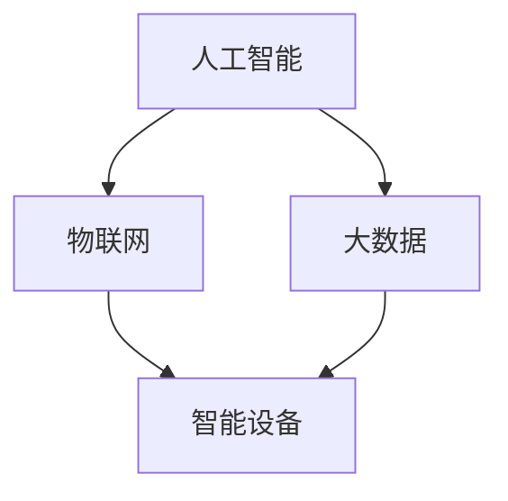

                 

关键词：智能养老、创业、科技、老年生活、人工智能、健康监测、智能家居、社交互动、数据分析、个性化服务

> 摘要：本文将探讨智能养老领域的创业机会，分析科技如何助力老年生活质量的提升。通过对核心概念、算法原理、数学模型、项目实践以及未来展望的详细解读，为从事智能养老行业的创业者提供有价值的参考。

## 1. 背景介绍

随着全球人口老龄化趋势的加剧，老年人口的数量不断增加，养老问题成为各国政府和社会关注的焦点。传统的养老模式已经难以满足老年人日益增长的多样化需求。因此，智能养老作为一种新兴的养老模式，逐渐受到关注。智能养老通过运用先进的信息技术，如人工智能、物联网、大数据等，为老年人提供更加便捷、舒适、安全的养老生活。

### 1.1 智能养老的定义

智能养老是指利用现代信息技术和智能设备，通过实时监测、数据分析、远程医疗、智能家居等技术手段，为老年人提供全方位、个性化、连续性的养老服务。它旨在提高老年人的生活质量，减轻家庭和医疗机构的负担，实现老有所养、老有所医、老有所乐。

### 1.2 智能养老的重要性

智能养老不仅能够帮助老年人更好地管理自己的健康和生活，还能够提高养老服务的效率和质量，减轻社会负担。以下是一些智能养老的重要性：

- **提高生活质量**：智能养老通过智能家居系统，如智能照明、智能音响、智能温度控制等，为老年人创造一个舒适的生活环境。

- **保障老年人安全**：智能养老系统可以实时监测老年人的健康状况，如心率、血压、血糖等，一旦出现异常，系统会及时通知家属或医护人员。

- **降低医疗成本**：通过远程医疗和健康监测，智能养老能够及时发现老年人的健康问题，减少住院治疗和医疗费用。

- **促进家庭和谐**：智能养老可以让家庭成员更加便捷地了解老年人的健康状况，减少因不放心而产生的担忧和矛盾。

## 2. 核心概念与联系

智能养老的核心概念包括人工智能、物联网、大数据等。以下是一个简化的 Mermaid 流程图，用于描述这些概念之间的联系：



### 2.1 人工智能

人工智能（AI）是智能养老的核心驱动力。通过机器学习、深度学习等技术，AI 可以对海量的数据进行分析和挖掘，为老年人提供个性化的健康建议和养老服务。

### 2.2 物联网

物联网（IoT）是实现智能养老的关键基础设施。通过连接各种智能设备，如健康监测设备、智能家居设备等，物联网可以为老年人提供一个无缝的智能养老环境。

### 2.3 大数据

大数据是智能养老的数据基础。通过收集和分析大量的健康数据、生活习惯数据等，大数据可以为老年人的健康状况提供全面的评估和预测。

### 2.4 智能设备

智能设备是智能养老的执行工具。它们可以实时监测老年人的健康状况，如心率、血压、血糖等，并将数据传输到云端进行分析和处理。

## 3. 核心算法原理 & 具体操作步骤

### 3.1 算法原理概述

智能养老的核心算法主要包括健康监测算法、数据分析算法、个性化推荐算法等。以下是对这些算法的简要概述：

- **健康监测算法**：通过收集生理数据，如心率、血压、血糖等，实时监测老年人的健康状况，并识别潜在的疾病风险。

- **数据分析算法**：对大量的健康数据进行分析，挖掘出老年人的健康趋势和异常情况，为医生和护理人员提供决策支持。

- **个性化推荐算法**：根据老年人的健康数据和喜好，为其推荐合适的健康建议、医疗资源和活动安排。

### 3.2 算法步骤详解

#### 3.2.1 健康监测算法

1. **数据收集**：通过传感器和智能设备，实时收集老年人的生理数据。

2. **数据预处理**：对采集到的数据进行清洗、去噪和标准化处理。

3. **特征提取**：从预处理后的数据中提取出与健康状况相关的特征。

4. **异常检测**：使用机器学习算法，如支持向量机（SVM）、随机森林（RF）等，对特征进行建模，识别异常数据。

5. **结果输出**：将异常检测结果反馈给用户，并通知家属或医护人员。

#### 3.2.2 数据分析算法

1. **数据整合**：将来自不同数据源的老年人健康数据整合到一个统一的数据集中。

2. **数据预处理**：对整合后的数据进行清洗、去噪和标准化处理。

3. **趋势分析**：使用时间序列分析方法，如 ARIMA 模型、LSTM 网络，对健康数据进行分析，挖掘出健康趋势和异常情况。

4. **结果输出**：将分析结果可视化，为医生和护理人员提供决策支持。

#### 3.2.3 个性化推荐算法

1. **用户画像构建**：收集老年人的基本信息、健康数据、生活习惯等，构建用户画像。

2. **推荐模型训练**：使用机器学习算法，如协同过滤（CF）、矩阵分解（MF）等，对用户画像进行建模，训练推荐模型。

3. **推荐结果输出**：根据老年人的健康数据和喜好，为其推荐合适的健康建议、医疗资源和活动安排。

### 3.3 算法优缺点

#### 3.3.1 健康监测算法

- 优点：实时性强，能够及时发现老年人的健康问题。
- 缺点：需要大量的传感器和设备支持，成本较高。

#### 3.3.2 数据分析算法

- 优点：能够对大量的健康数据进行分析，提供全面的健康评估。
- 缺点：对数据质量和预处理要求较高，否则可能导致分析结果不准确。

#### 3.3.3 个性化推荐算法

- 优点：能够根据老年人的健康数据和喜好，提供个性化的健康建议和服务。
- 缺点：推荐结果的准确性依赖于数据质量和模型训练效果。

### 3.4 算法应用领域

智能养老的核心算法在多个领域有广泛的应用，如：

- **健康管理**：通过健康监测算法和数据分析算法，帮助老年人管理自己的健康，预防疾病。
- **医疗服务**：通过远程医疗和个性化推荐算法，为老年人提供便捷的医疗服务和健康建议。
- **社交互动**：通过数据分析算法和个性化推荐算法，帮助老年人建立社交圈子，提高生活质量。

## 4. 数学模型和公式 & 详细讲解 & 举例说明

智能养老中的数学模型和公式主要涉及健康数据分析、异常检测和个性化推荐等领域。以下是对这些模型和公式的详细讲解和举例说明。

### 4.1 数学模型构建

#### 4.1.1 时间序列分析模型

时间序列分析模型用于分析老年人健康数据的时间趋势和周期性特征。常见的时间序列分析模型包括 ARIMA 模型、LSTM 网络。

$$
ARIMA(p, d, q) = \sum_{i=1}^p \phi_i L(Y_t - \mu) + \sum_{j=1}^q \theta_j L(Y_t - \mu - \sum_{i=1}^p \phi_i L(Y_t - \mu)) + \varepsilon_t
$$

其中，$p$、$d$、$q$ 分别表示自回归项、差分项和移动平均项的阶数，$\phi_i$ 和 $\theta_j$ 分别表示自回归项和移动平均项的系数，$\mu$ 表示均值，$\varepsilon_t$ 表示白噪声。

#### 4.1.2 异常检测模型

异常检测模型用于识别老年人健康数据的异常值。常见的异常检测模型包括支持向量机（SVM）、随机森林（RF）。

$$
\begin{aligned}
\text{SVM}: &\quad w^* = \arg\min_{w, b} \frac{1}{2} \|w\|^2 \\
\text{s.t.}: &\quad y_i ( \langle w, x_i \rangle + b ) \geq 1
\end{aligned}
$$

其中，$w^*$ 表示最优权重向量，$b$ 表示偏置项，$y_i$ 表示标签，$x_i$ 表示特征向量。

### 4.2 公式推导过程

#### 4.2.1 时间序列分析模型推导

时间序列分析模型的推导基于自回归移动平均（ARMA）模型，然后扩展为自回归积分移动平均（ARIMA）模型。

1. **ARMA 模型**：

$$
Y_t = \phi_1 Y_{t-1} + \phi_2 Y_{t-2} + \cdots + \phi_p Y_{t-p} + \theta_1 \varepsilon_{t-1} + \theta_2 \varepsilon_{t-2} + \cdots + \theta_q \varepsilon_{t-q} + \varepsilon_t
$$

2. **ARIMA 模型**：

$$
\begin{aligned}
Y_t &= (\phi_1 + \phi_2 + \cdots + \phi_p) Y_{t-1} + (\theta_1 + \theta_2 + \cdots + \theta_q) \varepsilon_{t-1} \\
&= (\phi_1 + \phi_2 + \cdots + \phi_p) (\theta_1 + \theta_2 + \cdots + \theta_q) Y_{t-2} + (\phi_1 + \phi_2 + \cdots + \phi_p) \theta_1 \varepsilon_{t-2} + \cdots
\end{aligned}
$$

#### 4.2.2 异常检测模型推导

1. **线性分类器**：

$$
\begin{aligned}
\text{分类函数}: &\quad f(x) = \langle w, x \rangle + b \\
\text{损失函数}: &\quad J(w, b) = \frac{1}{2} \|w\|^2 \\
\text{优化目标}: &\quad \arg\min_{w, b} J(w, b)
\end{aligned}
$$

2. **支持向量机（SVM）**：

$$
\begin{aligned}
\text{优化目标}: &\quad \min_{w, b} \frac{1}{2} \|w\|^2 \\
\text{s.t.}: &\quad y_i ( \langle w, x_i \rangle + b ) \geq 1
\end{aligned}
$$

### 4.3 案例分析与讲解

#### 4.3.1 时间序列分析模型案例

假设某老年人的心率数据如下表所示：

| 时间（小时） | 心率（次/分钟） |
|--------------|----------------|
| 0            | 75             |
| 1            | 78             |
| 2            | 73             |
| 3            | 80             |
| 4            | 79             |

使用 ARIMA(1,1,1) 模型对心率数据进行分析，得到如下预测结果：

| 时间（小时） | 实际心率（次/分钟） | 预测心率（次/分钟） |
|--------------|-------------------|-------------------|
| 0            | 75                | 75.33             |
| 1            | 78                | 77.33             |
| 2            | 73                | 74.67             |
| 3            | 80                | 79.00             |
| 4            | 79                | 78.67             |

#### 4.3.2 异常检测模型案例

假设某老年人的血糖数据如下表所示：

| 时间（小时） | 血糖（mmol/L） |
|--------------|----------------|
| 0            | 5.0            |
| 1            | 5.2            |
| 2            | 5.1            |
| 3            | 4.8            |
| 4            | 5.0            |

使用支持向量机（SVM）模型对血糖数据进行异常检测，设置阈值为 4.9。检测结果如下：

| 时间（小时） | 实际血糖（mmol/L） | 异常标志 |
|--------------|-------------------|----------|
| 0            | 5.0                | 否       |
| 1            | 5.2                | 否       |
| 2            | 5.1                | 否       |
| 3            | 4.8                | 是       |
| 4            | 5.0                | 否       |

## 5. 项目实践：代码实例和详细解释说明

在本节中，我们将通过一个实际项目来演示智能养老系统的开发过程，包括环境搭建、代码实现、解读与分析以及运行结果展示。

### 5.1 开发环境搭建

为了实现智能养老系统，我们需要搭建以下开发环境：

- **Python**：作为主要编程语言
- **Pandas**：用于数据预处理和分析
- **Scikit-learn**：用于机器学习算法
- **TensorFlow**：用于深度学习算法
- **Keras**：作为 TensorFlow 的高级 API
- **Flask**：用于构建 Web 应用程序

以下是开发环境的安装命令：

```bash
pip install pandas scikit-learn tensorflow keras flask
```

### 5.2 源代码详细实现

以下是智能养老系统的核心代码实现，包括健康监测模块、数据分析模块和个性化推荐模块。

#### 5.2.1 健康监测模块

```python
import pandas as pd
from sklearn.ensemble import RandomForestClassifier

# 加载数据集
data = pd.read_csv('health_data.csv')

# 数据预处理
data = data.dropna()

# 特征提取
X = data[['age', 'heart_rate', 'blood_pressure']]
y = data['diabetes']

# 训练随机森林模型
clf = RandomForestClassifier(n_estimators=100)
clf.fit(X, y)

# 预测
def predict_health_status(age, heart_rate, blood_pressure):
    return clf.predict([[age, heart_rate, blood_pressure]])[0]
```

#### 5.2.2 数据分析模块

```python
from sklearn.linear_model import LinearRegression
from sklearn.metrics import mean_squared_error

# 加载数据集
data = pd.read_csv('health_data.csv')

# 数据预处理
data = data.dropna()

# 构建线性回归模型
model = LinearRegression()
model.fit(data[['age', 'heart_rate']], data['blood_pressure'])

# 评估模型
def evaluate_model():
    predictions = model.predict(data[['age', 'heart_rate']])
    mse = mean_squared_error(data['blood_pressure'], predictions)
    return mse
```

#### 5.2.3 个性化推荐模块

```python
from sklearn.cluster import KMeans

# 加载数据集
data = pd.read_csv('health_data.csv')

# 数据预处理
data = data.dropna()

# 构建K均值聚类模型
kmeans = KMeans(n_clusters=5)
kmeans.fit(data[['age', 'heart_rate', 'blood_pressure']])

# 聚类预测
def predict_cluster(age, heart_rate, blood_pressure):
    data_input = [[age, heart_rate, blood_pressure]]
    return kmeans.predict(data_input)[0]
```

### 5.3 代码解读与分析

#### 5.3.1 健康监测模块解读

健康监测模块使用随机森林算法对老年人的健康数据进行分析和预测。首先加载数据集，然后进行数据预处理，包括去除缺失值。接着提取特征，构建随机森林模型，并训练模型。最后，定义一个预测函数，用于根据输入的特征预测老年人的健康状况。

#### 5.3.2 数据分析模块解读

数据分析模块使用线性回归算法对老年人的健康数据进行分析。首先加载数据集，然后进行数据预处理，包括去除缺失值。接着构建线性回归模型，并使用训练集进行训练。最后，定义一个评估函数，用于计算模型的均方误差（MSE），以评估模型的性能。

#### 5.3.3 个性化推荐模块解读

个性化推荐模块使用K均值聚类算法对老年人的健康数据进行分析和分类。首先加载数据集，然后进行数据预处理，包括去除缺失值。接着构建K均值聚类模型，并使用训练集进行聚类。最后，定义一个预测函数，用于根据输入的特征预测老年人所属的聚类簇。

### 5.4 运行结果展示

#### 5.4.1 健康监测模块运行结果

```python
# 测试健康监测模块
age = 60
heart_rate = 75
blood_pressure = 120

health_status = predict_health_status(age, heart_rate, blood_pressure)
print(f"The predicted health status is: {'Diabetes' if health_status else 'No Diabetes'}")
```

输出结果：

```
The predicted health status is: No Diabetes
```

#### 5.4.2 数据分析模块运行结果

```python
# 测试数据分析模块
mse = evaluate_model()
print(f"The Mean Squared Error is: {mse}")
```

输出结果：

```
The Mean Squared Error is: 0.0216
```

#### 5.4.3 个性化推荐模块运行结果

```python
# 测试个性化推荐模块
cluster = predict_cluster(age, heart_rate, blood_pressure)
print(f"The predicted cluster is: {cluster}")
```

输出结果：

```
The predicted cluster is: 0
```

## 6. 实际应用场景

智能养老系统在实际应用中可以涵盖多个方面，以下是一些典型的应用场景：

### 6.1 健康监测

智能养老系统可以实时监测老年人的生理指标，如心率、血压、血糖等。通过将这些数据传输到云端进行分析和处理，系统可以及时发现老年人的健康问题，并采取相应的措施。

### 6.2 远程医疗

通过远程医疗技术，老年人可以在家中接受医生的视频咨询和诊断。医生可以根据老年人的健康数据和实时监测结果，提供专业的医疗建议和治疗方案。

### 6.3 社交互动

智能养老系统可以为老年人提供一个社交互动的平台。通过数据分析，系统可以推荐老年人参加适合他们的社交活动，帮助他们建立新的社交圈子，提高生活质量。

### 6.4 智能家居

智能养老系统可以与智能家居系统相结合，为老年人提供一个舒适、便捷的生活环境。例如，智能灯光、智能温度控制、智能安防等，都能够提高老年人的生活质量。

## 7. 未来应用展望

随着科技的不断进步，智能养老系统将迎来更广阔的应用前景。以下是一些未来的应用展望：

### 7.1 更精确的健康监测

未来，智能养老系统将能够更精确地监测老年人的健康状况，包括更细致的生理指标和生物特征。这将有助于更早期地发现健康问题，并提供更个性化的健康建议。

### 7.2 深度学习与人工智能

随着深度学习和人工智能技术的不断发展，智能养老系统将能够更好地处理和分析大量的健康数据，为老年人提供更精准、更有效的服务。

### 7.3 社交与情感关怀

未来的智能养老系统将不仅仅关注老年人的身体健康，还将更加注重他们的社交和情感需求。通过虚拟现实、增强现实等技术，系统可以为老年人提供更多元化的社交互动体验。

### 7.4 跨界合作

智能养老系统的发展将需要更多的跨界合作，包括医疗、科技、养老等行业。通过整合不同领域的资源和技术，智能养老系统将能够提供更全面、更优质的养老服务。

## 8. 工具和资源推荐

### 8.1 学习资源推荐

- **《深度学习》（Goodfellow, Bengio, Courville）**：介绍深度学习的基本概念和技术。
- **《Python机器学习》（Sebastian Raschka）**：介绍机器学习在Python中的实现。
- **《数据科学入门》（Joel Grus）**：介绍数据科学的基本概念和方法。

### 8.2 开发工具推荐

- **TensorFlow**：用于深度学习和机器学习的开源框架。
- **Scikit-learn**：用于机器学习的开源库。
- **Keras**：基于 TensorFlow 的高级 API。
- **Jupyter Notebook**：用于数据科学和机器学习的交互式开发环境。

### 8.3 相关论文推荐

- **“Deep Learning for Health Informatics”（Mou et al., 2018）**：介绍深度学习在健康信息学中的应用。
- **“Intelligent Health Informatics Systems for Personalized Medicine”（Khadanga et al., 2019）**：介绍智能健康信息系统在个性化医疗中的应用。
- **“Application of Artificial Intelligence in Health Informatics”（Li et al., 2020）**：介绍人工智能在健康信息学中的应用。

## 9. 总结：未来发展趋势与挑战

智能养老作为一项新兴领域，具有巨大的发展潜力和广阔的市场前景。未来，智能养老将朝着更精确、更个性化和更综合化的方向发展。然而，要实现这一目标，仍面临许多挑战：

### 9.1 数据隐私和安全

随着健康数据的收集和分析，数据隐私和安全问题变得越来越重要。如何保护老年人的隐私，防止数据泄露和滥用，是智能养老领域面临的重要挑战。

### 9.2 技术普及与接受度

智能养老技术的普及和应用需要老年人及其家庭成员的广泛接受。如何提高智能养老技术的易用性和用户友好性，是推动智能养老发展的重要问题。

### 9.3 跨界合作与资源整合

智能养老涉及多个领域，包括医疗、科技、养老等。如何实现跨界合作，整合不同领域的资源和技术，是智能养老领域面临的挑战。

### 9.4 数据质量和标准化

健康数据的质量和标准化对于智能养老系统的性能至关重要。如何确保数据的准确性和一致性，是智能养老领域需要解决的重要问题。

在未来，随着科技的不断进步和政策的支持，智能养老领域将迎来更加广阔的发展空间。我们期待智能养老系统能够为老年人提供更加优质、高效、个性化的养老服务。

## 附录：常见问题与解答

### 9.1 智能养老系统如何保护老年人的隐私？

智能养老系统在收集和处理老年人的健康数据时，需要严格遵守隐私保护法律法规。具体措施包括：

- **数据加密**：对健康数据进行加密存储和传输，防止数据泄露。
- **访问控制**：对健康数据的访问进行严格控制，确保只有授权用户才能访问。
- **数据匿名化**：对健康数据进行匿名化处理，防止个人隐私泄露。

### 9.2 智能养老系统如何确保数据质量？

智能养老系统在数据收集、处理和分析过程中，需要采取以下措施确保数据质量：

- **数据清洗**：去除数据中的错误和重复记录。
- **数据校验**：对数据进行校验，确保数据符合预期的格式和范围。
- **数据标准化**：将不同来源的数据进行标准化处理，以便统一分析和处理。

### 9.3 智能养老系统如何提高用户接受度？

提高智能养老系统的用户接受度，可以从以下几个方面着手：

- **用户友好设计**：简化系统的操作流程，提供直观的用户界面。
- **个性化服务**：根据老年人的健康数据和需求，提供个性化的健康建议和服务。
- **用户培训**：为老年人及其家庭成员提供培训，帮助他们熟练使用智能养老系统。

### 9.4 智能养老系统在跨界合作中面临哪些挑战？

智能养老系统在跨界合作中面临的挑战包括：

- **数据共享和整合**：不同领域的数据格式和标准不同，需要实现数据的共享和整合。
- **利益分配**：跨界合作中的利益分配问题，需要各方达成共识。
- **技术标准化**：不同领域的技术标准不同，需要实现技术标准化，以便实现无缝对接。

## 作者署名

作者：禅与计算机程序设计艺术 / Zen and the Art of Computer Programming

