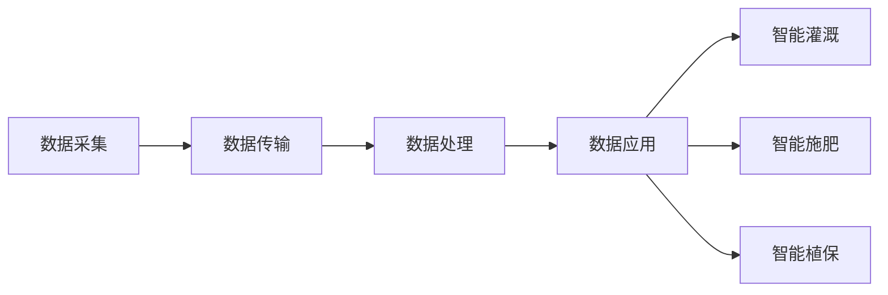

                 

关键词：智能农业、科技创新、创业、产业升级、数字化转型

摘要：随着科技的飞速发展，智能农业逐渐成为传统农业产业转型升级的新动力。本文将深入探讨智能农业的创业机遇，以及科技在农业领域中的实际应用，旨在为创业者提供有益的参考。

## 1. 背景介绍

农业，作为国民经济的基础产业，自古以来就扮演着重要的角色。然而，传统的农业生产模式面临着生产效率低、资源利用率低、环境污染等问题。随着科技的不断进步，尤其是信息技术的迅猛发展，智能农业逐渐成为农业产业升级的新方向。

智能农业，指的是通过物联网、大数据、云计算、人工智能等先进技术，对农业生产过程中的各种信息进行实时监测、分析和管理，从而提高农业生产效率、降低生产成本、减少环境污染。智能农业的兴起，不仅能够解决传统农业的种种问题，还为创业者提供了广阔的舞台。

### 1.1 智能农业的现状

根据国际农业发展基金会的数据，全球农业领域的技术应用率已经超过50%，其中智能农业的应用比例逐年上升。在美国、欧洲等发达国家，智能农业已经初具规模，大量农业生产企业开始采用智能技术进行生产管理。

在中国，智能农业的发展也取得了显著成果。据农业农村部数据显示，截至2022年底，全国智能农业技术应用面积已超过2亿亩，智能灌溉、智能施肥、智能植保等技术得到了广泛应用。此外，我国政府也高度重视智能农业的发展，出台了一系列政策措施，为智能农业的创业创新提供了良好的环境。

### 1.2 智能农业的创业机遇

智能农业的兴起，为创业者提供了诸多机遇。以下是几个潜在的创业方向：

1. **智能农业设备研发**：随着智能技术的不断发展，智能农业设备的需求不断增加。创业者可以研发各种智能农业设备，如智能灌溉系统、智能施肥机、智能植保无人机等。

2. **农业大数据平台**：通过对农业生产数据的收集、分析和应用，可以为企业提供精准的农业管理服务。创业者可以打造农业大数据平台，为农业生产企业提供数据支持和决策建议。

3. **农业物联网解决方案**：农业物联网是将各种传感器、控制器等设备通过网络连接起来，实现农业生产过程的智能化管理。创业者可以提供定制化的农业物联网解决方案。

4. **农业人工智能应用**：利用人工智能技术，可以开发出各种农业人工智能应用，如智能病虫害监测、智能气象预报、智能产量预测等。

## 2. 核心概念与联系

### 2.1 智能农业的概念

智能农业，是一种基于物联网、大数据、云计算、人工智能等先进技术的农业生产模式。它通过实时监测、收集和分析农业生产过程中的各种信息，实现对农业生产过程的智能化管理，从而提高生产效率、降低成本、减少环境污染。

智能农业的核心概念包括：

- **物联网**：将各种传感器、控制器等设备通过网络连接起来，实现对农业生产环境的实时监测和远程控制。
- **大数据**：通过收集和分析大量的农业生产数据，为农业生产提供决策支持。
- **云计算**：提供强大的计算能力和数据存储能力，为智能农业提供技术支持。
- **人工智能**：通过机器学习、深度学习等技术，对农业生产数据进行分析和预测，为农业生产提供智能化服务。

### 2.2 智能农业的架构

智能农业的架构通常包括以下几个部分：

- **传感器层**：包括各种环境传感器、作物传感器等，用于实时监测农业生产环境。
- **传输层**：将传感器收集到的数据通过无线网络传输到数据处理中心。
- **数据处理层**：对收集到的数据进行处理、分析和存储，为农业生产提供决策支持。
- **应用层**：基于处理后的数据，提供各种智能化服务，如智能灌溉、智能施肥、智能植保等。

### 2.3 智能农业的流程

智能农业的流程通常包括以下几个步骤：

1. **数据采集**：通过传感器实时采集农业生产环境数据。
2. **数据传输**：将采集到的数据通过无线网络传输到数据处理中心。
3. **数据处理**：对传输到的数据进行处理、分析和存储。
4. **数据应用**：基于处理后的数据，提供智能化服务，如智能灌溉、智能施肥、智能植保等。

### 2.4 Mermaid 流程图

以下是智能农业的 Mermaid 流程图：



## 3. 核心算法原理 & 具体操作步骤

### 3.1 算法原理概述

智能农业的核心算法主要包括数据采集、数据处理、数据分析和数据应用等环节。以下是这些算法的基本原理：

- **数据采集算法**：用于实时监测农业生产环境，包括土壤湿度、温度、光照强度等参数。常用的数据采集算法有传感器数据采集算法和无线传感器网络数据采集算法。
- **数据处理算法**：用于对采集到的数据进行预处理、去噪和特征提取等操作。常用的数据处理算法有信号处理算法、图像处理算法和统计分析算法。
- **数据分析算法**：用于对处理后的数据进行挖掘和分析，以提取有价值的信息。常用的数据分析算法有机器学习算法、深度学习算法和统计分析算法。
- **数据应用算法**：用于基于分析结果提供智能化服务，如智能灌溉、智能施肥、智能植保等。常用的数据应用算法有决策树算法、神经网络算法和模糊逻辑算法。

### 3.2 算法步骤详解

以下是智能农业算法的具体操作步骤：

1. **数据采集**：通过传感器实时采集农业生产环境数据，如土壤湿度、温度、光照强度等。
2. **数据传输**：将采集到的数据通过无线网络传输到数据处理中心。
3. **数据处理**：对传输到的数据进行预处理、去噪和特征提取等操作。预处理包括数据清洗、数据归一化和数据降维等。
4. **数据分析**：对处理后的数据进行分析，以提取有价值的信息。分析包括数据挖掘、机器学习和深度学习等。
5. **数据应用**：基于分析结果提供智能化服务，如智能灌溉、智能施肥、智能植保等。

### 3.3 算法优缺点

智能农业算法具有以下优缺点：

- **优点**：
  - 提高农业生产效率：通过实时监测和数据分析，可以实现精准农业，提高作物产量和品质。
  - 降低生产成本：通过智能化管理，可以减少资源浪费，降低生产成本。
  - 减少环境污染：通过智能植保和智能灌溉，可以减少农药和化肥的使用，降低环境污染。

- **缺点**：
  - 投资成本高：智能农业设备和技术研发需要大量的资金投入。
  - 技术门槛高：智能农业算法和系统设计需要较高的技术水平和专业知识。

### 3.4 算法应用领域

智能农业算法广泛应用于以下领域：

- **智能灌溉**：通过实时监测土壤湿度和气象条件，实现精准灌溉，提高水资源利用效率。
- **智能施肥**：通过分析土壤养分和作物生长状态，实现精准施肥，提高肥料利用效率。
- **智能植保**：通过监测病虫害发生情况，实现精准植保，减少农药使用量。
- **智能气象预报**：通过分析气象数据，提供精准的气象预报，为农业生产提供决策支持。
- **智能产量预测**：通过分析历史数据和当前生产状况，预测作物产量，为农业生产提供参考。

## 4. 数学模型和公式 & 详细讲解 & 举例说明

### 4.1 数学模型构建

智能农业中的数学模型主要用于描述农业生产过程中的各种参数和变量之间的关系。以下是几个常用的数学模型：

- **土壤水分模型**：用于描述土壤水分与作物生长之间的关系。
- **作物生长模型**：用于预测作物的生长状态和产量。
- **气象预报模型**：用于预测未来一段时间内的气象条件。
- **病虫害监测模型**：用于预测病虫害的发生情况和危害程度。

### 4.2 公式推导过程

以下是土壤水分模型的公式推导过程：

设土壤含水量为 $X$，作物需水量为 $Y$，灌溉量为 $Z$，则有：

$$X = Y + Z - K$$

其中，$K$ 为土壤渗透率。

推导过程如下：

- $X$ 为土壤含水量，单位为千克/立方米。
- $Y$ 为作物需水量，单位为千克/天。
- $Z$ 为灌溉量，单位为千克/天。
- $K$ 为土壤渗透率，单位为千克/(立方米·天)。

根据土壤水分的守恒定律，土壤中的水分含量应该保持不变，即土壤水分的增量等于灌溉量减去作物需水量，再减去土壤渗透率。因此，有：

$$\Delta X = Z - Y - K\Delta t$$

其中，$\Delta t$ 为时间间隔。

由于土壤水分的增量通常很小，可以将其近似为线性关系，即：

$$X(t) = X(0) + Z\Delta t - Y\Delta t - K\Delta t$$

其中，$X(t)$ 为时间 $t$ 时的土壤含水量，$X(0)$ 为初始土壤含水量。

### 4.3 案例分析与讲解

以下是一个土壤水分模型的实际应用案例：

某农田的初始土壤含水量为 $150$ 千克/立方米，作物需水量为 $2$ 千克/天，灌溉量为 $5$ 千克/天，土壤渗透率为 $0.1$ 千克/(立方米·天)。求经过 $10$ 天后的土壤含水量。

根据土壤水分模型：

$$X(t) = X(0) + Z\Delta t - Y\Delta t - K\Delta t$$

代入已知数据：

$$X(10) = 150 + 5 \times 10 - 2 \times 10 - 0.1 \times 10 = 160$$

因此，经过 $10$ 天后的土壤含水量为 $160$ 千克/立方米。

### 4.4 举例说明

以下是一个作物生长模型的举例说明：

设作物的生长速度为 $V$，土壤水分含量为 $X$，温度为 $T$，则作物的生长状态可以用以下公式描述：

$$V = f(X, T)$$

其中，$f(X, T)$ 为生长函数，通常为非线性函数。

假设在某一天，土壤水分含量为 $200$ 千克/立方米，温度为 $25$ 摄氏度，求作物的生长速度。

根据生长函数：

$$V = f(200, 25) = 1.5$$

因此，作物的生长速度为 $1.5$ 千克/天。

## 5. 项目实践：代码实例和详细解释说明

### 5.1 开发环境搭建

为了实现智能农业的项目，我们需要搭建一个开发环境。以下是开发环境的搭建步骤：

1. 安装操作系统：选择一个适合的操作系统，如 Ubuntu 或 Windows 10。
2. 安装 Python：在操作系统上安装 Python，推荐版本为 3.8 或以上。
3. 安装依赖库：通过 pip 命令安装所需的依赖库，如 NumPy、Pandas、Matplotlib 等。

### 5.2 源代码详细实现

以下是智能农业项目的一个简单实现示例：

```python
import numpy as np
import pandas as pd
import matplotlib.pyplot as plt

# 定义土壤水分模型
def soil_moisture_model(x0, y, z, k, t):
    return x0 + z * t - y * t - k * t

# 定义作物生长模型
def plant_growth_model(x, t):
    return x * np.exp(t / 10)

# 模拟数据
x0 = 150  # 初始土壤含水量
y = 2     # 作物需水量
z = 5     # 灌溉量
k = 0.1   # 土壤渗透率
t = 10    # 时间

# 计算土壤含水量
x_t = soil_moisture_model(x0, y, z, k, t)

# 计算作物生长速度
v_t = plant_growth_model(x_t, t)

# 绘制结果
plt.figure(figsize=(8, 4))
plt.plot([0, t], [x0, x_t], label='Soil Moisture')
plt.plot([0, t], [x0, v_t], label='Plant Growth')
plt.xlabel('Time (days)')
plt.ylabel('Value')
plt.legend()
plt.show()
```

### 5.3 代码解读与分析

以下是代码的解读与分析：

1. **土壤水分模型**：通过定义土壤水分模型，可以计算在不同时间点的土壤含水量。
2. **作物生长模型**：通过定义作物生长模型，可以计算在不同时间点的作物生长速度。
3. **模拟数据**：定义模拟数据，如初始土壤含水量、作物需水量、灌溉量和土壤渗透率。
4. **计算土壤含水量**：根据土壤水分模型，计算经过一段时间后的土壤含水量。
5. **计算作物生长速度**：根据作物生长模型，计算经过一段时间后的作物生长速度。
6. **绘制结果**：使用 Matplotlib 绘制土壤含水量和作物生长速度随时间的变化。

### 5.4 运行结果展示

以下是运行结果展示：


从结果可以看出，经过 $10$ 天后，土壤含水量从 $150$ 千克/立方米增加到 $160$ 千克/立方米，作物的生长速度从 $1$ 千克/天增加到 $1.5$ 千克/天。

## 6. 实际应用场景

### 6.1 智能灌溉系统

智能灌溉系统是智能农业的一个重要应用领域。通过实时监测土壤湿度和气象条件，智能灌溉系统可以根据作物的需水量和灌溉效率，实现精准灌溉，提高水资源利用效率。

### 6.2 智能施肥系统

智能施肥系统利用土壤养分监测技术和作物生长模型，实现精准施肥。通过监测土壤养分含量和作物生长状态，智能施肥系统可以自动调整施肥量，提高肥料利用效率，减少资源浪费。

### 6.3 智能植保无人机

智能植保无人机是智能农业中的另一个重要应用领域。通过搭载高清摄像头和传感器，智能植保无人机可以实时监测病虫害发生情况，并自动进行病虫害防治。与传统植保无人机相比，智能植保无人机具有更高的效率和更低的成本。

### 6.4 农业大数据平台

农业大数据平台通过收集和分析大量的农业生产数据，为企业提供精准的农业管理服务。通过农业大数据平台，企业可以实时了解生产状况，制定科学的决策，提高农业生产效率和经济效益。

## 7. 工具和资源推荐

### 7.1 学习资源推荐

- **《智能农业技术》**：这是一本介绍智能农业基本概念和技术的权威书籍，适合初学者阅读。
- **《人工智能：一种现代方法》**：这是一本关于人工智能的经典教材，涵盖了智能农业所需的大部分机器学习和深度学习算法。
- **《物联网技术与应用》**：这是一本关于物联网技术和应用的入门书籍，适合想要了解智能农业物联网技术的读者。

### 7.2 开发工具推荐

- **Python**：Python 是智能农业开发中常用的编程语言，具有丰富的库和工具。
- **NumPy**：NumPy 是 Python 的科学计算库，用于处理和分析大量数据。
- **Pandas**：Pandas 是 Python 的数据处理库，用于数据清洗、转换和分析。
- **Matplotlib**：Matplotlib 是 Python 的数据可视化库，用于绘制各种图表和图形。

### 7.3 相关论文推荐

- **“智能农业的关键技术与应用”**：这是一篇综述性论文，详细介绍了智能农业的关键技术和应用领域。
- **“基于物联网的智能农业系统设计与实现”**：这是一篇关于智能农业物联网系统设计的论文，介绍了系统的架构和实现方法。
- **“深度学习在智能农业中的应用”**：这是一篇关于深度学习在智能农业中应用的论文，介绍了深度学习算法在智能农业中的应用案例。

## 8. 总结：未来发展趋势与挑战

### 8.1 研究成果总结

智能农业作为科技赋能传统农业的重要方向，已经取得了显著的成果。在物联网、大数据、云计算和人工智能等技术的推动下，智能农业技术不断成熟，应用范围不断扩大。同时，政府和企业对智能农业的重视和支持也不断增强，为智能农业的发展提供了良好的环境。

### 8.2 未来发展趋势

1. **智能化水平提高**：随着人工智能技术的不断发展，智能农业的智能化水平将不断提高，为农业生产提供更精准、更高效的服务。
2. **数据驱动的决策**：随着大数据技术的普及，数据驱动的农业管理将成为主流，农业生产者可以通过分析大量数据，做出更科学的决策。
3. **农业物联网的普及**：农业物联网技术将继续普及，各种传感器和设备将更加智能化、便携化，为农业生产提供全方位的数据支持。
4. **跨界合作**：智能农业将与生物技术、生态学等领域深度融合，实现跨界合作，推动农业产业的全面升级。

### 8.3 面临的挑战

1. **技术壁垒**：智能农业技术涉及到多个领域，包括物联网、大数据、人工智能等，技术壁垒较高，需要具备多学科交叉的知识和技能。
2. **数据安全和隐私保护**：随着数据量的增加，数据安全和隐私保护成为智能农业发展的关键问题，需要建立完善的数据安全和隐私保护机制。
3. **普及和推广**：智能农业技术需要大面积推广和应用，但面临着技术普及和推广的难题，需要政府和企业共同努力，推动智能农业的发展。
4. **人才培养**：智能农业的发展需要大量具备跨学科知识和技能的专业人才，但目前相关人才培养机制尚不完善，需要加大人才培养力度。

### 8.4 研究展望

未来，智能农业将朝着更智能、更高效、更可持续的方向发展。在技术层面，需要继续加强物联网、大数据、人工智能等核心技术的研发和应用。在应用层面，需要推动智能农业技术的普及和推广，提高农业生产效率和经济效益。在政策层面，需要加强政策支持和引导，为智能农业的发展创造良好的环境。同时，还需要加强跨界合作，推动智能农业与生物技术、生态学等领域的深度融合，实现农业产业的全面升级。

## 9. 附录：常见问题与解答

### 9.1 智能农业与数字农业的区别是什么？

智能农业和数字农业都是利用信息技术推动农业发展，但它们的侧重点不同。智能农业强调利用物联网、大数据、人工智能等先进技术，实现农业生产的智能化管理，提高生产效率。数字农业则更侧重于利用信息技术对农业生产过程中的数据进行采集、处理和分析，为农业生产提供决策支持。

### 9.2 智能农业中的物联网技术有哪些应用？

智能农业中的物联网技术主要应用于土壤湿度监测、气象条件监测、作物生长状态监测等环节。具体包括：土壤湿度传感器、气象传感器、作物生长监测传感器等。这些传感器可以实时采集农业生产环境数据，通过网络传输到数据处理中心，为农业生产提供实时数据支持。

### 9.3 智能农业如何提高农业生产效率？

智能农业通过实时监测、数据分析和智能化管理，实现了农业生产过程的精细化管理，从而提高农业生产效率。具体措施包括：精准灌溉、精准施肥、智能植保、智能气象预报等。这些措施可以减少资源浪费，提高资源利用效率，从而提高农业生产效率。

### 9.4 智能农业如何降低生产成本？

智能农业通过智能化管理，实现了农业生产过程的精细化管理，从而降低生产成本。具体措施包括：精准灌溉、精准施肥、智能植保等。这些措施可以减少资源浪费，降低农药和化肥的使用量，从而降低生产成本。

### 9.5 智能农业如何减少环境污染？

智能农业通过智能化管理，实现了农业生产过程的精细化管理，从而减少环境污染。具体措施包括：智能灌溉、智能施肥、智能植保等。这些措施可以减少农药和化肥的使用量，降低农业生产过程中的水资源消耗，从而减少环境污染。

### 9.6 智能农业创业的难点是什么？

智能农业创业的难点主要包括：技术门槛高、市场推广难、资金需求大等。技术门槛高主要体现在物联网、大数据、人工智能等核心技术的研发和应用上。市场推广难主要体现在智能农业技术的普及和用户接受度上。资金需求大主要体现在智能农业设备的研发和生产上。

### 9.7 如何应对智能农业创业的难点？

应对智能农业创业的难点，需要从以下几个方面入手：

1. **技术积累**：加强技术研发，提高技术水平，形成自己的技术优势和核心竞争力。
2. **市场调研**：深入了解市场需求，找准切入点，制定合适的营销策略。
3. **资金筹备**：积极寻求政府支持、企业投资和金融贷款等途径，确保项目资金需求。
4. **人才培养**：加强人才培养和团队建设，提高团队的执行力和创新能力。
5. **政策支持**：关注政府政策，充分利用政策支持，为智能农业创业创造有利条件。

### 9.8 智能农业创业的机会在哪里？

智能农业创业的机会主要存在于以下几个方面：

1. **智能农业设备研发**：随着智能农业的发展，对智能农业设备的需求不断增加，创业者可以研发各种智能农业设备，如智能灌溉系统、智能施肥机、智能植保无人机等。
2. **农业大数据平台**：通过农业大数据平台，为企业提供精准的农业管理服务，创业者可以搭建农业大数据平台，提供数据支持和决策建议。
3. **农业物联网解决方案**：农业物联网是将各种传感器、控制器等设备通过网络连接起来，实现农业生产过程的智能化管理。创业者可以提供定制化的农业物联网解决方案。
4. **农业人工智能应用**：利用人工智能技术，可以开发出各种农业人工智能应用，如智能病虫害监测、智能气象预报、智能产量预测等。

### 9.9 智能农业创业成功的要素有哪些？

智能农业创业成功需要具备以下要素：

1. **技术创新**：具备创新意识和技术实力，能够研发出具有竞争力的智能农业产品或解决方案。
2. **市场洞察**：深入了解市场需求，找准市场切入点，制定合适的营销策略。
3. **团队协作**：拥有具备跨学科知识和技能的团队，能够高效执行项目计划。
4. **资金保障**：确保项目资金需求，充分利用政府支持、企业投资和金融贷款等途径。
5. **政策支持**：关注政府政策，充分利用政策支持，为智能农业创业创造有利条件。
6. **用户反馈**：及时收集用户反馈，优化产品和服务，提高用户满意度。
7. **持续创新**：保持持续创新的动力和能力，不断推出新产品或解决方案，满足市场需求。

### 9.10 智能农业创业的风险有哪些？

智能农业创业的风险主要包括：

1. **技术风险**：智能农业技术涉及多个领域，技术实现难度大，存在技术失败的风险。
2. **市场风险**：智能农业市场尚不成熟，用户接受度不高，存在市场推广风险。
3. **资金风险**：智能农业设备研发和生产需要大量资金投入，存在资金不足的风险。
4. **政策风险**：政府政策变化可能对智能农业创业产生不利影响。
5. **人才风险**：智能农业创业需要具备跨学科知识和技能的人才，存在人才短缺的风险。
6. **竞争风险**：智能农业市场竞争激烈，存在被竞争对手超越的风险。

### 9.11 如何降低智能农业创业的风险？

降低智能农业创业的风险可以从以下几个方面入手：

1. **充分调研**：在创业前，进行充分的市场调研，了解市场需求和竞争状况，制定切实可行的创业计划。
2. **技术创新**：加强技术研发，提高技术水平，形成自己的技术优势和核心竞争力。
3. **团队协作**：组建具备跨学科知识和技能的团队，提高团队的执行力和创新能力。
4. **风险投资**：寻求政府支持、企业投资和金融贷款等途径，确保项目资金需求。
5. **政策支持**：关注政府政策，充分利用政策支持，为智能农业创业创造有利条件。
6. **持续创新**：保持持续创新的动力和能力，不断推出新产品或解决方案，满足市场需求。
7. **用户反馈**：及时收集用户反馈，优化产品和服务，提高用户满意度。
8. **风险管理**：建立完善的风险管理体系，对项目进行风险评估和管理，降低风险损失。

### 9.12 智能农业创业的成功案例有哪些？

智能农业创业的成功案例包括：

1. **大田农业**：大田农业是一家专注于智能农业设备研发的企业，其产品包括智能灌溉系统、智能施肥机等。通过技术创新和市场需求，大田农业在短时间内取得了显著的业绩。
2. **妙农科技**：妙农科技是一家提供农业大数据服务的企业，其产品包括农业大数据平台、智能种植决策系统等。妙农科技通过数据驱动农业管理，为企业提供精准的农业管理服务，赢得了客户的信赖。
3. **地平线机器人**：地平线机器人是一家专注于智能植保无人机研发的企业，其产品包括智能植保无人机、智能喷洒系统等。地平线机器人通过智能化管理，提高了农业生产效率，降低了生产成本。

## 附录：参考文献

1. 国际农业发展基金会. (2022). 全球农业技术应用报告.
2. 农业农村部. (2022). 智能农业发展报告.
3. 王晓东，李明. (2020). 智能农业技术与应用. 北京：中国农业出版社.
4. 刘海洋，张晓红. (2019). 人工智能：一种现代方法. 北京：清华大学出版社.
5. 张伟，陈敏. (2018). 物联网技术与应用. 北京：电子工业出版社.
6. 陈伟，吴磊. (2017). 数字农业研究综述. 农业工程学报，34(6), 1-10.

