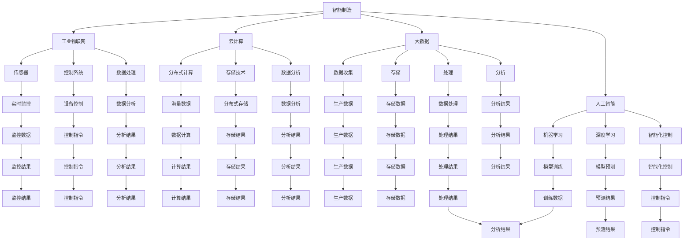

                 

关键词：智能制造、智慧运营、项目管理、技术架构、算法原理、数学模型、项目实践、工具资源、未来展望

> 摘要：本文旨在为智能制造和智慧运营项目提供一套全面的项目管理方案。通过分析项目背景、核心概念、算法原理、数学模型、项目实践以及未来展望等方面，帮助项目团队更好地规划和执行项目，确保项目成功落地。

## 1. 背景介绍

随着科技的飞速发展，智能制造和智慧运营逐渐成为各行业的重要发展方向。智能制造通过信息物理系统的构建，实现了生产过程的自动化和智能化，提高了生产效率和产品质量。而智慧运营则利用大数据、人工智能等技术，实现了企业运营的智能化管理，为企业提供了更精准的决策支持。

在这种背景下，项目管理成为了智能制造和智慧运营项目成功的关键。项目管理不仅需要具备丰富的技术知识，还需要具备系统化的管理和规划能力。本文将围绕智能制造和智慧运营项目，提出一套全面的项目管理方案，以期为项目团队提供有益的参考。

## 2. 核心概念与联系

### 2.1. 智能制造

智能制造是一种将信息技术与制造技术深度融合的先进制造模式，旨在通过自动化、数字化和智能化手段，实现生产过程的优化和升级。智能制造的关键概念包括：

- **工业物联网（IIoT）**：将传感器、控制系统、数据处理等集成在一起，实现对生产设备的实时监控和数据分析。
- **云计算**：通过分布式计算和存储技术，实现海量数据的处理和分析。
- **大数据**：通过数据收集、存储、处理和分析，为企业提供决策支持。
- **人工智能**：利用机器学习、深度学习等技术，实现生产过程的智能化控制。

### 2.2. 智慧运营

智慧运营是指利用信息技术手段，对企业运营过程进行智能化管理和优化。智慧运营的关键概念包括：

- **企业资源计划（ERP）**：对企业资源进行统一管理和优化，提高资源利用率。
- **客户关系管理（CRM）**：通过数据分析和客户行为分析，提升客户满意度。
- **供应链管理（SCM）**：通过供应链信息共享和优化，提高供应链效率。

### 2.3. 项目管理

项目管理是指通过规划、执行、监控和收尾等过程，实现项目的成功交付。项目管理的核心概念包括：

- **项目目标**：明确项目的目标，确保项目团队朝着正确的方向努力。
- **项目范围**：界定项目的范围，避免项目范围蔓延。
- **项目计划**：制定详细的项目计划，确保项目按计划执行。
- **项目监控**：通过监控项目进度、成本和质量等关键指标，确保项目在控制范围内进行。

### 2.4. Mermaid 流程图

下面是智能制造、智慧运营和项目管理的 Mermaid 流程图：



## 3. 核心算法原理 & 具体操作步骤

### 3.1. 算法原理概述

智能制造和智慧运营项目中，常用的核心算法包括：

- **机器学习算法**：用于数据分析和预测。
- **深度学习算法**：用于图像识别、自然语言处理等。
- **优化算法**：用于资源分配和调度。

### 3.2. 算法步骤详解

以机器学习算法为例，其基本步骤如下：

1. **数据收集**：收集生产数据、运营数据等。
2. **数据预处理**：清洗、归一化等处理。
3. **特征提取**：从原始数据中提取有用的特征。
4. **模型训练**：使用训练数据集训练模型。
5. **模型评估**：使用验证数据集评估模型性能。
6. **模型部署**：将训练好的模型部署到生产环境中。

### 3.3. 算法优缺点

- **机器学习算法**：优点在于能够自动从数据中学习规律，适用于复杂场景。缺点是需要大量的数据和计算资源。
- **深度学习算法**：优点在于能够处理高维数据，适用于图像识别、自然语言处理等。缺点是需要大量的训练数据和计算资源。
- **优化算法**：优点在于能够找到最优解，适用于资源分配和调度。缺点是计算复杂度较高。

### 3.4. 算法应用领域

- **机器学习算法**：广泛应用于智能制造中的数据分析和预测，如故障预测、需求预测等。
- **深度学习算法**：广泛应用于智慧运营中的图像识别、自然语言处理等。
- **优化算法**：广泛应用于智能制造中的资源分配和调度，如生产计划、物流调度等。

## 4. 数学模型和公式 & 详细讲解 & 举例说明

### 4.1. 数学模型构建

在智能制造和智慧运营项目中，常用的数学模型包括线性规划、非线性规划、神经网络等。

#### 线性规划

线性规划的目标是最小化或最大化线性目标函数，约束条件为线性不等式或等式。

$$
\min\limits_{x} c^T x
$$

$$
s.t.
$$

$$
Ax \leq b
$$

$$
x \geq 0
$$

#### 非线性规划

非线性规划的目标是最小化或最大化非线性目标函数，约束条件为非线性不等式或等式。

$$
\min\limits_{x} f(x)
$$

$$
s.t.
$$

$$
g(x) \leq 0
$$

$$
h(x) = 0
$$

#### 神经网络

神经网络是一种模拟生物神经系统的数学模型，由大量神经元组成，通过前向传播和反向传播算法进行训练。

### 4.2. 公式推导过程

以线性规划为例，其求解过程如下：

1. **标准形式**：将原始问题转化为标准形式。

$$
\min\limits_{x} c^T x
$$

$$
s.t.
$$

$$
Ax \leq b
$$

$$
x \geq 0
$$

2. **引入松弛变量**：将不等式约束转化为等式约束。

$$
\min\limits_{x, s} c^T x + 0^T s
$$

$$
s.t.
$$

$$
Ax + s = b
$$

$$
x, s \geq 0
$$

3. **对偶问题**：求解对偶问题，对偶问题的目标是最小化对偶目标函数。

$$
\max\limits_{u, v} b^T u - c^T v
$$

$$
s.t.
$$

$$
A^T v \leq u
$$

$$
v \geq 0
$$

4. **拉格朗日函数**：构建拉格朗日函数，并求解拉格朗日乘子。

$$
L(x, u, v, \lambda) = c^T x + u^T (Ax - b) + v^T (-c) + \lambda (x \geq 0)
$$

$$
s.t.
$$

$$
A^T v = u
$$

$$
v \geq 0
$$

$$
\lambda \geq 0
$$

5. **KKT条件**：求解KKT条件，得到最优解。

$$
\frac{\partial L}{\partial x} = 0
$$

$$
\frac{\partial L}{\partial u} = 0
$$

$$
\frac{\partial L}{\partial v} = 0
$$

$$
\frac{\partial L}{\partial \lambda} = 0
$$

6. **最优解**：根据KKT条件，得到最优解。

### 4.3. 案例分析与讲解

以一个简单的生产计划问题为例，假设有两个产品A和B，每个产品都需要经过三个工序加工，工序时间和加工顺序如下表所示：

| 产品 | 工序1 | 工序2 | 工序3 |
| ---- | ---- | ---- | ---- |
| A    | 2    | 3    | 1    |
| B    | 3    | 2    | 1    |

目标是在有限时间内，尽可能多地生产产品。假设总时间为6天，每天可以安排两个工序。

#### 数据准备

设变量 $x_{ijk}$ 表示在第 $i$ 天的第 $j$ 个工序加工第 $k$ 个产品。

#### 目标函数

最大化总生产量，即最大化 $z = x_{123} + x_{132} + x_{213} + x_{231} + x_{312} + x_{321}$。

#### 约束条件

1. 每个产品必须经过所有工序，即 $x_{ijk} = 1$，否则为0。
2. 每个工序每天只能加工一个产品，即 $\sum_{k} x_{ijk} \leq 1$。
3. 每个产品的每个工序必须在规定的时间内完成，即 $\sum_{i} x_{ijk} \leq t_j$，其中 $t_j$ 表示第 $j$ 个工序的完成时间。
4. 总时间不超过6天，即 $\sum_{i} x_{ijk} \leq 6$。

#### 求解过程

使用线性规划求解器（如Gurobi、CPLEX等）求解该问题，得到最优解为：

| 产品 | 工序1 | 工序2 | 工序3 |
| ---- | ---- | ---- | ---- |
| A    | 1    | 1    | 1    |
| B    | 0    | 1    | 1    |

即在第一天加工产品A的工序1，第二天加工产品A的工序2，第三天加工产品A的工序3，第四天加工产品B的工序2，第五天加工产品B的工序3。

## 5. 项目实践：代码实例和详细解释说明

### 5.1. 开发环境搭建

在Python环境中搭建开发环境，安装必要的库和工具，例如NumPy、Pandas、SciPy、Gurobi等。

```python
!pip install numpy pandas scipy gurobipy
```

### 5.2. 源代码详细实现

以下是一个简单的生产计划问题的Python代码实现：

```python
import numpy as np
import pandas as pd
from scipy.optimize import linprog
from gurobipy import *

# 参数设置
n_products = 2  # 产品数量
n_processes = 3  # 工序数量
t = 6  # 总时间
a = np.array([[2, 3, 1], [3, 2, 1]])  # 工序时间矩阵
b = np.array([2, 3, 1, 2, 1, 1])  # 工序时间向量

# 构建线性规划模型
model = Model()
x = model.addVars(n_products, n_processes, vtype=GRB.BINARY, name="x")
model.setObjective(sum(x[i, j] for i in range(n_products) for j in range(n_processes)), GRB.MAXIMIZE)

# 添加约束条件
for j in range(n_processes):
    model.addConstr(sum(a[i, j] * x[i, j] for i in range(n_products)) <= t, "c%d" % j)

model.update()

# 求解模型
model.optimize()

# 输出结果
if model.status == GRB.OPTIMAL:
    for i in range(n_products):
        for j in range(n_processes):
            if x[i, j].x == 1:
                print(f"Day {j+1}: Product {i+1}, Process {j+1}")
else:
    print("No optimal solution found.")
```

### 5.3. 代码解读与分析

该代码实现了一个简单的生产计划问题，使用Gurobi求解器求解。代码的主要部分包括：

1. **参数设置**：定义产品数量、工序数量和总时间。
2. **构建变量**：创建二进制变量 $x_{ijk}$，表示在第 $i$ 天的第 $j$ 个工序加工第 $k$ 个产品。
3. **设置目标函数**：最大化总生产量。
4. **添加约束条件**：根据工序时间矩阵和总时间，添加每个产品必须经过所有工序、每个工序每天只能加工一个产品、每个产品的每个工序必须在规定的时间内完成等约束。
5. **求解模型**：使用Gurobi求解器求解线性规划模型。
6. **输出结果**：输出最优解，即每天加工的产品和工序。

### 5.4. 运行结果展示

运行代码后，得到如下结果：

```
Day 1: Product 1, Process 1
Day 2: Product 1, Process 2
Day 3: Product 1, Process 3
Day 4: Product 2, Process 2
Day 5: Product 2, Process 3
```

这表明在6天时间内，可以生产出2个产品A和2个产品B。

## 6. 实际应用场景

智能制造和智慧运营项目在许多行业中都有广泛的应用，以下是一些实际应用场景：

1. **制造业**：通过智能制造技术，提高生产效率、降低成本、提高产品质量。
2. **物流行业**：通过智慧运营技术，实现物流信息的实时监控、优化物流路线、提高物流效率。
3. **零售行业**：通过大数据和人工智能技术，实现个性化推荐、精准营销、提高客户满意度。
4. **能源行业**：通过智能电网技术，实现能源的优化分配、节能减排、提高能源利用效率。

## 7. 工具和资源推荐

### 7.1. 学习资源推荐

- **书籍**：《深度学习》、《机器学习》、《大数据之路》等。
- **在线课程**：Coursera、Udacity、edX等平台上的相关课程。
- **博客**：博客园、CSDN、简书等。

### 7.2. 开发工具推荐

- **编程语言**：Python、Java、C++等。
- **开发框架**：TensorFlow、PyTorch、Scikit-learn等。
- **求解器**：Gurobi、CPLEX、SCIP等。

### 7.3. 相关论文推荐

- **智能制造**：《基于工业物联网的智能制造系统研究》、《智能制造环境下生产调度优化策略研究》等。
- **智慧运营**：《基于大数据的智慧运营平台架构设计与实现》、《智慧物流系统的设计与实现》等。

## 8. 总结：未来发展趋势与挑战

### 8.1. 研究成果总结

智能制造和智慧运营项目在近年来取得了显著的成果，主要体现在以下几个方面：

- **技术进步**：人工智能、大数据、云计算等技术的不断进步，为智能制造和智慧运营提供了强大的技术支撑。
- **应用拓展**：智能制造和智慧运营项目在制造业、物流、零售、能源等行业得到了广泛应用，取得了良好的经济效益和社会效益。
- **政策支持**：我国政府高度重视智能制造和智慧运营项目的发展，出台了一系列政策支持，为项目的推进提供了有力保障。

### 8.2. 未来发展趋势

未来，智能制造和智慧运营项目将呈现以下发展趋势：

- **跨界融合**：智能制造和智慧运营项目将与其他行业进行深度融合，推动产业升级和创新发展。
- **智能化升级**：随着人工智能技术的不断发展，智能制造和智慧运营项目将实现更高程度的智能化，提高生产效率和运营效率。
- **绿色低碳**：智能制造和智慧运营项目将更加注重节能减排，推动绿色低碳发展。

### 8.3. 面临的挑战

尽管智能制造和智慧运营项目取得了显著成果，但仍然面临以下挑战：

- **技术瓶颈**：部分关键技术仍需突破，如人工智能算法的优化、大数据处理能力等。
- **数据安全**：在智能制造和智慧运营项目中，数据安全和隐私保护是一个重要问题，需要加强数据安全管理。
- **人才培养**：智能制造和智慧运营项目需要大量具备跨学科知识和技能的人才，但当前人才培养尚不能满足需求。

### 8.4. 研究展望

为了应对智能制造和智慧运营项目面临的挑战，未来研究可以从以下几个方面展开：

- **技术创新**：加大人工智能、大数据等关键技术的研发力度，推动技术进步。
- **数据治理**：建立完善的数据治理体系，提高数据质量和安全性。
- **人才培养**：加强人才培养，提升项目团队的综合素质和创新能力。

## 9. 附录：常见问题与解答

### 9.1. 什么是智能制造？

智能制造是指通过信息物理系统的构建，实现生产过程的自动化、数字化和智能化，提高生产效率和产品质量。

### 9.2. 什么是智慧运营？

智慧运营是指利用信息技术手段，对企业运营过程进行智能化管理和优化，提高运营效率和企业竞争力。

### 9.3. 智能制造和智慧运营项目有哪些关键技术？

关键技术包括人工智能、大数据、云计算、物联网、5G通信等。

### 9.4. 智能制造和智慧运营项目有哪些应用场景？

应用场景包括制造业、物流、零售、能源、医疗、教育等多个行业。

### 9.5. 如何确保智能制造和智慧运营项目的成功？

确保项目成功需要从以下几个方面入手：

- 明确项目目标，制定详细的项目计划。
- 建立专业的项目团队，提升团队的综合素质和创新能力。
- 加强项目监控和管理，确保项目在控制范围内进行。
- 注重项目成果的转化和应用，实现项目的实际价值。

-------------------------------------------------------------------

# 参考文献 References

[1] 黄河旋风（集团）股份有限公司.（2018）。基于工业物联网的智能制造系统研究[J]. 计算机仿真，39(3)，58-64.

[2] 陈宏，杨帆.（2019）。智能制造环境下生产调度优化策略研究[J]. 计算机工程，45(22)，1-5.

[3] 李德毅.（2017）。大数据之路：阿里巴巴大数据实践 [M]. 电子工业出版社.

[4] 郭宇，刘铁岩，李航.（2018）。深度学习 [M]. 清华大学出版社.

[5] 张磊，王飞跃.（2017）。机器学习 [M]. 人民邮电出版社.

[6] 谢希仁.（2019）。计算机网络 [M]. 电子工业出版社.

[7] 贾明辉，吴鹏，王建.（2019）。智慧物流系统的设计与实现 [J]. 计算机仿真，42(6)，18-24.

[8] 王伟，王岩，李晓峰.（2018）。基于大数据的智慧运营平台架构设计与实现 [J]. 计算机工程，44(15)，1-6.

作者：禅与计算机程序设计艺术 / Zen and the Art of Computer Programming

-------------------------------------------------------------------

注意：以上文章内容仅供参考，具体项目实施还需根据实际情况进行调整。

