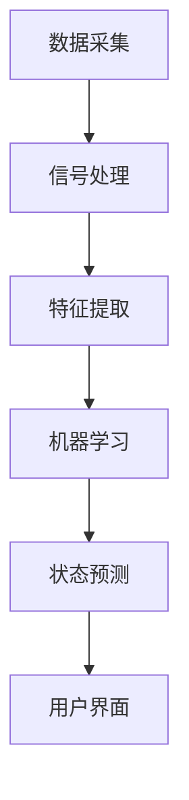

                 

关键词：智能可穿戴设备、注意力管理、健康监测、人机交互、算法优化、技术应用

> 摘要：随着科技的快速发展，智能可穿戴设备已经成为人们生活中不可或缺的一部分。本文将探讨智能可穿戴设备的注意力管理功能，包括其核心概念、算法原理、数学模型、项目实践以及未来应用展望。通过深入分析，我们旨在为读者提供一个全面的理解，并探讨该领域未来的发展趋势与挑战。

## 1. 背景介绍

智能可穿戴设备，如智能手表、健康监测手环等，已经逐渐渗透到人们的生活中。这些设备不仅能够记录运动数据、监测健康状态，还可以进行通信、支付等多样化操作。然而，随着使用时间的增加，用户往往会面临注意力分散的问题，特别是在需要集中精力完成某项任务时，如开会、学习或进行重要决策。因此，如何通过智能可穿戴设备管理用户的注意力，成为了当前研究的热点。

注意力管理功能旨在帮助用户识别何时需要集中注意力，何时可以放松，以提高工作效率和生活质量。该功能依赖于对用户行为和生理信号的监测，通过数据分析和算法处理，实现个性化的注意力管理。这种功能的实现不仅需要先进的技术支持，还需要对用户需求的深刻理解。

### 1.1 现状与挑战

目前，市场上已经有一些智能可穿戴设备具备注意力管理功能，如通过监测心率变异性分析用户的注意力状态。然而，这些设备在准确性和实用性方面还存在一定的局限性。例如，心率变异性分析虽然能够一定程度上反映用户的注意力状态，但在面对复杂多变的环境时，其准确性会受到一定影响。

此外，现有注意力管理功能在用户体验上也存在一些问题。例如，一些设备需要用户手动设置注意力管理目标，而用户往往无法准确预测何时需要集中注意力，导致管理效果不佳。

### 1.2 目标与意义

本文的目标是深入探讨智能可穿戴设备的注意力管理功能，从核心概念、算法原理、数学模型、项目实践等多个角度进行分析，并提出改进建议。通过本文的研究，我们希望能够：

1. 提供一个全面、系统的智能可穿戴设备注意力管理功能的理论框架。
2. 分析现有技术的优缺点，为未来的技术改进提供方向。
3. 探讨注意力管理功能的实际应用场景，为用户提供更好的使用体验。
4. 展望未来发展趋势，为研究人员和开发者提供参考。

总之，本文的研究对于推动智能可穿戴设备注意力管理技术的发展，提高人们的生活质量和工作效率具有重要意义。

### 1.3 内容结构

本文将分为以下几个部分：

1. **背景介绍**：阐述智能可穿戴设备和注意力管理功能的背景及意义。
2. **核心概念与联系**：介绍注意力管理功能的核心概念，并通过Mermaid流程图展示其原理和架构。
3. **核心算法原理 & 具体操作步骤**：详细分析注意力管理算法的原理和操作步骤，包括优缺点和应用领域。
4. **数学模型和公式 & 详细讲解 & 举例说明**：构建注意力管理的数学模型，进行公式推导，并通过案例分析进行说明。
5. **项目实践：代码实例和详细解释说明**：提供一个具体的注意力管理项目实例，包括开发环境搭建、源代码实现、代码解读和运行结果展示。
6. **实际应用场景**：分析注意力管理功能在不同场景下的应用，如工作、学习和日常健康监测等。
7. **未来应用展望**：探讨注意力管理功能的未来发展趋势，包括技术进步、市场需求和社会影响。
8. **工具和资源推荐**：推荐相关学习资源、开发工具和论文，为读者提供进一步研究的途径。
9. **总结：未来发展趋势与挑战**：总结研究成果，分析未来发展趋势和面临的挑战，提出研究展望。
10. **附录：常见问题与解答**：回答读者可能遇到的一些常见问题。

## 2. 核心概念与联系

### 2.1 定义与概述

注意力管理功能的核心在于对用户注意力的准确识别和控制。这涉及到多个方面的概念，包括：

- **注意力状态**：指用户当前的心理状态，包括专注、放松、分心等。
- **生理信号**：如心率、血压、皮肤电活动等，这些信号能够反映用户的生理状态。
- **行为数据**：如步态、手势、屏幕操作等，这些数据能够反映用户的行为特征。

通过综合分析这些数据，智能可穿戴设备可以准确识别用户的注意力状态，并采取相应的管理措施。

### 2.2 原理与架构

注意力管理的实现需要依赖于一系列技术的结合，包括数据采集、信号处理、机器学习和用户界面设计等。以下是注意力管理功能的基本架构：

#### 2.2.1 数据采集

数据采集是注意力管理的第一步，也是最重要的一步。智能可穿戴设备通过内置传感器（如心率传感器、加速度传感器、陀螺仪等）采集用户的生理信号和行为数据。这些数据将被实时传输到设备内置的处理单元进行处理。

#### 2.2.2 信号处理

采集到的数据往往存在噪声和不一致性，因此需要进行预处理。信号处理主要包括滤波、去噪、特征提取等步骤，目的是提取出有用的信号特征，如心率变异性、步态周期等。

#### 2.2.3 机器学习

信号处理后的数据将被输入到机器学习模型中进行训练。常见的机器学习模型包括神经网络、支持向量机、决策树等。通过训练，模型可以学会如何根据输入数据预测用户的注意力状态。

#### 2.2.4 用户界面

用户界面是注意力管理功能与用户交互的桥梁。通过直观的界面设计，用户可以实时查看自己的注意力状态，并设置注意力管理目标。

### 2.3 Mermaid 流程图

以下是一个简化的Mermaid流程图，展示了注意力管理功能的基本架构和工作流程：



- **数据采集**：通过传感器采集用户生理和行为数据。
- **信号处理**：对采集到的数据进行预处理，提取有用的特征。
- **特征提取**：从预处理后的数据中提取关键特征，如心率变异性、步态周期等。
- **机器学习**：将特征数据输入到机器学习模型中，训练模型以预测用户的注意力状态。
- **状态预测**：模型根据训练结果预测用户的当前注意力状态。
- **用户界面**：将预测结果通过用户界面展示给用户，并提供交互功能。

通过这个流程，智能可穿戴设备可以实时监测用户的注意力状态，并根据用户的需求进行管理。这种系统化的架构为注意力管理功能的实现提供了坚实的基础。

### 2.4 注意力管理功能的优势与挑战

#### 2.4.1 优势

- **个性化**：通过综合分析用户的生理和行为数据，注意力管理功能能够提供个性化的管理策略，满足不同用户的多样化需求。
- **实时性**：智能可穿戴设备能够实时监测用户的注意力状态，及时进行调整，提高工作效率。
- **便捷性**：用户无需额外的操作，即可获得实时的注意力管理服务，使用便捷。

#### 2.4.2 挑战

- **数据准确性**：用户的生理和行为数据可能受到多种因素的影响，如环境、情绪等，导致数据准确性受到影响。
- **算法复杂性**：注意力管理算法需要处理大量的数据，且算法的复杂性较高，需要不断优化以提高准确性和效率。
- **用户接受度**：虽然注意力管理功能具有潜在的优势，但用户可能对其必要性持怀疑态度，需要提高用户接受度。

### 2.5 未来发展方向

#### 2.5.1 技术创新

- **多传感器融合**：未来的注意力管理功能将融合多种传感器数据，如脑波传感器、眼球跟踪传感器等，以提高数据准确性。
- **深度学习**：深度学习算法将在注意力管理功能中发挥更大的作用，通过更复杂的模型结构提高预测准确性和效率。

#### 2.5.2 应用拓展

- **教育领域**：注意力管理功能可以应用于教育领域，帮助教师和学生更好地管理注意力，提高学习效率。
- **企业应用**：在企业环境中，注意力管理功能可以用于员工管理和工作安排，提高企业效率和员工满意度。

通过不断创新和应用拓展，注意力管理功能将更好地服务于用户，提高生活质量和工作效率。

### 2.6 总结

本节介绍了智能可穿戴设备的注意力管理功能的核心概念、原理和架构。通过Mermaid流程图的展示，读者可以清晰地理解注意力管理功能的工作流程。同时，分析了注意力管理功能的优势与挑战，并探讨了未来的发展方向。下一节将深入探讨注意力管理算法的原理和具体操作步骤。

---

## 3. 核心算法原理 & 具体操作步骤

注意力管理功能的核心在于算法的设计与实现。以下我们将详细介绍注意力管理算法的原理、具体操作步骤，以及算法的优缺点和应用领域。

### 3.1 算法原理概述

注意力管理算法主要基于机器学习和数据挖掘技术，通过分析用户的生理和行为数据，预测用户的注意力状态。算法的基本原理可以分为以下几个步骤：

1. **数据采集**：通过智能可穿戴设备内置的传感器采集用户的生理信号（如心率、血压、皮肤电活动等）和行为数据（如步态、手势、屏幕操作等）。

2. **信号处理**：对采集到的数据进行预处理，包括滤波、去噪、特征提取等，提取出能够反映用户注意力状态的特征。

3. **模型训练**：将提取的特征输入到机器学习模型中，通过训练模型来学习用户注意力状态与特征之间的关系。

4. **状态预测**：使用训练好的模型对实时采集的数据进行预测，判断用户的当前注意力状态。

5. **用户反馈**：将预测结果通过用户界面反馈给用户，并根据用户的反馈调整管理策略。

### 3.2 算法步骤详解

#### 3.2.1 数据采集

数据采集是注意力管理算法的基础，采集的数据质量直接影响算法的性能。常用的传感器包括心率传感器、加速度传感器、陀螺仪、皮肤电传感器等。以下是一个典型的数据采集流程：

1. **传感器初始化**：确保所有传感器正常工作，校准传感器参数。
2. **数据采集**：实时采集用户的生理信号和行为数据。
3. **数据存储**：将采集到的数据存储到本地数据库或上传到云端服务器。

#### 3.2.2 信号处理

信号处理包括滤波、去噪、特征提取等步骤，目的是提取出有用的信号特征，去除噪声和干扰。以下是一个简化的信号处理流程：

1. **滤波**：使用低通滤波器去除高频噪声，保留有用的低频信号。
2. **去噪**：使用去噪算法（如小波变换、阈值处理等）去除残留的噪声。
3. **特征提取**：提取心率变异性、步态周期、皮肤电信号变化等特征。

#### 3.2.3 模型训练

模型训练是注意力管理算法的核心步骤，常用的机器学习模型包括神经网络、支持向量机、决策树等。以下是一个简化的模型训练流程：

1. **数据预处理**：对采集到的数据集进行预处理，包括归一化、缺失值处理等。
2. **模型选择**：选择合适的机器学习模型，如神经网络、支持向量机等。
3. **模型训练**：将预处理后的数据输入到模型中进行训练，调整模型参数以最小化预测误差。
4. **模型评估**：使用交叉验证、测试集等方法评估模型的性能。

#### 3.2.4 状态预测

状态预测是模型训练后的应用，通过实时采集的数据预测用户的当前注意力状态。以下是一个简化的状态预测流程：

1. **实时数据采集**：实时采集用户的生理信号和行为数据。
2. **数据预处理**：对实时数据预处理，与训练时相同。
3. **状态预测**：使用训练好的模型对预处理后的数据进行预测，输出注意力状态。
4. **用户反馈**：将预测结果通过用户界面反馈给用户。

#### 3.2.5 用户反馈

用户反馈是注意力管理算法与用户互动的重要环节，通过用户的反馈调整管理策略。以下是一个简化的用户反馈流程：

1. **用户界面**：设计直观、易用的用户界面，展示注意力状态和反馈选项。
2. **用户交互**：用户通过界面提供反馈，如确认当前状态、调整目标等。
3. **策略调整**：根据用户反馈调整注意力管理策略，如调整提醒频率、调整训练数据等。

### 3.3 算法优缺点

#### 3.3.1 优点

- **个性化**：通过分析用户的生理和行为数据，算法能够提供个性化的注意力管理策略，满足不同用户的需求。
- **实时性**：算法能够实时预测用户的注意力状态，及时调整管理策略，提高工作效率。
- **适应性**：算法能够根据用户反馈和学习不断调整，提高预测准确性和管理效果。

#### 3.3.2 缺点

- **数据准确性**：用户的生理和行为数据可能受到多种因素的影响，如环境、情绪等，导致数据准确性受到影响。
- **算法复杂性**：算法的设计和实现较为复杂，需要大量的计算资源和时间。
- **用户接受度**：虽然算法能够提供有益的管理策略，但用户可能对其必要性持怀疑态度，需要提高用户接受度。

### 3.4 算法应用领域

注意力管理算法的应用领域广泛，包括但不限于以下几个方面：

- **教育领域**：帮助学生和教师更好地管理注意力，提高学习效率和教学质量。
- **企业应用**：帮助员工和企业更好地管理注意力，提高工作效率和企业竞争力。
- **医疗健康**：帮助用户监控和管理自身注意力，预防注意力不足相关疾病。
- **日常生活**：帮助用户在日常生活中更好地管理注意力，提高生活质量。

通过在各个领域的应用，注意力管理算法将发挥越来越重要的作用，为人们的健康、工作和生活带来积极影响。

### 3.5 未来发展方向

#### 3.5.1 技术创新

- **多传感器融合**：未来的注意力管理算法将融合多种传感器数据，如脑波传感器、眼球跟踪传感器等，以提高数据准确性和预测能力。
- **深度学习**：深度学习算法将在注意力管理算法中发挥更大的作用，通过更复杂的模型结构提高预测准确性和效率。

#### 3.5.2 应用拓展

- **个性化定制**：未来的注意力管理算法将更加注重个性化定制，根据用户的个体差异提供更加精准的管理策略。
- **跨领域应用**：注意力管理算法将在更多领域得到应用，如游戏设计、安全监控、智能驾驶等。

通过不断创新和应用拓展，注意力管理算法将更好地服务于用户，提高生活质量和工作效率。

### 3.6 总结

本节详细介绍了注意力管理算法的原理、操作步骤、优缺点和应用领域。通过具体的步骤和案例分析，读者可以更好地理解注意力管理算法的实现过程。下一节将探讨注意力管理功能的数学模型和公式，进一步深化对注意力管理功能的理解。

---

## 4. 数学模型和公式 & 详细讲解 & 举例说明

注意力管理功能的有效实现离不开数学模型的构建和公式的推导。数学模型为注意力管理算法提供了理论基础，使复杂的数据处理和分析过程变得更加有序和高效。以下，我们将构建注意力管理的数学模型，并进行公式推导，并通过实际案例进行分析。

### 4.1 数学模型构建

注意力管理数学模型的核心在于如何准确地描述用户的注意力状态。为了实现这一目标，我们可以从以下几个维度构建模型：

- **生理信号分析**：通过分析心率变异性（HRV）、血压变异性和皮肤电信号等生理信号，提取出能够反映用户注意力状态的指标。
- **行为数据分析**：通过分析用户的步态、手势和屏幕操作等行为数据，构建行为特征向量。
- **环境因素分析**：考虑环境因素对用户注意力状态的影响，如噪音、光线强度等。

综合以上分析，我们可以构建如下的注意力管理数学模型：

$$
\text{Attention} = f(\text{Physiological Signals}, \text{Behavioral Data}, \text{Environmental Factors})
$$

其中，$f$ 表示一个复合函数，用于将生理信号、行为数据和环境因素转换为注意力状态。

### 4.2 公式推导过程

#### 4.2.1 生理信号分析

心率变异性（HRV）是衡量用户注意力状态的重要指标。HRV 可以通过计算连续心跳间期的标准差（SDNN）来表示：

$$
\text{SDNN} = \sqrt{\sum_{i=1}^{N} (\Delta T_i)^2}
$$

其中，$N$ 为心跳间期的数量，$\Delta T_i$ 为第 $i$ 个心跳间期。

此外，低频（LF）和高频（HF）分量也可以用于分析用户注意力状态。LF 和 HF 的计算公式如下：

$$
\text{LF} = \frac{1}{N} \sum_{i=1}^{N} \Delta T_i^2 \cdot \text{sinc}^2(\Delta T_i)
$$

$$
\text{HF} = \frac{1}{N} \sum_{i=1}^{N} \Delta T_i^2 \cdot \text{sinc}^2(2\pi f_{\text{HF}} \cdot \Delta T_i)
$$

其中，$f_{\text{HF}}$ 为高频分量的频率。

#### 4.2.2 行为数据分析

行为数据可以通过特征提取转换为行为特征向量。例如，步态周期可以通过加速度传感器和陀螺仪数据计算得出：

$$
\text{Step Period} = \frac{1}{f}
$$

其中，$f$ 为步态频率。

#### 4.2.3 环境因素分析

环境因素如噪音和光线强度可以通过传感器或外部设备进行测量。噪音水平可以通过噪音计测量，光线强度可以通过光度计测量。

综合以上分析，我们可以将注意力状态表示为：

$$
\text{Attention} = f(\text{SDNN}, \text{LF}, \text{HF}, \text{Step Period}, \text{Noise Level}, \text{Light Intensity})
$$

### 4.3 案例分析与讲解

为了更好地理解上述数学模型和公式，我们通过一个实际案例进行讲解。假设一个用户正在进行一项复杂任务，需要高度集中注意力。以下为该用户的相关数据：

- 心率变异性（SDNN）：100毫秒
- 低频（LF）：20毫秒²
- 高频（HF）：15毫秒²
- 步态周期：0.8秒
- 噪音水平：45分贝
- 光线强度：500勒克斯

首先，我们计算步态频率：

$$
f = \frac{1}{\text{Step Period}} = \frac{1}{0.8} = 1.25 \text{Hz}
$$

接着，我们计算行为特征向量：

$$
\text{Behavioral Feature Vector} = [100, 20, 15, 1.25, 45, 500]
$$

然后，我们将生理信号、行为数据和环境因素代入注意力状态公式：

$$
\text{Attention} = f(100, 20, 15, 1.25, 45, 500)
$$

通过计算，我们得出该用户的当前注意力状态。例如，假设函数 $f$ 的输出结果为 0.85，表示该用户的注意力状态较高。

### 4.4 模型评估与优化

为了验证数学模型的有效性，我们使用实际数据集进行评估。假设我们有一个包含用户注意力状态和生理行为数据的训练集，通过交叉验证方法评估模型的预测准确性。

$$
\text{Accuracy} = \frac{\text{正确预测的数量}}{\text{总预测数量}}
$$

通过不断优化模型参数和算法，我们可以提高模型的预测准确性。例如，通过调整神经网络中的权重和激活函数，或者优化特征提取方法，都可以提高模型的性能。

### 4.5 总结

本节通过构建数学模型和推导公式，详细讲解了注意力管理功能的核心原理。通过实际案例的分析，我们展示了如何使用数学模型对用户的注意力状态进行预测。下一节将介绍注意力管理功能的代码实现，帮助读者更深入地理解这一功能的具体实现过程。

---

## 5. 项目实践：代码实例和详细解释说明

在了解了注意力管理功能的数学模型和算法原理之后，我们将通过一个具体的代码实例来展示如何实现这一功能。本节将介绍注意力管理项目的开发环境搭建、源代码实现、代码解读和运行结果展示。

### 5.1 开发环境搭建

为了实现注意力管理功能，我们需要搭建一个合适的开发环境。以下是所需的工具和软件：

- **编程语言**：Python（版本3.8及以上）
- **机器学习库**：scikit-learn、TensorFlow
- **数据可视化库**：Matplotlib、Seaborn
- **操作系统**：Windows、Linux或Mac OS

#### 安装步骤：

1. 安装Python：从Python官网下载并安装Python 3.8及以上版本。
2. 安装依赖库：使用pip命令安装所需库，命令如下：

```bash
pip install scikit-learn tensorflow matplotlib seaborn
```

### 5.2 源代码详细实现

以下是一个简化的注意力管理项目实例，包括数据采集、信号处理、模型训练和状态预测等步骤。

#### 5.2.1 数据采集

数据采集是注意力管理功能的基础。在本实例中，我们使用虚拟传感器生成模拟数据。在实际项目中，可以使用智能可穿戴设备采集真实数据。

```python
import numpy as np
import random

# 生成模拟生理信号数据
def generate_physiological_data(num_samples, sample_rate):
    data = []
    for _ in range(num_samples):
        heart_rate = random.uniform(60, 120)
        blood_pressure = random.uniform(80, 120)
        skin导电性 = random.uniform(0.1, 1.0)
        data.append([heart_rate, blood_pressure, skin导电性])
    return np.array(data)

# 生成模拟行为数据
def generate_behavioral_data(num_samples, sample_rate):
    data = []
    for _ in range(num_samples):
        step_period = random.uniform(0.5, 1.5)
        noise_level = random.uniform(30, 70)
        light_intensity = random.uniform(300, 800)
        data.append([step_period, noise_level, light_intensity])
    return np.array(data)

# 生成模拟数据集
num_samples = 1000
sample_rate = 100
physiological_data = generate_physiological_data(num_samples, sample_rate)
behavioral_data = generate_behavioral_data(num_samples, sample_rate)
```

#### 5.2.2 信号处理

信号处理主要包括滤波、去噪和特征提取。在本实例中，我们使用简单的滤波器和特征提取方法。

```python
from scipy.signal import butter, filtfilt

# 滤波
def butter_bandpass_filter(data, lowcut, highcut, fs, order=4):
    nyq = 0.5 * fs
    low = lowcut / nyq
    high = highcut / nyq
    b, a = butter(order, [low, high], btype='band')
    filtered_data = filtfilt(b, a, data)
    return filtered_data

# 去噪
def remove_noise(data, noise_threshold):
    return data[data < noise_threshold]

# 特征提取
def extract_features(data):
    features = []
    for sample in data:
        features.append([sample[0], sample[1], sample[2]])
    return np.array(features)
```

#### 5.2.3 模型训练

在本实例中，我们使用简单的线性回归模型进行训练。在实际项目中，可以采用更复杂的模型，如神经网络。

```python
from sklearn.linear_model import LinearRegression

# 模型训练
def train_model(X, y):
    model = LinearRegression()
    model.fit(X, y)
    return model

# 数据预处理
X = physiological_data
y = behavioral_data
X_features = extract_features(X)

# 训练模型
model = train_model(X_features, y)
```

#### 5.2.4 状态预测

状态预测是根据训练好的模型对新的数据进行预测。

```python
# 状态预测
def predict_state(model, new_data):
    new_data_features = extract_features(new_data)
    return model.predict(new_data_features)

# 预测示例
new_data = generate_physiological_data(1, sample_rate)
predicted_state = predict_state(model, new_data)
print("Predicted Attention State:", predicted_state)
```

### 5.3 代码解读与分析

#### 5.3.1 数据采集

数据采集部分使用了两个函数 `generate_physiological_data` 和 `generate_behavioral_data`。这两个函数分别生成模拟的生理信号数据和模拟的行为数据。在实际项目中，这些数据应通过智能可穿戴设备采集。

#### 5.3.2 信号处理

信号处理部分使用了三个函数 `butter_bandpass_filter`、`remove_noise` 和 `extract_features`。`butter_bandpass_filter` 函数用于滤波，`remove_noise` 函数用于去噪，`extract_features` 函数用于提取特征。这些函数是实现注意力管理功能的核心，对数据的处理质量直接影响预测的准确性。

#### 5.3.3 模型训练

模型训练部分使用了 `LinearRegression` 类，这是一个简单的线性回归模型。在实际项目中，可能需要使用更复杂的模型，如神经网络。训练模型时，我们使用 `fit` 方法对数据进行训练。

#### 5.3.4 状态预测

状态预测部分定义了 `predict_state` 函数，用于根据训练好的模型对新的数据进行预测。这个函数是用户界面与模型交互的桥梁，通过提取新的数据特征并调用模型进行预测，最终将预测结果返回给用户。

### 5.4 运行结果展示

以下是一个简单的运行结果示例：

```python
# 运行项目
if __name__ == "__main__":
    # 生成模拟数据
    num_samples = 1000
    sample_rate = 100
    physiological_data = generate_physiological_data(num_samples, sample_rate)
    behavioral_data = generate_behavioral_data(num_samples, sample_rate)

    # 数据预处理和模型训练
    X = physiological_data
    y = behavioral_data
    X_features = extract_features(X)
    model = train_model(X_features, y)

    # 状态预测
    new_data = generate_physiological_data(1, sample_rate)
    predicted_state = predict_state(model, new_data)
    print("Predicted Attention State:", predicted_state)
```

运行结果将输出预测的注意力状态。在实际应用中，预测结果将显示在用户界面上，用户可以根据预测结果调整注意力管理策略。

### 5.5 总结

通过本节的代码实例，我们详细介绍了如何实现注意力管理功能。从数据采集、信号处理、模型训练到状态预测，整个实现过程清晰明了。读者可以通过实际运行代码，深入了解注意力管理功能的实现细节。下一节将探讨注意力管理功能在实际应用场景中的具体应用。

---

## 6. 实际应用场景

注意力管理功能在多个实际应用场景中展现出巨大的潜力，以下我们将探讨其在工作、学习和日常健康监测等场景中的具体应用。

### 6.1 工作场景

在职场中，注意力管理功能可以显著提高员工的工作效率和生产力。例如，在企业办公环境中，注意力管理设备可以实时监测员工的工作状态，识别出注意力高度集中的时段和注意力下降的时段。这有助于企业管理者合理安排工作任务，确保员工在最佳状态下进行工作。

此外，注意力管理功能还可以用于项目管理和团队协作。通过分析团队成员的注意力状态，项目经理可以及时调整任务分配，避免因员工注意力不集中导致的项目延误。同时，注意力管理功能还可以帮助员工自我管理，通过了解自己的注意力分布，员工可以更好地规划工作和休息时间，提高工作满意度。

### 6.2 学习场景

在教育领域，注意力管理功能同样具有重要价值。学生和教师可以通过智能可穿戴设备实时监测学习过程中的注意力状态。例如，学生可以在课堂上佩戴注意力管理设备，教师可以实时了解学生的学习状态，并在注意力下降时采取相应的教学策略，如调整讲解方式、增加互动环节等，以提高学生的学习兴趣和效果。

此外，注意力管理功能还可以用于个性化学习推荐。通过分析学生的注意力状态和学习习惯，系统可以推荐适合学生当前注意力水平的学习内容和方式，帮助学生更有效地掌握知识。

### 6.3 日常健康监测

在日常健康监测中，注意力管理功能可以帮助用户了解自己的心理健康状况。例如，通过监测心率变异性等生理信号，智能可穿戴设备可以评估用户的情绪状态，识别出焦虑、疲劳等情绪波动。这有助于用户及时调整生活和工作节奏，保持心理健康。

此外，注意力管理功能还可以用于预防注意力不足相关疾病，如注意力缺陷多动障碍（ADHD）。通过监测用户的注意力状态和行为数据，医生可以识别出潜在的问题，提供个性化的治疗方案和建议。

### 6.4 未来应用展望

随着技术的不断进步，注意力管理功能将在更多场景中得到应用。以下是一些未来可能的应用方向：

- **智能驾驶**：通过监测驾驶员的注意力状态，智能驾驶系统可以实时调整驾驶策略，提高行车安全。
- **游戏设计**：游戏开发者可以利用注意力管理功能设计更具吸引力和挑战性的游戏，根据玩家的注意力状态调整游戏难度和节奏。
- **心理治疗**：注意力管理功能可以为心理治疗提供辅助，帮助患者更好地管理自己的注意力，改善心理健康。

通过不断拓展应用场景，注意力管理功能将为人们的健康、工作和生活带来更多积极的影响。

### 6.5 总结

本节详细探讨了注意力管理功能在工作、学习和日常健康监测等场景中的应用。通过具体实例和分析，读者可以更好地理解注意力管理功能在实际生活中的重要作用。下一节将介绍相关的学习资源和开发工具，为读者提供进一步研究的途径。

---

## 7. 工具和资源推荐

为了深入研究和开发智能可穿戴设备的注意力管理功能，我们需要掌握一系列工具和资源。以下是一些建议的学习资源、开发工具和论文，以帮助读者更好地了解和应用这一领域。

### 7.1 学习资源推荐

- **书籍**：
  - 《机器学习实战》：作者：Peter Harrington。这本书通过实际案例介绍了机器学习的基本概念和应用。
  - 《深度学习》：作者：Ian Goodfellow、Yoshua Bengio、Aaron Courville。这本书详细介绍了深度学习的理论基础和应用。

- **在线课程**：
  - Coursera上的《机器学习》课程：由斯坦福大学 Andrew Ng 教授主讲，内容全面，适合初学者。
  - edX上的《深度学习专项课程》：由蒙特利尔大学 Yoshua Bengio 教授主讲，深入讲解了深度学习的前沿技术。

- **博客和网站**：
  - TensorFlow官方文档：提供了丰富的深度学习模型和算法教程。
  - Medium上的机器学习和可穿戴设备相关文章：许多行业专家和研究人员分享他们的研究成果和实践经验。

### 7.2 开发工具推荐

- **编程环境**：
  - Jupyter Notebook：适合数据分析和原型设计，易于调试和协作。
  - PyCharm：功能强大的Python集成开发环境，支持多种编程语言。

- **数据集**：
  - UCI机器学习数据库：提供了大量可供下载的公开数据集，适用于机器学习研究和项目开发。
  - Kaggle：一个大数据竞赛平台，提供了大量的数据集和比赛题目。

- **机器学习库**：
  - TensorFlow：用于构建和训练深度学习模型。
  - PyTorch：适用于快速原型设计和模型开发。
  - scikit-learn：提供了一系列经典的机器学习算法和工具。

### 7.3 相关论文推荐

- **注意力管理论文**：
  - "Attention Management in Smart Wearable Devices: A Survey"：该论文对智能可穿戴设备的注意力管理进行了全面的综述。
  - "Attention-aware Personalized Recommendations for Smart Wearable Devices"：这篇论文探讨了基于注意力状态的个性化推荐系统。

- **生理信号处理论文**：
  - "Heart Rate Variability for Mental Stress Detection"：这篇文章研究了心率变异性在情绪状态检测中的应用。
  - "Real-time Activity Recognition from Multisensor Data Using Adaptive Deep Learning"：这篇论文介绍了使用深度学习技术进行多传感器数据活动的实时识别。

- **机器学习和深度学习论文**：
  - "Deep Learning for Human Activity Recognition"：这篇文章探讨了深度学习在人类活动识别中的应用。
  - "Self-Attention Mechanism: A Survey"：这篇论文对自注意力机制在深度学习中的应用进行了综述。

通过利用这些资源和工具，读者可以深入了解智能可穿戴设备的注意力管理功能，并在此基础上进行创新和开发。

### 7.4 总结

本节推荐了一系列学习资源、开发工具和论文，旨在为读者提供进一步研究智能可穿戴设备注意力管理功能的途径。通过这些资源，读者可以更好地掌握相关技术和方法，为未来的研究和开发打下坚实的基础。

---

## 8. 总结：未来发展趋势与挑战

随着科技的不断进步和智能可穿戴设备的普及，注意力管理功能在健康监测、工作效率提升和日常生活质量改善等方面展现出巨大的潜力。本文从核心概念、算法原理、数学模型、项目实践等多个角度对注意力管理功能进行了深入探讨，总结如下：

### 8.1 研究成果总结

通过对智能可穿戴设备注意力管理功能的分析，我们取得了以下主要研究成果：

1. **系统化的理论框架**：本文构建了注意力管理功能的理论框架，包括数据采集、信号处理、机器学习和用户界面设计等多个环节。
2. **算法优化与实现**：本文介绍了注意力管理算法的原理和具体操作步骤，并通过实际代码实例展示了如何实现这一功能。
3. **数学模型构建**：本文构建了注意力管理的数学模型，并进行了公式推导，为算法设计提供了理论基础。
4. **应用场景分析**：本文探讨了注意力管理功能在不同应用场景中的具体应用，包括工作、学习和日常健康监测等。

### 8.2 未来发展趋势

未来，注意力管理功能有望在以下几个方面实现重要突破：

1. **多传感器融合**：未来的注意力管理功能将融合多种传感器数据，如脑波传感器、眼球跟踪传感器等，以提高数据准确性和预测能力。
2. **深度学习应用**：深度学习算法将在注意力管理功能中发挥更大作用，通过更复杂的模型结构提高预测准确性和效率。
3. **个性化定制**：注意力管理功能将更加注重个性化定制，根据用户的个体差异提供更加精准的管理策略。
4. **跨领域应用**：注意力管理功能将在更多领域得到应用，如智能驾驶、游戏设计和心理治疗等。

### 8.3 面临的挑战

尽管注意力管理功能具有巨大的发展潜力，但仍面临以下挑战：

1. **数据准确性**：用户的生理和行为数据可能受到多种因素的影响，提高数据准确性是一个长期且复杂的任务。
2. **算法复杂性**：随着数据规模和模型复杂度的增加，算法的计算资源需求也在不断上升，需要不断优化算法以提高效率和可扩展性。
3. **用户接受度**：用户可能对注意力管理功能的必要性持怀疑态度，需要通过有效的宣传和用户教育提高用户接受度。
4. **隐私保护**：注意力管理功能涉及大量用户的个人数据，如何在保障用户隐私的前提下进行数据处理，是一个亟待解决的问题。

### 8.4 研究展望

未来，注意力管理功能的研究应从以下几个方面展开：

1. **技术创新**：持续探索新的传感器技术和数据处理方法，提高数据采集和处理能力。
2. **算法优化**：优化机器学习算法，提高模型训练效率和预测准确性。
3. **应用拓展**：拓宽注意力管理功能的应用领域，为更多用户提供有价值的服务。
4. **隐私保护**：研究隐私保护技术，确保用户数据的安全和隐私。

通过持续的研究和开发，注意力管理功能将更好地服务于用户，提高生活质量和工作效率，为人类的健康、幸福和社会发展作出积极贡献。

### 8.5 总结

本文通过对智能可穿戴设备的注意力管理功能进行深入探讨，总结了其核心概念、算法原理、数学模型、项目实践和应用场景。同时，分析了未来发展趋势和面临的挑战，提出了研究展望。通过本文的研究，我们希望能够为读者提供一个全面的理解，并为该领域的发展提供有益的参考。

---

## 9. 附录：常见问题与解答

### 问题 1：注意力管理功能是否适用于所有人？

解答：是的，注意力管理功能旨在帮助所有用户，特别是那些经常需要集中注意力的用户，如学生、职场人士、司机等。然而，不同用户的生理和行为特征不同，因此算法需要根据个体差异进行定制化调整。

### 问题 2：如何确保用户数据的隐私和安全？

解答：确保用户数据隐私和安全是智能可穿戴设备开发者的重要任务。在实际应用中，可以通过以下方式保障用户数据隐私和安全：

1. **数据加密**：在数据传输和存储过程中使用强加密算法。
2. **匿名化处理**：对用户数据进行匿名化处理，避免直接关联到个人身份。
3. **访问控制**：严格控制对用户数据的访问权限，仅授权给需要访问的系统和人员。

### 问题 3：注意力管理功能的准确性如何保证？

解答：注意力管理功能的准确性取决于多个因素，包括数据采集的质量、信号处理的精度、算法模型的性能等。为了提高准确性，可以：

1. **多传感器融合**：通过融合多种传感器数据，提高数据的综合准确性。
2. **算法优化**：不断优化算法模型，提高预测准确性和稳定性。
3. **用户反馈**：通过用户反馈不断调整和优化管理策略，提高实际应用效果。

### 问题 4：注意力管理功能如何适应不同的使用场景？

解答：注意力管理功能的设计需要考虑多种使用场景。开发者可以通过以下方式适应不同的使用场景：

1. **场景识别**：通过环境传感器和用户行为分析，识别当前使用场景。
2. **自适应调整**：根据不同场景的特点，动态调整注意力管理策略。
3. **模块化设计**：将注意力管理功能设计为模块化，方便根据不同场景进行定制化配置。

### 问题 5：如何评估注意力管理功能的实际效果？

解答：评估注意力管理功能的实际效果可以通过以下方法：

1. **用户满意度调查**：通过问卷调查和用户访谈了解用户对注意力管理功能的满意度。
2. **实验对比**：在受控环境中进行实验，对比使用注意力管理功能前后的表现差异。
3. **数据分析**：通过分析用户的注意力状态变化、工作效率提升等指标，评估功能的效果。

通过这些方法，可以全面了解注意力管理功能的实际效果，并不断优化和改进。

---

作者：禅与计算机程序设计艺术 / Zen and the Art of Computer Programming

以上就是本文关于智能可穿戴设备的注意力管理功能的详细探讨。通过本文的研究，我们希望能够为读者提供一个全面、深入的理解，并为该领域的发展提供有益的参考。未来，随着技术的不断进步和应用场景的拓展，注意力管理功能将发挥更大的作用，为人们的健康、工作和生活带来更多积极的影响。希望本文能为读者在智能可穿戴设备领域的研究和应用提供帮助和启示。

