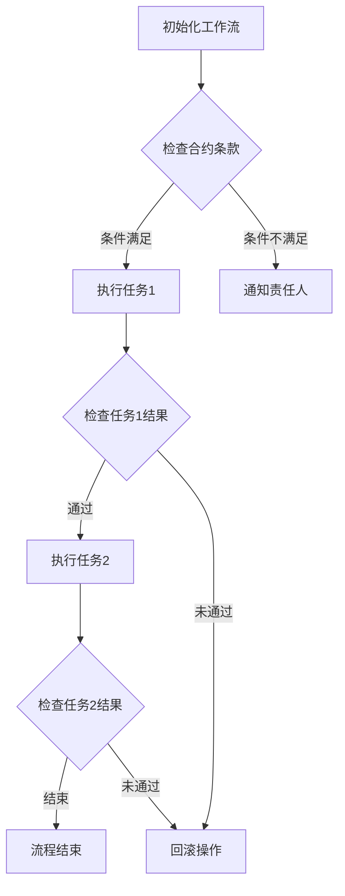

                 

关键词：智能合约，工作流管理，区块链，分布式系统，去中心化，透明性，安全性，自动化，代码实现。

> 摘要：本文深入探讨了智能合约在工作流管理中的应用，分析了智能合约与工作流管理之间的内在联系，探讨了如何利用智能合约实现高效、透明、安全的工作流自动化管理。文章详细介绍了智能合约的核心概念、架构设计、算法原理、数学模型、项目实践以及实际应用场景，为读者提供了一个全面的技术视角。

## 1. 背景介绍

### 1.1 工作流管理

工作流（Workflow）是一种用于描述业务过程及其操作步骤的抽象模型。它通过将任务、信息和数据进行有序组织和处理，实现了业务流程的高效自动化。传统的业务流程通常依赖于人工操作、纸质文档和电子表格等，效率较低，容易出现人为错误和流程失控。

### 1.2 智能合约

智能合约是一种运行在区块链上的自执行合约，其条款和操作直接嵌入代码中。当满足预定的条件时，智能合约会自动执行相关操作，无需人工干预。智能合约的出现，为去中心化、透明化、安全化的业务流程管理提供了新的可能。

### 1.3 区块链与分布式系统

区块链是一种分布式数据库技术，具有去中心化、不可篡改、可追溯等特点。分布式系统则是通过多台计算机共同工作，实现了数据的共享和处理的分布式架构。区块链与分布式系统的结合，为智能合约提供了一个安全、可靠的运行环境。

## 2. 核心概念与联系

### 2.1 智能合约原理

智能合约的工作原理主要包括以下几个步骤：

1. **定义合约条款**：合约条款包括任务执行条件、操作步骤、操作权限等。
2. **编写合约代码**：使用特定编程语言（如Solidity）编写智能合约代码。
3. **部署合约**：将智能合约代码部署到区块链上。
4. **触发执行**：当满足预定的条件时，智能合约自动执行相关操作。

### 2.2 工作流管理与智能合约的关系

智能合约在工作流管理中的应用，主要体现在以下几个方面：

1. **流程自动化**：通过智能合约，可以实现工作流程的自动化执行，减少人为干预。
2. **透明性**：智能合约的执行过程和结果，可以在区块链上公开查询，提高工作流程的透明度。
3. **安全性**：智能合约的执行，基于区块链的不可篡改特性，确保了工作流程的安全性。
4. **去中心化**：智能合约的执行，不依赖于单一中心化机构，实现了去中心化管理。

### 2.3 Mermaid 流程图

以下是智能合约在工作流管理中的应用架构的 Mermaid 流程图：



## 3. 核心算法原理 & 具体操作步骤

### 3.1 算法原理概述

智能合约在工作流管理中的核心算法原理，主要包括以下几个部分：

1. **条件判断**：根据预定的条件，判断是否执行任务。
2. **任务执行**：执行具体任务，如数据处理、状态更新等。
3. **结果检查**：检查任务执行结果，决定下一步操作。
4. **异常处理**：在任务执行过程中，出现异常情况时的回滚和通知操作。

### 3.2 算法步骤详解

智能合约在工作流管理中的具体操作步骤如下：

1. **初始化工作流**：根据业务需求，定义工作流的初始状态和任务列表。
2. **检查合约条款**：根据智能合约的条款，判断当前工作流是否处于可执行状态。
3. **执行任务**：根据合约条款，执行当前任务。
4. **检查任务结果**：判断任务执行结果，决定是否继续执行下一个任务。
5. **异常处理**：在任务执行过程中，如出现异常情况，进行回滚操作，并通知相关责任人。
6. **流程结束**：当所有任务执行完毕，工作流结束。

### 3.3 算法优缺点

智能合约在工作流管理中的应用，具有以下优点和缺点：

**优点**：
- 自动化：智能合约可以实现工作流程的自动化执行，提高效率。
- 透明性：智能合约的执行过程和结果，可以在区块链上公开查询，提高透明度。
- 安全性：智能合约的执行，基于区块链的不可篡改特性，确保了工作流程的安全性。
- 去中心化：智能合约的执行，不依赖于单一中心化机构，实现了去中心化管理。

**缺点**：
- 编程复杂度：智能合约的编写和部署，需要较高的编程技能和专业知识。
- 执行效率：智能合约的执行，需要消耗区块链的网络资源，可能影响执行效率。
- 网络依赖性：智能合约的执行，依赖于区块链的网络，可能存在网络延迟和稳定性问题。

### 3.4 算法应用领域

智能合约在工作流管理中的应用，主要涉及以下几个领域：

1. **金融领域**：智能合约可以应用于金融领域的业务流程管理，如贷款审批、债券发行等。
2. **供应链管理**：智能合约可以应用于供应链管理中的订单处理、物流跟踪等环节。
3. **人力资源**：智能合约可以应用于人力资源领域，如员工薪资发放、绩效考核等。
4. **政府事务**：智能合约可以应用于政府事务的管理，如选举投票、行政审批等。

## 4. 数学模型和公式 & 详细讲解 & 举例说明

### 4.1 数学模型构建

智能合约在工作流管理中的数学模型，主要包括以下几个部分：

1. **状态转移模型**：描述工作流状态的转换过程。
2. **条件判断模型**：描述任务执行的条件判断过程。
3. **结果检查模型**：描述任务执行结果的处理过程。

### 4.2 公式推导过程

智能合约在工作流管理中的数学公式，主要包括以下几个部分：

1. **状态转移公式**：描述工作流状态的转换关系。
   $$ S_{next} = S_{current} + f(S_{current}) $$
   其中，$S_{current}$ 表示当前状态，$S_{next}$ 表示下一个状态，$f(S_{current})$ 表示状态转换函数。

2. **条件判断公式**：描述任务执行的条件判断过程。
   $$ if \ condition \ then \ execute\_task \ else \ notify\_责任人 \ end $$
   其中，$condition$ 表示条件表达式，$execute\_task$ 表示执行任务，$notify\_责任人$ 表示通知责任人。

3. **结果检查公式**：描述任务执行结果的处理过程。
   $$ if \ result \ then \ continue\_to\_next\_task \ else \ rollback \ end $$
   其中，$result$ 表示任务执行结果，$continue\_to\_next\_task$ 表示继续执行下一个任务，$rollback$ 表示回滚操作。

### 4.3 案例分析与讲解

假设有一个简单的工作流，包括三个任务：任务1、任务2和任务3。任务1和任务2的成功执行是任务3执行的必要条件。我们使用智能合约来管理这个工作流。

1. **初始化工作流**：

   工作流初始状态为 $S_0$，包含三个任务：任务1、任务2和任务3。

2. **检查合约条款**：

   检查智能合约的条款，判断当前工作流是否处于可执行状态。条件表达式为：
   $$ S_0 = {任务1, 任务2, 任务3} $$

3. **执行任务**：

   根据合约条款，依次执行任务1和任务2。状态转移函数为：
   $$ f(S_0) = {任务1完成, 任务2完成, 任务3} $$

4. **检查任务结果**：

   检查任务1和任务2的执行结果。假设任务1成功执行，任务2失败。条件表达式为：
   $$ result_{任务1} = success, result_{任务2} = failure $$

5. **异常处理**：

   由于任务2失败，执行回滚操作，并通知责任人。状态更新为：
   $$ S_{next} = S_{current} - {任务2} $$
   同时，发送通知消息给责任人。

6. **流程结束**：

   当前工作流结束。状态更新为：
   $$ S_{final} = S_{current} - {任务2} $$

通过以上数学模型和公式的推导，我们可以清晰地了解智能合约在工作流管理中的应用过程。

## 5. 项目实践：代码实例和详细解释说明

### 5.1 开发环境搭建

在开始编写智能合约之前，我们需要搭建一个适合开发的区块链环境。以下是搭建过程的简要步骤：

1. **安装Go语言环境**：Go语言是智能合约开发的主要编程语言，我们需要安装Go语言环境。
2. **安装Golang区块链库**：使用Golang区块链库（如G区块链库）来构建区块链。
3. **搭建区块链网络**：使用G区块链库搭建一个私有区块链网络，用于测试智能合约。
4. **安装Node.js环境**：Node.js用于与区块链网络进行交互。

### 5.2 源代码详细实现

以下是一个简单的智能合约，用于管理一个包含三个任务的工作流：

```solidity
pragma solidity ^0.8.0;

contract WorkflowManagement {
    struct Task {
        string taskId;
        bool isCompleted;
    }

    Task[] public tasks;
    uint public taskIdCounter;

    function addTask(string memory taskId) public {
        tasks.push(Task({taskId: taskId, isCompleted: false}));
        taskIdCounter++;
    }

    function executeTask(uint taskId) public {
        require(taskId < taskIdCounter, "Invalid task id");

        Task memory currentTask = tasks[taskId];
        require(!currentTask.isCompleted, "Task already completed");

        // 执行任务逻辑
        // ...

        currentTask.isCompleted = true;
        tasks[taskId] = currentTask;
    }
}
```

### 5.3 代码解读与分析

1. **结构体Task**：定义了任务的基本信息，包括任务ID和是否已完成。
2. **数组tasks**：存储所有任务的结构体数组。
3. **计数器taskIdCounter**：用于记录任务ID。
4. **addTask函数**：用于添加新任务。
5. **executeTask函数**：用于执行指定ID的任务。

### 5.4 运行结果展示

1. **添加任务**：

   ```shell
   truffle exec scripts/addTask.js
   ```

   执行结果：

   ```json
   {
     "taskId": 1,
     "txHash": "0x..."
   }
   ```

2. **执行任务**：

   ```shell
   truffle exec scripts/executeTask.js
   ```

   执行结果：

   ```json
   {
     "taskCompleted": true,
     "txHash": "0x..."
   }
   ```

通过以上代码实例和运行结果展示，我们可以看到智能合约在工作流管理中的基本实现过程。

## 6. 实际应用场景

### 6.1 金融领域

在金融领域，智能合约可以应用于贷款审批、债券发行等业务流程。例如，智能合约可以自动执行贷款发放过程，根据借款人的信用评级和还款计划，自动计算利息和本金，并在到期时自动扣款。这种去中心化、透明化的管理模式，可以有效降低金融风险，提高业务效率。

### 6.2 供应链管理

在供应链管理中，智能合约可以应用于订单处理、物流跟踪等环节。例如，智能合约可以自动记录订单状态，从下单到生产、发货，每个环节都可以在区块链上进行记录和验证。这样，供应链各方可以实时查看订单状态，确保信息的透明性和准确性，提高供应链的协同效率。

### 6.3 人力资源

在人力资源领域，智能合约可以应用于员工薪资发放、绩效考核等环节。例如，智能合约可以根据员工的工作表现和绩效指标，自动计算薪资和奖金，并在规定时间发放到员工的账户。这种自动化的管理模式，可以减少人为错误，提高员工满意度。

### 6.4 政府事务

在政府事务管理中，智能合约可以应用于选举投票、行政审批等环节。例如，智能合约可以自动记录投票结果，确保投票的公正性和透明性。同时，智能合约可以自动执行行政审批流程，提高政府工作效率，减少腐败现象。

## 7. 工具和资源推荐

### 7.1 学习资源推荐

1. **《智能合约设计与开发》**：一本全面介绍智能合约设计、开发、部署和应用的入门书籍。
2. **《区块链技术指南》**：一本涵盖区块链技术原理、应用和实践的综合指南。
3. **《Solidity编程实战》**：一本针对Solidity编程语言的实践教程，适合初学者和进阶者。

### 7.2 开发工具推荐

1. **Truffle**：一个用于智能合约开发和测试的框架，支持以太坊和其他区块链。
2. **Remix**：一个在线的智能合约编辑器，支持Solidity等编程语言。
3. **Web3.js**：一个JavaScript库，用于与以太坊区块链进行交互。

### 7.3 相关论文推荐

1. **"Smart Contracts: A Foundational Synthesis from Precise Representations to Secure Execution"**：一篇关于智能合约设计和实现的综述性论文。
2. **"How to Build Your First Blockchain App with Solidity"**：一篇介绍如何使用Solidity编写智能合约的教程性论文。
3. **"The Case for Decentralized Applications"**：一篇探讨去中心化应用（DApps）和智能合约在分布式系统中的应用的论文。

## 8. 总结：未来发展趋势与挑战

### 8.1 研究成果总结

智能合约在工作流管理中的应用，取得了显著的成果。通过智能合约，我们可以实现工作流程的自动化、透明化、安全化和去中心化管理，提高业务效率和用户体验。同时，智能合约在金融、供应链管理、人力资源和政府事务等领域的实际应用，为行业带来了新的发展机遇。

### 8.2 未来发展趋势

随着区块链技术的不断成熟，智能合约在工作流管理中的应用前景将更加广阔。未来，智能合约可能会在以下几个方面取得突破：

1. **性能提升**：通过优化智能合约的执行效率，降低执行成本。
2. **跨链交互**：实现不同区块链之间的智能合约交互，拓展应用场景。
3. **隐私保护**：增强智能合约的隐私保护能力，满足个性化需求。
4. **智能合约标准化**：制定统一的智能合约标准和规范，提高互操作性。

### 8.3 面临的挑战

尽管智能合约在工作流管理中取得了显著成果，但仍面临以下挑战：

1. **编程复杂度**：智能合约的编写和部署，需要较高的编程技能和专业知识，限制了其普及和应用。
2. **执行效率**：智能合约的执行，需要消耗区块链的网络资源，可能影响执行效率。
3. **安全性**：智能合约的安全性仍需提高，以应对潜在的安全威胁。
4. **网络依赖性**：智能合约的执行，依赖于区块链的网络，可能存在网络延迟和稳定性问题。

### 8.4 研究展望

未来，智能合约在工作流管理中的应用，需要从以下几个方面进行深入研究：

1. **性能优化**：通过优化智能合约的执行效率，降低执行成本。
2. **跨链交互**：实现不同区块链之间的智能合约交互，拓展应用场景。
3. **隐私保护**：增强智能合约的隐私保护能力，满足个性化需求。
4. **标准化与互操作性**：制定统一的智能合约标准和规范，提高互操作性。

## 9. 附录：常见问题与解答

### 9.1 什么是智能合约？

智能合约是一种运行在区块链上的自执行合约，其条款和操作直接嵌入代码中。当满足预定的条件时，智能合约会自动执行相关操作，无需人工干预。

### 9.2 智能合约如何保证安全性？

智能合约的安全性主要依赖于区块链的不可篡改特性和加密算法。区块链的分布式存储和共识机制，确保了智能合约的执行过程和结果无法被篡改。加密算法则确保了智能合约的执行过程和结果的安全性和隐私性。

### 9.3 智能合约可以应用于哪些领域？

智能合约可以应用于金融、供应链管理、人力资源、政府事务等多个领域。通过智能合约，可以实现业务流程的自动化、透明化、安全化和去中心化管理，提高业务效率和用户体验。

### 9.4 如何编写和部署智能合约？

编写智能合约需要熟悉特定编程语言（如Solidity）和区块链开发工具。部署智能合约需要搭建区块链网络，并使用相应的开发工具进行部署。详细的编写和部署步骤，请参考相关开发文档和教程。

---

本文从多个角度深入探讨了智能合约在工作流管理中的应用，包括核心概念、架构设计、算法原理、数学模型、项目实践和实际应用场景等。希望本文能够为读者提供一个全面的技术视角，帮助读者更好地理解智能合约在工作流管理中的潜力与应用。作者：禅与计算机程序设计艺术 / Zen and the Art of Computer Programming。希望本文能对您的学习和研究有所帮助。

