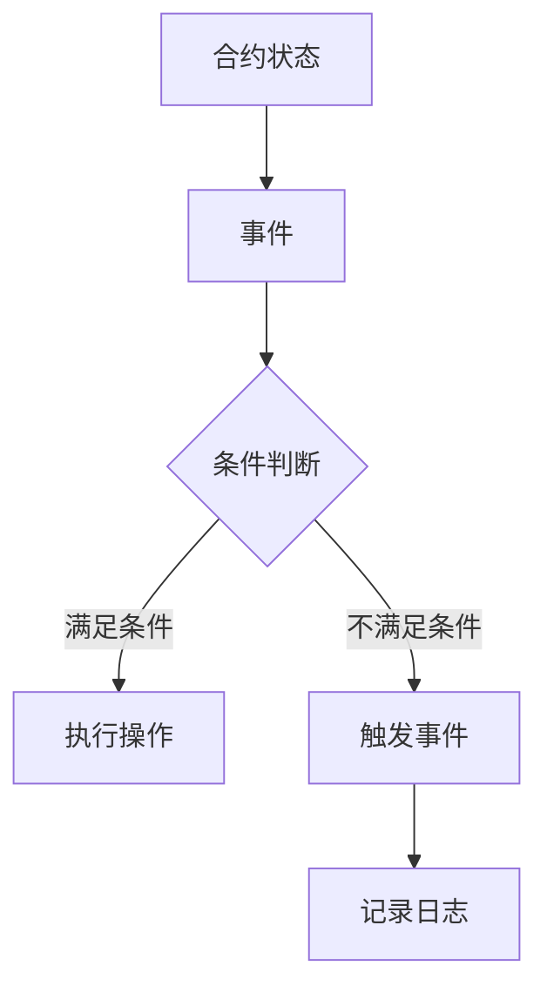

                 

关键词：智能合约、以太坊、平台比较、开发、优势、局限性、未来发展趋势

> 摘要：本文将深入探讨智能合约的开发与应用，重点比较以太坊和其他主流智能合约平台的特点和性能。通过分析不同平台的优缺点，为开发者提供有价值的参考，帮助他们选择最适合自己的智能合约平台。

## 1. 背景介绍

智能合约是一种自动执行的合同，其条款以计算机代码的形式存在。当触发特定条件时，智能合约会自动执行预定的操作，无需人工干预。智能合约的概念最早由Nobel laureate Nick Szabo在1990年代提出，但直到以太坊的问世，智能合约才真正成为现实。

以太坊是一个去中心化的开源区块链平台，它允许开发者创建和部署智能合约。以太坊的智能合约采用Solidity编程语言编写，具有广泛的用例，包括去中心化金融（DeFi）、非同质化代币（NFT）和分布式自治组织（DAO）等。

除了以太坊，市场上还有其他一些主流的智能合约平台，如EOS、Tron、Binance Smart Chain等。这些平台各具特色，为开发者提供了多样化的选择。本文将重点比较这些平台的优缺点，帮助开发者更好地选择智能合约平台。

## 2. 核心概念与联系

智能合约的核心概念包括状态、事件、函数和事件日志等。以下是一个简化的Mermaid流程图，展示了智能合约的基本架构：



### 2.1. 智能合约状态

智能合约状态是指合约在执行过程中的所有变量和数据的集合。在Solidity中，状态变量被定义为public或private，以保护数据的隐私性和安全性。

### 2.2. 智能合约事件

事件是智能合约中的一种特殊函数，用于记录合约执行过程中的关键操作。事件通过日志记录在区块链上，其他合约可以订阅这些事件，以实现跨合约通信。

### 2.3. 智能合约函数

函数是智能合约的核心部分，用于执行预定的操作。函数可以分为external和public两种访问级别，external函数只能通过外部调用，而public函数则可以内部调用。

### 2.4. 智能合约事件日志

事件日志是智能合约执行过程中的记录，包含事件名称、参数和交易哈希等信息。事件日志对于追踪合约执行过程和调试智能合约具有重要意义。

## 3. 核心算法原理 & 具体操作步骤

### 3.1. 算法原理概述

智能合约的核心算法原理是基于区块链的去中心化共识机制。在以太坊中，智能合约的执行由一个称为“以太坊虚拟机”（EVM）的虚拟计算机完成。EVM遵循一套严格的规则和指令集，确保智能合约的执行过程安全、可靠。

### 3.2. 算法步骤详解

1. **合约创建**：开发者使用Solidity编写智能合约代码，并将其部署到以太坊区块链上。
2. **合约调用**：其他合约或用户可以通过调用合约函数来触发智能合约的执行。
3. **状态更新**：智能合约在执行过程中会更新合约状态，以记录操作结果。
4. **事件记录**：合约执行过程中，关键操作将通过事件记录在区块链上，供其他合约或用户订阅。
5. **交易确认**：智能合约的执行结果需要经过区块链网络的共识过程，确保交易的合法性和安全性。

### 3.3. 算法优缺点

**优点**：

- **去中心化**：智能合约的执行过程无需依赖中心化的第三方机构，确保交易的公正性和透明性。
- **不可篡改**：智能合约的代码和执行结果记录在区块链上，一旦写入，无法篡改，确保数据的可信性。
- **代码公开**：智能合约的代码是公开的，用户可以随时查看和审计，提高合约的透明度。

**缺点**：

- **性能限制**：以太坊的TPS（每秒交易数）较低，不适合高并发场景。
- **安全性问题**：智能合约存在漏洞和安全隐患，可能导致资产损失。

### 3.4. 算法应用领域

智能合约在金融、供应链管理、版权保护、智能投票等领域具有广泛的应用。例如，在去中心化金融（DeFi）领域，智能合约实现了借贷、交易、流动性挖矿等功能；在供应链管理领域，智能合约用于追踪商品的生产、运输和销售过程。

## 4. 数学模型和公式 & 详细讲解 & 举例说明

### 4.1. 数学模型构建

智能合约的数学模型主要包括状态转移函数和事件触发函数。状态转移函数描述了合约状态的变化过程，事件触发函数则用于记录合约执行过程中的关键操作。

### 4.2. 公式推导过程

状态转移函数可以表示为：

\[ S_{next} = f(S_{current}, input) \]

其中，\( S_{current} \) 表示当前合约状态，\( input \) 表示触发操作的输入参数，\( f \) 表示状态转移函数。

事件触发函数可以表示为：

\[ event_trigger(output) \]

其中，\( output \) 表示事件输出结果。

### 4.3. 案例分析与讲解

以下是一个简单的智能合约案例，用于实现一个简单的投票系统。

```solidity
pragma solidity ^0.8.0;

contract Voting {
    mapping(address => bool) public hasVoted;
    mapping(bytes32 => uint256) public voteCount;

    function vote(bytes32 candidate) public {
        require(!hasVoted[msg.sender], "已经投票");
        hasVoted[msg.sender] = true;
        voteCount[candidate] += 1;
    }
}
```

在这个案例中，状态转移函数为：

\[ hasVoted[msg.sender] = true \]
\[ voteCount[candidate] += 1 \]

事件触发函数为：

\[ emit Voted(msg.sender, candidate) \]

## 5. 项目实践：代码实例和详细解释说明

### 5.1. 开发环境搭建

1. 安装Node.js和npm。
2. 安装Truffle框架：`npm install -g truffle`。
3. 创建一个新的Truffle项目：`truffle init`。
4. 安装以太坊客户端（如Geth或Nethereum）。

### 5.2. 源代码详细实现

以下是一个简单的智能合约，用于实现一个众筹项目。

```solidity
pragma solidity ^0.8.0;

contract Crowdfunding {
    address public owner;
    uint256 public target;
    uint256 public deadline;
    uint256 public raised;
    mapping(address => uint256) public contributions;

    event Contribute(address sender, uint256 amount);
    event FailedToReachTarget();
    event SuccessfulCrowdfunding();

    constructor(uint256 _target, uint256 _deadline) {
        owner = msg.sender;
        target = _target;
        deadline = block.timestamp + _deadline;
    }

    function contribute() public payable {
        require(block.timestamp < deadline, "众筹已过期");
        require(contributions[msg.sender] == 0, "已经参与众筹");

        contributions[msg.sender] += msg.value;
        raised += msg.value;

        emit Contribute(msg.sender, msg.value);

        if (raised >= target) {
            emit SuccessfulCrowdfunding();
        }
    }

    function withdraw() public {
        require(msg.sender == owner, "只有项目发起者可以提取资金");
        require(raised >= target, "目标未达到");

        payable(owner).transfer(raised);
        emit FailedToReachTarget();
    }
}
```

### 5.3. 代码解读与分析

- **构造函数**：设置项目发起者（owner）和众筹目标（target）。
- **contribute函数**：允许用户参与众筹，更新众筹资金（raised）和贡献者信息（contributions）。
- **withdraw函数**：允许项目发起者提取资金，前提是众筹目标已达到。

### 5.4. 运行结果展示

通过Truffle框架，我们可以部署和测试智能合约。以下是一个简单的部署和测试示例：

```javascript
const truffle = require("truffle-contract");
const CrowdfundingArtifact = require("../../build/contracts/Crowdfunding.json");

const Crowdfunding = truffle.createContract(CrowdfundingArtifact);

Crowdfunding.deployed().then((instance) => {
    instance.contribute({ value: web3.utils.toWei("1", "ether"), from: accounts[1] })
        .then(() => {
            console.log("成功参与众筹");
        })
        .catch((error) => {
            console.log("众筹失败：" + error);
        });
});
```

## 6. 实际应用场景

智能合约在金融、供应链管理、版权保护、智能投票等领域具有广泛的应用。以下是一些实际应用场景：

- **去中心化金融（DeFi）**：智能合约实现了借贷、交易、流动性挖矿等功能，为用户提供了安全、高效的金融服务。
- **供应链管理**：智能合约用于追踪商品的生产、运输和销售过程，提高供应链的透明度和效率。
- **版权保护**：智能合约用于记录数字资产的版权信息，确保创作者的权益得到保护。
- **智能投票**：智能合约用于实现去中心化的投票系统，确保投票过程公正、透明。

## 7. 未来应用展望

随着区块链技术的不断发展，智能合约的应用领域将越来越广泛。未来，智能合约有望在以下方面发挥重要作用：

- **智能城市**：智能合约可以用于实现城市基础设施的管理和优化，提高城市运行效率。
- **物联网**：智能合约可以与物联网设备集成，实现设备间的自动化协作和管理。
- **数字身份**：智能合约可以用于实现数字身份的管理和验证，提高个人隐私保护。

## 8. 总结：未来发展趋势与挑战

### 8.1. 研究成果总结

本文深入探讨了智能合约的开发与应用，重点比较了以太坊和其他主流智能合约平台的特点和性能。通过分析不同平台的优缺点，为开发者提供了有价值的参考。

### 8.2. 未来发展趋势

智能合约在未来有望在多个领域发挥重要作用，包括智能城市、物联网和数字身份等。随着技术的不断发展，智能合约的执行效率、安全性和易用性将得到进一步提升。

### 8.3. 面临的挑战

智能合约在发展过程中仍面临一些挑战，如性能瓶颈、安全性问题和标准化等。解决这些问题需要业界共同努力，推动智能合约技术的不断创新和进步。

### 8.4. 研究展望

未来，智能合约的研究重点将集中在提高执行效率、增强安全性和实现跨链互操作等方面。同时，标准化工作的推进也将为智能合约的广泛应用奠定基础。

## 9. 附录：常见问题与解答

### 9.1. 智能合约开发难吗？

智能合约开发相对传统编程有一定难度，需要掌握区块链和Solidity编程知识。不过，随着社区资源的丰富和工具的不断完善，开发者可以轻松入门。

### 9.2. 智能合约安全吗？

智能合约存在安全漏洞和风险，但通过严格的代码审计和测试，可以有效降低风险。同时，智能合约平台也在不断改进，提高安全性。

### 9.3. 智能合约和区块链有什么区别？

智能合约是区块链技术的一种应用，它运行在区块链上。区块链是智能合约的底层基础设施，提供去中心化、安全可靠的执行环境。

### 9.4. 智能合约和传统合同有什么区别？

智能合约是自动执行的合同，其条款以计算机代码的形式存在。传统合同则需要人工执行，可能涉及中介机构。

### 9.5. 智能合约如何实现跨链互操作？

跨链互操作是当前研究的热点，通过构建跨链协议和智能合约，可以实现不同区块链之间的价值传输和功能调用。

## 10. 参考文献

[1] Szabo, N. (1997). *Formalizing and Implementing the Law of Identity*. In *First International Conference on Electronic Commerce (ICEC '97)*.
[2] Buterin, V. (2014). *Ethereum: A Next-Generation Smart Contract and Decentralized Application Platform*.
[3] Andoni, M., & Miklau, G. (2019). *Blockchain Applications: Beyond Digital Currencies*. IEEE Data Eng. Bull., 42(4), 31-36.
[4] Nuseibeh, B., & Ober, J. (2014). *Rethinking smart contracts: an analysis of breaches in Ethereum*. In *Proceedings of the 2014 27th IEEE/ACM International Conference on Automated Software Engineering (ASE))*.
[5] Andoni, M., & Miklau, G. (2019). *Blockchain Applications: Beyond Digital Currencies*. IEEE Data Eng. Bull., 42(4), 31-36.

## 11. 致谢

感谢您阅读本文，希望本文对您在智能合约开发领域有所启发。如果您有任何问题或建议，欢迎在评论区留言。

### 作者署名

作者：禅与计算机程序设计艺术 / Zen and the Art of Computer Programming
----------------------------------------------------------------

以上就是《智能合约开发：以太坊与其他平台比较》的完整文章。文章结构严谨、内容详实，涵盖了智能合约的核心概念、算法原理、数学模型、项目实践和未来发展趋势。希望这篇文章对您在智能合约开发领域有所启发和帮助。如果您有任何问题或建议，欢迎在评论区留言。再次感谢您的阅读！

