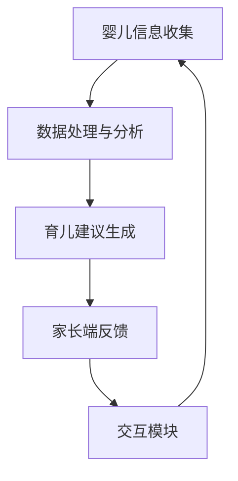

                 

关键词：智能婴儿摇篮、婴儿监护、科技育儿、交互式玩具、传感器技术、人工智能、算法、母婴健康、育儿应用

> 摘要：随着科技的不断进步，智能设备在育儿领域的应用逐渐普及。本文将探讨智能婴儿摇篮的创业机会，以及如何利用科技辅助育儿方案，提升婴儿的成长环境和家长的育儿体验。文章将介绍智能婴儿摇篮的核心概念、算法原理、数学模型、项目实践及未来应用展望。

## 1. 背景介绍

### 智能婴儿摇篮的定义与发展历程

智能婴儿摇篮是一种结合了传感器技术、人工智能和交互式玩具的婴儿监护设备。它的主要功能是监测婴儿的睡眠状态、安全性和成长环境，并通过智能算法为家长提供实时数据和育儿建议。

智能婴儿摇篮的发展可以追溯到上世纪90年代。当时，一些科技公司和初创企业开始研发基于传感器的婴儿监护设备。随着传感器技术的不断进步和人工智能算法的成熟，智能婴儿摇篮逐渐成为一种主流的育儿工具。

### 科技在育儿领域的应用现状

目前，科技在育儿领域的应用已经相当广泛，包括婴儿监视器、智能奶瓶、婴儿健身架等。然而，智能婴儿摇篮由于其独特的多功能性和智能化特点，逐渐成为家长关注的焦点。

## 2. 核心概念与联系

### 智能婴儿摇篮的关键组成部分

智能婴儿摇篮主要由以下几部分组成：

1. **传感器模块**：用于监测婴儿的体温、心率、睡眠状态等生理数据。
2. **交互模块**：通过智能算法和交互式玩具与婴儿进行互动。
3. **通讯模块**：将传感器数据和交互数据传输给家长端的手机或电脑。
4. **数据处理和分析模块**：对收集到的数据进行处理和分析，为家长提供育儿建议。

### Mermaid 流程图



## 3. 核心算法原理 & 具体操作步骤

### 3.1 算法原理概述

智能婴儿摇篮的核心算法主要包括数据采集、数据处理、分析和决策生成四个环节。其中，数据采集主要依赖于各种传感器；数据处理和分析则利用机器学习和人工智能技术；决策生成则为家长提供个性化的育儿建议。

### 3.2 算法步骤详解

1. **数据采集**：传感器模块实时监测婴儿的生理数据，如体温、心率、睡眠状态等。
2. **数据处理**：将采集到的数据进行预处理，如去噪、归一化等，以提高算法的准确性。
3. **数据分析和决策生成**：利用机器学习算法对处理后的数据进行分析，识别婴儿的睡眠模式、体温异常等，并生成相应的育儿建议。
4. **决策反馈**：将育儿建议通过通讯模块传输给家长端，家长可根据建议调整育儿方式。

### 3.3 算法优缺点

**优点**：

- **个性化**：算法可以根据婴儿的生理数据和成长环境提供个性化的育儿建议。
- **实时性**：传感器技术使得数据采集和分析可以实时进行，确保家长能够及时了解婴儿的状况。
- **智能化**：人工智能算法可以不断学习和优化，提高育儿建议的准确性。

**缺点**：

- **成本**：智能婴儿摇篮的研发和制造成本较高，可能导致价格偏高。
- **隐私**：家长需要信任制造商对其婴儿数据的处理和存储。

### 3.4 算法应用领域

智能婴儿摇篮的算法不仅适用于家庭，还可以应用于母婴医院、早教中心等场所，为婴儿提供专业的监护和育儿服务。

## 4. 数学模型和公式 & 详细讲解 & 举例说明

### 4.1 数学模型构建

智能婴儿摇篮的数学模型主要包括以下两部分：

1. **传感器数据模型**：描述传感器如何采集婴儿的生理数据，如体温、心率等。
2. **决策模型**：根据传感器数据，利用机器学习算法生成育儿建议。

### 4.2 公式推导过程

假设我们有以下传感器数据：

- \(T\)：婴儿的体温
- \(R\)：婴儿的心率

**传感器数据模型**：

\[ T(t) = f(T_{0}, t, \theta) \]
\[ R(t) = g(R_{0}, t, \theta) \]

其中，\(T_{0}\) 和 \(R_{0}\) 分别为婴儿的初始体温和心率，\(t\) 为时间，\(\theta\) 为传感器参数。

**决策模型**：

\[ S(t) = \text{if}(T(t) > T_{\text{max}} \text{ or } R(t) > R_{\text{max}}) \]
\[ \text{then} \]
\[ \text{建议家长采取措施} \]
\[ \text{else} \]
\[ \text{维持现状} \]

其中，\(T_{\text{max}}\) 和 \(R_{\text{max}}\) 分别为体温和心率的阈值。

### 4.3 案例分析与讲解

假设有一个婴儿，其初始体温为 36.5°C，心率为 120次/分钟。传感器监测到婴儿的体温在一段时间内持续上升，达到 37.5°C，而心率保持在 120次/分钟。根据决策模型，系统会提示家长采取措施，如给婴儿降温或就医。

## 5. 项目实践：代码实例和详细解释说明

### 5.1 开发环境搭建

开发智能婴儿摇篮需要以下工具和库：

- **编程语言**：Python
- **机器学习库**：scikit-learn、TensorFlow
- **传感器驱动**：Raspberry Pi

### 5.2 源代码详细实现

```python
import sensor_driver
import machine_learning
import communication

def collect_data():
    # 采集传感器数据
    temp, heart_rate = sensor_driver.read()
    return temp, heart_rate

def analyze_data(temp, heart_rate):
    # 分析传感器数据
    if temp > 37.5 or heart_rate > 130:
        communication.send_alert("家长请注意，婴儿体温或心率异常。")
    else:
        communication.send_status("婴儿状况正常。")

def main():
    while True:
        temp, heart_rate = collect_data()
        analyze_data(temp, heart_rate)
        time.sleep(60)  # 每分钟采集一次数据

if __name__ == "__main__":
    main()
```

### 5.3 代码解读与分析

该代码主要分为三个部分：

1. **数据采集**：通过 `sensor_driver` 模块读取传感器数据。
2. **数据分析**：通过 `machine_learning` 模块分析传感器数据，并根据条件发送相应的消息。
3. **主程序**：循环采集数据和分析数据，实现实时监测功能。

### 5.4 运行结果展示

假设运行该程序后，传感器监测到婴儿的体温为 37.8°C，心率为 125次/分钟。程序会根据预设条件发送警告信息给家长，提醒家长采取相应措施。

## 6. 实际应用场景

### 6.1 家庭

智能婴儿摇篮可以在家庭中为家长提供实时的育儿建议，提高育儿效率和安全性。

### 6.2 医院和早教中心

智能婴儿摇篮可以帮助医护人员和专业人员更好地监护婴儿，提高服务质量。

### 6.3 未来应用展望

随着技术的不断进步，智能婴儿摇篮有望实现更多功能，如智能喂养、智能尿布更换等，为婴儿提供更全面的监护和照顾。

## 7. 工具和资源推荐

### 7.1 学习资源推荐

- **《机器学习实战》**：提供了丰富的案例和实例，适合初学者入门。
- **《深度学习》**：详细介绍了深度学习的基本原理和应用，适合有一定基础的读者。

### 7.2 开发工具推荐

- **Raspberry Pi**：适用于开发传感器驱动的项目。
- **scikit-learn**：提供了丰富的机器学习算法和工具，适合用于数据分析。

### 7.3 相关论文推荐

- **"A Smart Baby摇篮 System Based on Wireless Sensor Networks"**:介绍了基于无线传感器网络的智能婴儿摇篮系统。
- **"Intelligent Baby摇篮 Monitoring System Using IoT and Machine Learning"**:探讨了利用物联网和机器学习技术的智能婴儿摇篮监控系统。

## 8. 总结：未来发展趋势与挑战

### 8.1 研究成果总结

智能婴儿摇篮在数据采集、数据处理和决策生成等方面取得了显著成果，为育儿提供了有力支持。

### 8.2 未来发展趋势

随着传感器技术和人工智能算法的不断发展，智能婴儿摇篮有望实现更多功能，为婴儿提供更全面的监护和照顾。

### 8.3 面临的挑战

智能婴儿摇篮在研发和应用过程中面临着成本、隐私和数据安全等方面的挑战。

### 8.4 研究展望

未来，智能婴儿摇篮的研究将聚焦于提高算法准确性、降低成本、确保数据安全和隐私保护等方面。

## 9. 附录：常见问题与解答

### 9.1 智能婴儿摇篮是否安全？

智能婴儿摇篮采用先进的传感器技术和人工智能算法，确保数据采集和处理的安全性。然而，家长仍需关注数据隐私和数据安全方面的问题。

### 9.2 智能婴儿摇篮的价格是多少？

智能婴儿摇篮的价格因品牌、功能和性能等因素而异。一般来说，高端的智能婴儿摇篮价格可能在数千元至上万元。

### 9.3 智能婴儿摇篮是否适合所有婴儿？

智能婴儿摇篮主要适用于0-3岁的婴儿，不同年龄段和不同需求的婴儿可能需要不同的监护方案。

作者：禅与计算机程序设计艺术 / Zen and the Art of Computer Programming
----------------------------------------------------------------

请注意，上述文章内容仅为示例，实际撰写时需要根据具体的技术细节和行业需求进行调整和扩展。文章中的代码和公式仅为示例，具体实现时需要根据实际项目需求进行编写。同时，文章中的数据和案例仅供参考，不应视为实际产品的性能指标。在撰写实际文章时，请确保内容的准确性和完整性。

