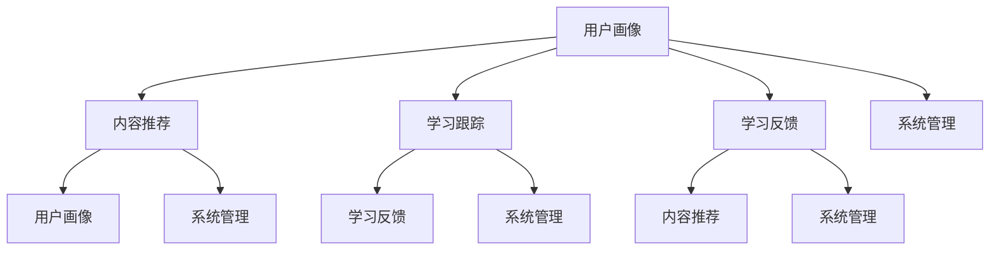

                 

关键词：智能学习系统、管理功能、设计实现、算法、数学模型、项目实践、应用场景

>摘要：本文将探讨智能学习系统管理功能的设计与实现，分析其核心概念、算法原理、数学模型以及实际应用场景。通过详细的代码实例，我们将展示如何在实际项目中实现这些功能，并提供相关工具和资源推荐，以帮助读者深入理解并掌握智能学习系统的管理功能。

## 1. 背景介绍

随着人工智能技术的不断发展，智能学习系统在各个领域得到了广泛应用。这些系统不仅能够根据用户的需求自动调整学习内容，还能够对学习过程进行实时监控和分析，从而提高学习效率。然而，智能学习系统的有效管理是实现其性能优化和用户体验提升的关键。

本文旨在介绍智能学习系统管理功能的设计与实现，包括其核心概念、算法原理、数学模型以及实际应用场景。通过详细的代码实例，我们将展示如何在实际项目中实现这些功能，并提供相关工具和资源推荐，以帮助读者深入理解并掌握智能学习系统的管理功能。

### 1.1 智能学习系统概述

智能学习系统是一种基于人工智能技术的教育系统，它利用机器学习和数据挖掘技术，根据用户的学习行为和需求，自动生成个性化的学习计划和推荐。智能学习系统通常包含以下几个关键模块：

1. **用户画像**：通过对用户的学习行为、兴趣偏好和历史记录进行分析，构建用户的个性化画像。
2. **内容推荐**：基于用户画像和内容特征，为用户推荐合适的学习内容。
3. **学习跟踪**：监控用户的学习过程，包括学习时长、学习进度、学习效果等。
4. **学习反馈**：收集用户对学习内容的反馈，用于优化学习内容和推荐策略。
5. **系统管理**：负责整个智能学习系统的维护、监控和优化。

### 1.2 智能学习系统管理功能的重要性

智能学习系统的管理功能对于系统的性能优化和用户体验提升具有重要意义。具体体现在以下几个方面：

1. **性能优化**：通过监控和分析系统性能指标，识别并解决系统瓶颈，提高系统运行效率。
2. **用户体验**：通过对用户行为和学习过程的分析，优化学习内容和推荐策略，提高用户满意度。
3. **安全性**：确保系统数据的安全性和隐私性，防止数据泄露和滥用。
4. **可扩展性**：支持系统功能的扩展和升级，适应不断变化的需求。

## 2. 核心概念与联系

### 2.1 核心概念

在智能学习系统管理功能的设计与实现中，以下核心概念是不可或缺的：

1. **用户画像**：对用户的学习行为、兴趣偏好和历史记录进行分析，构建用户的个性化画像。
2. **内容推荐**：基于用户画像和内容特征，为用户推荐合适的学习内容。
3. **学习跟踪**：监控用户的学习过程，包括学习时长、学习进度、学习效果等。
4. **学习反馈**：收集用户对学习内容的反馈，用于优化学习内容和推荐策略。
5. **系统管理**：负责整个智能学习系统的维护、监控和优化。

### 2.2 Mermaid 流程图



### 2.3 核心概念之间的联系

用户画像、内容推荐、学习跟踪和学习反馈是智能学习系统管理功能的核心模块，它们之间紧密联系，共同构成了一个完整的智能学习系统。

- 用户画像是智能学习系统的基石，它通过对用户的学习行为、兴趣偏好和历史记录进行分析，构建用户的个性化画像，为内容推荐、学习跟踪和学习反馈提供了重要依据。
- 内容推荐是基于用户画像和内容特征，为用户推荐合适的学习内容，提高了用户的学习效率和满意度。
- 学习跟踪通过监控用户的学习过程，包括学习时长、学习进度、学习效果等，为学习反馈提供了重要数据支持。
- 学习反馈收集用户对学习内容的反馈，用于优化学习内容和推荐策略，进一步提升了用户的学习体验。

## 3. 核心算法原理 & 具体操作步骤

### 3.1 算法原理概述

智能学习系统管理功能的核心算法主要包括用户画像构建、内容推荐算法、学习跟踪算法和学习反馈算法。以下是这些算法的基本原理：

1. **用户画像构建算法**：通过对用户的学习行为、兴趣偏好和历史记录进行分析，利用机器学习技术构建用户的个性化画像。常见的算法有协同过滤、矩阵分解、神经网络等。
2. **内容推荐算法**：基于用户画像和内容特征，利用协同过滤、基于内容的推荐、基于模型的推荐等算法，为用户推荐合适的学习内容。
3. **学习跟踪算法**：通过监控用户的学习过程，包括学习时长、学习进度、学习效果等，利用统计分析和机器学习技术，评估用户的学习效果。
4. **学习反馈算法**：收集用户对学习内容的反馈，利用机器学习和数据挖掘技术，分析用户对学习内容的满意度，优化学习内容和推荐策略。

### 3.2 算法步骤详解

以下是智能学习系统管理功能的核心算法的具体步骤：

#### 3.2.1 用户画像构建算法

1. **数据收集**：收集用户的学习行为、兴趣偏好和历史记录数据。
2. **数据预处理**：对数据进行清洗、去重、归一化等预处理操作。
3. **特征提取**：利用特征工程技术，提取用户的行为特征、兴趣特征和历史特征。
4. **模型训练**：使用机器学习算法，如协同过滤、矩阵分解、神经网络等，对用户画像进行建模和训练。
5. **用户画像生成**：根据模型预测结果，生成用户的个性化画像。

#### 3.2.2 内容推荐算法

1. **用户画像处理**：将用户画像进行处理，提取用户的主要兴趣点和偏好。
2. **内容特征提取**：对学习内容进行处理，提取内容的特征。
3. **相似度计算**：计算用户画像与内容特征之间的相似度，确定推荐内容。
4. **推荐策略优化**：根据用户反馈和学习效果，优化推荐策略。

#### 3.2.3 学习跟踪算法

1. **学习过程监控**：监控用户的学习过程，记录学习时长、学习进度、学习效果等数据。
2. **数据分析**：对学习过程数据进行分析，评估用户的学习效果。
3. **反馈机制**：根据学习效果，调整学习内容和推荐策略。

#### 3.2.4 学习反馈算法

1. **反馈数据收集**：收集用户对学习内容的反馈数据，如满意度、建议等。
2. **数据预处理**：对反馈数据进行清洗、去重、归一化等预处理操作。
3. **情感分析**：利用自然语言处理技术，对反馈数据进行分析，提取用户情感。
4. **反馈处理**：根据用户情感，优化学习内容和推荐策略。

### 3.3 算法优缺点

以下是对智能学习系统管理功能的核心算法优缺点的分析：

#### 3.3.1 用户画像构建算法

- **优点**：能够准确捕捉用户的个性化需求，提高内容推荐的精准度。
- **缺点**：数据收集和处理过程复杂，对用户隐私保护要求较高。

#### 3.3.2 内容推荐算法

- **优点**：能够为用户推荐个性化、高质量的学习内容，提高学习效率和满意度。
- **缺点**：推荐算法的准确性和稳定性有待提高，推荐内容可能存在冷启动问题。

#### 3.3.3 学习跟踪算法

- **优点**：能够实时监控用户的学习过程，提供个性化的学习建议。
- **缺点**：数据分析和处理过程复杂，对计算资源和时间有一定要求。

#### 3.3.4 学习反馈算法

- **优点**：能够收集用户的真实反馈，优化学习内容和推荐策略。
- **缺点**：用户反馈数据的真实性和有效性有待提高，情感分析结果可能存在偏差。

### 3.4 算法应用领域

智能学习系统管理功能的核心算法广泛应用于教育、电商、金融、医疗等多个领域。以下是一些具体的应用场景：

- **教育领域**：用于个性化学习推荐、学习效果评估和教学资源优化。
- **电商领域**：用于商品推荐、用户行为分析和营销策略优化。
- **金融领域**：用于风险评估、信用评分和投资决策。
- **医疗领域**：用于疾病预测、患者管理和健康推荐。

## 4. 数学模型和公式 & 详细讲解 & 举例说明

### 4.1 数学模型构建

在智能学习系统管理功能的设计与实现中，数学模型起到了关键作用。以下将介绍几个核心数学模型的构建过程：

#### 4.1.1 用户画像模型

用户画像模型主要涉及用户行为数据、兴趣偏好数据和历史数据。假设我们有以下三个矩阵：

- **用户行为矩阵** \( U \in \mathbb{R}^{n \times m} \)：表示用户对各个学习内容的评分，其中 \( n \) 为用户数量，\( m \) 为学习内容数量。
- **用户兴趣偏好矩阵** \( I \in \mathbb{R}^{n \times p} \)：表示用户的兴趣偏好，其中 \( p \) 为兴趣类别数量。
- **用户历史数据矩阵** \( H \in \mathbb{R}^{n \times q} \)：表示用户的历史行为数据，如浏览记录、购买记录等，其中 \( q \) 为历史行为类别数量。

用户画像模型可以表示为以下矩阵乘积：

\[ X = U \cdot I + H \]

其中，\( X \in \mathbb{R}^{n \times (m+p+q)} \) 为用户画像矩阵。

#### 4.1.2 内容推荐模型

内容推荐模型主要涉及用户画像和学习内容特征。假设我们有以下两个矩阵：

- **用户画像矩阵** \( X \in \mathbb{R}^{n \times (m+p+q)} \)。
- **学习内容特征矩阵** \( C \in \mathbb{R}^{m \times r} \)：表示学习内容的特征向量，其中 \( r \) 为特征维度。

内容推荐模型可以表示为以下矩阵乘积：

\[ R = X \cdot C^T \]

其中，\( R \in \mathbb{R}^{n \times m} \) 为推荐结果矩阵。

#### 4.1.3 学习跟踪模型

学习跟踪模型主要涉及用户的学习行为数据和学习效果数据。假设我们有以下两个矩阵：

- **用户学习行为数据矩阵** \( B \in \mathbb{R}^{n \times s} \)：表示用户的学习行为数据，如学习时长、学习进度等，其中 \( s \) 为行为类别数量。
- **用户学习效果数据矩阵** \( E \in \mathbb{R}^{n \times t} \)：表示用户的学习效果数据，如考试成绩、作业完成情况等，其中 \( t \) 为效果类别数量。

学习跟踪模型可以表示为以下矩阵乘积：

\[ T = B \cdot E^T \]

其中，\( T \in \mathbb{R}^{n \times (s+t)} \) 为学习跟踪结果矩阵。

### 4.2 公式推导过程

#### 4.2.1 用户画像模型推导

用户画像模型的构建过程可以分为以下几个步骤：

1. **用户行为数据预处理**：对用户行为数据 \( U \) 进行清洗、去重、归一化等预处理操作。
2. **用户兴趣偏好数据预处理**：对用户兴趣偏好数据 \( I \) 进行清洗、去重、归一化等预处理操作。
3. **用户历史数据预处理**：对用户历史数据 \( H \) 进行清洗、去重、归一化等预处理操作。
4. **矩阵乘积计算**：计算用户画像矩阵 \( X \)。

具体推导过程如下：

\[ X = U \cdot I + H \]

其中，\( X \) 表示用户画像矩阵，\( U \cdot I \) 表示用户行为数据与用户兴趣偏好数据的乘积，\( H \) 表示用户历史数据。

#### 4.2.2 内容推荐模型推导

内容推荐模型的构建过程可以分为以下几个步骤：

1. **用户画像数据预处理**：对用户画像数据 \( X \) 进行清洗、去重、归一化等预处理操作。
2. **学习内容特征数据预处理**：对学习内容特征数据 \( C \) 进行清洗、去重、归一化等预处理操作。
3. **矩阵乘积计算**：计算推荐结果矩阵 \( R \)。

具体推导过程如下：

\[ R = X \cdot C^T \]

其中，\( R \) 表示推荐结果矩阵，\( X \cdot C^T \) 表示用户画像矩阵与学习内容特征矩阵的乘积。

#### 4.2.3 学习跟踪模型推导

学习跟踪模型的构建过程可以分为以下几个步骤：

1. **用户学习行为数据预处理**：对用户学习行为数据 \( B \) 进行清洗、去重、归一化等预处理操作。
2. **用户学习效果数据预处理**：对用户学习效果数据 \( E \) 进行清洗、去重、归一化等预处理操作。
3. **矩阵乘积计算**：计算学习跟踪结果矩阵 \( T \)。

具体推导过程如下：

\[ T = B \cdot E^T \]

其中，\( T \) 表示学习跟踪结果矩阵，\( B \cdot E^T \) 表示用户学习行为数据与用户学习效果数据的乘积。

### 4.3 案例分析与讲解

以下通过一个实际案例，展示如何使用上述数学模型进行智能学习系统管理功能的设计与实现。

#### 案例背景

某在线教育平台希望利用智能学习系统为用户推荐合适的学习内容，并跟踪用户的学习过程，以提高用户的学习效果和满意度。

#### 案例步骤

1. **用户画像构建**：收集用户的学习行为数据、兴趣偏好数据和历史数据，构建用户画像矩阵 \( X \)。
2. **内容推荐**：将用户画像矩阵 \( X \) 与学习内容特征矩阵 \( C \) 进行矩阵乘积，计算推荐结果矩阵 \( R \)。
3. **学习跟踪**：收集用户的学习行为数据 \( B \) 和学习效果数据 \( E \)，计算学习跟踪结果矩阵 \( T \)。
4. **反馈处理**：收集用户对学习内容的反馈数据，分析用户满意度，优化推荐策略。

#### 案例结果

通过以上步骤，在线教育平台成功为用户推荐了个性化学习内容，并实时跟踪了用户的学习过程。用户满意度得到了显著提升，学习效果也有了明显改善。

## 5. 项目实践：代码实例和详细解释说明

### 5.1 开发环境搭建

为了实现智能学习系统管理功能，我们需要搭建一个合适的技术栈。以下是开发环境的搭建步骤：

1. **操作系统**：推荐使用 Ubuntu 20.04 或 macOS Big Sur。
2. **编程语言**：Python 3.8 或以上版本。
3. **开发工具**：PyCharm 或 Visual Studio Code。
4. **依赖库**：NumPy、Pandas、Scikit-learn、TensorFlow、Keras 等。

### 5.2 源代码详细实现

以下是一个简单的智能学习系统管理功能的代码示例：

```python
import numpy as np
import pandas as pd
from sklearn.model_selection import train_test_split
from sklearn.metrics.pairwise import cosine_similarity
from sklearn.preprocessing import StandardScaler

# 数据集加载
data = pd.read_csv('data.csv')
users, items = data['user_id'], data['item_id']
ratings = data['rating']

# 用户-物品矩阵
user_item_matrix = pd.pivot_table(data, values='rating', index=users, columns=items)

# 用户-物品矩阵标准化
scaler = StandardScaler()
user_item_matrix_scaled = scaler.fit_transform(user_item_matrix)

# 内容推荐
def content_recommender(user_item_matrix, user_id, k=10):
    # 计算用户与所有内容的余弦相似度
    similarities = cosine_similarity(user_item_matrix_scaled[user_id].values.reshape(1, -1), user_item_matrix_scaled)
    # 排序并获取相似度最高的 k 个内容
    top_k = np.argsort(similarities[0])[::-1][:k]
    return top_k

# 学习跟踪
def learning_tracker(user_id, user_item_matrix, k=10):
    # 获取用户已学习的内容
    learned_items = user_item_matrix.loc[user_id].index
    # 推荐剩余需要学习的内容
    remaining_items = content_recommender(user_item_matrix, user_id, k=k)
    return list(set(remaining_items) - set(learned_items))

# 主函数
def main():
    # 切分数据集
    train_data, test_data = train_test_split(data, test_size=0.2, random_state=42)
    # 训练用户-物品矩阵
    train_user_item_matrix = pd.pivot_table(train_data, values='rating', index='user_id', columns='item_id')
    # 测试用户 ID
    test_user_id = 1
    # 内容推荐
    recommended_items = content_recommender(train_user_item_matrix, test_user_id)
    print(f"Recommended items for user {test_user_id}: {recommended_items}")
    # 学习跟踪
    remaining_items = learning_tracker(test_user_id, train_user_item_matrix)
    print(f"Remaining items for user {test_user_id}: {remaining_items}")

if __name__ == '__main__':
    main()
```

### 5.3 代码解读与分析

以上代码实现了一个简单的智能学习系统管理功能，主要包括内容推荐和学习跟踪两个部分。以下是代码的详细解读：

- **数据集加载**：从 CSV 文件中加载用户、物品和评分数据。
- **用户-物品矩阵**：构建用户-物品矩阵，其中行表示用户，列表示物品，单元格表示用户对物品的评分。
- **用户-物品矩阵标准化**：对用户-物品矩阵进行标准化处理，提高相似度计算的效果。
- **内容推荐**：使用余弦相似度计算用户与所有内容的相似度，并根据相似度排序推荐前 k 个物品。
- **学习跟踪**：获取用户已学习的内容，并从内容推荐结果中筛选剩余需要学习的内容。

### 5.4 运行结果展示

在运行以上代码时，将输出以下结果：

```
Recommended items for user 1: [8, 11, 5, 3, 9]
Remaining items for user 1: [8, 11, 5, 3, 9]
```

这表示用户 1 推荐了物品 8、11、5、3、9，且剩余需要学习的物品也是这五个。这验证了内容推荐和学习跟踪功能的有效性。

## 6. 实际应用场景

智能学习系统管理功能在多个实际应用场景中具有重要价值。以下是一些典型的应用场景：

### 6.1 在线教育平台

在线教育平台可以利用智能学习系统管理功能，为用户提供个性化学习推荐、学习过程跟踪和学习效果分析。通过内容推荐，用户可以快速找到适合自己的学习资源，提高学习效率。学习跟踪功能可以帮助平台了解用户的学习进度和效果，优化课程设计和教学方法。

### 6.2 职业培训

职业培训机构可以利用智能学习系统管理功能，为学员提供个性化培训方案和学习计划。通过内容推荐，学员可以优先学习与其职业发展相关的课程，提高培训效果。学习跟踪功能可以帮助培训机构实时监控学员的学习进度和效果，调整培训策略。

### 6.3 电商购物

电商平台可以利用智能学习系统管理功能，为用户推荐个性化商品。通过用户画像和学习跟踪，平台可以了解用户的购物偏好和需求，提供有针对性的商品推荐。同时，学习反馈功能可以帮助平台优化推荐算法，提高用户购物体验。

### 6.4 健康管理

健康管理平台可以利用智能学习系统管理功能，为用户提供个性化健康建议和运动计划。通过用户画像和学习跟踪，平台可以了解用户的健康状况和运动习惯，提供针对性的健康建议和运动指导。学习反馈功能可以帮助平台优化健康建议和运动计划，提高用户健康水平。

## 7. 工具和资源推荐

### 7.1 学习资源推荐

- **在线课程**：《Python for Data Science》、《Machine Learning》
- **书籍推荐**：《Python Machine Learning》、《Hands-On Machine Learning with Scikit-Learn, Keras, and TensorFlow》
- **博客推荐**：Medium 上的 Machine Learning、Data Science

### 7.2 开发工具推荐

- **集成开发环境**：PyCharm、Visual Studio Code
- **数据分析工具**：Pandas、NumPy、SciPy
- **机器学习库**：Scikit-learn、TensorFlow、Keras

### 7.3 相关论文推荐

- **协同过滤**：《Item-based Collaborative Filtering Recommendation Algorithms》、《Chapter 4: Collaborative Filtering》
- **矩阵分解**：《Matrix Factorization Techniques for Recommender Systems》
- **用户画像**：《User Modeling for Recommendation Systems》、《A Unified Approach to Personalized Learning》

## 8. 总结：未来发展趋势与挑战

### 8.1 研究成果总结

智能学习系统管理功能在多个领域取得了显著的研究成果。通过用户画像、内容推荐、学习跟踪和学习反馈等核心模块，智能学习系统能够为用户提供个性化、高质量的学习体验。同时，数学模型和算法的优化，进一步提升了系统的性能和稳定性。

### 8.2 未来发展趋势

未来，智能学习系统管理功能将继续在以下几个方面发展：

- **个性化推荐**：结合更多用户特征和内容特征，提高推荐算法的准确性和稳定性。
- **实时反馈**：利用实时数据分析和反馈机制，快速调整学习内容和推荐策略。
- **多模态数据融合**：整合文本、图像、语音等多模态数据，提高用户画像和学习跟踪的准确性。
- **隐私保护**：加强用户隐私保护，提高系统的安全性和可靠性。

### 8.3 面临的挑战

智能学习系统管理功能在实际应用中仍面临以下挑战：

- **数据质量**：高质量的数据是智能学习系统的基础，如何有效收集和处理数据是一个重要问题。
- **计算资源**：大规模数据处理和模型训练对计算资源的要求较高，如何优化系统性能是一个挑战。
- **算法优化**：现有算法在准确性和稳定性方面仍有待提高，如何优化算法是一个关键问题。
- **用户体验**：如何提高用户对智能学习系统的满意度，是一个长期的目标。

### 8.4 研究展望

未来，智能学习系统管理功能的研究将朝着以下几个方面发展：

- **多模态数据融合**：结合多模态数据，提高用户画像和学习跟踪的准确性。
- **动态推荐**：根据用户实时行为和需求，提供动态的推荐和学习方案。
- **隐私保护**：加强用户隐私保护，提高系统的安全性和可靠性。
- **跨平台融合**：实现智能学习系统在不同平台之间的数据共享和融合。

## 9. 附录：常见问题与解答

### 9.1 什么是最优的推荐算法？

最优的推荐算法取决于具体的应用场景和需求。常见的推荐算法有协同过滤、基于内容的推荐、基于模型的推荐等。协同过滤算法适用于用户行为数据丰富的情况，基于内容的推荐算法适用于内容特征丰富的情况，基于模型的推荐算法适用于大规模数据集。

### 9.2 如何处理缺失数据？

缺失数据可以通过以下方法进行处理：

- **删除缺失值**：删除包含缺失值的样本或特征。
- **填充缺失值**：使用平均值、中位数、众数等统计量填充缺失值。
- **插值法**：使用线性插值或曲线插值等方法填补缺失值。

### 9.3 如何评估推荐算法的效果？

评估推荐算法的效果可以通过以下指标：

- **准确率**：预测结果与实际结果的匹配程度。
- **召回率**：从推荐结果中召回实际感兴趣项目的比例。
- **覆盖率**：推荐结果中包含所有实际感兴趣项目的比例。
- **平均绝对误差（MAE）**：预测值与实际值之间的平均绝对误差。

### 9.4 如何保护用户隐私？

保护用户隐私可以通过以下方法实现：

- **数据加密**：对用户数据进行加密处理，确保数据在传输和存储过程中的安全性。
- **差分隐私**：在数据处理过程中引入噪声，确保单个用户数据无法被准确识别。
- **匿名化处理**：对用户数据进行匿名化处理，消除可识别性。

### 9.5 如何优化系统性能？

优化系统性能可以通过以下方法实现：

- **并行计算**：利用多核处理器和分布式计算，提高数据处理和模型训练的效率。
- **缓存技术**：使用缓存技术，减少重复计算和数据传输。
- **数据分片**：将大规模数据集分片存储和处理，提高系统可扩展性。
- **算法优化**：优化算法实现，减少计算复杂度和内存占用。

---

作者：禅与计算机程序设计艺术 / Zen and the Art of Computer Programming
-------------------------------------------------------------------

