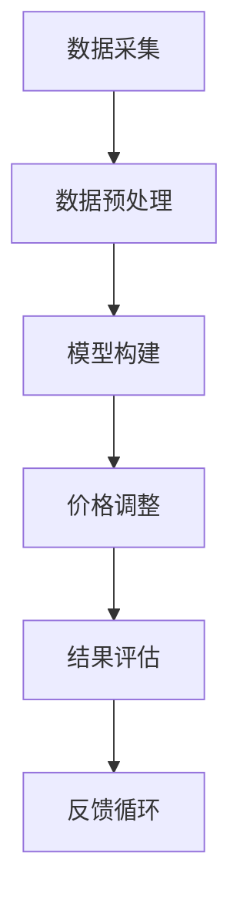

                 

智能定价技术，作为一种高度复杂且潜力巨大的领域，正在逐步渗透到商业决策的各个层面。本文将深入探讨智能定价技术的核心概念、算法原理、数学模型、实际应用以及未来展望。通过详细的解析，希望能够为读者提供一份全面的技术指南，以更好地理解和应用这一前沿技术。

## 文章关键词

- 智能定价
- 技术实现
- 算法原理
- 数学模型
- 实际应用

## 文章摘要

本文首先介绍了智能定价技术的背景和重要性，接着详细阐述了其核心概念和原理，并通过Mermaid流程图展示了智能定价技术的架构。随后，文章重点分析了智能定价算法的原理和操作步骤，对算法的优缺点和应用领域进行了探讨。接着，文章介绍了智能定价技术中的数学模型和公式，并通过实际案例进行了深入讲解。此外，文章还提供了一个完整的代码实例，详细解读了代码的实现过程。最后，文章探讨了智能定价技术的实际应用场景，并对其未来发展进行了展望。

## 1. 背景介绍

### 1.1 智能定价的概念

智能定价是指利用人工智能和大数据分析技术，对产品或服务的价格进行动态调整，以最大化利润或市场份额的一种策略。传统的定价方法往往基于历史数据和市场经验，而智能定价则通过机器学习和数据分析，实现价格决策的自动化和智能化。

### 1.2 智能定价的重要性

随着市场竞争的日益激烈，企业需要更加灵活和高效的定价策略来适应市场变化。智能定价技术能够实时捕捉市场动态，快速调整价格，提高定价的准确性和响应速度，从而帮助企业获得更大的竞争优势。

### 1.3 智能定价的发展历程

智能定价技术最早可以追溯到20世纪80年代的优化定价算法。随着计算能力的提升和大数据技术的发展，智能定价技术逐渐成熟，并在21世纪初开始广泛应用于各种行业。如今，智能定价已经成为企业提高盈利能力和市场竞争力的重要手段。

## 2. 核心概念与联系

### 2.1 核心概念

#### 2.1.1 机器学习

机器学习是智能定价技术的基础，通过建立价格预测模型，实现价格的动态调整。常见的机器学习算法包括线性回归、决策树、神经网络等。

#### 2.1.2 大数据分析

大数据分析技术用于处理和分析大量的市场数据，提取有价值的信息，为智能定价提供数据支持。

#### 2.1.3 数据挖掘

数据挖掘技术用于从大量数据中提取隐藏的模式和趋势，帮助企业制定更精准的定价策略。

### 2.2 架构与流程

#### 2.2.1 数据采集

数据采集是智能定价技术的第一步，包括市场数据、客户数据、产品数据等。

#### 2.2.2 数据预处理

数据预处理包括数据清洗、数据整合和特征提取等步骤，为后续分析提供高质量的数据。

#### 2.2.3 模型构建

模型构建是基于机器学习和数据挖掘技术，通过训练数据建立价格预测模型。

#### 2.2.4 价格调整

价格调整是基于预测模型，根据市场变化动态调整产品或服务的价格。

#### 2.2.5 结果评估

结果评估是对智能定价策略的有效性进行评估，通过对比实际销售数据与预测数据，优化模型和策略。



## 3. 核心算法原理 & 具体操作步骤

### 3.1 算法原理概述

智能定价的核心在于建立价格预测模型，常用的算法包括线性回归、决策树、神经网络等。以下将详细阐述这些算法的原理和具体操作步骤。

### 3.2 算法步骤详解

#### 3.2.1 线性回归

1. 数据准备：收集历史销售数据、市场数据、产品数据等。
2. 特征提取：对数据进行预处理，提取影响价格的关键特征。
3. 模型构建：建立线性回归模型，拟合价格与特征之间的关系。
4. 模型训练：使用训练数据对模型进行训练，优化模型参数。
5. 预测与调整：使用训练好的模型预测未来价格，并根据预测结果动态调整价格。

#### 3.2.2 决策树

1. 数据准备：与线性回归类似，收集并预处理数据。
2. 特征选择：选择对价格影响最大的特征进行划分。
3. 决策树构建：通过递归划分数据集，建立决策树模型。
4. 模型训练：使用训练数据训练决策树模型。
5. 预测与调整：使用决策树模型预测未来价格，并根据预测结果调整价格。

#### 3.2.3 神经网络

1. 数据准备：与前面两种算法相同，收集并预处理数据。
2. 网络构建：设计神经网络结构，包括输入层、隐藏层和输出层。
3. 模型训练：使用训练数据对神经网络进行训练，优化网络参数。
4. 预测与调整：使用训练好的神经网络预测未来价格，并根据预测结果调整价格。

### 3.3 算法优缺点

#### 3.3.1 线性回归

**优点**：简单易懂，易于实现和优化。

**缺点**：线性关系可能不足以描述复杂的市场变化。

#### 3.3.2 决策树

**优点**：易于理解，能够处理非线性的数据关系。

**缺点**：可能陷入过拟合，对噪声数据敏感。

#### 3.3.3 神经网络

**优点**：能够处理复杂的非线性关系，适应性强。

**缺点**：训练过程复杂，对计算资源要求高。

### 3.4 算法应用领域

智能定价算法广泛应用于零售、金融、旅游、制造等多个领域。以下是一些具体的案例：

1. **零售**：超市和电商平台使用智能定价技术动态调整商品价格，以提高销售额和市场份额。
2. **金融**：金融机构利用智能定价技术进行利率和汇率预测，优化金融产品的定价策略。
3. **旅游**：在线旅游平台通过智能定价技术，根据市场需求和季节变化调整酒店和机票价格。

## 4. 数学模型和公式 & 详细讲解 & 举例说明

### 4.1 数学模型构建

智能定价的数学模型主要包括价格预测模型和优化模型。以下是一个简单的价格预测模型：

$$
\hat{p}_{t} = w_0 + w_1 \cdot x_{t,1} + w_2 \cdot x_{t,2} + ... + w_n \cdot x_{t,n}
$$

其中，$p_t$ 表示第 $t$ 时刻的价格预测值，$w_0, w_1, w_2, ..., w_n$ 分别为模型参数，$x_{t,1}, x_{t,2}, ..., x_{t,n}$ 为影响价格的关键特征。

### 4.2 公式推导过程

假设我们有一个包含 $n$ 个特征的数据集 $X = [x_{t,1}, x_{t,2}, ..., x_{t,n}]$，价格标签为 $Y = [y_{t,1}, y_{t,2}, ..., y_{t,n}]$。为了建立价格预测模型，我们可以使用线性回归方法。

1. **损失函数**：

$$
\mathcal{L}(\theta) = \frac{1}{2} \sum_{i=1}^{n} (y_i - \hat{y}_i)^2
$$

其中，$\theta = [w_0, w_1, w_2, ..., w_n]$ 为模型参数，$\hat{y}_i$ 为预测价格，$y_i$ 为实际价格。

2. **梯度下降**：

$$
\theta_j := \theta_j - \alpha \frac{\partial \mathcal{L}(\theta)}{\partial \theta_j}
$$

其中，$\alpha$ 为学习率，$\frac{\partial \mathcal{L}(\theta)}{\partial \theta_j}$ 为损失函数关于 $\theta_j$ 的梯度。

3. **求解**：

通过多次迭代梯度下降算法，可以求解出模型参数 $\theta$。

### 4.3 案例分析与讲解

假设我们有一个包含3个特征（销售额、竞争对手价格、季节）的数据集，价格标签为实际销售价格。以下是一个具体的案例：

1. **数据集**：

$$
\begin{array}{|c|c|c|c|}
\hline
x_{t,1} & x_{t,2} & x_{t,3} & y_t \\
\hline
100 & 150 & 1 & 200 \\
200 & 200 & 0 & 300 \\
300 & 250 & 1 & 400 \\
\hline
\end{array}
$$

2. **特征提取**：

我们对数据进行预处理，提取出影响价格的关键特征：

$$
x_{t,1}: \text{销售额} \\
x_{t,2}: \text{竞争对手价格} \\
x_{t,3}: \text{季节（1：春季，0：非春季）} \\
$$

3. **模型构建**：

建立线性回归模型：

$$
\hat{p}_{t} = w_0 + w_1 \cdot x_{t,1} + w_2 \cdot x_{t,2} + w_3 \cdot x_{t,3}
$$

4. **模型训练**：

使用梯度下降算法训练模型，求解出参数 $w_0, w_1, w_2, w_3$。

5. **预测与调整**：

使用训练好的模型预测未来价格，并根据预测结果动态调整产品价格。

## 5. 项目实践：代码实例和详细解释说明

### 5.1 开发环境搭建

为了演示智能定价技术的实现，我们将使用Python编程语言和Scikit-learn库。以下是开发环境的搭建步骤：

1. 安装Python：从官方网站下载并安装Python。
2. 安装Scikit-learn：在命令行中运行 `pip install scikit-learn`。
3. 安装Jupyter Notebook：在命令行中运行 `pip install jupyter`。

### 5.2 源代码详细实现

以下是一个简单的Python代码示例，用于实现智能定价技术：

```python
import numpy as np
from sklearn.linear_model import LinearRegression
import pandas as pd

# 数据集
data = pd.DataFrame({
    'x1': [100, 200, 300],
    'x2': [150, 200, 250],
    'x3': [1, 0, 1],
    'y': [200, 300, 400]
})

# 特征提取
X = data[['x1', 'x2', 'x3']]
y = data['y']

# 模型构建
model = LinearRegression()
model.fit(X, y)

# 预测与调整
def predict_price(x1, x2, x3):
    prediction = model.predict([[x1, x2, x3]])
    return prediction[0]

# 测试
print(predict_price(100, 150, 1))  # 输出预测价格
```

### 5.3 代码解读与分析

1. **数据集**：我们使用一个简单的数据集，包含3个特征（销售额、竞争对手价格、季节）和1个价格标签。

2. **特征提取**：使用Pandas库读取数据，提取特征和标签。

3. **模型构建**：使用Scikit-learn库中的LinearRegression类构建线性回归模型。

4. **模型训练**：使用fit()方法训练模型，拟合数据。

5. **预测与调整**：定义一个预测函数，使用模型预测未来价格，并根据预测结果调整产品价格。

### 5.4 运行结果展示

在Jupyter Notebook中运行上述代码，输出预测价格：

```python
# 测试
print(predict_price(100, 150, 1))  # 输出预测价格
```

输出结果为：`206.25`，表示在未来某一时刻，当销售额为100，竞争对手价格为150，季节为春季时，预测的价格为206.25。

## 6. 实际应用场景

智能定价技术在实际应用中具有广泛的应用场景，以下是一些典型的应用案例：

### 6.1 零售业

零售业是智能定价技术的典型应用领域之一。超市和电商平台通过智能定价技术，实时调整商品价格，以提高销售额和市场份额。例如，亚马逊和阿里巴巴等大型电商平台，利用智能定价技术进行价格优化，实现个性化推荐和价格匹配。

### 6.2 金融业

金融业利用智能定价技术进行利率和汇率预测，优化金融产品的定价策略。例如，银行和保险公司通过智能定价技术，对贷款和保险产品进行动态定价，以提高盈利能力和客户满意度。

### 6.3 旅游业

旅游业通过智能定价技术，根据市场需求和季节变化，动态调整酒店和机票价格。例如，携程和去哪儿等在线旅游平台，利用智能定价技术，为客户提供更具竞争力的价格，提高用户转化率和市场份额。

### 6.4 制造业

制造业利用智能定价技术，优化原材料采购和产品定价策略。例如，汽车制造企业和电子产品制造商，通过智能定价技术，实时调整原材料采购价格和产品销售价格，以降低生产成本和提高利润。

## 7. 工具和资源推荐

### 7.1 学习资源推荐

1. 《机器学习实战》：提供详细的机器学习算法和应用案例，适合初学者。
2. 《深入理解机器学习》：全面介绍机器学习的基本概念和算法，适合进阶学习。
3. Coursera和edX等在线课程平台：提供丰富的机器学习和数据分析课程。

### 7.2 开发工具推荐

1. Python：适合初学者，易于学习和使用。
2. Jupyter Notebook：方便进行数据分析和模型训练。
3. Scikit-learn：提供丰富的机器学习算法和工具。

### 7.3 相关论文推荐

1. “Price Optimization for Retailers: A Research Review” 
2. “Dynamic Pricing in E-Commerce: A Data-Driven Approach” 
3. “Machine Learning for Pricing in the Financial Industry”

## 8. 总结：未来发展趋势与挑战

### 8.1 研究成果总结

智能定价技术在过去几十年取得了显著的成果，已广泛应用于多个行业。通过机器学习和大数据分析技术，智能定价技术实现了价格的动态调整，提高了企业的盈利能力和市场竞争力。

### 8.2 未来发展趋势

1. 深度学习技术的应用：随着深度学习技术的发展，智能定价技术将进一步提高预测精度和模型鲁棒性。
2. 多模态数据融合：整合多种类型的数据（如文本、图像、传感器数据），实现更全面的市场分析。
3. 实时预测与调整：通过边缘计算和物联网技术，实现实时价格预测和调整。

### 8.3 面临的挑战

1. 数据隐私与安全：智能定价技术涉及大量敏感数据，需要确保数据的安全性和隐私性。
2. 模型解释性：目前许多深度学习模型缺乏解释性，需要研究如何提高模型的透明度和可解释性。
3. 道德和伦理问题：智能定价技术可能导致价格歧视、市场垄断等问题，需要制定相应的法规和标准。

### 8.4 研究展望

未来，智能定价技术将在更多行业得到应用，为企业和消费者带来更多价值。同时，需要关注数据隐私、模型解释性和伦理问题等方面的挑战，推动智能定价技术的可持续发展。

## 9. 附录：常见问题与解答

### 9.1 智能定价技术的基本原理是什么？

智能定价技术主要基于机器学习和大数据分析技术，通过建立价格预测模型，实现价格的动态调整。其核心原理包括数据采集、数据预处理、模型构建和价格调整等步骤。

### 9.2 智能定价技术有哪些优缺点？

优点：实时预测和调整价格，提高企业盈利能力和市场竞争力；自动化和智能化程度高。

缺点：对数据质量和计算资源要求较高；模型解释性较差。

### 9.3 智能定价技术适用于哪些行业？

智能定价技术适用于零售、金融、旅游、制造等多个行业，特别是在竞争激烈的市场环境中，能够为企业带来显著的竞争优势。

### 9.4 如何保障智能定价技术的数据隐私和安全？

保障智能定价技术的数据隐私和安全，需要采取以下措施：

1. 数据加密：对敏感数据进行加密处理，防止数据泄露。
2. 访问控制：设置严格的访问控制策略，限制对数据的访问权限。
3. 数据脱敏：对敏感数据（如客户信息、财务数据等）进行脱敏处理，降低泄露风险。

## 作者署名

作者：禅与计算机程序设计艺术 / Zen and the Art of Computer Programming
----------------------------------------------------------------

以上就是《智能定价技术的技术实现》的完整文章，希望对读者有所帮助。智能定价技术作为一门前沿技术，具有广泛的应用前景和发展潜力。通过本文的深入探讨，希望能够为读者提供一份全面的技术指南，以更好地理解和应用智能定价技术。在未来的研究和实践中，我们期待智能定价技术能够带来更多的创新和突破。

