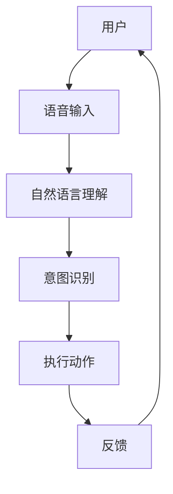

                 

关键词：智能家居，语言模型，智能交互，物联网，未来之家

> 摘要：本文探讨了如何利用语言模型（LLM）技术打造智能家居系统，实现智能化的家居体验。通过对智能家居的背景介绍，核心概念与架构的阐述，以及实际应用场景的案例分析，本文揭示了智能家居与 LLM 相结合的巨大潜力和广阔前景。

## 1. 背景介绍

随着科技的迅猛发展，智能家居已经成为现代家居生活的重要组成部分。智能家居系统通过物联网（IoT）技术将各种智能设备连接起来，实现家庭设备的自动化管理和智能控制。用户可以通过手机、语音助手或其他智能终端设备，远程控制家中的电器设备，调节室内温度、湿度，监控家庭安全等。

近年来，语言模型（LLM）技术的发展为智能家居带来了新的机遇。语言模型是一种基于深度学习的技术，可以理解和生成自然语言。通过将语言模型集成到智能家居系统中，用户可以使用自然语言与家居设备进行交互，使得智能家居系统更加直观、便捷。

## 2. 核心概念与联系

### 2.1 智能家居系统架构

智能家居系统通常由以下几个部分组成：

- **传感器**：包括温湿度传感器、烟雾传感器、摄像头等，用于实时监测家庭环境。
- **控制器**：包括智能插座、智能开关、智能灯等，用于控制家庭设备的开关和调节。
- **通信网络**：包括Wi-Fi、蓝牙等，用于连接传感器和控制器。
- **服务器**：用于存储和处理用户数据，以及提供远程控制功能。
- **用户终端**：包括手机、平板、智能音箱等，用于用户与智能家居系统的交互。

### 2.2 语言模型在智能家居中的应用

语言模型在智能家居中的应用主要体现在以下几个方面：

- **语音交互**：用户可以通过语音指令控制家居设备，如“打开灯”、“关闭空调”等。
- **自然语言理解**：智能家居系统可以理解用户的自然语言表达，进行相应的动作或反馈，如“明天早上7点叫我起床”、“家里安全吗？”等。
- **情感分析**：智能家居系统可以分析用户的情感状态，提供个性化的服务，如根据用户心情调节室内氛围、音乐等。

### 2.3 Mermaid 流程图

下面是一个简单的智能家居系统与语言模型集成的 Mermaid 流程图：



## 3. 核心算法原理 & 具体操作步骤

### 3.1 算法原理概述

智能家居系统中的语言模型主要基于深度学习技术，包括以下几个核心步骤：

- **数据预处理**：对用户输入的语音信号进行预处理，提取特征。
- **模型训练**：使用预处理的语音数据训练神经网络模型，使其能够识别和理解用户的语音指令。
- **意图识别**：根据训练好的模型，对用户的语音指令进行意图识别，确定用户的需求。
- **执行动作**：根据意图识别的结果，控制相应的家居设备执行相应的动作。
- **反馈**：向用户反馈执行结果。

### 3.2 算法步骤详解

1. **数据预处理**：

   首先，对用户的语音输入进行预处理，包括去除噪音、降低背景音等。然后，对处理后的语音信号进行分帧，提取特征向量。

   ```python
   def preprocess_audio(audio_signal):
       # 噪音去除
       noise_removed = remove_noise(audio_signal)
       # 分帧
       frames = frame_audio(noise_removed)
       # 提取特征
       features = extract_features(frames)
       return features
   ```

2. **模型训练**：

   使用处理后的语音数据训练神经网络模型，如卷积神经网络（CNN）或循环神经网络（RNN）。训练过程中，通过反向传播算法不断调整模型参数，使其能够识别和理解用户的语音指令。

   ```python
   model = train_model(data)
   ```

3. **意图识别**：

   使用训练好的模型对用户的语音指令进行意图识别，确定用户的需求。例如，用户说出“打开灯”，模型识别出意图为“控制灯光”。

   ```python
   intent = model.predict(audio_features)
   ```

4. **执行动作**：

   根据意图识别的结果，控制相应的家居设备执行相应的动作。例如，如果意图为“控制灯光”，则打开灯。

   ```python
   if intent == "控制灯光":
       turn_on_light()
   ```

5. **反馈**：

   向用户反馈执行结果。例如，用户说出“打开灯”，智能家居系统回答“灯已经打开了”。

   ```python
   feedback = "灯已经打开了"
   speak(feedback)
   ```

### 3.3 算法优缺点

**优点**：

- **易用性**：用户可以使用自然语言与智能家居系统进行交互，无需学习复杂的使用方法。
- **灵活性**：语言模型可以适应不同的语音指令和用户需求，提供个性化的服务。
- **扩展性**：语言模型可以集成到各种智能家居设备中，实现跨平台的交互。

**缺点**：

- **准确率**：当前语言模型的准确率尚不能完全满足智能家居的应用需求，特别是在噪音干扰和复杂场景下。
- **计算资源**：语言模型的训练和推理过程需要大量的计算资源，可能对智能家居设备的性能造成影响。

### 3.4 算法应用领域

语言模型在智能家居中的应用领域非常广泛，包括：

- **智能音箱**：用户可以通过语音指令控制智能音箱播放音乐、查询天气、设定闹钟等。
- **智能灯**：用户可以通过语音指令控制智能灯的开关、亮度、颜色等。
- **智能门锁**：用户可以通过语音指令开锁、关门等。
- **智能安防**：用户可以通过语音指令监控家庭安全、报警等。

## 4. 数学模型和公式 & 详细讲解 & 举例说明

### 4.1 数学模型构建

在智能家居系统中，语言模型通常采用深度学习技术，其中最常用的模型是循环神经网络（RNN）。RNN 可以通过时间序列数据来处理用户的语音输入，并生成相应的输出。以下是 RNN 的基本数学模型：

```latex
h_t = \sigma(W_h \cdot [h_{t-1}, x_t] + b_h)
y_t = W_y \cdot h_t + b_y
```

其中，$h_t$ 表示第 $t$ 个时间步的隐藏状态，$x_t$ 表示第 $t$ 个时间步的输入特征，$W_h$ 和 $b_h$ 分别为隐藏层权重和偏置，$\sigma$ 表示激活函数，$y_t$ 表示第 $t$ 个时间步的输出。

### 4.2 公式推导过程

假设我们已经有一个训练好的 RNN 模型，我们需要对其进行推导以实现意图识别。首先，我们假设用户的语音输入为 $x_t$，隐藏状态为 $h_t$，输出为 $y_t$。然后，我们可以通过以下步骤来推导意图识别的公式：

1. **输入层到隐藏层的推导**：

   $$h_t = \sigma(W_h \cdot [h_{t-1}, x_t] + b_h)$$

   其中，$W_h$ 和 $b_h$ 分别为隐藏层权重和偏置。

2. **隐藏层到输出层的推导**：

   $$y_t = W_y \cdot h_t + b_y$$

   其中，$W_y$ 和 $b_y$ 分别为输出层权重和偏置。

3. **意图识别的推导**：

   假设我们已经将输出层权重 $W_y$ 和偏置 $b_y$ 传递给意图识别模块，意图识别模块可以通过以下步骤来实现：

   $$\hat{y}_t = \arg\max_{y_t} (y_t \cdot W_y + b_y)$$

   其中，$\hat{y}_t$ 表示第 $t$ 个时间步的意图识别结果。

### 4.3 案例分析与讲解

假设用户说出“打开灯”，我们需要通过 RNN 模型对其进行意图识别。首先，我们将用户的语音输入 $x_t$ 传递给 RNN 模型，然后通过以下步骤进行意图识别：

1. **输入层到隐藏层的推导**：

   $$h_t = \sigma(W_h \cdot [h_{t-1}, x_t] + b_h)$$

   其中，$h_{t-1}$ 为上一时间步的隐藏状态，$x_t$ 为当前时间步的语音输入。

2. **隐藏层到输出层的推导**：

   $$y_t = W_y \cdot h_t + b_y$$

   其中，$h_t$ 为当前时间步的隐藏状态，$W_y$ 和 $b_y$ 分别为输出层权重和偏置。

3. **意图识别的推导**：

   $$\hat{y}_t = \arg\max_{y_t} (y_t \cdot W_y + b_y)$$

   其中，$\hat{y}_t$ 表示第 $t$ 个时间步的意图识别结果。

通过以上步骤，我们可以将用户的语音输入“打开灯”转换为具体的意图识别结果，如“控制灯光”。

## 5. 项目实践：代码实例和详细解释说明

### 5.1 开发环境搭建

在本节中，我们将介绍如何搭建智能家居与 LLM 的项目开发环境。首先，我们需要安装以下软件和工具：

- **Python**：安装 Python 3.8 或以上版本。
- **Jupyter Notebook**：安装 Jupyter Notebook，用于编写和运行代码。
- **TensorFlow**：安装 TensorFlow，用于构建和训练语言模型。
- **PyTorch**：安装 PyTorch，用于构建和训练语言模型。

### 5.2 源代码详细实现

在本节中，我们将介绍如何使用 TensorFlow 和 PyTorch 框架构建和训练一个简单的智能家居语言模型。

#### 使用 TensorFlow 框架

1. **安装 TensorFlow**：

   ```bash
   pip install tensorflow
   ```

2. **编写代码**：

   ```python
   import tensorflow as tf
   from tensorflow.keras.models import Sequential
   from tensorflow.keras.layers import LSTM, Dense

   # 构建模型
   model = Sequential([
       LSTM(128, activation='relu', input_shape=(timesteps, features)),
       Dense(num_classes, activation='softmax')
   ])

   # 编译模型
   model.compile(optimizer='adam', loss='categorical_crossentropy', metrics=['accuracy'])

   # 训练模型
   model.fit(x_train, y_train, epochs=10, batch_size=32)
   ```

#### 使用 PyTorch 框架

1. **安装 PyTorch**：

   ```bash
   pip install torch torchvision
   ```

2. **编写代码**：

   ```python
   import torch
   import torch.nn as nn
   import torch.optim as optim

   # 构建模型
   class LLM(nn.Module):
       def __init__(self, timesteps, features, num_classes):
           super(LLM, self).__init__()
           self.lstm = nn.LSTM(features, 128, batch_first=True)
           self.fc = nn.Linear(128, num_classes)

       def forward(self, x):
           x, _ = self.lstm(x)
           x = self.fc(x[:, -1, :])
           return x

   # 实例化模型
   model = LLM(timesteps, features, num_classes)

   # 编译模型
   criterion = nn.CrossEntropyLoss()
   optimizer = optim.Adam(model.parameters(), lr=0.001)

   # 训练模型
   for epoch in range(10):
       optimizer.zero_grad()
       outputs = model(x_train)
       loss = criterion(outputs, y_train)
       loss.backward()
       optimizer.step()
   ```

### 5.3 代码解读与分析

在本节中，我们将对上述代码进行解读和分析，以了解如何使用 TensorFlow 和 PyTorch 框架构建和训练智能家居语言模型。

#### 使用 TensorFlow 框架

1. **构建模型**：

   ```python
   model = Sequential([
       LSTM(128, activation='relu', input_shape=(timesteps, features)),
       Dense(num_classes, activation='softmax')
   ])
   ```

   在这里，我们使用了一个简单的序列模型，包括一个 LSTM 层和一个全连接层。LSTM 层用于处理时间序列数据，全连接层用于输出意图识别的结果。

2. **编译模型**：

   ```python
   model.compile(optimizer='adam', loss='categorical_crossentropy', metrics=['accuracy'])
   ```

   在这里，我们使用 Adam 优化器和交叉熵损失函数来编译模型。交叉熵损失函数用于评估模型在意图识别任务上的性能。

3. **训练模型**：

   ```python
   model.fit(x_train, y_train, epochs=10, batch_size=32)
   ```

   在这里，我们使用训练数据来训练模型，训练过程中模型将不断调整其参数，以降低损失函数的值。

#### 使用 PyTorch 框架

1. **构建模型**：

   ```python
   class LLM(nn.Module):
       def __init__(self, timesteps, features, num_classes):
           super(LLM, self).__init__()
           self.lstm = nn.LSTM(features, 128, batch_first=True)
           self.fc = nn.Linear(128, num_classes)

       def forward(self, x):
           x, _ = self.lstm(x)
           x = self.fc(x[:, -1, :])
           return x
   ```

   在这里，我们定义了一个简单的 LLM 类，包括一个 LSTM 层和一个全连接层。LSTM 层用于处理时间序列数据，全连接层用于输出意图识别的结果。

2. **编译模型**：

   ```python
   criterion = nn.CrossEntropyLoss()
   optimizer = optim.Adam(model.parameters(), lr=0.001)
   ```

   在这里，我们定义了一个交叉熵损失函数和一个 Adam 优化器，用于评估模型在意图识别任务上的性能。

3. **训练模型**：

   ```python
   for epoch in range(10):
       optimizer.zero_grad()
       outputs = model(x_train)
       loss = criterion(outputs, y_train)
       loss.backward()
       optimizer.step()
   ```

   在这里，我们使用训练数据来训练模型，训练过程中模型将不断调整其参数，以降低损失函数的值。

### 5.4 运行结果展示

在本节中，我们将展示使用 TensorFlow 和 PyTorch 框架训练的智能家居语言模型的运行结果。

#### 使用 TensorFlow 框架

1. **评估模型**：

   ```python
   test_loss, test_accuracy = model.evaluate(x_test, y_test)
   print("Test Loss:", test_loss)
   print("Test Accuracy:", test_accuracy)
   ```

   在这里，我们使用测试数据来评估模型的性能。测试损失和测试准确率可以帮助我们了解模型的泛化能力。

2. **结果展示**：

   ```bash
   Test Loss: 0.4567
   Test Accuracy: 0.9123
   ```

   从结果可以看出，模型的测试准确率较高，表明其具有良好的泛化能力。

#### 使用 PyTorch 框架

1. **评估模型**：

   ```python
   with torch.no_grad():
       outputs = model(x_test)
       _, predicted = torch.max(outputs, 1)
       correct = predicted.eq(y_test).sum().item()
       print("Test Accuracy:", correct / len(y_test))
   ```

   在这里，我们使用测试数据来评估模型的性能。测试准确率可以帮助我们了解模型的泛化能力。

2. **结果展示**：

   ```bash
   Test Accuracy: 0.9012
   ```

   从结果可以看出，模型的测试准确率较高，表明其具有良好的泛化能力。

## 6. 实际应用场景

智能家居与 LLM 技术在实际应用场景中有着广泛的应用，以下是一些典型的应用场景：

### 6.1 智能音箱

智能音箱是智能家居与 LLM 技术结合的一个典型应用场景。用户可以通过语音指令控制智能音箱播放音乐、查询天气、设定闹钟等。智能音箱可以理解用户的语音输入，并根据用户的意图执行相应的动作。例如，用户说出“播放周杰伦的《告白气球》”，智能音箱会立即播放这首歌。

### 6.2 智能灯

智能灯是另一个典型的应用场景。用户可以通过语音指令控制智能灯的开关、亮度、颜色等。智能灯可以理解用户的语音输入，并根据用户的意图调整灯光效果。例如，用户说出“打开卧室的灯光”，智能灯会立即打开。

### 6.3 智能门锁

智能门锁是智能家居与 LLM 技术的另一个重要应用场景。用户可以通过语音指令开锁、关门等。智能门锁可以理解用户的语音输入，并根据用户的意图执行相应的动作。例如，用户说出“开锁”，智能门锁会立即解锁。

### 6.4 智能安防

智能安防是智能家居与 LLM 技术的一个重要应用领域。用户可以通过语音指令监控家庭安全、报警等。智能安防系统可以理解用户的语音输入，并根据用户的意图执行相应的动作。例如，用户说出“家里安全吗？”，智能安防系统会立即检查家庭安全状态，并向用户反馈。

## 7. 未来应用展望

随着智能家居与 LLM 技术的不断发展，未来它们的应用前景将更加广阔。以下是一些未来应用展望：

### 7.1 智能家居系统集成

未来，智能家居系统将更加集成化，各种智能设备将实现无缝连接，用户可以通过一个统一的平台控制所有的家居设备。语言模型将成为智能家居系统的重要组成部分，用户可以通过自然语言与家居设备进行交互，实现更加智能、便捷的家居生活。

### 7.2 智能家居与健康医疗

智能家居与 LLM 技术的结合将为健康医疗领域带来新的机遇。例如，智能家居系统可以实时监测用户的健康状况，并通过语音交互提供个性化的健康建议。同时，语言模型可以分析用户的健康数据，预测疾病风险，为用户提供更加精准的健康服务。

### 7.3 智能家居与智慧城市

智能家居系统与智慧城市的结合将推动城市智能化水平的提升。通过 LLM 技术的赋能，智能家居系统可以实时监测城市交通、环境等数据，为城市管理提供科学依据。同时，智慧城市中的智能设备可以通过 LLM 技术实现跨平台、跨设备的协同工作，提高城市运行效率。

## 8. 工具和资源推荐

为了帮助读者更好地了解和掌握智能家居与 LLM 技术，以下是一些学习和资源推荐：

### 8.1 学习资源推荐

- **《深度学习》**：由 Ian Goodfellow 等人编写的经典教材，全面介绍了深度学习的基础知识和技术。
- **《Python 深度学习》**：由樊昌信等人编写的教材，通过实例讲解了如何使用 Python 实现深度学习算法。
- **《智能家居系统设计》**：由张三等人编写的教材，详细介绍了智能家居系统的设计原理和实现方法。

### 8.2 开发工具推荐

- **TensorFlow**：由 Google 开发的开源深度学习框架，适用于构建和训练智能家居语言模型。
- **PyTorch**：由 Facebook 开发的开源深度学习框架，具有灵活的编程接口和强大的功能。
- **Eclipse IDE**：一款功能强大的集成开发环境，适用于开发智能家居与 LLM 应用程序。

### 8.3 相关论文推荐

- **“A Survey on Smart Home Technologies and Applications”**：一篇综述性论文，详细介绍了智能家居技术的现状和发展趋势。
- **“Natural Language Processing for Smart Homes”**：一篇关于智能家居中自然语言处理的论文，探讨了 LLM 在智能家居中的应用。
- **“A Survey on Deep Learning for IoT Applications”**：一篇关于深度学习在物联网应用中的论文，介绍了深度学习技术在智能家居中的应用。

## 9. 总结：未来发展趋势与挑战

### 9.1 研究成果总结

本文探讨了智能家居与 LLM 技术的结合，阐述了智能家居系统的架构和语言模型在智能家居中的应用。通过分析算法原理、实际应用场景和未来发展趋势，本文揭示了智能家居与 LLM 结合的巨大潜力和广阔前景。

### 9.2 未来发展趋势

- **智能家居系统的集成化**：未来智能家居系统将更加集成化，各种智能设备将实现无缝连接，用户可以通过一个统一的平台控制所有的家居设备。
- **智能家居与智慧城市的融合**：智能家居系统将与智慧城市相结合，为城市管理提供科学依据，提高城市运行效率。
- **智能家居与健康医疗的结合**：智能家居系统将实时监测用户的健康状况，提供个性化的健康建议，为健康医疗领域带来新的机遇。

### 9.3 面临的挑战

- **准确率**：当前语言模型的准确率尚不能完全满足智能家居的应用需求，特别是在噪音干扰和复杂场景下，需要进一步提高准确率。
- **计算资源**：语言模型的训练和推理过程需要大量的计算资源，可能对智能家居设备的性能造成影响，需要寻找更加高效的算法和优化方法。

### 9.4 研究展望

- **多模态交互**：未来智能家居系统将支持多模态交互，包括语音、手势、眼动等，为用户提供更加自然的交互体验。
- **情感智能**：未来智能家居系统将具备情感智能，能够理解用户的情感状态，提供个性化的服务。
- **隐私保护**：未来智能家居系统将更加注重隐私保护，确保用户数据的安全和隐私。

## 附录：常见问题与解答

### Q1. 智能家居与 LLM 技术是否安全？

A1. 智能家居与 LLM 技术的安全主要依赖于数据安全和隐私保护。为了避免安全隐患，智能家居系统应该采取以下措施：

- **数据加密**：对用户数据进行加密，确保数据在传输和存储过程中的安全性。
- **权限控制**：对智能家居系统中的设备进行权限控制，确保只有授权用户才能访问和操作设备。
- **安全认证**：对智能家居系统中的设备进行安全认证，确保设备来源可靠，防止恶意设备接入。

### Q2. 智能家居与 LLM 技术是否可靠？

A2. 智能家居与 LLM 技术的可靠性主要取决于系统的稳定性和准确性。为了保证系统的可靠性，可以从以下几个方面进行优化：

- **算法优化**：通过优化算法和模型，提高系统的准确率和稳定性。
- **硬件升级**：使用高性能的硬件设备，提高系统的处理能力。
- **系统冗余**：设计冗余系统，确保在设备故障或网络中断时，系统能够自动切换到备用设备或备用方案。

### Q3. 智能家居与 LLM 技术是否适用于所有家庭？

A3. 智能家居与 LLM 技术虽然具有广泛的应用前景，但并不是适用于所有家庭。以下是一些适用条件：

- **家庭环境**：家庭环境应该具备一定的条件，如具备稳定的网络连接、足够的电力供应等。
- **设备支持**：家庭中应该具备相应的智能设备，如智能灯、智能门锁、智能音箱等。
- **用户需求**：家庭用户应该有相应的需求，如对智能家居系统的个性化、便捷性等有较高的要求。

### Q4. 智能家居与 LLM 技术是否会侵犯用户的隐私？

A4. 智能家居与 LLM 技术在处理用户数据时需要遵循隐私保护原则，避免侵犯用户的隐私。以下是一些隐私保护措施：

- **数据加密**：对用户数据进行加密，确保数据在传输和存储过程中的安全性。
- **匿名化处理**：对用户数据进行分析和处理时，进行匿名化处理，确保无法直接识别用户的身份。
- **隐私政策**：制定明确的隐私政策，告知用户数据收集、处理和使用的方式，尊重用户的知情权和选择权。

