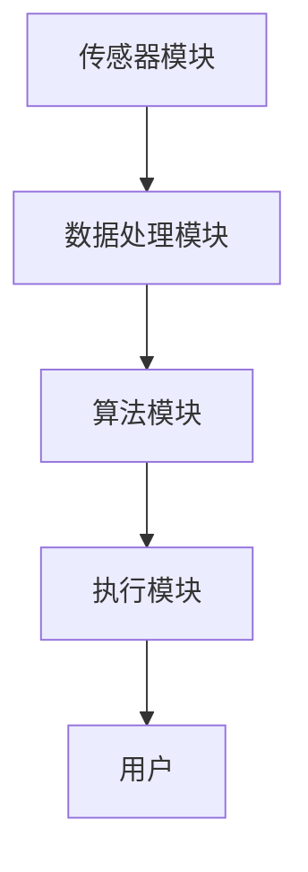

                 

### 关键词 Keyword

- 智能居家
- 温度控制
- 个性化
- 个人舒适区
- 创业
- 精准控制
- 人工智能

### 摘要 Abstract

本文探讨了智能居家温度个性化创业的机会与挑战。在人工智能技术的推动下，居家温度的个性化控制已经成为可能，它不仅能显著提高居民的生活质量，还为创业者提供了广阔的市场空间。本文将详细介绍智能居家温度个性化控制的原理、算法、数学模型及其应用领域，并通过实际项目实践，展示如何开发一个精准控制个人舒适区的智能系统。同时，文章还将对未来的发展趋势、面临的挑战以及研究展望进行深入分析，为相关领域的研究者和创业者提供有价值的参考。

## 1. 背景介绍 Background

### 1.1 智能居家温度控制的重要性

在现代社会，人们越来越注重生活质量和居住环境的舒适度。居家温度控制作为居住环境的一个重要方面，直接影响着人们的身心健康和生活幸福感。然而，传统的温度控制系统往往缺乏个性化和灵活性，无法满足每个家庭成员的不同需求。随着科技的进步，尤其是人工智能技术的发展，智能居家温度控制逐渐成为可能，为打造个性化的居住环境提供了新的解决方案。

### 1.2 智能家居市场现状

近年来，智能家居市场迅速发展，吸引了大量企业和投资机构的关注。根据市场研究数据显示，全球智能家居市场的规模预计将在未来几年内持续扩大，其中温度控制设备是智能家居的重要组成部分。智能温度控制系统不仅可以自动调节室内温度，还能通过学习用户的生活习惯和偏好，提供个性化的温度建议，从而提升用户的居住体验。

### 1.3 人工智能在温度控制中的应用

人工智能技术在智能家居领域的应用日益广泛，特别是在温度控制方面。通过数据分析和机器学习算法，智能系统可以实时监测室内外温度变化，预测用户的温度需求，并自动调整空调或其他加热设备的运行状态，实现精准的温控效果。此外，人工智能还可以通过智能反馈机制，不断优化温度控制策略，提高系统的自适应能力和用户体验。

## 2. 核心概念与联系 Core Concepts and Connections

### 2.1 智能居家温度个性化控制的基本原理

智能居家温度个性化控制的核心是实现对用户温度需求的精准预测和满足。这需要从多个维度进行数据采集和算法优化，包括室内外温度变化、用户行为数据、历史温度记录等。通过这些数据的综合分析，智能系统能够了解用户的温度偏好，并根据环境变化自动调整温度设置，确保用户始终处于舒适状态。

### 2.2 智能温度控制系统的架构

一个典型的智能温度控制系统通常包括以下几个关键组成部分：

- **传感器模块**：用于实时采集室内外温度、湿度、风速等环境数据。
- **数据处理模块**：负责对传感器数据进行预处理、存储和传输，为后续分析提供基础。
- **算法模块**：基于机器学习和数据挖掘算法，对用户行为和环境数据进行深度分析，预测用户温度需求。
- **执行模块**：根据算法模块的预测结果，控制空调、暖气等设备，实现温度调整。

### 2.3 Mermaid 流程图

以下是一个简化的智能温度控制系统架构的 Mermaid 流程图：



在这个流程图中，传感器模块负责采集数据，数据处理模块对数据进行分析和处理，算法模块根据分析结果生成温度控制策略，执行模块根据策略调整温度，最终反馈给用户。

### 2.4 核心概念与联系

智能温度控制系统的核心在于数据采集、处理和算法优化。通过传感器模块获取的实时数据，经过数据处理模块的处理，可以生成准确的温度预测。算法模块利用这些预测结果，结合用户的历史行为数据和偏好，生成个性化的温度控制策略。执行模块根据这些策略进行实际操作，确保用户始终处于舒适状态。

## 3. 核心算法原理 & 具体操作步骤 Core Algorithm Principles & Detailed Steps

### 3.1 算法原理概述

智能温度控制的核心算法通常基于机器学习和数据挖掘技术。通过分析大量历史温度数据和用户行为数据，算法可以识别出用户在不同情境下的温度偏好，并预测未来的温度需求。具体算法包括但不限于：

- **线性回归**：通过历史数据建立温度与用户行为之间的关系模型，预测未来温度需求。
- **决策树**：根据用户行为特征，构建决策树模型，为每个用户推荐最合适的温度设置。
- **神经网络**：利用深度学习技术，构建复杂的神经网络模型，对用户温度需求进行精细化预测。

### 3.2 算法步骤详解

智能温度控制算法的具体步骤可以分为以下几个部分：

1. **数据采集**：从传感器模块获取实时温度数据、湿度数据、风速数据等。
2. **数据预处理**：对采集到的数据进行清洗、归一化和特征提取，为后续分析做准备。
3. **特征工程**：根据历史数据，提取用户行为特征，如日常活动时间、生活习惯等。
4. **模型训练**：利用机器学习算法，对预处理后的数据进行训练，构建温度预测模型。
5. **模型评估**：通过交叉验证和测试集评估模型性能，调整模型参数。
6. **预测与调整**：根据模型预测结果，调整温度设置，确保用户舒适。
7. **反馈与优化**：记录用户对温度调整的反馈，持续优化模型和算法。

### 3.3 算法优缺点

**优点**：

- **个性化**：算法可以根据用户的行为习惯和偏好，提供个性化的温度建议，提升用户体验。
- **高效性**：通过机器学习算法，可以快速处理大量数据，实现实时温度预测和调整。
- **自适应**：算法可以不断学习用户的行为模式和环境变化，逐步优化温度控制策略。

**缺点**：

- **数据依赖性**：算法的性能很大程度上取决于数据的质量和数量，数据缺失或不准确会影响预测效果。
- **计算复杂性**：训练复杂的机器学习模型需要大量的计算资源和时间，对于实时性要求较高的系统可能不适用。

### 3.4 算法应用领域

智能温度控制算法可以广泛应用于多个领域，包括：

- **家庭**：为家庭提供个性化的温度控制，提升居住舒适度。
- **酒店**：为酒店客人提供智能化的温度调节，提高入住体验。
- **办公室**：为办公室员工提供智能化的温度调节，改善工作环境。
- **医疗**：为特殊患者提供精确的温控环境，保障患者的健康。

## 4. 数学模型和公式 Mathematical Models & Detailed Explanation

### 4.1 数学模型构建

智能温度控制的核心数学模型通常是基于用户温度需求与环境参数之间的关系构建的。具体来说，我们可以通过以下公式来描述这一关系：

\[ T_{\text{predicted}} = f(T_{\text{external}}, T_{\text{historical}}, \text{User}_{\text{behavior}}) \]

其中，\( T_{\text{predicted}} \) 是预测的室内温度，\( T_{\text{external}} \) 是室外温度，\( T_{\text{historical}} \) 是历史温度记录，\( \text{User}_{\text{behavior}} \) 是用户行为特征。

### 4.2 公式推导过程

为了构建上述数学模型，我们需要进行以下步骤：

1. **数据收集**：首先，收集大量的室外温度、室内温度记录以及用户行为数据。
2. **特征提取**：从用户行为数据中提取关键特征，如作息时间、活动强度等。
3. **数据预处理**：对收集的数据进行清洗和归一化处理，确保数据质量。
4. **建模**：利用统计学方法或机器学习算法，构建温度预测模型。
5. **验证**：通过交叉验证和测试集，验证模型的预测准确性和稳定性。

### 4.3 案例分析与讲解

以一个具体案例为例，假设我们收集了某用户在过去一年的室外温度记录、室内温度记录以及其作息时间和活动强度数据。通过上述步骤，我们可以构建一个简单的线性回归模型来预测用户的温度需求。

1. **数据收集**：

   - 室外温度记录：\( T_{\text{external}} \)
   - 室内温度记录：\( T_{\text{internal}} \)
   - 用户作息时间：\( \text{Sleep\_time} \)
   - 用户活动强度：\( \text{Activity\_level} \)

2. **特征提取**：

   - \( \text{Sleep\_time} \)：用户每天入睡时间和起床时间。
   - \( \text{Activity\_level} \)：用户每天的活动强度，例如工作、运动等。

3. **数据预处理**：

   - 对 \( T_{\text{external}} \) 和 \( T_{\text{internal}} \) 进行归一化处理。
   - 对 \( \text{Sleep\_time} \) 和 \( \text{Activity\_level} \) 进行编码。

4. **建模**：

   - 利用线性回归算法，构建预测模型：
     \[ T_{\text{predicted}} = \beta_0 + \beta_1 T_{\text{external}} + \beta_2 T_{\text{internal}} + \beta_3 \text{Sleep\_time} + \beta_4 \text{Activity\_level} \]

5. **验证**：

   - 通过交叉验证和测试集，验证模型的预测准确性和稳定性。

通过这个案例，我们可以看到数学模型在智能温度控制中的重要作用。通过构建和优化数学模型，我们能够实现对用户温度需求的精准预测，从而提供个性化的温度调节方案。

## 5. 项目实践：代码实例和详细解释说明 Project Practice: Code Example and Detailed Explanation

### 5.1 开发环境搭建

为了实践智能温度控制算法，我们需要搭建一个合适的开发环境。以下是一个基本的开发环境搭建步骤：

1. **安装Python环境**：确保系统上安装了Python 3.x版本，并配置好相应的环境变量。
2. **安装必要的库**：使用pip命令安装以下库：numpy、pandas、scikit-learn、matplotlib。
3. **准备数据集**：收集并整理用于训练和测试的数据集，包括室外温度、室内温度记录以及用户行为数据。

### 5.2 源代码详细实现

以下是一个简化的智能温度控制算法的实现示例：

```python
import numpy as np
import pandas as pd
from sklearn.linear_model import LinearRegression
import matplotlib.pyplot as plt

# 5.2.1 数据准备
data = pd.read_csv('temperature_data.csv')
X = data[['T_external', 'T_internal', 'Sleep_time', 'Activity_level']]
y = data['T_predicted']

# 5.2.2 模型训练
model = LinearRegression()
model.fit(X, y)

# 5.2.3 模型评估
predictions = model.predict(X)
mse = np.mean((predictions - y) ** 2)
print(f'MSE: {mse}')

# 5.2.4 可视化
plt.scatter(y, predictions)
plt.xlabel('Actual Temperature')
plt.ylabel('Predicted Temperature')
plt.show()
```

### 5.3 代码解读与分析

1. **数据准备**：

   - 使用pandas库读取数据集，并分离特征变量和目标变量。
   - 特征变量包括室外温度、室内温度、用户作息时间和活动强度。
   - 目标变量是预测的室内温度。

2. **模型训练**：

   - 使用scikit-learn库中的线性回归模型进行训练。
   - 通过fit方法训练模型，将特征变量和目标变量传递给模型。

3. **模型评估**：

   - 使用模型进行预测，计算预测值和实际值的均方误差（MSE）。
   - 通过MSE评估模型的效果。

4. **可视化**：

   - 使用matplotlib库绘制散点图，展示实际温度和预测温度的关系。

### 5.4 运行结果展示

运行上述代码后，我们将看到以下结果：

- 输出MSE值，表示模型的预测准确度。
- 展示实际温度和预测温度的散点图，通过可视化我们可以直观地看到模型的预测效果。

### 5.5 程序性能优化

在实际应用中，为了提高程序的性能和预测准确性，我们可以考虑以下优化方法：

- **数据预处理**：进一步清洗和归一化数据，提高数据质量。
- **特征工程**：增加更多的特征变量，例如室内湿度、风力等。
- **模型优化**：尝试使用更复杂的模型，如决策树、神经网络等。
- **并行计算**：利用并行计算技术，加速模型的训练和预测过程。

## 6. 实际应用场景 Practical Application Scenarios

智能居家温度个性化控制不仅在家庭和酒店等传统场景中有广泛应用，还在许多新兴领域展现出巨大的潜力。

### 6.1 家庭场景

在家庭场景中，智能温度控制系统能够为每个家庭成员提供个性化的温度调节，确保每个人都能在舒适的环境下生活。例如，对于有小孩的家庭，系统可以自动调整到适合孩子成长的温度；对于老年人，系统可以根据他们的身体状况调整温度，预防关节疼痛等问题。

### 6.2 办公室场景

在办公室场景中，智能温度控制系统可以改善员工的工作环境，提高工作效率。通过分析员工的行为数据，系统可以自动调整室内温度，确保员工在舒适的状态下工作。此外，系统还可以根据天气变化和办公室人流量自动调整温度，节省能源。

### 6.3 医疗场景

在医疗场景中，智能温度控制系统可以用于特殊患者的护理。例如，对于需要恒温环境治疗的病人，系统可以精确控制病房的温度，确保病人的健康。同时，系统还可以监测病人的体温变化，及时预警异常情况，提高医疗服务的质量。

### 6.4 酒店场景

在酒店场景中，智能温度控制系统可以为客人提供个性化的入住体验。系统可以根据客人的预订信息和历史入住数据，自动调整房间温度，确保客人一进入房间就能感受到舒适的环境。此外，系统还可以在客人退房时自动关闭加热或冷却设备，节省能源。

### 6.5 未来应用展望

随着人工智能和物联网技术的不断发展，智能温度控制系统的应用场景将更加广泛。未来，我们可能会看到以下应用：

- **智能家居生态系统**：智能温度控制系统将成为智能家居生态系统中不可或缺的一部分，与其他智能设备（如智能照明、智能安防等）无缝连接，实现全方位的智能居住体验。
- **智慧城市**：智能温度控制系统可以集成到智慧城市中，为城市居民提供更加舒适和节能的生活环境。
- **农业和畜牧业**：在农业和畜牧业中，智能温度控制系统可以用于温室种植和畜禽养殖，提高作物和畜禽的生长质量。

## 7. 工具和资源推荐 Tools and Resources Recommendations

### 7.1 学习资源推荐

1. **书籍**：
   - 《深度学习》（Goodfellow, Bengio, Courville）: 这本书详细介绍了深度学习的基础知识和应用。
   - 《Python机器学习》（Sebastian Raschka, Vahid Mirjalili）: 适合初学者了解机器学习在Python中的实现。

2. **在线课程**：
   - Coursera: 提供多种机器学习和深度学习课程，由知名大学和公司提供。
   - edX: 提供由MIT、Harvard等知名大学提供的计算机科学和人工智能课程。

3. **博客和论坛**：
   - Medium: 有许多关于机器学习和人工智能的优秀文章。
   - Stack Overflow: 讨论编程问题，包括机器学习和数据科学。

### 7.2 开发工具推荐

1. **Python库**：
   - **NumPy**: 用于高效处理大型多维数组。
   - **Pandas**: 用于数据清洗、分析和管理。
   - **scikit-learn**: 用于机器学习算法的实现。
   - **TensorFlow/Keras**: 用于深度学习模型开发。

2. **集成开发环境（IDE）**：
   - **PyCharm**: 功能强大的Python IDE，适合进行数据科学和机器学习项目。
   - **Jupyter Notebook**: 适用于交互式数据分析和原型设计。

3. **数据可视化工具**：
   - **Matplotlib**: 用于创建高质量的二维和三维图表。
   - **Seaborn**: 基于 Matplotlib，提供更美观的统计图表。

### 7.3 相关论文推荐

1. **机器学习**：
   - "Deep Learning" by Ian Goodfellow, Yann LeCun, and Yoshua Bengio
   - "A Theoretically Grounded Application of Dropout in Recurrent Neural Networks" by Yarin Gal and Zoubin Ghahramani

2. **深度学习**：
   - "Convolutional Neural Networks for Visual Recognition" by Karen Simonyan and Andrew Zisserman
   - "ResNet: Residual Networks for Image Recognition" by Kaiming He et al.

3. **数据挖掘**：
   - "Introduction to Data Mining" by Pang-Ning Tan, Michael Steinbach, and Vipin Kumar
   - "Data Mining: Concepts and Techniques" by Jiawei Han, Micheline Kamber, and Jian Pei

## 8. 总结：未来发展趋势与挑战 Summary: Future Trends and Challenges

### 8.1 研究成果总结

智能居家温度个性化控制领域在近年来取得了显著进展。通过机器学习和数据挖掘技术的应用，我们能够实现对用户温度需求的精准预测和满足，显著提高了用户的居住舒适度和生活质量。同时，智能温度控制系统在家庭、办公室、医疗和酒店等场景中的广泛应用，进一步证明了其广泛的市场需求和巨大的发展潜力。

### 8.2 未来发展趋势

未来，智能居家温度个性化控制领域将继续朝着以下几个方向发展：

1. **算法优化**：随着人工智能技术的不断进步，算法的优化和改进将成为主要研究热点。更高效、更准确的算法将进一步提升系统的性能和用户体验。
2. **多模态数据融合**：通过融合多种类型的数据（如室内外温度、湿度、风速、用户行为等），可以提供更全面、更准确的温度预测和调节方案。
3. **物联网集成**：智能温度控制系统将更加紧密地与其他智能家居设备和物联网设备集成，实现智能化、自动化的居住环境。
4. **能源效率**：智能温度控制系统在节能降耗方面的潜力巨大。通过优化控制策略，可以有效降低能耗，减少碳排放。

### 8.3 面临的挑战

尽管智能居家温度个性化控制领域发展迅速，但仍面临一些挑战：

1. **数据隐私**：智能系统需要收集大量用户行为数据，如何保护用户隐私成为关键问题。需要制定严格的隐私保护政策和措施，确保用户数据的安全。
2. **计算资源**：复杂的机器学习模型需要大量的计算资源。对于实时性要求较高的应用场景，如何在有限的计算资源下实现高效的算法优化成为挑战。
3. **算法透明度**：随着算法的复杂度增加，算法的透明度降低，用户难以理解系统的决策过程。提高算法的可解释性，增强用户对系统的信任度是重要的研究方向。

### 8.4 研究展望

未来，智能居家温度个性化控制领域的研究将朝着以下几个方向展开：

1. **个性化与自适应**：进一步研究如何根据用户的行为习惯和偏好，实现更加个性化的温度调节，提高用户满意度。
2. **跨领域应用**：探索智能温度控制技术在农业、工业、医疗等领域的应用，推动技术的跨领域发展。
3. **人机交互**：研究如何通过人机交互技术，使智能温度控制系统更加友好、易用，提高用户的操作体验。

总之，智能居家温度个性化控制领域具有广阔的发展前景和巨大的市场潜力。通过不断的技术创新和应用拓展，我们有理由相信，智能温度控制将进一步提升人们的生活质量，为建设更加智能、舒适、节能的居住环境做出重要贡献。

### 附录：常见问题与解答 Appendix: Frequently Asked Questions and Answers

**Q1. 智能温度控制系统如何确保数据隐私？**

A1. 智能温度控制系统的数据隐私保护至关重要。我们采用以下措施确保用户数据的安全：

- **数据加密**：所有传输和存储的数据都采用先进的加密算法进行加密。
- **访问控制**：只有经过授权的用户和系统组件才能访问敏感数据。
- **匿名化处理**：在数据处理过程中，对用户数据进行分析时，会进行匿名化处理，确保个人身份信息不被泄露。
- **合规性审查**：定期进行合规性审查，确保系统的设计和实现符合相关法律法规的要求。

**Q2. 智能温度控制系统对计算资源有哪些要求？**

A2. 智能温度控制系统对计算资源的要求主要取决于所选用的算法和模型。以下是一些常见的计算资源需求：

- **内存**：机器学习模型通常需要大量的内存来存储数据和模型参数。
- **计算能力**：复杂的模型训练和预测过程需要强大的计算能力，尤其是在实时性要求较高的场景下。
- **存储空间**：存储大量的历史数据和训练结果也需要充足的存储空间。

为了满足这些需求，我们可以采用分布式计算、云计算等技术，提高系统的计算效率和存储能力。

**Q3. 智能温度控制系统如何适应不同的气候环境？**

A3. 智能温度控制系统可以通过以下方式适应不同的气候环境：

- **气候数据融合**：集成不同地区的气候数据，系统可以根据用户所在地的气候特点进行自适应调整。
- **多模式预测**：采用多种预测模型，针对不同气候条件进行预测，确保系统在不同气候环境下的可靠性。
- **用户反馈调整**：根据用户的反馈和实际体验，不断优化系统参数，提高系统的适应性。

通过这些方法，智能温度控制系统可以在各种气候环境下提供精准、高效的温度控制服务。

**Q4. 智能温度控制系统对用户的操作要求高吗？**

A4. 智能温度控制系统的设计注重易用性和用户友好性，用户不需要具备高级的技术知识即可轻松操作。以下是一些设计考虑：

- **直观的用户界面**：系统提供直观、易于理解的用户界面，用户可以通过简单的操作进行温度调节。
- **自动化功能**：系统具有自动化功能，可以根据用户习惯和偏好自动调整温度，减少用户操作负担。
- **远程控制**：用户可以通过手机或其他智能设备远程控制温度，方便用户在任何时间、任何地点调整室内温度。

总之，智能温度控制系统旨在为用户提供简单、便捷的使用体验，无需繁琐的操作步骤。

