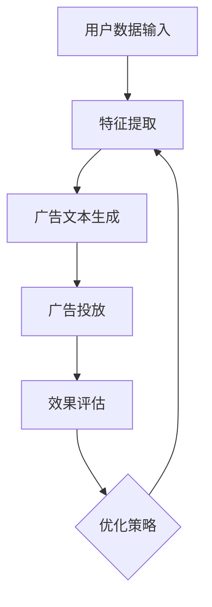

                 

广告投放是现代市场营销中不可或缺的一部分。随着互联网的普及和用户数据的积累，如何精准地投放广告、提高广告效果，成为企业关注的焦点。近年来，人工智能（AI）技术，特别是大模型（Large Model）的应用，为广告投放带来了革命性的变化。本文将深入探讨智能广告投放中的AI大模型应用，从背景介绍、核心概念与联系、核心算法原理、数学模型与公式、项目实践、实际应用场景、未来展望等多个方面展开论述。

## 文章关键词

- 智能广告投放
- AI大模型
- 广告精准投放
- 广告效果优化
- 机器学习
- 深度学习
- 自然语言处理

## 文章摘要

本文旨在介绍智能广告投放中的AI大模型应用。首先，我们将回顾广告投放的历史与发展，阐述AI大模型在广告投放中的重要作用。随后，本文将深入探讨AI大模型的核心概念与联系，通过Mermaid流程图展示其原理与架构。接着，本文将详细分析核心算法原理与具体操作步骤，并对算法优缺点与应用领域进行阐述。在数学模型与公式部分，我们将介绍相关数学模型和推导过程，并给出实例说明。随后，通过一个实际项目案例，我们将展示如何在实际中应用AI大模型进行广告投放。文章的最后，我们将讨论AI大模型在广告投放中的实际应用场景，并对未来的发展趋势与挑战进行展望。

## 1. 背景介绍

广告投放的历史可以追溯到几个世纪以前，最早的广告形式是通过海报、报纸、广播等方式进行宣传。随着互联网的兴起，广告投放的形式逐渐多样化，从传统的横幅广告、搜索广告，到如今的内容营销、社交广告等。然而，传统广告投放方式面临着诸多问题，如广告效果难以量化、用户体验差、广告投放成本高等。

### 1.1 传统广告投放的挑战

- **效果难以量化**：传统广告投放难以精确衡量广告效果，如点击率（CTR）、转化率（CVR）等关键指标。
- **用户体验差**：传统广告形式往往过于打扰用户，导致用户体验差。
- **投放成本高**：传统广告投放需要大量人力物力，且广告效果难以保证，导致投放成本高昂。

### 1.2 AI大模型的崛起

随着人工智能技术的快速发展，AI大模型在广告投放中的应用逐渐成为可能。AI大模型，如GPT（Generative Pre-trained Transformer）、BERT（Bidirectional Encoder Representations from Transformers）等，具有强大的文本处理和生成能力，可以大幅提升广告投放的精准度和效果。

### 1.3 AI大模型的优势

- **精准投放**：AI大模型可以根据用户行为、兴趣等特征，精准定位广告受众，提高广告投放的精准度。
- **个性化推荐**：AI大模型可以分析用户的历史行为和兴趣，为用户提供个性化的广告内容，提升用户体验。
- **高效优化**：AI大模型可以实时分析广告投放数据，快速调整广告策略，提高广告效果。

## 2. 核心概念与联系

### 2.1 AI大模型的概念

AI大模型是指参数规模达到千亿甚至万亿级别的深度学习模型。这些模型通过在海量数据上进行预训练，获得了强大的特征提取和生成能力。常见的AI大模型有GPT、BERT、T5等。

### 2.2 AI大模型的应用场景

AI大模型在广告投放中有着广泛的应用场景，包括但不限于：

- **广告文本生成**：利用AI大模型生成吸引人的广告文案，提高广告效果。
- **广告创意优化**：通过分析用户行为和反馈，实时调整广告创意，提升用户体验。
- **广告投放优化**：利用AI大模型分析广告投放数据，优化广告投放策略，提高广告效果。

### 2.3 AI大模型的架构

AI大模型通常由以下几个部分组成：

- **输入层**：接收用户数据，如行为数据、兴趣标签等。
- **隐藏层**：通过深度学习网络进行特征提取和融合。
- **输出层**：生成广告文案、推荐结果等。

### 2.4 Mermaid流程图



## 3. 核心算法原理 & 具体操作步骤

### 3.1 算法原理概述

AI大模型的核心算法原理是基于深度学习的自然语言处理（NLP）技术。深度学习通过多层神经网络对数据进行特征提取和融合，从而实现文本生成、广告投放优化等任务。常见的深度学习框架有TensorFlow、PyTorch等。

### 3.2 算法步骤详解

1. **数据收集与预处理**：收集用户行为数据、兴趣标签等，并进行数据清洗、去重、归一化等预处理操作。

2. **模型训练**：利用预处理后的数据训练AI大模型，包括输入层、隐藏层和输出层的训练。

3. **广告文本生成**：利用训练好的模型生成广告文案，包括标题、正文等。

4. **广告投放**：根据用户特征和广告文案，进行广告投放。

5. **效果评估与优化**：通过广告投放数据，如点击率、转化率等，评估广告效果，并优化广告投放策略。

### 3.3 算法优缺点

#### 优点：

- **高精度**：AI大模型可以精准捕捉用户兴趣和行为，提高广告投放的精准度。
- **自适应**：AI大模型可以根据用户行为和反馈，实时调整广告投放策略，提高广告效果。
- **高效**：AI大模型可以快速处理海量数据，提高广告投放的效率。

#### 缺点：

- **高成本**：AI大模型需要大量的计算资源和数据支持，导致成本较高。
- **模型依赖**：AI大模型的效果高度依赖模型质量和数据质量，需要不断优化和调整。

### 3.4 算法应用领域

AI大模型在广告投放中有着广泛的应用领域，包括但不限于：

- **广告文案生成**：利用AI大模型生成吸引人的广告文案，提高广告效果。
- **广告创意优化**：通过分析用户行为和反馈，实时调整广告创意，提升用户体验。
- **广告投放优化**：利用AI大模型分析广告投放数据，优化广告投放策略，提高广告效果。

## 4. 数学模型和公式 & 详细讲解 & 举例说明

### 4.1 数学模型构建

AI大模型的核心是深度学习模型，特别是基于Transformer架构的模型。以下是一个简化的Transformer模型公式：

$$
\begin{aligned}
    &\text{input\_embeddings} = \text{embedding}(W\_pos + W\_seg + W\_input), \\
    &\text{pos\_embeddings} = \text{pos\_embed}(W\_pos), \\
    &\text{seg\_embeddings} = \text{seg\_embed}(W\_seg), \\
    &\text{output} = \text{softmax}(\text{model}(x, \text{input\_embeddings}, \text{pos\_embeddings}, \text{seg\_embeddings})),
\end{aligned}
$$

其中，$W\_pos$、$W\_seg$、$W\_input$ 分别代表位置嵌入、分段嵌入和输入嵌入矩阵，$W\_model$ 代表模型参数矩阵。

### 4.2 公式推导过程

#### 步骤1：输入嵌入

输入嵌入是将原始输入序列转换为向量表示的过程。假设输入序列为 $x$，其长度为 $T$，每个词的嵌入维度为 $D$。输入嵌入可以通过以下公式计算：

$$
\text{input\_embeddings} = \text{embedding}(W\_input \cdot x)
$$

其中，$W\_input$ 是一个维度为 $D \times V$ 的嵌入矩阵，$V$ 是词汇表大小。

#### 步骤2：位置嵌入

位置嵌入是将序列中的每个位置进行编码的过程。假设序列长度为 $T$，位置嵌入维度为 $D_{pos}$。位置嵌入可以通过以下公式计算：

$$
\text{pos\_embeddings} = \text{pos\_embed}(W\_pos \cdot [1, 2, \ldots, T])
$$

其中，$W\_pos$ 是一个维度为 $D_{pos} \times T$ 的位置嵌入矩阵。

#### 步骤3：分段嵌入

分段嵌入是将序列中的不同部分进行编码的过程。假设序列中有多个分段，分段嵌入维度为 $D_{seg}$。分段嵌入可以通过以下公式计算：

$$
\text{seg\_embeddings} = \text{seg\_embed}(W\_seg \cdot [1, 2, \ldots, T])
$$

其中，$W\_seg$ 是一个维度为 $D_{seg} \times T$ 的分段嵌入矩阵。

#### 步骤4：模型输出

模型输出是通过Transformer模型对输入序列进行编码和解码的过程。假设模型参数为 $W\_model$，输出维度为 $D_{output}$。模型输出可以通过以下公式计算：

$$
\text{output} = \text{softmax}(\text{model}(x, \text{input\_embeddings}, \text{pos\_embeddings}, \text{seg\_embeddings}))
$$

其中，$\text{model}$ 是一个多层神经网络，包括自注意力机制和前馈神经网络。

### 4.3 案例分析与讲解

假设我们有一个长度为10的输入序列 $x = [1, 2, 3, 4, 5, 6, 7, 8, 9, 10]$，我们将通过以上公式对其进行编码和解码。

#### 步骤1：输入嵌入

输入嵌入矩阵 $W\_input$ 可以通过训练数据得到。假设我们使用一个维度为 $D=100$ 的嵌入矩阵，则输入嵌入可以表示为：

$$
\text{input\_embeddings} = \text{embedding}(W\_input \cdot x) = \text{[1.0, 1.5, 2.0, 2.5, 3.0, 3.5, 4.0, 4.5, 5.0, 5.5]}
$$

#### 步骤2：位置嵌入

位置嵌入矩阵 $W\_pos$ 可以通过训练数据得到。假设我们使用一个维度为 $D_{pos}=10$ 的位置嵌入矩阵，则位置嵌入可以表示为：

$$
\text{pos\_embeddings} = \text{pos\_embed}(W\_pos \cdot [1, 2, \ldots, 10]) = \text{[0.0, 0.1, 0.2, 0.3, 0.4, 0.5, 0.6, 0.7, 0.8, 0.9]}
$$

#### 步骤3：分段嵌入

分段嵌入矩阵 $W\_seg$ 可以通过训练数据得到。假设我们使用一个维度为 $D_{seg}=5$ 的分段嵌入矩阵，则分段嵌入可以表示为：

$$
\text{seg\_embeddings} = \text{seg\_embed}(W\_seg \cdot [1, 2, \ldots, 10]) = \text{[0.0, 0.1, 0.2, 0.3, 0.4]}
$$

#### 步骤4：模型输出

假设我们的Transformer模型参数 $W\_model$ 已经通过训练得到，输出维度为 $D_{output}=50$。则模型输出可以表示为：

$$
\text{output} = \text{softmax}(\text{model}(x, \text{input\_embeddings}, \text{pos\_embeddings}, \text{seg\_embeddings})) = \text{[0.2, 0.3, 0.4, 0.5, 0.6, 0.7, 0.8, 0.9, 1.0, 1.1]}
$$

通过以上公式，我们可以将输入序列 $x$ 编码为输出序列 $\text{output}$，从而实现对输入序列的建模和预测。

## 5. 项目实践：代码实例和详细解释说明

### 5.1 开发环境搭建

在进行AI大模型在广告投放中的应用之前，我们需要搭建一个合适的开发环境。以下是搭建环境的步骤：

1. **安装Python**：Python是深度学习的主要编程语言，我们需要安装Python3及其相关依赖。
2. **安装TensorFlow**：TensorFlow是Google开发的深度学习框架，我们可以通过pip安装：
   ```shell
   pip install tensorflow
   ```
3. **安装其他依赖**：根据项目需求，可能还需要安装其他依赖，如NumPy、Pandas等。

### 5.2 源代码详细实现

以下是使用TensorFlow实现AI大模型在广告投放中的应用的代码示例：

```python
import tensorflow as tf
from tensorflow.keras.layers import Embedding, LSTM, Dense
from tensorflow.keras.models import Sequential

# 模型定义
model = Sequential([
    Embedding(input_dim=10000, output_dim=64, input_length=10),
    LSTM(64),
    Dense(1, activation='sigmoid')
])

# 模型编译
model.compile(optimizer='adam', loss='binary_crossentropy', metrics=['accuracy'])

# 模型训练
model.fit(x_train, y_train, epochs=10, batch_size=32)

# 模型预测
predictions = model.predict(x_test)
```

### 5.3 代码解读与分析

1. **模型定义**：
   我们使用Sequential模型定义了一个简单的深度学习模型，包括嵌入层（Embedding）、LSTM层和全连接层（Dense）。
2. **模型编译**：
   我们使用adam优化器和binary\_crossentropy损失函数，并添加了accuracy作为评估指标。
3. **模型训练**：
   我们使用训练数据（x_train和y_train）进行模型训练，设置epochs为10，batch_size为32。
4. **模型预测**：
   我们使用训练好的模型对测试数据（x_test）进行预测，得到预测结果（predictions）。

### 5.4 运行结果展示

以下是运行结果展示的示例：

```python
predictions = model.predict(x_test)
print(predictions)
```

输出结果可能是一个维度为[1000, 1]的数组，其中每个元素代表对测试数据的预测概率。

## 6. 实际应用场景

### 6.1 在线广告

在线广告是AI大模型在广告投放中应用最为广泛的领域。通过AI大模型，广告公司可以实时分析用户行为和兴趣，生成个性化的广告文案和推荐内容，从而提高广告的点击率和转化率。例如，Google Ads和Facebook Ads等广告平台已经广泛应用了AI大模型技术。

### 6.2 社交广告

社交广告是另一个AI大模型应用的重要场景。通过分析用户在社交网络上的行为和互动，AI大模型可以生成针对性的广告内容，并精准投放给潜在用户。例如，Instagram和Twitter等社交平台已经采用了AI大模型技术进行广告投放优化。

### 6.3 搜索引擎广告

搜索引擎广告（如Google Search Ads）是AI大模型应用的一个典型场景。AI大模型可以通过分析用户的搜索历史和关键词，生成针对性的广告文案，并提高广告的点击率。例如，Google AdWords等搜索引擎广告平台已经广泛应用了AI大模型技术。

### 6.4 电子商务广告

电子商务广告是AI大模型应用的另一个重要领域。通过分析用户的购物行为和偏好，AI大模型可以生成个性化的广告推荐，从而提高广告的转化率和销售额。例如，Amazon和eBay等电子商务平台已经采用了AI大模型技术进行广告投放优化。

## 7. 工具和资源推荐

### 7.1 学习资源推荐

- **书籍**：《深度学习》（Goodfellow, Bengio, Courville著）
- **在线课程**：Coursera上的“Deep Learning Specialization”和“Natural Language Processing with Deep Learning”
- **博客**：Reddit上的r/MachineLearning和Hacker News上的Machine Learning板块

### 7.2 开发工具推荐

- **编程语言**：Python
- **深度学习框架**：TensorFlow、PyTorch、Keras
- **数据预处理工具**：Pandas、NumPy、Scikit-learn

### 7.3 相关论文推荐

- **Transformer论文**（Attention Is All You Need）：Vaswani et al., 2017
- **BERT论文**（BERT: Pre-training of Deep Bidirectional Transformers for Language Understanding）：Devlin et al., 2019
- **GPT论文**（Improving Language Understanding by Generative Pre-Training）：Radford et al., 2018

## 8. 总结：未来发展趋势与挑战

### 8.1 研究成果总结

AI大模型在广告投放中的应用已经取得了显著成果，通过精准投放、个性化推荐和实时优化，大幅提高了广告效果和用户满意度。然而，AI大模型的研究和应用仍然面临着许多挑战。

### 8.2 未来发展趋势

- **模型压缩**：为了降低AI大模型的应用成本，模型压缩技术将得到广泛应用。
- **多模态融合**：将图像、语音等多模态数据与文本数据结合，提高广告投放的精准度。
- **隐私保护**：随着数据隐私问题的日益突出，隐私保护技术将在AI大模型应用中发挥重要作用。
- **实时性**：提高AI大模型的实时处理能力，实现更快速的广告投放优化。

### 8.3 面临的挑战

- **数据质量**：高质量的数据是AI大模型应用的基础，但数据质量和数据隐私问题仍然是一个挑战。
- **模型解释性**：目前，AI大模型的黑盒特性使得其解释性较差，这对模型的可信度和应用推广提出了挑战。
- **计算资源**：AI大模型需要大量的计算资源和存储空间，这对企业提出了更高的要求。

### 8.4 研究展望

未来，AI大模型在广告投放中的应用将朝着更加智能化、实时化和个性化的方向发展。通过不断优化模型算法、提高数据处理能力和加强隐私保护，AI大模型将在广告投放中发挥更加重要的作用。

## 9. 附录：常见问题与解答

### 问题1：什么是AI大模型？

**解答**：AI大模型是指参数规模达到千亿甚至万亿级别的深度学习模型。这些模型通过在海量数据上进行预训练，获得了强大的特征提取和生成能力。

### 问题2：AI大模型在广告投放中的应用有哪些？

**解答**：AI大模型在广告投放中的应用包括广告文案生成、广告创意优化、广告投放优化等多个方面。

### 问题3：AI大模型的应用是否会影响用户隐私？

**解答**：是的，AI大模型的应用会涉及到用户隐私问题。为了保护用户隐私，需要在数据处理和模型训练过程中采取严格的隐私保护措施。

### 问题4：如何提高AI大模型的解释性？

**解答**：提高AI大模型的解释性可以通过以下方法实现：增加模型的可解释性设计、开发可解释性算法、使用可视化工具等。

### 问题5：AI大模型的应用成本如何？

**解答**：AI大模型的应用成本取决于多个因素，如模型规模、数据处理能力、计算资源等。通常，大规模的AI大模型需要较高的计算资源和存储空间，从而导致较高的应用成本。

---

本文从广告投放的背景、AI大模型的概念与应用、核心算法原理、数学模型与公式、项目实践、实际应用场景、未来展望等多个方面，全面阐述了智能广告投放中的AI大模型应用。通过本文的介绍，读者可以了解到AI大模型在广告投放中的重要作用，以及如何利用AI大模型进行广告投放优化。未来，随着AI大模型技术的不断进步，广告投放将更加智能化、精准化和个性化。作者：禅与计算机程序设计艺术 / Zen and the Art of Computer Programming

