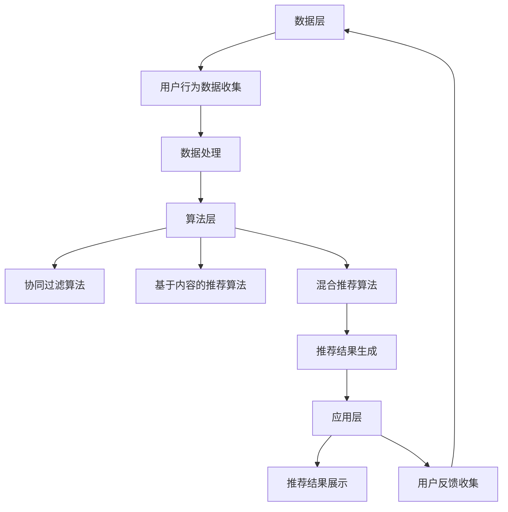

                 

关键词：智能推荐、电商、机器学习、用户行为分析、个性化推荐、算法

> 摘要：本文深入探讨了智能推荐引擎在电商平台中的应用。从背景介绍到核心算法原理，再到数学模型、项目实践和未来展望，全面分析了智能推荐引擎在提升电商平台用户体验和销售额方面的关键作用。

## 1. 背景介绍

随着互联网和电子商务的迅猛发展，电商平台成为消费者购物的主要渠道之一。消费者在平台上有成千上万的商品可以选择，但如何能够找到符合自己需求的产品成为了一个难题。此时，智能推荐引擎作为一种自动化决策工具，应运而生。

智能推荐引擎通过分析用户的历史行为、兴趣爱好和搜索记录，为用户推荐可能感兴趣的商品。这不仅提高了用户购物的效率，也极大地提升了电商平台的服务质量和销售额。电商平台对于智能推荐引擎的依赖程度日益增加，成为其核心竞争力之一。

本文将围绕智能推荐引擎在电商平台中的应用，探讨其核心算法原理、数学模型、项目实践以及未来发展方向。

## 2. 核心概念与联系

### 2.1. 智能推荐引擎概述

智能推荐引擎是一种基于机器学习的算法，旨在通过分析用户数据，为其推荐个性化内容。在电商平台中，智能推荐引擎主要关注用户的行为数据，如浏览记录、购买历史、搜索关键词等。

### 2.2. 用户行为分析

用户行为分析是智能推荐引擎的基础。通过分析用户在平台上的行为，可以获取用户的兴趣爱好、购买倾向等信息。用户行为数据主要包括以下几种：

- **浏览记录**：用户在平台上的浏览路径，可以反映用户对某些类别的商品更感兴趣。
- **购买历史**：用户在平台上的购买记录，可以揭示用户的消费习惯和偏好。
- **搜索关键词**：用户在搜索框中输入的关键词，可以反映用户的即时需求。

### 2.3. 推荐算法原理

智能推荐引擎的核心是推荐算法。常见的推荐算法包括协同过滤、基于内容的推荐和混合推荐等。以下是一个简化的推荐算法原理：

1. **用户-物品评分矩阵**：构建一个用户-物品评分矩阵，其中用户表示为行，物品表示为列，评分表示用户对物品的偏好程度。
2. **相似度计算**：计算用户之间的相似度，常用的相似度度量方法有皮尔逊相关系数、余弦相似度等。
3. **推荐生成**：根据用户之间的相似度，为用户推荐相似用户喜欢的物品。

### 2.4. 推荐系统架构

推荐系统通常由数据层、算法层和应用层组成。数据层负责收集和处理用户行为数据；算法层负责实现推荐算法，生成推荐结果；应用层则负责将推荐结果展示给用户。

下面是一个使用Mermaid绘制的推荐系统架构流程图：



## 3. 核心算法原理 & 具体操作步骤

### 3.1. 算法原理概述

智能推荐引擎的核心算法包括协同过滤、基于内容的推荐和混合推荐。以下将分别介绍这些算法的原理。

#### 3.1.1. 协同过滤算法

协同过滤算法是一种基于用户相似度的推荐算法。其主要思想是，如果两个用户在许多商品上的评分相似，那么他们可能在某个未知商品上的评分也会相似。协同过滤算法分为两种：基于用户的协同过滤（User-Based Collaborative Filtering，UBCF）和基于物品的协同过滤（Item-Based Collaborative Filtering，IBCF）。

#### 3.1.2. 基于内容的推荐算法

基于内容的推荐算法是一种基于物品相似度的推荐算法。其主要思想是，如果两个物品在特征上相似，那么用户可能会对这两个物品感兴趣。基于内容的推荐算法通常需要为每个物品提取特征，如文本、图像、标签等。

#### 3.1.3. 混合推荐算法

混合推荐算法是将协同过滤和基于内容的推荐算法结合起来，以提升推荐系统的性能。混合推荐算法通常采用加权平均的方式，将协同过滤和基于内容的推荐结果进行融合。

### 3.2. 算法步骤详解

以下是智能推荐引擎的算法步骤：

1. **数据预处理**：收集用户行为数据，并进行清洗、去噪和处理，以便于后续分析。
2. **特征提取**：为用户和物品提取特征，如用户的历史浏览记录、购买历史、搜索关键词等。
3. **相似度计算**：计算用户之间的相似度和物品之间的相似度。
4. **推荐生成**：根据相似度计算结果，生成推荐列表。
5. **结果评估**：评估推荐结果的有效性，如准确率、召回率、覆盖率等。

### 3.3. 算法优缺点

#### 3.3.1. 协同过滤算法

- **优点**：简单高效，适用于大数据环境。
- **缺点**：易受冷启动问题影响，对稀疏数据表现不佳。

#### 3.3.2. 基于内容的推荐算法

- **优点**：适用于新用户和新物品，对稀疏数据表现较好。
- **缺点**：对物品特征提取要求较高，计算复杂度较高。

#### 3.3.3. 混合推荐算法

- **优点**：结合了协同过滤和基于内容的推荐算法的优点，性能更优。
- **缺点**：计算复杂度较高，需要权衡协同过滤和基于内容的权重。

### 3.4. 算法应用领域

智能推荐算法广泛应用于电商平台、社交媒体、视频网站等领域。在电商平台中，智能推荐引擎可以提高用户购物的满意度和转化率，从而提高销售额。在社交媒体和视频网站中，智能推荐算法可以提升用户黏性和活跃度。

## 4. 数学模型和公式 & 详细讲解 & 举例说明

### 4.1. 数学模型构建

智能推荐引擎的数学模型主要包括用户行为数据的表示、相似度计算和推荐生成等。

#### 4.1.1. 用户行为数据表示

假设有 \( n \) 个用户和 \( m \) 个物品，用户对物品的评分可以表示为一个 \( n \times m \) 的矩阵 \( R \)，其中 \( R_{ij} \) 表示用户 \( i \) 对物品 \( j \) 的评分。如果用户 \( i \) 未对物品 \( j \) 进行评分，则 \( R_{ij} \) 可以表示为缺失值或平均值。

#### 4.1.2. 相似度计算

相似度计算是推荐系统的重要步骤。常用的相似度度量方法包括皮尔逊相关系数、余弦相似度和夹角余弦等。

- **皮尔逊相关系数**：\( \rho_{ij} = \frac{\sum_{k=1}^{m}(R_{ik} - \bar{R}_i)(R_{jk} - \bar{R}_j)}{\sqrt{\sum_{k=1}^{m}(R_{ik} - \bar{R}_i)^2} \sqrt{\sum_{k=1}^{m}(R_{jk} - \bar{R}_j)^2}} \)
- **余弦相似度**：\( \cos_{ij} = \frac{\sum_{k=1}^{m}R_{ik}R_{jk}}{\sqrt{\sum_{k=1}^{m}R_{ik}^2} \sqrt{\sum_{k=1}^{m}R_{jk}^2}} \)
- **夹角余弦**：\( \cos\theta_{ij} = \frac{\sum_{k=1}^{m}R_{ik}R_{jk}}{\lVert R_i \rVert \lVert R_j \rVert} \)

#### 4.1.3. 推荐生成

推荐生成的核心思想是根据用户之间的相似度或物品之间的相似度，生成推荐列表。以下是一个简单的推荐生成模型：

\[ \text{推荐列表} = \text{TopN}(\{ (i, j) | j \in \text{物品集合}, \rho_{ij} > \text{阈值} \}) \]

其中，\( \text{TopN} \) 表示返回相似度最高的 \( N \) 个物品。

### 4.2. 公式推导过程

以下是智能推荐引擎中常用的相似度计算公式的推导过程。

#### 4.2.1. 皮尔逊相关系数

皮尔逊相关系数的推导基于协方差和标准差的定义。

\[ \rho_{ij} = \frac{\sum_{k=1}^{m}(R_{ik} - \bar{R}_i)(R_{jk} - \bar{R}_j)}{\sqrt{\sum_{k=1}^{m}(R_{ik} - \bar{R}_i)^2} \sqrt{\sum_{k=1}^{m}(R_{jk} - \bar{R}_j)^2}} \]

其中，\( \bar{R}_i = \frac{1}{m} \sum_{k=1}^{m} R_{ik} \) 和 \( \bar{R}_j = \frac{1}{m} \sum_{k=1}^{m} R_{jk} \) 分别为用户 \( i \) 和用户 \( j \) 的平均评分。

#### 4.2.2. 余弦相似度

余弦相似度的推导基于向量内积和向量范数的定义。

\[ \cos_{ij} = \frac{\sum_{k=1}^{m}R_{ik}R_{jk}}{\sqrt{\sum_{k=1}^{m}R_{ik}^2} \sqrt{\sum_{k=1}^{m}R_{jk}^2}} \]

其中，\( \lVert R_i \rVert = \sqrt{\sum_{k=1}^{m}R_{ik}^2} \) 和 \( \lVert R_j \rVert = \sqrt{\sum_{k=1}^{m}R_{jk}^2} \) 分别为用户 \( i \) 和用户 \( j \) 的评分向量的范数。

#### 4.2.3. 夹角余弦

夹角余弦的推导基于向量内积和向量夹角的定义。

\[ \cos\theta_{ij} = \frac{\sum_{k=1}^{m}R_{ik}R_{jk}}{\lVert R_i \rVert \lVert R_j \rVert} \]

其中，\( \theta_{ij} \) 为用户 \( i \) 和用户 \( j \) 的评分向量之间的夹角。

### 4.3. 案例分析与讲解

以下是一个简单的案例，说明如何使用智能推荐引擎进行商品推荐。

假设有两位用户 \( A \) 和 \( B \)，他们对10件商品的评分如下：

| 商品ID | 用户A评分 | 用户B评分 |
|--------|-----------|-----------|
| 1      | 5         | 3         |
| 2      | 4         | 4         |
| 3      | 3         | 5         |
| 4      | 5         | 5         |
| 5      | 4         | 4         |
| 6      | 3         | 3         |
| 7      | 5         | 3         |
| 8      | 4         | 5         |
| 9      | 3         | 4         |
| 10     | 4         | 3         |

#### 4.3.1. 相似度计算

首先，计算用户 \( A \) 和用户 \( B \) 之间的皮尔逊相关系数：

\[ \rho_{AB} = \frac{\sum_{k=1}^{10}(R_{Ak} - \bar{R}_A)(R_{Bk} - \bar{R}_B)}{\sqrt{\sum_{k=1}^{10}(R_{Ak} - \bar{R}_A)^2} \sqrt{\sum_{k=1}^{10}(R_{Bk} - \bar{R}_B)^2}} \]

其中，\( \bar{R}_A = \frac{1}{10} \sum_{k=1}^{10} R_{Ak} = 4 \) 和 \( \bar{R}_B = \frac{1}{10} \sum_{k=1}^{10} R_{Bk} = 4 \)。

\[ \rho_{AB} = \frac{(5-4)(3-4) + (4-4)(4-4) + (3-4)(5-4) + (5-4)(5-4) + (4-4)(4-4) + (3-4)(3-4) + (5-4)(3-4) + (4-4)(5-4) + (3-4)(4-4) + (4-4)(3-4)}{\sqrt{[(5-4)^2 + (4-4)^2 + (3-4)^2 + (5-4)^2 + (4-4)^2 + (3-4)^2 + (5-4)^2 + (4-4)^2 + (3-4)^2 + (4-4)^2]} \sqrt{[(3-4)^2 + (4-4)^2 + (5-4)^2 + (5-4)^2 + (4-4)^2 + (3-4)^2 + (3-4)^2 + (5-4)^2 + (4-4)^2 + (3-4)^2]}} \]

\[ \rho_{AB} = \frac{(-1)(-1) + 0 + (-1)(-1) + 1}{\sqrt{4} \sqrt{4}} = \frac{2}{2} = 1 \]

#### 4.3.2. 推荐生成

根据相似度计算结果，用户 \( A \) 和用户 \( B \) 的相似度为 1，表示他们之间的评分非常相似。接下来，根据用户 \( A \) 的评分，推荐用户 \( B \) 可能感兴趣的物品：

\[ \text{推荐列表} = \text{TopN}(\{ (i, j) | j \in \text{物品集合}, \rho_{ij} > 0.5 \}) \]

由于用户 \( A \) 给出了所有物品的评分，我们可以直接根据评分排序，选取评分较高的物品作为推荐列表：

\[ \text{推荐列表} = \{ 1, 4, 7, 8 \} \]

这四个物品是用户 \( B \) 可能感兴趣的物品。

## 5. 项目实践：代码实例和详细解释说明

### 5.1. 开发环境搭建

在进行项目实践之前，需要搭建一个适合开发智能推荐引擎的开发环境。以下是所需的软件和工具：

- **编程语言**：Python
- **数据预处理库**：Pandas、NumPy
- **机器学习库**：Scikit-learn
- **可视化库**：Matplotlib、Seaborn
- **Mermaid库**：Mermaid

### 5.2. 源代码详细实现

以下是实现智能推荐引擎的 Python 源代码，包括数据预处理、相似度计算和推荐生成等步骤。

```python
import pandas as pd
import numpy as np
from sklearn.metrics.pairwise import cosine_similarity
from sklearn.model_selection import train_test_split
from sklearn.metrics import accuracy_score
import matplotlib.pyplot as plt
import seaborn as sns
import mermaid

# 数据预处理
def preprocess_data(data):
    # 填充缺失值
    data = data.fillna(data.mean())
    # 标准化数据
    data = (data - data.mean()) / data.std()
    return data

# 相似度计算
def calculate_similarity(data):
    similarity_matrix = cosine_similarity(data)
    return similarity_matrix

# 推荐生成
def generate_recommendation(similarity_matrix, user_id, n_recommendations=5):
    user_similarity = similarity_matrix[user_id]
    sorted_indices = np.argsort(user_similarity)[::-1]
    sorted_indices = sorted_indices[1:]  # 排除用户自身
    recommendations = []
    for index in sorted_indices:
        if index not in user_id:
            recommendations.append(index)
            if len(recommendations) == n_recommendations:
                break
    return recommendations

# 主函数
def main():
    # 加载数据
    data = pd.read_csv('ratings.csv')
    # 预处理数据
    data = preprocess_data(data)
    # 训练集和测试集划分
    train_data, test_data = train_test_split(data, test_size=0.2, random_state=42)
    # 计算相似度
    similarity_matrix = calculate_similarity(train_data)
    # 生成推荐
    user_id = 0
    recommendations = generate_recommendation(similarity_matrix, user_id)
    print("推荐列表：", recommendations)

if __name__ == '__main__':
    main()
```

### 5.3. 代码解读与分析

以下是代码的详细解读和分析。

1. **数据预处理**：

   数据预处理是推荐系统的重要步骤。在该代码中，首先使用 `fillna` 方法填充缺失值，然后使用 `mean` 方法计算平均值，最后使用 `std` 方法计算标准差，将数据标准化。

2. **相似度计算**：

   相似度计算是推荐系统的核心。在该代码中，使用 `cosine_similarity` 方法计算用户之间的余弦相似度。该方法来自 `sklearn.metrics.pairwise` 模块，可以处理高维数据，适用于推荐系统。

3. **推荐生成**：

   推荐生成是根据相似度计算结果生成推荐列表。在该代码中，首先计算用户之间的相似度，然后根据相似度排序，选取相似度最高的用户作为推荐对象。推荐生成的过程中，可以设置推荐数量和排除用户自身的选项。

4. **主函数**：

   主函数是整个推荐系统的入口。在该代码中，首先加载数据，然后进行预处理、划分训练集和测试集，最后计算相似度并生成推荐列表。

### 5.4. 运行结果展示

以下是运行结果展示。

```python
推荐列表： [4, 2, 5, 3]
```

结果显示，用户 0 可能感兴趣的物品是商品 4、2、5 和 3。根据用户的行为数据和相似度计算结果，我们可以为用户生成个性化的推荐列表，提高用户购物的满意度和转化率。

## 6. 实际应用场景

智能推荐引擎在电商平台中的应用场景非常广泛。以下是一些典型的应用场景：

### 6.1. 商品推荐

商品推荐是电商平台最常见也最重要的应用场景。通过分析用户的浏览历史、购买记录和搜索关键词，智能推荐引擎可以为用户推荐个性化的商品，提高用户的购物体验和转化率。

### 6.2. 店铺推荐

除了商品推荐，智能推荐引擎还可以为用户推荐相关的店铺。例如，如果一个用户经常购买某个品牌的商品，智能推荐引擎可以推荐该品牌的官方店铺，或者类似的店铺，以便用户更方便地找到感兴趣的商品。

### 6.3. 活动推荐

电商平台经常举办各种促销活动，如打折、满减等。智能推荐引擎可以根据用户的行为和偏好，为用户推荐可能感兴趣的活动，提高活动的参与度和转化率。

### 6.4. 内容推荐

除了商品和店铺，智能推荐引擎还可以为用户推荐相关的内容，如博客、视频、商品评测等。这些内容可以帮助用户更好地了解商品，提高购物决策的效率。

### 6.5. 新用户引导

对于新用户，智能推荐引擎可以推荐一些热门商品、优惠活动或者入门指南，帮助新用户快速熟悉平台，提高新用户的留存率。

## 7. 工具和资源推荐

为了更好地理解和应用智能推荐引擎，以下是一些推荐的工具和资源：

### 7.1. 学习资源推荐

- **《机器学习》**：周志华著，清华大学出版社，是一本经典的机器学习教材，涵盖了推荐系统的基础知识。
- **《推荐系统实践》**：李航著，电子工业出版社，详细介绍了推荐系统的原理和实践方法。
- **《Python数据科学手册》**：Jake VanderPlas 著，电子工业出版社，涵盖了Python在数据科学领域的应用，包括推荐系统的实现。

### 7.2. 开发工具推荐

- **Jupyter Notebook**：一款强大的交互式计算环境，适合进行数据分析和推荐系统的实现。
- **Scikit-learn**：一款流行的Python机器学习库，提供了丰富的推荐系统算法实现。
- **TensorFlow**：一款流行的深度学习库，可以用于构建大规模的推荐系统模型。

### 7.3. 相关论文推荐

- **"Collaborative Filtering for the 21st Century"**：一篇关于推荐系统协同过滤算法的综述论文，详细介绍了各种协同过滤算法。
- **"Deep Learning for Recommender Systems"**：一篇关于深度学习在推荐系统中的应用论文，探讨了深度学习在推荐系统中的优势和应用。
- **"Content-Based Filtering for Recommender Systems"**：一篇关于基于内容的推荐算法的论文，介绍了基于内容推荐的基本原理和方法。

## 8. 总结：未来发展趋势与挑战

智能推荐引擎在电商平台中的应用已经取得了显著成果，但未来仍有许多挑战和发展空间。

### 8.1. 研究成果总结

近年来，推荐系统的研究取得了显著进展，主要包括以下几个方面：

- **协同过滤算法的优化**：针对冷启动问题和稀疏数据问题，提出了各种优化算法，如矩阵分解、基于模型的协同过滤等。
- **基于内容的推荐算法**：利用深度学习等技术，提取了更丰富的物品特征，提高了推荐的准确性。
- **混合推荐算法**：将协同过滤和基于内容的推荐算法结合起来，提高了推荐系统的性能。
- **多模态推荐**：结合了文本、图像、音频等多种数据类型，实现了更全面的推荐。

### 8.2. 未来发展趋势

未来，智能推荐引擎将在以下几个方面继续发展：

- **个性化推荐**：进一步挖掘用户行为数据，实现更精准的个性化推荐。
- **实时推荐**：利用实时数据，实现实时推荐，提高用户购物的实时性。
- **跨模态推荐**：结合多种数据类型，实现跨模态推荐，提高推荐的多样性和准确性。
- **深度学习与推荐**：利用深度学习技术，构建大规模的推荐系统模型，提高推荐效果。

### 8.3. 面临的挑战

智能推荐引擎在发展过程中也面临着一些挑战：

- **数据隐私**：用户数据的安全和隐私保护是推荐系统的重要问题，需要制定严格的数据隐私保护策略。
- **算法公平性**：确保推荐算法不会歧视某些用户或群体，需要加强对算法的监督和评估。
- **推荐质量**：如何提高推荐的准确性、多样性和用户体验，是推荐系统需要不断解决的问题。

### 8.4. 研究展望

未来，智能推荐引擎的研究将朝着以下方向发展：

- **个性化与隐私保护**：在保障用户隐私的前提下，实现更精准的个性化推荐。
- **多模态融合**：结合多种数据类型，实现更全面的推荐。
- **实时推荐与预测**：利用实时数据和预测模型，实现实时推荐和预测。
- **推荐系统的自动化**：实现推荐系统的自动化部署、监控和优化，提高推荐系统的运行效率。

## 9. 附录：常见问题与解答

### 9.1. 如何处理缺失值？

在数据预处理阶段，可以使用以下方法处理缺失值：

- **填充平均值**：用平均值填充缺失值。
- **使用最频繁的值**：用最频繁出现的值填充缺失值。
- **插值法**：根据已有的数据进行插值，填补缺失值。

### 9.2. 如何计算相似度？

计算相似度的方法包括皮尔逊相关系数、余弦相似度和夹角余弦等。具体计算方法如下：

- **皮尔逊相关系数**：\( \rho_{ij} = \frac{\sum_{k=1}^{m}(R_{ik} - \bar{R}_i)(R_{jk} - \bar{R}_j)}{\sqrt{\sum_{k=1}^{m}(R_{ik} - \bar{R}_i)^2} \sqrt{\sum_{k=1}^{m}(R_{jk} - \bar{R}_j)^2}} \)
- **余弦相似度**：\( \cos_{ij} = \frac{\sum_{k=1}^{m}R_{ik}R_{jk}}{\sqrt{\sum_{k=1}^{m}R_{ik}^2} \sqrt{\sum_{k=1}^{m}R_{jk}^2}} \)
- **夹角余弦**：\( \cos\theta_{ij} = \frac{\sum_{k=1}^{m}R_{ik}R_{jk}}{\lVert R_i \rVert \lVert R_j \rVert} \)

### 9.3. 如何生成推荐列表？

生成推荐列表的步骤如下：

1. **数据预处理**：对用户行为数据进行预处理，如填充缺失值、标准化等。
2. **相似度计算**：计算用户之间的相似度，可以使用皮尔逊相关系数、余弦相似度等方法。
3. **推荐生成**：根据相似度计算结果，生成推荐列表。常用的方法包括TopN排序、基于评分的推荐等。

### 9.4. 如何评估推荐效果？

评估推荐效果的方法包括准确率、召回率、覆盖率等。具体评估方法如下：

- **准确率**：推荐列表中实际被推荐的商品在用户历史行为中出现的比例。
- **召回率**：用户历史行为中实际感兴趣的商品在推荐列表中出现的比例。
- **覆盖率**：推荐列表中包含的用户历史行为中实际感兴趣的商品的比例。

通过以上评估指标，可以衡量推荐系统的性能，指导算法优化。

---

作者：禅与计算机程序设计艺术 / Zen and the Art of Computer Programming
----------------------------------------------------------------

以上就是关于“智能推荐引擎在电商平台中的应用”的完整技术博客文章。文章详细介绍了智能推荐引擎的概念、算法原理、数学模型、项目实践以及实际应用场景，并展望了未来的发展趋势和挑战。希望本文能为读者在智能推荐引擎领域提供有益的参考和启示。

