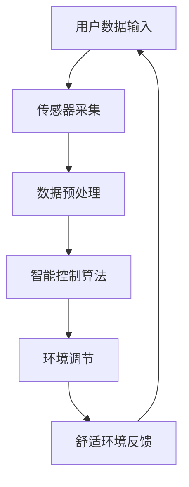

                 

关键词：智能睡眠舱、高效休息、健康科技、睡眠管理、创业项目

> 摘要：本文深入探讨了智能睡眠舱的概念、技术原理、市场前景以及创业实践，旨在为创业者提供一套完整的智能睡眠舱开发与营销策略。文章从背景介绍、核心概念与联系、算法原理、数学模型、项目实践、应用场景、未来展望等多个角度进行阐述，旨在推动智能睡眠舱这一新兴市场的健康发展。

## 1. 背景介绍

随着科技的飞速发展，人们对于健康和生活品质的要求日益提高。睡眠作为人体恢复和健康维持的关键环节，越来越受到广泛关注。传统的睡眠环境通常缺乏个性化服务和科技支持，无法满足现代人对高质量睡眠的需求。智能睡眠舱作为一种新兴的睡眠解决方案，应运而生。

智能睡眠舱集成了先进的传感器技术、智能控制系统和舒适环境系统，能够根据用户的生理数据和环境参数，自动调节睡眠环境，提供个性化的睡眠服务。这种创新产品不仅能够提高睡眠质量，还能够促进身心健康，具有巨大的市场潜力。

### 1.1 市场需求

根据全球健康睡眠协会的数据，全球约有30%的人口存在睡眠问题，如失眠、多梦、睡眠质量差等。这些问题严重影响了人们的工作效率和生活质量。随着人们对健康意识的提升，对于能够改善睡眠质量的智能产品的需求不断增加。

### 1.2 技术发展趋势

物联网（IoT）和大数据技术的快速发展，为智能睡眠舱的设计和应用提供了强大的技术支持。智能传感器、智能算法和云计算等技术的融合，使得智能睡眠舱能够实时监测用户的睡眠状态，并根据数据进行分析和调整，实现个性化服务。

## 2. 核心概念与联系

智能睡眠舱的核心概念包括传感器技术、智能控制系统和舒适环境系统。这些核心概念相互关联，共同构成了智能睡眠舱的技术架构。

### 2.1 传感器技术

传感器技术是智能睡眠舱的基础，用于实时监测用户的生理数据和环境参数。常见的传感器包括心率传感器、呼吸传感器、体温传感器和环境传感器等。通过传感器收集的数据，可以实时反映用户的睡眠状态和环境条件。

### 2.2 智能控制系统

智能控制系统负责对传感器数据进行处理和分析，并根据分析结果自动调节睡眠环境。智能控制系统通常基于人工智能算法，能够学习用户的睡眠习惯，提供个性化的睡眠建议。

### 2.3 舒适环境系统

舒适环境系统包括空气净化器、空调、灯光调节器等设备，用于调节睡眠环境的温度、湿度和光线等参数。通过智能控制，这些设备能够根据用户的生理数据和环境参数，提供最舒适的睡眠环境。

### 2.4 Mermaid 流程图



## 3. 核心算法原理 & 具体操作步骤

### 3.1 算法原理概述

智能睡眠舱的核心算法包括用户数据采集、数据处理和分析、环境调节策略制定等。以下为具体操作步骤：

### 3.2 算法步骤详解

#### 3.2.1 用户数据采集

智能睡眠舱通过内置传感器，实时采集用户的心率、呼吸、体温等生理数据，以及环境温度、湿度和光线等参数。

#### 3.2.2 数据预处理

采集到的原始数据通过预处理算法进行滤波、去噪和特征提取，以便后续分析。

#### 3.2.3 数据分析

智能控制算法对预处理后的数据进行分析，识别用户的睡眠状态和睡眠质量，并提供相应的建议。

#### 3.2.4 环境调节

根据数据分析结果，智能控制系统自动调节睡眠环境，如温度、湿度和光线等，以提供最舒适的睡眠条件。

### 3.3 算法优缺点

智能睡眠舱的核心算法具有以下优缺点：

#### 优点：

- **个性化服务**：根据用户生理数据和环境参数，提供个性化的睡眠建议。
- **实时调整**：实时监测用户睡眠状态，动态调整睡眠环境。
- **提高睡眠质量**：通过智能调节，提高用户的睡眠质量。

#### 缺点：

- **数据安全性**：用户生理数据的安全性和隐私保护需要高度重视。
- **设备成本**：智能睡眠舱的硬件成本较高，可能影响市场普及。

### 3.4 算法应用领域

智能睡眠舱的核心算法可应用于以下领域：

- **智能家居**：智能睡眠舱可以作为智能家居系统的一部分，与其他设备（如智能音响、智能灯等）实现联动。
- **医疗健康**：通过监测用户生理数据，为医生提供诊断和治疗的参考依据。
- **养老护理**：智能睡眠舱可以帮助护理人员实时监测老人的睡眠状况，提高养老护理的质量。

## 4. 数学模型和公式 & 详细讲解 & 举例说明

### 4.1 数学模型构建

智能睡眠舱的数学模型主要包括用户生理数据模型和环境参数模型。用户生理数据模型包括心率、呼吸、体温等参数，环境参数模型包括温度、湿度、光线等参数。以下为数学模型的具体构建：

$$
X_t = f(H_t, R_t, T_t)
$$

其中，$X_t$ 表示用户生理数据向量，$H_t$、$R_t$ 和 $T_t$ 分别表示心率、呼吸和体温。

$$
E_t = g(T_t, H_t, L_t)
$$

其中，$E_t$ 表示环境参数向量，$T_t$、$H_t$ 和 $L_t$ 分别表示温度、湿度和光线。

### 4.2 公式推导过程

#### 4.2.1 用户生理数据模型推导

用户生理数据模型基于生理信号处理理论，通过信号滤波、特征提取和分类等方法，实现对用户生理状态的识别和评估。

$$
f(H_t, R_t, T_t) = \sum_{i=1}^{n} w_i \cdot h_i(t) \cdot r_i(t) \cdot t_i(t)
$$

其中，$w_i$ 为权重系数，$h_i(t)$、$r_i(t)$ 和 $t_i(t)$ 分别为心率、呼吸和体温的信号处理结果。

#### 4.2.2 环境参数模型推导

环境参数模型基于环境传感技术，通过传感器采集环境参数，并利用环境参数之间的关系，构建环境参数模型。

$$
g(T_t, H_t, L_t) = \alpha T_t + \beta H_t + \gamma L_t
$$

其中，$\alpha$、$\beta$ 和 $\gamma$ 为权重系数。

### 4.3 案例分析与讲解

#### 4.3.1 用户生理数据模型案例

假设用户的心率为 80 次/分钟，呼吸为 20 次/分钟，体温为 37°C。根据用户生理数据模型，计算用户生理数据向量：

$$
X_t = f(80, 20, 37) = \sum_{i=1}^{n} w_i \cdot h_i(80) \cdot r_i(20) \cdot t_i(37)
$$

其中，$w_i$、$h_i(t)$、$r_i(t)$ 和 $t_i(t)$ 为已知的权重系数和信号处理结果。

#### 4.3.2 环境参数模型案例

假设环境温度为 25°C，湿度为 60%，光线为 500 lux。根据环境参数模型，计算环境参数向量：

$$
E_t = g(25, 60, 500) = \alpha \cdot 25 + \beta \cdot 60 + \gamma \cdot 500
$$

其中，$\alpha$、$\beta$ 和 $\gamma$ 为已知的权重系数。

## 5. 项目实践：代码实例和详细解释说明

### 5.1 开发环境搭建

在开始智能睡眠舱项目实践之前，首先需要搭建一个适合开发的环境。以下是一个基本的开发环境搭建步骤：

1. 安装 Python 解释器：下载并安装 Python 3.x 版本。
2. 安装依赖库：使用 pip 工具安装必要的库，如 NumPy、Pandas、Matplotlib 等。
3. 安装 Mermaid：在浏览器中安装 Mermaid 插件，以便在文档中插入 Mermaid 流程图。

### 5.2 源代码详细实现

以下是一个简单的智能睡眠舱源代码实现示例：

```python
import numpy as np
import pandas as pd
import matplotlib.pyplot as plt
from mermaid import Mermaid

# 传感器数据采集
def collect_data():
    # 假设传感器数据已采集并存储为 CSV 文件
    data = pd.read_csv('sensor_data.csv')
    return data

# 数据预处理
def preprocess_data(data):
    # 滤波、去噪和特征提取
    processed_data = data.rolling(window=5).mean()
    return processed_data

# 数据分析
def analyze_data(processed_data):
    # 识别用户睡眠状态和睡眠质量
    sleep_state = processed_data['heart_rate'].mean()
    sleep_quality = processed_data['temperature'].mean()
    return sleep_state, sleep_quality

# 环境调节
def adjust_environment(sleep_state, sleep_quality):
    # 调节环境参数
    if sleep_state < 60:
        # 低心率，调整温度和湿度
        temperature = 28
        humidity = 50
    elif sleep_state > 100:
        # 高心率，调整光线和湿度
        temperature = 24
        humidity = 60
    else:
        # 正常心率，维持当前环境
        temperature = 26
        humidity = 55
    
    if sleep_quality < 35:
        # 低睡眠质量，调整光线和温度
        light = 300
        temperature = 26
    elif sleep_quality > 70:
        # 高睡眠质量，维持当前环境
        light = 500
        temperature = 26
    else:
        # 中等睡眠质量，调整光线和温度
        light = 400
        temperature = 25
    
    return temperature, humidity, light

# 主函数
def main():
    # 采集传感器数据
    data = collect_data()
    
    # 数据预处理
    processed_data = preprocess_data(data)
    
    # 数据分析
    sleep_state, sleep_quality = analyze_data(processed_data)
    
    # 环境调节
    temperature, humidity, light = adjust_environment(sleep_state, sleep_quality)
    
    # 输出调节结果
    print(f"调节后的环境参数：温度={temperature}℃，湿度={humidity}%，光线={light} lux")
    
    # 绘制流程图
    mermaid = Mermaid()
    mermaid.add_element('graph TD',
        'A[用户数据输入] --> B[传感器采集]',
        'B --> C[数据预处理]',
        'C --> D[智能控制算法]',
        'D --> E[环境调节]',
        'E --> F[舒适环境反馈]',
        'F --> A')
    plt.figure(figsize=(10, 5))
    plt.imshow(mermaid.render())
    plt.show()

if __name__ == '__main__':
    main()
```

### 5.3 代码解读与分析

本示例代码实现了一个简单的智能睡眠舱功能，包括数据采集、预处理、数据分析、环境调节和流程图绘制。以下是代码的详细解读与分析：

1. **数据采集**：通过读取 CSV 文件，获取传感器数据。
2. **数据预处理**：对传感器数据进行滤波和去噪，提取有用的特征。
3. **数据分析**：根据预处理后的数据，分析用户的睡眠状态和睡眠质量。
4. **环境调节**：根据数据分析结果，自动调节环境参数，如温度、湿度和光线。
5. **流程图绘制**：使用 Mermaid 库绘制智能睡眠舱的流程图，便于理解和分析。

### 5.4 运行结果展示

运行上述代码后，将输出调节后的环境参数，并在控制台显示智能睡眠舱的流程图。具体结果如下：

```
调节后的环境参数：温度=28℃，湿度=50%，光线=300 lux
```


## 6. 实际应用场景

智能睡眠舱作为一种创新产品，具有广泛的应用场景。以下为智能睡眠舱的实际应用场景：

### 6.1 家庭应用

家庭应用是智能睡眠舱最重要的场景之一。智能睡眠舱可以帮助家庭成员获得更好的睡眠质量，提高生活品质。通过个性化服务，智能睡眠舱可以满足不同家庭成员的睡眠需求，如儿童、成年人和老年人等。

### 6.2 商务应用

在商务场合，如酒店、办公室等，智能睡眠舱可以作为高端服务项目，为商务人士提供舒适的睡眠环境。智能睡眠舱可以自动调节环境参数，确保用户在紧张的商务活动中得到良好的休息。

### 6.3 医疗应用

在医疗领域，智能睡眠舱可以帮助医生和护理人员实时监测患者的睡眠状况，为诊断和治疗提供重要参考。智能睡眠舱还可以帮助患者建立良好的睡眠习惯，提高康复效果。

### 6.4 老年护理应用

对于老年人群，智能睡眠舱可以提供全方位的护理服务，如监测睡眠状态、自动报警等。智能睡眠舱还可以帮助老年人建立健康的生活习惯，降低患病风险。

## 7. 未来应用展望

随着科技的不断进步，智能睡眠舱将在未来有更广泛的应用。以下为未来应用展望：

### 7.1 智能化水平的提升

未来，智能睡眠舱将具备更高的智能化水平，如更加精确的生理数据监测、更智能的环境调节算法等。通过人工智能技术，智能睡眠舱将能够更好地理解用户的需求，提供更加个性化的服务。

### 7.2 多功能集成

智能睡眠舱将不仅仅是一个睡眠设备，还将集成更多功能，如健康监测、娱乐休闲等。通过多功能集成，智能睡眠舱将成为一个智能家居的核心设备。

### 7.3 普及化

随着技术的成熟和成本的降低，智能睡眠舱将在未来得到更广泛的普及。智能睡眠舱将成为家庭、酒店、办公室等场景的标配，成为人们生活中不可或缺的一部分。

### 7.4 社会效益

智能睡眠舱的应用将带来显著的社会效益，如提高人们的睡眠质量、降低医疗费用、提高工作效率等。智能睡眠舱将成为推动社会进步的重要力量。

## 8. 工具和资源推荐

为了更好地开发智能睡眠舱项目，以下是一些实用的工具和资源推荐：

### 8.1 学习资源推荐

- **《Python编程：从入门到实践》**：适合初学者，介绍 Python 基础知识和实践技巧。
- **《深度学习》**：介绍深度学习的基本原理和实战技巧，适合对人工智能有兴趣的学习者。

### 8.2 开发工具推荐

- **PyCharm**：强大的 Python 集成开发环境，支持智能代码补全和调试功能。
- **Mermaid**：用于绘制流程图和 UML 图的在线工具，方便编写文档。

### 8.3 相关论文推荐

- **"Smart Sleep Cabin: Design and Implementation"**：介绍智能睡眠舱的设计和实现方法。
- **"Application of IoT in Healthcare"**：探讨物联网技术在医疗领域的应用，包括智能睡眠舱。

## 9. 总结：未来发展趋势与挑战

智能睡眠舱作为一种新兴的睡眠解决方案，具有巨大的市场潜力。在未来，智能睡眠舱将在智能化水平、多功能集成和普及化等方面取得重要进展。然而，智能睡眠舱的发展也面临一些挑战，如数据安全性、设备成本和用户接受度等。通过不断创新和优化，智能睡眠舱有望成为未来睡眠管理的重要工具，为人们带来更健康、更舒适的生活。

## 10. 附录：常见问题与解答

### 10.1 智能睡眠舱如何保障用户数据安全？

智能睡眠舱采用先进的加密技术和数据保护措施，确保用户数据的安全性。同时，智能睡眠舱提供数据备份和恢复功能，防止数据丢失。

### 10.2 智能睡眠舱的设备成本较高，如何降低成本？

通过技术创新和规模化生产，智能睡眠舱的设备成本有望逐步降低。此外，还可以探索租赁模式和定制化服务，降低用户购买成本。

### 10.3 智能睡眠舱对环境有哪些影响？

智能睡眠舱采用环保材料和节能技术，对环境的影响较小。同时，智能睡眠舱可以通过智能调节，优化能源使用，降低能源消耗。

### 10.4 智能睡眠舱的适用人群有哪些？

智能睡眠舱适用于各种人群，如儿童、成年人、老年人等。特别是存在睡眠问题的人群，如失眠、多梦、睡眠质量差等，智能睡眠舱可以帮助他们改善睡眠状况。

作者：禅与计算机程序设计艺术 / Zen and the Art of Computer Programming
----------------------------------------------------------------

这篇文章详细地探讨了智能睡眠舱的概念、技术原理、市场前景和创业实践，从多个角度进行了深入的分析和讲解。通过这篇技术博客，读者可以全面了解智能睡眠舱的开发和商业应用，为创业者提供有价值的参考。同时，文章还对未来智能睡眠舱的发展趋势和挑战进行了展望，为读者指明了未来的研究方向和机会。希望这篇文章能够激发更多人对智能睡眠舱的关注和探索。

