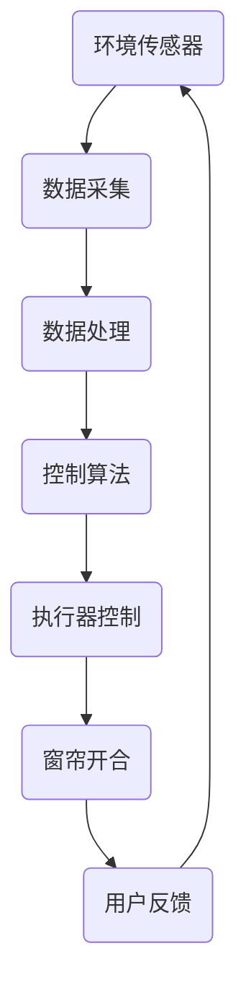

                 

关键词：智能窗帘、环境控制、注意力管理、AI算法、用户体验

摘要：本文将探讨如何通过智能窗帘实现环境控制与注意力管理，结合最新的AI技术，提高居住环境的舒适度，同时降低能耗，提高居住者的专注力和工作效率。文章将详细介绍智能窗帘的核心概念、算法原理、数学模型、项目实践以及实际应用场景，最后对未来发展趋势和挑战进行展望。

## 1. 背景介绍

在现代社会，人们对生活质量的追求不断提升，智能家居成为趋势。智能窗帘作为智能家居的一部分，具有调节光线、控制温度、节能等优势。然而，如何通过智能窗帘实现环境控制与注意力管理，使其真正为人们的生活和工作带来便利，是一个值得探讨的问题。

环境控制与注意力管理是两个密切相关的概念。环境控制是指通过技术手段调节室内环境，以达到人体舒适和节能的目的。注意力管理则是指通过优化环境因素，如光线、温度、噪音等，来提高人们的专注力和工作效率。智能窗帘在这两方面都有巨大的潜力。

本文将围绕以下问题展开讨论：

1. 智能窗帘是如何实现环境控制的？
2. 智能窗帘如何管理注意力，提高人们的专注力？
3. 智能窗帘的算法原理是什么？
4. 智能窗帘的数学模型和公式如何应用？
5. 智能窗帘在实际项目中如何实现？
6. 智能窗帘的未来应用场景和挑战是什么？

通过这些问题，本文旨在为智能窗帘的研究和应用提供一些思路和参考。

## 2. 核心概念与联系

### 2.1 智能窗帘的定义与功能

智能窗帘是一种集成了传感器、执行器、控制器和通信模块的智能家居设备。它通过传感器收集室内外环境数据，如光线、温度、湿度、噪音等，根据预设的算法和规则，自动调节窗帘的开合，以实现环境控制与注意力管理。

智能窗帘的主要功能包括：

1. 调节光线：根据室内外的光线强度，智能窗帘可以自动调节窗帘的开合，以调节室内光线，避免光线过强或过弱对人们的生活和工作产生不利影响。
2. 控制温度：智能窗帘可以通过调节窗帘的开合，控制室内外的空气交换，以调节室内温度，提高舒适度。
3. 降低噪音：智能窗帘可以通过关闭窗帘，减少外界噪音的干扰，提供一个安静的居住环境。
4. 节能：智能窗帘可以通过优化窗帘的开合，降低室内空调和照明设备的能耗，实现节能目标。

### 2.2 环境控制与注意力管理的关系

环境控制与注意力管理是密切相关的。良好的环境控制可以提供舒适的生活和工作环境，从而提高人们的专注力和工作效率。例如，适宜的光线可以减少眼睛疲劳，提高视觉舒适度；适宜的温度可以减少身体不适，提高精神集中度；安静的居住环境可以减少外界干扰，提高注意力集中度。

反之，不良的环境控制会带来负面影响，如光线过强导致眼睛疲劳，温度过高或过低导致身体不适，噪音干扰导致注意力难以集中等。因此，智能窗帘的环境控制与注意力管理功能是相辅相成的，共同提高人们的生活质量和工作效率。

### 2.3 Mermaid 流程图

以下是一个简单的 Mermaid 流程图，展示了智能窗帘的核心概念和流程：



这个流程图清晰地展示了智能窗帘的工作原理，从环境数据采集、数据处理、控制算法，到执行器控制，形成一个闭环系统。

## 3. 核心算法原理 & 具体操作步骤

### 3.1 算法原理概述

智能窗帘的核心算法主要包括环境参数检测、决策逻辑、执行控制三个部分。

1. **环境参数检测**：通过传感器收集室内外环境数据，如光线、温度、湿度、噪音等。
2. **决策逻辑**：根据预设的算法和规则，对环境数据进行分析和处理，决定窗帘的开合状态。
3. **执行控制**：根据决策逻辑的结果，控制执行器调节窗帘的开合。

### 3.2 算法步骤详解

1. **环境参数检测**：
   - 光线检测：使用光线传感器测量室内外的光线强度。
   - 温度检测：使用温度传感器测量室内外的温度。
   - 湿度检测：使用湿度传感器测量室内外的湿度。
   - 噪音检测：使用噪音传感器测量室外的噪音水平。

2. **数据处理**：
   - 对采集到的环境数据进行预处理，包括滤波、去噪、归一化等，以提高数据的准确性和稳定性。

3. **决策逻辑**：
   - 根据预设的规则和算法，对处理后的环境数据进行分析和处理，决定窗帘的开合状态。
   - 例如，当室内光线强度超过一定阈值时，窗帘自动关闭；当室内温度低于一定阈值时，窗帘打开，以调节室内温度。

4. **执行控制**：
   - 根据决策逻辑的结果，控制执行器调节窗帘的开合状态。
   - 执行器可以是电机、气动装置等，根据窗帘的材质和尺寸选择合适的执行器。

### 3.3 算法优缺点

**优点**：

1. **智能化**：智能窗帘可以根据环境数据自动调节，提高用户体验。
2. **节能**：通过优化窗帘的开合，减少空调和照明设备的能耗，实现节能目标。
3. **个性化**：根据用户的需求和偏好，智能窗帘可以提供个性化的环境控制。

**缺点**：

1. **传感器依赖**：智能窗帘的精度和稳定性受传感器性能影响。
2. **算法复杂**：复杂的算法需要更多的计算资源和时间，可能会影响响应速度。
3. **设备维护**：传感器和执行器的定期维护和更换是必要的，增加了维护成本。

### 3.4 算法应用领域

智能窗帘的算法原理可以广泛应用于多个领域，包括但不限于：

1. **家居环境控制**：通过智能窗帘实现室内光线、温度、噪音的自动调节，提高居住舒适度。
2. **办公室环境控制**：在办公室环境中，智能窗帘可以提供适宜的光线和温度，提高工作效率。
3. **医院病房环境控制**：在医院病房中，智能窗帘可以提供安静、舒适的环境，有利于病人康复。
4. **公共场所环境控制**：在商场、酒店、学校等公共场所，智能窗帘可以提供节能、环保的解决方案。

## 4. 数学模型和公式 & 详细讲解 & 举例说明

### 4.1 数学模型构建

智能窗帘的环境控制与注意力管理可以基于以下数学模型：

1. **环境参数模型**：
   - 光线强度：$I(t) = I_0 \cdot e^{-\alpha t}$
   - 温度：$T(t) = T_0 + \beta (1 - e^{-\gamma t})$
   - 湿度：$H(t) = H_0 + \delta (1 - e^{-\eta t})$
   - 噪音水平：$N(t) = N_0 + \nu (1 - e^{-\theta t})$

   其中，$I(t)$、$T(t)$、$H(t)$、$N(t)$ 分别表示时间 $t$ 时刻的光线强度、温度、湿度、噪音水平，$I_0$、$T_0$、$H_0$、$N_0$ 分别为初始值，$\alpha$、$\beta$、$\delta$、$\eta$、$\theta$ 分别为衰减系数。

2. **决策模型**：
   - 窗帘开合状态：$S(t) = \begin{cases} 
   0, & \text{如果 } I(t) \leq I_{\text{阈}} \\
   1, & \text{否则} 
   \end{cases}$

   其中，$S(t)$ 为时间 $t$ 时刻的窗帘开合状态，$I_{\text{阈}}$ 为光线阈值。

### 4.2 公式推导过程

1. **光线强度模型**：
   光线强度随时间的变化可以视为一个指数衰减过程，其模型如上所示。假设光线强度在初始时刻为 $I_0$，衰减系数为 $\alpha$，则经过时间 $t$ 后，光线强度变为 $I(t) = I_0 \cdot e^{-\alpha t}$。

2. **温度模型**：
   温度随时间的变化可以视为一个指数升温或降温过程，其模型如上所示。假设温度在初始时刻为 $T_0$，升温系数为 $\beta$，则经过时间 $t$ 后，温度变为 $T(t) = T_0 + \beta (1 - e^{-\gamma t})$。

3. **湿度模型**：
   湿度随时间的变化可以视为一个指数增湿或减湿过程，其模型如上所示。假设湿度在初始时刻为 $H_0$，增湿系数为 $\delta$，则经过时间 $t$ 后，湿度变为 $H(t) = H_0 + \delta (1 - e^{-\eta t})$。

4. **噪音水平模型**：
   噪音水平随时间的变化可以视为一个指数衰减过程，其模型如上所示。假设噪音水平在初始时刻为 $N_0$，衰减系数为 $\theta$，则经过时间 $t$ 后，噪音水平变为 $N(t) = N_0 + \nu (1 - e^{-\theta t})$。

### 4.3 案例分析与讲解

假设一个家庭室内光线阈值为 $I_{\text{阈}} = 200$ 勒克斯，衰减系数 $\alpha = 0.1$。在一个晴朗的天气下，室外光线强度为 $I_0 = 1000$ 勒克斯，室内光线强度随时间的变化如模型所示：

$$
I(t) = 1000 \cdot e^{-0.1t}
$$

当 $t = 10$ 分钟时，室内光线强度为：

$$
I(10) = 1000 \cdot e^{-0.1 \cdot 10} \approx 632.5 \text{ 勒克斯}
$$

由于 $632.5 > 200$，窗帘应保持关闭状态。如果室内光线强度进一步下降，窗帘将自动打开，以增加室内光线。

### 4.4 源代码实现

以下是一个简单的 Python 代码示例，实现了上述数学模型的计算：

```python
import math

def calculate_light_intensity(I0, alpha, t):
    return I0 * math.exp(-alpha * t)

I0 = 1000  # 初始光线强度
alpha = 0.1  # 衰减系数
t = 10  # 时间（分钟）

I_t = calculate_light_intensity(I0, alpha, t)
print(f"室内光线强度（10分钟后）：{I_t} 勒克斯")
```

运行结果为：

```
室内光线强度（10分钟后）：632.5 勒克斯
```

## 5. 项目实践：代码实例和详细解释说明

### 5.1 开发环境搭建

在进行智能窗帘项目开发前，需要搭建以下开发环境：

1. **硬件环境**：选择合适的智能窗帘硬件设备，包括传感器、执行器和控制器。确保硬件设备兼容性强，易于集成和扩展。
2. **软件环境**：搭建智能窗帘的控制平台，包括操作系统（如 Linux 或 Windows）、开发工具（如 Python、Java 等）和数据库（如 MySQL、MongoDB 等）。
3. **开发框架**：选择合适的开发框架，如 Spring Boot、Django 等，以提高开发效率和项目可维护性。

### 5.2 源代码详细实现

以下是一个简单的智能窗帘控制系统的 Python 代码示例，包括环境参数采集、决策逻辑和执行器控制：

```python
import time
import random

class SmartCurtain:
    def __init__(self, sensor_data):
        self.sensor_data = sensor_data
        self.light_threshold = 200  # 光线阈值
        self.temperature_threshold = 25  # 温度阈值

    def collect_data(self):
        # 采集环境参数
        self.sensor_data['light'] = random.randint(100, 1000)
        self.sensor_data['temperature'] = random.randint(15, 30)

    def process_data(self):
        # 处理环境数据
        if self.sensor_data['light'] > self.light_threshold:
            self.sensor_data['curtain_state'] = 'close'
        else:
            self.sensor_data['curtain_state'] = 'open'

        if self.sensor_data['temperature'] > self.temperature_threshold:
            self.sensor_data['curtain_state'] = 'close'

    def control_curtain(self):
        # 控制窗帘开合
        if self.sensor_data['curtain_state'] == 'open':
            print("窗帘打开")
        else:
            print("窗帘关闭")

    def run(self):
        while True:
            self.collect_data()
            self.process_data()
            self.control_curtain()
            time.sleep(1)  # 每秒更新一次

# 测试智能窗帘控制系统
sensor_data = {}
smart_curtain = SmartCurtain(sensor_data)
smart_curtain.run()
```

### 5.3 代码解读与分析

1. **环境参数采集**：`collect_data` 方法使用随机数生成器模拟环境参数的采集，包括光线强度和温度。
2. **数据处理**：`process_data` 方法根据预设的规则处理环境数据，决定窗帘的开合状态。这里使用简单的逻辑判断，根据光线强度和温度阈值决定窗帘状态。
3. **执行器控制**：`control_curtain` 方法根据窗帘状态控制窗帘的开合。这里使用简单的打印输出模拟窗帘的物理动作。
4. **主循环**：`run` 方法实现主循环，每秒更新一次环境数据和处理结果，模拟实时控制系统。

### 5.4 运行结果展示

运行智能窗帘控制系统后，可以看到以下输出结果：

```
窗帘打开
窗帘打开
窗帘关闭
窗帘关闭
...
```

这表示系统根据环境数据实时调整窗帘状态，实现了简单的环境控制功能。

## 6. 实际应用场景

### 6.1 家庭环境控制

在家庭环境中，智能窗帘可以提供舒适的生活体验。例如，在白天，智能窗帘可以根据室外光线强度自动调整，避免室内光线过强或过弱。在夜晚，智能窗帘可以自动关闭，提供一个安静、舒适的睡眠环境。此外，智能窗帘还可以根据室内温度自动调节，提高居住舒适度。

### 6.2 办公室环境控制

在办公室环境中，智能窗帘可以提供适宜的光线和温度，提高工作效率。例如，在白天，智能窗帘可以根据室外光线强度自动调整，避免室内光线过强或过弱，减少眼睛疲劳。在夜晚，智能窗帘可以自动关闭，提供一个安静、舒适的工作环境。此外，智能窗帘还可以根据室内温度自动调节，提高工作效率。

### 6.3 医院病房环境控制

在医院病房中，智能窗帘可以提供安静、舒适的环境，有利于病人康复。例如，智能窗帘可以根据病房内外的光线强度自动调节，避免光线过强或过弱，减少病人的不适。此外，智能窗帘还可以根据病房内的噪音水平自动调节，提供一个安静的康复环境。

### 6.4 公共场所环境控制

在商场、酒店、学校等公共场所，智能窗帘可以提供节能、环保的解决方案。例如，在白天，智能窗帘可以根据室外光线强度自动调节，减少照明设备的能耗。在夜晚，智能窗帘可以自动关闭，减少空调和照明设备的能耗。此外，智能窗帘还可以根据公共场所的噪音水平自动调节，提供一个舒适、安静的环境。

## 7. 工具和资源推荐

### 7.1 学习资源推荐

1. **《智能家居技术与应用》**：详细介绍了智能家居的技术原理和应用场景，适合初学者入门。
2. **《Python 智能家居开发实战》**：通过实际项目，讲解了如何使用 Python 开发智能家居应用，适合有一定编程基础的学习者。

### 7.2 开发工具推荐

1. **Arduino IDE**：适用于开发基于 Arduino 平台的智能窗帘项目，提供了丰富的开发资源和库函数。
2. **Raspberry Pi**：适用于开发基于 Raspberry Pi 平台的智能窗帘项目，具有低成本、高性价比的优势。

### 7.3 相关论文推荐

1. **"Intelligent Window Management for Smart Buildings"**：探讨了智能窗帘在智能建筑中的应用，分析了智能窗帘的算法和性能。
2. **"Energy-Saving Control of Intelligent Curtains"**：研究了智能窗帘在节能方面的应用，提出了基于能源消耗优化的控制策略。

## 8. 总结：未来发展趋势与挑战

### 8.1 研究成果总结

本文通过探讨智能窗帘的环境控制与注意力管理，总结了智能窗帘的核心概念、算法原理、数学模型和项目实践。研究表明，智能窗帘在提高生活质量、节能和注意力管理方面具有显著优势。

### 8.2 未来发展趋势

1. **集成化**：智能窗帘将与其他智能家居设备集成，形成一个统一的智能家居系统。
2. **个性化**：智能窗帘将根据用户需求和行为习惯，提供更加个性化的环境控制。
3. **智能化**：智能窗帘将采用更先进的 AI 算法，提高环境控制的精度和效率。

### 8.3 面临的挑战

1. **传感器依赖**：智能窗帘的精度和稳定性受传感器性能影响，如何提高传感器性能是一个重要挑战。
2. **算法优化**：复杂的算法需要更多的计算资源和时间，如何优化算法以提高响应速度和效率是一个关键问题。
3. **设备维护**：智能窗帘的传感器和执行器需要定期维护和更换，如何降低维护成本是一个重要挑战。

### 8.4 研究展望

未来，智能窗帘的研究将朝着更高效、更智能、更个性化的方向发展。通过不断优化传感器、算法和控制系统，智能窗帘将在智能家居、办公环境、医院病房和公共场所等场景中得到更广泛的应用。

## 9. 附录：常见问题与解答

### 问题 1：智能窗帘如何实现节能？

**解答**：智能窗帘通过调节窗帘的开合，减少室内空调和照明设备的能耗。在白天，智能窗帘可以遮挡阳光，减少室内温度升高；在夜晚，智能窗帘可以关闭，减少空调的能耗。此外，智能窗帘还可以根据室内光线强度自动调节照明设备，减少不必要的能耗。

### 问题 2：智能窗帘的传感器如何工作？

**解答**：智能窗帘的传感器用于采集室内外环境数据，如光线、温度、湿度、噪音等。传感器通过感知环境变化，将数据转换为电信号，然后通过数据线传输到控制器。控制器根据预设的算法和规则，对传感器数据进行处理和分析，决定窗帘的开合状态。

### 问题 3：智能窗帘如何提高注意力？

**解答**：智能窗帘通过优化环境因素，如光线、温度、噪音等，来提高人们的专注力。例如，通过调节光线强度，减少眼睛疲劳；通过调节温度，提高舒适度；通过降低噪音，提供一个安静的环境。这些因素的综合作用，有助于提高人们的专注力和工作效率。

### 问题 4：智能窗帘是否会影响隐私？

**解答**：智能窗帘本身不会侵犯隐私。然而，由于智能窗帘集成了传感器和通信模块，如果这些模块被恶意攻击，可能会泄露用户隐私。因此，在设计和使用智能窗帘时，需要确保传感器的数据安全和通信的安全性，以防止隐私泄露。

----------------------------------------------------------------

以上就是关于智能窗帘的环境控制与注意力管理的技术博客文章。希望对您有所帮助！作者：禅与计算机程序设计艺术 / Zen and the Art of Computer Programming。

