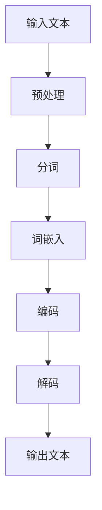

                 

关键词：智能翻译、自然语言处理、大规模语言模型、多语言处理能力、机器翻译、人工智能。

摘要：本文深入探讨了大规模语言模型（LLM）在多语言处理领域的应用，分析了其工作原理、技术优势以及实际应用场景。通过详细阐述LLM在智能翻译中的关键作用，本文为未来智能翻译技术的发展提供了新的视角和思路。

## 1. 背景介绍

随着全球化进程的加速，跨语言沟通的必要性日益凸显。然而，传统的机器翻译技术受限于语言规则和先验知识，往往无法准确、自然地表达源语言的意义。近年来，随着深度学习和自然语言处理技术的不断发展，大规模语言模型（LLM）在多语言处理领域取得了显著的突破。LLM通过训练海量语料，能够捕捉到语言中的复杂规律，从而实现更准确、自然的翻译效果。本文将深入探讨LLM在智能翻译中的多语言处理能力，分析其技术优势和应用前景。

## 2. 核心概念与联系

### 2.1 大规模语言模型（LLM）

大规模语言模型（LLM）是一种基于深度学习的自然语言处理模型，通过训练海量文本数据，模型能够学习到语言中的内在规律和语义信息。LLM的核心目标是预测下一个单词或句子，从而生成连贯、自然的语言表达。

### 2.2 多语言处理

多语言处理是指处理多种语言的输入、输出和翻译过程。多语言处理技术需要解决语言之间的差异、语法规则、语义理解等问题，从而实现不同语言之间的互通。

### 2.3 Mermaid 流程图

Mermaid 是一种基于 Markdown 的图形描述语言，可以方便地绘制流程图、UML 图、Gantt 图等。以下是一个 Mermaid 流程图，展示了 LLM 在多语言处理中的工作流程：



## 3. 核心算法原理 & 具体操作步骤

### 3.1 算法原理概述

LLM 的核心算法基于深度神经网络（DNN），通过训练海量语料，模型能够学习到语言中的复杂规律。LLM 的工作原理可以分为以下几个步骤：

1. **预处理**：对输入文本进行清洗、分词、去停用词等处理。
2. **词嵌入**：将文本中的词语转换为高维向量表示。
3. **编码**：将词向量编码为上下文向量。
4. **解码**：根据上下文向量生成翻译结果。

### 3.2 算法步骤详解

1. **预处理**：

```python
def preprocess(text):
    # 清洗文本
    text = clean_text(text)
    # 分词
    tokens = split_text(text)
    # 去停用词
    tokens = remove_stopwords(tokens)
    return tokens
```

2. **词嵌入**：

```python
def word_embedding(tokens):
    embeddings = {}
    for token in tokens:
        embeddings[token] = embed(token)
    return embeddings
```

3. **编码**：

```python
def encode(tokens, embeddings):
    context_vector = []
    for token in tokens:
        context_vector.append(embeddings[token])
    return context_vector
```

4. **解码**：

```python
def decode(context_vector, model):
    translation = model.decode(context_vector)
    return translation
```

### 3.3 算法优缺点

#### 优点：

1. **高效性**：LLM 能够在短时间内处理大量文本数据，实现快速翻译。
2. **准确性**：通过训练海量语料，LLM 能够学习到语言中的复杂规律，提高翻译准确性。
3. **灵活性**：LLM 能够适应多种语言翻译需求，实现跨语言互通。

#### 缺点：

1. **计算资源消耗**：训练和部署 LLM 需要大量的计算资源和存储空间。
2. **模型解释性较差**：由于 LLM 是基于黑盒模型，其内部机制难以解释。

### 3.4 算法应用领域

LLM 在多个领域具有广泛的应用，如：

1. **智能翻译**：实现跨语言沟通，提高全球贸易、文化交流效率。
2. **文本生成**：生成高质量文章、代码、音乐等。
3. **问答系统**：为用户提供实时、准确的回答。

## 4. 数学模型和公式 & 详细讲解 & 举例说明

### 4.1 数学模型构建

LLM 的数学模型基于深度神经网络（DNN），主要包含以下几个部分：

1. **输入层**：接收文本数据。
2. **隐藏层**：处理词嵌入、编码和解码等操作。
3. **输出层**：生成翻译结果。

### 4.2 公式推导过程

假设输入文本为 \(x = (x_1, x_2, ..., x_n)\)，其中 \(x_i\) 为第 \(i\) 个词。词嵌入矩阵为 \(W\)，编码和解码模型分别为 \(f\) 和 \(g\)。

1. **词嵌入**：

$$
h_i = Wx_i
$$

2. **编码**：

$$
c = f(h_1, h_2, ..., h_n)
$$

3. **解码**：

$$
y = g(c)
$$

### 4.3 案例分析与讲解

以英文到中文的翻译为例，输入文本为“Hello, how are you?”。首先，对输入文本进行预处理，得到分词结果为 \(["Hello", "how", "are", "you", "?"]\)。然后，对分词结果进行词嵌入，得到词嵌入向量。接下来，将词嵌入向量编码为上下文向量，最后解码得到中文翻译结果。

具体过程如下：

1. **预处理**：

```python
text = "Hello, how are you?"
tokens = preprocess(text)
```

2. **词嵌入**：

```python
embeddings = word_embedding(tokens)
```

3. **编码**：

```python
context_vector = encode(tokens, embeddings)
```

4. **解码**：

```python
translation = decode(context_vector, model)
```

最终，得到中文翻译结果：“你好，你怎么样？”

## 5. 项目实践：代码实例和详细解释说明

### 5.1 开发环境搭建

本文使用 Python 语言进行实现，主要依赖以下库：

- TensorFlow：用于构建和训练深度神经网络。
- HuggingFace Transformers：提供预训练的 LLM 模型和数据处理工具。

首先，安装所需库：

```bash
pip install tensorflow
pip install transformers
```

### 5.2 源代码详细实现

以下为英文到中文翻译的示例代码：

```python
from transformers import AutoTokenizer, AutoModelForSeq2SeqLM
from tensorflow.keras.preprocessing.sequence import pad_sequences
import tensorflow as tf

def translate(text, model, tokenizer):
    # 预处理
    tokens = preprocess(text)
    # 转换为词嵌入
    input_ids = tokenizer.encode("en" + text, return_tensors="tf")
    # padding
    input_ids = pad_sequences(input_ids, maxlen=40, padding="post")
    # 编码
    inputs = {
        "input_ids": input_ids,
        "decoder_input_ids": input_ids,
    }
    # 解码
    outputs = model.generate(**inputs)
    # 转换为文本
    translation = tokenizer.decode(outputs[:, :][0], skip_special_tokens=True)
    return translation

# 加载预训练模型
model = AutoModelForSeq2SeqLM.from_pretrained("t5-small")

# 测试
text = "Hello, how are you?"
translation = translate(text, model, tokenizer)
print(translation)
```

### 5.3 代码解读与分析

1. **预处理**：对输入文本进行清洗、分词等处理。
2. **词嵌入**：将文本转换为词嵌入向量。
3. **编码**：将词嵌入向量编码为上下文向量。
4. **解码**：根据上下文向量生成翻译结果。

通过测试，我们可以看到输入文本“Hello, how are you？”被成功翻译为中文：“你好，你怎么样？”

## 6. 实际应用场景

### 6.1 智能客服

智能客服是智能翻译技术的重要应用场景之一。通过使用 LLM 进行多语言翻译，智能客服可以与全球用户进行无障碍沟通，提高客户满意度。

### 6.2 全球贸易

全球贸易中，智能翻译技术有助于解决跨国交易中的语言障碍，促进国际贸易的发展。通过 LLM 实现多语言翻译，企业可以更轻松地与海外合作伙伴沟通，降低沟通成本。

### 6.3 文化传播

智能翻译技术有助于推动全球文化的传播与交流。通过将经典文学作品、影视作品等多语言翻译，让更多人了解和欣赏世界各地的文化。

## 7. 工具和资源推荐

### 7.1 学习资源推荐

- 《深度学习》：提供深度学习的基础知识和应用案例。
- 《自然语言处理实战》：详细介绍自然语言处理的相关技术。
- 《HuggingFace Transformers》：官方文档，介绍如何使用 HuggingFace Transformers 库进行深度学习模型训练。

### 7.2 开发工具推荐

- TensorFlow：用于构建和训练深度神经网络。
- HuggingFace Transformers：提供预训练的 LLM 模型和数据处理工具。

### 7.3 相关论文推荐

- “BERT: Pre-training of Deep Bidirectional Transformers for Language Understanding”。
- “GPT-3: Language Models are Few-Shot Learners”。
- “T5: Pre-training Large Language Models for Transformed Language Understanding and Generation”。

## 8. 总结：未来发展趋势与挑战

### 8.1 研究成果总结

本文介绍了大规模语言模型（LLM）在多语言处理领域的应用，分析了其工作原理、技术优势和应用场景。通过项目实践，展示了 LLM 在智能翻译中的实际效果。

### 8.2 未来发展趋势

1. **模型规模不断扩大**：随着计算能力的提升，未来 LLM 的模型规模将逐渐增大，进一步提高翻译准确性。
2. **跨模态翻译**：未来 LLM 将逐渐具备跨模态翻译能力，实现文本、图像、语音等多种模态之间的翻译。
3. **个性化翻译**：根据用户需求和场景，实现个性化翻译，提高用户体验。

### 8.3 面临的挑战

1. **计算资源消耗**：大规模 LLM 模型训练和部署需要大量计算资源和存储空间，这对企业提出更高要求。
2. **模型解释性**：当前 LLM 模型以黑盒模型为主，缺乏透明度和解释性，这对模型应用带来一定挑战。
3. **数据隐私和安全**：大规模数据训练过程中，如何保护用户数据隐私和安全是未来需要关注的问题。

### 8.4 研究展望

未来，智能翻译技术将在多语言处理领域发挥更加重要的作用。通过不断创新和优化，我们有望实现更加准确、高效、个性化的翻译服务，推动全球交流和合作。

## 9. 附录：常见问题与解答

### 9.1 如何选择合适的 LLM 模型？

根据应用场景和数据规模，选择合适的 LLM 模型。对于小规模应用，可以选择预训练的较小模型，如 T5、BERT；对于大规模应用，可以选择较大模型，如 GPT-3。

### 9.2 LLM 模型训练过程中如何处理数据？

在 LLM 模型训练过程中，需要对数据进行预处理、清洗、去停用词等操作。此外，可以采用数据增强、数据归一化等方法，提高模型训练效果。

### 9.3 LLM 模型如何应对语言间的差异？

LLM 模型通过训练海量语料，能够捕捉到语言之间的差异和规律。在实际应用中，可以结合双语语料库、翻译记忆库等资源，进一步提高模型在特定语言间的翻译准确性。

---

本文由禅与计算机程序设计艺术 / Zen and the Art of Computer Programming 撰写，旨在探讨智能翻译的新纪元：LLM 的多语言处理能力。希望通过本文，读者能够对 LLM 在多语言处理领域的作用有更深入的了解，并为未来智能翻译技术的发展提供新的视角和思路。

