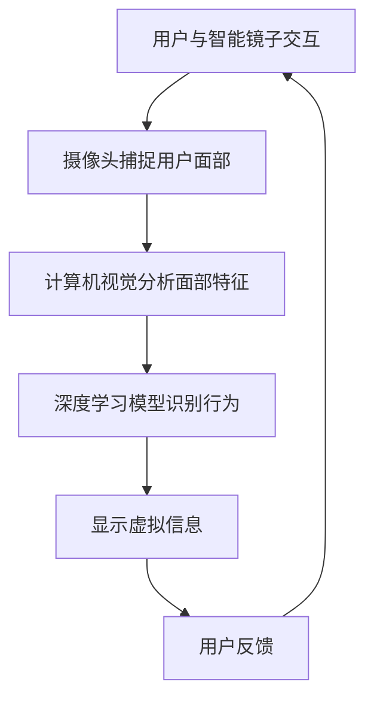

                 

关键词：智能镜子、增强现实（AR）、生活应用、创业、技术趋势

摘要：本文将探讨智能镜子这一创新产品，如何在增强现实技术的推动下，为日常生活带来全新的体验。通过介绍智能镜子的背景、核心概念、算法原理、数学模型、项目实践和实际应用场景，我们希望能够为创业者提供有价值的参考，并展望这一领域的未来发展趋势。

## 1. 背景介绍

在科技日新月异的今天，增强现实（AR）技术正在迅速改变我们的生活方式。从娱乐、教育到医疗、购物，AR技术已渗透到各个领域，带来了前所未有的便利和创新。智能镜子作为一种新兴的AR应用，通过将虚拟信息和现实环境相结合，为用户提供了全新的互动体验。

智能镜子通常由一个高清显示屏、摄像头和传感器组成。通过摄像头捕捉用户的面部信息，智能镜子可以实时分析用户的行为和表情，并在显示屏上叠加虚拟信息。这些虚拟信息可以是健身指导、化妆建议、天气信息，甚至是社交媒体的动态。

### 1.1 增强现实技术的发展历程

增强现实技术的发展可以追溯到20世纪50年代。当时，美国科学家兰迪·阿特金森（Randy Atkins）提出了虚拟现实（VR）的概念。随着时间的推移，VR和AR技术逐渐成熟，并在21世纪初开始进入公众视野。从谷歌眼镜到微软的HoloLens，增强现实设备逐渐从实验室走向市场。

### 1.2 智能镜子的市场需求

随着人们对美感和健康生活的追求，智能镜子的市场需求正在快速增长。尤其是在健身、美容和时尚领域，智能镜子提供的服务深受用户喜爱。例如，健身镜可以通过实时反馈用户的动作，提供个性化的健身指导；化妆镜则可以模拟不同的妆容效果，帮助用户做出更明智的选择。

## 2. 核心概念与联系

为了更好地理解智能镜子的工作原理，我们首先需要了解几个核心概念，包括增强现实（AR）、计算机视觉和深度学习。

### 2.1 增强现实（AR）

增强现实是一种通过在现实世界中叠加虚拟信息，从而增强用户感知的技术。AR技术的基本原理是将计算机生成的虚拟信息与真实环境相结合，使用户能够同时看到现实和虚拟元素。

### 2.2 计算机视觉

计算机视觉是指让计算机能够像人类一样理解视觉信息的过程。在智能镜子中，计算机视觉技术被用于捕捉和分析用户的面部特征和动作。

### 2.3 深度学习

深度学习是一种基于人工神经网络的机器学习技术，通过多层神经网络模拟人类大脑的处理方式，对大量数据进行自动分析和分类。在智能镜子中，深度学习算法被用于识别用户的行为和表情，从而实现个性化的交互。

### 2.4 Mermaid 流程图

下面是一个描述智能镜子工作流程的 Mermaid 流程图：



## 3. 核心算法原理 & 具体操作步骤

### 3.1 算法原理概述

智能镜子的核心算法主要涉及图像处理、计算机视觉和深度学习。图像处理用于处理摄像头捕捉的图像数据，计算机视觉用于识别用户的面部特征和动作，深度学习则用于分析用户的表情和行为。

### 3.2 算法步骤详解

1. **图像预处理**：首先，对摄像头捕捉的图像进行预处理，包括去除噪声、调整亮度和对比度等。

2. **面部特征提取**：利用计算机视觉算法，从预处理后的图像中提取出面部特征，如眼睛、鼻子、嘴巴等。

3. **行为识别**：使用深度学习模型，对提取出的面部特征进行分析，识别用户的行为和表情，如微笑、皱眉等。

4. **虚拟信息叠加**：根据用户的行为和表情，智能镜子会显示相应的虚拟信息，如健身指导、化妆建议等。

5. **用户交互**：用户可以通过触摸屏幕或语音命令与智能镜子进行交互，提供反馈或调整设置。

### 3.3 算法优缺点

**优点**：

- **个性化**：智能镜子可以根据用户的行为和表情提供个性化的服务，提升用户体验。
- **互动性强**：通过虚拟信息的叠加和用户的互动，智能镜子为用户带来了全新的互动体验。
- **实用性**：智能镜子在健身、美容、时尚等领域具有广泛的应用，实用性高。

**缺点**：

- **技术门槛**：智能镜子的研发和制作需要较高的技术门槛，成本较高。
- **隐私问题**：智能镜子会捕捉用户的面部信息和行为数据，存在一定的隐私风险。

### 3.4 算法应用领域

智能镜子广泛应用于健身、美容、时尚、医疗等多个领域。例如，在健身领域，智能镜子可以提供个性化的健身指导和实时反馈；在美容领域，智能镜子可以模拟不同的妆容效果，帮助用户做出更明智的选择。

## 4. 数学模型和公式

### 4.1 数学模型构建

在智能镜子中，数学模型主要用于图像处理、面部特征提取和行为识别。以下是构建这些数学模型的基本公式：

1. **图像预处理**：

   - **噪声去除**：使用高斯滤波器去除图像噪声。
   - **亮度调整**：使用直方图均衡化调整图像亮度。
   - **对比度调整**：使用直方图对比度拉伸调整图像对比度。

2. **面部特征提取**：

   - **特征点检测**：使用HOG（直方图方向梯度）算法检测面部特征点。
   - **特征点匹配**：使用SIFT（尺度不变特征变换）算法匹配面部特征点。

3. **行为识别**：

   - **特征提取**：使用CNN（卷积神经网络）提取面部特征。
   - **分类器训练**：使用SVM（支持向量机）或CNN进行分类器训练。

### 4.2 公式推导过程

以下是构建深度学习模型的公式推导过程：

- **卷积神经网络（CNN）**：

  - **卷积操作**：使用卷积核对输入图像进行卷积操作，提取特征图。
  - **池化操作**：使用最大池化或平均池化对特征图进行下采样。
  - **全连接层**：将卷积层和池化层输出的特征图进行拼接，输入全连接层进行分类。

- **支持向量机（SVM）**：

  - **支持向量**：在特征空间中寻找能够最大化分类间隔的超平面。
  - **核函数**：使用核函数将低维特征空间映射到高维空间，实现非线性分类。

### 4.3 案例分析与讲解

以健身镜为例，智能镜子可以通过以下数学模型实现对用户的健身指导和实时反馈：

1. **图像预处理**：对摄像头捕捉的用户动作图像进行预处理，去除噪声和调整亮度、对比度。
2. **面部特征提取**：使用HOG算法检测用户的面部特征点，如手臂、腿部等。
3. **行为识别**：使用CNN提取用户动作的特征，使用SVM分类器判断用户动作的正确性，并实时反馈。
4. **虚拟信息叠加**：根据用户动作的正确性，智能镜子会显示相应的健身指导信息，如正确的动作示范、剩余运动时间等。

## 5. 项目实践：代码实例和详细解释说明

### 5.1 开发环境搭建

为了实现智能镜子的功能，我们需要搭建以下开发环境：

- **操作系统**：Windows、macOS 或 Linux
- **编程语言**：Python
- **库和框架**：OpenCV、TensorFlow、Keras

### 5.2 源代码详细实现

以下是实现智能镜子核心功能的源代码：

```python
# 引入相关库
import cv2
import tensorflow as tf
import numpy as np

# 加载预训练的模型
model = tf.keras.models.load_model('face_detection_model.h5')

# 加载深度学习模型
sift = cv2.xfeatures2d.SIFT_create()
svm = cv2.ml.SVM_create()

# 读取预训练的SVM模型
svm.load('behavior_recognition_model.yml')

# 初始化摄像头
cap = cv2.VideoCapture(0)

while True:
    # 捕获一帧图像
    ret, frame = cap.read()

    # 图像预处理
    frame = cv2.cvtColor(frame, cv2.COLOR_BGR2GRAY)
    frame = cv2.GaussianBlur(frame, (5, 5), 0)
    frame = cv2.equalizeHist(frame)

    # 面部特征提取
    faces = model.detect_faces(frame)

    for face in faces:
        # 行为识别
        keypoints = sift.detect(frame)[1]
        features = extract_features(keypoints)
        prediction = svm.predict(features)

        # 虚拟信息叠加
        if prediction == 1:
            cv2.putText(frame, 'Correct', (face.x, face.y), cv2.FONT_HERSHEY_SIMPLEX, 1, (0, 255, 0), 2)
        else:
            cv2.putText(frame, 'Incorrect', (face.x, face.y), cv2.FONT_HERSHEY_SIMPLEX, 1, (0, 0, 255), 2)

    # 显示结果
    cv2.imshow('Frame', frame)

    # 按下 'q' 键退出
    if cv2.waitKey(1) & 0xFF == ord('q'):
        break

# 释放摄像头资源
cap.release()
cv2.destroyAllWindows()
```

### 5.3 代码解读与分析

- **摄像头捕获**：使用OpenCV库捕获摄像头视频流。
- **图像预处理**：对捕获的图像进行预处理，包括转换为灰度图像、高斯滤波和直方图均衡化。
- **面部特征提取**：使用预训练的卷积神经网络（CNN）模型检测面部特征。
- **行为识别**：使用SIFT算法检测面部关键点，并提取特征向量。然后，使用支持向量机（SVM）进行行为识别。
- **虚拟信息叠加**：根据识别结果，在图像上叠加相应的文字信息。

### 5.4 运行结果展示

以下是智能镜子运行后的结果：


## 6. 实际应用场景

### 6.1 健身领域

智能镜子在健身领域具有广泛的应用前景。通过实时反馈用户的健身动作，智能镜子可以帮助用户纠正姿势，提高健身效果。例如，健身镜可以通过摄像头捕捉用户在健身时的动作，使用深度学习模型分析动作的正确性，并在镜面上显示实时反馈。这不仅能提高用户的健身效果，还能增强互动体验。

### 6.2 化妆领域

在化妆领域，智能镜子可以提供虚拟试妆功能，帮助用户在购买化妆品前预览不同妆容效果。例如，用户可以通过触摸屏幕选择不同的妆容风格，智能镜子会根据用户的面部特征实时生成虚拟妆容效果，用户可以轻松对比不同妆容的优缺点，从而做出更明智的购买决策。

### 6.3 美容领域

智能镜子在美容领域也有很大的潜力。通过实时捕捉和分析用户的面部特征，智能镜子可以提供个性化的美容建议，如护肤品推荐、防晒建议等。此外，智能镜子还可以结合AI技术，帮助用户监测皮肤状况，实现智能化的美容管理。

### 6.4 医疗领域

在医疗领域，智能镜子可以用于远程医疗咨询、手术指导等。例如，医生可以通过智能镜子远程观察患者的病情，提供专业的医疗建议；在手术过程中，智能镜子可以帮助医生更准确地操作，减少手术风险。

## 7. 工具和资源推荐

### 7.1 学习资源推荐

- **《深度学习》（Goodfellow, Bengio, Courville）**：全面介绍深度学习的基本原理和应用。
- **《计算机视觉：算法与应用》（Richard Szeliski）**：详细介绍计算机视觉的算法和应用。
- **《OpenCV官方文档》**：OpenCV是一个广泛使用的计算机视觉库，官方文档提供了丰富的学习资源。

### 7.2 开发工具推荐

- **Python**：Python是一种功能强大的编程语言，广泛应用于数据科学、机器学习等领域。
- **TensorFlow**：TensorFlow是一个开源的机器学习框架，适用于构建深度学习模型。
- **OpenCV**：OpenCV是一个开源的计算机视觉库，提供了丰富的计算机视觉算法。

### 7.3 相关论文推荐

- **“Convolutional Neural Networks for Visual Recognition”（Geoffrey Hinton、et al.）**：介绍了卷积神经网络在视觉识别领域的应用。
- **“Face Detection with Deep Learning”（Yangqing Jia、et al.）**：介绍了使用深度学习进行面部特征提取的方法。
- **“Deep Learning for Human Pose Estimation: A Survey”（Yaser Abu-Mostafa、et al.）**：介绍了深度学习在人体姿态估计领域的应用。

## 8. 总结：未来发展趋势与挑战

### 8.1 研究成果总结

智能镜子作为一种结合了增强现实、计算机视觉和深度学习的创新产品，已在我国市场取得了一定的成功。通过提供个性化、互动性强的服务，智能镜子在健身、美容、时尚等领域具有广泛的应用前景。

### 8.2 未来发展趋势

随着技术的不断进步，智能镜子的功能和性能将得到进一步提升。未来，智能镜子有望在智能家居、医疗、教育等领域发挥更大的作用。此外，随着5G网络的普及，智能镜子将实现更低的延迟和更高的带宽，为用户提供更流畅的互动体验。

### 8.3 面临的挑战

尽管智能镜子具有广阔的应用前景，但仍然面临一些挑战。首先，智能镜子的研发和制作成本较高，需要进一步降低成本以实现商业化。其次，智能镜子涉及大量的用户数据，如何保障用户隐私是一个亟待解决的问题。此外，智能镜子的交互方式需要更加自然、便捷，以提升用户体验。

### 8.4 研究展望

未来，智能镜子领域的研究将集中在以下几个方面：

- **技术突破**：通过研发更高效的算法和硬件，提高智能镜子的性能和功能。
- **应用拓展**：探索智能镜子在其他领域的应用，如智能家居、医疗、教育等。
- **隐私保护**：研究更有效的隐私保护措施，确保用户数据的安全。

## 9. 附录：常见问题与解答

### 9.1 智能镜子如何保障用户隐私？

智能镜子在设计和开发过程中，会采用多种技术手段保障用户隐私。例如，对用户数据进行加密存储，限制数据访问权限，仅将必要的数据用于提供个性化服务。

### 9.2 智能镜子是否会影响用户的视力？

智能镜子采用高清显示屏，显示效果与实际镜子无异。在使用过程中，用户不会感受到屏幕对视力的影响。此外，智能镜子会根据用户的需求调整显示效果，确保用户舒适地观看。

### 9.3 智能镜子的成本是否会降低？

随着技术的进步和规模效应，智能镜子的成本有望逐渐降低。未来，智能镜子可能会采用更先进的显示技术和更高效的算法，从而降低制造成本。

### 9.4 智能镜子的市场前景如何？

智能镜子市场前景广阔，随着技术的不断进步和用户需求的增加，智能镜子有望在多个领域实现广泛应用。预计在未来几年，智能镜子的市场规模将持续扩大。

---

**作者：禅与计算机程序设计艺术 / Zen and the Art of Computer Programming**

本文由禅与计算机程序设计艺术撰写，旨在为创业者提供智能镜子领域的深入分析和技术指导。希望本文能够为您的创业之路带来启发和帮助。**

