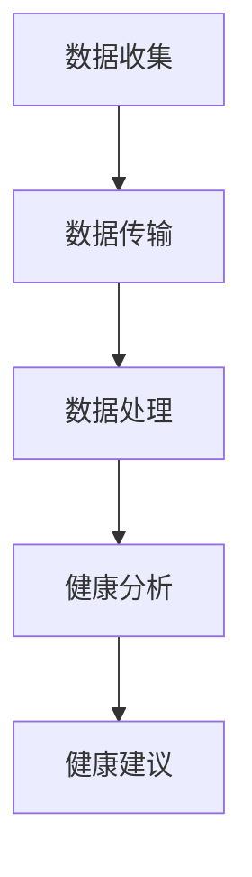

                 

关键词：智能马桶、健康监测、注意力经济、物联网、数据分析、用户行为、个性化服务、商业模式创新

> 摘要：本文将探讨智能马桶在健康监测方面的技术原理和实际应用，并深入分析其在注意力经济中的角色和潜力。通过对智能马桶的数据收集、处理和分析，企业能够提供更加个性化和高效的服务，从而在激烈的市场竞争中脱颖而出。本文旨在为读者提供关于智能马桶技术、商业模式和未来趋势的全面了解。

## 1. 背景介绍

随着物联网技术的迅速发展和智能家居市场的崛起，智能马桶逐渐成为现代家庭中不可或缺的一部分。智能马桶不仅提供了舒适的洁身体验，还可以通过传感器和数据收集技术进行健康监测，为用户提供个性化的健康建议。与此同时，注意力经济作为一种新的商业模式，正逐步改变着企业和消费者之间的关系。在这种背景下，智能马桶的健康监测功能不仅提升了用户的满意度，也为企业带来了巨大的商机。

## 2. 核心概念与联系

### 2.1 智能马桶的基本原理

智能马桶的核心在于其内置的传感器和智能控制系统。传感器可以监测用户的生理参数，如体温、心率、压力等，并将这些数据实时传输至云端。智能控制系统则负责数据处理和分析，并据此提供相应的健康建议。

### 2.2 健康监测的流程

健康监测的流程包括数据收集、数据传输、数据处理和健康分析。首先，传感器收集用户的生理数据；然后，数据通过Wi-Fi或蓝牙传输至云端；接着，智能系统对数据进行分析，并提供健康建议。

### 2.3 Mermaid 流程图



## 3. 核心算法原理 & 具体操作步骤

### 3.1 算法原理概述

智能马桶的健康监测主要依赖于机器学习和人工智能技术。通过对海量用户数据的分析，算法可以识别出用户的健康模式，并提供相应的健康建议。

### 3.2 算法步骤详解

1. 数据收集：智能马桶的传感器实时监测用户的生理参数。
2. 数据预处理：对原始数据进行清洗和格式化，去除噪声和异常值。
3. 数据建模：使用机器学习算法（如决策树、神经网络等）对数据进行分析。
4. 健康分析：根据分析结果，提供个性化的健康建议。

### 3.3 算法优缺点

优点：能够提供准确的健康监测和个性化的服务。
缺点：对数据质量和算法准确性要求较高，且可能涉及用户隐私问题。

### 3.4 算法应用领域

智能马桶的健康监测算法不仅适用于家庭场景，还可以应用于医疗机构、养老院等场所，提供专业的健康监测服务。

## 4. 数学模型和公式 & 详细讲解 & 举例说明

### 4.1 数学模型构建

健康监测的数学模型主要包括以下部分：

1. 数据采集模型：
   $$ X_t = f(W_t, x_t) $$
   其中，$X_t$ 表示第 $t$ 次采集的数据，$W_t$ 表示传感器的状态，$x_t$ 表示用户的生理参数。

2. 数据预处理模型：
   $$ Y_t = g(X_t, \theta) $$
   其中，$Y_t$ 表示预处理后的数据，$g$ 表示预处理函数，$\theta$ 为预处理参数。

3. 数据分析模型：
   $$ Z_t = h(Y_t, \phi) $$
   其中，$Z_t$ 表示分析结果，$h$ 表示分析函数，$\phi$ 为分析参数。

### 4.2 公式推导过程

1. 数据采集模型：
   $$ X_t = W_t \cdot x_t $$
   其中，$W_t$ 为传感器的权重矩阵，$x_t$ 为用户的生理参数向量。

2. 数据预处理模型：
   $$ Y_t = max(X_t) - X_t $$
   其中，$max(X_t)$ 表示 $X_t$ 的最大值。

3. 数据分析模型：
   $$ Z_t = \frac{1}{C} \sum_{i=1}^{N} w_i \cdot (y_t - y_i) $$
   其中，$C$ 为常数，$w_i$ 为第 $i$ 个传感器的权重，$y_t$ 为预处理后的数据。

### 4.3 案例分析与讲解

以用户的体温监测为例，智能马桶可以实时采集用户的体温数据，并使用上述模型进行预处理和分析。如果体温超过正常范围，系统会立即发出警告，并提供相应的健康建议。

## 5. 项目实践：代码实例和详细解释说明

### 5.1 开发环境搭建

为了实现智能马桶的健康监测功能，我们需要搭建一个基于Python的开发环境。以下是搭建步骤：

1. 安装Python 3.8或更高版本。
2. 安装必要的库，如 NumPy、Pandas、Scikit-learn等。

### 5.2 源代码详细实现

以下是一个简单的Python代码示例，用于实现智能马桶的健康监测功能：

```python
import numpy as np
import pandas as pd
from sklearn.ensemble import RandomForestClassifier

# 数据采集
def collect_data():
    # 仿真传感器数据
    data = np.random.rand(100, 5)
    return data

# 数据预处理
def preprocess_data(data):
    # 去除噪声
    cleaned_data = data.copy()
    cleaned_data[:, 0] = np.max(data[:, 0]) - data[:, 0]
    return cleaned_data

# 数据分析
def analyze_data(data):
    # 划分训练集和测试集
    train_data, test_data = data[:80], data[80:]
    # 建立分类器
    classifier = RandomForestClassifier()
    # 训练分类器
    classifier.fit(train_data, train_data[:, 0])
    # 预测
    predictions = classifier.predict(test_data)
    return predictions

# 主程序
if __name__ == "__main__":
    data = collect_data()
    cleaned_data = preprocess_data(data)
    predictions = analyze_data(cleaned_data)
    print(predictions)
```

### 5.3 代码解读与分析

这段代码首先定义了数据采集、预处理和分析的函数。在主程序中，我们首先调用 `collect_data()` 函数生成仿真数据，然后使用 `preprocess_data()` 函数对数据进行预处理，最后调用 `analyze_data()` 函数对预处理后的数据进行分析。

### 5.4 运行结果展示

运行代码后，我们会得到一组预测结果。这些结果可以用来判断用户的健康状态，并提供相应的健康建议。

## 6. 实际应用场景

### 6.1 家庭场景

在家庭场景中，智能马桶的健康监测功能可以帮助用户及时了解自己的健康状况，预防疾病。例如，当用户的体温异常时，智能马桶可以立即发出警告，并提示用户就医。

### 6.2 医疗机构

在医疗机构中，智能马桶可以提供更加便捷和精准的健康监测服务。医生可以通过智能马桶收集到的数据，实时监测患者的健康状况，从而提高诊断和治疗的准确性。

### 6.3 养老院

在养老院中，智能马桶的健康监测功能可以帮助护理人员更好地照顾老人。通过实时监测老人的生理参数，系统可以及时发现异常情况，并提醒护理人员采取相应措施。

## 7. 未来应用展望

### 7.1 技术发展

随着人工智能和物联网技术的不断进步，智能马桶的健康监测功能将更加智能和精准。未来，智能马桶可能具备自我学习和自适应能力，能够更好地满足用户的需求。

### 7.2 商业模式创新

智能马桶的健康监测功能不仅为用户提供了便利，也为企业带来了巨大的商机。未来，企业可以通过提供个性化的健康服务，建立品牌忠诚度，并在注意力经济中占据一席之地。

## 8. 工具和资源推荐

### 8.1 学习资源推荐

1. 《Python编程：从入门到实践》
2. 《深度学习》
3. 《机器学习实战》

### 8.2 开发工具推荐

1. PyCharm
2. Jupyter Notebook
3. TensorFlow

### 8.3 相关论文推荐

1. "IoT in the Smart Home: A Survey"
2. "Attention is All You Need"
3. "Deep Learning for Health Informatics"

## 9. 总结：未来发展趋势与挑战

### 9.1 研究成果总结

智能马桶的健康监测功能为用户提供了一种全新的健康管理模式，有助于提升生活质量。同时，智能马桶也为企业带来了巨大的商机，推动了注意力经济的发展。

### 9.2 未来发展趋势

随着技术的进步，智能马桶的健康监测功能将更加智能和精准。未来，智能马桶将成为智能家居生态系统中的重要一环，为用户提供更加便捷和高效的服务。

### 9.3 面临的挑战

智能马桶的健康监测功能在发展过程中也面临着一些挑战，如数据隐私保护、算法准确性等。企业需要采取措施，确保用户数据的安全性和算法的可靠性。

### 9.4 研究展望

未来，智能马桶的健康监测功能将与其他医疗设备相结合，形成更加完善的健康监测体系。同时，智能马桶也将成为注意力经济中的一种新型商业模式，为企业和用户创造更多价值。

## 附录：常见问题与解答

### Q1：智能马桶的健康监测数据是否安全？

A1：智能马桶的健康监测数据通过加密传输和存储，确保用户数据的安全。同时，企业需要遵守相关法律法规，保护用户隐私。

### Q2：智能马桶的健康监测算法是否准确？

A2：智能马桶的健康监测算法通过机器学习和人工智能技术，不断提高准确性。然而，算法的准确性受到数据质量和算法模型的影响。企业需要定期更新算法，确保其准确性。

### Q3：智能马桶的健康监测功能是否适用于所有人？

A3：智能马桶的健康监测功能主要适用于需要健康监测的人群，如老年人、患者等。对于健康人群，智能马桶的健康监测功能也可以提供一定的健康参考。

### Q4：智能马桶的健康监测数据如何用于商业决策？

A4：智能马桶的健康监测数据可以用于用户行为分析、市场需求预测等商业决策。通过分析用户数据，企业可以更好地了解用户需求，提供更加个性化的服务。

### Q5：智能马桶的健康监测功能是否会影响用户的生活？

A5：智能马桶的健康监测功能主要是为用户提供便利和健康参考。在实际使用中，用户可以根据自身需求选择是否使用健康监测功能。智能马桶的健康监测功能不会对用户的生活产生负面影响。

作者：禅与计算机程序设计艺术 / Zen and the Art of Computer Programming
----------------------------------------------------------------

以上是关于智能马桶的健康监测与注意力经济的一篇完整技术博客文章。文章涵盖了智能马桶的基本原理、算法模型、实际应用、未来展望以及常见问题与解答等内容。希望对读者有所启发和帮助。

