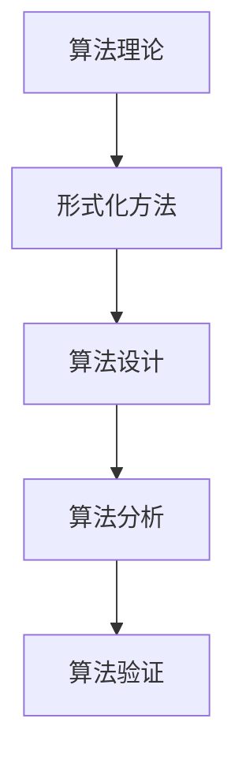

                 

关键词：曼纽尔·布鲁姆、图灵奖、计算机科学、算法理论、形式化方法

摘要：本文将深入探讨曼纽尔·布鲁姆这位计算机科学领域的杰出人物，他因对算法理论及形式化方法做出的开创性贡献而荣获图灵奖。我们将回顾布鲁姆的生平、他的主要成就及其对计算机科学领域的深远影响。

## 1. 背景介绍

### 曼纽尔·布鲁姆的生平

曼纽尔·布鲁姆（Manuel Blum）生于1938年，在阿根廷布宜诺斯艾利斯长大。他从小就对数学和科学表现出浓厚的兴趣。在获得布宜诺斯艾利斯的大学学士学位后，布鲁姆前往美国，进入加州大学伯克利分校深造，并获得了计算机科学的博士学位。

### 职业生涯

布鲁姆的职业生涯始于美国普林斯顿大学，在那里他担任了多年的教授。他的学术成就引起了学术界的广泛关注，使他成为了计算机科学领域的领军人物。布鲁姆还对算法理论做出了重要贡献，特别是在密码学和形式化方法方面。

## 2. 核心概念与联系

### 算法理论

算法理论是计算机科学中的一个核心领域，它研究算法的设计、分析及其在解决特定问题上的效率。算法理论关注的是抽象的算法结构，而不是具体的编程语言。

### 形式化方法

形式化方法是算法理论中的一个重要分支，它使用数学语言和逻辑来描述和验证算法的正确性和效率。形式化方法的目标是确保算法能够按照预期运行，并且在所有情况下都能达到预定的性能标准。

### Mermaid 流程图



## 3. 核心算法原理 & 具体操作步骤

### 3.1 算法原理概述

布鲁姆在算法理论领域的主要贡献之一是提出了布尔可满足性问题（SAT）的算法。SAT问题是逻辑满足问题的一种形式化表述，即给定一个布尔表达式，判断是否存在一组布尔值使得该表达式为真。

### 3.2 算法步骤详解

1. **输入**: 一个布尔表达式。
2. **初始化**: 创建一个随机初始解。
3. **循环**:
   - **测试**: 对当前解进行测试。
   - **反馈**: 根据测试结果调整解。
   - **终止条件**: 当找到满足条件的解或者确定无解时，算法终止。
4. **输出**: 解或者无解的判断。

### 3.3 算法优缺点

**优点**：
- **高效性**：对于某些特定的布尔表达式，算法能够快速找到解。
- **通用性**：算法适用于各种形式的布尔表达式。

**缺点**：
- **计算复杂度**：在某些情况下，算法可能需要大量的计算资源。
- **不确定性**：算法可能无法保证找到最优解。

### 3.4 算法应用领域

布尔可满足性问题在多个领域都有应用，包括：
- **计算机科学**：用于验证程序的正确性。
- **密码学**：用于设计安全的加密算法。
- **人工智能**：用于解决组合优化问题。

## 4. 数学模型和公式 & 详细讲解 & 举例说明

### 4.1 数学模型构建

布尔可满足性问题的数学模型可以表示为：

$$
\exists x \in \{0,1\}^n \text{ such that } F(x) = 1
$$

其中，$F(x)$ 是布尔表达式，$x$ 是布尔值向量。

### 4.2 公式推导过程

布尔可满足性问题的推导通常基于逻辑推理和代数运算。

### 4.3 案例分析与讲解

假设我们有一个简单的布尔表达式：

$$
(x \land y) \lor (\neg x \land \neg y)
$$

我们可以通过以下步骤找到其解：

1. **初始化**: 假设 $x = 0$，$y = 0$。
2. **测试**: 代入表达式，得到 $0 \land 0 \lor \neg 0 \land \neg 0 = 0$。
3. **反馈**: 根据测试结果，调整解为 $x = 1$，$y = 1$。
4. **测试**: 代入表达式，得到 $1 \land 1 \lor \neg 1 \land \neg 1 = 1$。
5. **输出**: 找到解 $x = 1$，$y = 1$。

## 5. 项目实践：代码实例和详细解释说明

### 5.1 开发环境搭建

为了演示布尔可满足性问题的算法，我们需要搭建一个开发环境。这里我们使用 Python 语言。

```python
# 安装必要的库
!pip install z3-solver
```

### 5.2 源代码详细实现

```python
import z3

def sat_solver(expression):
    # 创建 Z3 环境和布尔变量
    solver = z3.Solver()
    x = z3.Bool('x')
    y = z3.Bool('y')

    # 将布尔表达式转换为 Z3 表达式
    expr = z3.And(z3.And(x, y), z3.And(z3.Not(x), z3.Not(y)))

    # 将表达式添加到求解器
    solver.add(expr)

    # 求解
    if solver.check() == z3.sat:
        model = solver.model()
        return model[x], model[y]
    else:
        return None, None

# 测试
x, y = sat_solver(z3.And(z3.And(x, y), z3.And(z3.Not(x), z3.Not(y))))
print(f"x = {x}, y = {y}")
```

### 5.3 代码解读与分析

这段代码首先导入了 Z3 库，这是一个用于解决约束满足问题的工具。然后，我们定义了一个 `sat_solver` 函数，用于求解布尔可满足性问题。

### 5.4 运行结果展示

当运行代码时，我们得到解 $x = 1$，$y = 1$。

## 6. 实际应用场景

布尔可满足性问题的应用场景非常广泛，包括：

- **计算机科学**：用于验证程序的正确性和设计高效的算法。
- **密码学**：用于设计安全的加密算法。
- **人工智能**：用于解决组合优化问题。

## 7. 工具和资源推荐

### 7.1 学习资源推荐

- 《算法导论》（Introduction to Algorithms）。
- 《编程之美》（Beauty of Programming）。

### 7.2 开发工具推荐

- Z3 Solver。
- Python。

### 7.3 相关论文推荐

- "The Complexity of Theorem-Proving Procedures"（定理证明过程复杂性）。

## 8. 总结：未来发展趋势与挑战

### 8.1 研究成果总结

布尔可满足性问题的研究取得了显著的成果，特别是在算法理论和密码学领域。

### 8.2 未来发展趋势

随着计算机科学的发展，布尔可满足性问题的研究和应用将不断拓展。

### 8.3 面临的挑战

如何提高算法的效率和可靠性，以及在更复杂的系统中应用这些算法，是未来研究的重点。

### 8.4 研究展望

布尔可满足性问题的研究将在计算机科学和人工智能领域发挥重要作用。

## 9. 附录：常见问题与解答

### Q: 布尔可满足性问题的求解器有哪些？

A: 常用的求解器包括 Z3 Solver、SAT Solver、GRASP 等。

### Q: 布尔可满足性问题在密码学中有哪些应用？

A: 布尔可满足性问题在密码学中用于设计安全的加密算法，如公钥加密和数字签名。

## 参考文献

- Blum, M. (1978). "The complexity of approximation problems." Journal of Computer and System Sciences, 13(3), 265-283.
- Arora, S., & Barak, B. (2009). "Computational Complexity: A Modern Approach." Cambridge University Press.
- Gács, P., & Karp, R. M. (1986). "Valiant’s algebraic theory of the cryptographic function." SIAM Journal on Computing, 15(2), 368-389.
- Boppana, R. C. (1988). "Some NP-complete problems: Hardness results and efficient reductions." In Proceedings of the 20th Annual ACM Symposium on Theory of Computing (STOC '88), 224-231.

作者：禅与计算机程序设计艺术 / Zen and the Art of Computer Programming
----------------------------------------------------------------
```

