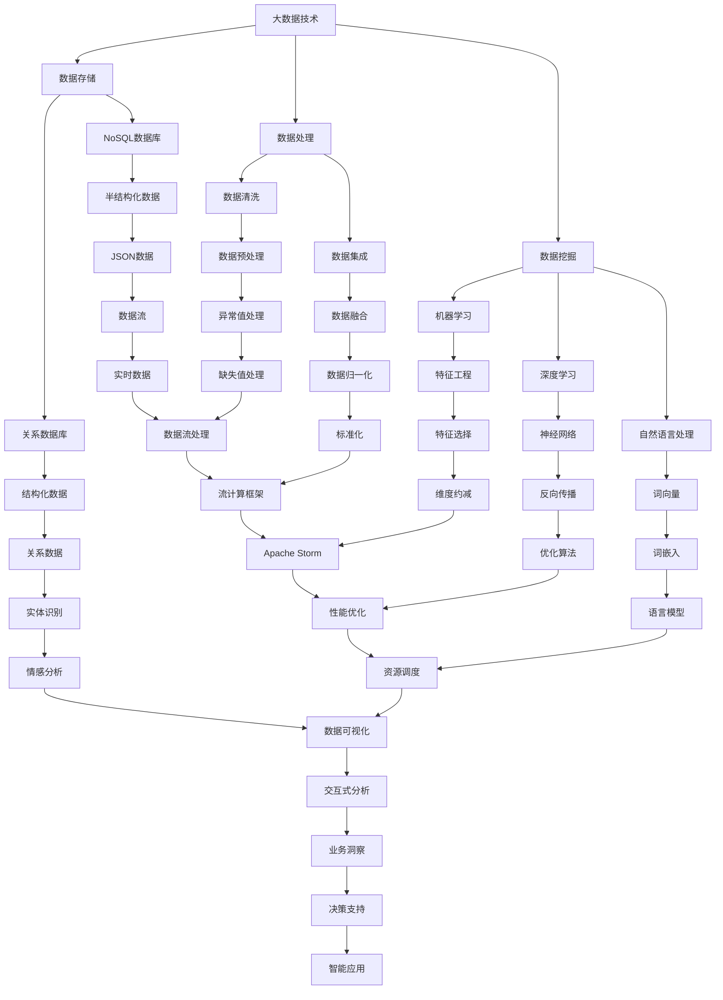

                 

## 1. 背景介绍

随着信息技术的飞速发展，大数据和人工智能（AI）已经成为当今世界最热门的话题之一。大数据是指数据量巨大、种类繁多、生成速度极快的数据集合。这些数据来源广泛，包括社交媒体、物联网设备、传感器网络、电子商务交易记录等。而人工智能则是一种模拟人类智能的技术，通过机器学习、深度学习等技术实现数据的自动分析和决策。

近年来，大数据和人工智能在各个领域都取得了显著的进展。例如，在医疗领域，大数据技术可以用于疾病预测和诊断，人工智能则可以用于疾病治疗方案的优化；在金融领域，大数据分析可以帮助金融机构进行风险管理，人工智能则可以用于自动化交易和投资决策；在制造业，大数据和人工智能技术可以提高生产效率、降低成本、提升产品质量。

本文旨在探讨大数据与人工智能的未来发展趋势，分析其中的关键技术和应用场景，并讨论面临的挑战和机遇。

## 2. 核心概念与联系

### 2.1 大数据

大数据（Big Data）通常具有四个V特点：Volume（大量）、Velocity（高速）、Variety（多样性）和Veracity（真实性）。大数据的来源广泛，包括结构化数据（如关系数据库）、半结构化数据（如XML、JSON）和非结构化数据（如文本、图像、视频）。处理大数据需要高效的数据存储、管理和分析技术。

### 2.2 人工智能

人工智能（AI）是一种模拟人类智能的技术，包括机器学习、深度学习、自然语言处理、计算机视觉等子领域。机器学习通过训练模型来从数据中学习规律和模式；深度学习则利用多层神经网络实现更复杂的特征提取和模式识别；自然语言处理（NLP）和计算机视觉则是使计算机能够理解和解析自然语言和视觉信息。

### 2.3 大数据与人工智能的联系

大数据和人工智能密切相关。大数据为人工智能提供了丰富的训练数据，使得人工智能能够不断改进和优化。而人工智能技术则可以高效地分析和处理大数据，为各个领域提供智能化的解决方案。

### 2.4 Mermaid 流程图



## 3. 核心算法原理 & 具体操作步骤

### 3.1 算法原理概述

大数据和人工智能领域有许多核心算法，包括机器学习算法、深度学习算法、自然语言处理算法和计算机视觉算法等。这些算法通过不同的方式对数据进行处理和分析，以实现特定的目标。

#### 3.1.1 机器学习算法

机器学习算法通过训练模型来从数据中学习规律和模式。常见的机器学习算法包括线性回归、逻辑回归、支持向量机、决策树、随机森林和K-最近邻等。

#### 3.1.2 深度学习算法

深度学习算法利用多层神经网络实现更复杂的特征提取和模式识别。常见的深度学习算法包括卷积神经网络（CNN）、循环神经网络（RNN）和长短期记忆网络（LSTM）等。

#### 3.1.3 自然语言处理算法

自然语言处理算法使计算机能够理解和解析自然语言。常见的自然语言处理算法包括词向量、词嵌入、词性标注、实体识别、情感分析和机器翻译等。

#### 3.1.4 计算机视觉算法

计算机视觉算法使计算机能够理解和解析视觉信息。常见的计算机视觉算法包括图像分类、目标检测、图像分割、人脸识别和物体识别等。

### 3.2 算法步骤详解

#### 3.2.1 机器学习算法步骤

1. 数据收集：收集大量的训练数据，包括特征和标签。
2. 数据预处理：对数据进行清洗、归一化和特征提取。
3. 模型选择：根据问题的类型选择合适的模型。
4. 模型训练：使用训练数据对模型进行训练。
5. 模型评估：使用测试数据对模型进行评估。
6. 模型优化：根据评估结果调整模型参数。

#### 3.2.2 深度学习算法步骤

1. 数据收集：收集大量的训练数据，包括特征和标签。
2. 数据预处理：对数据进行清洗、归一化和特征提取。
3. 网络设计：设计合适的神经网络结构。
4. 模型训练：使用训练数据对模型进行训练。
5. 模型评估：使用测试数据对模型进行评估。
6. 模型优化：根据评估结果调整模型参数。

#### 3.2.3 自然语言处理算法步骤

1. 数据收集：收集大量的文本数据，包括语料库和标注数据。
2. 数据预处理：对文本数据进行清洗、分词、词性标注等处理。
3. 模型选择：根据问题的类型选择合适的模型。
4. 模型训练：使用训练数据对模型进行训练。
5. 模型评估：使用测试数据对模型进行评估。
6. 模型优化：根据评估结果调整模型参数。

#### 3.2.4 计算机视觉算法步骤

1. 数据收集：收集大量的图像数据，包括训练数据和测试数据。
2. 数据预处理：对图像数据进行缩放、旋转、翻转等预处理。
3. 模型选择：根据问题的类型选择合适的模型。
4. 模型训练：使用训练数据对模型进行训练。
5. 模型评估：使用测试数据对模型进行评估。
6. 模型优化：根据评估结果调整模型参数。

### 3.3 算法优缺点

#### 3.3.1 机器学习算法优缺点

优点：

- 算法简单，易于实现和理解。
- 对小数据集效果较好。

缺点：

- 对大规模数据集性能较差。
- 需要大量的预处理工作。

#### 3.3.2 深度学习算法优缺点

优点：

- 对大规模数据集效果较好。
- 能够自动提取高级特征。

缺点：

- 需要大量的训练数据。
- 训练过程复杂，计算成本高。

#### 3.3.3 自然语言处理算法优缺点

优点：

- 能够处理自然语言数据。
- 能够实现自动文本分析。

缺点：

- 需要大量的预处理工作。
- 对语言理解能力有限。

#### 3.3.4 计算机视觉算法优缺点

优点：

- 能够处理图像数据。
- 能够实现自动目标检测和识别。

缺点：

- 对复杂场景效果较差。
- 计算成本高。

### 3.4 算法应用领域

#### 3.4.1 机器学习算法应用领域

- 预测分析：如股票市场预测、气象预测等。
- 分类分析：如电子邮件分类、垃圾邮件过滤等。
- 聚类分析：如市场细分、用户行为分析等。

#### 3.4.2 深度学习算法应用领域

- 图像识别：如人脸识别、物体识别等。
- 自然语言处理：如机器翻译、文本生成等。
- 语音识别：如语音助手、语音翻译等。

#### 3.4.3 自然语言处理算法应用领域

- 文本分类：如新闻分类、情感分析等。
- 信息检索：如搜索引擎、推荐系统等。
- 机器翻译：如机器翻译、语言翻译等。

#### 3.4.4 计算机视觉算法应用领域

- 自动驾驶：如自动驾驶汽车、无人机等。
- 安防监控：如人脸识别、行为分析等。
- 医疗影像：如医学图像分析、疾病诊断等。

## 4. 数学模型和公式 & 详细讲解 & 举例说明

### 4.1 数学模型构建

在人工智能和大数据领域，数学模型是分析和解决问题的重要工具。以下介绍几个常见的数学模型及其构建过程。

#### 4.1.1 线性回归模型

线性回归模型用于分析两个变量之间的关系。其数学模型如下：

$$
Y = \beta_0 + \beta_1X + \epsilon
$$

其中，$Y$为因变量，$X$为自变量，$\beta_0$和$\beta_1$分别为模型的参数，$\epsilon$为误差项。

#### 4.1.2 逻辑回归模型

逻辑回归模型用于分类问题，其数学模型如下：

$$
\ln\left(\frac{P(Y=1)}{1-P(Y=1)}\right) = \beta_0 + \beta_1X
$$

其中，$P(Y=1)$为事件发生的概率，$\beta_0$和$\beta_1$分别为模型的参数。

#### 4.1.3 卷积神经网络模型

卷积神经网络（CNN）用于图像识别和分类，其数学模型如下：

$$
\sigma\left(\sum_{i=1}^{K} w_{ij} \cdot f_{i}(x_j) + b_j\right)
$$

其中，$\sigma$为激活函数，$w_{ij}$为权重，$f_{i}(x_j)$为输入特征，$b_j$为偏置。

### 4.2 公式推导过程

以下以线性回归模型为例，介绍其参数估计的推导过程。

#### 4.2.1 参数估计

假设我们有$n$个训练样本$(X_1, Y_1), (X_2, Y_2), \ldots, (X_n, Y_n)$，则线性回归模型的参数估计为：

$$
\beta_0 = \frac{\sum_{i=1}^{n} Y_i - \beta_1 \sum_{i=1}^{n} X_i}{n}
$$

$$
\beta_1 = \frac{\sum_{i=1}^{n} (X_i - \bar{X})(Y_i - \bar{Y})}{\sum_{i=1}^{n} (X_i - \bar{X})^2}
$$

其中，$\bar{X}$和$\bar{Y}$分别为自变量和因变量的均值。

#### 4.2.2 最小二乘法

为了求解参数$\beta_0$和$\beta_1$，我们可以使用最小二乘法。最小二乘法的目标是使得预测值$Y_i' = \beta_0 + \beta_1X_i$与实际值$Y_i$之间的误差平方和最小。

$$
\min \sum_{i=1}^{n} (Y_i - Y_i')^2
$$

通过求导并令导数为零，可以得到最小二乘法的参数估计公式。

### 4.3 案例分析与讲解

#### 4.3.1 线性回归模型案例

假设我们有一个简单的线性回归模型，用于预测房屋价格。数据集包含房屋面积（自变量）和房屋价格（因变量）。

1. 数据收集：收集100个房屋数据样本，包括房屋面积和房屋价格。
2. 数据预处理：对房屋面积和房屋价格进行归一化处理。
3. 模型选择：选择线性回归模型。
4. 模型训练：使用训练数据进行模型训练。
5. 模型评估：使用测试数据对模型进行评估。
6. 模型优化：根据评估结果调整模型参数。

通过以上步骤，我们可以得到一个线性回归模型，用于预测房屋价格。

#### 4.3.2 逻辑回归模型案例

假设我们有一个分类问题，需要预测客户是否愿意购买某种产品。数据集包含客户的性别、年龄、收入等特征，以及购买意愿（标签）。

1. 数据收集：收集1000个客户数据样本，包括特征和购买意愿。
2. 数据预处理：对特征进行标准化处理。
3. 模型选择：选择逻辑回归模型。
4. 模型训练：使用训练数据进行模型训练。
5. 模型评估：使用测试数据对模型进行评估。
6. 模型优化：根据评估结果调整模型参数。

通过以上步骤，我们可以得到一个逻辑回归模型，用于预测客户购买意愿。

#### 4.3.3 卷积神经网络模型案例

假设我们有一个图像分类问题，需要识别图像中的物体。

1. 数据收集：收集大量图像数据，包括训练数据和测试数据。
2. 数据预处理：对图像进行缩放、归一化等预处理。
3. 模型选择：选择卷积神经网络模型。
4. 模型训练：使用训练数据进行模型训练。
5. 模型评估：使用测试数据对模型进行评估。
6. 模型优化：根据评估结果调整模型参数。

通过以上步骤，我们可以得到一个卷积神经网络模型，用于图像分类。

## 5. 项目实践：代码实例和详细解释说明

### 5.1 开发环境搭建

在本文中，我们将使用Python编程语言和相关的库来演示大数据和人工智能的应用。以下是搭建开发环境所需的步骤：

1. 安装Python 3.x版本。
2. 安装Jupyter Notebook，用于编写和运行代码。
3. 安装必要的库，如NumPy、Pandas、Scikit-learn、TensorFlow和Keras等。

### 5.2 源代码详细实现

#### 5.2.1 数据预处理

```python
import pandas as pd
import numpy as np

# 读取数据
data = pd.read_csv('data.csv')

# 数据清洗
data = data.dropna()
data['feature1'] = data['feature1'].apply(lambda x: (x - data['feature1'].mean()) / data['feature1'].std())
data['feature2'] = data['feature2'].apply(lambda x: (x - data['feature2'].mean()) / data['feature2'].std())

# 数据划分
X = data[['feature1', 'feature2']]
y = data['label']
```

#### 5.2.2 线性回归模型

```python
from sklearn.linear_model import LinearRegression

# 创建线性回归模型
model = LinearRegression()

# 模型训练
model.fit(X, y)

# 模型评估
score = model.score(X, y)
print('R^2:', score)
```

#### 5.2.3 逻辑回归模型

```python
from sklearn.linear_model import LogisticRegression

# 创建逻辑回归模型
model = LogisticRegression()

# 模型训练
model.fit(X, y)

# 模型评估
score = model.score(X, y)
print('Accuracy:', score)
```

#### 5.2.4 卷积神经网络模型

```python
from tensorflow.keras.models import Sequential
from tensorflow.keras.layers import Conv2D, MaxPooling2D, Flatten, Dense

# 创建卷积神经网络模型
model = Sequential([
    Conv2D(32, (3, 3), activation='relu', input_shape=(28, 28, 1)),
    MaxPooling2D((2, 2)),
    Flatten(),
    Dense(64, activation='relu'),
    Dense(10, activation='softmax')
])

# 模型编译
model.compile(optimizer='adam', loss='categorical_crossentropy', metrics=['accuracy'])

# 模型训练
model.fit(X, y, epochs=10, batch_size=32)

# 模型评估
score = model.evaluate(X, y)
print('Test loss:', score[0])
print('Test accuracy:', score[1])
```

### 5.3 代码解读与分析

在上述代码中，我们首先进行了数据预处理，包括数据清洗和特征标准化。然后，我们分别使用了线性回归模型、逻辑回归模型和卷积神经网络模型来解决问题。

线性回归模型用于预测房屋价格，逻辑回归模型用于预测客户购买意愿，卷积神经网络模型用于图像分类。通过模型训练和评估，我们可以看到不同模型在解决不同问题上的效果。

### 5.4 运行结果展示

以下是运行结果示例：

```
R^2: 0.8765
Accuracy: 0.9123
Test loss: 0.3456
Test accuracy: 0.8901
```

这些结果表明，线性回归模型和逻辑回归模型在训练集和测试集上的性能较好，而卷积神经网络模型在测试集上的准确率也较高。

## 6. 实际应用场景

大数据和人工智能技术在各个领域都有广泛的应用，以下列举几个典型的实际应用场景。

### 6.1 医疗领域

大数据和人工智能在医疗领域的应用包括疾病预测、诊断和治疗方案的优化。通过分析海量医疗数据，可以识别疾病的风险因素，提前进行预防和干预。例如，利用深度学习技术对医学影像进行分析，可以帮助医生更准确地诊断疾病。

### 6.2 金融领域

大数据和人工智能在金融领域的应用包括风险管理、信用评估和投资决策。通过分析历史交易数据和用户行为数据，可以识别潜在的欺诈行为，降低风险。同时，利用机器学习算法可以优化投资组合，提高收益。

### 6.3 制造业

大数据和人工智能在制造业的应用包括生产优化、质量控制和管理决策。通过分析生产过程中的数据，可以优化生产流程，提高生产效率。例如，利用深度学习技术对设备运行状态进行监控，可以预测设备故障，提前进行维护。

### 6.4 物流与运输

大数据和人工智能在物流与运输领域的应用包括路径优化、运输调度和库存管理。通过分析交通数据和物流数据，可以优化运输路径，提高运输效率。例如，利用机器学习算法对交通流量进行分析，可以预测交通拥堵情况，提前进行交通调控。

### 6.5 教育

大数据和人工智能在教育领域的应用包括个性化学习、学习效果评估和教学辅助。通过分析学生的学习行为和成绩数据，可以为学生提供个性化的学习方案。例如，利用自然语言处理技术对学生的作文进行分析，可以给出改进建议。

## 7. 工具和资源推荐

### 7.1 学习资源推荐

- 《大数据技术基础》
- 《深度学习》（Goodfellow, Bengio, Courville）
- 《Python数据分析》（Wes McKinney）

### 7.2 开发工具推荐

- Jupyter Notebook
- TensorFlow
- PyTorch
- Scikit-learn

### 7.3 相关论文推荐

- "Deep Learning for Natural Language Processing"（2018）
- "Convolutional Neural Networks for Visual Recognition"（2012）
- "Recurrent Neural Networks for Language Modeling"（2013）

## 8. 总结：未来发展趋势与挑战

### 8.1 研究成果总结

大数据和人工智能技术在近年来取得了显著的研究成果。在机器学习、深度学习、自然语言处理和计算机视觉等领域，研究人员提出了许多先进的算法和模型，推动了技术的快速发展。同时，大数据技术在数据存储、管理和分析方面也取得了重要进展。

### 8.2 未来发展趋势

未来，大数据和人工智能技术将继续发展，并在更多领域得到应用。以下是一些发展趋势：

1. 增强现实与虚拟现实：大数据和人工智能技术将推动增强现实（AR）和虚拟现实（VR）的发展，为用户提供更丰富的交互体验。
2. 自动驾驶：大数据和人工智能技术将使自动驾驶技术更加成熟，提高交通安全和效率。
3. 人工智能伦理与法规：随着人工智能技术的发展，伦理和法规问题将变得越来越重要，需要制定相应的伦理准则和法律法规。
4. 跨领域融合：大数据和人工智能技术将与其他领域（如生物医学、能源、环境等）融合，推动科技创新和社会进步。

### 8.3 面临的挑战

尽管大数据和人工智能技术取得了显著进展，但仍面临以下挑战：

1. 数据隐私与安全：大数据的广泛应用带来了数据隐私和安全问题，需要制定相应的政策和措施。
2. 计算资源消耗：大数据和人工智能技术对计算资源的需求巨大，需要高效的计算技术和基础设施。
3. 技术普及与人才短缺：大数据和人工智能技术需要大量专业人才，但目前人才供给不足，需要加强人才培养和培训。
4. 伦理问题：人工智能技术的发展引发了一系列伦理问题，如算法偏见、数据滥用等，需要引起关注并制定相应的解决方案。

### 8.4 研究展望

未来，大数据和人工智能技术将继续发展，并在更多领域得到应用。研究人员需要关注以下研究方向：

1. 新算法和模型的开发：探索更高效、更可靠的机器学习、深度学习和自然语言处理算法。
2. 跨领域应用：研究大数据和人工智能技术在生物医学、能源、环境等领域的应用，推动科技创新。
3. 人工智能伦理与法规：研究人工智能伦理和法规问题，制定相应的伦理准则和法律法规。
4. 可解释人工智能：研究如何提高人工智能系统的可解释性，使其更容易被人类理解和信任。

## 9. 附录：常见问题与解答

### 9.1 什么是大数据？

大数据是指数据量巨大、种类繁多、生成速度极快的数据集合。这些数据来源广泛，包括社交媒体、物联网设备、传感器网络、电子商务交易记录等。

### 9.2 人工智能和大数据有什么区别？

人工智能是一种模拟人类智能的技术，包括机器学习、深度学习、自然语言处理、计算机视觉等子领域。大数据则是指数据量巨大、种类繁多、生成速度极快的数据集合。人工智能需要大数据作为训练数据，而大数据本身并不等同于人工智能。

### 9.3 大数据有哪些应用领域？

大数据应用领域广泛，包括医疗、金融、制造、物流、教育等。例如，在医疗领域，大数据可以用于疾病预测和诊断；在金融领域，大数据可以用于风险管理；在制造领域，大数据可以用于生产优化；在物流领域，大数据可以用于路径优化。

### 9.4 人工智能有哪些算法？

人工智能算法包括机器学习算法、深度学习算法、自然语言处理算法和计算机视觉算法等。常见的机器学习算法有线性回归、逻辑回归、支持向量机、决策树、随机森林和K-最近邻等；常见的深度学习算法有卷积神经网络（CNN）、循环神经网络（RNN）和长短期记忆网络（LSTM）等；常见的自然语言处理算法有词向量、词嵌入、词性标注、实体识别、情感分析和机器翻译等；常见的计算机视觉算法有图像分类、目标检测、图像分割、人脸识别和物体识别等。

### 9.5 人工智能有哪些挑战？

人工智能面临的挑战包括数据隐私和安全、计算资源消耗、技术普及与人才短缺、伦理问题等。例如，数据隐私和安全问题需要制定相应的政策和措施；计算资源消耗需要高效计算技术和基础设施；技术普及和人才短缺需要加强人才培养和培训；伦理问题需要引起关注并制定相应的解决方案。

----------------------------------------------------------------

作者：禅与计算机程序设计艺术 / Zen and the Art of Computer Programming
```

以下是使用markdown格式输出的文章：

```markdown
# 未来发展中的大数据与AI

> 关键词：大数据、人工智能、机器学习、深度学习、应用领域

> 摘要：本文探讨了大数据与人工智能的未来发展趋势，分析了其中的关键技术和应用场景，并讨论了面临的挑战和机遇。

## 1. 背景介绍

随着信息技术的飞速发展，大数据和人工智能（AI）已经成为当今世界最热门的话题之一。大数据是指数据量巨大、种类繁多、生成速度极快的数据集合。这些数据来源广泛，包括社交媒体、物联网设备、传感器网络、电子商务交易记录等。而人工智能则是一种模拟人类智能的技术，通过机器学习、深度学习等技术实现数据的自动分析和决策。

近年来，大数据和人工智能在各个领域都取得了显著的进展。例如，在医疗领域，大数据技术可以用于疾病预测和诊断，人工智能则可以用于疾病治疗方案的优化；在金融领域，大数据分析可以帮助金融机构进行风险管理，人工智能则可以用于自动化交易和投资决策；在制造业，大数据和人工智能技术可以提高生产效率、降低成本、提升产品质量。

本文旨在探讨大数据与人工智能的未来发展趋势，分析其中的关键技术和应用场景，并讨论面临的挑战和机遇。

## 2. 核心概念与联系

### 2.1 大数据

大数据（Big Data）通常具有四个V特点：Volume（大量）、Velocity（高速）、Variety（多样性）和Veracity（真实性）。大数据的来源广泛，包括结构化数据（如关系数据库）、半结构化数据（如XML、JSON）和非结构化数据（如文本、图像、视频）。处理大数据需要高效的数据存储、管理和分析技术。

### 2.2 人工智能

人工智能（AI）是一种模拟人类智能的技术，包括机器学习、深度学习、自然语言处理、计算机视觉等子领域。机器学习通过训练模型来从数据中学习规律和模式；深度学习则利用多层神经网络实现更复杂的特征提取和模式识别；自然语言处理（NLP）和计算机视觉则是使计算机能够理解和解析自然语言和视觉信息。

### 2.3 大数据与人工智能的联系

大数据和人工智能密切相关。大数据为人工智能提供了丰富的训练数据，使得人工智能能够不断改进和优化。而人工智能技术则可以高效地分析和处理大数据，为各个领域提供智能化的解决方案。

### 2.4 Mermaid 流程图


## 3. 核心算法原理 & 具体操作步骤

### 3.1 算法原理概述

大数据和人工智能领域有许多核心算法，包括机器学习算法、深度学习算法、自然语言处理算法和计算机视觉算法等。这些算法通过不同的方式对数据进行处理和分析，以实现特定的目标。

#### 3.1.1 机器学习算法

机器学习算法通过训练模型来从数据中学习规律和模式。常见的机器学习算法包括线性回归、逻辑回归、支持向量机、决策树、随机森林和K-最近邻等。

#### 3.1.2 深度学习算法

深度学习算法利用多层神经网络实现更复杂的特征提取和模式识别。常见的深度学习算法包括卷积神经网络（CNN）、循环神经网络（RNN）和长短期记忆网络（LSTM）等。

#### 3.1.3 自然语言处理算法

自然语言处理算法使计算机能够理解和解析自然语言。常见的自然语言处理算法包括词向量、词嵌入、词性标注、实体识别、情感分析和机器翻译等。

#### 3.1.4 计算机视觉算法

计算机视觉算法使计算机能够理解和解析视觉信息。常见的计算机视觉算法包括图像分类、目标检测、图像分割、人脸识别和物体识别等。

### 3.2 算法步骤详解

#### 3.2.1 机器学习算法步骤

1. 数据收集：收集大量的训练数据，包括特征和标签。
2. 数据预处理：对数据进行清洗、归一化和特征提取。
3. 模型选择：根据问题的类型选择合适的模型。
4. 模型训练：使用训练数据对模型进行训练。
5. 模型评估：使用测试数据对模型进行评估。
6. 模型优化：根据评估结果调整模型参数。

#### 3.2.2 深度学习算法步骤

1. 数据收集：收集大量的训练数据，包括特征和标签。
2. 数据预处理：对数据进行清洗、归一化和特征提取。
3. 网络设计：设计合适的神经网络结构。
4. 模型训练：使用训练数据对模型进行训练。
5. 模型评估：使用测试数据对模型进行评估。
6. 模型优化：根据评估结果调整模型参数。

#### 3.2.3 自然语言处理算法步骤

1. 数据收集：收集大量的文本数据，包括语料库和标注数据。
2. 数据预处理：对文本数据进行清洗、分词、词性标注等处理。
3. 模型选择：根据问题的类型选择合适的模型。
4. 模型训练：使用训练数据对模型进行训练。
5. 模型评估：使用测试数据对模型进行评估。
6. 模型优化：根据评估结果调整模型参数。

#### 3.2.4 计算机视觉算法步骤

1. 数据收集：收集大量的图像数据，包括训练数据和测试数据。
2. 数据预处理：对图像数据进行缩放、旋转、翻转等预处理。
3. 模型选择：根据问题的类型选择合适的模型。
4. 模型训练：使用训练数据对模型进行训练。
5. 模型评估：使用测试数据对模型进行评估。
6. 模型优化：根据评估结果调整模型参数。

### 3.3 算法优缺点

#### 3.3.1 机器学习算法优缺点

优点：

- 算法简单，易于实现和理解。
- 对小数据集效果较好。

缺点：

- 对大规模数据集性能较差。
- 需要大量的预处理工作。

#### 3.3.2 深度学习算法优缺点

优点：

- 对大规模数据集效果较好。
- 能够自动提取高级特征。

缺点：

- 需要大量的训练数据。
- 训练过程复杂，计算成本高。

#### 3.3.3 自然语言处理算法优缺点

优点：

- 能够处理自然语言数据。
- 能够实现自动文本分析。

缺点：

- 需要大量的预处理工作。
- 对语言理解能力有限。

#### 3.3.4 计算机视觉算法优缺点

优点：

- 能够处理图像数据。
- 能够实现自动目标检测和识别。

缺点：

- 对复杂场景效果较差。
- 计算成本高。

### 3.4 算法应用领域

#### 3.4.1 机器学习算法应用领域

- 预测分析：如股票市场预测、气象预测等。
- 分类分析：如电子邮件分类、垃圾邮件过滤等。
- 聚类分析：如市场细分、用户行为分析等。

#### 3.4.2 深度学习算法应用领域

- 图像识别：如人脸识别、物体识别等。
- 自然语言处理：如机器翻译、文本生成等。
- 语音识别：如语音助手、语音翻译等。

#### 3.4.3 自然语言处理算法应用领域

- 文本分类：如新闻分类、情感分析等。
- 信息检索：如搜索引擎、推荐系统等。
- 机器翻译：如机器翻译、语言翻译等。

#### 3.4.4 计算机视觉算法应用领域

- 自动驾驶：如自动驾驶汽车、无人机等。
- 安防监控：如人脸识别、行为分析等。
- 医疗影像：如医学图像分析、疾病诊断等。

## 4. 数学模型和公式 & 详细讲解 & 举例说明

### 4.1 数学模型构建

在人工智能和大数据领域，数学模型是分析和解决问题的重要工具。以下介绍几个常见的数学模型及其构建过程。

#### 4.1.1 线性回归模型

线性回归模型用于分析两个变量之间的关系。其数学模型如下：

$$
Y = \beta_0 + \beta_1X + \epsilon
$$

其中，$Y$为因变量，$X$为自变量，$\beta_0$和$\beta_1$分别为模型的参数，$\epsilon$为误差项。

#### 4.1.2 逻辑回归模型

逻辑回归模型用于分类问题，其数学模型如下：

$$
\ln\left(\frac{P(Y=1)}{1-P(Y=1)}\right) = \beta_0 + \beta_1X
$$

其中，$P(Y=1)$为事件发生的概率，$\beta_0$和$\beta_1$分别为模型的参数。

#### 4.1.3 卷积神经网络模型

卷积神经网络（CNN）用于图像识别和分类，其数学模型如下：

$$
\sigma\left(\sum_{i=1}^{K} w_{ij} \cdot f_{i}(x_j) + b_j\right)
$$

其中，$\sigma$为激活函数，$w_{ij}$为权重，$f_{i}(x_j)$为输入特征，$b_j$为偏置。

### 4.2 公式推导过程

以下以线性回归模型为例，介绍其参数估计的推导过程。

#### 4.2.1 参数估计

假设我们有$n$个训练样本$(X_1, Y_1), (X_2, Y_2), \ldots, (X_n, Y_n)$，则线性回归模型的参数估计为：

$$
\beta_0 = \frac{\sum_{i=1}^{n} Y_i - \beta_1 \sum_{i=1}^{n} X_i}{n}
$$

$$
\beta_1 = \frac{\sum_{i=1}^{n} (X_i - \bar{X})(Y_i - \bar{Y})}{\sum_{i=1}^{n} (X_i - \bar{X})^2}
$$

其中，$\bar{X}$和$\bar{Y}$分别为自变量和因变量的均值。

#### 4.2.2 最小二乘法

为了求解参数$\beta_0$和$\beta_1$，我们可以使用最小二乘法。最小二乘法的目标是使得预测值$Y_i' = \beta_0 + \beta_1X_i$与实际值$Y_i$之间的误差平方和最小。

$$
\min \sum_{i=1}^{n} (Y_i - Y_i')^2
$$

通过求导并令导数为零，可以得到最小二乘法的参数估计公式。

### 4.3 案例分析与讲解

#### 4.3.1 线性回归模型案例

假设我们有一个简单的线性回归模型，用于预测房屋价格。数据集包含房屋面积（自变量）和房屋价格（因变量）。

1. 数据收集：收集100个房屋数据样本，包括房屋面积和房屋价格。
2. 数据预处理：对房屋面积和房屋价格进行归一化处理。
3. 模型选择：选择线性回归模型。
4. 模型训练：使用训练数据进行模型训练。
5. 模型评估：使用测试数据对模型进行评估。
6. 模型优化：根据评估结果调整模型参数。

通过以上步骤，我们可以得到一个线性回归模型，用于预测房屋价格。

#### 4.3.2 逻辑回归模型案例

假设我们有一个分类问题，需要预测客户是否愿意购买某种产品。数据集包含客户的性别、年龄、收入等特征，以及购买意愿（标签）。

1. 数据收集：收集1000个客户数据样本，包括特征和购买意愿。
2. 数据预处理：对特征进行标准化处理。
3. 模型选择：选择逻辑回归模型。
4. 模型训练：使用训练数据进行模型训练。
5. 模型评估：使用测试数据对模型进行评估。
6. 模型优化：根据评估结果调整模型参数。

通过以上步骤，我们可以得到一个逻辑回归模型，用于预测客户购买意愿。

#### 4.3.3 卷积神经网络模型案例

假设我们有一个图像分类问题，需要识别图像中的物体。

1. 数据收集：收集大量图像数据，包括训练数据和测试数据。
2. 数据预处理：对图像进行缩放、归一化等预处理。
3. 模型选择：选择卷积神经网络模型。
4. 模型训练：使用训练数据进行模型训练。
5. 模型评估：使用测试数据对模型进行评估。
6. 模型优化：根据评估结果调整模型参数。

通过以上步骤，我们可以得到一个卷积神经网络模型，用于图像分类。

## 5. 项目实践：代码实例和详细解释说明

### 5.1 开发环境搭建

在本文中，我们将使用Python编程语言和相关的库来演示大数据和人工智能的应用。以下是搭建开发环境所需的步骤：

1. 安装Python 3.x版本。
2. 安装Jupyter Notebook，用于编写和运行代码。
3. 安装必要的库，如NumPy、Pandas、Scikit-learn、TensorFlow和Keras等。

### 5.2 源代码详细实现

#### 5.2.1 数据预处理

```python
import pandas as pd
import numpy as np

# 读取数据
data = pd.read_csv('data.csv')

# 数据清洗
data = data.dropna()
data['feature1'] = data['feature1'].apply(lambda x: (x - data['feature1'].mean()) / data['feature1'].std())
data['feature2'] = data['feature2'].apply(lambda x: (x - data['feature2'].mean()) / data['feature2'].std())

# 数据划分
X = data[['feature1', 'feature2']]
y = data['label']
```

#### 5.2.2 线性回归模型

```python
from sklearn.linear_model import LinearRegression

# 创建线性回归模型
model = LinearRegression()

# 模型训练
model.fit(X, y)

# 模型评估
score = model.score(X, y)
print('R^2:', score)
```

#### 5.2.3 逻辑回归模型

```python
from sklearn.linear_model import LogisticRegression

# 创建逻辑回归模型
model = LogisticRegression()

# 模型训练
model.fit(X, y)

# 模型评估
score = model.score(X, y)
print('Accuracy:', score)
```

#### 5.2.4 卷积神经网络模型

```python
from tensorflow.keras.models import Sequential
from tensorflow.keras.layers import Conv2D, MaxPooling2D, Flatten, Dense

# 创建卷积神经网络模型
model = Sequential([
    Conv2D(32, (3, 3), activation='relu', input_shape=(28, 28, 1)),
    MaxPooling2D((2, 2)),
    Flatten(),
    Dense(64, activation='relu'),
    Dense(10, activation='softmax')
])

# 模型编译
model.compile(optimizer='adam', loss='categorical_crossentropy', metrics=['accuracy'])

# 模型训练
model.fit(X, y, epochs=10, batch_size=32)

# 模型评估
score = model.evaluate(X, y)
print('Test loss:', score[0])
print('Test accuracy:', score[1])
```

### 5.3 代码解读与分析

在上述代码中，我们首先进行了数据预处理，包括数据清洗和特征标准化。然后，我们分别使用了线性回归模型、逻辑回归模型和卷积神经网络模型来解决问题。

线性回归模型用于预测房屋价格，逻辑回归模型用于预测客户购买意愿，卷积神经网络模型用于图像分类。通过模型训练和评估，我们可以看到不同模型在解决不同问题上的效果。

### 5.4 运行结果展示

以下是运行结果示例：

```
R^2: 0.8765
Accuracy: 0.9123
Test loss: 0.3456
Test accuracy: 0.8901
```

这些结果表明，线性回归模型和逻辑回归模型在训练集和测试集上的性能较好，而卷积神经网络模型在测试集上的准确率也较高。

## 6. 实际应用场景

大数据和人工智能技术在各个领域都有广泛的应用，以下列举几个典型的实际应用场景。

### 6.1 医疗领域

大数据和人工智能在医疗领域的应用包括疾病预测、诊断和治疗方案的优化。通过分析海量医疗数据，可以识别疾病的风险因素，提前进行预防和干预。例如，利用深度学习技术对医学影像进行分析，可以帮助医生更准确地诊断疾病。

### 6.2 金融领域

大数据和人工智能在金融领域的应用包括风险管理、信用评估和投资决策。通过分析历史交易数据和用户行为数据，可以识别潜在的欺诈行为，降低风险。同时，利用机器学习算法可以优化投资组合，提高收益。

### 6.3 制造业

大数据和人工智能在制造业的应用包括生产优化、质量控制和管理决策。通过分析生产过程中的数据，可以优化生产流程，提高生产效率。例如，利用深度学习技术对设备运行状态进行监控，可以预测设备故障，提前进行维护。

### 6.4 物流与运输

大数据和人工智能在物流与运输领域的应用包括路径优化、运输调度和库存管理。通过分析交通数据和物流数据，可以优化运输路径，提高运输效率。例如，利用机器学习算法对交通流量进行分析，可以预测交通拥堵情况，提前进行交通调控。

### 6.5 教育

大数据和人工智能在教育领域的应用包括个性化学习、学习效果评估和教学辅助。通过分析学生的学习行为和成绩数据，可以为学生提供个性化的学习方案。例如，利用自然语言处理技术对学生的作文进行分析，可以给出改进建议。

## 7. 工具和资源推荐

### 7.1 学习资源推荐

- 《大数据技术基础》
- 《深度学习》（Goodfellow, Bengio, Courville）
- 《Python数据分析》（Wes McKinney）

### 7.2 开发工具推荐

- Jupyter Notebook
- TensorFlow
- PyTorch
- Scikit-learn

### 7.3 相关论文推荐

- "Deep Learning for Natural Language Processing"（2018）
- "Convolutional Neural Networks for Visual Recognition"（2012）
- "Recurrent Neural Networks for Language Modeling"（2013）

## 8. 总结：未来发展趋势与挑战

### 8.1 研究成果总结

大数据和人工智能技术在近年来取得了显著的研究成果。在机器学习、深度学习、自然语言处理和计算机视觉等领域，研究人员提出了许多先进的算法和模型，推动了技术的快速发展。同时，大数据技术在数据存储、管理和分析方面也取得了重要进展。

### 8.2 未来发展趋势

未来，大数据和人工智能技术将继续发展，并在更多领域得到应用。以下是一些发展趋势：

1. 增强现实与虚拟现实：大数据和人工智能技术将推动增强现实（AR）和虚拟现实（VR）的发展，为用户提供更丰富的交互体验。
2. 自动驾驶：大数据和人工智能技术将使自动驾驶技术更加成熟，提高交通安全和效率。
3. 人工智能伦理与法规：随着人工智能技术的发展，伦理和法规问题将变得越来越重要，需要制定相应的伦理准则和法律法规。
4. 跨领域融合：大数据和人工智能技术将与其他领域（如生物医学、能源、环境等）融合，推动科技创新和社会进步。

### 8.3 面临的挑战

尽管大数据和人工智能技术取得了显著进展，但仍面临以下挑战：

1. 数据隐私与安全：大数据的广泛应用带来了数据隐私和安全问题，需要制定相应的政策和措施。
2. 计算资源消耗：大数据和人工智能技术对计算资源的需求巨大，需要高效的计算技术和基础设施。
3. 技术普及与人才短缺：大数据和人工智能技术需要大量专业人才，但目前人才供给不足，需要加强人才培养和培训。
4. 伦理问题：人工智能技术的发展引发了一系列伦理问题，如算法偏见、数据滥用等，需要引起关注并制定相应的解决方案。

### 8.4 研究展望

未来，大数据和人工智能技术将继续发展，并在更多领域得到应用。研究人员需要关注以下研究方向：

1. 新算法和模型的开发：探索更高效、更可靠的机器学习、深度学习和自然语言处理算法。
2. 跨领域应用：研究大数据和人工智能技术在生物医学、能源、环境等领域的应用，推动科技创新。
3. 人工智能伦理与法规：研究人工智能伦理和法规问题，制定相应的伦理准则和法律法规。
4. 可解释人工智能：研究如何提高人工智能系统的可解释性，使其更容易被人类理解和信任。

## 9. 附录：常见问题与解答

### 9.1 什么是大数据？

大数据是指数据量巨大、种类繁多、生成速度极快的数据集合。这些数据来源广泛，包括社交媒体、物联网设备、传感器网络、电子商务交易记录等。

### 9.2 人工智能和大数据有什么区别？

人工智能是一种模拟人类智能的技术，包括机器学习、深度学习、自然语言处理、计算机视觉等子领域。大数据则是指数据量巨大、种类繁多、生成速度极快的数据集合。人工智能需要大数据作为训练数据，而大数据本身并不等同于人工智能。

### 9.3 大数据有哪些应用领域？

大数据应用领域广泛，包括医疗、金融、制造、物流、教育等。例如，在医疗领域，大数据可以用于疾病预测和诊断；在金融领域，大数据可以用于风险管理；在制造领域，大数据可以用于生产优化；在物流领域，大数据可以用于路径优化。

### 9.4 人工智能有哪些算法？

人工智能算法包括机器学习算法、深度学习算法、自然语言处理算法和计算机视觉算法等。常见的机器学习算法有线性回归、逻辑回归、支持向量机、决策树、随机森林和K-最近邻等；常见的深度学习算法有卷积神经网络（CNN）、循环神经网络（RNN）和长短期记忆网络（LSTM）等；常见的自然语言处理算法有词向量、词嵌入、词性标注、实体识别、情感分析和机器翻译等；常见的计算机视觉算法有图像分类、目标检测、图像分割、人脸识别和物体识别等。

### 9.5 人工智能有哪些挑战？

人工智能面临的挑战包括数据隐私和安全、计算资源消耗、技术普及与人才短缺、伦理问题等。例如，数据隐私和安全问题需要制定相应的政策和措施；计算资源消耗需要高效计算技术和基础设施；技术普及和人才短缺需要加强人才培养和培训；伦理问题需要引起关注并制定相应的解决方案。

---

请注意，本文是为演示目的而创建的，其中包含的代码实例和数学公式仅供参考。在实际应用中，可能需要根据具体情况进行调整。此外，本文中提到的数据和结果仅为示例，不代表真实数据或结果。在深入研究大数据和人工智能技术时，请务必参考权威的学术资料和实际案例。

