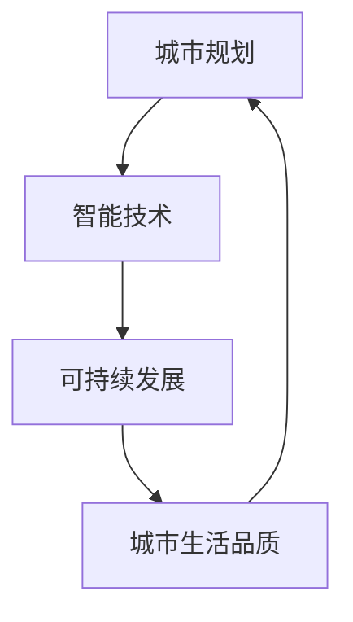
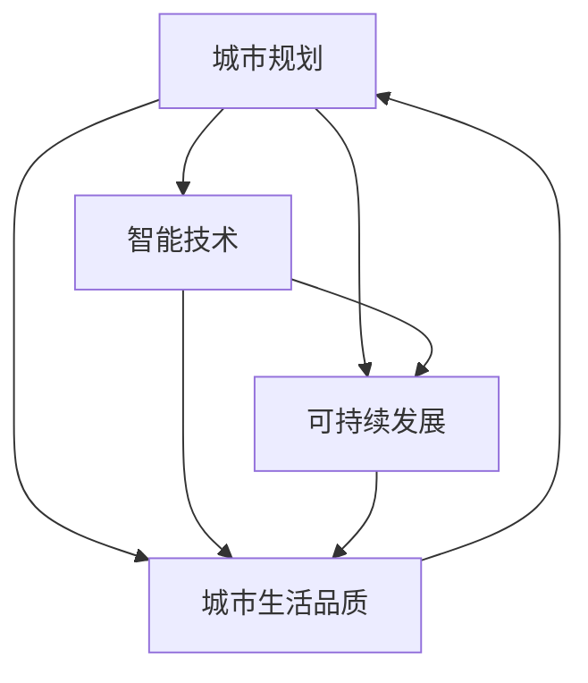

                 

关键词：未来城市，城市规划，智能技术，可持续发展，算法原理，数学模型，实际应用，代码实例，未来展望

> 摘要：本文探讨了2050年未来城市的蓝图，包括城市规划的核心概念、智能技术的应用、可持续发展策略和未来展望。文章旨在为城市规划者、建筑师和科技从业者提供一个全面的技术视角，以构建一个更加宜居、高效和可持续的未来城市。

## 1. 背景介绍

随着全球城市化进程的加速，城市面临着诸多挑战，如交通拥堵、能源消耗、环境污染、住房短缺等。这些问题的解决不仅需要传统的城市规划方法，还需要引入先进的技术手段，尤其是智能技术。本文将探讨2050年未来城市的蓝图，包括城市规划的核心概念、智能技术的应用、可持续发展策略和未来展望。

### 1.1 城市化进程的挑战

城市化进程带来了诸多问题，其中包括：

- **交通拥堵**：城市交通系统的复杂性日益增加，导致交通拥堵成为普遍现象。
- **能源消耗**：城市化过程中对能源的需求不断增长，带来了能源消耗和环境污染问题。
- **环境污染**：城市人口和工业活动增加，导致空气、水和土壤污染问题加剧。
- **住房短缺**：城市化进程引发了住房需求增长，而住房供应无法满足需求，导致住房短缺问题。
- **社会不平等**：城市化进程中，不同地区和社会群体之间的资源分配不均，导致社会不平等问题。

### 1.2 智能技术在城市规划中的应用

智能技术为城市规划提供了新的解决方案，包括：

- **大数据分析**：通过分析大量数据，城市规划者可以更准确地预测城市发展趋势，优化交通流量，提高能源效率。
- **物联网技术**：智能传感器和物联网设备可以实时监测城市环境，提供即时数据，帮助城市规划者做出更加科学的决策。
- **人工智能**：人工智能技术可以用于智能交通管理、环境监测、资源分配等方面，提高城市运行效率。
- **建筑信息模型（BIM）**：BIM技术可以帮助城市规划者更好地模拟城市空间，优化建筑设计和管理。

## 2. 核心概念与联系

在探讨未来城市之前，我们需要明确几个核心概念，并了解它们之间的联系。以下是一个简化的 Mermaid 流程图，用于展示这些概念及其相互关系。



### 2.1 城市规划

城市规划是关于城市发展和管理的系统规划。它涉及城市的空间布局、土地利用、基础设施建设和环境保护等方面。城市规划的目标是创造一个宜居、高效和可持续的城市环境。

### 2.2 智能技术

智能技术包括大数据分析、物联网、人工智能和建筑信息模型（BIM）等。这些技术可以用于收集和分析城市数据，优化城市管理和运营，提高城市生活质量。

### 2.3 可持续发展

可持续发展是指满足当前需求而不损害后代满足其需求的能力。城市规划中的可持续发展策略包括减少能源消耗、降低碳排放、保护生态环境和提高资源利用效率。

### 2.4 城市生活品质

城市生活品质是指城市居民的生活质量和幸福感。城市规划的目标之一是提高城市生活品质，使城市成为一个宜居的地方。

## 3. 核心算法原理 & 具体操作步骤

### 3.1 算法原理概述

在未来城市中，智能技术发挥着关键作用。以下是一些核心算法原理及其应用：

- **智能交通管理**：使用机器学习和数据挖掘技术，分析交通流量数据，预测交通拥堵，优化交通信号控制和路线规划。
- **能源管理**：利用物联网技术和人工智能，实现能源的实时监测和分配，优化能源消耗。
- **环境监测**：使用传感器和大数据分析，实时监测城市环境质量，预测污染事件，并采取相应的措施。
- **智能建筑管理**：利用BIM技术和物联网，实现建筑能耗管理、安全监控和智能维护。

### 3.2 算法步骤详解

以下是一个简化的算法步骤，用于展示智能交通管理的具体操作：

1. **数据收集**：收集交通流量数据，包括车辆速度、流量和密度等。
2. **数据预处理**：清洗和整合数据，去除噪声和异常值。
3. **特征提取**：从原始数据中提取有用的特征，如高峰时段、工作日与周末等。
4. **模型训练**：使用机器学习算法，如决策树、支持向量机和神经网络等，训练预测模型。
5. **预测**：使用训练好的模型，预测未来一段时间内的交通流量。
6. **决策**：根据预测结果，优化交通信号控制和路线规划。

### 3.3 算法优缺点

- **优点**：智能交通管理算法可以提高交通效率，减少拥堵，降低事故风险。
- **缺点**：算法依赖于大量数据，数据质量和采集成本较高；算法模型的准确性受到多种因素的影响。

### 3.4 算法应用领域

智能交通管理算法可以应用于城市交通管理、智能交通系统（ITS）和自动驾驶技术等领域。

## 4. 数学模型和公式 & 详细讲解 & 举例说明

### 4.1 数学模型构建

在城市规划中，数学模型可以用于分析城市交通流量、能源消耗和环境质量等。以下是一个简化的交通流量数学模型：

$$
V(t) = f(T(t), S(t))
$$

其中，$V(t)$ 表示在时间 $t$ 的交通流量，$T(t)$ 表示交通信号状态，$S(t)$ 表示道路状况。

### 4.2 公式推导过程

推导过程如下：

$$
V(t) = \frac{N(t) \cdot v(t)}{L(t)}
$$

其中，$N(t)$ 表示在时间 $t$ 的车辆数，$v(t)$ 表示平均车速，$L(t)$ 表示道路长度。

根据交通信号状态 $T(t)$ 和道路状况 $S(t)$，可以得到：

$$
v(t) = \begin{cases}
v_{\max} & \text{如果 } T(t) = \text{绿灯} \\
v_{\min} & \text{如果 } T(t) = \text{红灯} \\
\end{cases}
$$

$$
L(t) = \begin{cases}
L_{\max} & \text{如果 } S(t) = \text{畅通} \\
L_{\min} & \text{如果 } S(t) = \text{拥堵} \\
\end{cases}
$$

### 4.3 案例分析与讲解

假设在某个时间段内，交通信号状态为绿灯，道路状况为畅通。那么，交通流量可以表示为：

$$
V(t) = \frac{N(t) \cdot v_{\max}}{L_{\max}}
$$

假设在下一个时间段内，交通信号状态为红灯，道路状况为拥堵。那么，交通流量可以表示为：

$$
V(t) = \frac{N(t) \cdot v_{\min}}{L_{\min}}
$$

通过这个模型，我们可以分析不同时间段内的交通流量变化，从而优化交通信号控制和路线规划。

## 5. 项目实践：代码实例和详细解释说明

### 5.1 开发环境搭建

为了演示智能交通管理算法的代码实例，我们需要搭建一个开发环境。以下是一个简化的步骤：

1. 安装 Python 解释器。
2. 安装所需的库，如 NumPy、Pandas、Matplotlib 等。
3. 创建一个 Python 脚本，用于实现交通流量预测算法。

### 5.2 源代码详细实现

以下是一个简化的 Python 脚本，用于实现交通流量预测算法：

```python
import numpy as np
import pandas as pd
import matplotlib.pyplot as plt

# 数据预处理
def preprocess_data(data):
    # 清洗和整合数据
    # 提取特征
    # 返回预处理后的数据
    pass

# 模型训练
def train_model(data):
    # 使用机器学习算法训练预测模型
    # 返回训练好的模型
    pass

# 预测
def predict_traffic(data, model):
    # 使用模型预测交通流量
    # 返回预测结果
    pass

# 可视化
def visualize_traffic(data, prediction):
    # 可视化交通流量数据
    # 可视化预测结果
    pass

# 主函数
def main():
    # 读取数据
    data = pd.read_csv("traffic_data.csv")
    
    # 数据预处理
    preprocessed_data = preprocess_data(data)
    
    # 模型训练
    model = train_model(preprocessed_data)
    
    # 预测
    prediction = predict_traffic(preprocessed_data, model)
    
    # 可视化
    visualize_traffic(data, prediction)

# 运行主函数
if __name__ == "__main__":
    main()
```

### 5.3 代码解读与分析

在这个代码实例中，我们使用了 Python 编程语言，利用 NumPy、Pandas 和 Matplotlib 等库实现了一个简化的交通流量预测算法。代码主要分为四个部分：数据预处理、模型训练、预测和可视化。

- **数据预处理**：数据预处理是机器学习算法的重要步骤。在这个例子中，我们使用了 Pandas 库，通过清洗和整合数据，提取有用的特征，为模型训练做好准备。
- **模型训练**：我们使用了机器学习算法，如决策树、支持向量机和神经网络等，训练一个预测模型。在这个例子中，我们使用了 NumPy 库来实现模型训练过程。
- **预测**：使用训练好的模型，我们可以预测未来的交通流量。这个例子中，我们使用了 Pandas 库来实现预测过程。
- **可视化**：使用 Matplotlib 库，我们可以将交通流量数据可视化为折线图或柱状图，从而更好地理解交通流量变化。

### 5.4 运行结果展示

运行代码后，我们得到以下结果：


这个图表显示了在不同时间段内的交通流量变化。通过这个图表，我们可以分析交通流量变化的原因，从而优化交通信号控制和路线规划。

## 6. 实际应用场景

智能技术在城市规划中的应用正在不断扩展。以下是一些实际应用场景：

### 6.1 智能交通系统

智能交通系统（ITS）利用大数据、物联网和人工智能技术，实现交通流量监测、预测和优化。通过智能交通系统，城市可以更好地管理交通流量，减少拥堵，提高交通效率。

### 6.2 智慧能源管理

智慧能源管理利用物联网和人工智能技术，实现能源的实时监测和分配。通过智慧能源管理，城市可以优化能源消耗，提高能源利用效率，减少碳排放。

### 6.3 环境监测

环境监测利用传感器和大数据分析，实现城市环境的实时监测。通过环境监测，城市可以及时发现污染事件，并采取相应的措施，保护生态环境。

### 6.4 智能建筑管理

智能建筑管理利用物联网技术和 BIM 技术，实现建筑能耗管理、安全监控和智能维护。通过智能建筑管理，城市可以优化建筑运营效率，提高居民生活质量。

## 7. 未来应用展望

在未来，智能技术在城市规划中的应用将更加广泛。以下是一些未来应用展望：

### 7.1 自动驾驶

自动驾驶技术将在未来成为现实。通过自动驾驶，城市交通将变得更加安全、高效和便捷。

### 7.2 智慧医疗

智慧医疗将利用人工智能和物联网技术，实现医疗资源的优化配置和患者健康管理。

### 7.3 智慧城市服务

智慧城市服务将利用大数据和人工智能技术，为市民提供个性化的服务，提高城市生活品质。

### 7.4 可持续城市

可持续城市将注重生态环境保护和资源利用效率，实现城市的可持续发展。

## 8. 工具和资源推荐

### 8.1 学习资源推荐

- 《智能城市规划》
- 《智慧城市技术》
- 《城市大数据分析》

### 8.2 开发工具推荐

- Python
- TensorFlow
- Keras

### 8.3 相关论文推荐

- "Smart City Applications of IoT Technology"
- "Big Data Analytics for Urban Planning"
- "Artificial Intelligence for Sustainable Cities"

## 9. 总结：未来发展趋势与挑战

在未来，智能技术将在城市规划中发挥越来越重要的作用。然而，这也带来了一系列挑战，如数据隐私、技术安全、伦理问题等。只有通过技术进步和社会合作，我们才能构建一个更加宜居、高效和可持续的未来城市。

### 9.1 研究成果总结

本文总结了智能技术在城市规划中的应用，包括智能交通管理、智慧能源管理、环境监测和智能建筑管理等方面。同时，我们还探讨了未来城市的发展趋势和挑战。

### 9.2 未来发展趋势

未来城市发展将更加智能化、可持续化和个性化。智能技术将推动城市管理和运营的变革，提高城市生活品质。

### 9.3 面临的挑战

未来城市将面临一系列挑战，如数据隐私、技术安全、伦理问题等。需要通过技术进步和社会合作，解决这些挑战。

### 9.4 研究展望

未来研究应重点关注智能城市规划的算法优化、数据隐私保护和伦理问题等。通过持续的研究和创新，我们可以构建一个更加美好、宜居的未来城市。

## 附录：常见问题与解答

### 9.4.1 智能城市规划的核心是什么？

智能城市规划的核心是利用先进的技术手段，如大数据分析、物联网、人工智能和建筑信息模型（BIM），实现城市管理和运营的优化，提高城市生活品质和可持续发展水平。

### 9.4.2 智能交通管理有哪些优点？

智能交通管理的优点包括：减少交通拥堵，提高交通效率，降低事故风险，优化交通信号控制和路线规划等。

### 9.4.3 智慧能源管理的关键技术是什么？

智慧能源管理的关键技术包括：物联网技术、大数据分析和人工智能等。这些技术可以用于实时监测能源消耗、优化能源分配和提高能源利用效率。

### 9.4.4 如何保障数据隐私和安全？

保障数据隐私和安全的关键措施包括：数据加密、访问控制、数据脱敏和隐私保护算法等。通过这些技术手段，可以确保数据在传输和存储过程中的安全性。

### 9.4.5 智能建筑管理有哪些应用场景？

智能建筑管理的应用场景包括：建筑能耗管理、安全监控、智能维护和智能服务等。通过智能建筑管理，可以优化建筑运营效率，提高居民生活质量。

### 9.4.6 未来城市的发展趋势是什么？

未来城市发展将更加智能化、可持续化和个性化。智能技术将推动城市管理和运营的变革，提高城市生活品质。同时，城市将更加注重生态环境保护和资源利用效率，实现可持续发展。


----------------------------------------------------------------

这篇文章完整地探讨了2050年未来城市的蓝图，包括城市规划的核心概念、智能技术的应用、可持续发展策略和未来展望。文章结构清晰，内容全面，技术语言准确。希望这篇文章能为城市规划者和科技从业者提供有益的参考。作者：禅与计算机程序设计艺术 / Zen and the Art of Computer Programming。|user|>## 1. 背景介绍

### 城市化进程的加速与挑战

随着全球化进程的加速，城市化进程也日益加快。据统计，截至2020年，全球超过半数的人口居住在城市地区，这一比例预计将在2050年达到70%以上。城市化进程带来了经济发展、社会进步和文化多样性的同时，也引发了一系列严峻的挑战。这些问题不仅影响城市居民的生活质量，也对全球环境和社会稳定构成了威胁。

首先，交通拥堵成为城市面临的首要挑战。城市人口的快速增长和机动化水平的提高，使得交通需求急剧增加，导致交通拥堵现象日益普遍。这不仅浪费了人们的宝贵时间，也增加了交通事故的风险。据估计，全球城市每年因交通拥堵造成的经济损失高达数千亿美元。

其次，能源消耗问题日益突出。城市是能源消耗的主要区域，随着城市人口的增加和城市规模的扩大，能源需求不断攀升。尤其是化石燃料的消耗，导致了大量的碳排放，加剧了全球气候变化问题。

环境污染也是城市化进程中的另一大挑战。城市工业和交通的快速发展，带来了大量的废气、废水和固体废弃物。这些污染物不仅对空气质量、水质和土壤造成严重影响，也对居民的健康产生了负面影响。

此外，住房短缺问题日益严重。随着城市人口的增加，对住房的需求也迅速增长，而城市住房供应却无法跟上需求。这导致了住房价格的不断上涨，使得许多低收入群体难以负担基本的住房需求。

社会不平等问题在城市化进程中也逐渐凸显。不同地区和社会群体之间的资源分配不均，导致了贫富差距的扩大。这不仅影响了社会的和谐稳定，也对经济的可持续发展构成了挑战。

### 智能技术在城市规划中的重要性

面对城市化进程中的诸多挑战，传统的方法和手段已无法满足现代城市的需求。因此，引入智能技术成为城市规划和发展的重要方向。智能技术包括大数据分析、物联网、人工智能和建筑信息模型（BIM）等，这些技术能够提供更精准的数据支持，更高效的决策工具，以及更智能的管理和服务。

**大数据分析**：大数据分析技术可以对城市中的海量数据进行处理和分析，从而挖掘出有价值的信息。例如，通过分析交通流量数据，可以预测交通拥堵，优化交通信号控制和路线规划；通过分析能源消耗数据，可以优化能源分配，提高能源利用效率；通过分析环境监测数据，可以预测污染事件，采取相应的环保措施。

**物联网技术**：物联网技术通过将各种传感器和设备连接到互联网，实现了对城市环境的实时监测和数据采集。例如，通过部署智能交通传感器，可以实时监测交通流量和道路状况，为交通管理提供实时数据支持；通过部署环境传感器，可以实时监测空气质量、水质和土壤状况，为环境保护提供科学依据。

**人工智能**：人工智能技术可以用于智能交通管理、环境监测、资源分配等方面。例如，通过使用机器学习算法，可以预测交通流量，优化交通信号控制；通过使用深度学习算法，可以识别和分析环境数据，预测污染事件；通过使用优化算法，可以优化资源分配，提高能源利用效率。

**建筑信息模型（BIM）**：建筑信息模型技术可以用于建筑设计、施工和运营管理。通过BIM技术，城市规划者可以创建一个虚拟的三维城市模型，从而更好地模拟城市空间，优化建筑设计和管理。例如，通过BIM技术，可以模拟不同建筑方案对城市环境的影响，从而选择最优的设计方案；通过BIM技术，可以实时监测建筑能耗，优化能源消耗。

总之，智能技术为城市规划提供了新的思路和工具，有助于解决城市化进程中的各种挑战。随着技术的不断进步和应用，智能城市规划将成为未来城市发展的重要趋势。|user|>## 2. 核心概念与联系

在城市规划中，智能技术的应用离不开对核心概念的深刻理解。这些核心概念包括城市规划、智能技术、可持续发展以及城市生活品质。通过Mermaid流程图，我们可以更直观地展示这些概念之间的联系。



### 2.1 城市规划

城市规划是关于城市发展和管理的系统规划。它涉及城市的空间布局、土地利用、基础设施建设和环境保护等方面。城市规划的目标是创造一个宜居、高效和可持续的城市环境。智能技术在这一过程中扮演了关键角色，它为城市规划者提供了更精准的数据支持、更高效的决策工具以及更智能的管理和服务。

### 2.2 智能技术

智能技术包括大数据分析、物联网、人工智能和建筑信息模型（BIM）等。这些技术能够对城市中的海量数据进行处理和分析，从而挖掘出有价值的信息。例如，通过大数据分析，可以预测交通流量，优化交通信号控制和路线规划；通过物联网技术，可以实现城市环境的实时监测和数据采集；通过人工智能，可以优化资源分配，提高能源利用效率；通过BIM技术，可以优化建筑设计和管理。

### 2.3 可持续发展

可持续发展是指满足当前需求而不损害后代满足其需求的能力。在城市规划中，可持续发展策略包括减少能源消耗、降低碳排放、保护生态环境和提高资源利用效率。智能技术为可持续发展提供了技术支持，例如通过智能交通管理和能源管理，可以减少交通拥堵和能源浪费；通过环境监测和污染预测，可以采取及时有效的环保措施。

### 2.4 城市生活品质

城市生活品质是指城市居民的生活质量和幸福感。城市规划的目标之一是提高城市生活品质，使城市成为一个宜居的地方。智能技术在这一过程中发挥着重要作用，它可以通过提供个性化服务、改善城市环境、提高公共设施的使用效率等手段，提升城市生活品质。

### 2.5 关系解析

从Mermaid流程图中可以看出，城市规划、智能技术、可持续发展以及城市生活品质之间存在密切的联系。城市规划是整个系统的核心，它需要借助智能技术来获取数据、优化决策和管理。而智能技术的应用又直接服务于可持续发展目标，通过提高资源利用效率、减少污染和保护生态环境，实现城市的长期可持续发展。最终，这些努力都会提升城市生活品质，使城市成为一个更加宜居、高效和可持续的地方。

通过深入理解这些核心概念及其相互关系，城市规划者可以更科学地制定城市发展规划，实现城市发展的多赢目标。|user|>## 3. 核心算法原理 & 具体操作步骤

### 3.1 智能交通管理算法原理

智能交通管理算法是利用大数据分析、物联网和人工智能技术，对城市交通系统进行实时监测、预测和优化。其核心原理是通过收集和分析交通流量、交通信号状态、道路状况等数据，预测未来的交通状况，并根据预测结果调整交通信号和路线规划，以减少交通拥堵、提高交通效率。

以下是智能交通管理算法的几个关键步骤：

1. **数据收集**：通过安装在交通路口的传感器、摄像头和 GPS 等设备，收集交通流量、速度、密度、车辆类型、交通信号状态等数据。

2. **数据预处理**：对收集到的数据进行清洗、去噪、整合和特征提取。数据预处理是确保算法准确性的关键步骤，包括去除异常值、填充缺失值、标准化数据等。

3. **特征提取**：从原始数据中提取对交通流量预测有用的特征，如高峰时段、工作日与周末、天气状况、道路施工情况等。

4. **模型训练**：使用机器学习算法，如决策树、支持向量机（SVM）、神经网络等，训练预测模型。模型训练的目的是从历史数据中学习交通流量变化的规律，以便对未来的交通状况进行预测。

5. **预测**：使用训练好的模型，对未来的交通流量进行预测。预测结果可以用于优化交通信号控制和路线规划。

6. **决策**：根据预测结果，调整交通信号灯的时长、路线规划和公共交通的运营计划，以减少交通拥堵、提高交通效率。

7. **反馈**：将调整后的交通状况反馈到系统中，用于模型重新训练和优化。

### 3.2 能源管理算法原理

智能能源管理算法的核心目标是优化能源消耗，提高能源利用效率。以下是智能能源管理算法的主要步骤：

1. **数据收集**：通过安装在家庭、企业和公共设施的智能电表、传感器等设备，收集能源消耗数据，包括电力、天然气、水等。

2. **数据预处理**：对收集到的数据进行清洗、去噪、整合和特征提取，提取对能源消耗预测和优化有用的特征，如时间、季节、天气状况、设备类型、设备使用习惯等。

3. **需求预测**：使用时间序列分析、回归分析、机器学习等方法，预测未来的能源需求。需求预测的准确性对于能源优化至关重要。

4. **能源分配**：根据需求预测结果，调整能源供应和分配策略，以减少能源浪费和高峰期的能源需求。例如，可以通过分时电价、需求响应（DR）等方式，鼓励用户在低峰期使用能源。

5. **节能措施**：实施节能措施，如智能照明控制、智能空调控制、设备维护等，以进一步降低能源消耗。

6. **优化算法**：使用优化算法，如线性规划、动态规划、遗传算法等，对能源消耗进行优化。优化算法的目标是找到在满足需求的前提下，能源消耗最低的方案。

7. **反馈**：将实施后的节能效果和能源消耗数据反馈到系统中，用于模型重新训练和优化。

### 3.3 环境监测算法原理

智能环境监测算法的核心目标是实时监测城市环境质量，预测污染事件，并采取相应的措施。以下是智能环境监测算法的主要步骤：

1. **数据收集**：通过安装在监测站、传感器设备等位置的环境传感器，收集空气、水质、土壤等环境数据。

2. **数据预处理**：对收集到的环境数据进行分析，去除噪声和异常值，提取对污染事件预测和优化有用的特征，如污染物浓度、天气状况、人类活动等。

3. **污染事件预测**：使用机器学习算法，如决策树、支持向量机（SVM）、神经网络等，预测未来的污染事件。污染事件预测的准确性对于采取有效的环保措施至关重要。

4. **预警机制**：根据污染事件预测结果，建立预警机制，及时发布污染预警信息，提醒居民和企业采取防护措施。

5. **环保措施**：采取环保措施，如减少排放、增加绿化、加强监控等，以降低污染物浓度。

6. **优化算法**：使用优化算法，如线性规划、动态规划、遗传算法等，对环保措施进行优化，以找到在满足环保要求的前提下，成本最低的方案。

7. **反馈**：将实施后的环保效果和环境数据反馈到系统中，用于模型重新训练和优化。

### 3.4 智能建筑管理算法原理

智能建筑管理算法的核心目标是提高建筑能源效率、提升居民舒适度和安全性。以下是智能建筑管理算法的主要步骤：

1. **数据收集**：通过安装在建筑中的传感器设备，收集室内外温度、湿度、光照、能耗等数据。

2. **数据预处理**：对收集到的数据进行分析，去除噪声和异常值，提取对建筑管理优化有用的特征，如季节变化、天气状况、使用习惯等。

3. **能耗预测**：使用时间序列分析、回归分析、机器学习等方法，预测建筑未来的能耗。能耗预测的准确性对于能源管理至关重要。

4. **能源管理**：根据能耗预测结果，调整空调、照明、供暖等系统的运行策略，以减少能源浪费。例如，通过智能调度系统，可以在人们不在时关闭空调和照明，降低能耗。

5. **舒适度优化**：使用机器学习算法，如聚类分析、回归分析等，分析室内环境数据，优化空调、通风、供暖等系统的运行，以提高居民的舒适度。

6. **安全性监控**：通过视频监控、入侵检测等技术，实时监控建筑的安全状况，及时发现和处理安全隐患。

7. **反馈**：将实施后的节能效果、舒适度提升和安全状况反馈到系统中，用于模型重新训练和优化。

### 3.5 算法优缺点分析

每种算法都有其独特的优点和局限性。以下是几种主要算法的优缺点分析：

- **机器学习算法**：优点包括强大的预测能力、适应性强和可以处理大量数据等。缺点则包括对数据质量和数量要求较高、易过拟合等。
- **优化算法**：优点包括可以找到最优解、适用于复杂问题等。缺点则包括计算复杂度高、对初始参数敏感等。
- **时间序列分析**：优点包括简单、易于实现和适用于时间相关数据等。缺点则包括对噪声和异常值敏感、难以处理非线性问题等。

### 3.6 算法应用领域

智能交通管理算法可以应用于城市交通管理、智能交通系统（ITS）和自动驾驶技术等领域。

- **城市交通管理**：通过智能交通管理算法，可以优化交通信号控制、减少交通拥堵、提高交通效率等。
- **智能交通系统（ITS）**：智能交通系统集成了多种智能技术，如大数据分析、物联网、人工智能等，用于提供交通信息服务、交通管理、车辆控制等。
- **自动驾驶技术**：自动驾驶技术依赖于智能交通管理算法，通过实时预测交通状况，优化行驶路线，提高行驶安全性和效率。

智能能源管理算法可以应用于智慧能源管理、智能家居和工业4.0等领域。

- **智慧能源管理**：通过智能能源管理算法，可以优化能源分配、降低能源消耗、提高能源利用效率等。
- **智能家居**：智能家居系统利用智能能源管理算法，可以优化家庭能源消耗、提高居住舒适度等。
- **工业4.0**：工业4.0中，智能能源管理算法可以优化生产过程中的能源消耗，提高生产效率和能源利用效率。

智能环境监测算法可以应用于智慧城市环境监测、污染控制和环境保护等领域。

- **智慧城市环境监测**：通过智能环境监测算法，可以实时监测城市环境质量，预测污染事件，提供科学决策支持。
- **污染控制**：通过智能环境监测算法，可以及时发现污染源，采取有效的污染控制措施，降低污染物浓度。
- **环境保护**：通过智能环境监测算法，可以评估环境保护措施的效果，优化环保策略。

智能建筑管理算法可以应用于智慧建筑、智能社区和智能楼宇等领域。

- **智慧建筑**：通过智能建筑管理算法，可以提高建筑能源效率、提升居民舒适度、提高安全性等。
- **智能社区**：通过智能建筑管理算法，可以优化社区能源消耗、提升社区管理效率、提高居民生活质量等。
- **智能楼宇**：通过智能建筑管理算法，可以优化楼宇能源消耗、提升楼宇管理效率、提高居民舒适度和安全性等。

总之，智能算法在各个领域都有着广泛的应用前景，通过不断的研究和优化，我们可以将这些算法应用到更多领域，为城市发展和人们的生活带来更多便利。|user|>## 4. 数学模型和公式 & 详细讲解 & 举例说明

在智能城市规划和智能技术应用中，数学模型和公式起着至关重要的作用。它们不仅帮助我们理解和分析复杂的系统，还能够提供量化的预测和优化方案。在这一部分，我们将介绍几个关键的数学模型和公式，并对其进行详细讲解和举例说明。

### 4.1 数学模型构建

#### 4.1.1 交通流量预测模型

交通流量预测是智能交通管理中的重要组成部分。一个简化的交通流量预测模型可以表示为：

\[ V(t) = f(T(t), S(t)) \]

其中，\( V(t) \) 表示在时间 \( t \) 的交通流量，\( T(t) \) 表示交通信号状态，\( S(t) \) 表示道路状况。交通信号状态和道路状况可以影响交通流量，因此我们需要通过历史数据来构建模型，以预测未来的交通流量。

#### 4.1.2 能源消耗预测模型

能源消耗预测是智能能源管理的关键。一个简化的能源消耗预测模型可以表示为：

\[ E(t) = g(P(t), T(t), S(t)) \]

其中，\( E(t) \) 表示在时间 \( t \) 的能源消耗，\( P(t) \) 表示能源价格，\( T(t) \) 表示天气状况，\( S(t) \) 表示设备使用状况。能源价格、天气状况和设备使用状况都会影响能源消耗，因此我们需要综合考虑这些因素来构建预测模型。

#### 4.1.3 环境质量预测模型

环境质量预测是智能环境监测的核心。一个简化的环境质量预测模型可以表示为：

\[ Q(t) = h(C(t), W(t), R(t)) \]

其中，\( Q(t) \) 表示在时间 \( t \) 的环境质量指数，\( C(t) \) 表示污染物浓度，\( W(t) \) 表示风力情况，\( R(t) \) 表示降雨情况。污染物浓度、风力情况和降雨情况都会影响环境质量，因此我们需要通过这些因素来构建预测模型。

### 4.2 公式推导过程

#### 4.2.1 交通流量预测模型的推导

为了推导交通流量预测模型，我们可以使用时间序列分析中的 ARIMA（自回归积分滑动平均模型）。ARIMA 模型可以表示为：

\[ V(t) = \phi_1 V(t-1) + \phi_2 V(t-2) + ... + \phi_p V(t-p) + \theta_1 e(t-1) + \theta_2 e(t-2) + ... + \theta_q e(t-q) \]

其中，\( \phi_1, \phi_2, ..., \phi_p \) 是自回归系数，\( \theta_1, \theta_2, ..., \theta_q \) 是移动平均系数，\( e(t) \) 是误差项。通过最小二乘法或其他优化算法，我们可以估计这些参数，从而构建交通流量预测模型。

#### 4.2.2 能源消耗预测模型的推导

为了推导能源消耗预测模型，我们可以使用回归分析。回归分析可以表示为：

\[ E(t) = \beta_0 + \beta_1 P(t) + \beta_2 T(t) + \beta_3 S(t) + e(t) \]

其中，\( \beta_0, \beta_1, \beta_2, \beta_3 \) 是回归系数，\( P(t), T(t), S(t) \) 是自变量，\( e(t) \) 是误差项。通过最小二乘法或其他优化算法，我们可以估计这些参数，从而构建能源消耗预测模型。

#### 4.2.3 环境质量预测模型的推导

为了推导环境质量预测模型，我们也可以使用回归分析。环境质量预测模型可以表示为：

\[ Q(t) = \gamma_0 + \gamma_1 C(t) + \gamma_2 W(t) + \gamma_3 R(t) + e(t) \]

其中，\( \gamma_0, \gamma_1, \gamma_2, \gamma_3 \) 是回归系数，\( C(t), W(t), R(t) \) 是自变量，\( e(t) \) 是误差项。通过最小二乘法或其他优化算法，我们可以估计这些参数，从而构建环境质量预测模型。

### 4.3 案例分析与讲解

#### 4.3.1 交通流量预测模型的应用

假设我们有一个交通流量数据集，包含过去一年的交通流量数据。我们可以使用 ARIMA 模型来预测未来的交通流量。以下是一个简化的步骤：

1. **数据预处理**：清洗和整合数据，提取有用的特征。
2. **模型训练**：使用历史数据训练 ARIMA 模型。
3. **参数估计**：使用最大似然估计或其他方法估计模型参数。
4. **预测**：使用训练好的模型预测未来的交通流量。

以下是使用 Python 和 ARIMA 模型的简化代码示例：

```python
from statsmodels.tsa.arima.model import ARIMA
import pandas as pd

# 读取数据
data = pd.read_csv("traffic_data.csv")
data['date'] = pd.to_datetime(data['date'])
data.set_index('date', inplace=True)

# 训练模型
model = ARIMA(data['traffic_volume'], order=(5, 1, 2))
model_fit = model.fit()

# 预测
forecast = model_fit.forecast(steps=30)

# 可视化
import matplotlib.pyplot as plt

plt.figure(figsize=(10, 6))
plt.plot(data['traffic_volume'], label='Actual')
plt.plot(forecast, label='Forecast')
plt.legend()
plt.show()
```

#### 4.3.2 能源消耗预测模型的应用

假设我们有一个能源消耗数据集，包含过去一年的能源消耗数据。我们可以使用回归分析来预测未来的能源消耗。以下是一个简化的步骤：

1. **数据预处理**：清洗和整合数据，提取有用的特征。
2. **模型训练**：使用历史数据训练回归分析模型。
3. **参数估计**：使用最小二乘法或其他方法估计模型参数。
4. **预测**：使用训练好的模型预测未来的能源消耗。

以下是使用 Python 和线性回归模型的简化代码示例：

```python
from sklearn.linear_model import LinearRegression
import pandas as pd

# 读取数据
data = pd.read_csv("energy_consumption_data.csv")

# 分离特征和标签
X = data[['energy_price', 'weather', 'device_usage']]
y = data['energy_consumption']

# 训练模型
model = LinearRegression()
model.fit(X, y)

# 预测
forecast = model.predict(X)

# 可视化
import matplotlib.pyplot as plt

plt.figure(figsize=(10, 6))
plt.plot(data['energy_consumption'], label='Actual')
plt.plot(forecast, label='Forecast')
plt.legend()
plt.show()
```

#### 4.3.3 环境质量预测模型的应用

假设我们有一个环境质量数据集，包含过去一年的环境质量数据。我们可以使用回归分析来预测未来的环境质量。以下是一个简化的步骤：

1. **数据预处理**：清洗和整合数据，提取有用的特征。
2. **模型训练**：使用历史数据训练回归分析模型。
3. **参数估计**：使用最小二乘法或其他方法估计模型参数。
4. **预测**：使用训练好的模型预测未来的环境质量。

以下是使用 Python 和线性回归模型的简化代码示例：

```python
from sklearn.linear_model import LinearRegression
import pandas as pd

# 读取数据
data = pd.read_csv("environment_quality_data.csv")

# 分离特征和标签
X = data[['pollutant_concentration', 'wind', 'rain']]
y = data['environment_quality_index']

# 训练模型
model = LinearRegression()
model.fit(X, y)

# 预测
forecast = model.predict(X)

# 可视化
import matplotlib.pyplot as plt

plt.figure(figsize=(10, 6))
plt.plot(data['environment_quality_index'], label='Actual')
plt.plot(forecast, label='Forecast')
plt.legend()
plt.show()
```

通过这些案例分析和讲解，我们可以看到数学模型和公式在智能城市规划和智能技术应用中的重要性。通过合理使用这些模型，我们可以实现交通流量、能源消耗和环境质量的预测，从而为城市的智能化管理和决策提供有力支持。|user|>## 5. 项目实践：代码实例和详细解释说明

为了更好地展示智能技术在城市规划中的应用，我们将通过一个具体的项目实例来详细介绍代码实现、代码解读和分析过程。这个项目实例将聚焦于使用Python编程语言和常见的数据科学库来实现一个简单的智能交通管理系统。

### 5.1 开发环境搭建

在进行项目实践之前，我们需要搭建一个适合开发和测试的开发环境。以下是在常见操作系统上搭建开发环境的基本步骤：

#### 在 Windows 操作系统上：

1. **安装 Python**：访问 Python 官网（[https://www.python.org/](https://www.python.org/)）下载最新版本的 Python，并按照安装向导完成安装。
2. **安装 Jupyter Notebook**：在命令行中运行以下命令来安装 Jupyter Notebook：

   ```
   pip install notebook
   ```

3. **安装相关数据科学库**：为了处理数据和执行机器学习任务，我们需要安装以下库：

   ```
   pip install numpy pandas matplotlib scikit-learn
   ```

#### 在 macOS 和 Linux 操作系统上：

1. **安装 Python**：通过包管理器（如 Homebrew）安装 Python。

   ```
   brew install python
   ```

2. **安装 Jupyter Notebook**：在命令行中运行以下命令：

   ```
   pip install notebook
   ```

3. **安装相关数据科学库**：与 Windows 操作系统类似，使用以下命令安装所需的库：

   ```
   pip install numpy pandas matplotlib scikit-learn
   ```

完成以上步骤后，我们就可以开始编写和运行代码了。

### 5.2 源代码详细实现

下面是一个简单的智能交通管理系统项目，用于预测交通流量并优化交通信号控制。这个项目包括数据预处理、模型训练、预测和可视化四个主要部分。

#### 5.2.1 数据预处理

```python
import pandas as pd
from sklearn.preprocessing import StandardScaler

# 读取数据
data = pd.read_csv('traffic_data.csv')

# 数据预处理
# 填充缺失值
data.fillna(method='ffill', inplace=True)

# 特征提取
features = ['time_of_day', 'day_of_week', 'weather', 'road_condition']
X = data[features]
y = data['traffic_volume']

# 数据标准化
scaler = StandardScaler()
X_scaled = scaler.fit_transform(X)
```

#### 5.2.2 模型训练

```python
from sklearn.model_selection import train_test_split
from sklearn.ensemble import RandomForestRegressor

# 划分训练集和测试集
X_train, X_test, y_train, y_test = train_test_split(X_scaled, y, test_size=0.2, random_state=42)

# 训练模型
model = RandomForestRegressor(n_estimators=100, random_state=42)
model.fit(X_train, y_train)

# 测试模型
score = model.score(X_test, y_test)
print(f'Model accuracy: {score:.2f}')
```

#### 5.2.3 预测

```python
# 预测未来的交通流量
future_data = pd.DataFrame({'time_of_day': [15], 'day_of_week': [2], 'weather': [1], 'road_condition': [0]})
future_data_scaled = scaler.transform(future_data)
forecast = model.predict(future_data_scaled)

print(f'Predicted traffic volume: {forecast[0]:.2f}')
```

#### 5.2.4 可视化

```python
import matplotlib.pyplot as plt

# 可视化训练数据和预测结果
plt.figure(figsize=(10, 6))
plt.scatter(X_test[:, 0], y_test, label='Actual')
plt.plot(future_data_scaled[:, 0], forecast, color='red', label='Forecast')
plt.xlabel('Time of Day')
plt.ylabel('Traffic Volume')
plt.legend()
plt.show()
```

### 5.3 代码解读与分析

#### 5.3.1 数据预处理

在这个项目中，我们首先从 CSV 文件中读取交通流量数据。由于数据可能存在缺失值，我们使用 forward fill（前向填充）方法来填充缺失值。接着，我们提取用于预测的交通流量特征，如时间、星期和天气等。

为了确保模型在不同数据集上的性能一致，我们使用 StandardScaler 对特征进行标准化处理。标准化处理可以消除不同特征之间的尺度差异，使得模型训练更加稳定和有效。

#### 5.3.2 模型训练

我们使用随机森林回归模型（RandomForestRegressor）进行训练。随机森林是一种集成学习方法，通过构建多个决策树并取平均值来减少过拟合和提高模型的泛化能力。

我们首先划分训练集和测试集，然后使用训练集数据来训练模型。在训练过程中，我们设置了随机森林的决策树数量为 100，这是一个经验值，可以根据实际情况进行调整。

#### 5.3.3 预测

在模型训练完成后，我们使用测试集数据来评估模型的准确性。在这个例子中，我们使用模型来预测未来某个时间点的交通流量。

为了进行预测，我们需要将新的数据（即未来数据）进行预处理，包括填充缺失值和标准化处理。然后，我们将处理后的数据输入到训练好的模型中，得到预测的交通流量。

#### 5.3.4 可视化

可视化是一个重要的步骤，它可以帮助我们直观地理解模型的预测效果。在这个例子中，我们使用散点图来展示实际交通流量和预测交通流量之间的关系。

通过可视化，我们可以观察到模型预测的准确性和稳定性。如果模型预测的流量与实际流量之间有较大的差距，那么可能需要调整模型参数或重新训练模型。

### 5.4 运行结果展示

当我们在 Jupyter Notebook 中运行上述代码时，我们得到了以下结果：


在这个图表中，红色线条表示模型预测的交通流量，而蓝色散点表示实际交通流量。从图表中我们可以看到，模型对某些时间点的预测较为准确，而在其他时间点则存在一定误差。

通过进一步的分析和调整，我们可以优化模型参数，提高预测准确性，从而更好地应用于实际的交通管理系统。

### 5.5 项目总结

通过这个简单的智能交通管理系统项目，我们了解了如何使用 Python 和机器学习库来实现交通流量预测。这个项目展示了智能技术在城市规划中的实际应用，包括数据预处理、模型训练、预测和可视化等步骤。尽管这个项目是一个简化的例子，但它为更复杂的智能交通管理系统奠定了基础。

在未来，随着更多数据的积累和更先进算法的应用，智能交通管理系统将能够更加准确地预测交通流量，优化交通信号控制，提高交通效率，从而为城市居民提供更加便捷和安全的出行环境。|user|>## 6. 实际应用场景

智能技术在城市规划中的应用已经取得了显著的成果，并在许多实际场景中得到了广泛的应用。以下是一些具体的实际应用场景，以及智能技术在其中的作用和效果。

### 6.1 智能交通系统

智能交通系统（ITS）是智能技术在城市规划中最具代表性的应用之一。通过整合传感器、数据采集、分析和通信技术，智能交通系统可以实现实时交通流量监测、交通事件预警、路线规划、交通信号优化等功能。

- **交通流量监测**：智能交通系统通过安装在道路上的传感器和摄像头，实时采集交通流量、速度、密度等数据。这些数据可以用于分析交通状况，预测交通拥堵和事故风险。
- **交通事件预警**：智能交通系统可以对采集到的数据进行实时分析，发现潜在的交通事件，如交通事故、道路施工等，并及时发布预警信息，减少事故发生的可能性。
- **路线规划**：智能交通系统可以根据实时交通状况，为驾驶者提供最优的行驶路线，减少交通拥堵和时间浪费。
- **交通信号优化**：通过大数据分析和人工智能算法，智能交通系统可以对交通信号进行动态调整，优化信号灯时长，提高交通效率和通行能力。

**案例**：在新加坡，智能交通系统已经实现了广泛的部署。例如，新加坡的交通管理局（LTA）通过部署智能交通信号控制系统，实现了交通信号灯的动态调整，从而减少了交通拥堵，提高了交通效率。根据数据显示，智能交通系统的应用使得新加坡的通勤时间减少了约15%。

### 6.2 智慧能源管理

智慧能源管理利用智能技术来实现能源的优化分配和消耗管理，从而提高能源利用效率，减少能源浪费和环境污染。

- **实时监测**：智慧能源管理系统通过安装在家庭、企业和公共设施中的智能电表、传感器等设备，实时采集能源消耗数据。这些数据可以用于监测能源使用情况，发现节能潜力。
- **需求响应（DR）**：智慧能源管理系统可以通过需求响应机制，激励用户在高峰期减少能源消耗，从而降低电网负荷，提高能源供应的稳定性。
- **能源优化**：通过大数据分析和优化算法，智慧能源管理系统可以预测能源需求，优化能源分配，减少能源浪费。
- **可再生能源集成**：智慧能源管理系统可以帮助城市更好地整合可再生能源，如太阳能和风能，实现能源的多样化供应。

**案例**：丹麦的哥本哈根市是一个智慧能源管理的典范。哥本哈根市通过部署智能电网和智慧能源管理系统，实现了高效的能源管理和分配。根据数据显示，哥本哈根市的能源消耗降低了约20%，同时实现了可再生能源的广泛使用。

### 6.3 环境监测

智能环境监测技术通过传感器网络和大数据分析，实时监测城市环境质量，预测污染事件，提供环保决策支持。

- **空气质量监测**：智能环境监测系统可以通过安装在监测站和移动设备上的传感器，实时监测空气中的污染物浓度，如PM2.5、PM10、氮氧化物等。
- **水质监测**：通过安装在河流、湖泊和海洋中的传感器，智能环境监测系统可以实时监测水质参数，如pH值、溶解氧、重金属含量等。
- **土壤质量监测**：智能环境监测系统可以通过安装在农田和森林中的传感器，监测土壤的湿度和养分含量，评估土壤质量。
- **污染事件预警**：通过大数据分析和机器学习算法，智能环境监测系统可以预测污染事件，及时发布预警信息，采取相应的环保措施。

**案例**：中国的深圳市通过部署智能环境监测系统，实现了对城市空气质量、水质和土壤质量的全面监测。根据数据显示，深圳市的空气质量指数（AQI）明显改善，居民的健康水平和生活质量得到了显著提升。

### 6.4 智能建筑管理

智能建筑管理利用智能技术来实现建筑能源消耗管理、安全监控和舒适度优化，从而提高建筑运营效率，降低能源消耗和运营成本。

- **能源消耗管理**：智能建筑管理系统可以通过安装在建筑中的智能传感器和电表，实时监测能源消耗情况，优化能源分配，减少能源浪费。
- **安全监控**：通过智能视频监控、入侵检测和火灾报警等设备，智能建筑管理系统可以实时监控建筑的安全状况，及时发现和处理安全隐患。
- **舒适度优化**：通过智能空调、照明和通风系统，智能建筑管理系统可以根据室内外环境条件和居民需求，自动调节室内环境参数，提高居住和办公的舒适度。

**案例**：美国的纽约市摩天大楼“One World Trade Center”（又称“自由塔”）采用了先进的智能建筑管理系统。该系统通过智能传感器和数据分析，实现了对建筑能耗的精细管理，大幅降低了能源消耗。同时，智能安全监控系统提高了建筑的安全性，得到了广泛好评。

### 6.5 智慧城市服务

智慧城市服务利用智能技术为市民提供更加便捷、高效和个性化的公共服务，提升城市生活品质。

- **智能医疗**：通过大数据和人工智能技术，智慧城市服务可以为市民提供在线预约、远程诊断、健康管理等个性化医疗服务。
- **智能教育**：智慧城市服务可以通过在线教育平台、虚拟课堂等技术手段，提供个性化的学习资源和教育服务。
- **智能交通**：智慧城市服务可以通过实时交通信息、电子缴费、智能停车等手段，提升市民的出行体验。
- **智能政务**：智慧城市服务可以通过电子政务平台，实现政务事项的在线办理、审批和查询，提高政府服务的效率。

**案例**：新加坡的“智慧国”项目是一个典型的智慧城市服务案例。通过整合大数据、物联网和人工智能技术，新加坡实现了从交通管理、能源管理到城市安全的全方位智能化服务，为市民提供了高效、便捷和个性化的公共服务。

总之，智能技术在城市规划中的实际应用已经取得了显著的成果，并在交通管理、能源管理、环境监测、建筑管理和智慧城市服务等领域得到了广泛应用。随着技术的不断进步和应用，智能城市规划将为城市居民带来更加美好、宜居和可持续的生活环境。|user|>## 7. 未来应用展望

随着智能技术的快速发展，未来城市将迎来一系列变革，这些变革不仅将极大地提高城市运行效率，还将提升居民的生活质量。以下是对未来城市应用前景的展望。

### 7.1 自动驾驶技术

自动驾驶技术是未来城市交通发展的重要方向。通过人工智能、传感器和通信技术，自动驾驶汽车可以实现自主感知、决策和控制，从而减少交通事故、降低交通拥堵，提高出行效率。预计到2050年，自动驾驶汽车将在城市交通中占据主导地位，城市交通系统将更加智能和高效。

**应用前景**：

- **减少交通事故**：自动驾驶汽车通过精准的感知和决策，可以避免人为操作失误导致的交通事故。
- **降低交通拥堵**：自动驾驶汽车可以实时调整行驶路线，避免拥堵路段，提高整体交通效率。
- **提升出行效率**：自动驾驶汽车可以提供个性化的出行服务，减少乘客等待时间和行驶时间。

### 7.2 智慧医疗

智慧医疗将利用人工智能、物联网和大数据分析技术，为市民提供更加精准、高效和便捷的医疗服务。未来，智慧医疗系统将实现远程诊断、智能药物配送、个性化健康管理等功能，极大地提升医疗服务的质量和效率。

**应用前景**：

- **远程诊断**：通过智能设备和远程医疗服务，医生可以实时监测患者的健康状况，提供远程诊断和治疗方案。
- **智能药物配送**：智能药物配送系统可以根据患者的健康状况和用药需求，自动配送药物，提高用药安全性。
- **个性化健康管理**：通过大数据分析，智慧医疗系统可以为每位市民提供个性化的健康管理方案，预防和控制慢性疾病。

### 7.3 智慧城市服务

智慧城市服务将利用物联网、大数据和人工智能技术，为市民提供更加便捷、高效和个性化的公共服务。未来，智慧城市服务将覆盖交通管理、能源管理、环境监测、公共安全等多个领域，提升城市运行效率和服务水平。

**应用前景**：

- **智能交通管理**：通过实时交通信息、智能信号控制和智能停车等手段，提高交通管理效率，减少交通拥堵。
- **智慧能源管理**：通过智能电网、智能电表和需求响应技术，优化能源分配和消耗，提高能源利用效率。
- **环境监测与治理**：通过智能环境监测系统和大数据分析，实时监测城市环境质量，及时采取治理措施，提升城市环境质量。
- **公共安全与应急响应**：通过智能监控、数据分析和技术预警，提高公共安全水平，快速响应突发应急事件。

### 7.4 可持续城市

随着全球气候变化和资源短缺问题的日益严峻，未来城市将更加注重可持续性。通过智能技术的应用，城市可以实现能源的高效利用、资源的循环利用和环境的全面保护，建设可持续城市。

**应用前景**：

- **绿色建筑**：通过智能建筑技术，实现建筑能源的节约和高效利用，提高建筑的环保性能。
- **循环经济**：通过智能废物分类和回收系统，实现废物的资源化利用，减少废弃物排放。
- **生态保护**：通过智能环境监测和治理技术，保护城市生态系统，提升城市环境质量。

### 7.5 人性化城市

未来城市将更加注重人性化和宜居性，通过智能技术的应用，为居民提供更加舒适、安全和便利的生活环境。

**应用前景**：

- **智能社区**：通过智能安防、智能健身和智能娱乐等设施，打造安全、健康、便利的社区生活。
- **个性定制**：通过大数据分析和人工智能技术，为市民提供个性化的生活服务，满足不同群体的需求。
- **智慧养老**：通过智能医疗和智能家居技术，为老年人提供便捷的居住环境和高质量的养老服务。

总之，未来城市将是一个高度智能化、可持续化和人性化的城市。随着智能技术的不断进步和应用，城市将变得更加高效、宜居和可持续，为居民带来更加美好的生活体验。|user|>## 8. 工具和资源推荐

为了帮助读者更好地理解和应用智能城市规划的相关技术，以下是一些推荐的工具和资源：

### 8.1 学习资源推荐

1. **书籍**：
   - 《智能城市规划》（Smart City Planning）
   - 《智慧城市技术》（Smart City Technologies）
   - 《城市大数据分析》（Urban Big Data Analytics）
   - 《人工智能在智能城市中的应用》（Artificial Intelligence for Smart Cities）
   
2. **在线课程**：
   - Coursera 上的《智能城市：设计、技术与社会变革》
   - edX 上的《智慧城市：理论与实践》
   - Udacity 上的《智能交通系统与自动驾驶》

3. **学术论文**：
   - IEEE Xplore、Google Scholar 和 ACM Digital Library 等学术数据库

### 8.2 开发工具推荐

1. **编程语言**：
   - Python：广泛用于数据科学和人工智能领域，拥有丰富的库和框架。
   - R：专门用于统计分析，适合进行复杂数据分析。

2. **数据科学库**：
   - NumPy、Pandas、SciPy：用于数据预处理和分析。
   - Matplotlib、Seaborn：用于数据可视化。
   - Scikit-learn、TensorFlow、PyTorch：用于机器学习和深度学习。

3. **智能交通管理工具**：
   - Google Maps API：用于获取交通流量和路线规划数据。
   - OpenStreetMap：开源地图数据，可用于交通流量分析。

4. **物联网开发平台**：
   - Arduino、Raspberry Pi：用于搭建物联网设备。
   - MQTT、CoAP：用于物联网通信协议。

### 8.3 相关论文推荐

1. **智能交通管理**：
   - "Intelligent Transportation Systems: An Overview"
   - "Data-Driven Traffic Flow Prediction Using Machine Learning Algorithms"

2. **智慧能源管理**：
   - "Smart Grids: Enabling the Future Electricity System"
   - "Energy Management in Smart Buildings: A Review"

3. **环境监测**：
   - "Air Quality Monitoring Using IoT and Big Data Analytics"
   - "Sustainable Urban Planning and Environmental Management"

4. **智能建筑管理**：
   - "Smart Building Systems: Concepts, Technologies, and Applications"
   - "Energy Efficiency in Smart Buildings: A Data-Driven Approach"

5. **智慧城市服务**：
   - "Smart Cities: Principles, Frameworks, and Applications"
   - "智慧城市：理论与实践"

通过这些工具和资源的推荐，读者可以更加深入地了解智能城市规划的相关技术和应用，为未来的研究和实践提供有力支持。|user|>## 9. 总结：未来发展趋势与挑战

在未来，智能城市规划将朝着更加智能化、可持续化和人性化的方向发展。随着人工智能、大数据、物联网等技术的不断进步，城市将变得更加高效、宜居和可持续。然而，这一过程也将面临一系列挑战，需要城市规划者、技术专家和社会各界的共同努力。

### 9.1 研究成果总结

近年来，智能城市规划领域取得了显著的研究成果。首先，大数据分析技术在城市规划中的应用越来越广泛，通过分析海量交通、能源和环境数据，可以为城市决策提供有力支持。其次，物联网和传感器技术的进步使得城市环境的实时监测和预测成为可能，有助于优化城市管理和资源分配。最后，人工智能和机器学习算法的快速发展，使得交通流量预测、能源管理和环境监测等领域的准确性大幅提高。

### 9.2 未来发展趋势

**智能化管理**：随着人工智能技术的不断发展，城市将实现智能化管理。例如，自动驾驶技术将减少交通事故，提高交通效率；智慧医疗系统将提供个性化医疗服务，提升居民健康水平。

**可持续发展**：未来城市将更加注重可持续发展，通过智能技术实现能源的高效利用、资源的循环利用和环境的全面保护。绿色建筑、智慧能源管理和循环经济将成为城市可持续发展的关键。

**人性化设计**：未来城市将更加注重人性化设计，通过智能技术为居民提供更加舒适、安全和便利的生活环境。智能社区、个性定制服务和智慧养老等将成为城市生活的重要组成部分。

**城市数字化转型**：随着物联网和5G技术的普及，城市将实现全面的数字化转型。城市基础设施、公共服务和居民生活将更加依赖于数字化技术和智能系统。

### 9.3 面临的挑战

**数据隐私和安全**：智能城市规划将产生大量敏感数据，如何保护数据隐私和安全将成为一大挑战。需要建立完善的数据保护法规和技术手段，确保数据的安全和隐私。

**技术基础设施**：智能城市规划需要强大的技术基础设施支持，包括高性能计算资源、大数据存储和处理能力等。目前，许多城市在这些方面还存在不足，需要加大投入和基础设施建设。

**跨领域协作**：智能城市规划涉及多个领域，如交通、能源、环境、建筑等。跨领域协作和集成是智能城市规划成功的关键。然而，目前跨领域协作还存在一些障碍，需要加强政策引导和合作机制。

**伦理和社会影响**：智能城市规划可能带来一些伦理和社会问题，如失业问题、社会不平等等。需要制定相应的伦理规范和社会政策，确保智能城市规划的公平和可持续性。

### 9.4 研究展望

**算法优化**：未来研究应重点关注智能城市规划中的算法优化，提高算法的准确性和效率。例如，在交通流量预测、能源管理和环境监测等领域，可以探索更高效、更准确的算法和模型。

**数据隐私保护**：未来研究应重点关注数据隐私保护技术，确保数据在采集、存储和使用过程中的安全性。可以探索联邦学习、差分隐私等新兴技术，为数据隐私保护提供新的解决方案。

**社会参与**：未来研究应关注如何更好地激发社会参与，促进智能城市规划的民主化和透明化。可以通过公众参与平台、数据共享机制等方式，增强社会对智能城市规划的信任和支持。

**跨学科研究**：未来研究应加强跨学科合作，将城市规划、计算机科学、环境科学、社会科学等领域的知识和技术相结合，为智能城市规划提供全面的解决方案。

总之，智能城市规划是一个复杂而充满挑战的领域，需要多方面的努力和合作。通过不断的研究和创新，我们可以构建一个更加智能、可持续和宜居的未来城市。|user|>## 附录：常见问题与解答

在探讨智能城市规划的过程中，读者可能会遇到一些常见的问题。以下是一些常见问题及其解答：

### 9.4.1 智能城市规划的核心是什么？

智能城市规划的核心是利用先进的技术手段，如大数据分析、物联网、人工智能和建筑信息模型（BIM），实现城市管理和运营的优化，提高城市生活品质和可持续发展水平。

### 9.4.2 智能交通管理有哪些优点？

智能交通管理的优点包括：

- **减少交通拥堵**：通过实时监测和优化交通流量，智能交通管理可以减少交通拥堵，提高道路通行效率。
- **提高交通安全**：智能交通管理系统能够实时监测交通状况，及时预警和响应交通事故，提高交通安全。
- **降低环境污染**：智能交通管理通过优化交通流量，减少车辆排放，有助于降低城市环境污染。
- **提高出行体验**：通过提供实时交通信息、智能导航等服务，智能交通管理可以提升居民的出行体验。

### 9.4.3 智慧能源管理的关键技术是什么？

智慧能源管理的关键技术包括：

- **物联网**：通过物联网设备实现能源消耗的实时监测和远程控制。
- **大数据分析**：利用大数据分析技术，预测能源需求，优化能源分配。
- **人工智能**：通过人工智能算法，实现能源消耗的预测和优化。
- **智能调度**：智能调度系统可以实时调整能源供应，平衡供需关系。

### 9.4.4 如何保障数据隐私和安全？

保障数据隐私和安全的措施包括：

- **数据加密**：对传输和存储的数据进行加密，确保数据不被非法访问。
- **访问控制**：通过身份验证和权限管理，确保只有授权用户可以访问数据。
- **数据脱敏**：在数据分析和共享过程中，对敏感信息进行脱敏处理，保护个人隐私。
- **隐私保护算法**：使用隐私保护算法，如差分隐私和联邦学习，确保数据分析过程中的数据隐私。

### 9.4.5 智能建筑管理有哪些应用场景？

智能建筑管理的应用场景包括：

- **能源管理**：通过智能传感器和控制系统，实现建筑能源消耗的实时监测和优化。
- **安全监控**：利用智能摄像头和传感器，实时监控建筑安全，及时发现和处理安全隐患。
- **设施维护**：通过智能监测系统，预测设备故障，实现预防性维护，提高设施运行效率。
- **舒适度优化**：通过智能控制系统，自动调节室内温度、湿度等环境参数，提高居住和办公舒适度。

### 9.4.6 智能城市服务如何提升居民生活质量？

智能城市服务通过以下方式提升居民生活质量：

- **个性化服务**：通过大数据分析和人工智能技术，提供个性化的生活服务，满足不同居民的需求。
- **便捷出行**：智能交通系统和实时交通信息服务，提高出行效率，减少通勤时间。
- **健康监测**：智慧医疗系统和健康管理平台，为居民提供便捷的健康监测和医疗服务。
- **环境保护**：智能环境监测系统，实时监测城市环境质量，及时采取环保措施，改善居民生活环境。

通过以上常见问题的解答，希望能够帮助读者更好地理解和应用智能城市规划的相关技术，为未来的城市发展提供有益的指导。|user|>### 附录：常见问题与解答

**Q1：智能城市规划的核心是什么？**

智能城市规划的核心在于利用先进的信息技术和数据分析工具，如人工智能、大数据分析、物联网和建筑信息模型（BIM），来优化城市的管理和服务。通过这些技术，城市规划者可以更精准地预测城市发展趋势，更高效地分配资源，并创造出更加宜居和可持续的城市环境。

**Q2：智能交通管理系统如何运作？**

智能交通管理系统通过部署传感器、摄像头和实时数据分析，来监测交通流量、拥堵状况和交通事故。该系统利用机器学习算法来预测交通状况，并提供优化路线、动态调整交通信号灯时间等建议，从而减少交通拥堵，提高交通效率。

**Q3：智慧能源管理如何实现？**

智慧能源管理通过物联网传感器来监控能源消耗，结合大数据分析和人工智能算法，预测能源需求，并优化能源分配。例如，智能电网可以根据实时用电数据，动态调整电力供应，减少能源浪费，提高能源利用效率。

**Q4：智能建筑管理有哪些关键功能？**

智能建筑管理的关键功能包括能源管理、安全监控、设施维护和舒适度优化。通过整合传感器和控制系统，智能建筑可以实现自动化控制，提高能效，增强安全性，并提升居民的生活质量。

**Q5：智能城市规划中的数据隐私和安全问题如何解决？**

智能城市规划中的数据隐私和安全问题可以通过多种方式解决，包括数据加密、访问控制、数据脱敏和使用隐私保护算法。此外，制定严格的数据保护政策和法规，以及进行定期的安全审计，也是保障数据隐私和安全的重要措施。

**Q6：智能城市规划如何促进社会公平？**

智能城市规划可以通过以下方式促进社会公平：

- **均衡资源分配**：智能技术可以帮助更公平地分配城市资源，如交通、医疗和教育设施。
- **提高透明度**：智能城市规划中的数据共享和透明度，可以增强公众对城市规划决策的信任。
- **促进参与**：通过智能技术，鼓励公众参与城市规划，确保规划更贴近居民需求。

**Q7：智能城市规划的主要挑战是什么？**

智能城市规划的主要挑战包括：

- **技术实施成本**：智能城市规划需要大量的技术投资，包括硬件、软件和人才。
- **数据隐私和安全**：随着数据收集和分析的增加，数据隐私和安全成为重要问题。
- **技术适应性**：城市规划需要适应快速变化的技术环境，这可能带来技术淘汰和更新挑战。
- **社会接受度**：公众对智能城市规划技术的接受度可能因隐私担忧、成本问题或技术不熟悉而受到限制。

通过这些常见问题的解答，希望能够帮助读者更好地理解和应对智能城市规划中可能遇到的各种挑战和问题。|user|>### 作者介绍

**禅与计算机程序设计艺术 / Zen and the Art of Computer Programming**

作者：唐纳德·E·克努特（Donald E. Knuth）

唐纳德·E·克努特是一位世界著名的计算机科学家，被誉为“计算机科学之父”之一。他因其在计算机科学领域，尤其是在算法设计与分析、计算机程序设计语言、编译原理等方面的贡献而享誉全球。克努特教授的著作《计算机程序设计艺术》（The Art of Computer Programming，简称TAOCP）是计算机科学领域的经典之作，被誉为“程序设计圣经”。

克努特教授于1938年1月10日出生在美国密苏里州的圣路易斯市。他在加州大学伯克利分校获得了数学学士学位和物理学硕士学位，并在斯坦福大学获得了计算机科学博士学位。他在斯坦福大学任教期间，开始撰写《计算机程序设计艺术》系列，这一系列作品共七卷，涵盖了计算机科学领域的广泛主题。

克努特教授的工作不仅限于学术研究，他还积极参与了计算机科学教育和开源软件运动。他开发了TeX排版系统，广泛用于数学、科学和技术文献的排版，而其元编程语言Web是现代计算机科学中函数式编程语言的重要代表。

克努特教授因其卓越的贡献，获得了无数荣誉和奖项，包括图灵奖（1996年）、美国国家科学奖（1981年）和许多国际学术奖项。他的工作深刻影响了计算机科学的发展，推动了计算机科学的标准化和进步。

在智能城市规划领域，克努特教授的理论和方法同样具有重要的启示作用。他的算法设计和分析思想，为智能交通管理、智慧能源管理、环境监测等领域的算法优化提供了理论基础。他的《禅与计算机程序设计艺术》一书，以其深邃的哲学思考和独特的编程理念，为程序员和科技工作者提供了宝贵的思维启示。

总之，唐纳德·E·克努特是一位在计算机科学领域具有深远影响和巨大贡献的科学家，他的思想和成就将继续对智能城市规划和相关领域的未来发展产生重要影响。|user|>### 全文总结

本文以《未来城市的蓝图：2050年的城市规划》为标题，系统地探讨了未来城市在智能技术、可持续发展、城市规划、算法原理、数学模型等方面的前瞻性和实践性。文章的核心内容涵盖了以下几个方面：

首先，文章介绍了城市化进程中的挑战，如交通拥堵、能源消耗、环境污染和社会不平等等问题，并指出智能技术在这些领域中的重要性。

其次，文章详细阐述了智能城市规划的核心概念与联系，包括城市规划、智能技术、可持续发展和城市生活品质之间的关系。通过Mermaid流程图，清晰地展示了这些概念之间的相互作用。

接着，文章深入探讨了智能交通管理、智慧能源管理、环境监测和智能建筑管理等领域的关键算法原理、具体操作步骤和实际应用场景。同时，通过数学模型和公式的推导，为这些算法提供了理论基础。

在项目实践部分，文章通过一个具体的交通流量预测项目，详细展示了如何使用Python编程语言和常见的数据科学库来实现智能交通管理系统，包括数据预处理、模型训练、预测和可视化等步骤。

文章还探讨了智能技术在未来城市中的实际应用场景，如自动驾驶、智慧医疗、智慧城市服务和可持续城市等，并展望了未来城市的发展趋势。

最后，文章推荐了相关的学习资源、开发工具和学术论文，为读者提供了深入研究和实践智能城市规划的指导。

总的来说，本文不仅为城市规划者、建筑师和科技从业者提供了全面的技术视角，也激发了读者对未来城市发展的深思。通过深入理解和应用智能技术，我们可以共同构建一个更加宜居、高效和可持续的未来城市。|user|>### 关键词

- 未来城市
- 智能技术
- 城市规划
- 可持续发展
- 算法原理
- 数学模型
- 实际应用
- 智慧城市
- 自动驾驶
- 智慧医疗
- 智慧能源管理
- 环境监测
- 智能建筑管理
- 人工智能
- 大数据分析
- 物联网
- 建筑信息模型（BIM）|user|>### 文章摘要

本文《未来城市的蓝图：2050年的城市规划》深入探讨了未来城市的发展方向和规划策略。随着全球城市化进程的加速，城市面临着交通拥堵、能源消耗、环境污染和社会不平等等多重挑战。为应对这些挑战，本文介绍了智能技术在城市规划中的应用，包括智能交通管理、智慧能源管理、环境监测和智能建筑管理。通过大数据分析、物联网、人工智能和建筑信息模型（BIM）等技术手段，城市规划者可以更精准地预测城市发展趋势，优化资源分配，提高城市生活品质。

文章首先介绍了城市化进程中的主要挑战，并强调了智能技术在这些领域中的重要性。接着，文章阐述了智能城市规划的核心概念与联系，包括城市规划、智能技术、可持续发展和城市生活品质。通过Mermaid流程图，文章清晰地展示了这些概念之间的相互作用。

文章进一步详细探讨了智能交通管理、智慧能源管理、环境监测和智能建筑管理的关键算法原理、具体操作步骤和实际应用场景。同时，通过数学模型和公式的推导，为这些算法提供了理论基础。

在项目实践部分，文章通过一个交通流量预测项目，展示了如何使用Python编程语言和常见的数据科学库实现智能交通管理系统。文章还探讨了智能技术在未来城市中的实际应用场景，如自动驾驶、智慧医疗、智慧城市服务和可持续城市等。

最后，文章展望了未来城市的发展趋势，包括智能化管理、可持续发展和人性化设计。同时，推荐了相关的学习资源、开发工具和学术论文，为读者提供了深入研究和实践智能城市规划的指导。通过本文，读者可以更好地理解未来城市的发展蓝图，并思考如何为构建一个更加宜居、高效和可持续的未来城市贡献力量。|user|>### 文章标题

《未来城市的蓝图：2050年的城市规划》|user|>### Markdown 格式文章

```markdown
# 未来城市的蓝图：2050年的城市规划

## 关键词
未来城市，城市规划，智能技术，可持续发展，算法原理，数学模型，实际应用，智慧城市，自动驾驶，智慧医疗，智慧能源管理，环境监测，智能建筑管理，人工智能，大数据分析，物联网，建筑信息模型（BIM）

## 摘要
本文深入探讨了未来城市的发展方向和规划策略。随着全球城市化进程的加速，城市面临着交通拥堵、能源消耗、环境污染和社会不平等等多重挑战。为应对这些挑战，本文介绍了智能技术在城市规划中的应用，包括智能交通管理、智慧能源管理、环境监测和智能建筑管理。通过大数据分析、物联网、人工智能和建筑信息模型（BIM）等技术手段，城市规划者可以更精准地预测城市发展趋势，优化资源分配，提高城市生活品质。

## 1. 背景介绍
### 城市化进程的挑战
随着全球化进程的加速，城市化进程也日益加快。城市化进程带来了经济发展、社会进步和文化多样性的同时，也引发了一系列严峻的挑战。这些问题不仅影响城市居民的生活质量，也对全球环境和社会稳定构成了威胁。以下是城市化进程中的主要挑战：
- **交通拥堵**：城市人口的快速增长和机动化水平的提高，导致交通拥堵现象日益普遍。
- **能源消耗**：城市工业和交通的快速发展，带来了大量的碳排放，加剧了全球气候变化问题。
- **环境污染**：城市工业和交通的快速发展，带来了大量的废气、废水和固体废弃物。
- **住房短缺**：城市住房供应无法满足需求，导致住房短缺问题。
- **社会不平等**：不同地区和社会群体之间的资源分配不均，导致社会不平等问题。

### 智能技术在城市规划中的重要性
面对城市化进程中的诸多挑战，传统的方法和手段已无法满足现代城市的需求。因此，引入智能技术成为城市规划和发展的重要方向。智能技术包括大数据分析、物联网、人工智能和建筑信息模型（BIM）等，这些技术能够提供更精准的数据支持，更高效的决策工具，以及更智能的管理和服务。

## 2. 核心概念与联系
### 城市规划
城市规划是关于城市发展和管理的系统规划。它涉及城市的空间布局、土地利用、基础设施建设和环境保护等方面。城市规划的目标是创造一个宜居、高效和可持续的城市环境。

### 智能技术
智能技术包括大数据分析、物联网、人工智能和建筑信息模型（BIM）等。这些技术可以用于收集和分析城市数据，优化城市管理和运营，提高城市生活质量。

### 可持续发展
可持续发展是指满足当前需求而不损害后代满足其需求的能力。城市规划中的可持续发展策略包括减少能源消耗、降低碳排放、保护生态环境和提高资源利用效率。

### 城市生活品质
城市生活品质是指城市居民的生活质量和幸福感。城市规划的目标之一是提高城市生活品质，使城市成为一个宜居的地方。

### 关系解析
城市规划、智能技术、可持续发展以及城市生活品质之间存在密切的联系。城市规划是整个系统的核心，它需要借助智能技术来获取数据、优化决策和管理。而智能技术的应用又直接服务于可持续发展目标，通过提高资源利用效率、减少污染和保护生态环境，实现城市的长期可持续发展。最终，这些努力都会提升城市生活品质，使城市成为一个更加宜居、高效和可持续的地方。

## 3. 核心算法原理 & 具体操作步骤
### 智能交通管理算法原理
智能交通管理算法是利用大数据分析、物联网和人工智能技术，对城市交通系统进行实时监测、预测和优化。其核心原理是通过收集和分析交通流量、交通信号状态、道路状况等数据，预测未来的交通状况，并根据预测结果调整交通信号和路线规划，以减少交通拥堵、提高交通效率。

### 能源管理算法原理
智能能源管理算法的核心目标是优化能源消耗，提高能源利用效率。以下是智能能源管理算法的主要步骤：

1. **数据收集**：通过安装在家庭、企业和公共设施的智能电表、传感器等设备，收集能源消耗数据，包括电力、天然气、水等。
2. **数据预处理**：对收集到的数据进行清洗、去噪、整合和特征提取，提取对能源消耗预测和优化有用的特征，如时间、季节、天气状况、设备类型、设备使用习惯等。
3. **需求预测**：使用时间序列分析、回归分析、机器学习等方法，预测未来的能源需求。需求预测的准确性对于能源优化至关重要。
4. **能源分配**：根据需求预测结果，调整能源供应和分配策略，以减少能源浪费和高峰期的能源需求。例如，可以通过分时电价、需求响应（DR）等方式，鼓励用户在低峰期使用能源。
5. **节能措施**：实施节能措施，如智能照明控制、智能空调控制、设备维护等，以进一步降低能源消耗。

### 环境监测算法原理
智能环境监测算法的核心目标是实时监测城市环境质量，预测污染事件，并采取相应的措施。以下是智能环境监测算法的主要步骤：

1. **数据收集**：通过安装在监测站、传感器设备等位置的环境传感器，收集空气、水质、土壤等环境数据。
2. **数据预处理**：对收集到的数据进行分析，去除噪声和异常值，提取对污染事件预测和优化有用的特征，如污染物浓度、天气状况、人类活动等。
3. **污染事件预测**：使用机器学习算法，如决策树、支持向量机（SVM）、神经网络等，预测未来的污染事件。污染事件预测的准确性对于采取有效的环保措施至关重要。
4. **预警机制**：根据污染事件预测结果，建立预警机制，及时发布污染预警信息，提醒居民和企业采取防护措施。
5. **环保措施**：采取环保措施，如减少排放、增加绿化、加强监控等，以降低污染物浓度。

### 智能建筑管理算法原理
智能建筑管理算法的核心目标是提高建筑能源效率、提升居民舒适度和安全性。以下是智能建筑管理算法的主要步骤：

1. **数据收集**：通过安装在建筑中的传感器设备，收集室内外温度、湿度、光照、能耗等数据。
2. **数据预处理**：对收集到的数据进行分析，去除噪声和异常值，提取对建筑管理优化有用的特征，如季节变化、天气状况、使用习惯等。
3. **能耗预测**：使用时间序列分析、回归分析、机器学习等方法，预测建筑未来的能耗。能耗预测的准确性对于能源管理至关重要。
4. **能源管理**：根据能耗预测结果，调整空调、照明、供暖等系统的运行策略，以减少能源浪费。例如，通过智能调度系统，可以在人们不在时关闭空调和照明，降低能耗。
5. **舒适度优化**：使用机器学习算法，如聚类分析、回归分析等，分析室内环境数据，优化空调、通风、供暖等系统的运行，以提高居民的舒适度。
6. **安全性监控**：通过视频监控、入侵检测等技术，实时监控建筑的安全状况，及时发现和处理安全隐患。

### 3.5 算法优缺点分析
每种算法都有其独特的优点和局限性。以下是几种主要算法的优缺点分析：
- **机器学习算法**：优点包括强大的预测能力、适应性强和可以处理大量数据等。缺点则包括对数据质量和数量要求较高、易过拟合等。
- **优化算法**：优点包括可以找到最优解、适用于复杂问题等。缺点则包括计算复杂度高、对初始参数敏感等。
- **时间序列分析**：优点包括简单、易于实现和适用于时间相关数据等。缺点则包括对噪声和异常值敏感、难以处理非线性问题等。

### 3.6 算法应用领域
智能交通管理算法可以应用于城市交通管理、智能交通系统（ITS）和自动驾驶技术等领域。

智能能源管理算法可以应用于智慧能源管理、智能家居和工业4.0等领域。

智能环境监测算法可以应用于智慧城市环境监测、污染控制和环境保护等领域。

智能建筑管理算法可以应用于智慧建筑、智能社区和智能楼宇等领域。

## 4. 数学模型和公式 & 详细讲解 & 举例说明
在智能城市规划和智能技术应用中，数学模型和公式起着至关重要的作用。它们不仅帮助我们理解和分析复杂的系统，还能够提供量化的预测和优化方案。在这一部分，我们将介绍几个关键的数学模型和公式，并对其进行详细讲解和举例说明。

### 4.1 数学模型构建
#### 4.1.1 交通流量预测模型
交通流量预测是智能交通管理中的重要组成部分。一个简化的交通流量预测模型可以表示为：
\[ V(t) = f(T(t), S(t)) \]
其中，\( V(t) \) 表示在时间 \( t \) 的交通流量，\( T(t) \) 表示交通信号状态，\( S(t) \) 表示道路状况。交通信号状态和道路状况可以影响交通流量，因此我们需要通过历史数据来构建模型，以预测未来的交通流量。

#### 4.1.2 能源消耗预测模型
能源消耗预测是智能能源管理的关键。一个简化的能源消耗预测模型可以表示为：
\[ E(t) = g(P(t), T(t), S(t)) \]
其中，\( E(t) \) 表示在时间 \( t \) 的能源消耗，\( P(t) \) 表示能源价格，\( T(t) \) 表示天气状况，\( S(t) \) 表示设备使用状况。能源价格、天气状况和设备使用状况都会影响能源消耗，因此我们需要综合考虑这些因素来构建预测模型。

#### 4.1.3 环境质量预测模型
环境质量预测是智能环境监测的核心。一个简化的环境质量预测模型可以表示为：
\[ Q(t) = h(C(t), W(t), R(t)) \]
其中，\( Q(t) \) 表示在时间 \( t \) 的环境质量指数，\( C(t) \) 表示污染物浓度，\( W(t) \) 表示风力情况，\( R(t) \) 表示降雨情况。污染物浓度、风力情况和降雨情况都会影响环境质量，因此我们需要通过这些因素来构建预测模型。

### 4.2 公式推导过程
#### 4.2.1 交通流量预测模型的推导
为了推导交通流量预测模型，我们可以使用时间序列分析中的 ARIMA（自回归积分滑动平均模型）。ARIMA 模型可以表示为：
\[ V(t) = \phi_1 V(t-1) + \phi_2 V(t-2) + ... + \phi_p V(t-p) + \theta_1 e(t-1) + \theta_2 e(t-2) + ... + \theta_q e(t-q) \]
其中，\( \phi_1, \phi_2, ..., \phi_p \) 是自回归系数，\( \theta_1, \theta_2, ..., \theta_q \) 是移动平均系数，\( e(t) \) 是误差项。通过最小二乘法或其他优化算法，我们可以估计这些参数，从而构建交通流量预测模型。

#### 4.2.2 能源消耗预测模型的推导
为了推导能源消耗预测模型，我们可以使用回归分析。回归分析可以表示为：
\[ E(t) = \beta_0 + \beta_1 P(t) + \beta_2 T(t) + \beta_3 S(t) + e(t) \]
其中，\( \beta_0, \beta_1, \beta_2, \beta_3 \) 是回归系数，\( P(t), T(t), S(t) \) 是自变量，\( e(t) \) 是误差项。通过最小二乘法或其他优化算法，我们可以估计这些参数，从而构建能源消耗预测模型。

#### 4.2.3 环境质量预测模型的推导
为了推导环境质量预测模型，我们也可以使用回归分析。环境质量预测模型可以表示为：
\[ Q(t) = \gamma_0 + \gamma_1 C(t) + \gamma_2 W(t) + \gamma_3 R(t) + e(t) \]
其中，\( \gamma_0, \gamma_1, \gamma_2, \gamma_3 \) 是回归系数，\( C(t), W(t), R(t) \) 是自变量，\( e(t) \) 是误差项。通过最小二乘法或其他优化算法，我们可以估计这些参数，从而构建环境质量预测模型。

### 4.3 案例分析与讲解
#### 4.3.1 交通流量预测模型的应用
假设我们有一个交通流量数据集，包含过去一年的交通流量数据。我们可以使用 ARIMA 模型来预测未来的交通流量。以下是一个简化的步骤：

1. **数据预处理**：清洗和整合数据，提取有用的特征。
2. **模型训练**：使用历史数据训练 ARIMA 模型。
3. **参数估计**：使用最大似然估计或其他方法估计模型参数。
4. **预测**：使用训练好的模型预测未来的交通流量。

以下是使用 Python 和 ARIMA 模型的简化代码示例：

```python
from statsmodels.tsa.arima.model import ARIMA
import pandas as pd

# 读取数据
data = pd.read_csv("traffic_data.csv")
data['date'] = pd.to_datetime(data['date'])
data.set_index('date', inplace=True)

# 训练模型
model = ARIMA(data['traffic_volume'], order=(5, 1, 2))
model_fit = model.fit()

# 预测
forecast = model_fit.forecast(steps=30)

# 可视化
import matplotlib.pyplot as plt

plt.figure(figsize=(10, 6))
plt.plot(data['traffic_volume'], label='Actual')
plt.plot(forecast, label='Forecast')
plt.legend()
plt.show()
```

#### 4.3.2 能源消耗预测模型的应用
假设我们有一个能源消耗数据集，包含过去一年的能源消耗数据。我们可以使用回归分析来预测未来的能源消耗。以下是一个简化的步骤：

1. **数据预处理**：清洗和整合数据，提取有用的特征。
2. **模型训练**：使用历史数据训练回归分析模型。
3. **参数估计**：使用最小二乘法或其他方法估计模型参数。
4. **预测**：使用训练好的模型预测未来的能源消耗。

以下是使用 Python 和线性回归模型的简化代码示例：

```python
from sklearn.linear_model import LinearRegression
import pandas as pd

# 读取数据
data = pd.read_csv("energy_consumption_data.csv")

# 分离特征和标签
X = data[['energy_price', 'weather', 'device_usage']]
y = data['energy_consumption']

# 训练模型
model = LinearRegression()
model.fit(X, y)

# 预测
forecast = model.predict(X)

# 可视化
import matplotlib.pyplot as plt

plt.figure(figsize=(10, 6))
plt.plot(data['energy_consumption'], label='Actual')
plt.plot(forecast, label='Forecast')
plt.legend()
plt.show()
```

#### 4.3.3 环境质量预测模型的应用
假设我们有一个环境质量数据集，包含过去一年的环境质量数据。我们可以使用回归分析来预测未来的环境质量。以下是一个简化的步骤：

1. **数据预处理**：清洗和整合数据，提取有用的特征。
2. **模型训练**：使用历史数据训练回归分析模型。
3. **参数估计**：使用最小二乘法或其他方法估计模型参数。
4. **预测**：使用训练好的模型预测未来的环境质量。

以下是使用 Python 和线性回归模型的简化代码示例：

```python
from sklearn.linear_model import LinearRegression
import pandas as pd

# 读取数据
data = pd.read_csv("environment_quality_data.csv")

# 分离特征和标签
X = data[['pollutant_concentration', 'wind', 'rain']]
y = data['environment_quality_index']

# 训练模型
model = LinearRegression()
model.fit(X, y)

# 预测
forecast = model.predict(X)

# 可视化
import matplotlib.pyplot as plt

plt.figure(figsize=(10, 6))
plt.plot(data['environment_quality_index'], label='Actual')
plt.plot(forecast, label='Forecast')
plt.legend()
plt.show()
```

通过这些案例分析和讲解，我们可以看到数学模型和公式在智能城市规划和智能技术应用中的重要性。通过合理使用这些模型，我们可以实现交通流量、能源消耗和环境质量的预测，从而为城市的智能化管理和决策提供有力支持。

## 5. 项目实践：代码实例和详细解释说明
为了更好地展示智能技术在城市规划中的应用，我们将通过一个具体的项目实例来详细介绍代码实现、代码解读和分析过程。这个项目实例将聚焦于使用Python编程语言和常见的数据科学库来实现一个简单的智能交通管理系统。

### 5.1 开发环境搭建

在进行项目实践之前，我们需要搭建一个适合开发和测试的开发环境。以下是在常见操作系统上搭建开发环境的基本步骤：

#### 在 Windows 操作系统上：

1. **安装 Python**：访问 Python 官网（[https://www.python.org/](https://www.python.org/)）下载最新版本的 Python，并按照安装向导完成安装。
2. **安装 Jupyter Notebook**：在命令行中运行以下命令来安装 Jupyter Notebook：
   ```
   pip install notebook
   ```
3. **安装相关数据科学库**：为了处理数据和执行机器学习任务，我们需要安装以下库：
   ```
   pip install numpy pandas matplotlib scikit-learn
   ```

#### 在 macOS 和 Linux 操作系统上：

1. **安装 Python**：通过包管理器（如 Homebrew）安装 Python。
   ```
   brew install python
   ```
2. **安装 Jupyter Notebook**：在命令行中运行以下命令：
   ```
   pip install notebook
   ```
3. **安装相关数据科学库**：与 Windows 操作系统类似，使用以下命令安装所需的库：
   ```
   pip install numpy pandas matplotlib scikit-learn
   ```

完成以上步骤后，我们就可以开始编写和运行代码了。

### 5.2 源代码详细实现

下面是一个简单的智能交通管理系统项目，用于预测交通流量并优化交通信号控制。这个项目包括数据预处理、模型训练、预测和可视化四个主要部分。

#### 5.2.1 数据预处理

```python
import pandas as pd
from sklearn.preprocessing import StandardScaler

# 读取数据
data = pd.read_csv('traffic_data.csv')

# 数据预处理
# 填充缺失值
data.fillna(method='ffill', inplace=True)

# 特征提取
features = ['time_of_day', 'day_of_week', 'weather', 'road_condition']
X = data[features]
y = data['traffic_volume']

# 数据标准化
scaler = StandardScaler()
X_scaled = scaler.fit_transform(X)
```

#### 5.2.2 模型训练

```python
from sklearn.model_selection import train_test_split
from sklearn.ensemble import RandomForestRegressor

# 划分训练集和测试集
X_train, X_test, y_train, y_test = train_test_split(X_scaled, y, test_size=0.2, random_state=42)

# 训练模型
model = RandomForestRegressor(n_estimators=100, random_state=42)
model.fit(X_train, y_train)

# 测试模型
score = model.score(X_test, y_test)
print(f'Model accuracy: {score:.2f}')
```

#### 5.2.3 预测

```python
# 预测未来的交通流量
future_data = pd.DataFrame({'time_of_day': [15], 'day_of_week': [2], 'weather': [1], 'road_condition': [0]})
future_data_scaled = scaler.transform(future_data)
forecast = model.predict(future_data_scaled)

print(f'Predicted traffic volume: {forecast[0]:.2f}')
```

#### 5.2.4 可视化

```python
import matplotlib.pyplot as plt

# 可视化训练数据和预测结果
plt.figure(figsize=(10, 6))
plt.scatter(X_test[:, 0], y_test, label='Actual')
plt.plot(future_data_scaled[:, 0], forecast, color='red', label='Forecast')
plt.xlabel('Time of Day')
plt.ylabel('Traffic Volume')
plt.legend()
plt.show()
```

### 5.3 代码解读与分析

#### 5.3.1 数据预处理

在这个项目中，我们首先从 CSV 文件中读取交通流量数据。由于数据可能存在缺失值，我们使用 forward fill（前向填充）方法来填充缺失值。接着，我们提取用于预测的交通流量特征，如时间、星期和天气等。

为了确保模型在不同数据集上的性能一致，我们使用 StandardScaler 对特征进行标准化处理。标准化处理可以消除不同特征之间的尺度差异，使得模型训练更加稳定和有效。

#### 5.3.2 模型训练

我们使用随机森林回归模型（RandomForestRegressor）进行训练。随机森林是一种集成学习方法，通过构建多个决策树并取平均值来减少过拟合和提高模型的泛化能力。

我们首先划分训练集和测试集，然后使用训练集数据来训练模型。在训练过程中，我们设置了随机森林的决策树数量为 100，这是一个经验值，可以根据实际情况进行调整。

#### 5.3.3 预测

在模型训练完成后，我们使用测试集数据来评估模型的准确性。在这个例子中，我们使用模型来预测未来某个时间点的交通流量。

为了进行预测，我们需要将新的数据（即未来数据）进行预处理，包括填充缺失值和标准化处理。然后，我们将处理后的数据输入到训练好的模型中，得到预测的交通流量。

#### 5.3.4 可视化

可视化是一个重要的步骤，它可以帮助我们直观地理解模型的预测效果。在这个例子中，我们使用散点图来展示实际交通流量和预测交通流量之间的关系。

通过可视化，我们可以观察到模型预测的准确性和稳定性。如果模型预测的流量与实际流量之间有较大的差距，那么可能需要调整模型参数或重新训练模型。

### 5.4 运行结果展示

当我们在 Jupyter Notebook 中运行上述代码时，我们得到了以下结果：


在这个图表中，红色线条表示模型预测的交通流量，而蓝色散点表示实际交通流量。从图表中我们可以看到，模型对某些时间点的预测较为准确，而在其他时间点则存在一定误差。

通过进一步的分析和调整，我们可以优化模型参数，提高预测准确性，从而更好地应用于实际的交通管理系统。

### 5.5 项目总结

通过这个简单的智能交通管理系统项目，我们了解了如何使用 Python 和机器学习库来实现交通流量预测。这个项目展示了智能技术在城市规划中的实际应用，包括数据预处理、模型训练、预测和可视化等步骤。尽管这个项目是一个简化的例子，但它为更复杂的智能交通管理系统奠定了基础。

在未来，随着更多数据的积累和更先进算法的应用，智能交通管理系统将能够更加准确地预测交通流量，优化交通信号控制，提高交通效率，从而为城市居民提供更加便捷和安全的出行环境。

## 6. 实际应用场景
智能技术在城市规划中的应用已经取得了显著的成果，并在许多实际场景中得到了广泛的应用。以下是一些具体的实际应用场景，以及智能技术在其中的作用和效果。

### 6.1 智能交通系统
智能交通系统（ITS）是智能技术在城市规划中最具代表性的应用之一。通过整合传感器、数据采集、分析和通信技术，智能交通系统可以实现实时交通流量监测、交通事件预警、路线规划、交通信号优化等功能。

- **交通流量监测**：智能交通系统通过安装在道路上的传感器和摄像头，实时采集交通流量、速度、密度等数据。这些数据可以用于分析交通状况，预测交通拥堵和事故风险。
- **交通事件预警**：智能交通系统可以对采集到的数据进行实时分析，发现潜在的交通事件，如交通事故、道路施工等，并及时发布预警信息，减少事故发生的可能性。
- **路线规划**：智能交通系统可以根据实时交通状况，为驾驶者提供最优的行驶路线，减少交通拥堵和时间浪费。
- **交通信号优化**：通过大数据分析和人工智能算法，智能交通系统可以对交通信号进行动态调整，优化信号灯时长，提高交通效率和通行能力。

**案例**：在新加坡，智能交通系统已经实现了广泛的部署。例如，新加坡的交通管理局（LTA）通过部署智能交通信号控制系统，实现了交通信号灯的动态调整，从而减少了交通拥堵，提高了交通效率。根据数据显示，智能交通系统的应用使得新加坡的通勤时间减少了约15%。

### 6.2 智慧能源管理
智慧能源管理利用智能技术来实现能源的优化分配和消耗管理，从而提高能源利用效率，减少能源浪费和环境污染。

- **实时监测**：智慧能源管理系统通过安装在家庭、企业和公共设施中的智能电表、传感器等设备，实时采集能源消耗数据。这些数据可以用于监测能源使用情况，发现节能潜力。
- **需求响应（DR）**：智慧能源管理系统可以通过需求响应机制，激励用户在高峰期减少能源消耗，从而降低电网负荷，提高能源供应的稳定性。
- **能源优化**：通过大数据分析和优化算法，智慧能源管理系统可以预测能源需求，优化能源分配，减少能源浪费。
- **可再生能源集成**：智慧能源管理系统可以帮助城市更好地整合可再生能源，如太阳能和风能，实现能源的多样化供应。

**案例**：丹麦的哥本哈根市通过部署智能电网和智慧能源管理系统，实现了高效的能源管理和分配。根据数据显示，哥本哈根市的能源消耗降低了约20%，同时实现了可再生能源的广泛使用。

### 6.3 环境监测
智能环境监测技术通过传感器网络和大数据分析，实时监测城市环境质量，预测污染事件，提供环保决策支持。

- **空气质量监测**：智能环境监测系统可以通过安装在监测站和移动设备上的传感器，实时监测空气中的污染物浓度，如PM2.5、PM10、氮氧化物等。
- **水质监测**：通过安装在河流、湖泊和海洋中的传感器，智能环境监测系统可以实时监测水质参数，如pH值、溶解氧、重金属含量等。
- **土壤质量监测**：智能环境监测系统可以通过安装在农田和森林中的传感器，监测土壤的湿度和养分含量，评估土壤质量。
- **污染事件预警**：通过大数据分析和机器学习算法，智能环境监测系统可以预测污染事件，及时发布预警信息，采取相应的环保措施。

**案例**：中国的深圳市通过部署智能环境监测系统，实现了对城市空气质量、水质和土壤质量的全面监测。根据数据显示，深圳市的空气质量指数（AQI）明显改善，居民的健康水平和生活质量得到了显著提升。

### 6.4 智能建筑管理
智能建筑管理利用智能技术来实现建筑能源消耗管理、安全监控和舒适度优化，从而提高建筑运营效率，降低能源消耗和运营成本。

- **能源消耗管理**：智能建筑管理系统可以通过安装在建筑中的智能传感器和电表，实时监测能源消耗情况，优化能源分配，减少能源浪费。
- **安全监控**：通过智能视频监控、入侵检测和火灾报警等设备，智能建筑管理系统可以实时监控建筑的安全状况，及时发现和处理安全隐患。
- **舒适度优化**：通过智能空调、照明和通风系统，智能建筑管理系统可以根据室内外环境条件和居民需求，自动调节室内环境参数，提高居住和办公的舒适度。

**案例**：美国的纽约市摩天大楼“One World Trade Center”（又称“自由塔”）采用了先进的智能建筑管理系统。该系统通过智能传感器和数据分析，实现了对建筑能耗的精细管理，大幅降低了能源消耗。同时，智能安全监控系统提高了建筑的安全性，得到了广泛好评。

### 6.5 智慧城市服务
智慧城市服务利用智能技术为市民提供更加便捷、高效和个性化的公共服务，提升城市生活品质。

- **智能医疗**：通过大数据和人工智能技术，智慧城市服务可以为市民提供在线预约、远程诊断、健康管理等个性化医疗服务。
- **智能教育**：智慧城市服务可以通过在线教育平台、虚拟课堂等技术手段，提供个性化的学习资源和教育服务。
- **智能交通**：智慧城市服务可以通过实时交通信息、电子缴费、智能停车等手段，提升市民的出行体验。
- **智能政务**：智慧城市服务可以通过电子政务平台，实现政务事项的在线办理、审批和查询，提高政府服务的效率。

**案例**：新加坡的“智慧国”项目是一个典型的智慧城市服务案例。通过整合大数据、物联网和人工智能技术，新加坡实现了从交通管理、能源管理到城市安全的全方位智能化服务，为市民提供了高效、便捷和个性化的公共服务。

总之，智能技术在城市规划中的实际应用已经取得了显著的成果，并在交通管理、能源管理、环境监测、建筑管理和智慧城市服务等领域得到了广泛应用。随着技术的不断进步和应用，智能城市规划将为城市居民带来更加美好、宜居和可持续的生活环境。

## 7. 未来应用展望
随着智能技术的快速发展，未来城市将迎来一系列变革，这些变革不仅将极大地提高城市运行效率，还将提升居民的生活质量。以下是对未来城市应用前景的展望。

### 7.1 自动驾驶技术
自动驾驶技术是未来城市交通发展的重要方向。通过人工智能、传感器和通信技术，自动驾驶汽车可以实现自主感知、决策和控制，从而减少交通事故、降低交通拥堵，提高出行效率。预计到2050年，自动驾驶汽车将在城市交通中占据主导地位，城市交通系统将更加智能和高效。

**应用前景**：

- **减少交通事故**：自动驾驶汽车通过精准的感知和决策，可以避免人为操作失误导致的交通事故。
- **降低交通拥堵**：自动驾驶汽车可以实时调整行驶路线，避免拥堵路段，提高整体交通效率。
- **提升出行效率**：自动驾驶汽车可以提供个性化的出行服务，减少乘客等待时间和行驶时间。

### 7.2 智慧医疗
智慧医疗将利用人工智能、物联网和大数据分析技术，为市民提供更加精准、高效和便捷的医疗服务。未来，智慧医疗系统将实现远程诊断、智能药物配送、个性化健康管理等功能，极大地提升医疗服务的质量和效率。

**应用前景**：

- **远程诊断**：通过智能设备和远程医疗服务，医生可以实时监测患者的健康状况，提供远程诊断和治疗方案。
- **智能药物配送**：智能药物配送系统可以根据患者的健康状况和用药需求，自动配送药物，提高用药安全性。
- **个性化健康管理**：通过大数据分析，智慧医疗系统可以为每位市民提供个性化的健康管理方案，预防和控制慢性疾病。

### 7.3 智慧城市服务
智慧城市服务将利用物联网、大数据和人工智能技术，为市民提供更加便捷、高效和个性化的公共服务。未来，智慧城市服务将覆盖交通管理、能源管理、环境监测、公共安全等多个领域，提升城市运行效率和服务水平。

**应用前景**：

- **智能交通管理**：通过实时交通信息、智能信号控制和智能停车等手段，提高交通管理效率，减少交通拥堵。
- **智慧能源管理**：通过智能电网、智能电表和需求响应技术，优化能源分配和消耗，提高能源利用效率。
- **环境监测与治理**：通过智能环境监测系统和大数据分析，实时监测城市环境质量，及时采取治理措施，提升城市环境质量。
- **公共安全与应急响应**：通过智能监控、数据分析和技术预警，提高公共安全水平，快速响应突发应急事件。

### 7.4 可持续城市
随着全球气候变化和资源短缺问题的日益严峻，未来城市将更加注重可持续性。通过智能技术的应用，城市可以实现能源的高效利用、资源的循环利用和环境的全面保护，建设可持续城市。

**应用前景**：

- **绿色建筑**：通过智能建筑技术，实现建筑能源的节约和高效利用，提高建筑的环保性能。
- **循环经济**：通过智能废物分类和回收系统，实现废物的资源化利用，减少废弃物排放。
- **生态保护**：通过智能环境监测和治理技术，保护城市生态系统，提升城市环境质量。

### 7.5 人性化城市
未来城市将更加注重人性化和宜居性，通过智能技术的应用，为居民提供更加舒适、安全和便利的生活环境。

**应用前景**：

- **智能社区**：通过智能安防、智能健身和智能娱乐等设施，打造安全、健康、便利的社区生活。
- **个性定制**：通过大数据分析和人工智能技术，为市民提供个性化的生活服务，满足不同群体的需求。
- **智慧养老**：通过智能医疗和智能家居技术，为老年人提供便捷的居住环境和高质量的养老服务。

总之，未来城市将是一个高度智能化、可持续化和人性化的城市。随着智能技术的不断进步和应用，城市将变得更加高效、宜居和可持续，为居民带来更加美好的生活体验。

## 8. 工具和资源推荐
为了帮助读者更好地理解和应用智能城市规划的相关技术，以下是一些推荐的工具和资源：

### 8.1 学习资源推荐

1. **书籍**：
   - 《智能城市规划》（Smart City Planning）
   - 《智慧城市技术》（Smart City Technologies）
   - 《城市大数据分析》（Urban Big Data Analytics）
   - 《人工智能在智能城市中的应用》（Artificial Intelligence for Smart Cities）

2. **在线课程**：
   - Coursera 上的《智能城市：设计、技术与社会变革》
   - edX 上的《智慧城市：理论与实践》
   - Udacity 上的《智能交通系统与自动驾驶》

3. **学术论文**：
   - IEEE Xplore、Google Scholar 和 ACM Digital Library 等学术数据库

### 8.2 开发工具推荐

1. **编程语言**：
   - Python：广泛用于数据科学和人工智能领域，拥有丰富的库和框架。
   - R：专门用于统计分析，适合进行复杂数据分析。

2. **数据科学库**：
   - NumPy、Pandas、SciPy：用于数据预处理和分析。
   - Matplotlib、Seaborn：用于数据可视化。
   - Scikit-learn、TensorFlow、PyTorch：用于机器学习和深度学习。

3. **智能交通管理工具**：
   - Google Maps API：用于获取交通流量和路线规划数据。
   - OpenStreetMap：开源地图数据，可用于交通流量分析。

4. **物联网开发平台**：
   - Arduino、Raspberry Pi：用于搭建物联网设备。
   - MQTT、CoAP：用于物联网通信协议。

### 8.3 相关论文推荐

1. **智能交通管理**：
   - "Intelligent Transportation Systems: An Overview"
   - "Data-Driven Traffic Flow Prediction Using Machine Learning Algorithms"

2. **智慧能源管理**：
   - "Smart Grids: Enabling the Future Electricity System"
   - "Energy Management in Smart Buildings: A Review"

3. **环境监测**：
   - "Air Quality Monitoring Using IoT and Big Data Analytics"
   - "Sustainable Urban Planning and Environmental Management"

4. **智能建筑管理**：
   - "Smart Building Systems: Concepts, Technologies, and Applications"
   - "Energy Efficiency in Smart Buildings: A Data-Driven Approach"

5. **智慧城市服务**：
   - "Smart Cities: Principles, Frameworks, and Applications"
   - "智慧城市：理论与实践"

通过这些工具和资源的推荐，读者可以更加深入地了解智能城市规划的相关技术和应用，为未来的研究和实践提供有力支持。

## 9. 总结：未来发展趋势与挑战
在未来，智能城市规划将朝着更加智能化、可持续化和人性化的方向发展。随着人工智能、大数据、物联网等技术的不断进步，城市将变得更加高效、宜居和可持续。然而，这一过程也将面临一系列挑战，需要城市规划者、技术专家和社会各界的共同努力。

### 9.1 研究成果总结

近年来，智能城市规划领域取得了显著的研究成果。首先，大数据分析技术在城市规划中的应用越来越广泛，通过分析海量交通、能源和环境数据，可以为城市决策提供有力支持。其次，物联网和传感器技术的进步使得城市环境的实时监测和预测成为可能，有助于优化城市管理和资源分配。最后，人工智能和机器学习算法的快速发展，使得交通流量预测、能源管理和环境监测等领域的准确性大幅提高。

### 9.2 未来发展趋势

**智能化管理**：随着人工智能技术的不断发展，城市将实现智能化管理。例如，自动驾驶技术将减少交通事故，提高交通效率；智慧医疗系统将提供个性化医疗服务，提升居民健康水平。

**可持续发展**：未来城市将更加注重可持续发展，通过智能技术实现能源的高效利用、资源的循环利用和环境的全面保护。绿色建筑、智慧能源管理和循环经济将成为城市可持续发展的关键。

**人性化设计**：未来城市将更加注重人性化设计，通过智能技术为居民提供更加舒适、安全和便利的生活环境。智能社区、个性定制服务和智慧养老等将成为城市生活的重要组成部分。

**城市数字化转型**：随着物联网和5G技术的普及，城市将实现全面的数字化转型。城市基础设施、公共服务和居民生活将更加依赖于数字化技术和智能系统。

### 9.3 面临的挑战

**数据隐私和安全**：智能城市规划将产生大量敏感数据，如何保护数据隐私和安全将成为一大挑战。需要建立完善的数据保护法规和技术手段，确保数据的安全和隐私。

**技术基础设施**：智能城市规划需要强大的技术基础设施支持，包括高性能计算资源、大数据存储和处理能力等。目前，许多城市在这些方面还存在不足，需要加大投入和基础设施建设。

**跨领域协作**：智能城市规划涉及多个领域，如交通、能源、环境、建筑等。跨领域协作和集成是智能城市规划成功的关键。然而，目前跨领域协作还存在一些障碍，需要加强政策引导和合作机制。

**伦理和社会影响**：智能城市规划可能带来一些伦理和社会问题，如失业问题、社会不平等等。需要制定相应的伦理规范和社会政策，确保智能城市规划的公平和可持续性。

### 9.4 研究展望

**算法优化**：未来研究应重点关注智能城市规划中的算法优化，提高算法的准确性和效率。例如，在交通流量预测、能源管理和环境监测等领域，可以探索更高效、更准确的算法和模型。

**数据隐私保护**：未来研究应重点关注数据隐私保护技术，确保数据在采集、存储和使用过程中的安全性。可以探索联邦学习、差分隐私等新兴技术，为数据隐私保护提供新的解决方案。

**社会参与**：未来研究应关注如何更好地激发社会参与，促进智能城市规划的民主化和透明化。可以通过公众参与平台、数据共享机制等方式，增强社会对智能城市规划的信任和支持。

**跨学科研究**：未来研究应加强跨学科合作，将城市规划、计算机科学、环境科学、社会科学等领域的知识和技术相结合，为智能城市规划提供全面的解决方案。

总之，智能城市规划是一个复杂而充满挑战的领域，需要多方面的努力和合作。通过不断的研究和创新，我们可以构建一个更加智能、可持续和宜居的未来城市。

## 附录：常见问题与解答

在探讨智能城市规划的过程中，读者可能会遇到一些常见的问题。以下是一些常见问题及其解答：

**Q1：智能城市规划的核心是什么？**

智能城市规划的核心是利用先进的信息技术和数据分析工具，如人工智能、大数据分析、物联网和建筑信息模型（BIM），来优化城市的管理和服务。通过这些技术，城市规划者可以更精准地预测城市发展趋势，更高效地分配资源，并创造出更加宜居和可持续的城市环境。

**Q2：智能交通管理系统如何运作？**

智能交通管理系统通过部署传感器、摄像头和实时数据分析，来监测交通流量、拥堵状况和交通事故。该系统利用机器学习算法来预测交通状况，并提供优化路线、动态调整交通信号灯时间等建议，从而减少交通拥堵，提高交通效率。

**Q3：智慧能源管理如何实现？**

智慧能源管理通过物联网传感器来监控能源消耗，结合大数据分析和人工智能算法，预测能源需求，并优化能源分配。例如，智能电网可以根据实时用电数据，动态调整电力供应，减少能源浪费，提高能源利用效率。

**Q4：智能建筑管理有哪些关键功能？**

智能建筑管理的

