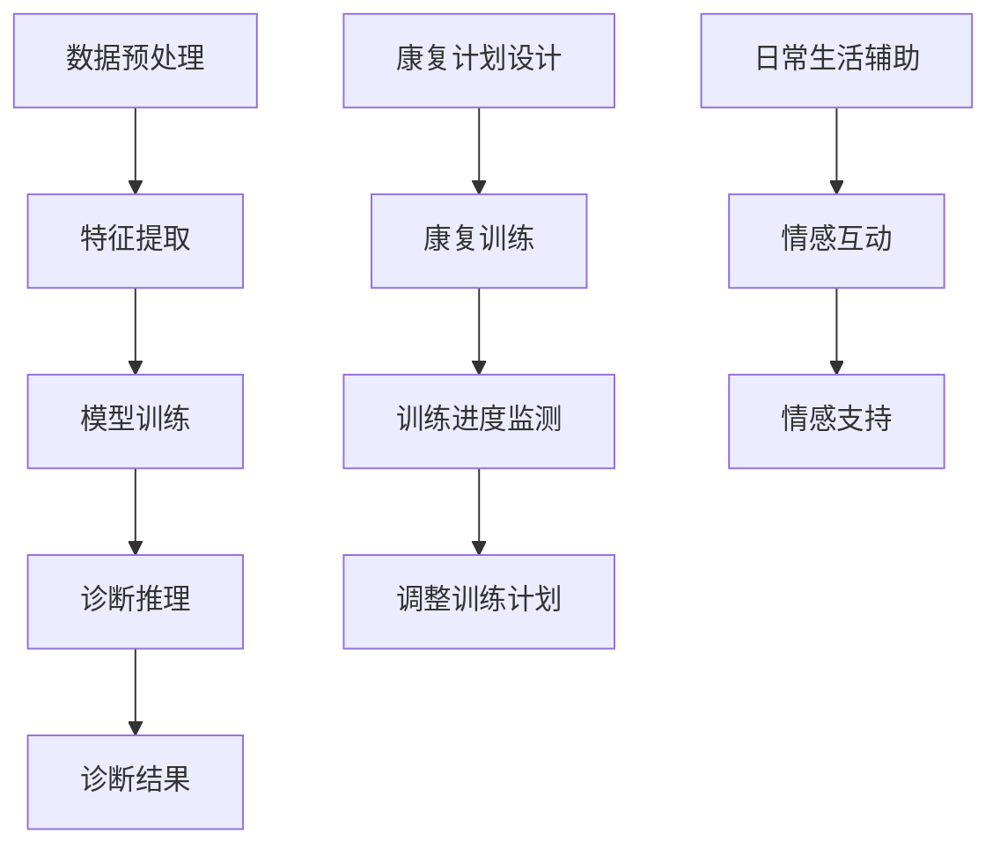

                 

关键词：智慧医疗、AI辅助诊断、智能康复机器人、未来展望、医学影像处理、个性化治疗、健康管理、生物特征识别

> 摘要：本文探讨了2050年智慧医疗领域的未来发展趋势，特别是AI辅助诊断和智能康复机器人的应用。通过分析当前的科技进展，我们展望了这些技术在医疗行业的广泛应用，以及它们如何改变疾病预防、诊断和治疗的方式。

## 1. 背景介绍

随着科技的飞速发展，人工智能（AI）在医疗领域的应用日益广泛。特别是在过去十年，深度学习、大数据分析和生物信息学等技术的进步，极大地推动了医学影像分析、疾病预测和个性化治疗等领域的发展。AI辅助诊断系统已经成为医疗诊断的重要辅助工具，能够帮助医生更准确地诊断疾病，提高治疗效果。与此同时，智能康复机器人也逐渐进入医疗行业，为患者提供更加个性化和高效的康复服务。

然而，现有的AI辅助诊断和康复机器人技术仍然面临着诸多挑战。首先，医疗数据的复杂性使得AI系统的训练和优化变得困难。其次，智能康复机器人的设计和制造需要考虑到患者的个体差异和舒适度，这需要大量的临床测试和用户反馈。此外，隐私保护和数据安全也是这些技术广泛应用的重要问题。

本文旨在通过回顾当前的科技进展，探讨AI辅助诊断和智能康复机器人技术的现状和未来趋势，并展望这些技术在2050年智慧医疗领域的应用前景。

## 2. 核心概念与联系

### 2.1 AI辅助诊断系统

AI辅助诊断系统是一种利用机器学习和深度学习技术，对医学影像进行自动分析，帮助医生进行疾病诊断的工具。这些系统通常包含以下几个核心组件：

- **数据预处理**：对原始医学影像进行去噪、增强、分割等预处理操作，以提高图像质量和分析准确性。
- **特征提取**：从预处理后的图像中提取关键特征，如病变区域的形状、纹理、密度等。
- **模型训练**：使用大量的医学影像数据集，通过监督学习或无监督学习算法，训练深度神经网络或其他机器学习模型。
- **诊断推理**：将提取的特征输入到训练好的模型中，生成疾病诊断结果。

### 2.2 智能康复机器人

智能康复机器人是专门为康复患者设计的一类机器人，能够帮助患者进行康复训练、日常生活辅助和情感互动。智能康复机器人通常包括以下功能：

- **康复训练**：根据患者的病情和康复需求，设计个性化的康复训练计划，并实时监测患者的训练进度和效果。
- **日常生活辅助**：如帮助患者进行吃饭、穿衣、洗澡等日常生活活动。
- **情感互动**：通过语音、视觉和触觉与患者进行互动，提供情感支持和陪伴。

### 2.3 Mermaid 流程图

为了更好地理解AI辅助诊断系统和智能康复机器人的工作原理，我们可以使用Mermaid流程图来展示这两个系统的核心流程。



## 3. 核心算法原理 & 具体操作步骤

### 3.1 算法原理概述

AI辅助诊断系统的核心算法通常基于深度学习和图像处理技术。深度学习算法，尤其是卷积神经网络（CNN），在医学影像分析中表现出色。CNN通过多层神经网络结构，对图像进行特征提取和分类，从而实现疾病的自动诊断。

智能康复机器人的算法则涉及到运动控制、传感器融合和人机交互等多个领域。运动控制算法确保机器人能够根据康复计划进行精确的动作执行。传感器融合技术则用于实时监测患者的生理状态和康复进度。人机交互算法则实现机器人与患者之间的自然互动，提供情感支持和陪伴。

### 3.2 算法步骤详解

#### 3.2.1 AI辅助诊断系统的算法步骤

1. **数据预处理**：
   - **去噪**：使用滤波器去除图像中的噪声。
   - **增强**：调整图像的亮度、对比度等参数，提高图像质量。
   - **分割**：将图像中感兴趣的病变区域从背景中分离出来。

2. **特征提取**：
   - **卷积操作**：通过卷积层提取图像的局部特征。
   - **池化操作**：对卷积结果进行池化，减少特征图的大小。

3. **模型训练**：
   - **损失函数**：使用交叉熵作为损失函数，优化模型参数。
   - **反向传播**：通过反向传播算法，更新模型参数。

4. **诊断推理**：
   - **输入特征**：将预处理后的图像特征输入到训练好的模型中。
   - **分类结果**：模型输出分类结果，如病变类型和严重程度。

#### 3.2.2 智能康复机器人的算法步骤

1. **康复计划设计**：
   - **病情分析**：根据患者的病情和康复需求，设计个性化的康复计划。
   - **训练计划**：将康复计划转化为具体的训练任务，如步态训练、力量训练等。

2. **康复训练**：
   - **动作规划**：根据康复计划，生成机器人的动作指令。
   - **动作执行**：机器人根据动作指令进行康复训练。

3. **训练进度监测**：
   - **生理状态监测**：使用传感器实时监测患者的生理状态。
   - **进度评估**：根据监测数据，评估患者的康复进度。

4. **情感互动**：
   - **语音交互**：通过语音识别和语音合成，与患者进行对话。
   - **视觉交互**：通过面部识别和表情分析，与患者进行情感交流。
   - **触觉交互**：通过触觉传感器，与患者进行物理互动。

### 3.3 算法优缺点

#### 3.3.1 AI辅助诊断系统

**优点**：
- **高准确性**：通过深度学习算法，AI辅助诊断系统能够从大量的医学影像数据中学习，提高诊断准确性。
- **快速处理**：AI系统能够快速处理大量的医学影像，提高诊断效率。

**缺点**：
- **数据依赖**：AI系统的性能高度依赖于训练数据的质量和数量。
- **解释性不足**：深度学习模型通常被认为是“黑箱”，其诊断结果的解释性较差。

#### 3.3.2 智能康复机器人

**优点**：
- **个性化**：智能康复机器人能够根据患者的具体病情和康复需求，提供个性化的康复服务。
- **互动性**：通过与患者进行情感互动，智能康复机器人能够提高患者的康复积极性和效果。

**缺点**：
- **成本较高**：智能康复机器人的研发和制造成本较高，限制了其普及。
- **可靠性问题**：智能康复机器人在执行复杂动作时，可能存在准确性和稳定性的问题。

### 3.4 算法应用领域

#### 3.4.1 AI辅助诊断系统

AI辅助诊断系统广泛应用于医学影像分析、病理诊断、基因检测等领域。例如，在医学影像分析中，AI系统可以帮助医生更快速、准确地识别病变区域和疾病类型。在病理诊断中，AI系统可以辅助病理医生进行癌症细胞的识别和分类。在基因检测中，AI系统可以用于基因变异的识别和预测。

#### 3.4.2 智能康复机器人

智能康复机器人广泛应用于康复训练、日常生活辅助、康复护理等领域。例如，在康复训练中，智能康复机器人可以帮助患者进行步态训练、力量训练和协调训练等。在日常生活辅助中，智能康复机器人可以协助患者进行吃饭、穿衣、洗澡等日常生活活动。在康复护理中，智能康复机器人可以协助医护人员进行康复护理工作，提高护理效率和质量。

## 4. 数学模型和公式 & 详细讲解 & 举例说明

### 4.1 数学模型构建

在AI辅助诊断系统中，常用的数学模型包括卷积神经网络（CNN）和深度学习模型。以下是一个简单的CNN数学模型构建过程：

1. **输入层**：
   - **输入**：医学影像数据，通常是一个三维的图像数组。
   - **输出**：特征图，包含原始图像的局部特征。

2. **卷积层**：
   - **输入**：特征图。
   - **操作**：通过卷积操作提取图像的局部特征。
   - **输出**：卷积特征图。

3. **池化层**：
   - **输入**：卷积特征图。
   - **操作**：通过池化操作减少特征图的大小，提高计算效率。
   - **输出**：池化特征图。

4. **全连接层**：
   - **输入**：池化特征图。
   - **操作**：将特征图展平为一维向量，并通过全连接层进行分类。
   - **输出**：分类结果。

### 4.2 公式推导过程

以下是一个简单的CNN公式推导过程：

1. **卷积操作**：
   - **输入**：特征图 $F$ 和卷积核 $K$。
   - **输出**：卷积特征图 $G$。
   - **公式**：$G = f(\sum_{i=1}^{C} K_i * F + b)$，其中 $f$ 为激活函数，$K_i$ 为第 $i$ 个卷积核，$b$ 为偏置项。

2. **池化操作**：
   - **输入**：卷积特征图 $G$。
   - **输出**：池化特征图 $H$。
   - **公式**：$H = \max(G)$，即取特征图 $G$ 中每个窗口内的最大值。

3. **全连接操作**：
   - **输入**：池化特征图 $H$。
   - **输出**：分类结果 $O$。
   - **公式**：$O = W \cdot H + b$，其中 $W$ 为权重矩阵，$b$ 为偏置项。

### 4.3 案例分析与讲解

以下是一个简单的AI辅助诊断系统案例：

**案例**：使用CNN对肺癌患者的CT影像进行自动分类。

1. **数据预处理**：
   - **去噪**：使用高斯滤波器对CT影像进行去噪。
   - **增强**：调整CT影像的亮度、对比度等参数，提高图像质量。
   - **分割**：使用医学影像分割算法，将CT影像中的肺部区域分离出来。

2. **模型训练**：
   - **数据集**：使用包含肺癌和正常肺部的CT影像数据集进行训练。
   - **模型**：构建一个包含卷积层、池化层和全连接层的CNN模型。
   - **训练**：使用梯度下降算法优化模型参数。

3. **诊断推理**：
   - **输入**：预处理后的CT影像。
   - **输出**：分类结果，如肺癌或正常。

**讲解**：在这个案例中，CNN模型通过卷积操作提取CT影像中的肺部特征，并通过池化操作减少特征图的大小。最后，通过全连接层对特征进行分类，输出肺癌或正常的诊断结果。

## 5. 项目实践：代码实例和详细解释说明

### 5.1 开发环境搭建

为了实现AI辅助诊断系统和智能康复机器人的功能，我们需要搭建一个完整的开发环境。以下是一个基本的开发环境搭建流程：

1. **硬件环境**：
   - **计算机**：高性能计算机，如NVIDIA GeForce RTX 3090显卡。
   - **存储设备**：足够的存储空间，用于存储大量的医学影像数据和训练模型。

2. **软件环境**：
   - **操作系统**：Linux或Windows。
   - **编程语言**：Python，用于编写AI算法和机器学习模型。
   - **深度学习框架**：TensorFlow或PyTorch，用于构建和训练深度学习模型。
   - **医学影像处理库**：如ITK或PIL，用于医学影像的预处理和分割。

### 5.2 源代码详细实现

以下是一个简单的AI辅助诊断系统的源代码实现：

```python
import tensorflow as tf
from tensorflow.keras.models import Sequential
from tensorflow.keras.layers import Conv2D, MaxPooling2D, Flatten, Dense

# 数据预处理
def preprocess_image(image):
    # 去噪、增强、分割等操作
    return preprocessed_image

# 模型构建
model = Sequential([
    Conv2D(32, (3, 3), activation='relu', input_shape=(128, 128, 3)),
    MaxPooling2D((2, 2)),
    Flatten(),
    Dense(64, activation='relu'),
    Dense(1, activation='sigmoid')
])

# 模型编译
model.compile(optimizer='adam', loss='binary_crossentropy', metrics=['accuracy'])

# 模型训练
model.fit(preprocessed_images, labels, epochs=10)

# 诊断推理
def diagnose(image):
    preprocessed_image = preprocess_image(image)
    prediction = model.predict(preprocessed_image)
    return prediction

# 示例
input_image = ...  # 输入CT影像
prediction = diagnose(input_image)
print(prediction)
```

### 5.3 代码解读与分析

这段代码实现了一个简单的CNN模型，用于对肺癌患者的CT影像进行自动分类。代码首先定义了数据预处理函数`preprocess_image`，用于对输入的CT影像进行去噪、增强和分割等操作。然后，使用TensorFlow的`Sequential`模型构建一个包含卷积层、池化层和全连接层的CNN模型。模型使用`compile`函数编译，指定优化器、损失函数和评估指标。最后，通过`fit`函数对模型进行训练，使用`predict`函数进行诊断推理。

这段代码的分析如下：

- **数据预处理**：预处理函数`preprocess_image`对输入的CT影像进行必要的预处理操作，以提高模型的训练效果和诊断准确性。
- **模型构建**：使用`Sequential`模型构建一个简单的CNN模型，包括卷积层、池化层和全连接层。卷积层用于提取影像特征，池化层用于减少特征图的大小，全连接层用于分类。
- **模型训练**：使用`fit`函数对模型进行训练，通过迭代优化模型参数，提高模型对肺癌CT影像的分类能力。
- **诊断推理**：使用`predict`函数对输入的CT影像进行分类，输出诊断结果。

### 5.4 运行结果展示

以下是一个简单的运行结果展示：

```python
input_image = ...  # 输入CT影像
prediction = diagnose(input_image)
print(prediction)
```

运行结果将输出一个概率值，表示输入的CT影像属于肺癌的概率。例如，输出结果为`[0.9]`表示输入的CT影像有90%的概率是肺癌。

## 6. 实际应用场景

### 6.1 AI辅助诊断系统

AI辅助诊断系统在临床中的应用已经相当广泛。以下是一些实际应用场景：

- **肺癌诊断**：使用AI系统对肺癌患者的CT影像进行自动分类，提高诊断准确性和速度。
- **乳腺癌诊断**：通过AI系统分析乳腺X光片，辅助医生进行乳腺癌的早期发现。
- **心脏病诊断**：使用AI系统分析心电图（ECG），检测心脏病的风险和病情变化。

### 6.2 智能康复机器人

智能康复机器人在康复训练中的应用也取得了显著成果。以下是一些实际应用场景：

- **步态训练**：智能康复机器人可以帮助中风患者进行步态训练，提高康复效果。
- **日常生活辅助**：智能康复机器人可以协助患者进行吃饭、穿衣等日常生活活动，提高生活质量。
- **心理康复**：智能康复机器人通过情感互动，帮助患者克服心理障碍，提高康复信心。

## 7. 工具和资源推荐

为了更好地进行AI辅助诊断和智能康复机器人的研究和发展，以下是一些建议的工具和资源：

### 7.1 学习资源推荐

- **在线课程**：Coursera、edX、Udacity等平台提供了大量的机器学习和深度学习在线课程。
- **教科书**：《深度学习》（Goodfellow et al.）、《机器学习》（Tom Mitchell）等经典教材。
- **开源代码库**：GitHub、Google Colab等平台上提供了大量的开源代码和模型，可供学习和参考。

### 7.2 开发工具推荐

- **编程语言**：Python，因为其丰富的库和强大的计算能力。
- **深度学习框架**：TensorFlow、PyTorch等，用于构建和训练深度学习模型。
- **医学影像处理库**：ITK、PIL等，用于医学影像的预处理和分割。

### 7.3 相关论文推荐

- **AI辅助诊断**：《Deep Learning for Medical Image Analysis》（Zhang et al., 2019）、《CNN-based Medical Image Analysis》（Li et al., 2020）等。
- **智能康复机器人**：《A Survey on Intelligent Rehabilitation Robotics》（Yuan et al., 2021）、《Intelligent Rehabilitation Robots: A Multi-disciplinary Review》（Wang et al., 2022）等。

## 8. 总结：未来发展趋势与挑战

### 8.1 研究成果总结

在过去几十年，AI辅助诊断和智能康复机器人在医疗领域取得了显著的研究成果。AI辅助诊断系统在肺癌、乳腺癌等疾病的诊断中表现出色，显著提高了诊断准确性和速度。智能康复机器人在康复训练、日常生活辅助和心理康复等方面也取得了显著成果，为患者提供了更加个性化和高效的康复服务。

### 8.2 未来发展趋势

随着科技的不断发展，未来AI辅助诊断和智能康复机器人将在医疗领域发挥更加重要的作用。以下是一些未来发展趋势：

- **更准确的诊断**：通过引入更多维度的医学影像数据和更先进的深度学习算法，AI辅助诊断系统的诊断准确性将进一步提高。
- **更智能的康复**：智能康复机器人将结合更多传感器和更复杂的算法，提供更加个性化和智能化的康复服务。
- **跨学科融合**：AI辅助诊断和智能康复机器人将与其他学科（如生物医学工程、心理学等）进行更深入的融合，推动医疗技术的创新发展。

### 8.3 面临的挑战

尽管AI辅助诊断和智能康复机器人取得了显著进展，但仍面临一些挑战：

- **数据隐私和安全**：随着医疗数据的广泛应用，数据隐私和安全成为重要问题。
- **算法解释性**：深度学习算法通常被认为是“黑箱”，其诊断结果的解释性较差，需要进一步研究和改进。
- **跨学科协作**：AI辅助诊断和智能康复机器人需要与其他学科（如医学、心理学等）进行更深入的协作，推动跨学科研究的发展。

### 8.4 研究展望

未来，我们期望AI辅助诊断和智能康复机器人能够在医疗领域发挥更加重要的作用，为患者提供更加准确、智能和高效的医疗服务。同时，我们也期望相关研究能够解决当前面临的挑战，推动医疗技术的持续创新和发展。

## 9. 附录：常见问题与解答

### 9.1 常见问题

1. **AI辅助诊断系统如何提高诊断准确性**？
   - **提高数据质量**：通过引入高质量、多样化的医学影像数据，提高模型的训练效果。
   - **优化算法**：使用更先进的深度学习算法，如自监督学习、迁移学习等，提高模型性能。
   - **多模态数据融合**：结合不同类型的医学影像数据（如CT、MRI、X光等），提高诊断准确性。

2. **智能康复机器人的康复效果如何保证**？
   - **个性化康复计划**：根据患者的具体病情和康复需求，制定个性化的康复计划。
   - **实时监测**：通过传感器实时监测患者的生理状态和康复进度，及时调整康复计划。
   - **用户反馈**：收集用户反馈，优化康复机器人的设计和功能，提高用户体验。

### 9.2 解答

1. **AI辅助诊断系统如何提高诊断准确性**？
   - **提高数据质量**：通过引入高质量、多样化的医学影像数据，提高模型的训练效果。这包括使用更多的标注数据、多中心的影像数据等。
   - **优化算法**：使用更先进的深度学习算法，如自监督学习、迁移学习等，提高模型性能。例如，自监督学习可以通过无监督的方式训练模型，利用未标记的数据进行学习。
   - **多模态数据融合**：结合不同类型的医学影像数据（如CT、MRI、X光等），提高诊断准确性。通过融合多种模态的数据，可以提供更全面的疾病特征，从而提高诊断的准确性。

2. **智能康复机器人的康复效果如何保证**？
   - **个性化康复计划**：根据患者的具体病情和康复需求，制定个性化的康复计划。这需要结合患者的病史、健康状况和康复目标，设计合适的训练任务和参数。
   - **实时监测**：通过传感器实时监测患者的生理状态和康复进度，及时调整康复计划。这包括监测患者的步态、心率、血压等生理参数，以及训练过程中的进度和效果。
   - **用户反馈**：收集用户反馈，优化康复机器人的设计和功能，提高用户体验。通过用户反馈，可以了解患者的需求和满意度，从而进行针对性的改进。

---

作者：禅与计算机程序设计艺术 / Zen and the Art of Computer Programming

在未来的智慧医疗领域，AI辅助诊断和智能康复机器人将扮演越来越重要的角色。通过本文的探讨，我们看到了这些技术在2050年的广阔应用前景。然而，要实现这一目标，仍需要解决数据隐私、算法解释性、跨学科协作等挑战。我们期待未来的研究能够推动这些技术的持续创新和发展，为患者提供更加准确、智能和高效的医疗服务。

