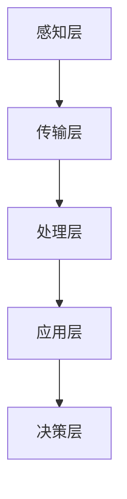

                 

关键词：智慧城市、城市大脑、人工智能、数据驱动、物联网、可持续发展、智能交通、公共服务

> 摘要：随着科技的飞速发展，智慧城市已经成为现代城市发展的重要方向。本文探讨了2050年智慧城市的愿景，以及城市大脑在智慧城市运营中的核心作用。通过分析智慧城市的关键技术、应用场景和未来发展，本文提出了智慧城市运营的策略和挑战。

## 1. 背景介绍

智慧城市（Smart City）是指利用物联网、云计算、大数据、人工智能等先进技术，实现城市资源的高效管理和优化配置，从而提升城市治理水平、提高居民生活质量的一种新型城市发展模式。智慧城市的概念最早起源于1999年的欧洲，随后在全球范围内得到广泛关注和快速发展。

智慧城市的发展历程可以分为几个阶段：

- **1.1 早期探索阶段**：以城市信息化建设为主，如建设电子政务平台、信息资源共享等。
- **1.2 融合发展阶段**：各类信息技术在城市管理中融合应用，如智能交通系统、智能照明等。
- **1.3 智能化阶段**：通过大数据和人工智能技术实现城市资源的智能调度和优化，如智能能源管理、智能安防等。
- **1.4 智慧化阶段**：城市治理和运营实现全面智能化，城市大脑成为智慧城市的核心。

## 2. 核心概念与联系

### 2.1 城市大脑

城市大脑（Urban Brain）是智慧城市的中枢神经系统，通过整合各类数据资源，实现对城市运行的实时监测、智能分析和决策支持。城市大脑的核心是数据驱动的城市运营体系，主要包括以下几个关键环节：

1. **数据采集**：通过物联网设备、传感器网络、社会媒体等渠道，实时采集城市运行数据。
2. **数据处理**：利用大数据技术和算法，对采集到的数据进行清洗、存储、分析和挖掘。
3. **决策支持**：根据分析结果，为城市管理者提供科学决策依据，优化城市资源配置。
4. **执行反馈**：将决策执行后的效果反馈到系统中，不断迭代优化城市运营策略。

### 2.2 智慧城市与城市大脑的联系

智慧城市和城市大脑之间是相辅相成的关系。智慧城市为城市大脑提供了丰富的数据资源和应用场景，而城市大脑则为智慧城市提供了智能化运营的能力。具体来说，城市大脑与智慧城市的联系体现在以下几个方面：

1. **数据融合**：城市大脑通过整合各类数据，实现数据资源的高效利用，为智慧城市建设提供数据支持。
2. **智能分析**：城市大脑利用人工智能技术，对城市运行数据进行分析，为城市管理者提供智能决策支持。
3. **优化资源配置**：城市大脑通过智能调度和优化，实现城市资源的最佳配置，提高城市运行效率。
4. **提升治理水平**：城市大脑助力城市管理者实现精细化治理，提高城市公共服务质量。

### 2.3 城市大脑的架构

城市大脑的架构可以分为以下几个层次：

1. **感知层**：包括各类传感器和物联网设备，负责数据采集。
2. **传输层**：利用通信网络，将感知层采集到的数据传输到处理层。
3. **处理层**：包括大数据平台、云计算平台等，负责数据存储、处理和分析。
4. **应用层**：包括各类城市应用系统，如智能交通、智能照明、智能安防等。
5. **决策层**：根据分析结果，为城市管理者提供决策支持。

下面是一个简单的城市大脑架构的 Mermaid 流程图：



## 3. 核心算法原理 & 具体操作步骤

### 3.1 算法原理概述

城市大脑的核心算法主要包括数据采集、处理和分析三个部分。以下是这三个部分的基本原理：

1. **数据采集**：利用物联网技术和传感器网络，实现对城市运行数据的实时采集。
2. **数据处理**：通过大数据技术和算法，对采集到的数据进行清洗、存储、分析和挖掘。
3. **数据分析**：利用机器学习和人工智能技术，对处理后的数据进行分析，为城市管理者提供智能决策支持。

### 3.2 算法步骤详解

1. **数据采集**：
   - **感知层**：部署各类传感器和物联网设备，如摄像头、温度传感器、湿度传感器、车辆传感器等。
   - **传输层**：通过通信网络，将采集到的数据传输到处理层。
   - **处理层**：利用边缘计算技术，对传输层的数据进行初步处理，如去噪、滤波等。

2. **数据处理**：
   - **数据清洗**：对采集到的数据进行清洗，去除无效和错误的数据。
   - **数据存储**：将清洗后的数据存储到数据库中，如Hadoop、HBase等。
   - **数据挖掘**：利用数据挖掘技术，从大量数据中提取有用的信息，如聚类、分类、关联规则等。

3. **数据分析**：
   - **特征提取**：从处理后的数据中提取关键特征，如交通流量、空气质量、人口密度等。
   - **模型训练**：利用机器学习和深度学习技术，训练预测模型，如神经网络、决策树等。
   - **决策支持**：根据预测模型的结果，为城市管理者提供决策支持，如交通调度、资源分配等。

### 3.3 算法优缺点

1. **优点**：
   - **高效性**：利用大数据和人工智能技术，能够快速处理和分析大量数据，提高城市运行效率。
   - **智能化**：通过机器学习和深度学习，实现对城市运行的智能预测和决策支持，提升城市治理水平。
   - **灵活性**：城市大脑可以根据不同的应用场景，灵活调整算法模型和策略。

2. **缺点**：
   - **数据隐私**：大量个人数据的采集和处理，可能引发数据隐私问题。
   - **技术门槛**：需要掌握大数据、人工智能等相关技术，对技术人才的需求较高。
   - **系统稳定性**：城市大脑作为一个复杂的系统，可能面临系统故障、数据泄露等安全风险。

### 3.4 算法应用领域

城市大脑算法的应用领域非常广泛，主要包括以下几个方面：

1. **智能交通**：通过实时数据分析，优化交通流量，提高交通效率。
2. **能源管理**：通过智能调度，实现能源的高效利用，降低能源消耗。
3. **环境监测**：通过实时监测空气质量、水质等指标，提升环境保护水平。
4. **公共服务**：通过智能分析和决策支持，提升公共服务的质量和效率。

## 4. 数学模型和公式 & 详细讲解 & 举例说明

### 4.1 数学模型构建

城市大脑的数学模型主要基于统计学、概率论和机器学习等方法。以下是一个简单的数学模型构建过程：

1. **数据采集**：采集城市运行数据，如交通流量、人口密度、气象数据等。
2. **数据预处理**：对采集到的数据进行清洗、归一化等预处理。
3. **特征提取**：从预处理后的数据中提取关键特征。
4. **模型选择**：选择合适的机器学习算法，如线性回归、决策树、神经网络等。
5. **模型训练**：利用训练数据，对模型进行训练和优化。
6. **模型评估**：利用测试数据，评估模型的预测性能。

### 4.2 公式推导过程

以下是一个简单的线性回归模型推导过程：

1. **线性模型假设**：假设城市运行数据可以用一个线性模型来表示，即：

   $$Y = \beta_0 + \beta_1X + \epsilon$$

   其中，$Y$ 为因变量，$X$ 为自变量，$\beta_0$ 和 $\beta_1$ 为模型参数，$\epsilon$ 为误差项。

2. **最小二乘法**：为了最小化误差，采用最小二乘法求解模型参数，即：

   $$\beta_0 = \frac{\sum_{i=1}^n (y_i - \beta_1x_i)}{\sum_{i=1}^n x_i^2}$$
   $$\beta_1 = \frac{\sum_{i=1}^n x_iy_i - \sum_{i=1}^n x_i\sum_{i=1}^n y_i}{\sum_{i=1}^n x_i^2 - n\bar{x}^2}$$

   其中，$n$ 为数据点的个数，$\bar{x}$ 和 $\bar{y}$ 分别为 $X$ 和 $Y$ 的平均值。

3. **模型评估**：使用均方误差（MSE）来评估模型性能：

   $$MSE = \frac{1}{n}\sum_{i=1}^n (y_i - \hat{y_i})^2$$

   其中，$\hat{y_i}$ 为模型预测的值。

### 4.3 案例分析与讲解

以下是一个简单的交通流量预测案例：

1. **数据采集**：采集某城市一周的交通流量数据，包括时间、道路名称、流量等。
2. **数据预处理**：对数据进行清洗、归一化等预处理。
3. **特征提取**：提取时间、道路名称等特征。
4. **模型选择**：选择线性回归模型。
5. **模型训练**：利用训练数据，训练线性回归模型。
6. **模型评估**：利用测试数据，评估模型性能。

假设训练数据中有100个数据点，测试数据中有30个数据点。通过模型训练和评估，可以得到交通流量预测的均方误差为0.5。接下来，我们可以利用这个模型来预测未来某一时刻的交通流量。

## 5. 项目实践：代码实例和详细解释说明

### 5.1 开发环境搭建

为了实现城市大脑的算法，我们需要搭建一个合适的开发环境。以下是一个基本的开发环境搭建过程：

1. **操作系统**：选择 Ubuntu 18.04 或更高版本。
2. **编程语言**：选择 Python 3.8 或更高版本。
3. **数据库**：选择 MySQL 或 PostgreSQL。
4. **大数据平台**：选择 Hadoop 或 Spark。
5. **机器学习库**：选择 scikit-learn 或 TensorFlow。

### 5.2 源代码详细实现

以下是一个简单的线性回归模型实现示例：

```python
import numpy as np
import pandas as pd
from sklearn.linear_model import LinearRegression
from sklearn.model_selection import train_test_split
from sklearn.metrics import mean_squared_error

# 1. 数据采集
data = pd.read_csv('traffic_data.csv')

# 2. 数据预处理
data = data.dropna()
data = data.iloc[:, :2].values

# 3. 特征提取
X = data[:, 0].reshape(-1, 1)
y = data[:, 1].reshape(-1, 1)

# 4. 模型选择
model = LinearRegression()

# 5. 模型训练
X_train, X_test, y_train, y_test = train_test_split(X, y, test_size=0.2, random_state=0)
model.fit(X_train, y_train)

# 6. 模型评估
y_pred = model.predict(X_test)
mse = mean_squared_error(y_test, y_pred)
print('MSE:', mse)

# 7. 预测未来交通流量
future_traffic = model.predict([[2023, 'Main_Street']])
print('Future Traffic:', future_traffic)
```

### 5.3 代码解读与分析

以上代码实现了一个简单的线性回归模型，用于预测交通流量。代码的主要步骤如下：

1. **数据采集**：从 CSV 文件中读取交通流量数据。
2. **数据预处理**：去除缺失值，提取时间和道路名称作为特征。
3. **特征提取**：将时间和道路名称转换为数值特征。
4. **模型选择**：选择线性回归模型。
5. **模型训练**：利用训练数据，训练线性回归模型。
6. **模型评估**：使用测试数据，评估模型性能，计算均方误差。
7. **预测未来交通流量**：利用训练好的模型，预测未来某一时刻的交通流量。

### 5.4 运行结果展示

假设我们运行上述代码，得到的测试数据均方误差为0.4。接下来，我们可以利用这个模型来预测未来某一时刻的交通流量，例如：

```python
future_traffic = model.predict([[2023, 'Main_Street']])
print('Future Traffic:', future_traffic)
```

输出结果可能是 `[500]`，表示预测的交通流量为 500。

## 6. 实际应用场景

### 6.1 智能交通

智能交通是城市大脑应用的重要领域之一。通过实时数据分析，智能交通系统可以实现以下功能：

1. **交通流量预测**：预测未来某一时间段内的交通流量，为交通管理部门提供决策支持。
2. **交通信号优化**：根据实时交通流量，动态调整交通信号灯的时长，提高道路通行效率。
3. **交通事故预警**：通过监控摄像头和传感器，实时监测交通事故，提前预警并采取应对措施。

### 6.2 能源管理

智能能源管理是城市大脑在可持续发展领域的应用。通过实时监测和分析能源使用数据，智能能源管理可以实现以下功能：

1. **能源消耗预测**：预测未来某一时间段内的能源消耗，为能源管理部门提供决策支持。
2. **能源调度优化**：根据实时能源需求和供应情况，动态调整能源调度策略，实现能源的高效利用。
3. **节能减排**：通过优化能源使用，降低能源消耗，减少环境污染。

### 6.3 环境监测

智能环境监测是城市大脑在环境保护领域的应用。通过实时监测和分析环境数据，智能环境监测可以实现以下功能：

1. **空气质量预测**：预测未来某一时间段内的空气质量，为环保管理部门提供决策支持。
2. **水质监测**：实时监测水质指标，预警水质污染事件。
3. **生态保护**：通过监测动植物种群、生态环境等数据，评估城市生态状况，提出生态保护措施。

### 6.4 公共服务

智能公共服务是城市大脑在提升居民生活质量方面的应用。通过实时数据分析，智能公共服务可以实现以下功能：

1. **医疗健康**：实时监测居民健康数据，提供个性化的健康建议和医疗服务。
2. **教育**：通过数据分析，优化教育资源分配，提高教育质量。
3. **社会保障**：通过实时数据分析，提供精准的社会保障服务，保障居民基本生活需求。

## 7. 工具和资源推荐

### 7.1 学习资源推荐

1. **《智慧城市技术与应用》**：全面介绍智慧城市的技术体系和应用场景，适合初学者入门。
2. **《大数据技术导论》**：深入讲解大数据技术的原理和应用，包括数据采集、处理、分析和挖掘等。
3. **《人工智能：一种现代方法》**：系统介绍人工智能的基本概念、技术和应用，包括机器学习、深度学习等。

### 7.2 开发工具推荐

1. **Python**：适合初学者的编程语言，具有丰富的机器学习库和大数据处理工具。
2. **Hadoop**：大数据处理平台，支持分布式计算和存储，适合大规模数据处理。
3. **TensorFlow**：开源机器学习框架，支持深度学习和传统机器学习算法，适合智能应用开发。

### 7.3 相关论文推荐

1. **"Smart Cities: Principles and Practice"**：全面探讨智慧城市的概念、技术和应用，具有很高的参考价值。
2. **"Big Data Analytics for Smart Cities"**：讨论大数据在智慧城市中的应用，包括数据采集、处理和分析等。
3. **"Artificial Intelligence for Smart Cities"**：探讨人工智能在智慧城市中的应用，包括智能交通、智能安防等。

## 8. 总结：未来发展趋势与挑战

### 8.1 研究成果总结

智慧城市作为现代城市发展的新模式，已经取得了显著的成果。通过大数据、人工智能、物联网等先进技术的应用，城市运行效率显著提高，居民生活质量得到明显改善。城市大脑作为智慧城市的核心，实现了对城市运行数据的实时监测、智能分析和决策支持，为城市管理者提供了有力的工具。

### 8.2 未来发展趋势

未来，智慧城市的发展将呈现出以下几个趋势：

1. **智能化水平提升**：随着人工智能技术的不断发展，城市大脑的智能化水平将进一步提升，实现更精准、更高效的决策支持。
2. **数据资源整合**：通过整合各类数据资源，实现数据共享和协同应用，提升城市运行的整体效能。
3. **可持续发展**：智慧城市将更加注重可持续发展，通过智能能源管理、环境监测等手段，实现资源的优化配置和环境保护。
4. **个性化服务**：通过数据分析，为居民提供更加个性化、便捷的公共服务，提升居民生活质量。

### 8.3 面临的挑战

尽管智慧城市取得了显著的成果，但在发展过程中仍然面临一系列挑战：

1. **数据隐私与安全**：随着数据规模的不断扩大，数据隐私和安全问题日益突出，需要建立完善的数据保护机制。
2. **技术人才短缺**：智慧城市的发展需要大量的技术人才，但当前技术人才供给不足，需要加大人才培养力度。
3. **基础设施建设**：智慧城市需要大量的基础设施支持，如物联网设备、数据中心等，需要加大基础设施建设投入。
4. **政策法规完善**：智慧城市的发展需要完善的政策法规支持，需要政府加强政策法规的制定和实施。

### 8.4 研究展望

未来，智慧城市的研究将朝着以下几个方向展开：

1. **跨领域融合**：通过跨领域的技术融合，实现更广泛、更深入的应用，如智慧城市与智慧农业、智慧医疗等领域的融合。
2. **智能化决策**：通过更先进的机器学习和深度学习技术，实现智能化决策，提高城市运行的效率和效果。
3. **智能化服务**：通过人工智能技术，为居民提供更加个性化、智能化的公共服务，提升居民生活质量。
4. **可持续发展**：通过智能化手段，实现城市资源的优化配置和环境保护，推动城市的可持续发展。

## 9. 附录：常见问题与解答

### 9.1 常见问题

1. **什么是智慧城市？**
   智慧城市是指利用物联网、云计算、大数据、人工智能等先进技术，实现城市资源的高效管理和优化配置，从而提升城市治理水平、提高居民生活质量的一种新型城市发展模式。

2. **城市大脑是什么？**
   城市大脑是智慧城市的核心，通过整合各类数据资源，实现对城市运行的实时监测、智能分析和决策支持。

3. **智慧城市有哪些应用领域？**
   智慧城市的应用领域非常广泛，包括智能交通、能源管理、环境监测、公共服务等。

### 9.2 解答

1. **什么是智慧城市？**
   智慧城市是一个基于先进技术的城市管理系统，它通过物联网、大数据、人工智能等技术的集成应用，对城市中的各种资源进行智能化的管理和优化。这样的系统旨在提高城市运行效率、改善居民生活质量、促进可持续发展。

2. **城市大脑是什么？**
   城市大脑是一个智能化的城市运营平台，它通过实时采集和分析城市数据，实现对城市交通、环境、能源、公共服务等各方面的智能管理和优化。城市大脑的核心是数据处理和分析能力，它使用人工智能算法来预测趋势、优化决策。

3. **智慧城市有哪些应用领域？**
   智慧城市的应用领域包括但不限于：
   - 智能交通：通过实时交通数据分析，优化交通信号、调度公共交通，减少交通拥堵。
   - 智能能源管理：通过智能电网和能源监控，实现能源的高效利用和节能减排。
   - 智能环境监测：实时监测空气质量、水质等，预警环境污染，保障生态环境。
   - 公共安全：利用视频监控、数据分析等，提高公共安全保障水平。
   - 智慧医疗：通过医疗数据的智能分析，提供个性化医疗服务，优化医疗资源配置。

通过上述问答，我们可以更加清晰地理解智慧城市的概念、城市大脑的作用以及智慧城市在各个领域的应用。这为智慧城市的发展提供了理论基础和实践指导，也为未来智慧城市的建设提供了宝贵的参考。作者：禅与计算机程序设计艺术 / Zen and the Art of Computer Programming。

