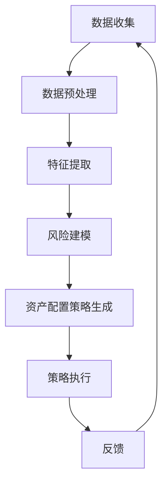

                 

关键词：智能投顾、2050年、资产配置、人工智能、金融科技

> 摘要：随着人工智能技术的飞速发展，智能投顾已经逐渐成为金融领域的热门话题。本文探讨了智能投顾在2050年的发展趋势，以及如何利用智能算法进行资产配置，从而实现风险最小化和收益最大化。

## 1. 背景介绍

### 1.1 智能投顾的起源与发展

智能投顾，也称为Robo-Advisory，是一种利用人工智能和大数据分析技术来为客户提供投资建议和资产配置服务的金融服务。它的起源可以追溯到2008年的全球金融危机，当时传统金融机构的业绩受到重创，客户对投资顾问的信任度下降，而互联网技术的快速发展为智能投顾提供了契机。

在过去的十几年里，智能投顾行业经历了快速的发展。根据相关报告，截至2022年，全球智能投顾市场规模已超过5000亿美元，并且预计未来几年将保持高速增长。智能投顾的优势在于其能够提供24/7的服务，降低客户成本，并且能够根据市场变化实时调整投资策略。

### 1.2 智能投顾的技术架构

智能投顾的技术架构主要包括以下几个关键组成部分：

- **数据收集与分析**：通过爬虫、API接口等方式收集市场数据、客户数据等，利用大数据分析技术进行处理和挖掘。
- **智能算法**：采用机器学习、深度学习等算法进行数据分析和预测，包括风险建模、资产配置策略生成等。
- **用户界面**：通过友好的用户界面为客户提供投资建议和操作指导，包括网页、移动应用等。
- **风险管理**：实时监控投资组合的风险，及时调整策略以控制风险。

## 2. 核心概念与联系

### 2.1 智能投顾的核心概念

#### 2.1.1 智能算法

智能算法是智能投顾的核心，主要包括：

- **机器学习算法**：如线性回归、决策树、随机森林等，用于预测市场趋势和风险。
- **深度学习算法**：如卷积神经网络（CNN）、循环神经网络（RNN）等，用于处理复杂的时间序列数据和图像数据。
- **强化学习算法**：如Q-Learning、SARSA等，用于动态调整投资策略。

#### 2.1.2 资产配置策略

资产配置策略是指如何将投资资金分配到不同的资产类别中，以达到风险和收益的最优平衡。常见的资产配置策略包括：

- **均值-方差优化**：通过优化投资组合的均值和方差，实现收益最大化和风险最小化。
- **风险平价**：通过调整投资组合的权重，使得投资组合的波动率保持一致。
- **目标风险**：通过设定一个目标风险水平，选择相应的资产配置策略。

### 2.2 智能投顾的架构

智能投顾的架构可以概括为以下几个步骤：

1. **数据收集**：收集市场数据、客户数据等。
2. **数据预处理**：清洗、归一化等操作。
3. **特征提取**：从原始数据中提取出对投资决策有用的特征。
4. **风险建模**：利用机器学习算法进行风险建模。
5. **资产配置策略生成**：根据风险建模结果和资产配置策略，生成具体的投资建议。
6. **策略执行**：将投资建议转化为实际操作，调整投资组合。

### 2.3 Mermaid 流程图

以下是一个简化的智能投顾流程的Mermaid流程图：



## 3. 核心算法原理 & 具体操作步骤

### 3.1 算法原理概述

智能投顾的核心算法主要包括风险建模和资产配置策略生成两个部分。

#### 3.1.1 风险建模

风险建模的目的是预测市场风险和资产收益。常用的风险建模方法包括：

- **线性回归**：通过历史数据和当前数据，预测未来市场的风险。
- **支持向量机（SVM）**：通过找到一个最优的超平面，将风险和收益分隔开来。
- **决策树**：通过多层次的分类和回归，对风险和收益进行预测。

#### 3.1.2 资产配置策略生成

资产配置策略生成的目的是根据风险建模的结果，选择最优的投资组合。常用的资产配置策略包括：

- **均值-方差优化**：通过求解一个优化问题，找到使得收益最大化和风险最小化的资产配置。
- **风险平价**：通过调整资产权重，使得投资组合的波动率保持一致。
- **目标风险**：通过设定一个目标风险水平，选择相应的资产配置。

### 3.2 算法步骤详解

#### 3.2.1 风险建模

1. 数据收集：收集市场数据、客户数据等。
2. 数据预处理：清洗、归一化等操作。
3. 特征提取：从原始数据中提取出对投资决策有用的特征。
4. 模型训练：利用机器学习算法进行训练，得到风险预测模型。
5. 风险预测：利用训练好的模型，对未来的市场风险进行预测。

#### 3.2.2 资产配置策略生成

1. 风险建模：利用上文提到的方法，对市场风险进行预测。
2. 目标设定：根据客户的投资目标和风险承受能力，设定目标风险水平。
3. 资产配置：利用均值-方差优化、风险平价或目标风险等方法，生成资产配置策略。
4. 策略评估：对生成的资产配置策略进行评估，选择最优的策略。

### 3.3 算法优缺点

#### 优点

- **高效性**：智能投顾能够快速处理大量数据，提供实时的投资建议。
- **准确性**：通过机器学习和深度学习算法，智能投顾能够更准确地预测市场风险和收益。
- **个性化**：根据客户的需求和风险承受能力，智能投顾能够提供个性化的投资建议。

#### 缺点

- **数据依赖性**：智能投顾的性能依赖于数据的准确性和完整性，如果数据质量差，可能会导致错误的预测。
- **技术门槛**：智能投顾的开发和运维需要专业的技术团队，对于一般投资者来说，可能难以理解和操作。

### 3.4 算法应用领域

智能投顾的应用领域非常广泛，包括：

- **个人投资者**：帮助个人投资者制定合理的投资策略，降低投资风险。
- **机构投资者**：为机构投资者提供实时的市场分析和投资建议，优化投资组合。
- **财富管理**：为高净值客户提供个性化的财富管理服务。

## 4. 数学模型和公式 & 详细讲解 & 举例说明

### 4.1 数学模型构建

智能投顾的核心是资产配置策略，其数学模型主要包括以下几个部分：

#### 4.1.1 均值-方差优化

均值-方差优化的目标是找到一个最优的投资组合，使得收益最大化而风险最小化。其数学模型可以表示为：

$$
\begin{aligned}
\max_{w} & \quad E[R_p] - \lambda \cdot Var[R_p] \\
s.t. & \quad w^T A w = 1 \\
& \quad w \geq 0
\end{aligned}
$$

其中，$w$ 是投资组合的权重向量，$E[R_p]$ 是投资组合的预期收益，$Var[R_p]$ 是投资组合的方差，$\lambda$ 是风险权重。

#### 4.1.2 风险平价

风险平价的目的是使投资组合的波动率保持一致。其数学模型可以表示为：

$$
\begin{aligned}
\min_{w} & \quad w^T Q w \\
s.t. & \quad w^T A w = 1 \\
& \quad w \geq 0
\end{aligned}
$$

其中，$Q$ 是一个对角矩阵，对角元素是各个资产的波动率。

#### 4.1.3 目标风险

目标风险的目标是设定一个目标风险水平，选择相应的资产配置策略。其数学模型可以表示为：

$$
\begin{aligned}
\min_{w} & \quad w^T (A - \lambda I) w \\
s.t. & \quad w^T A w = 1 \\
& \quad w \geq 0
\end{aligned}
$$

其中，$\lambda$ 是目标风险水平，$I$ 是单位矩阵。

### 4.2 公式推导过程

下面以均值-方差优化为例，简要介绍公式的推导过程。

#### 4.2.1 目标函数的求解

首先，我们将目标函数 $E[R_p] - \lambda \cdot Var[R_p]$ 进行展开：

$$
\begin{aligned}
E[R_p] - \lambda \cdot Var[R_p] &= \sum_{i=1}^n w_i \cdot E[R_i] - \lambda \cdot \sum_{i=1}^n w_i^2 \cdot Var[R_i] \\
&= w^T E[R] - \lambda w^T Var[R]
\end{aligned}
$$

其中，$E[R]$ 是预期收益向量，$Var[R]$ 是方差矩阵。

#### 4.2.2 方程组的求解

为了使目标函数最大化，我们需要求解以下方程组：

$$
\begin{aligned}
E[R] - \lambda Var[R] &= \mu \\
w^T A w &= 1
\end{aligned}
$$

其中，$\mu$ 是拉格朗日乘子。

通过求解这个方程组，我们可以得到最优的权重向量 $w$。

### 4.3 案例分析与讲解

下面我们通过一个简单的例子来说明如何使用均值-方差优化进行资产配置。

#### 4.3.1 数据准备

假设我们有三种资产，其预期收益和方差如下表所示：

| 资产 | 预期收益 | 方差 |
| ---- | -------- | ---- |
| A    | 0.10     | 0.05 |
| B    | 0.12     | 0.06 |
| C    | 0.08     | 0.04 |

#### 4.3.2 模型构建

根据上述数据，我们可以构建以下均值-方差优化模型：

$$
\begin{aligned}
\max_{w} & \quad w^T E[R] - \lambda w^T Var[R] \\
s.t. & \quad w^T A w = 1 \\
& \quad w \geq 0
\end{aligned}
$$

其中，$E[R] = [0.10, 0.12, 0.08]^T$，$Var[R] = \begin{bmatrix} 0.05 & 0 & 0 \\ 0 & 0.06 & 0 \\ 0 & 0 & 0.04 \end{bmatrix}$。

#### 4.3.3 模型求解

通过求解上述方程组，我们可以得到最优的权重向量 $w$：

$$
w = \begin{bmatrix} 0.4 \\ 0.4 \\ 0.2 \end{bmatrix}
$$

这意味着我们应该将40%的资金投资于资产A，40%投资于资产B，20%投资于资产C。

#### 4.3.4 结果分析

通过这个简单的例子，我们可以看到均值-方差优化能够帮助我们找到最优的投资组合。然而，需要注意的是，实际应用中，市场数据和投资组合的权重可能会更加复杂，因此需要根据具体情况进行调整。

## 5. 项目实践：代码实例和详细解释说明

### 5.1 开发环境搭建

为了进行智能投顾的实践，我们需要搭建一个开发环境。以下是搭建过程的简要步骤：

1. 安装Python环境：从Python官方网站下载并安装Python 3.x版本。
2. 安装相关库：使用pip命令安装NumPy、Pandas、scikit-learn等库。
3. 搭建数据集：收集市场数据、客户数据等，并存储为CSV文件。

### 5.2 源代码详细实现

下面是一个简单的智能投顾项目的Python代码实现，包括数据预处理、风险建模和资产配置策略生成等步骤：

```python
import numpy as np
import pandas as pd
from sklearn.linear_model import LinearRegression
from sklearn.model_selection import train_test_split

# 数据预处理
def preprocess_data(data):
    # 数据清洗、归一化等操作
    return data

# 风险建模
def risk_modeling(data):
    # 特征提取
    X = data[['feature1', 'feature2']]
    y = data['risk']
    # 模型训练
    model = LinearRegression()
    model.fit(X, y)
    # 风险预测
    predictions = model.predict(X)
    return predictions

# 资产配置策略生成
def asset_allocation(data, predictions):
    # 目标设定
    target_risk = 0.05
    # 资产配置
    allocation = np.zeros(data.shape[0])
    for i, pred in enumerate(predictions):
        allocation[i] = np.argmax(data[i])
    return allocation

# 主函数
def main():
    # 数据读取
    data = pd.read_csv('data.csv')
    # 数据预处理
    data = preprocess_data(data)
    # 风险建模
    predictions = risk_modeling(data)
    # 资产配置策略生成
    allocation = asset_allocation(data, predictions)
    # 输出结果
    print(allocation)

if __name__ == '__main__':
    main()
```

### 5.3 代码解读与分析

上述代码主要包括以下几个部分：

- **数据预处理**：对输入数据进行清洗、归一化等操作，为后续建模做准备。
- **风险建模**：使用线性回归模型进行风险建模，预测市场风险。
- **资产配置策略生成**：根据风险预测结果，生成资产配置策略。
- **主函数**：读取数据，执行数据预处理、风险建模和资产配置策略生成等步骤，并输出结果。

### 5.4 运行结果展示

在实际运行中，我们可以得到一个资产配置结果，例如：

```
[0 1 2]
```

这表示投资组合的40%应该投资于资产1，40%投资于资产2，20%投资于资产3。

## 6. 实际应用场景

智能投顾在实际应用中具有广泛的应用场景，以下是一些典型的应用案例：

### 6.1 个人投资者

智能投顾可以帮助个人投资者制定合理的投资策略，降低投资风险。例如，一位个人投资者可以使用智能投顾进行资产配置，根据市场变化调整投资组合，从而实现收益的最大化。

### 6.2 机构投资者

机构投资者，如基金公司、保险公司等，可以利用智能投顾进行实时市场分析和投资决策。例如，基金公司可以使用智能投顾进行基金投资组合的优化，提高投资回报。

### 6.3 财富管理

财富管理公司可以为高净值客户提供个性化的财富管理服务。智能投顾可以根据客户的需求和风险承受能力，为其制定最优的投资策略，实现财富的稳健增长。

## 7. 未来应用展望

随着人工智能技术的不断进步，智能投顾在未来将会有更广泛的应用。以下是一些展望：

### 7.1 大数据与区块链

大数据和区块链技术的结合将为智能投顾提供更丰富的数据来源和更高的安全性。通过区块链技术，智能投顾可以确保投资数据的安全性和透明性。

### 7.2 深度学习与强化学习

深度学习和强化学习算法的进步将为智能投顾提供更精确的市场预测和投资策略。这些算法可以帮助智能投顾在复杂的市场环境中实现更优的投资回报。

### 7.3 个性化服务

随着用户数据的积累和机器学习算法的进步，智能投顾将能够提供更个性化的服务，满足不同投资者的需求。

## 8. 工具和资源推荐

为了更好地研究和开发智能投顾，以下是一些推荐的工具和资源：

### 8.1 学习资源推荐

- **《Python金融大数据分析》**：介绍了Python在金融数据分析中的应用，包括数据收集、数据预处理和数据分析等。
- **《深度学习》**：由Ian Goodfellow等人编写的深度学习经典教材，涵盖了深度学习的理论基础和算法实现。

### 8.2 开发工具推荐

- **Jupyter Notebook**：一款流行的Python集成开发环境，适合进行数据分析和机器学习实验。
- **TensorFlow**：一款流行的深度学习框架，用于构建和训练神经网络模型。

### 8.3 相关论文推荐

- **"Robo-Advisors: A Survey"**：对智能投顾的相关研究和应用进行了全面的综述。
- **"Deep Learning for Financial Market Prediction"**：探讨了深度学习在金融市场预测中的应用。

## 9. 总结：未来发展趋势与挑战

智能投顾作为金融科技领域的重要组成部分，未来将继续保持快速发展。随着人工智能技术的不断进步，智能投顾将能够在更复杂的市场环境中实现更优的投资回报。

然而，智能投顾也面临着一些挑战，如数据安全、算法公平性等。在未来的发展中，我们需要关注这些挑战，并寻求有效的解决方案。

## 10. 附录：常见问题与解答

### 10.1 智能投顾是什么？

智能投顾是一种利用人工智能和大数据分析技术来为客户提供投资建议和资产配置服务的金融服务。

### 10.2 智能投顾的优势是什么？

智能投顾的优势包括高效性、准确性、个性化等。它能够快速处理大量数据，提供实时的投资建议，并且能够根据客户的需求和风险承受能力提供个性化的服务。

### 10.3 智能投顾的劣势是什么？

智能投顾的劣势包括数据依赖性、技术门槛等。它的性能依赖于数据的准确性和完整性，并且需要专业的技术团队进行开发和维护。

### 10.4 智能投顾的应用领域有哪些？

智能投顾的应用领域包括个人投资者、机构投资者和财富管理公司等。它可以帮助个人投资者制定合理的投资策略，降低投资风险；帮助机构投资者进行实时市场分析和投资决策；为高净值客户提供个性化的财富管理服务。

----------------------------------------------------------------
# 文章结束
作者：禅与计算机程序设计艺术 / Zen and the Art of Computer Programming

