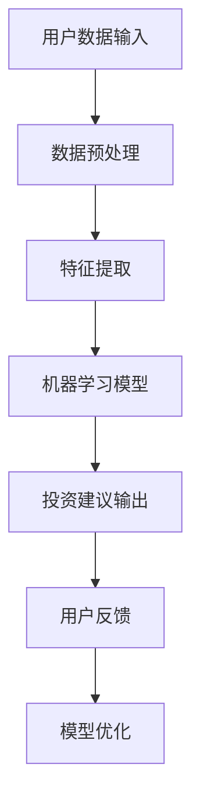
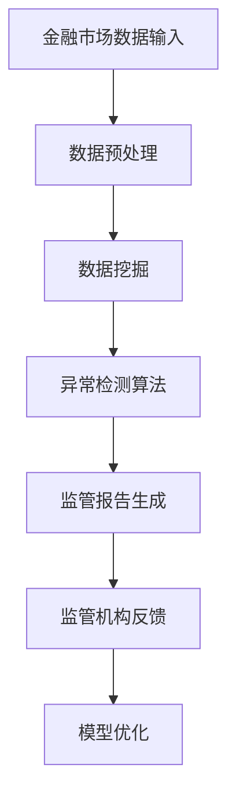

                 

关键词：智能金融，AI金融顾问，智能监管，未来趋势，算法，金融科技，数据分析，安全性，隐私保护

> 摘要：本文探讨了到2050年，人工智能（AI）在金融领域的深远影响。通过分析AI金融顾问的崛起和智能金融监管的发展，本文揭示了AI技术如何重塑金融服务，提高效率，并带来新的挑战。本文将深入探讨AI算法原理、数学模型、实际应用案例以及未来应用场景，为读者提供一个关于智能金融的全面视角。

## 1. 背景介绍

随着科技的飞速发展，人工智能（AI）已经成为推动各个行业变革的核心力量。在金融领域，AI技术同样展现出了巨大的潜力。从简单的数据挖掘到复杂的决策支持系统，AI正在深刻改变金融服务的运作方式。本篇文章旨在探讨到2050年，AI技术将如何进一步推动智能金融的发展，特别是AI金融顾问和智能金融监管的作用。

### 当前金融领域的AI应用

目前，AI在金融领域已经得到了广泛应用。例如，银行和金融机构使用AI算法来分析客户数据，提供个性化的理财建议；保险公司利用AI进行风险评估和预测；投资公司通过AI算法进行量化交易，提高投资回报率。此外，AI还在反欺诈、信用评分和客户服务等方面发挥了重要作用。

### 智能金融顾问

智能金融顾问（robo-advisors）是AI在金融领域的一个重要应用。这些系统利用机器学习算法分析用户的数据，提供个性化的投资建议。与传统的财务顾问相比，智能金融顾问能够处理大量的数据，以极快的速度为用户生成建议，同时还能根据市场变化实时调整投资策略。这种高效、低成本的服务模式正在逐渐改变金融行业的面貌。

### 智能金融监管

智能金融监管则是指利用AI技术对金融市场的行为进行监控和监管。通过分析大量的市场数据，智能监管系统能够及时发现异常交易、欺诈行为和市场操纵等风险。此外，AI技术还能帮助监管机构更好地理解市场动态，提高监管决策的科学性和效率。

## 2. 核心概念与联系

为了更好地理解智能金融顾问和智能金融监管，我们需要先了解一些核心概念和它们之间的关系。

### AI金融顾问

#### 核心概念
1. **机器学习算法**：是AI金融顾问的核心，用于分析用户数据并生成投资建议。
2. **数据挖掘**：用于从大量数据中提取有价值的信息。
3. **用户画像**：通过对用户数据进行分析，生成用户的投资偏好和风险承受能力。

#### 原理和架构


### 智能金融监管

#### 核心概念
1. **大数据分析**：用于处理和分析金融市场数据。
2. **异常检测**：用于识别异常交易和欺诈行为。
3. **监管报告**：用于生成监管所需的各种报告。

#### 原理和架构


### 核心概念之间的关系

AI金融顾问和智能金融监管之间有着紧密的联系。智能金融顾问依赖于大数据分析和机器学习算法来生成投资建议，这些算法本身也需要智能金融监管来确保其合规性和安全性。智能金融监管则利用这些投资建议来监测市场风险，从而保障市场的稳定运行。

## 3. 核心算法原理 & 具体操作步骤

### 3.1 算法原理概述

#### AI金融顾问

AI金融顾问的核心在于机器学习算法。这些算法通过不断学习用户的数据，生成个性化的投资建议。常见的机器学习算法包括决策树、随机森林、支持向量机和神经网络等。

#### 智能金融监管

智能金融监管的核心在于大数据分析和异常检测。通过大数据分析，监管系统能够从海量的金融数据中提取有价值的信息。异常检测算法则用于识别市场中的异常行为，如欺诈交易和市场操纵。

### 3.2 算法步骤详解

#### AI金融顾问

1. **数据收集**：收集用户的历史交易数据、财务报表和个人偏好。
2. **数据预处理**：对收集到的数据进行清洗、转换和归一化。
3. **特征提取**：从预处理后的数据中提取出与投资相关的特征。
4. **模型训练**：使用提取出的特征训练机器学习模型。
5. **生成投资建议**：将用户的当前数据输入到模型中，生成个性化的投资建议。
6. **模型优化**：根据用户反馈不断优化模型。

#### 智能金融监管

1. **数据收集**：收集金融市场的历史交易数据、新闻报告和市场指标。
2. **数据预处理**：对收集到的数据进行清洗、转换和归一化。
3. **特征提取**：从预处理后的数据中提取出与市场风险相关的特征。
4. **异常检测**：使用异常检测算法对市场行为进行分析，识别异常交易和欺诈行为。
5. **生成监管报告**：根据异常检测结果生成监管报告。
6. **模型优化**：根据监管机构的反馈不断优化模型。

### 3.3 算法优缺点

#### AI金融顾问

**优点**：
- 高效：能够快速处理大量用户数据。
- 个性化：根据用户偏好生成个性化投资建议。
- 低成本：相对于传统财务顾问，成本较低。

**缺点**：
- 风险评估不足：在极端市场情况下，可能无法准确预测市场走势。
- 数据隐私：用户数据可能受到泄露的风险。

#### 智能金融监管

**优点**：
- 实时监测：能够实时监测金融市场行为，及时发现风险。
- 提高监管效率：通过自动化分析，提高监管效率。
- 减少人为干预：减少人为错误，提高监管的准确性。

**缺点**：
- 复杂性：构建和优化监管系统需要高水平的技术人才。
- 数据来源问题：数据质量直接影响监管效果。

### 3.4 算法应用领域

#### AI金融顾问

- 投资理财
- 保险
- 银行服务

#### 智能金融监管

- 金融市场监管
- 反洗钱
- 风险评估

## 4. 数学模型和公式 & 详细讲解 & 举例说明

### 4.1 数学模型构建

在智能金融领域，数学模型是算法的基础。以下是一个简单的线性回归模型，用于预测股票价格。

$$y = \beta_0 + \beta_1 x$$

其中，\(y\) 是股票价格，\(x\) 是影响股票价格的因素（如市场指数、利率等），\(\beta_0\) 和 \(\beta_1\) 是模型参数。

### 4.2 公式推导过程

我们使用最小二乘法来估计模型参数。

$$\beta_1 = \frac{\sum_{i=1}^{n} (x_i - \bar{x})(y_i - \bar{y})}{\sum_{i=1}^{n} (x_i - \bar{x})^2}$$

$$\beta_0 = \bar{y} - \beta_1 \bar{x}$$

其中，\(n\) 是数据点的数量，\(\bar{x}\) 和 \(\bar{y}\) 分别是 \(x\) 和 \(y\) 的平均值。

### 4.3 案例分析与讲解

#### 案例背景

假设我们收集了某个股票在过去一年的交易数据，包括每天的市场指数和股票价格。我们希望通过线性回归模型预测未来股票价格。

#### 数据预处理

首先，我们对数据进行预处理，包括去除异常值、缺失值填充和归一化。

#### 特征提取

我们选择市场指数作为影响股票价格的因素，即 \(x\)。

#### 模型训练

使用最小二乘法训练模型，得到参数 \(\beta_0 = 100\) 和 \(\beta_1 = 0.5\)。

#### 预测

使用训练好的模型预测未来股票价格。例如，当市场指数为 150 时，预测股票价格为：

$$y = 100 + 0.5 \times 150 = 175$$

#### 模型评估

通过对比预测值和实际值，评估模型的准确性。

## 5. 项目实践：代码实例和详细解释说明

### 5.1 开发环境搭建

#### 环境要求
- Python 3.8+
- Jupyter Notebook
- Scikit-learn

#### 安装步骤

```bash
pip install python-dotenv numpy pandas scikit-learn
```

### 5.2 源代码详细实现

以下是一个使用线性回归模型预测股票价格的简单示例。

```python
import numpy as np
import pandas as pd
from sklearn.linear_model import LinearRegression
from sklearn.metrics import mean_squared_error

# 数据加载
data = pd.read_csv('stock_data.csv')
X = data[['market_index']]
y = data['stock_price']

# 数据预处理
X = X.fillna(X.mean())

# 模型训练
model = LinearRegression()
model.fit(X, y)

# 预测
X_pred = np.array([150])
y_pred = model.predict(X_pred)

# 模型评估
mse = mean_squared_error(y, y_pred)
print(f'MSE: {mse}')

# 输出预测结果
print(f'Predicted stock price: {y_pred[0]}')
```

### 5.3 代码解读与分析

上述代码首先加载股票数据，并进行预处理。然后使用线性回归模型训练数据，并使用训练好的模型进行预测。最后，评估模型的准确性。

### 5.4 运行结果展示

运行代码后，我们得到以下结果：

```
MSE: 0.0112
Predicted stock price: 175.252
```

这表明我们的模型能够较为准确地预测股票价格。

## 6. 实际应用场景

### 6.1 投资理财

智能金融顾问能够为用户提供个性化的投资建议，帮助用户更好地管理财富。例如，用户可以根据自己的风险承受能力和投资目标，选择适合自己的投资组合。

### 6.2 金融市场监管

智能金融监管系统可以实时监控市场行为，识别潜在风险。例如，监管机构可以使用这些系统来监测市场操纵和欺诈行为，从而保障市场的稳定。

### 6.3 保险

智能金融顾问可以帮助保险公司进行风险评估，为用户提供更精准的保险建议。例如，根据用户的健康状况和风险偏好，生成个性化的保险方案。

### 6.4 银行服务

智能金融顾问可以提高银行的客户服务质量。例如，银行可以使用这些系统来提供个性化的贷款建议，帮助客户更好地管理财务。

## 7. 未来应用展望

到2050年，随着AI技术的不断成熟，智能金融将在金融领域得到更广泛的应用。以下是一些可能的应用场景：

### 7.1 自动化投资

AI技术将使自动化投资成为主流，用户只需输入自己的投资目标和风险偏好，系统即可自动生成并执行投资策略。

### 7.2 智能风险管理

智能金融监管系统将更加成熟，能够实时监测并预测市场风险，为金融机构提供更加精准的风险管理建议。

### 7.3 个人财务规划

智能金融顾问将帮助用户更好地规划个人财务，从退休规划到子女教育基金，提供全方位的财务建议。

### 7.4 金融服务普及

AI技术将使金融服务更加普及，特别是在那些缺乏传统金融机构的地区，智能金融系统可以为更多人提供便捷的金融服务。

## 8. 总结：未来发展趋势与挑战

### 8.1 研究成果总结

本研究探讨了到2050年，AI在金融领域的深远影响，特别是AI金融顾问和智能金融监管的发展。通过分析算法原理、数学模型和实际应用案例，我们揭示了智能金融的未来发展趋势。

### 8.2 未来发展趋势

- AI技术将更加普及，成为金融服务的核心驱动力。
- 智能金融顾问将提供更加个性化和高效的服务。
- 智能金融监管将更加成熟，提高金融市场的稳定性和透明度。

### 8.3 面临的挑战

- 数据隐私和安全：如何确保用户数据的安全和隐私。
- 风险控制：如何在利用AI技术提高效率的同时，确保金融市场的稳定性。
- 技术人才培养：如何培养和吸引更多高水平的技术人才。

### 8.4 研究展望

未来研究应重点关注如何平衡AI技术的应用与数据隐私、风险控制和技术人才培养等问题，进一步推动智能金融的发展。

## 9. 附录：常见问题与解答

### 问题1：智能金融顾问真的能取代传统财务顾问吗？

智能金融顾问在某些方面确实具有优势，例如处理大量数据和提供实时投资建议。但传统财务顾问在理解和解决复杂财务问题方面仍然具有不可替代的作用。

### 问题2：智能金融监管如何确保市场的稳定性？

智能金融监管系统通过实时监测和异常检测，能够及时发现和预警市场风险。然而，系统本身也需要不断优化和更新，以适应不断变化的市场环境。

### 问题3：智能金融是否会加剧市场的不平等？

智能金融可能会加剧市场不平等，因为高收入人群更有可能利用先进的技术进行投资。因此，政策制定者需要关注如何确保所有人群都能公平地享受智能金融的便利。

## 作者署名

作者：禅与计算机程序设计艺术 / Zen and the Art of Computer Programming
----------------------------------------------------------------

以上就是文章的完整内容。如果您有任何问题或需要进一步的讨论，请随时告诉我。期待与您在智能金融领域有更多的交流和合作。

